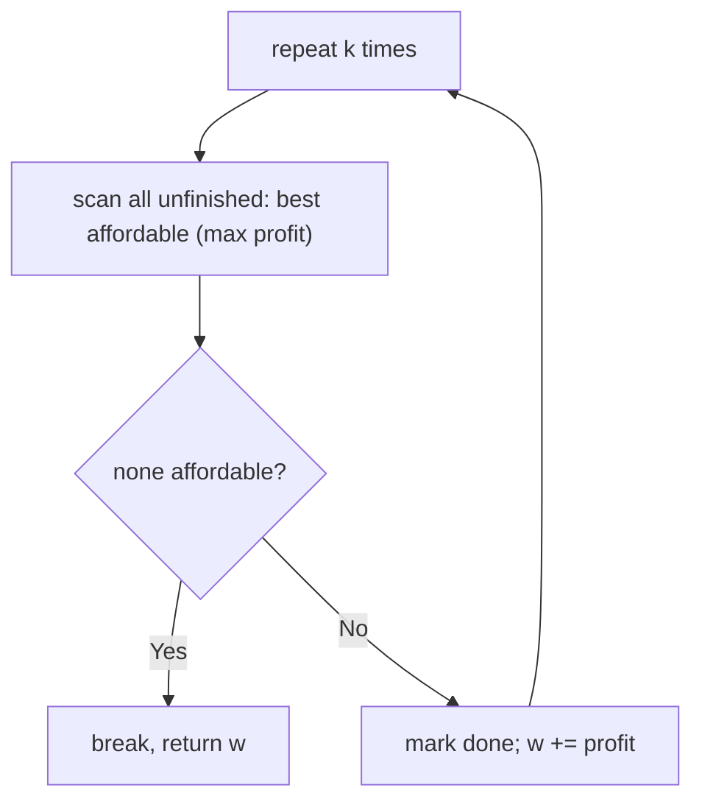
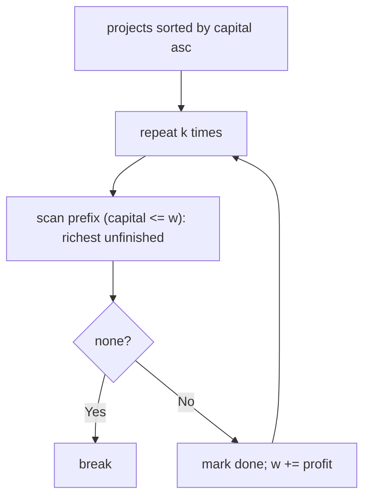
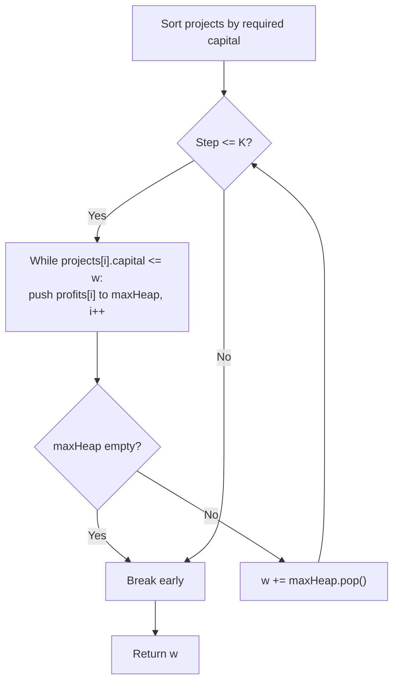

# 502. IPO

- **LeetCode Link**: `https://leetcode.com/problems/ipo/`
- **Difficulty**: Hard
- **Pattern Category**: Heap / Greedy Capital Expansion
- **Prerequisite Primer**: `00-foundations/02-data-structure-polyfills.md`

---

## 1. Problem Overview & Edge Case Matrix

### Problem Statement
Suppose LeetCode will start its IPO soon. You have `w` initial capital and can complete at most `k` distinct projects. Each project `i` needs `capital[i]` minimum capital to start and yields `profits[i]` upon completion. Pick at most `k` projects to maximize the final capital. Return the final maximized capital.

```
Example 1:
Input: k = 2, w = 0, profits = [1,2,3], capital = [0,1,1]
Output: 4
Explanation: Start with 0. Project 0 (capital 0, profit 1) -> w = 1.
  Then project 1 or 2 (capital 1) -> pick profit 3 -> w = 4.

Example 2:
Input: k = 3, w = 0, profits = [1,2,3], capital = [0,1,2]
Output: 6
Explanation: Chain 0 -> 1 -> 2: w = 0 + 1 + 2 + 3 = 6.
```

### Visual Problem Representation
```
w = 0, k = 2:   affordable {P0(c0,p1)} -> take P0, w = 1
                affordable {P1(c1,p2), P2(c1,p3)} -> take max P2, w = 4
                greedy: always the richest AFFORDABLE project (never borrow)
```

### Upfront Edge Case Matrix
| Edge Case Category | Specific Input Scenario | Expected Behavior | Pitfall / Risk |
| :--- | :--- | :--- | :--- |
| Nothing affordable | `w = 0`, all `capital > 0` | Return `w` unchanged | Looping `k` idle rounds / crashing |
| `k` exceeds projects | `k = 10⁶`, `n = 5` | Take all affordable, stop | Index overrun past project list |
| Zero-profit projects | `profits = [0,0]` | Capital unchanged, still "completes" | Skipping zero gains that unlock nothing (harmless but fine) |
| Capital chains | Ex.2 sequential unlocks | Chain fully | Greedy must re-scan affordability each round |
| Huge `k` | `k = 10⁵`, `n = 10⁵` | Fast termination | $O(k·n)$ blowup without a heap |

---

## 2. Level 1: Brute Force Approach

### Intuition & Visual Idea
Each of `k` rounds: linear-scan ALL unfinished projects for the richest affordable one, take it, grow capital. No sorting, no heap — $O(k·n)$ rescanning.



### Pseudocode
```text
FUNCTION findMaximizedCapitalBruteForce(k, w, profits, capital):
    done = BOOLEAN ARRAY (false)
    REPEAT k TIMES:
        best = -1
        FOR i IN 0 .. n - 1:
            IF NOT done[i] AND capital[i] <= w AND (best == -1 OR profits[i] > profits[best]):
                best = i
        IF best == -1: BREAK
        done[best] = true; w += profits[best]
    RETURN w
```

### Step-by-Step Dry Run (Visual Trace)
| Step | Iteration / Pointer ($i, j$) | Current Value | State / Sub-array | Action Taken |
| :--- | :--- | :--- | :--- | :--- |
| 0 | round 1 scan | affordable: P0 only | `best = 0` | Take P0, `w = 1` |
| 1 | round 2 scan | affordable: P1(p2), P2(p3) | `best = 2` | Take P2, `w = 4` |
| 2 | return | — | — | Return `4` |

### Modern JavaScript Implementation
```javascript
/**
 * Level 1: Brute Force (k rounds × full rescan)
 * Time Complexity:  O(k·n) — full scan per round; hopeless at scale
 * Space Complexity: O(n) — done flags
 */
function findMaximizedCapitalBruteForce(k, w, profits, capital) {
  const n = profits.length;
  const done = new Array(n).fill(false);
  for (let round = 0; round < k; round++) {
    // Richest affordable unfinished project (linear scan).
    let best = -1;
    for (let i = 0; i < n; i++) {
      if (!done[i] && capital[i] <= w && (best === -1 || profits[i] > profits[best])) {
        best = i;
      }
    }
    if (best === -1) break; // nothing affordable: further rounds change nothing
    done[best] = true;
    w += profits[best];
  }
  return w;
}
```

### Complexity Breakdown
- **Time Complexity**: $O(k·n)$ — every round rescans every project.
- **Space Complexity**: $O(n)$ — completion flags.

---

## 3. Level 2: Optimized Approach

### Intuition & Visual Bottleneck Elimination
Sort projects by capital once; each round scans only the affordable PREFIX for the richest unfinished project. Sorting kills the unaffordable tail early ($O(n \log n)$ once), but rounds still linearly scan the prefix.



### Pseudocode
```text
FUNCTION findMaximizedCapitalSorted(k, w, profits, capital):
    projects = ZIP(capital, profits) SORTED BY capital ASC
    done = BOOLEAN ARRAY
    REPEAT k TIMES:
        best = -1
        FOR i IN 0 .. n - 1 WHILE projects[i].capital <= w:
            IF NOT done[i] AND (best == -1 OR projects[i].profit > projects[best].profit):
                best = i
        IF best == -1: BREAK
        done[best] = true; w += projects[best].profit
    RETURN w
```

### Step-by-Step Dry Run (Visual Trace)
| Step | Pointers / Window | Hash Map / Auxiliary State | Decision Logic | Output Accumulator |
| :--- | :--- | :--- | :--- | :--- |
| 0 | sorted `[(0,1),(1,2),(1,3)]` | `w = 0` | Prefix: index `0` only | Take profit `1`, `w = 1` |
| 1 | prefix extends | `w = 1` | Prefix: all three; richest `3` | Take profit `3`, `w = 4` |
| 2 | return | — | — | Return `4` |

### Modern JavaScript Implementation
```javascript
/**
 * Level 2: Optimized (sorted capital + prefix scan)
 * Time Complexity:  O(n log n + k·n) — sort once, linear prefix per round
 * Space Complexity: O(n) — sorted pairs plus done flags
 */
function findMaximizedCapitalSorted(k, w, profits, capital) {
  // Sort by entry ticket: the affordable set is always a PREFIX.
  const projects = profits
    .map((profit, i) => [capital[i], profit])
    .sort((a, b) => a[0] - b[0]);
  const done = new Array(projects.length).fill(false);
  for (let round = 0; round < k; round++) {
    let best = -1;
    // Sorted order: stop at the first UNAFFORDABLE project.
    for (let i = 0; i < projects.length && projects[i][0] <= w; i++) {
      if (!done[i] && (best === -1 || projects[i][1] > projects[best][1])) best = i;
    }
    if (best === -1) break;
    done[best] = true;
    w += projects[best][1];
  }
  return w;
}
```

### Complexity Breakdown
- **Time Complexity**: $O(n \log n + k·n)$ — sorting helps, but rounds still scan.
- **Space Complexity**: $O(n)$ — pairs plus flags; the per-round scan is the remaining bottleneck.

---

## 4. Level 3: Most Optimal / Canonical Approach

### Intuition & Mathematical / Invariant Proof
Greedy + two structures: projects sorted by capital feed a MAX-heap of profits as they become affordable; each round pops the heap top (richest affordable). Greedy is optimal here because taking the richest affordable project never harms future affordability (capital only grows — an exchange argument: any optimal sequence can swap its first differing pick for the greedy pick without losing feasibility or value). Invariant: the heap holds exactly the affordable-but-untaken profits at each round's start.

```
sorted by capital: [(0,1),(1,2),(1,3)], w=0
round 1: feed (0,1); heap [1]; pop 1 -> w=1
round 2: feed (1,2),(1,3); heap [2,3]; pop 3 -> w=4
```

### Pseudocode
```text
FUNCTION findMaximizedCapital(k, w, profits, capital):
    projects = ZIP SORTED BY capital ASC; ptr = 0
    heap = EMPTY MAX-HEAP (by profit)
    REPEAT k TIMES:
        WHILE ptr < n AND projects[ptr].capital <= w:
            heap.PUSH(projects[ptr].profit); ptr++
        IF heap EMPTY: BREAK
        w += heap.POP()
    RETURN w
```

### Step-by-Step Dry Run (Visual Trace)
| Step | Pointer $L$ | Pointer $R$ | Invariant Checked | In-Place State |
| :--- | :--- | :--- | :--- | :--- |
| 1 | feed `ptr=0` | `(0,1)` affordable | Heap `[1]` | Pop `1`, `w = 1` |
| 2 | feed `ptr=1,2` | `(1,2),(1,3)` now affordable | Heap `[2,3]` | Pop `3`, `w = 4` |
| 3 | rounds exhausted | — | — | Return `4` |

### Modern JavaScript Implementation
```javascript
/**
 * Minimal binary max-heap (mirror of the MinHeap in Kth Largest).
 * Supports push / pop / size in O(log N).
 */
class MaxHeap {
  constructor() {
    this.h = [];
  }

  get size() {
    return this.h.length;
  }

  push(v) {
    const h = this.h;
    h.push(v);
    // Sift up: swap with the parent while bigger.
    let i = h.length - 1;
    while (i > 0) {
      const p = (i - 1) >> 1;
      if (h[p] >= h[i]) break;
      [h[p], h[i]] = [h[i], h[p]];
      i = p;
    }
  }

  pop() {
    const h = this.h;
    const top = h[0];
    const last = h.pop();
    if (h.length > 0) {
      h[0] = last;
      // Sift down: swap with the bigger child while smaller.
      let i = 0;
      for (;;) {
        const l = 2 * i + 1;
        const r = 2 * i + 2;
        let s = i;
        if (l < h.length && h[l] > h[s]) s = l;
        if (r < h.length && h[r] > h[s]) s = r;
        if (s === i) break;
        [h[s], h[i]] = [h[i], h[s]];
        i = s;
      }
    }
    return top;
  }
}

/**
 * Level 3: Most Optimal / Canonical (sorted feed + max-heap greedy)
 * Time Complexity:  O(n log n + k log n) — sort once, heap ops per round
 * Space Complexity: O(n) — pairs plus heap
 */
function findMaximizedCapital(k, w, profits, capital) {
  // Entry-ticket order: pointer only advances, each project fed once.
  const projects = profits
    .map((profit, i) => [capital[i], profit])
    .sort((a, b) => a[0] - b[0]);
  let ptr = 0;
  const heap = new MaxHeap(); // affordable-but-untaken profits
  for (let round = 0; round < k; round++) {
    // Feed everything newly affordable at current capital.
    while (ptr < projects.length && projects[ptr][0] <= w) {
      heap.push(projects[ptr][1]);
      ptr++;
    }
    if (heap.size === 0) break; // stalled: no affordable project exists
    w += heap.pop(); // greedy: richest affordable can never hurt
  }
  return w;
}
```

### Complexity Breakdown
- **Time Complexity**: $O(n \log n + k \log n)$ — optimal shape; each project fed and popped at most once.
- **Space Complexity**: $O(n)$ — pairs plus heap; time is what improved, space is inherent.

---

## 5. JavaScript-Specific Gotchas & V8 Optimizations
- **GC Pressure**: Avoid allocating objects inside tight loops ($O(N)$ closures). The `[capital, profit]` pairs allocate once up front (fine); never allocate per-round candidate arrays — the heap absorbs that role.
- **Type Coercion / Sorting**: `.sort((a, b) => a[0] - b[0])` numeric comparator is mandatory (default lexicographic sort misorders `[10, 9]`); destructure pairs consistently (`[capital, profit]` order) or entry-ticket/profit fields swap silently.
- **Index Bounds**: `ptr` never resets — the feed pointer is monotonic because capital only grows (affordability is monotone); re-scanning from `0` each round is Level 1's exact waste. `heap.size === 0 → break` prevents popping `undefined` into `w` (which would NaN-poison all downstream rounds).

---

## 6. Real-World MAANG Interview Follow-Ups & Extensions

### Follow-Up 1: At most k projects with deadlines (scheduling twin)
- **Scenario**: Each project also has a deadline; schedule ≤k before deadlines for max profit (LeetCode 1235-style).
- **Solution Strategy**: Sort by deadline, min-heap of taken profits: take each project, and if over capacity (or past deadline), drop the smallest-taken. Same heap-greedy DNA, inverted heap.
- **JS Code / Implementation Pattern**:
```javascript
function scheduleWithDeadlines(jobs, k) {
  const heap = new MinHeap(); // taken profits; smallest evicted first
  for (const job of jobs.sort((a, b) => a.deadline - b.deadline)) {
    heap.push(job.profit);
    if (heap.size > k) heap.pop();
  }
  return drainSum(heap);
}
```

### Follow-Up 2: $10^9$ projects with streaming capitals
- **Scenario**: Projects stream; only affordable candidates fit in RAM.
- **Solution Strategy**: External sort by capital (or bucketed feed), then Level 3 unchanged — the heap holds only affordable-so-far, bounded by what capital unlocks, not by $n$.
- **JS Code / Implementation Pattern**:
```javascript
async function ipoStreamed(k, w, projectStream) {
  const heap = new MaxHeap();
  const spill = externalSortByCapital(projectStream);
  return greedyRounds(k, w, spill, heap);
}
```

### Follow-Up 3: Concurrent capital with competing investors
- **Scenario & In-Depth Solution**: Multiple investors race the same project pool (each project completable once). Greedy per investor over-shoots — serialize takes through a compare-and-swap on project state, or partition the pool upfront by capital bands. Throughput vs optimality tradeoff: banded pools keep $O(n \log n)$ total with no locks, at small optimality loss.
```javascript
function claimProject(states, i, investorId) {
  if (states[i] !== 'open') return false;
  states[i] = investorId; // CAS in production; single-threaded here
  return true;
}
```

---

## 7. What LeetCode Discuss Says (Language-Independent)

Source: top-voted post by Abhinash Singh —
`https://leetcode.com/problems/ipo/solutions/3219987/day-54-c-priority_queue-easiest-beginner-m55e/`
— 42.3K views.
Language-independent summary. No new JS here.

### A. Optimal way from Discuss (Greedy Sorted Capital + Max-Heap for Available Profits)

Since completed projects only add non-negative profit and capital never decreases, projects once affordable remain affordable permanently:

1. **Preprocessing:** Pair each project's required capital with its profit `(capital[i], profits[i])` and sort the pairs ascending by required capital.
2. **Priority Pool:** Maintain a max-heap of profits representing projects that are currently affordable.
3. **Greedy Selection:**
   - Maintain an index pointer `i = 0` tracking the first unaffordable project.
   - For up to $K$ iterations:
     - While `i < n` and `projects[i].capital <= w`:
       - Push `projects[i].profit` into the max-heap.
       - Increment `i`.
     - If the max-heap is empty, break early (no affordable projects remain).
     - Extract the highest profit from the max-heap and add it to `w`.
4. Return accumulated capital `w`.

```text
FUNCTION findMaximizedCapital(k, w, profits, capital):
    n = length(profits)
    projects = ARRAY OF PAIRS (capital[i], profits[i]) FOR i IN 0..n-1
    SORT projects ASCENDING BY capital

    maxHeap = new MaxHeap()
    i = 0

    FOR step FROM 1 TO k:
        WHILE i < n AND projects[i].capital <= w:
            maxHeap.push(projects[i].profit)
            i = i + 1

        IF maxHeap.isEmpty():
            BREAK

        w = w + maxHeap.pop()

    RETURN w
```

- Time: O(N log N + K log N) — sorting takes $O(N \log N)$ and each project is pushed/popped from the heap at most once ($O(N \log N + K \log N)$).
- Space: O(N) to store paired projects and heap elements.



### B. Dry run on LeetCode Example 1 (`k = 2, w = 0, profits = [1,2,3], capital = [0,1,1]`)

- Paired & sorted: `[(0, 1), (1, 2), (1, 3)]`.
- Iteration 1:
  - Capital $w = 0$.
  - `i = 0`: `projects[0].capital = 0 <= 0` -> push profit 1 to heap. `i = 1`.
  - `i = 1`: `projects[1].capital = 1 > 0` -> stop unlocking.
  - Heap: `[1]`. Pop max (1) -> $w = 0 + 1 = 1$.
- Iteration 2:
  - Capital $w = 1$.
  - `i = 1`: `projects[1].capital = 1 <= 1` -> push profit 2. `i = 2`.
  - `i = 2`: `projects[2].capital = 1 <= 1` -> push profit 3. `i = 3`.
  - Heap: `[3, 2]`. Pop max (3) -> $w = 1 + 3 = 4$.
- Completed $K=2$ rounds. Return $w = 4$.

Final result: `4`.

### C. Why Greedy Choice Yields Global Optimum

- Capital thresholds do not deduct capital upon completion; they only gate eligibility.
- Choosing the maximum available profit at step $t$ yields the highest possible new capital $w_{t+1}$, which strictly supersedes or equals the set of projects unlockable by any alternative choice, guaranteeing global optimality (greedy choice property).

### D. Pitfalls from comments

- **Repeated Linear Scans:** Scanning all $N$ projects every round takes $O(K \times N)$ time, resulting in TLE on LeetCode's large test suites ($N, K = 10^5$). Pre-sorting ensures each project is pushed into the heap exactly once.
- **Premature Underflow:** Attempting to pop from an empty heap when $w$ is insufficient to unlock any remaining projects will cause a runtime exception if the emptiness check is omitted.

### E. Companies

- Discuss post itself names none.
  Companies tab on LeetCode is premium-locked.
- External source:
  `https://github.com/liquidslr/leetcode-company-wise-problems`
  (LeetCode company tags, updated June 2025).
- All-time (8): Amazon, Bloomberg, Google, Meta, Microsoft, Samsung, Stackline, Uber.
- Recent: 30 days — None.
- Recent: 3 months — Amazon, Google.
