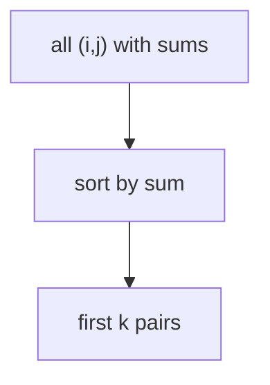
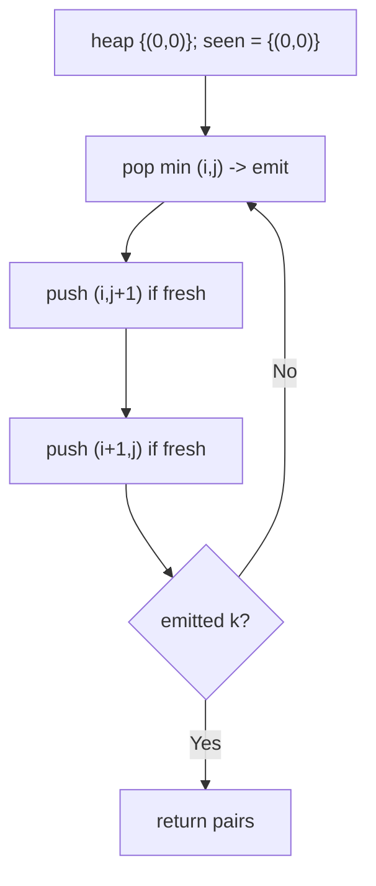
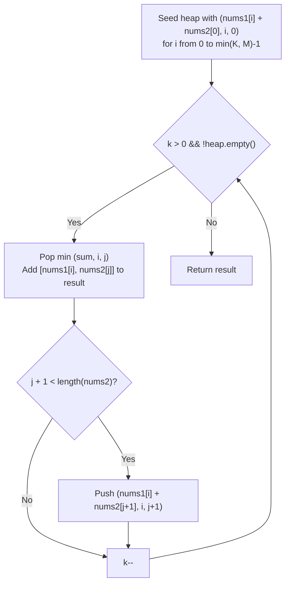

# 373. Find K Pairs with Smallest Sums

- **LeetCode Link**: `https://leetcode.com/problems/find-k-pairs-with-smallest-sums/`
- **Difficulty**: Medium
- **Pattern Category**: Heap / Best-First Grid Expansion
- **Prerequisite Primer**: `00-foundations/02-data-structure-polyfills.md`

---

## 1. Problem Overview & Edge Case Matrix

### Problem Statement
You are given two integer arrays `nums1` and `nums2` sorted in non-decreasing order and an integer `k`. Define a pair `(u, v)` with `u` from `nums1` and `v` from `nums2`. Return the `k` pairs with the smallest sums.

```
Example 1:
Input: nums1 = [1,7,11], nums2 = [2,4,6], k = 3
Output: [[1,2],[1,4],[1,6]]
Explanation: sums are 3, 5, 7 — the whole first row wins.

Example 2:
Input: nums1 = [1,1,2], nums2 = [1,2,3], k = 2
Output: [[1,1],[1,1]]
```

### Visual Problem Representation
```
sums grid (rows nums1, cols nums2):

          2   4   6
      +-----------+
   1  | 3 | 5 | 7 |      k=3 takes the shaded row frontier
   7  | 9 |11 |13 |
  11  |13 |15 |17 |
      +-----------+      rows AND columns ascend: expansion is safe
```

### Upfront Edge Case Matrix
| Edge Case Category | Specific Input Scenario | Expected Behavior | Pitfall / Risk |
| :--- | :--- | :--- | :--- |
| Empty input | Either array `[]` | Return `[]` | Heap seeded with invalid pair |
| `k = 0` (defensive) | Any arrays | Return `[]` | Loop emitting one pair |
| `k` exceeds pairs | `k = 10`, only 9 pairs | Return all 9 | Index overrun past grid edge |
| Duplicates | `[1,1,2] × [1,2,3]` | Duplicate PAIRS kept | Dedup logic that must NOT exist |
| First row/col dominance | Ex.1 (whole answer in row 0) | Correct frontier walk | Expansion that only goes down |

---

## 2. Level 1: Brute Force Approach

### Intuition & Visual Idea
Enumerate all $m·n$ pairs with their sums, sort by sum, take the first $k$. Obviously correct — $O(mn \log mn)$ time and $O(mn)$ space for $k$ answers.



### Pseudocode
```text
FUNCTION kSmallestPairsBruteForce(nums1, nums2, k):
    pairs = []
    FOR i IN nums1: FOR j IN nums2: pairs.PUSH([nums1[i]+nums2[j], i, j])
    pairs.SORT_BY_SUM()
    RETURN pairs[.. k-1].MAP(([s,i,j]) => [nums1[i], nums2[j]])
```

### Step-by-Step Dry Run (Visual Trace)
| Step | Iteration / Pointer ($i, j$) | Current Value | State / Sub-array | Action Taken |
| :--- | :--- | :--- | :--- | :--- |
| 0 | enumerate 3×3 | 9 sums | Full grid materialized | Collect |
| 1 | sort by sum | `3,5,7,9,11,11,13,15,17` | Ordered | Sort |
| 2 | take 3 | `[1,2],[1,4],[1,6]` | — | Return |

### Modern JavaScript Implementation
```javascript
/**
 * Level 1: Brute Force (enumerate all, sort, slice)
 * Time Complexity:  O(m·n·log(m·n)) — full grid materialized and sorted
 * Space Complexity: O(m·n) — every pair stored
 */
function kSmallestPairsBruteForce(nums1, nums2, k) {
  const pairs = [];
  for (let i = 0; i < nums1.length; i++) {
    for (let j = 0; j < nums2.length; j++) {
      pairs.push([nums1[i] + nums2[j], i, j]);
    }
  }
  // Numeric comparator on the sum slot (index 0).
  pairs.sort((a, b) => a[0] - b[0]);
  return pairs.slice(0, k).map(([, i, j]) => [nums1[i], nums2[j]]);
}
```

### Complexity Breakdown
- **Time Complexity**: $O(mn \log mn)$ — enumerates and sorts the entire grid.
- **Space Complexity**: $O(mn)$ — all pairs; only $k$ are wanted.

---

## 3. Level 2: Optimized Approach

### Intuition & Visual Bottleneck Elimination
Best-first expansion from `(0,0)`: pop the smallest frontier pair, push its right `(i,j+1)` and down `(i+1,j)` neighbors (guarded by a visited set). Rows and columns ascend, so the popped pair is always globally next-smallest — $k$ pops, $O(k \log k)$.



### Pseudocode
```text
FUNCTION kSmallestPairsHeap(nums1, nums2, k):
    IF either EMPTY OR k == 0: RETURN []
    heap = MIN-HEAP([sum, i, j]); seen = SET("0,0")
    PUSH (nums1[0]+nums2[0], 0, 0)
    out = []
    WHILE out.LENGTH < k AND heap NOT EMPTY:
        [s, i, j] = heap.POP(); out.PUSH([nums1[i], nums2[j]])
        IF j+1 < len2 AND FRESH(i, j+1): PUSH
        IF i+1 < len1 AND FRESH(i+1, j): PUSH
    RETURN out
```

### Step-by-Step Dry Run (Visual Trace)
| Step | Pointers / Window | Hash Map / Auxiliary State | Decision Logic | Output Accumulator |
| :--- | :--- | :--- | :--- | :--- |
| 0 | pop `(0,0)=3` | emit `[1,2]` | Push `(0,1)`, `(1,0)` | `[[1,2]]` |
| 1 | pop `(0,1)=5` | emit `[1,4]` | Push `(0,2)`, `(1,1)` | `[[1,2],[1,4]]` |
| 2 | pop `(0,2)=7` | emit `[1,6]` | `k = 3` reached | Return 3 pairs |

### Modern JavaScript Implementation
```javascript
/**
 * Compact [sum, i, j] min-heap helpers (pq- flavor: this level's namespace).
 */
function pqPush(h, item) {
  h.push(item);
  let i = h.length - 1;
  while (i > 0) {
    const p = (i - 1) >> 1;
    if (h[p][0] <= h[i][0]) break;
    [h[p], h[i]] = [h[i], h[p]];
    i = p;
  }
}

function pqPop(h) {
  const top = h[0];
  const last = h.pop();
  if (h.length > 0) {
    h[0] = last;
    let i = 0;
    for (;;) {
      const l = 2 * i + 1;
      const r = 2 * i + 2;
      let s = i;
      if (l < h.length && h[l][0] < h[s][0]) s = l;
      if (r < h.length && h[r][0] < h[s][0]) s = r;
      if (s === i) break;
      [h[s], h[i]] = [h[i], h[s]];
      i = s;
    }
  }
  return top;
}

/**
 * Level 2: Optimized (best-first grid expansion)
 * Time Complexity:  O(k log k) — k pops, ≤2k pushes
 * Space Complexity: O(k) — frontier plus visited set
 */
function kSmallestPairsHeap(nums1, nums2, k) {
  const out = [];
  if (nums1.length === 0 || nums2.length === 0 || k === 0) return out;
  const heap = [];
  const seen = new Set(); // freshPush(0, 0) below registers the seed cell
  const freshPush = (i, j) => {
    // Bounds + dedup: each grid cell enters the frontier at most once.
    if (i < nums1.length && j < nums2.length && !seen.has(i + ',' + j)) {
      seen.add(i + ',' + j);
      pqPush(heap, [nums1[i] + nums2[j], i, j]);
    }
  };
  freshPush(0, 0);
  while (out.length < k && heap.length > 0) {
    const [, i, j] = pqPop(heap);
    out.push([nums1[i], nums2[j]]);
    freshPush(i, j + 1); // right neighbor (same row, next column)
    freshPush(i + 1, j); // down neighbor (next row, same column)
  }
  return out;
}
```

### Complexity Breakdown
- **Time Complexity**: $O(k \log k)$ — each of $k$ answers costs one pop plus bounded pushes.
- **Space Complexity**: $O(k)$ — frontier plus visited keys; the set is bookkeeping overhead Level 3 drops.

---

## 4. Level 3: Most Optimal / Canonical Approach

### Intuition & Mathematical / Invariant Proof
Row-frontier heap without any visited set: seed with each row's first pair `(i, 0)` (at most $k$ rows matter — row $k$'s head already exceeds $k$ taken pairs), then repeatedly pop the minimum and advance within its row. Invariant: the heap always holds exactly the smallest untaken pair of each live row — so the popped pair is globally next-smallest. No 2D expansion, no dedup keys: each row contributes a clean 1D stream.

```
[1,7,11] × [2,4,6], k=3: seed (1,2),(7,2),(11,2) -> sums 3,9,13
  pop 3 -> [1,2], push (1,4)=5; pop 5 -> [1,4], push (1,6)=7; pop 7 -> [1,6]
```

### Pseudocode
```text
FUNCTION kSmallestPairs(nums1, nums2, k):
    IF either EMPTY OR k == 0: RETURN []
    heap = EMPTY MIN-HEAP
    FOR i IN 0 .. MIN(len1, k) - 1: PUSH (nums1[i]+nums2[0], i, 0)
    out = []
    WHILE out.LENGTH < k AND heap NOT EMPTY:
        [s, i, j] = heap.POP(); out.PUSH([nums1[i], nums2[j]])
        IF j+1 < len2: PUSH (nums1[i]+nums2[j+1], i, j+1)
    RETURN out
```

### Step-by-Step Dry Run (Visual Trace)
| Step | Pointer $L$ | Pointer $R$ | Invariant Checked | In-Place State |
| :--- | :--- | :--- | :--- | :--- |
| 1 | seed rows | sums `3, 9, 13` | One head per row | Heap size 3 |
| 2 | pop `3` | emit `[1,2]`, push `5` | Row 0 advances | `[[1,2]]` |
| 3 | pop `5` | emit `[1,4]`, push `7` | Row 0 advances | `[[1,2],[1,4]]` |
| 4 | pop `7` | emit `[1,6]` | `k` reached | Return 3 pairs |

### Modern JavaScript Implementation
```javascript
/**
 * Compact [sum, i, j] min-heap helpers (heap- flavor: this level's namespace).
 */
function heapPush(h, item) {
  h.push(item);
  let i = h.length - 1;
  while (i > 0) {
    const p = (i - 1) >> 1;
    if (h[p][0] <= h[i][0]) break;
    [h[p], h[i]] = [h[i], h[p]];
    i = p;
  }
}

function heapPop(h) {
  const top = h[0];
  const last = h.pop();
  if (h.length > 0) {
    h[0] = last;
    let i = 0;
    for (;;) {
      const l = 2 * i + 1;
      const r = 2 * i + 2;
      let s = i;
      if (l < h.length && h[l][0] < h[s][0]) s = l;
      if (r < h.length && h[r][0] < h[s][0]) s = r;
      if (s === i) break;
      [h[s], h[i]] = [h[i], h[s]];
      i = s;
    }
  }
  return top;
}

/**
 * Level 3: Most Optimal / Canonical (row-frontier heap)
 * Time Complexity:  O(k log k) — k pops over a ≤k-sized heap
 * Space Complexity: O(k) — frontier only; no visited set
 */
function kSmallestPairs(nums1, nums2, k) {
  const out = [];
  if (nums1.length === 0 || nums2.length === 0 || k === 0) return out;
  const heap = [];
  // Rows beyond k can never contribute (their heads lose to k taken pairs).
  const rows = Math.min(nums1.length, k);
  for (let i = 0; i < rows; i++) heapPush(heap, [nums1[i] + nums2[0], i, 0]);
  while (out.length < k && heap.length > 0) {
    const [, i, j] = heapPop(heap);
    out.push([nums1[i], nums2[j]]);
    // Advance within the SAME row: columns ascend, so the stream stays sorted.
    if (j + 1 < nums2.length) heapPush(heap, [nums1[i] + nums2[j + 1], i, j + 1]);
  }
  return out;
}
```

### Complexity Breakdown
- **Time Complexity**: $O(k \log k)$ — optimal shape; heap never exceeds $k$ entries.
- **Space Complexity**: $O(k)$ — frontier only; the visited set is proven unnecessary.

---

## 5. JavaScript-Specific Gotchas & V8 Optimizations
- **GC Pressure**: Avoid allocating objects inside tight loops ($O(N)$ closures). Heap entries are small `[sum, i, j]` arrays (unavoidable, bounded by $k$) — never box pairs into `{ sum, i, j }` objects (shape cost per entry).
- **Type Coercion / Sorting**: The visited key `i + ',' + j` must be a STRING — numeric `i + j` collides (`(1,2)` vs `(2,1)` both sum 3); template/comma keys keep cells distinct. Heap compares `[0]` (sum) only — ties keep insertion order harmlessly.
- **Index Bounds**: `Math.min(nums1.length, k)` row seeding is load-bearing — seeding ALL rows on a $10^4$-row input blows the $O(k)$ bound back to $O(m)$. `j + 1 < len2` guards the advance; the `heap.length > 0` loop guard covers `k`-exceeds-pairs.

---

## 6. Real-World MAANG Interview Follow-Ups & Extensions

### Follow-Up 1: K pairs with LARGEST sums / Kth pair sum only
- **Scenario**: Largest-first variant, or return just the k-th sum value.
- **Solution Strategy**: Mirror the heap (max-heap, seed last row/column, retreat); k-th sum alone still needs the $k$ pops (no shortcut — the frontier must advance to it).
- **JS Code / Implementation Pattern**:
```javascript
function kPairsLargestSums(nums1, nums2, k) {
  return kPairsFrontier(nums1, nums2, k, 'max'); // mirrored comparator + seeds
}
```

### Follow-Up 2: $10^9$-pair grid with $O(k)$ RAM
- **Scenario**: Arrays stream; the grid never materializes.
- **Solution Strategy**: Level 3 needs only row heads + indexed column access — page `nums2[j+1]` on advance ($O(k)$ fetches), keep `nums1` heads for seeded rows. The algorithm is already streaming-shaped.
- **JS Code / Implementation Pattern**:
```javascript
async function kPairsStreamed(rowHeads, fetchCol, k) {
  return rowFrontierHeap(rowHeads, fetchCol, k); // same kernel, paged reads
}
```

### Follow-Up 3: K-way join (pairs from N arrays)
- **Scenario & In-Depth Solution**: Smallest-sum tuples across $N$ sorted arrays. Generalize Level 3 iteratively: fold arrays pairwise (each fold is this problem), or run one $N$-dimensional best-first search with a visited set (Level 2 generalized). Pairwise folding reuses tested code — prefer it.
```javascript
function kTuplesSmallest(arrays, k) {
  // Fold pairwise: treat accumulated tuple-sums as nums1, next array as nums2.
  let frontier = arrays[0].map((v) => [v]); // 1-tuples
  for (let a = 1; a < arrays.length; a++) {
    frontier = extendTuples(frontier, arrays[a], k); // Level-3 kernel per fold
  }
  return frontier;
}
```

---

## 7. What LeetCode Discuss Says (Language-Independent)

Source: top-voted post by YIXUN WANG —
`https://leetcode.com/problems/find-k-pairs-with-smallest-sums/solutions/84551/simple-java-oklogk-solution-with-explana-iuy3/`
— 129.4K views.
Language-independent summary. No new JS here.

### A. Optimal way from Discuss (K-Way Merge Min-Heap Frontier)

Conceptually, the Cartesian product of `nums1` and `nums2` forms an $M \times N$ matrix where row $i$ consists of sums `nums1[i] + nums2[0], nums1[i] + nums2[1], ...`. Since both input arrays are sorted, every row is monotonically non-decreasing. Finding the $K$ smallest pairs is mathematically equivalent to multi-way merging $M$ sorted virtual lists:

1. **Frontier Seeding:** For each `nums1[i]` up to $\min(K, M)$, seed the min-heap with its initial minimum pairing: `(nums1[i] + nums2[0], i, 0)`.
2. **Extraction and Step-Forward:** While $K > 0$ and the heap is non-empty:
   - Pop the minimum sum triple `(sum, i, j)` from the heap.
   - Record `[nums1[i], nums2[j]]` in the output list.
   - If $j + 1 < N$ (next element exists in row $i$), insert `(nums1[i] + nums2[j + 1], i, j + 1)` into the heap.
   - Decrement $K$.
3. Return collected pairs.

```text
FUNCTION kSmallestPairs(nums1, nums2, k):
    IF nums1 is empty OR nums2 is empty OR k == 0:
        RETURN []

    minHeap = new MinHeap()
    result = []

    // Seed the first column of each row up to min(k, length(nums1))
    FOR i FROM 0 TO min(k, length(nums1)) - 1:
        minHeap.push({ sum: nums1[i] + nums2[0], i: i, j: 0 })

    WHILE k > 0 AND NOT minHeap.isEmpty():
        cur = minHeap.pop()
        result.append([nums1[cur.i], nums2[cur.j]])

        // Advance to next column in same row
        IF cur.j + 1 < length(nums2):
            nextJ = cur.j + 1
            minHeap.push({ sum: nums1[cur.i] + nums2[nextJ], i: cur.i, j: nextJ })

        k = k - 1

    RETURN result
```

- Time: O(K log(min(K, M))) — at most $\min(K, M)$ elements reside in the heap, and $K$ extraction/insertion cycles occur.
- Space: O(min(K, M)) auxiliary space for the heap.



### B. Dry run on LeetCode Example 1 (`nums1 = [1,7,11], nums2 = [2,4,6], k = 3`)

- Seed heap with `(i, 0)` for $i \in [0, 2]$:
  - $(1+2=3, 0, 0)$
  - $(7+2=9, 1, 0)$
  - $(11+2=13, 2, 0)$
- Iteration 1:
  - Pop min: `(3, 0, 0)`. Result: `[[1, 2]]`.
  - Next in row 0: push `(1+4=5, 0, 1)`. Heap has sums: `{5, 9, 13}`.
- Iteration 2:
  - Pop min: `(5, 0, 1)`. Result: `[[1, 2], [1, 4]]`.
  - Next in row 0: push `(1+6=7, 0, 2)`. Heap has sums: `{7, 9, 13}`.
- Iteration 3:
  - Pop min: `(7, 0, 2)`. Result: `[[1, 2], [1, 4], [1, 6]]`.
  - Row 0 exhausted ($j+1 = 3 \ge 3$). $K=0$. Stop.

Final result: `[[1,2], [1,4], [1,6]]`.

### C. Why Row-Seeded Frontier Eliminates Visited Sets

- In naive 2D Best-First Search, popping `(i, j)` and generating both `(i+1, j)` and `(i, j+1)` leads to duplicate states (e.g. `(1, 1)` reached from both `(0, 1)` and `(1, 0)`), necessitating an $O(K)$ hash table.
- Pre-seeding the first column `(i, 0)` and strictly advancing rightward along columns ensures every matrix cell `(i, j)` has exactly one unique predecessor `(i, j-1)`, eliminating duplicates by construction with zero hashing overhead.

### D. Pitfalls from comments

- **Over-seeding the Heap:** Seeding all $M$ rows when $M = 10^5$ and $K = 10$ wastes $O(M)$ space and degrades performance. Only seed up to $\min(K, M)$.
- **Integer Overflow in Comparator:** Subtracting sums (`a.sum - b.sum`) in languages like Java/C++ can overflow 32-bit signed integers if array values reach $10^9$. Use direct comparison (`a.sum < b.sum`).

### E. Companies

- Discuss post itself names none.
  Companies tab on LeetCode is premium-locked.
- External source:
  `https://github.com/liquidslr/leetcode-company-wise-problems`
  (LeetCode company tags, updated June 2025).
- All-time (10): Amazon, Bloomberg, Flipkart, Google, LinkedIn, Meta, Microsoft, Oracle, Uber, Walmart Labs.
- Recent: 30 days — None.
- Recent: 3 months — Microsoft.
