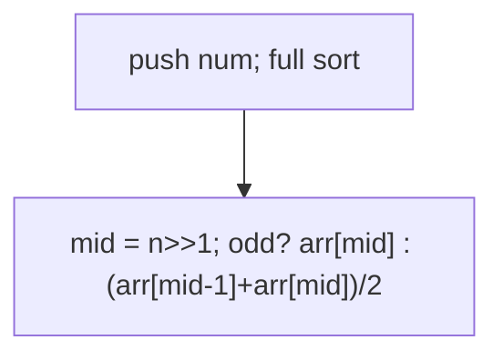
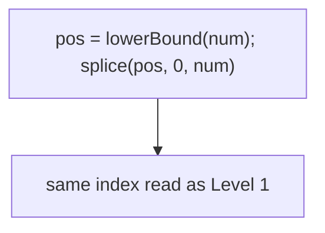

# 295. Find Median from Data Stream

- **LeetCode Link**: `https://leetcode.com/problems/find-median-from-data-stream/`
- **Difficulty**: Hard
- **Pattern Category**: Heap / Dual-Heap Order Statistics
- **Prerequisite Primer**: `00-foundations/02-data-structure-polyfills.md`

---

## 1. Problem Overview & Edge Case Matrix

### Problem Statement
The median is the middle value in an ordered integer list. If the size of the list is even, the median is the mean of the two middle values. Implement the `MedianFinder` class:

- `MedianFinder()` initializes the object.
- `void addNum(int num)` adds the integer `num` to the data structure.
- `double findMedian()` returns the median of all elements so far.

At least one element exists before `findMedian` is called, and at most $5×10^4$ calls will be made.

```
Example 1:
Input: ["MedianFinder","addNum","addNum","findMedian","addNum","findMedian"]
       [[],[1],[2],[],[3],[]]
Output: [null,null,null,1.5,null,2.0]
Explanation: after [1,2] median is 1.5; after [1,2,3] median is 2.
```

### Visual Problem Representation
```
add 1:   lo [1] | hi []              median 1
add 2:   lo [1] | hi [2]             median (1+2)/2 = 1.5
add 5:   lo [1] | hi [2,5]  -> rebalance -> lo [2,1] | hi [5]
         median = lo.peek() = 2
invariant: |lo| == |hi| or |lo| == |hi| + 1; every lo <= every hi
```

### Upfront Edge Case Matrix
| Edge Case Category | Specific Input Scenario | Expected Behavior | Pitfall / Risk |
| :--- | :--- | :--- | :--- |
| First element | `addNum(5)` then median | `5` (odd branch) | Empty-heap peek on the very first insert |
| Even count | `[1,2]` | `1.5` float | Integer division truncation (other languages) |
| Descending input | `5,4,3,2,1` | Correct running medians | Rebalance direction on every insert |
| Duplicates | `[2,2,2,2]` | `2` | `<=` routing consistency (all land low) |
| Negatives | `[-1,-2,-3]` | Correct signed medians | Heap comparator sign errors |

---

## 2. Level 1: Brute Force Approach

### Intuition & Visual Idea
Keep a plain array; on every insert, push and FULLY re-sort. Median reads by index. Trivially correct — $O(N \log N)$ per insert, quadratic overall.



### Pseudocode
```text
FUNCTION MedianFinderBruteForce:
    nums = []

FUNCTION addNum(num): nums.PUSH(num); nums.SORT_NUMERIC()

FUNCTION findMedian():
    n = nums.LENGTH; mid = n >> 1
    IF n ODD: RETURN nums[mid]
    RETURN (nums[mid-1] + nums[mid]) / 2
```

### Step-by-Step Dry Run (Visual Trace)
| Step | Iteration / Pointer ($i, j$) | Current Value | State / Sub-array | Action Taken |
| :--- | :--- | :--- | :--- | :--- |
| 0 | `addNum(1)` | `[1]` | Sort 1 elem | — |
| 1 | `addNum(2)` | `[1,2]` | Re-sort 2 elems | Median `(1+2)/2 = 1.5` |
| 2 | `addNum(3)` | `[1,2,3]` | Re-sort 3 elems | Median `2` |

### Modern JavaScript Implementation
```javascript
/**
 * Level 1: Brute Force (re-sort on every insert)
 * Time Complexity:  O(N log N) per addNum — quadratic over a stream
 * Space Complexity: O(N) — the array
 */
class MedianFinderBruteForce {
  constructor() {
    this.nums = [];
  }

  addNum(num) {
    this.nums.push(num);
    // Full re-sort per insert: the O(N log N)-per-step bottleneck.
    this.nums.sort((a, b) => a - b);
  }

  findMedian() {
    const n = this.nums.length;
    const mid = n >> 1;
    if (n % 2 === 1) return this.nums[mid];
    return (this.nums[mid - 1] + this.nums[mid]) / 2;
  }
}
```

### Complexity Breakdown
- **Time Complexity**: $O(N \log N)$ per insert — $5×10^4$ calls means TLE by design.
- **Space Complexity**: $O(N)$ — the array; time is the failure.

---

## 3. Level 2: Optimized Approach

### Intuition & Visual Bottleneck Elimination
Keep the array sorted incrementally: binary-search the insert position ($O(\log N)$), splice it in ($O(N)$ shift). Search drops to log; insertion still shifts — $O(N)$ per add, half the constant profile of Level 1.



### Pseudocode
```text
FUNCTION MedianFinderSorted:
    nums = []  // always sorted

FUNCTION addNum(num):
    pos = LOWER-BOUND(nums, num)
    nums.SPLICE(pos, 0, num)

FUNCTION findMedian(): SAME INDEX READ AS LEVEL 1
```

### Step-by-Step Dry Run (Visual Trace)
| Step | Pointers / Window | Hash Map / Auxiliary State | Decision Logic | Output Accumulator |
| :--- | :--- | :--- | :--- | :--- |
| 0 | `addNum(1)` | empty → pos `0` | Splice in | `[1]` |
| 1 | `addNum(2)` | lowerBound → pos `1` | Splice (no shift) | `[1,2]`, median `1.5` |
| 2 | `addNum(3)` | lowerBound → pos `2` | Append | `[1,2,3]`, median `2` |

### Modern JavaScript Implementation
```javascript
/**
 * Level 2: Optimized (binary-search insert position + splice)
 * Time Complexity:  O(N) per addNum — log search, linear splice shift
 * Space Complexity: O(N) — the sorted array
 */
class MedianFinderSorted {
  constructor() {
    this.nums = []; // invariant: always sorted
  }

  addNum(num) {
    // Lower bound: first index with value >= num (stable for duplicates).
    let lo = 0;
    let hi = this.nums.length;
    while (lo < hi) {
      const mid = lo + ((hi - lo) >> 1);
      if (this.nums[mid] < num) lo = mid + 1;
      else hi = mid;
    }
    // splice() memmoves the tail: the remaining O(N) cost Level 3 removes.
    this.nums.splice(lo, 0, num);
  }

  findMedian() {
    const n = this.nums.length;
    const mid = n >> 1;
    if (n % 2 === 1) return this.nums[mid];
    return (this.nums[mid - 1] + this.nums[mid]) / 2;
  }
}
```

### Complexity Breakdown
- **Time Complexity**: $O(N)$ per insert — $O(\log N)$ search plus $O(N)$ memmove; $O(1)$ median.
- **Space Complexity**: $O(N)$ — the array; the shift is the remaining bottleneck.

---

## 4. Level 3: Most Optimal / Canonical Approach

### Intuition & Mathematical / Invariant Proof
Two heaps split the stream by rank: max-heap `lo` (lower half) and min-heap `hi` (upper half) with invariant `|lo| == |hi|` or `|lo| == |hi| + 1`, and every `lo ≤ every hi`. Insert routes by comparing with `lo.peek()`, then rebalances by moving one top across. Median reads the tops: `lo.peek()` (odd) or the mean (even) — $O(1)$. Each insert costs two heap ops: $O(\log N)$. No sorting, no shifting, no array.

```
add 2 to lo[1] | hi[]: 2 > 1 -> hi[2]; sizes 1,1 ok. median (1+2)/2.
add 3: 3 > lo.peek()=1 -> hi[2,3]; hi bigger -> move 2 to lo: lo[2,1], hi[3].
  median = lo.peek() = 2.
```

### Pseudocode
```text
FUNCTION MedianFinder:
    lo = EMPTY MAX-HEAP; hi = EMPTY MIN-HEAP

FUNCTION addNum(num):
    IF lo EMPTY OR num <= lo.PEEK(): lo.PUSH(num)
    ELSE: hi.PUSH(num)
    IF lo.SIZE > hi.SIZE + 1: hi.PUSH(lo.POP())
    ELSE IF hi.SIZE > lo.SIZE: lo.PUSH(hi.POP())

FUNCTION findMedian():
    IF lo.SIZE > hi.SIZE: RETURN lo.PEEK()
    RETURN (lo.PEEK() + hi.PEEK()) / 2
```

### Step-by-Step Dry Run (Visual Trace)
| Step | Pointer $L$ | Pointer $R$ | Invariant Checked | In-Place State |
| :--- | :--- | :--- | :--- | :--- |
| 1 | `addNum(1)` | `lo` empty → push low | `|lo|=1, |hi|=0` | Median `1` |
| 2 | `addNum(2)` | `2 > 1` → push high | `|lo|=|hi|=1` | Median `(1+2)/2 = 1.5` |
| 3 | `addNum(3)` | → high, then rebalance | `hi` bigger → move `2` to low | `lo=[2,1]`, `hi=[3]`, median `2` |

### Modern JavaScript Implementation
```javascript
/**
 * Binary heap pair (min + max). One comparator flip separates them;
 * kept as two small classes for whiteboard clarity.
 */
class MinHeap295 {
  constructor() {
    this.h = [];
  }

  get size() {
    return this.h.length;
  }

  peek() {
    return this.h[0];
  }

  push(v) {
    const h = this.h;
    h.push(v);
    let i = h.length - 1;
    while (i > 0) {
      const p = (i - 1) >> 1;
      if (h[p] <= h[i]) break;
      [h[p], h[i]] = [h[i], h[p]];
      i = p;
    }
  }

  pop() {
    const h = this.h;
    const top = h[0];
    const last = h.pop();
    if (h.length > 0) {
      h[0] = last;
      let i = 0;
      for (;;) {
        const l = 2 * i + 1;
        const r = 2 * i + 2;
        let s = i;
        if (l < h.length && h[l] < h[s]) s = l;
        if (r < h.length && h[r] < h[s]) s = r;
        if (s === i) break;
        [h[s], h[i]] = [h[i], h[s]];
        i = s;
      }
    }
    return top;
  }
}

class MaxHeap295 {
  constructor() {
    this.h = [];
  }

  get size() {
    return this.h.length;
  }

  peek() {
    return this.h[0];
  }

  push(v) {
    const h = this.h;
    h.push(v);
    let i = h.length - 1;
    while (i > 0) {
      const p = (i - 1) >> 1;
      if (h[p] >= h[i]) break;
      [h[p], h[i]] = [h[i], h[p]];
      i = p;
    }
  }

  pop() {
    const h = this.h;
    const top = h[0];
    const last = h.pop();
    if (h.length > 0) {
      h[0] = last;
      let i = 0;
      for (;;) {
        const l = 2 * i + 1;
        const r = 2 * i + 2;
        let s = i;
        if (l < h.length && h[l] > h[s]) s = l;
        if (r < h.length && h[r] > h[s]) s = r;
        if (s === i) break;
        [h[s], h[i]] = [h[i], h[s]];
        i = s;
      }
    }
    return top;
  }
}

/**
 * Level 3: Most Optimal / Canonical (dual-heap streaming median)
 * Time Complexity:  O(log N) per addNum, O(1) per findMedian
 * Space Complexity: O(N) — both halves stored; time is what improved
 */
class MedianFinder {
  constructor() {
    this.lo = new MaxHeap295(); // lower half (top = largest of the small)
    this.hi = new MinHeap295(); // upper half (top = smallest of the large)
  }

  addNum(num) {
    // Route by rank: values below the current median belong low.
    if (this.lo.size === 0 || num <= this.lo.peek()) this.lo.push(num);
    else this.hi.push(num);
    // Rebalance to |lo| == |hi| or |lo| == |hi| + 1 (median lives on top).
    if (this.lo.size > this.hi.size + 1) this.hi.push(this.lo.pop());
    else if (this.hi.size > this.lo.size) this.lo.push(this.hi.pop());
  }

  findMedian() {
    if (this.lo.size > this.hi.size) return this.lo.peek();
    return (this.lo.peek() + this.hi.peek()) / 2;
  }
}
```

### Complexity Breakdown
- **Time Complexity**: $O(\log N)$ insert, $O(1)$ median — optimal for comparison-based streaming.
- **Space Complexity**: $O(N)$ — inherent (every value retained for future medians).

---

## 5. JavaScript-Specific Gotchas & V8 Optimizations
- **GC Pressure**: Avoid allocating objects inside tight loops ($O(N)$ closures). Level 1's per-insert full sort churns $O(N \log N)$ comparisons with TimSort run allocations; Level 3's two heap ops allocate nothing per call.
- **Type Coercion / Sorting**: `this.nums.sort()` without `(a, b) => a - b` (Level 1) and `splice` position math both assume numbers — mixed-type streams (`"10"` strings) corrupt ordering silently; coerce at `addNum` boundary in production.
- **Index Bounds**: `num <= this.lo.peek()` routes equals LOW consistently — routing some equals high and some low breaks the size invariant's meaning (median still correct, but rebalance thrash doubles). Empty-`lo` check MUST come first (`peek()` of empty is `undefined`, and `num <= undefined` is always false).

---

## 6. Real-World MAANG Interview Follow-Ups & Extensions

### Follow-Up 1: 95th percentile and order statistics on streams
- **Scenario**: Report arbitrary quantiles, not just the median.
- **Solution Strategy**: Same dual-heap skeleton with a tunable size ratio (`lo` holds the bottom $p$ fraction); quantile reads stay $O(1)$, inserts $O(\log N)$.
- **JS Code / Implementation Pattern**:
```javascript
class QuantileFinder {
  constructor(p) {
    this.p = p; // fraction held low; median is p = 0.5
    this.lo = new MaxHeap295();
    this.hi = new MinHeap295();
  }
}
```

### Follow-Up 2: Sliding-window median (moving median)
- **Scenario**: Median over the last $K$ values only (LeetCode 480, Hard).
- **Solution Strategy**: Dual heaps + lazy deletion map (delayed removals pruned from tops on access) — inserts, evictions, and medians all stay $O(\log K)$.
- **JS Code / Implementation Pattern**:
```javascript
function slidingWindowMedian(nums, k) {
  return windowedDualHeap(nums, k); // lazy-delete map prunes stale tops
}
```

### Follow-Up 3: $10^9$-event stream with approximate medians
- **Scenario & In-Depth Solution**: Exact heaps exceed RAM; $\epsilon$-error acceptable. Greenwald-Khanna digest (or t-digest) compresses the distribution into $O(1/\epsilon)$ centroids with rank-error guarantees — median queries interpolate between centroids. Exactness traded for bounded memory, rigorously.
```javascript
function tDigestMedian(digest) {
  return digest.quantile(0.5); // epsilon-approximate, O(1/epsilon) memory
}
```
