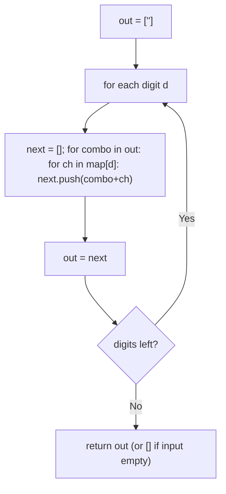
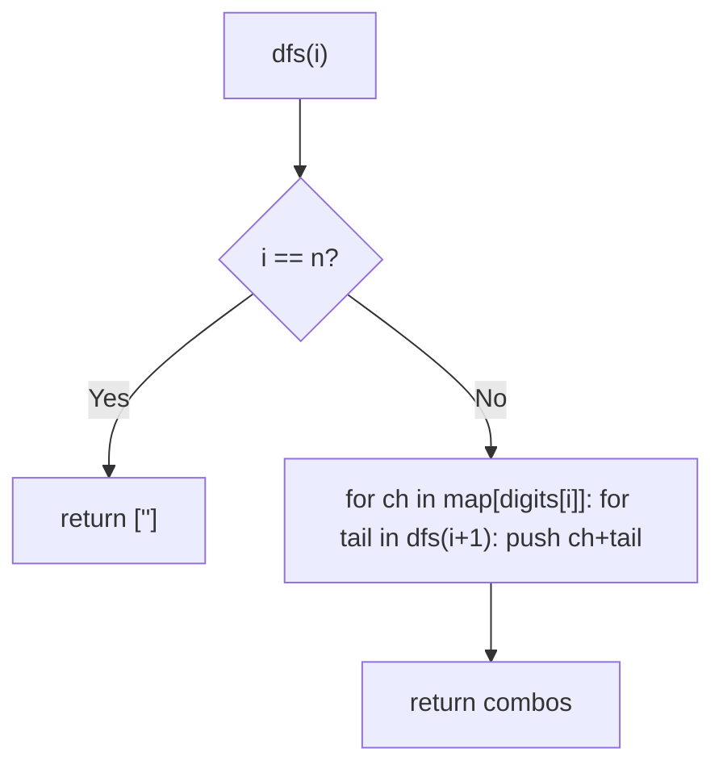

# 17. Letter Combinations of a Phone Number

- **LeetCode Link**: `https://leetcode.com/problems/letter-combinations-of-a-phone-number/`
- **Difficulty**: Medium
- **Pattern Category**: Backtracking / Choice-Tree Expansion
- **Prerequisite Primer**: `00-foundations/03-core-algorithmic-patterns.md`

---

## 1. Problem Overview & Edge Case Matrix

### Problem Statement
Given a string containing digits from `2` to `9` inclusive, return all possible letter combinations that the number could represent, in any order. Mapping follows the telephone buttons. Note that `1` does not map to any letters.

```
Example 1:
Input: digits = "23"
Output: ["ad","ae","af","bd","be","bf","cd","ce","cf"]

Example 2:
Input: digits = ""
Output: []

Example 3:
Input: digits = "2"
Output: ["a","b","c"]
```

### Visual Problem Representation
```
digits = "23":          2 -> a, b, c       3 -> d, e, f

              a ---- d, e, f
              b ---- d, e, f
              c ---- d, e, f       (3 × 3 = 9 leaves)
```

### Upfront Edge Case Matrix
| Edge Case Category | Specific Input Scenario | Expected Behavior | Pitfall / Risk |
| :--- | :--- | :--- | :--- |
| Empty / Nil | `digits = ""` | Return `[]` (not `[""]`) | Base case emitting one empty combo |
| Single Element | `"2"` | `["a","b","c"]` | Loop over single digit |
| Max length | 4 digits (`7`/`9` → 4 letters) | Up to $4^4 = 256$ combos | Output-size blowup mistaken for slowness |
| 7/9 digits | `"79"` → 16 combos | 4-letter maps handled | Hardcoded 3-letter assumption |
| Order freedom | Any order accepted | Any complete set | Test asserting exact order |

---

## 2. Level 1: Brute Force Approach

### Intuition & Visual Idea
Iterative product expansion: start with `[""]`, and for each digit replace every partial combo with its extensions. No recursion — breadth-first product building, one full layer per digit.



### Pseudocode
```text
FUNCTION letterCombinationsBruteForce(digits):
    IF digits EMPTY: RETURN []
    out = [""]
    FOR EACH d IN digits:
        next = []
        FOR EACH combo IN out:
            FOR EACH ch IN MAP[d]: next.PUSH(combo + ch)
        out = next
    RETURN out
```

### Step-by-Step Dry Run (Visual Trace)
| Step | Iteration / Pointer ($i, j$) | Current Value | State / Sub-array | Action Taken |
| :--- | :--- | :--- | :--- | :--- |
| 0 | seed | `[""]` | Empty input guard passed | Start |
| 1 | digit `2` | `abc` | `["a","b","c"]` | Expand seed |
| 2 | digit `3` | `def` × 3 prefixes | 9 combos | Expand all |
| 3 | return | — | `["ad",…,"cf"]` | Done |

### Modern JavaScript Implementation
```javascript
/**
 * Shared backbone: digit map defined once here so every level below is
 * locally runnable when concatenated (Level 1 + 2 + 3).
 * Time Complexity:  n/a (scaffolding)
 * Space Complexity: n/a (scaffolding)
 */
const PHONE_MAP = {
  2: 'abc', 3: 'def', 4: 'ghi', 5: 'jkl',
  6: 'mno', 7: 'pqrs', 8: 'tuv', 9: 'wxyz',
};

/**
 * Level 1: Brute Force (iterative product expansion)
 * Time Complexity:  O(4^N · N) — output-sized; string concat per extension
 * Space Complexity: O(4^N · N) — full layer retained
 */
function letterCombinationsBruteForce(digits) {
  if (digits.length === 0) return []; // spec: empty in, empty out (not [""])
  let out = [''];
  for (const d of digits) {
    const next = [];
    for (const combo of out) {
      for (const ch of PHONE_MAP[d]) {
        next.push(combo + ch); // fresh string per extension
      }
    }
    out = next; // whole layer replaced each round
  }
  return out;
}
```

### Complexity Breakdown
- **Time Complexity**: $O(4^N · N)$ — output-sized; every combo rebuilt per digit via concatenation.
- **Space Complexity**: $O(4^N · N)$ — two full layers during expansion.

---

## 3. Level 2: Optimized Approach

### Intuition & Visual Bottleneck Elimination
Naive recursion with string concatenation: `dfs(i)` returns all completions of the suffix, prepending each mapped letter. Same output, recursive shape — but every level copies strings, and intermediate arrays multiply.



### Pseudocode
```text
FUNCTION letterCombinationsRecursive(digits):
    IF digits EMPTY: RETURN []
    DEFINE dfs(i):
        IF i == n: RETURN [""]
        out = []
        FOR ch IN MAP[digits[i]]:
            FOR tail IN dfs(i+1): out.PUSH(ch + tail)
        RETURN out
    RETURN dfs(0)
```

### Step-by-Step Dry Run (Visual Trace)
| Step | Pointers / Window | Hash Map / Auxiliary State | Decision Logic | Output Accumulator |
| :--- | :--- | :--- | :--- | :--- |
| 0 | `dfs(1)` on `"23"` | suffix `"3"` | Returns `["d","e","f"]` | Base-adjacent |
| 1 | `dfs(0)`, ch `a` | prepend to each tail | `ad, ae, af` | Accumulate |
| 2 | ch `b`, `c` | same | `bd…cf` | `out` complete |
| 3 | return | — | — | 9 combos |

### Modern JavaScript Implementation
```javascript
/**
 * Level 2: Optimized (suffix recursion with string concat)
 * Time Complexity:  O(4^N · N) — same output bound, less layer waste
 * Space Complexity: O(4^N · N) — suffix arrays plus O(N) stack
 */
// PHONE_MAP shared from Level 1.
function letterCombinationsRecursive(digits) {
  if (digits.length === 0) return [];
  function dfs(i) {
    if (i === digits.length) return ['']; // empty tail: one completion
    const out = [];
    for (const ch of PHONE_MAP[digits[i]]) {
      for (const tail of dfs(i + 1)) {
        out.push(ch + tail); // concat per pair: the cost Level 3 removes
      }
    }
    return out;
  }
  return dfs(0);
}
```

### Complexity Breakdown
- **Time Complexity**: $O(4^N · N)$ — output-bound; repeated suffix arrays add constant-factor waste.
- **Space Complexity**: $O(4^N · N)$ — suffix arrays at every level plus $O(N)$ stack.

---

## 4. Level 3: Most Optimal / Canonical Approach

### Intuition & Mathematical / Invariant Proof
Classic choose/explore/unchoose with a mutable path array: append a letter, recurse to the next digit, pop. Join once per leaf. Invariant: `path` always equals the prefix for digits `[0, i)` — each leaf is emitted with exactly $N$ pushes/pops total on its trail, and intermediate strings are never built. Output size $O(4^N·N)$ is irreducible (the answer itself); working memory is $O(N)$.

```
"23": path [a] -> [a,d] emit "ad", pop -> [a,e] emit ... -> [] -> [b] ...
```

### Pseudocode
```text
FUNCTION letterCombinations(digits):
    IF digits EMPTY: RETURN []
    out = []; path = []
    DEFINE backtrack(i):
        IF i == n: out.PUSH(path.JOIN("")); RETURN
        FOR ch IN MAP[digits[i]]:
            path.PUSH(ch); backtrack(i + 1); path.POP()
    backtrack(0)
    RETURN out
```

### Step-by-Step Dry Run (Visual Trace)
| Step | Pointer $L$ | Pointer $R$ | Invariant Checked | In-Place State |
| :--- | :--- | :--- | :--- | :--- |
| 1 | `i=0`, push `a` | `path = [a]` | Prefix of digit 0 | Recurse |
| 2 | `i=1`, push `d` | `path = [a,d]` | Full length → emit | `out = ["ad"]`, pop |
| 3 | push `e`, `f` | emit `ae`, `af` | Pops restore `[a]` | Continue |
| 4 | pop `a`, push `b` | subtree `b` | Prefix invariant holds | `bd…cf` follow |

### Modern JavaScript Implementation
```javascript
/**
 * Level 3: Most Optimal / Canonical (push/recurse/pop backtracking)
 * Time Complexity:  O(4^N · N) — output-sized and optimal (must emit it all)
 * Space Complexity: O(N) working — path array; output excluded
 */
// PHONE_MAP shared from Level 1.
function letterCombinations(digits) {
  if (digits.length === 0) return [];
  const out = [];
  const path = []; // mutable prefix for digits[0..i): push/pop only
  function backtrack(i) {
    if (i === digits.length) {
      out.push(path.join('')); // join once per leaf, never per edge
      return;
    }
    for (const ch of PHONE_MAP[digits[i]]) {
      path.push(ch); // CHOOSE
      backtrack(i + 1); // EXPLORE
      path.pop(); // UNCHOOSE: restore for siblings
    }
  }
  backtrack(0);
  return out;
}
```

### Complexity Breakdown
- **Time Complexity**: $O(4^N · N)$ — optimal lower bound; the output itself is that big.
- **Space Complexity**: $O(N)$ working — path array plus call stack; output excluded.

---

## 5. JavaScript-Specific Gotchas & V8 Optimizations
- **GC Pressure**: Avoid allocating objects inside tight loops ($O(N)$ closures). Level 1–2's per-edge string concats churn $O(4^N·N)$ garbage; Level 3's single `join` per leaf is the minimal allocation the output allows.
- **Type Coercion / Sorting**: `PHONE_MAP[d]` with digit CHAR keys — the map uses string-ish numeric keys (`2:` === `"2":` in object literals); indexing with the char `d` matches, but `Map` with number keys would NOT match char lookups. Know which key type you hold.
- **Index Bounds**: Empty-input guard returns `[]` BEFORE any logic — without it, Level 1 returns `[""]` (the seed leaks) and Level 3 emits one empty join. The guard is spec compliance, not convenience.

---

## 6. Real-World MAANG Interview Follow-Ups & Extensions

### Follow-Up 1: Return the k-th combination without enumerating
- **Scenario**: $N = 12$ digits (too many combos); return only the k-th in lex order.
- **Solution Strategy**: Suffix-size arithmetic: each first-letter block holds $\prod$ of remaining maps' sizes; skip whole blocks by division — $O(N)$ time, $O(1)$ space.
- **JS Code / Implementation Pattern**:
```javascript
function kthCombination(digits, k) {
  const sizes = [...digits].map((d) => PHONE_MAP[d].length);
  const suffix = [];
  let prod = 1;
  for (let i = sizes.length - 1; i >= 0; i--) {
    suffix[i] = prod;
    prod *= sizes[i];
  }
  return [...digits].map((d, i) => PHONE_MAP[d][Math.floor(k / suffix[i]) % sizes[i]]).join('');
}
```

### Follow-Up 2: Streaming digits with backpressure ($10^9$ digits)
- **Scenario**: Digits stream forever; combos must stream out with bounded RAM.
- **Solution Strategy**: Iterative odometer over the digit window: hold one combo + per-position indices, advance like an odometer — $O(N)$ RAM for the window, output-paced.
- **JS Code / Implementation Pattern**:
```javascript
async function* streamCombinations(digitStream) {
  const buf = [];
  for await (const d of digitStream) {
    buf.push({ letters: PHONE_MAP[d], idx: 0 });
    yield* expandNewDigit(buf); // only combos involving the new digit
  }
}
```

### Follow-Up 3: Deduplicated maps and concurrent map updates
- **Scenario & In-Depth Solution**: Digit maps update live (T9 learning) while enumeration runs. Snapshot the map reference per call (`const map = PHONE_MAP`) — in-progress enumerations see a consistent version; new calls see updates. Structural sharing keeps snapshots cheap.
```javascript
function letterCombinationsVersioned(digits, mapSnapshot = PHONE_MAP) {
  return enumerateWith(digits, mapSnapshot); // Level 3 body over the snapshot
}
```
