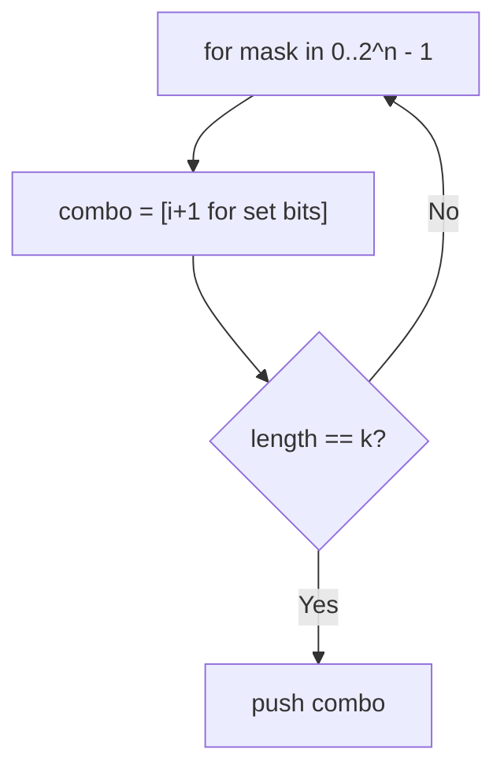
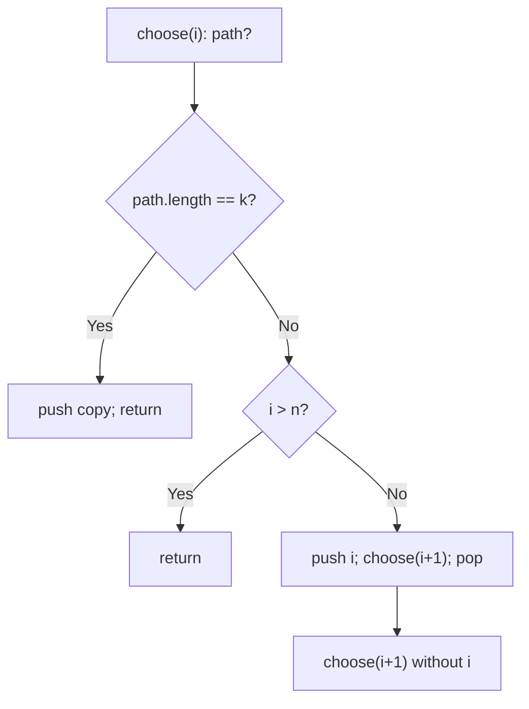
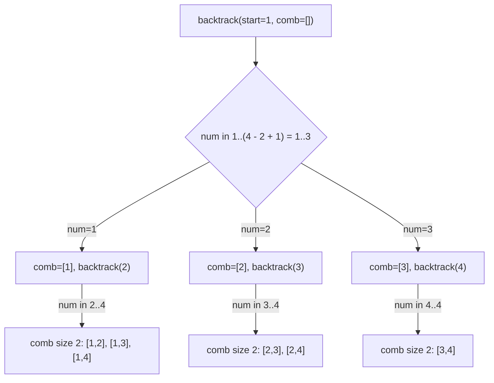

# 77. Combinations

- **LeetCode Link**: `https://leetcode.com/problems/combinations/`
- **Difficulty**: Medium
- **Pattern Category**: Backtracking / Subset Construction
- **Prerequisite Primer**: `00-foundations/03-core-algorithmic-patterns.md`

---

## 1. Problem Overview & Edge Case Matrix

### Problem Statement
Given two integers `n` and `k`, return all possible combinations of `k` numbers chosen from the range `[1, n]`, in any order.

```
Example 1:
Input: n = 4, k = 2
Output: [[1,2],[1,3],[1,4],[2,3],[2,4],[3,4]]

Example 2:
Input: n = 1, k = 1
Output: [[1]]
```

### Visual Problem Representation
```
n = 4, k = 2:   start=1 -> pick 1: [1,2],[1,3],[1,4]
                         start=2 -> pick 2: [2,3],[2,4]
                         start=3 -> pick 3: [3,4]
                         start=4 -> cannot fill: prune
```

### Upfront Edge Case Matrix
| Edge Case Category | Specific Input Scenario | Expected Behavior | Pitfall / Risk |
| :--- | :--- | :--- | :--- |
| Full range | `k = n` | Single combo `[1..n]` | Loop bounds excluding the tail |
| Singletons | `k = 1` | `n` one-element combos | Path-length base case |
| Empty choice | `k = 0` (defensive) | `[[]]` (one empty combo) | Returning `[]` (zero combos) |
| Max scale | `n = 20, k = 10` (184,756 combos) | Complete enumeration | Pruning absence exploding the search |
| Order freedom | Any order accepted | Any complete set | Test asserting exact order |

---

## 2. Level 1: Brute Force Approach

### Intuition & Visual Idea
Bitmask enumeration: all $2^n$ subsets via bit patterns, keeping those with exactly $k$ bits. Zero backtracking insight — $O(n·2^n)$ to find $C(n,k)$ answers.



### Pseudocode
```text
FUNCTION combineBruteForce(n, k):
    out = []
    FOR mask IN 0 .. 2^n - 1:
        combo = []
        FOR i IN 0 .. n - 1:
            IF mask HAS BIT i: combo.PUSH(i + 1)
        IF combo.LENGTH == k: out.PUSH(combo)
    RETURN out
```

### Step-by-Step Dry Run (Visual Trace)
| Step | Iteration / Pointer ($i, j$) | Current Value | State / Sub-array | Action Taken |
| :--- | :--- | :--- | :--- | :--- |
| 0 | masks `0..2` | sizes `0, 1, 1` | No size-2 | Skip |
| 1 | mask `3` (`0011`) | `[1,2]` | Size 2 | Keep |
| 2 | masks `4..15` | sizes vary | Keeps at `5,6,9,10,12` | 6 combos total |
| 3 | return | — | — | `[[1,2],[1,3],[1,4],[2,3],[2,4],[3,4]]` |

### Modern JavaScript Implementation
```javascript
/**
 * Level 1: Brute Force (bitmask subset filter)
 * Time Complexity:  O(n·2^n) — enumerates every subset for C(n,k) answers
 * Space Complexity: O(k·C(n,k)) — output plus one working combo
 */
function combineBruteForce(n, k) {
  const out = [];
  for (let mask = 0; mask < 1 << n; mask++) {
    const combo = [];
    for (let i = 0; i < n; i++) {
      if (mask & (1 << i)) combo.push(i + 1); // bit i set => take number i+1
    }
    if (combo.length === k) out.push(combo);
  }
  return out;
}
```

### Complexity Breakdown
- **Time Complexity**: $O(n·2^n)$ — exponential in $n$ regardless of $k$.
- **Space Complexity**: $O(k·C(n,k))$ — output-dominated; the search itself is the waste.

---

## 3. Level 2: Optimized Approach

### Intuition & Visual Bottleneck Elimination
Binary choice recursion (include/skip each number $1..n$): the decision tree has exactly the $C(n,k)$ leaves plus pruned branches — no $2^n$ enumeration of wrong-sized sets. Still explores dead ends (include-chains that overshoot), which Level 3 prunes.



### Pseudocode
```text
FUNCTION combineBinaryChoice(n, k):
    out = []
    DEFINE choose(i, path):
        IF path.LENGTH == k: out.PUSH(COPY(path)); RETURN
        IF i > n: RETURN
        path.PUSH(i); choose(i + 1, path); path.POP()  // INCLUDE i
        choose(i + 1, path)                            // SKIP i
    choose(1, [])
    RETURN out
```

### Step-by-Step Dry Run (Visual Trace)
| Step | Pointers / Window | Hash Map / Auxiliary State | Decision Logic | Output Accumulator |
| :--- | :--- | :--- | :--- | :--- |
| 0 | `choose(1, [])` | include `1` | `choose(2, [1])` | Branch include |
| 1 | `choose(2, [1])` | include `2` → full | Emit `[1,2]` | Backtrack |
| 2 | skip `2` | `choose(3, [1])` | Include `3` → `[1,3]`… | Continues |
| 3 | skip `1` subtree | `choose(2, [])` | `[2,3],[2,4],[3,4]` | Complete |

### Modern JavaScript Implementation
```javascript
/**
 * Level 2: Optimized (include/skip binary choice)
 * Time Complexity:  O(k·C(n,k) + dead branches) — no wrong-sized enumeration
 * Space Complexity: O(k·C(n,k)) — output plus O(n) stack/path
 */
function combineBinaryChoice(n, k) {
  const out = [];
  function choose(i, path) {
    if (path.length === k) {
      out.push([...path]); // snapshot: path mutates after return
      return;
    }
    if (i > n) return; // exhausted numbers with a short path: dead end
    path.push(i);
    choose(i + 1, path); // INCLUDE i
    path.pop(); // restore for the sibling branch
    choose(i + 1, path); // SKIP i
  }
  choose(1, []);
  return out;
}
```

### Complexity Breakdown
- **Time Complexity**: $O(k·C(n,k))$ plus dead-end branches (include-chains overshooting $k$ still walk).
- **Space Complexity**: $O(k·C(n,k))$ — output plus $O(n)$ recursion/path.

---

## 4. Level 3: Most Optimal / Canonical Approach

### Intuition & Mathematical / Invariant Proof
Loop backtracking with start index and count pruning: from `start`, try each candidate, recursing with `start = i + 1`. The prune `i <= n - (k - path.length) + 1` stops starts that cannot fill the combo (not enough numbers left) — every visited node leads to at least one answer, so total work is $O(k·C(n,k))$, optimal. Invariant: `path` is always an increasing prefix extendable to size $k$ from `[start, n]$.

```
n=4,k=2: start=1: i=1 (remaining slots 2, numbers 1..4: ok) -> [1,2],[1,3],[1,4]
         i=2? start=1 loop continues i=2,3,4 with path []: [2,3],[2,4],[3,4];
         i=4: needs 2 more from [4,4]: 4 > 4-(2-0)+1=3 -> prune
```

### Pseudocode
```text
FUNCTION combine(n, k):
    out = []
    DEFINE backtrack(start, path):
        IF path.LENGTH == k: out.PUSH(COPY(path)); RETURN
        // Prune: need (k - len) more from [i, n]; stop when impossible.
        FOR i IN start .. n - (k - path.LENGTH) + 1:
            path.PUSH(i); backtrack(i + 1, path); path.POP()
    backtrack(1, [])
    RETURN out
```

### Step-by-Step Dry Run (Visual Trace)
| Step | Pointer $L$ | Pointer $R$ | Invariant Checked | In-Place State |
| :--- | :--- | :--- | :--- | :--- |
| 1 | `start=1, path=[]` | need 2 from `[1..4]` | Loop `i = 1..3` | i=4 pruned at top |
| 2 | `i=1` → `start=2` | need 1 from `[2..4]` | Loop `i = 2..4` | Emits `[1,2],[1,3],[1,4]` |
| 3 | `i=2` → `start=3` | need 1 | Loop `i = 3..4` | Emits `[2,3],[2,4]` |
| 4 | `i=3` → `start=4` | need 1 | Loop `i = 4..4` | Emits `[3,4]` |

### Modern JavaScript Implementation
```javascript
/**
 * Level 3: Most Optimal / Canonical (start-index loop + count prune)
 * Time Complexity:  O(k·C(n,k)) — optimal (must emit every combo)
 * Space Complexity: O(k·C(n,k)) — output plus O(n) stack/path
 */
function combine(n, k) {
  const out = [];
  function backtrack(start, path) {
    if (path.length === k) {
      out.push([...path]); // snapshot the completed combo
      return;
    }
    // Prune: with (k - len) slots left, start i needs i <= n - slots + 1.
    const lastStart = n - (k - path.length) + 1;
    for (let i = start; i <= lastStart; i++) {
      path.push(i); // CHOOSE
      backtrack(i + 1, path); // EXPLORE (increasing: no reuse, no dupes)
      path.pop(); // UNCHOOSE
    }
  }
  backtrack(1, []);
  return out;
}
```

### Complexity Breakdown
- **Time Complexity**: $O(k·C(n,k))$ — optimal lower bound; pruning kills every dead branch.
- **Space Complexity**: $O(k·C(n,k))$ — output-dominated (unavoidable); working state $O(n)$.

---

## 5. JavaScript-Specific Gotchas & V8 Optimizations
- **GC Pressure**: Avoid allocating objects inside tight loops ($O(N)$ closures). `[...path]` snapshots are mandatory per answer (output itself); never snapshot mid-path or clone the output array per branch.
- **Type Coercion / Sorting**: `1 << n` overflows 32-bit past $n = 31$ (Level 1) — spec caps $n = 20$, but the bit-shift ceiling is worth stating when generalizing. `k = 0` must return `[[]]` (one empty combo): `path.length === k` fires immediately at the root call.
- **Index Bounds**: The prune bound `n - (k - len) + 1` with 1-based values — off-by-one here either drops valid combos (too tight) or keeps dead starts (too loose, silently correct but slower). Derive it fresh each time: "need `s` more from `[i, n]`" ⟺ `n - i + 1 >= s` ⟺ `i <= n - s + 1`.

---

## 6. Real-World MAANG Interview Follow-Ups & Extensions

### Follow-Up 1: Combinations with sum constraint (Combination Sum family)
- **Scenario**: Combos must sum to a target, with/without reuse (LeetCode 39, 40 — this module).
- **Solution Strategy**: Level 3's skeleton plus a `remain` parameter: subtract on choose, prune when negative; duplicates sorted + skipped at the loop level for Combination Sum II.
- **JS Code / Implementation Pattern**:
```javascript
function combinationSum(candidates, target) {
  return backtrackSum(candidates.sort((a, b) => a - b), target, 0, []);
}
```

### Follow-Up 2: $C(10^9, k)$ counting without enumeration
- **Scenario**: Return the COUNT (or the r-th combo) — enumeration impossible.
- **Solution Strategy**: Multiplicative formula for counts ($O(k)$ arithmetic); unranking walks Level 3's loop arithmetically, skipping whole blocks via binomial coefficients — $O(n·k)$ time, $O(k)$ space.
- **JS Code / Implementation Pattern**:
```javascript
function unrankCombination(n, k, r) {
  // walk starts arithmetically: block size C(n-i, k-len) decides skips
  return unrank(n, k, r);
}
```

### Follow-Up 3: Parallel enumeration across workers
- **Scenario & In-Depth Solution**: Split the search over first picks: worker $i$ enumerates combos starting with $i$ (independent subtrees, near-equal with prune-aware chunking). No shared state except the output sink — embarrassingly parallel.
```javascript
async function combineParallel(n, k, workers) {
  const chunks = splitFirstPicks(n, k, workers.length);
  const parts = await Promise.all(chunks.map((c) => workers.next().run(c)));
  return parts.flat();
}
```

---

## 7. What LeetCode Discuss Says (Language-Independent)

Source: top-voted post by niits —
`https://leetcode.com/problems/combinations/solutions/5418489/video-simple-backtracking-solution-by-ni-ug0h/`
— 51.8K views.
Language-independent summary. No new JS here.

### A. Optimal way from Discuss (Combinatorial Backtracking with Bound Pruning)

Enumerate all subsets of size $k$ from $[1, n]$ using depth-first search with upper-bound branch pruning:

1. **State & Result Storage:** Maintain a dynamic list `comb` for the path and `results` for valid combinations.
2. **Backtracking Invariant:** At state `backtrack(start)`:
   - **Base Case:** If `comb.length == k`, record a snapshot copy of `comb` into `results` and return.
   - **Upper Bound Pruning:** We currently need `needed = k - length(comb)` additional numbers. If we pick starting at `num`, the interval $[num, n]$ must contain at least `needed` integers ($n - num + 1 \ge needed \implies num \le n - needed + 1$).
   - Loop `num` from `start` to $n - needed + 1$:
     - Push `num` into `comb`.
     - Recurse: `backtrack(num + 1)`.
     - Pop `num` from `comb` (undo choice).
3. **Execution:** Invoke `backtrack(1)` and return `results`.

```text
FUNCTION combine(n, k):
    results = []
    comb = []

    FUNCTION backtrack(start):
        IF length(comb) == k:
            results.append(CLONE(comb))
            RETURN

        needed = k - length(comb)
        limit = n - needed + 1

        FOR num FROM start TO limit:
            comb.push(num)
            backtrack(num + 1)
            comb.pop()

    backtrack(1)
    RETURN results
```

- Time: O(C(n, k) * k), where $C(n, k) = \frac{n!}{k!(n-k)!}$ combinations are generated, each requiring $O(k)$ copy time.
- Space: O(k) auxiliary stack space for recursion and current path buffer.



### B. Dry run on LeetCode Example 1 (`n = 4, k = 2`)

- `needed = 2 - 0 = 2`, `limit = 4 - 2 + 1 = 3`.
- `num = 1`: `comb = [1]`.
  - Next call: `needed = 1`, `limit = 4 - 1 + 1 = 4`.
  - `num = 2`: `comb = [1, 2]` -> size 2 reached -> save `[1, 2]`.
  - `num = 3`: `comb = [1, 3]` -> save `[1, 3]`.
  - `num = 4`: `comb = [1, 4]` -> save `[1, 4]`.
  - Backtrack to root.
- `num = 2`: `comb = [2]`.
  - `num = 3`: `comb = [2, 3]` -> save `[2, 3]`.
  - `num = 4`: `comb = [2, 4]` -> save `[2, 4]`.
  - Backtrack to root.
- `num = 3`: `comb = [3]`.
  - `num = 4`: `comb = [3, 4]` -> save `[3, 4]`.
  - Backtrack to root.
- Loop terminates at limit 3.

Final result: `[[1,2], [1,3], [1,4], [2,3], [2,4], [3,4]]`.

### C. Why Upper Bound Pruning ($n - needed + 1$) Drastically Accelerates DFS

- Without pruning, the loop iterates all the way to $n$. When `comb` has size $k-1$ and reaches $num = n$, the next recursive call will see `start = n + 1` with an empty remaining pool, wasting unnecessary function calls.
- Setting the loop ceiling directly to $n - (k - |comb|) + 1$ prevents exploring subtrees that can never complete a size-$k$ combination.

### D. Pitfalls from comments

- **Reference Aliasing:** Adding `comb` directly into the result array without cloning stores a reference to a mutable buffer that empties out to `[]` when the backtracking stack finishes popping.
- **Off-by-One in Pruning Bound:** Omitting the `+ 1` in `n - needed + 1` prematurely prunes valid single-element branches.

### E. Companies

- Discuss post itself names none.
  Companies tab on LeetCode is premium-locked.
- External source:
  `https://github.com/liquidslr/leetcode-company-wise-problems`
  (LeetCode company tags, updated June 2025).
- All-time (38): Accenture, Amazon, Apple, Bloomberg, Capital One, Cisco, Citadel, DE Shaw, Dropbox, Epic Systems, Expedia, Flexport, Goldman Sachs, Google, IBM, Infosys, LinkedIn, Lyft, Meta, Microsoft, Nvidia, Oracle, PayPal, PhonePe, Pinterest, ServiceNow, Snap, Societe Generale, tcs, Tekion, Tesla, TikTok, Trexquant, Uber, Visa, Walmart Labs, Yandex, Zoho, Zopsmart.
- Recent: 30 days — Amazon, Google, Infosys, Microsoft.
- Recent: 3 months — Amazon, Bloomberg, Google, Infosys, LinkedIn, Meta, Microsoft.
