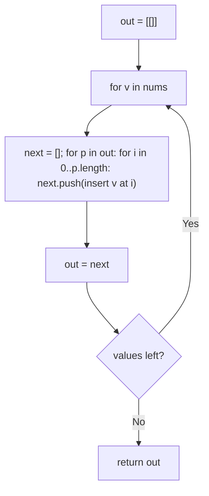
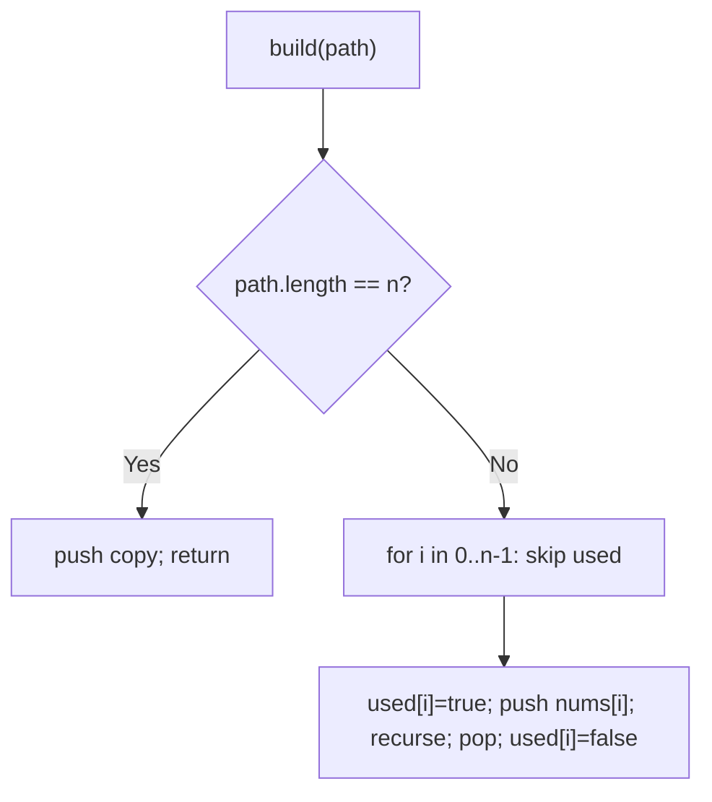

# 46. Permutations

- **LeetCode Link**: `https://leetcode.com/problems/permutations/`
- **Difficulty**: Medium
- **Pattern Category**: Backtracking / Ordering Enumeration
- **Prerequisite Primer**: `00-foundations/03-core-algorithmic-patterns.md`

---

## 1. Problem Overview & Edge Case Matrix

### Problem Statement
Given an array `nums` of distinct integers, return all the possible permutations, in any order.

```
Example 1:
Input: nums = [1,2,3]
Output: [[1,2,3],[1,3,2],[2,1,3],[2,3,1],[3,1,2],[3,2,1]]

Example 2:
Input: nums = [0,1]
Output: [[0,1],[1,0]]

Example 3:
Input: nums = [1]
Output: [[1]]
```

### Visual Problem Representation
```
[1,2,3]:   pick 1st: 1 -> remaining {2,3} -> [1,2,3],[1,3,2]
                   2 -> remaining {1,3} -> [2,1,3],[2,3,1]
                   3 -> remaining {1,2} -> [3,1,2],[3,2,1]
           3 choices × 2 × 1 = 6 leaves
```

### Upfront Edge Case Matrix
| Edge Case Category | Specific Input Scenario | Expected Behavior | Pitfall / Risk |
| :--- | :--- | :--- | :--- |
| Single Element | `[1]` | Return `[[1]]` | Base case emitting `[1]` vs `[]` |
| Two elements | `[0,1]` | Both orders | Swap-back omission corrupting order |
| Reference aliasing | Any input | Independent subarrays | Pushing `path` without snapshot |
| Input mutation | Caller reuses `nums` | Unspecified (document) | In-place swap version rearranges input |
| Order freedom | Any order accepted | Any complete set | Test asserting exact sequence |

---

## 2. Level 1: Brute Force Approach

### Intuition & Visual Idea
Iterative insertion: build permutations incrementally — each new number inserts at every position of every existing partial permutation. No recursion, no "used" tracking — $O(N·N!)$ inserts with full array copies each time.



### Pseudocode
```text
FUNCTION permuteBruteForce(nums):
    out = [[]]
    FOR v IN nums:
        next = []
        FOR p IN out:
            FOR i IN 0 .. p.LENGTH:
                next.PUSH(p[.. i-1] + [v] + p[i ..])
        out = next
    RETURN out
```

### Step-by-Step Dry Run (Visual Trace)
| Step | Iteration / Pointer ($i, j$) | Current Value | State / Sub-array | Action Taken |
| :--- | :--- | :--- | :--- | :--- |
| 0 | insert `1` | into `[[]]` | `[[1]]` | Single slot |
| 1 | insert `2` | positions `0, 1` | `[[2,1],[1,2]]` | Two slots each |
| 2 | insert `3` | 3 slots × 2 perms | 6 full perms | Return all |

### Modern JavaScript Implementation
```javascript
/**
 * Level 1: Brute Force (iterative positional insertion)
 * Time Complexity:  O(N·N!) — output-sized with O(N) copies per insert
 * Space Complexity: O(N·N!) — two full generations during expansion
 */
function permuteBruteForce(nums) {
  let out = [[]];
  for (const v of nums) {
    const next = [];
    for (const p of out) {
      // Every slot: fresh array via slices (the copy cost Level 3 removes).
      for (let i = 0; i <= p.length; i++) {
        next.push([...p.slice(0, i), v, ...p.slice(i)]);
      }
    }
    out = next; // whole generation replaced each round
  }
  return out;
}
```

### Complexity Breakdown
- **Time Complexity**: $O(N·N!)$ — output-sized; each insert copies $O(N)$ elements.
- **Space Complexity**: $O(N·N!)$ — two generations alive during expansion.

---

## 3. Level 2: Optimized Approach

### Intuition & Visual Bottleneck Elimination
Recursive path-building with a `used[]` membership array: at each position, try every unused number. No positional inserts, no generational copies — one path plus snapshots at leaves.



### Pseudocode
```text
FUNCTION permuteUsedArray(nums):
    out = []; used = BOOLEAN ARRAY (false)
    DEFINE build(path):
        IF path.LENGTH == n: out.PUSH(COPY(path)); RETURN
        FOR i IN 0 .. n - 1:
            IF used[i]: CONTINUE
            used[i] = true; path.PUSH(nums[i])
            build(path)
            path.POP(); used[i] = false
    build([])
    RETURN out
```

### Step-by-Step Dry Run (Visual Trace)
| Step | Pointers / Window | Hash Map / Auxiliary State | Decision Logic | Output Accumulator |
| :--- | :--- | :--- | :--- | :--- |
| 0 | `path=[1]`, used `{1}` | try `2` | `path=[1,2]`, try `3` | Emit `[1,2,3]` |
| 1 | backtrack | `used={1}` | Try `3`: `path=[1,3]` | Emit `[1,3,2]` |
| 2 | backtrack to root | `used={}` | Try `2` first | `[2,1,3],[2,3,1]` follow |
| 3 | try `3` first | — | `[3,1,2],[3,2,1]` | Complete (6) |

### Modern JavaScript Implementation
```javascript
/**
 * Level 2: Optimized (used-array path building)
 * Time Complexity:  O(N·N!) — output-sized; O(1) amortized choice work
 * Space Complexity: O(N·N!) — output plus O(N) path/used/stack
 */
function permuteUsedArray(nums) {
  const out = [];
  const used = new Array(nums.length).fill(false);
  function build(path) {
    if (path.length === nums.length) {
      out.push([...path]); // snapshot: path mutates after return
      return;
    }
    for (let i = 0; i < nums.length; i++) {
      if (used[i]) continue; // membership test replaces positional inserts
      used[i] = true;
      path.push(nums[i]);
      build(path);
      path.pop(); // UNCHOOSE both path and membership
      used[i] = false;
    }
  }
  build([]);
  return out;
}
```

### Complexity Breakdown
- **Time Complexity**: $O(N·N!)$ — output-sized; choices are $O(1)$ each.
- **Space Complexity**: $O(N·N!)$ — output plus $O(N)$ working state (`used` array is the overhead Level 3 drops).

---

## 4. Level 3: Most Optimal / Canonical Approach

### Intuition & Mathematical / Invariant Proof
In-place swap partitioning: position `start` is fixed by swapping each candidate `i ≥ start` into it, recursing on `start + 1`, then swapping back. Invariant: `nums[0..start)` is the committed prefix (a permutation of $start$ distinct input values) and `nums[start..]$ holds the remaining candidates — no membership array needed because position itself partitions used from unused. Snapshots only at leaves; working memory $O(N)$ stack.

```
[1,2,3], start=0: swap(0,0)->[1,2,3] ... start=1: swap(1,1)->[1,2,3] leaf;
  swap(1,2)->[1,3,2] leaf; restore; start=0: swap(0,1)->[2,1,3] ...
```

### Pseudocode
```text
FUNCTION permute(nums):
    out = []
    DEFINE backtrack(start):
        IF start == nums.LENGTH: out.PUSH(COPY(nums)); RETURN
        FOR i IN start .. nums.LENGTH - 1:
            SWAP(nums[start], nums[i])
            backtrack(start + 1)
            SWAP(nums[start], nums[i])   // restore for siblings
    backtrack(0)
    RETURN out
```

### Step-by-Step Dry Run (Visual Trace)
| Step | Pointer $L$ | Pointer $R$ | Invariant Checked | In-Place State |
| :--- | :--- | :--- | :--- | :--- |
| 1 | `start=0, i=0` | no-op swap | Prefix `[]`, recurse | `start=1` |
| 2 | `start=1, i=1` | no-op swap | Prefix `[1]`, recurse | `start=2` |
| 3 | `start=2, i=2` | leaf | Snapshot `[1,2,3]` | Backtrack, restore |
| 4 | `start=1, i=2` | swap → `[1,3,2]` | Prefix `[1]`, leaf | Snapshot, restore |

### Modern JavaScript Implementation
```javascript
/**
 * Level 3: Most Optimal / Canonical (in-place swap partitioning)
 * Time Complexity:  O(N·N!) — output-sized and optimal (must emit it all)
 * Space Complexity: O(N) working — call stack only; output excluded
 */
function permute(nums) {
  const out = [];
  function backtrack(start) {
    if (start === nums.length) {
      out.push([...nums]); // snapshot the arranged array
      return;
    }
    for (let i = start; i < nums.length; i++) {
      // Fix candidate i at position start (no-op when i === start).
      [nums[start], nums[i]] = [nums[i], nums[start]];
      backtrack(start + 1);
      // Restore: siblings must see the pre-swap arrangement.
      [nums[start], nums[i]] = [nums[i], nums[start]];
    }
  }
  backtrack(0);
  return out;
}
```

### Complexity Breakdown
- **Time Complexity**: $O(N·N!)$ — optimal lower bound; every permutation is built once.
- **Space Complexity**: $O(N)$ working — stack only; no `used` array, no generational copies.

---

## 5. JavaScript-Specific Gotchas & V8 Optimizations
- **GC Pressure**: Avoid allocating objects inside tight loops ($O(N)$ closures). Level 1's slice-triples per insert are the pressure removed — Level 3 allocates one snapshot per LEAF (the output itself) and swaps primitives otherwise.
- **Type Coercion / Sorting**: Destructuring swap `[a, b] = [b, a]` on array indices is exact — but never swap via arithmetic (`a += b; b = a - b; …`) on values: overflow and float precision corrupt large inputs.
- **Index Bounds**: The swap-back is LOAD-BEARING — omitting it doesn't crash, it silently yields duplicate/missing permutations (the #1 wrong-answer bug here). Level 3 mutates the input array (restored by the end — net-zero, but document it for callers holding references).

---

## 6. Real-World MAANG Interview Follow-Ups & Extensions

### Follow-Up 1: Unique permutations with duplicates (Permutations II)
- **Scenario**: Input contains duplicates; each distinct permutation once (LeetCode 47).
- **Solution Strategy**: Sort first, then skip `i > start && nums[i] === nums[i-1]` in Level 3's loop (with sorted order, equal values are adjacent so the skip is exact). Same swap kernel, one guard.
- **JS Code / Implementation Pattern**:
```javascript
function permuteUnique(nums) {
  nums.sort((a, b) => a - b);
  const out = [];
  function backtrack(start) {
    if (start === nums.length) return out.push([...nums]);
    for (let i = start; i < nums.length; i++) {
      if (i > start && nums[i] === nums[i - 1]) continue; // dupes: first seat only
      [nums[start], nums[i]] = [nums[i], nums[start]];
      backtrack(start + 1);
      [nums[start], nums[i]] = [nums[i], nums[start]];
    }
  }
  backtrack(0);
  return out;
}
```

### Follow-Up 2: K-th permutation without enumerating (lexicographic rank)
- **Scenario**: Return the k-th permutation directly (LeetCode 60).
- **Solution Strategy**: Factorial number system: position $i$ takes the $(k / (n-1-i)!)$-th remaining value — $O(N^2)$ time, $O(N)$ space, zero enumeration.
- **JS Code / Implementation Pattern**:
```javascript
function kthPermutation(n, k) {
  const nums = Array.from({ length: n }, (_, i) => i + 1);
  const out = [];
  let rank = k - 1;
  for (let f = factorial(n - 1); n > 0; n--, f /= n) {
    out.push(...nums.splice(Math.floor(rank / f), 1));
    rank %= f;
  }
  return out.join('');
}
```

### Follow-Up 3: Parallel permutation streams across workers
- **Scenario & In-Depth Solution**: Split by first pick: worker $i$ enumerates permutations with `nums[i]` fixed first (independent subtrees, exactly equal $(n-1)!$ shares — perfectly balanced). No shared state; concatenate $n$ ordered chunks.
```javascript
async function permuteParallel(nums, workers) {
  const jobs = nums.map((_, i) => ({ fixed: i, rest: withoutIndex(nums, i) }));
  const parts = await Promise.all(jobs.map((j) => workers.next().run(j)));
  return parts.flat();
}
```
