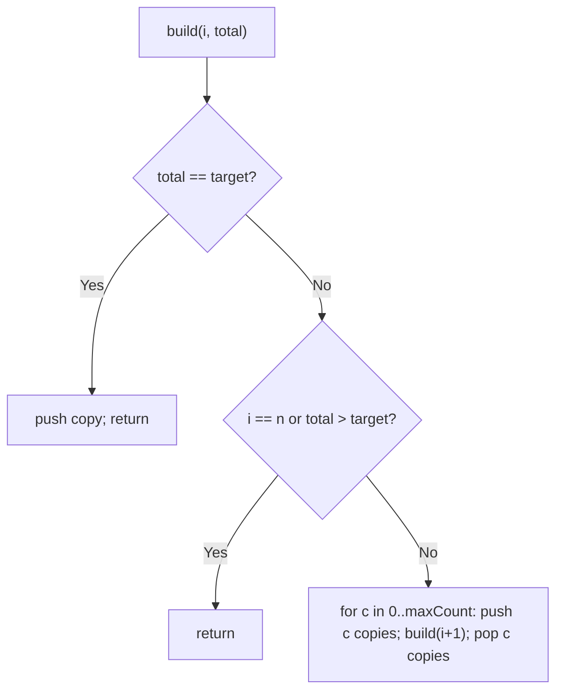
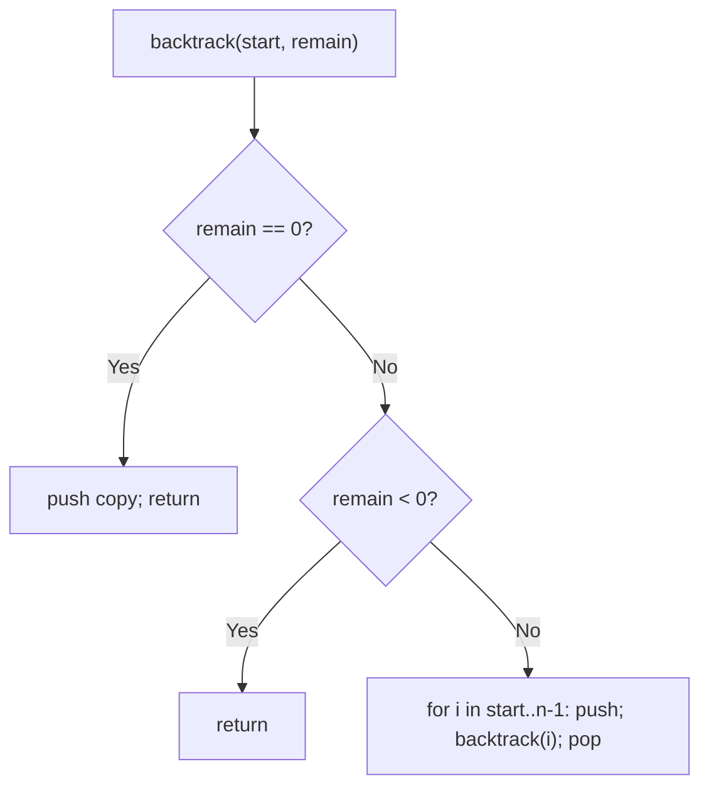
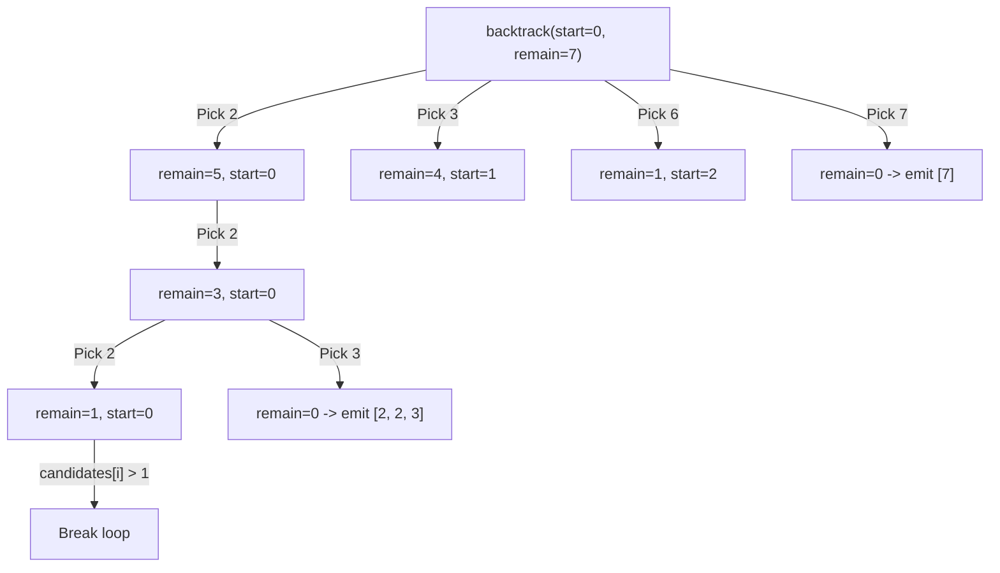

# 39. Combination Sum

- **LeetCode Link**: `https://leetcode.com/problems/combination-sum/`
- **Difficulty**: Medium
- **Pattern Category**: Backtracking / Unbounded Choice with Pruning
- **Prerequisite Primer**: `00-foundations/03-core-algorithmic-patterns.md`

---

## 1. Problem Overview & Edge Case Matrix

### Problem Statement
Given an array of distinct integers `candidates` and a target integer `target`, return a list of all unique combinations of `candidates` where the chosen numbers sum to `target`. The same number may be chosen an unlimited number of times. Combinations are unique by multiset — `[2,2,3]` and `[2,3,2]` are the same and reported once.

```
Example 1:
Input: candidates = [2,3,6,7], target = 7
Output: [[2,2,3],[7]]

Example 2:
Input: candidates = [2,3,5], target = 8
Output: [[2,2,2,2],[2,3,3],[3,5]]

Example 3:
Input: candidates = [2], target = 1
Output: []
```

### Visual Problem Representation
```
candidates [2,3,6,7], target 7:

reuse 2: [2] -> [2,2] -> [2,2,2](6) -> [2,2,2,2](8 ✗) ; [2,2,3](7 ✓)
         [2,3] -> [2,3,3](8 ✗) ; [2,6](8 ✗) ; [2,7](9 ✗)
reuse 3: [3] -> overshoot path... ; [7](7 ✓)
```

### Upfront Edge Case Matrix
| Edge Case Category | Specific Input Scenario | Expected Behavior | Pitfall / Risk |
| :--- | :--- | :--- | :--- |
| No solution | `[2]`, target `1` | Return `[]` | Emitting partial paths |
| Single exact | `[7]`, target `7` | `[[7]]` | Skipping single-pick combos |
| Heavy reuse | `[2]`, target `8` | `[[2,2,2,2]]` | Reuse-depth cutoff |
| Order freedom | Any order accepted | Unique multisets | Permutation duplicates (`[2,3]` + `[3,2]`) |
| Large target | Target `500` (spec max) | Complete enumeration | Missing overshoot prune |

---

## 2. Level 1: Brute Force Approach

### Intuition & Visual Idea
Per-candidate count enumeration: for candidate `i`, try using it `0..maxCount` times, then move to `i + 1`. Exhaustive over count vectors — correct, unique by construction (each candidate decided once), but explores deep overshoot branches before discovering them.



### Pseudocode
```text
FUNCTION combinationSumBruteForce(candidates, target):
    out = []
    DEFINE build(i, path, total):
        IF total == target: out.PUSH(COPY(path)); RETURN
        IF i == n OR total > target: RETURN
        maxCount = FLOOR((target - total) / candidates[i])
        FOR c IN 0 .. maxCount:
            PUSH c COPIES of candidates[i]
            build(i + 1, path, total + c * candidates[i])
            POP c COPIES
    build(0, [], 0)
    RETURN out
```

### Step-by-Step Dry Run (Visual Trace)
| Step | Iteration / Pointer ($i, j$) | Current Value | State / Sub-array | Action Taken |
| :--- | :--- | :--- | :--- | :--- |
| 0 | `i=0` (val `2`), `c=2` | total `4` | `path=[2,2]` | Recurse `i=1` |
| 1 | `i=1` (val `3`), `c=1` | total `7` | `path=[2,2,3]` | Emit ✓ |
| 2 | `c=0` at `i=1` | total `4` | Continue deeper | No hit downstream |
| 3 | other counts | overshoots | Pruned at `total > target` | …`[7]` found at `i=3,c=1` |

### Modern JavaScript Implementation
```javascript
/**
 * Level 1: Brute Force (per-candidate count enumeration)
 * Time Complexity:  O(product of (target/min + 1)) — explores overshoot branches
 * Space Complexity: O(target/min) — recursion + path depth
 */
function combinationSumBruteForce(candidates, target) {
  const out = [];
  function build(i, path, total) {
    if (total === target) {
      out.push([...path]);
      return;
    }
    if (i >= candidates.length || total > target) return;
    // Decide the ENTIRE count of candidates[i] up front (uniqueness by construction).
    const maxCount = Math.floor((target - total) / candidates[i]);
    for (let c = 0; c <= maxCount; c++) {
      for (let k = 0; k < c; k++) path.push(candidates[i]);
      build(i + 1, path, total + c * candidates[i]);
      for (let k = 0; k < c; k++) path.pop(); // restore exact count
    }
  }
  build(0, [], 0);
  return out;
}
```

### Complexity Breakdown
- **Time Complexity**: Exponential in `target/min` — count vectors explored blindly, overshoot discovered late.
- **Space Complexity**: $O(\text{target}/\min)$ — path plus recursion depth.

---

## 3. Level 2: Optimized Approach

### Intuition & Visual Bottleneck Elimination
Reuse-recursion: at each step either take candidates[i] again (same index — unlimited reuse) or move on. Overshoot returns immediately on `remain < 0` instead of after deep count loops — tighter, simpler, still unpruned on ordering.



### Pseudocode
```text
FUNCTION combinationSumReuse(candidates, target):
    out = []
    DEFINE backtrack(start, path, remain):
        IF remain == 0: out.PUSH(COPY(path)); RETURN
        IF remain < 0: RETURN
        FOR i IN start .. n - 1:
            path.PUSH(candidates[i])
            backtrack(i, path, remain - candidates[i])  // i: reuse allowed
            path.POP()
    backtrack(0, [], target)
    RETURN out
```

### Step-by-Step Dry Run (Visual Trace)
| Step | Pointers / Window | Hash Map / Auxiliary State | Decision Logic | Output Accumulator |
| :--- | :--- | :--- | :--- | :--- |
| 0 | `start=0`, remain `7` | take `2` | Recurse `(0, 5)` | `path=[2]` |
| 1 | `start=0`, remain `5` | take `2` | Recurse `(0, 3)` | `path=[2,2]` |
| 2 | `start=0`, remain `3` | take `2` → remain `1` | Overshoot path dies | Backtrack |
| 3 | take `3` at remain `3` | remain `0` | Emit `[2,2,3]` | …`[7]` later |

### Modern JavaScript Implementation
```javascript
/**
 * Level 2: Optimized (reuse-index recursion)
 * Time Complexity:  O(N^(target/min)) worst case — overshoot explored per branch
 * Space Complexity: O(target/min) — path plus stack
 */
function combinationSumReuse(candidates, target) {
  const out = [];
  function backtrack(start, path, remain) {
    if (remain === 0) {
      out.push([...path]);
      return;
    }
    if (remain < 0) return; // overshoot: kill the branch immediately
    for (let i = start; i < candidates.length; i++) {
      path.push(candidates[i]);
      backtrack(i, path, remain - candidates[i]); // SAME i: unlimited reuse
      path.pop(); // restore for siblings
    }
  }
  backtrack(0, [], target);
  return out;
}
```

### Complexity Breakdown
- **Time Complexity**: Exponential worst case — every overshoot is still visited, just killed fast.
- **Space Complexity**: $O(\text{target}/\min)$ — path plus stack.

---

## 4. Level 3: Most Optimal / Canonical Approach

### Intuition & Mathematical / Invariant Proof
Sort once, then break on overshoot: since candidates ascend, `candidates[i] > remain` proves ALL later candidates also overshoot — the loop dies instead of recursing into doomed branches. Invariant: `remain` always equals `target − sum(path)`, and the loop only visits candidates that fit. Combined with start-index uniqueness (each combo built in non-decreasing order exactly once), this is the canonical answer: optimal pruning for the general case.

```
sorted [2,3,6,7], remain 3 at start=1: try 3 -> remain 0 emit [2,2,3];
  i=2: 6 > 3 -> BREAK (6,7 both doomed — no recursion at all)
```

### Pseudocode
```text
FUNCTION combinationSum(candidates, target):
    candidates.SORT_ASC()
    out = []
    DEFINE backtrack(start, path, remain):
        IF remain == 0: out.PUSH(COPY(path)); RETURN
        FOR i IN start .. n - 1:
            IF candidates[i] > remain: BREAK   // sorted: rest all overshoot
            path.PUSH(candidates[i])
            backtrack(i, path, remain - candidates[i])
            path.POP()
    backtrack(0, [], target)
    RETURN out
```

### Step-by-Step Dry Run (Visual Trace)
| Step | Pointer $L$ | Pointer $R$ | Invariant Checked | In-Place State |
| :--- | :--- | :--- | :--- | :--- |
| 1 | `start=0`, remain `7` | try `2` | Fits, recurse `(0, 5)` | `path=[2]` |
| 2 | remain `5` → `3` | try `2`,`3` | `[2,2,3]` emits at remain `0` | unfold |
| 3 | remain `3`, `start=1` | `i=2` (val `6 > 3`) | BREAK, no recursion | Skips `6, 7` entirely |
| 4 | top level | try `7` | remain `0` | Emits `[7]` |

### Modern JavaScript Implementation
```javascript
/**
 * Level 3: Most Optimal / Canonical (sorted + overshoot break)
 * Time Complexity:  O(N^(target/min)) worst case — optimal pruning; output-sized best case
 * Space Complexity: O(target/min) — path plus stack
 */
function combinationSum(candidates, target) {
  candidates.sort((a, b) => a - b); // ascending: overshoot break becomes valid
  const out = [];
  function backtrack(start, path, remain) {
    if (remain === 0) {
      out.push([...path]);
      return;
    }
    for (let i = start; i < candidates.length; i++) {
      // Sorted order: this AND every later candidate overshoot. Stop, don't recurse.
      if (candidates[i] > remain) break;
      path.push(candidates[i]);
      backtrack(i, path, remain - candidates[i]); // SAME i: unlimited reuse
      path.pop();
    }
  }
  backtrack(0, [], target);
  return out;
}
```

### Complexity Breakdown
- **Time Complexity**: Exponential worst case (inherent — output can be exponential), but with optimal branch pruning; no doomed recursion.
- **Space Complexity**: $O(\text{target}/\min)$ — path plus stack; output excluded.

---

## 5. JavaScript-Specific Gotchas & V8 Optimizations
- **GC Pressure**: Avoid allocating objects inside tight loops ($O(N)$ closures). `[...path]` snapshots are mandatory per answer; never snapshot mid-path or rebuild candidate arrays per frame.
- **Type Coercion / Sorting**: `candidates.sort()` without `(a, b) => a - b` sorts lexicographically (`[10, 2]` → `[10, 2]`) — the overshoot break then fires on wrong values AND uniqueness ordering breaks. Numeric comparator is load-bearing twice over.
- **Index Bounds**: `backtrack(i, …)` (reuse) vs `backtrack(i + 1, …)` (single-use, Combination Sum II) — one index is the entire difference between this problem and its sibling; state which you mean. Level 3 sorts in place (mutates input) — clone at the boundary if callers reuse the array.

---

## 6. Real-World MAANG Interview Follow-Ups & Extensions

### Follow-Up 1: Combination Sum II (single-use + duplicates)
- **Scenario**: Each candidate used at most once; input may contain duplicates (LeetCode 40).
- **Solution Strategy**: Level 3's skeleton with `backtrack(i + 1, …)` plus sorted skip: `if (i > start && candidates[i] === candidates[i-1]) continue` — same-position duplicates collapse.
- **JS Code / Implementation Pattern**:
```javascript
function combinationSum2(candidates, target) {
  candidates.sort((a, b) => a - b);
  const out = [];
  function backtrack(start, path, remain) {
    if (remain === 0) return out.push([...path]);
    for (let i = start; i < candidates.length; i++) {
      if (i > start && candidates[i] === candidates[i - 1]) continue; // dupe skip
      if (candidates[i] > remain) break;
      path.push(candidates[i]);
      backtrack(i + 1, path, remain - candidates[i]); // single use
      path.pop();
    }
  }
  backtrack(0, [], target);
  return out;
}
```

### Follow-Up 2: Count combinations without enumerating (coin change counting)
- **Scenario**: Return the COUNT (or just existence) for huge targets — enumeration impossible.
- **Solution Strategy**: Unbounded-knapsack DP: `dp[x] += dp[x - coin]` per coin outer loop (order of loops = combination semantics, not permutation). $O(\text{target}·N)$ time, $O(\text{target})$ space.
- **JS Code / Implementation Pattern**:
```javascript
function countCombinations(candidates, target) {
  const dp = new Array(target + 1).fill(0);
  dp[0] = 1;
  for (const c of candidates) {
    for (let x = c; x <= target; x++) dp[x] += dp[x - c];
  }
  return dp[target];
}
```

### Follow-Up 3: $10^9$-target with meet-in-the-middle
- **Scenario & In-Depth Solution**: Target too large for DP tables, candidates too many for enumeration. Split candidates in half: enumerate reachable sums per half (bounded by half-size, not target), then match complementary sums across halves via hash lookup. Exponential in $N/2$ instead of target — the standard exact algorithm for huge targets.
```javascript
function meetInMiddle(candidates, target) {
  const [left, right] = splitHalves(candidates);
  const rightSums = reachableSums(right); // Set of achievable sums
  return leftSums(left).filter((s) => rightSums.has(target - s));
}
```

---

## 7. What LeetCode Discuss Says (Language-Independent)

Source: top-voted post by Issac Chua —
`https://leetcode.com/problems/combination-sum/solutions/18239/a-general-approach-to-backtracking-quest-e6b1/`
— 741.3K views.
Language-independent summary. No new JS here.

### A. Optimal way from Discuss (Sorted Pruning Backtracking with Unbounded Element Reuse)

Enumerate unique combinations summing to `target` using depth-first search with loop-level early termination:

1. **Sort Input Candidates:** Sort `candidates` ascending. This ensures monotonic branch sums and enables early loop termination.
2. **Backtracking Invariant:** Maintain path accumulator `path` and remaining balance `remain`:
   - **Base Case:** If `remain == 0`, a valid combination is formed. Append a cloned snapshot of `path` to `results` and return.
   - **Loop-Level Pruning:** Iterate $i$ from `start` to `length(candidates) - 1`:
     - If `candidates[i] > remain`, `break` immediately. Because the array is sorted, every subsequent candidate will also exceed `remain`.
     - Append `candidates[i]` to `path`.
     - Recurse: `backtrack(i, remain - candidates[i])`. Passing `i` (rather than `i + 1`) allows the same number to be reused multiple times.
     - Pop `candidates[i]` from `path` (backtrack state restoration).
3. **Execution:** Call `backtrack(0, target)` and return `results`.

```text
FUNCTION combinationSum(candidates, target):
    SORT candidates ASCENDING
    results = []
    path = []

    FUNCTION backtrack(start, remain):
        IF remain == 0:
            results.append(CLONE(path))
            RETURN

        FOR i FROM start TO length(candidates) - 1:
            IF candidates[i] > remain:
                BREAK  // Prune all further candidates

            path.push(candidates[i])
            backtrack(i, remain - candidates[i])  // Reuse candidate at index i
            path.pop()

    backtrack(0, target)
    RETURN results
```

- Time: O(N^(T/M + 1)), where N is candidates length, T is target, and M is the minimal candidate value (loose tree bound). Sorting prunes dead subtrees heavily.
- Space: O(T/M) recursion stack depth and path buffer storage.



### B. Dry run on LeetCode Example 1 (`candidates = [2, 3, 6, 7], target = 7`)

- Sorted: `[2, 3, 6, 7]`.
- Start with `remain = 7, start = 0`:
  - `i = 0 (2)`: path `[2]`, `remain = 5`.
    - `i = 0 (2)`: path `[2, 2]`, `remain = 3`.
      - `i = 0 (2)`: path `[2, 2, 2]`, `remain = 1`.
        - `candidates[0] = 2 > 1` -> break.
      - `i = 1 (3)`: path `[2, 2, 3]`, `remain = 0` -> emit `[2, 2, 3]`.
    - `i = 1 (3)`: path `[2, 3]`, `remain = 2`.
      - `candidates[1] = 3 > 2` -> break.
  - `i = 1 (3)`: path `[3]`, `remain = 4`.
    - `i = 1 (3)`: path `[3, 3]`, `remain = 1`.
      - `candidates[1] = 3 > 1` -> break.
  - `i = 2 (6)`: path `[6]`, `remain = 1`.
    - `candidates[2] = 6 > 1` -> break.
  - `i = 3 (7)`: path `[7]`, `remain = 0` -> emit `[7]`.

Final result: `[[2, 2, 3], [7]]`.

### C. Why Sorting + `break` is Exponentially Faster than Filtering in Base Case

- Without sorting and `break`, the loop runs through every candidate even when `remain` is already exhausted, spawning recursive frames just to return on `if (remain < 0)`.
- Pre-sorting allows terminating the loop on the first number exceeding `remain`, eliminating hundreds of doomed child calls per subtree.

### D. Pitfalls from comments

- **Permutations vs Combinations:** Resetting the loop counter to `0` instead of `start` explores previously evaluated elements, generating duplicate permutations (e.g. `[2, 3, 2]` alongside `[2, 2, 3]`).
- **Missing Snapshot Clone:** Storing `path` directly without slicing/cloning stores a mutable reference that reverts to `[]` when unwound.

### E. Companies

- Discuss post itself names none.
  Companies tab on LeetCode is premium-locked.
- External source:
  `https://github.com/liquidslr/leetcode-company-wise-problems`
  (LeetCode company tags, updated June 2025).
- All-time (28): Adobe, Airbnb, Amazon, Apple, Bloomberg, ByteDance, Citadel, Confluent, Google, HPE, Juniper Networks, LinkedIn, Meta, Microsoft, NetApp, Oracle, PayPal, Pinterest, Rakuten, Salesforce, ServiceNow, Snap, TikTok, Uber, Walmart Labs, Yahoo, Zoho, Zomato.
- Recent: 30 days — Bloomberg.
- Recent: 3 months — Bloomberg, Google, Meta, Microsoft.
