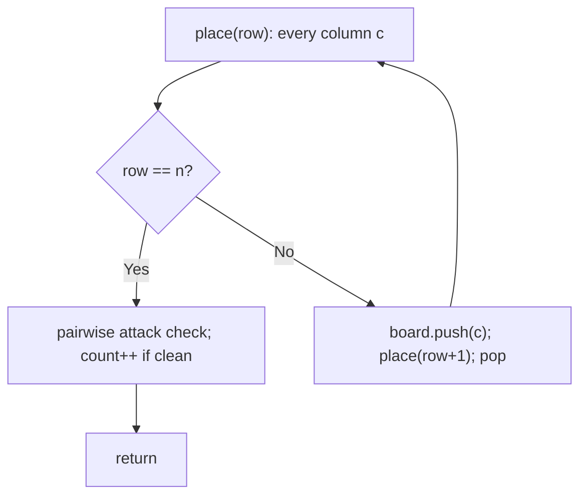
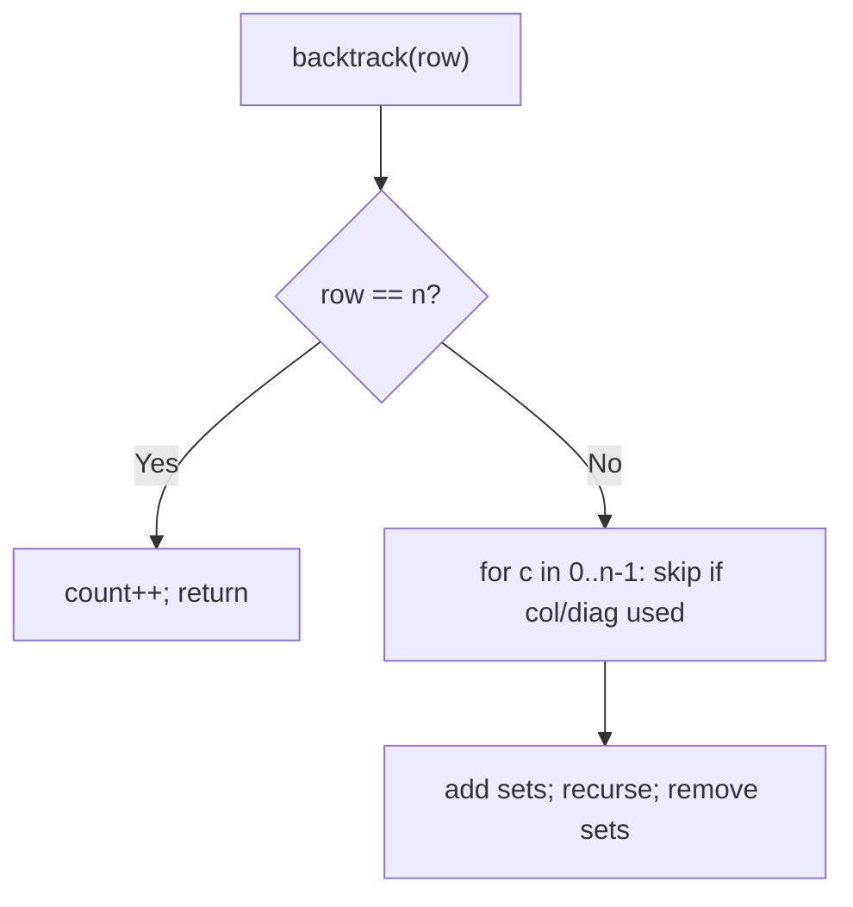

# 52. N-Queens II

- **LeetCode Link**: `https://leetcode.com/problems/n-queens-ii/`
- **Difficulty**: Hard
- **Pattern Category**: Backtracking / Constraint Propagation
- **Prerequisite Primer**: `00-foundations/03-core-algorithmic-patterns.md`

---

## 1. Problem Overview & Edge Case Matrix

### Problem Statement
The n-queens puzzle is the problem of placing `n` queens on an `n x n` chessboard such that no two queens attack each other. Given an integer `n`, return the number of distinct solutions to the n-queens puzzle.

```
Example 1:
Input: n = 4
Output: 2
Explanation: Two distinct placements exist:
  .Q.. / ..Q.      ..Q. / Q...
  ...Q / Q...  ,   Q... / ...Q
  Q... / ..Q.      ...Q / ..Q.
  ..Q. / .Q..      .Q.. / Q...

Example 2:
Input: n = 1
Output: 1
```

### Visual Problem Representation
```
n = 4, solution 1:         attack lines from Q at (0,1):
  . Q . .                    same column | same row | both diagonals
  . . . Q
  Q . . .
  . . Q .                  one queen per row by construction (row = depth)
```

### Upfront Edge Case Matrix
| Edge Case Category | Specific Input Scenario | Expected Behavior | Pitfall / Risk |
| :--- | :--- | :--- | :--- |
| Trivial | `n = 1` | Return `1` | Diagonal sets on 1×1 |
| No solution | `n = 2`, `n = 3` | Return `0` | Search that "finds" invalid boards |
| Classic | `n = 4` | Return `2` | Diagonal direction confusion |
| Max scale | `n = 9` (352 solutions) | Fast count | $O(n^n)$ blowup without pruning |
| Counting vs boards | Return COUNT (not boards) | Integer | Building board strings needlessly |

---

## 2. Level 1: Brute Force Approach

### Intuition & Visual Idea
Place a queen in every column of every row ($n^n$ boards), validating the full board only at the leaf. One queen per row by construction; columns and diagonals checked pairwise at depth $n$. Correct — and explores every doomed prefix to the bitter end.



### Pseudocode
```text
FUNCTION totalNQueensBruteForce(n):
    count = 0; board = []   // board[row] = column
    DEFINE attacksFree():
        FOR i < j IN board:
            IF board[i] == board[j]: RETURN false
            IF ABS(board[i]-board[j]) == j-i: RETURN false
        RETURN true
    DEFINE place(row):
        IF row == n: IF attacksFree(): count++; RETURN
        FOR c IN 0 .. n-1: board.PUSH(c); place(row+1); board.POP()
    place(0)
    RETURN count
```

### Step-by-Step Dry Run (Visual Trace)
| Step | Iteration / Pointer ($i, j$) | Current Value | State / Sub-array | Action Taken |
| :--- | :--- | :--- | :--- | :--- |
| 0 | `place(0..3)` all columns | $4^4 = 256$ leaves | Full enumeration | No pruning |
| 1 | leaf `[1,3,0,2]` | pairwise clean | Valid | `count = 1` |
| 2 | leaf `[2,0,3,1]` | pairwise clean | Valid | `count = 2` |
| 3 | other 254 leaves | attacks found | Rejected | Return `2` |

### Modern JavaScript Implementation
```javascript
/**
 * Level 1: Brute Force (enumerate all, validate at leaves)
 * Time Complexity:  O(n^n · n²) — every placement fully built and checked
 * Space Complexity: O(n) — board path plus stack
 */
function totalNQueensBruteForce(n) {
  let count = 0;
  const board = []; // board[row] = queen's column
  function attacksFree() {
    // Pairwise: shared column OR shared diagonal (|dc| == dr).
    for (let i = 0; i < board.length; i++) {
      for (let j = i + 1; j < board.length; j++) {
        if (board[i] === board[j]) return false;
        if (Math.abs(board[i] - board[j]) === j - i) return false;
      }
    }
    return true;
  }
  function place(row) {
    if (row === n) {
      if (attacksFree()) count++; // validate ONLY at full depth
      return;
    }
    for (let c = 0; c < n; c++) {
      board.push(c);
      place(row + 1);
      board.pop();
    }
  }
  place(0);
  return count;
}
```

### Complexity Breakdown
- **Time Complexity**: $O(n^n · n^2)$ — all placements, pairwise validation each.
- **Space Complexity**: $O(n)$ — board path; time is the catastrophe.

---

## 3. Level 2: Optimized Approach

### Intuition & Visual Bottleneck Elimination
Prune DURING placement with three conflict sets: occupied columns, `row−col` diagonals, `row+col` diagonals. A conflicting column is skipped before recursing — dead prefixes die at depth 1–2 instead of $n$. Same answers, exponentially less search.



### Pseudocode
```text
FUNCTION totalNQueensSets(n):
    count = 0
    cols = SET; diag1 = SET (row-col); diag2 = SET (row+col)
    DEFINE backtrack(row):
        IF row == n: count++; RETURN
        FOR c IN 0 .. n-1:
            IF c IN cols OR (row-c) IN diag1 OR (row+c) IN diag2: CONTINUE
            ADD all three; backtrack(row+1); REMOVE all three
    backtrack(0)
    RETURN count
```

### Step-by-Step Dry Run (Visual Trace)
| Step | Pointers / Window | Hash Map / Auxiliary State | Decision Logic | Output Accumulator |
| :--- | :--- | :--- | :--- | :--- |
| 0 | `row=0` | all columns free | Try `c=0`: sets `{0},{0},{0}` | Recurse |
| 1 | `row=1` | `c=0` col clash, `c=1` diag clash | Only `c=2,3` viable | Branch |
| 2 | deep recursion | conflicts prune early | Valid leaves counted | `count = 2` |
| 3 | `n=2` | row 1 fully blocked | Zero leaves | Return `0` |

### Modern JavaScript Implementation
```javascript
/**
 * Level 2: Optimized (conflict-set pruning)
 * Time Complexity:  O(n!) worst case — pruned hard in practice
 * Space Complexity: O(n) — three sets plus stack
 */
function totalNQueensSets(n) {
  let count = 0;
  const cols = new Set(); // occupied columns
  const diag1 = new Set(); // row - col: constant on \ diagonals
  const diag2 = new Set(); // row + col: constant on / diagonals
  function backtrack(row) {
    if (row === n) {
      count++; // every placed queen survived all conflict checks
      return;
    }
    for (let c = 0; c < n; c++) {
      const d1 = row - c;
      const d2 = row + c;
      if (cols.has(c) || diag1.has(d1) || diag2.has(d2)) continue; // prune
      cols.add(c);
      diag1.add(d1);
      diag2.add(d2);
      backtrack(row + 1);
      cols.delete(c); // UNCHOOSE all three symmetrically
      diag1.delete(d1);
      diag2.delete(d2);
    }
  }
  backtrack(0);
  return count;
}
```

### Complexity Breakdown
- **Time Complexity**: $O(n!)$ worst case — but pruning collapses the constant so $n = 9$ runs in milliseconds.
- **Space Complexity**: $O(n)$ — three sets plus stack; set ops are $O(1)$ amortized.

---

## 4. Level 3: Most Optimal / Canonical Approach

### Intuition & Mathematical / Invariant Proof
Bitmask backtracking: `cols`, `ld` (left-diagonals), `rd` (right-diagonals) as $n$-bit integers. `free = ~(cols|ld|rd) & all` isolates placeable columns; `bit = free & -free` peels the lowest one. Diagonals shift per row (`<<1` / `>>1`) because diagonal membership moves one column per row down. Leaf test `cols === all` (all columns filled ⟺ $n$ queens placed validly). Invariant: at depth $d$, each mask's set bits mark exactly the attacked columns of row $d$. All operations are single CPU words — the fastest exact counter known.

```
n=4: backtrack(0000,0000,0000): free=1111 -> bit 0001: cols=0001,
  ld=(0000|0001)<<1=0010, rd=(0000|0001)>>1=0000 -> row 1 attacks cols {1,2}...
```

### Pseudocode
```text
FUNCTION totalNQueens(n):
    count = 0; all = (1 << n) - 1
    DEFINE backtrack(cols, ld, rd):
        IF cols == all: count++; RETURN
        free = ~(cols | ld | rd) & all
        WHILE free != 0:
            bit = free & -free     // lowest set bit
            free ^= bit            // remove it from the frontier
            backtrack(cols | bit, ((ld | bit) << 1) & all, (rd | bit) >> 1)
    backtrack(0, 0, 0)
    RETURN count
```

### Step-by-Step Dry Run (Visual Trace)
| Step | Pointer $L$ | Pointer $R$ | Invariant Checked | In-Place State |
| :--- | :--- | :--- | :--- | :--- |
| 1 | `(0,0,0)` | `free = 1111` | Take bit `0001` | Recurse `(0001,0010,0000)` |
| 2 | row 1 | attacked `{1,2}` | `free = 1000` | Only col 3 |
| 3 | row 2 | attacked `{0,1,2,3}`? | `free = 0000` | Dead end, backtrack |
| 4 | other branches | two complete | `cols === 1111` twice | Return `2` |

### Modern JavaScript Implementation
```javascript
/**
 * Level 3: Most Optimal / Canonical (bitmask backtracking)
 * Time Complexity:  O(n!) worst case — minimal constant (word-level ops)
 * Space Complexity: O(n) — call stack only; zero heap allocation
 */
function totalNQueens(n) {
  let count = 0;
  const all = (1 << n) - 1; // n low bits set: the full-board target
  function backtrack(cols, ld, rd) {
    // All columns filled with no conflict: one valid arrangement.
    if (cols === all) {
      count++;
      return;
    }
    // Free columns this row: attacked bits cleared, masked to board width.
    let free = ~(cols | ld | rd) & all;
    while (free !== 0) {
      const bit = free & -free; // isolate lowest free column (two's complement)
      free ^= bit; // consume it from this row's frontier
      // Diagonals drift one column per row down: shift before descending.
      backtrack(cols | bit, ((ld | bit) << 1) & all, (rd | bit) >> 1);
    }
  }
  backtrack(0, 0, 0);
  return count;
}
```

### Complexity Breakdown
- **Time Complexity**: $O(n!)$ worst case — optimal exact-counting bound; word ops make it the fastest in practice.
- **Space Complexity**: $O(n)$ — stack only; no sets, no arrays, no boards.

---

## 5. JavaScript-Specific Gotchas & V8 Optimizations
- **GC Pressure**: Avoid allocating objects inside tight loops ($O(N)$ closures). Level 3 allocates NOTHING per node (numbers only) — Level 2's Set add/delete churn and Level 1's leaf validations are the pressure removed.
- **Type Coercion / Sorting**: Bitwise ops are 32-bit: exact for $n \le 9$ (spec max) but `1 << 31` flips sign — cap bitmask queens at $n \le 30$ or switch to `BigInt` masks. `free & -free` relies on two's complement (holds in JS int32).
- **Index Bounds**: `((ld | bit) << 1) & all` masking is load-bearing — without `& all`, bit $n$ leaks into the word and `free` miscomputes on deep rows. `>> 1` (sign-propagating) is safe here only because masks stay non-negative; `>>>` states it explicitly.

---

## 6. Real-World MAANG Interview Follow-Ups & Extensions

### Follow-Up 1: Return the boards (N-Queens I)
- **Scenario**: Return all board layouts, not just the count (LeetCode 51).
- **Solution Strategy**: Level 2's skeleton plus a `queens[]` placement array; render `'.'.repeat` strings at leaves. Bitmask Level 3 can also emit (decode bits to columns per row).
- **JS Code / Implementation Pattern**:
```javascript
function solveNQueens(n) {
  const boards = [];
  const queens = []; // queens[row] = column (Level 2 + placement log)
  function backtrack(row, cols, d1, d2) {
    if (row === n) return boards.push(renderBoard(queens, n));
    for (let c = 0; c < n; c++) {
      if (cols.has(c) || d1.has(row - c) || d2.has(row + c)) continue;
      queens.push(c);
      cols.add(c); d1.add(row - c); d2.add(row + c);
      backtrack(row + 1, cols, d1, d2);
      queens.pop();
      cols.delete(c); d1.delete(row - c); d2.delete(row + c);
    }
  }
  backtrack(0, new Set(), new Set(), new Set());
  return boards;
}
```

### Follow-Up 2: Symmetry-reduced counting
- **Scenario**: Count distinct solutions up to rotation/reflection (Burnside-style reduction).
- **Solution Strategy**: Fix the first queen to columns `< n/2` (mirror symmetry) and double, handling the center column separately for odd $n$ — ~2× speedup on top of Level 3 with exact correction.
- **JS Code / Implementation Pattern**:
```javascript
function totalNQueensSymmetric(n) {
  // first-row mirror symmetry: count half, double, fix the center
  return countHalf(n) * 2 + countCenterColumn(n);
}
```

### Follow-Up 3: $10^3$-queens via local search (no exact count needed)
- **Scenario & In-Depth Solution**: $n$ too large for exact backtracking; one VALID board suffices (not the count). Min-conflicts local search: start random, repeatedly move the most-conflicted queen to its least-conflicted row-slot — solves $n = 10^6$ in near-linear time probabilistically. Different problem (satisfaction vs counting) — name the distinction.
```javascript
function minConflictsQueens(n, maxSteps = 10000) {
  const queens = randomPlacement(n);
  for (let s = 0; s < maxSteps && conflicts(queens) > 0; s++) {
    moveWorstQueen(queens);
  }
  return queens;
}
```
