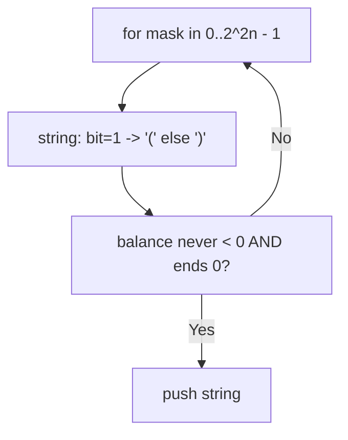
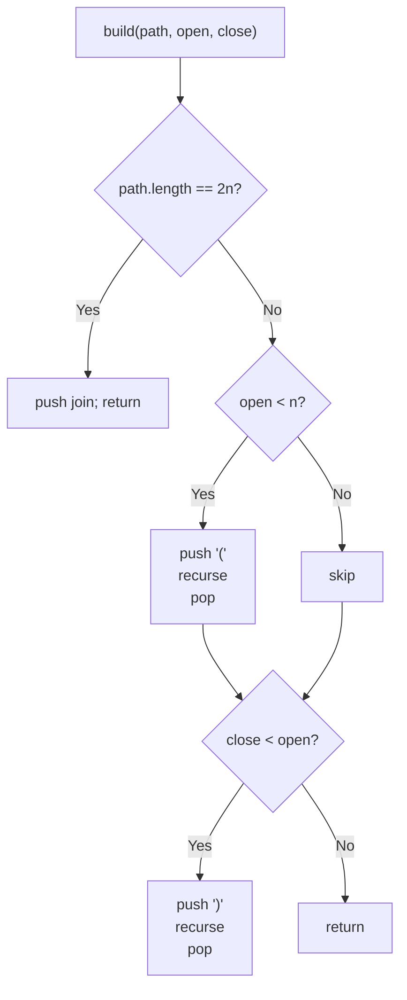
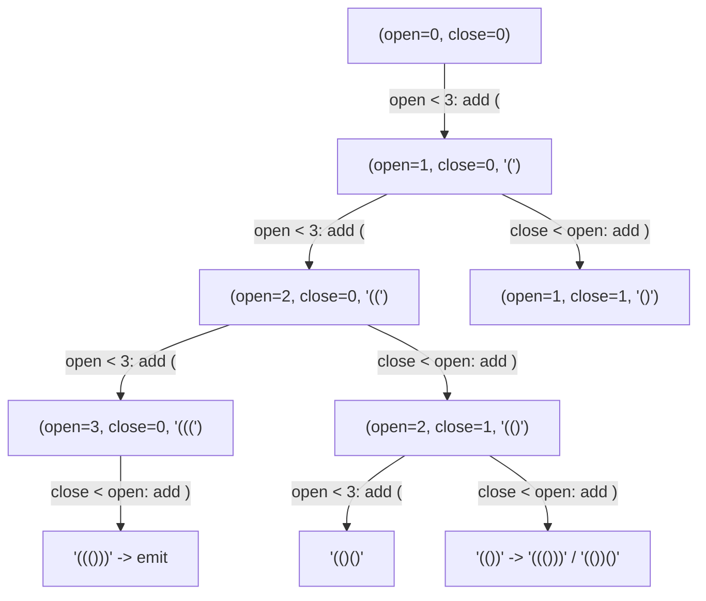

# 22. Generate Parentheses

- **LeetCode Link**: `https://leetcode.com/problems/generate-parentheses/`
- **Difficulty**: Medium
- **Pattern Category**: Backtracking / Constrained Construction
- **Prerequisite Primer**: `00-foundations/03-core-algorithmic-patterns.md`

---

## 1. Problem Overview & Edge Case Matrix

### Problem Statement
Given `n` pairs of parentheses, write a function to generate all combinations of well-formed parentheses.

```
Example 1:
Input: n = 3
Output: ["((()))","(()())","(())()","()(())","()()()"]

Example 2:
Input: n = 1
Output: ["()"]
```

### Visual Problem Representation
```
n = 3 decision tree (open < 3, close < open):

              ""                          ((()))  (()())  (())()
             (                            ()(())  ()()()
           /   \
         ((    ()
        / \   / \
      ((( (() ()( ())

      5 leaves (Catalan C3) out of 2^6 = 64 raw strings
```

### Upfront Edge Case Matrix
| Edge Case Category | Specific Input Scenario | Expected Behavior | Pitfall / Risk |
| :--- | :--- | :--- | :--- |
| Minimum | `n = 1` | `["()"]` | Base case emitting empty |
| Zero (defensive) | `n = 0` | `[``]` or `[]` (decide + document) | Infinite recursion on no-opener |
| Max scale | `n = 8` (1,430 answers) | Complete set | Exploring all $2^{16}$ strings |
| Order freedom | Any order accepted | Any complete set | Test asserting exact sequence |
| Validity invariant | Every prefix | `#('(') >= #(')')` always | Closing before opening |

---

## 2. Level 1: Brute Force Approach

### Intuition & Visual Idea
Enumerate all $2^{2n}$ parenthesis strings via bitmask, keep the balanced ones (running balance never negative, ends at zero). Zero construction insight — $O(2^{2n}·n)$ to find Catalan-many answers.



### Pseudocode
```text
FUNCTION generateParenthesisBruteForce(n):
    out = []
    FOR mask IN 0 .. 2^(2n) - 1:
        s = ""; bal = 0; ok = true
        FOR i FROM 2n-1 DOWNTO 0:
            ch = BIT i OF mask ? "(" : ")"
            s += ch; bal += (ch == "(" ? 1 : -1)
            IF bal < 0: ok = false; BREAK
        IF ok AND bal == 0: out.PUSH(s)
    RETURN out
```

### Step-by-Step Dry Run (Visual Trace)
| Step | Iteration / Pointer ($i, j$) | Current Value | State / Sub-array | Action Taken |
| :--- | :--- | :--- | :--- | :--- |
| 0 | masks with early `)` | balance `-1` | Invalid prefix | Rejected fast |
| 1 | mask for `((()))` | balance `1,2,3,2,1,0` | Never negative, ends 0 | Kept |
| 2 | 64 masks total | 5 survive | Catalan filter | Return 5 strings |

### Modern JavaScript Implementation
```javascript
/**
 * Level 1: Brute Force (enumerate all + balance filter)
 * Time Complexity:  O(2^2n · n) — every string built and checked
 * Space Complexity: O(2^2n · n) — output plus working string
 */
function generateParenthesisBruteForce(n) {
  const out = [];
  const total = 1 << (2 * n);
  for (let mask = 0; mask < total; mask++) {
    let s = '';
    let bal = 0;
    let ok = true;
    // Bit i (high to low) maps to position: 1 => '(', 0 => ')'.
    for (let i = 2 * n - 1; i >= 0; i--) {
      const ch = (mask >> i) & 1 ? '(' : ')';
      s += ch;
      bal += ch === '(' ? 1 : -1;
      if (bal < 0) {
        ok = false; // closing before opening: invalid prefix, stop early
        break;
      }
    }
    if (ok && bal === 0) out.push(s);
  }
  return out;
}
```

### Complexity Breakdown
- **Time Complexity**: $O(2^{2n}·n)$ — exponential enumeration for Catalan answers.
- **Space Complexity**: $O(2^{2n}·n)$ — output plus per-string building.

---

## 3. Level 2: Optimized Approach

### Intuition & Visual Bottleneck Elimination
Constrained construction: track `(open, close)` counts; add `(` while `open < n`, add `)` while `close < open`. Invalid prefixes are never built — the search visits exactly the valid decision tree ($O(4^n / \sqrt{n})$ nodes for Catalan $C_n$ answers).



### Pseudocode
```text
FUNCTION generateParenthesisBacktrack(n):
    out = []
    DEFINE build(path, open, close):
        IF path.LENGTH == 2n: out.PUSH(path.JOIN("")); RETURN
        IF open < n: path.PUSH("("); build(path, open+1, close); path.POP()
        IF close < open: path.PUSH(")"); build(path, open, close+1); path.POP()
    build([], 0, 0)
    RETURN out
```

### Step-by-Step Dry Run (Visual Trace)
| Step | Pointers / Window | Hash Map / Auxiliary State | Decision Logic | Output Accumulator |
| :--- | :--- | :--- | :--- | :--- |
| 0 | `([], 0, 0)` | `open < 3` | Push `(` | Recurse `(1, 0)` |
| 1 | `([(, 1, 0)` | `open < 3` | Push `(` | Recurse `(2, 0)` |
| 2 | `([((, 2, 0)` | `open < 3` | Push `(` | Recurse `(3, 0)` |
| 3 | `([(((, 3, 0)` | open exhausted | Only `)` ×3 | Emit `"((()))"`, unwind |

### Modern JavaScript Implementation
```javascript
/**
 * Level 2: Optimized (open/close constrained backtracking)
 * Time Complexity:  O(4^n / sqrt(n)) — valid-tree nodes only (Catalan-scale)
 * Space Complexity: O(4^n / sqrt(n)) — output plus O(n) path/stack
 */
function generateParenthesisBacktrack(n) {
  const out = [];
  function build(path, open, close) {
    if (path.length === 2 * n) {
      out.push(path.join('')); // complete: exactly n pairs, valid by construction
      return;
    }
    // Open while quota remains; close only while it won't unbalance.
    if (open < n) {
      path.push('(');
      build(path, open + 1, close);
      path.pop();
    }
    if (close < open) {
      path.push(')');
      build(path, open, close + 1);
      path.pop();
    }
  }
  build([], 0, 0);
  return out;
}
```

### Complexity Breakdown
- **Time Complexity**: $O(4^n / \sqrt{n})$ — visits only valid prefixes (Catalan-scale search).
- **Space Complexity**: $O(4^n / \sqrt{n})$ — output plus $O(n)$ working path.

---

## 4. Level 3: Most Optimal / Canonical Approach

### Intuition & Mathematical / Invariant Proof
Catalan closure decomposition with memoization: every valid string of $k$ pairs splits uniquely as `"(" + A + ")" + B` where $A$ has $i$ pairs and $B$ has $k-1-i$. Recurse over all splits with memoized subresults — each distinct subproblem ($0..n$) solved once, combined by Cartesian product. Invariant: `gen(k)` returns EXACTLY the set of valid $k$-pair strings (induction on the unique first-closure split). Same output bound, zero invalid exploration, reusable subproblems.

```
gen(3) = i=0: "(" + "" + ")" + gen(2) -> "(())()", "()()()"... wait:
  i=0: "(" + gen(0) + ")" + gen(2) = "()()+gen(2)" = "()()()", "()(())"
  i=1: "(" + gen(1) + ")" + gen(1) = "(() )" + "()" = "(())()"
  i=2: "(" + gen(2) + ")" + gen(0) = "(( ))" variants = "((()))","(()())"
  total: 2 + 1 + 2 = 5 ✓
```

### Pseudocode
```text
FUNCTION generateParenthesis(n):
    memo = MAP(0 -> [""])
    DEFINE gen(k):
        IF memo HAS k: RETURN memo.GET(k)
        out = []
        FOR left IN 0 .. k-1:
            FOR a IN gen(left):
                FOR b IN gen(k-1-left):
                    out.PUSH("(" + a + ")" + b)
        memo.SET(k, out); RETURN out
    RETURN gen(n)
```

### Step-by-Step Dry Run (Visual Trace)
| Step | Pointer $L$ | Pointer $R$ | Invariant Checked | In-Place State |
| :--- | :--- | :--- | :--- | :--- |
| 1 | `gen(0)` | base | `[""]` | Memoized |
| 2 | `gen(1)` | `i=0`: `"("+""+")"+"` | `["()"]` | Memoized |
| 3 | `gen(2)` | `i=0`: `"()"+gen(1)` → `()()`; `i=1`: `(gen(1))` → `(())` | 2 strings | Memoized |
| 4 | `gen(3)` | splits `i=0,1,2` | `2 + 1 + 2 = 5` | Return 5 strings |

### Modern JavaScript Implementation
```javascript
/**
 * Level 3: Most Optimal / Canonical (Catalan closure decomposition + memo)
 * Time Complexity:  O(4^n / sqrt(n)) — each subproblem solved once
 * Space Complexity: O(4^n / sqrt(n)) — memoized subresults + output
 */
function generateParenthesis(n) {
  const memo = new Map([[0, ['']]]); // gen(0): exactly one empty string
  function gen(k) {
    if (memo.has(k)) return memo.get(k); // each size solved ONCE
    const out = [];
    // Unique first-closure split: "(" + (i pairs) + ")" + (k-1-i pairs).
    for (let left = 0; left < k; left++) {
      for (const a of gen(left)) {
        for (const b of gen(k - 1 - left)) {
          out.push('(' + a + ')' + b);
        }
      }
    }
    memo.set(k, out);
    return out;
  }
  return gen(n);
}
```

### Complexity Breakdown
- **Time Complexity**: $O(4^n / \sqrt{n})$ — optimal output-scale; memoization removes redundant subtree rebuilds across splits.
- **Space Complexity**: $O(4^n / \sqrt{n})$ — memoized families plus output; working stack $O(n)$.

---

## 5. JavaScript-Specific Gotchas & V8 Optimizations
- **GC Pressure**: Avoid allocating objects inside tight loops ($O(N)$ closures). Level 1's per-mask strings ($2^{2n}$ of them, mostly discarded) are the pressure removed — Levels 2–3 allocate only valid prefixes/answers.
- **Type Coercion / Sorting**: `(mask >> i) & 1` is 32-bit: exact for $2n \le 30$ ($n \le 15`, spec max $n = 8$); beyond that use `BigInt` masks. `path.join('')` with explicit separator — default `join()` inserts COMMAS.
- **Index Bounds**: `close < open` (strict) is the validity guard — `close <= open` emits `)` at balance zero and builds negative-balance prefixes. `n = 0` should return `[""]` (one empty combo, Catalan $C_0 = 1$) or `[]` per team convention — decide and document; Level 2/3 naturally yield `[""]`.

---

## 6. Real-World MAANG Interview Follow-Ups & Extensions

### Follow-Up 1: Kth lexicographic valid string without enumerating
- **Scenario**: Return the k-th valid string for large $n$ (enumeration impossible).
- **Solution Strategy**: Catalan-count-guided descent: at each position, count completions with `(` next ($Catalan$ products); skip the block if $k$ exceeds it, else take it. $O(n^2)$ time, $O(n)$ space.
- **JS Code / Implementation Pattern**:
```javascript
function kthParenthesis(n, k) {
  // Catalan triangle descent: skip whole '(' blocks arithmetically
  return descendKth(n, k);
}
```

### Follow-Up 2: Validate + score (longest valid prefix / substring)
- **Scenario**: Given arbitrary strings, validate (LeetCode 20) or find longest valid substring (LeetCode 32).
- **Solution Strategy**: Counter/stack validation in one pass; longest-valid via index stack (push `-1` sentinel, reset on imbalance) — same balance invariant as Level 2's guards, applied analytically.
- **JS Code / Implementation Pattern**:
```javascript
function longestValidParentheses(s) {
  const stack = [-1]; // sentinel: base of the current valid run
  let best = 0;
  for (let i = 0; i < s.length; i++) {
    if (s[i] === '(') stack.push(i);
    else {
      stack.pop();
      if (stack.length === 0) stack.push(i);
      else best = Math.max(best, i - stack[stack.length - 1]);
    }
  }
  return best;
}
```

### Follow-Up 3: Streaming generation with $O(n)$ RAM
- **Scenario & In-Depth Solution**: Stream all valid strings with only the current path in RAM (no output array). Level 2's skeleton with a `yield` at the leaf instead of `push` — a generator producing Catalan-many strings in $O(n)$ memory. Consumer-paced via backpressure.
```javascript
function* streamParentheses(n) {
  const path = [];
  function* build(open, close) {
    if (path.length === 2 * n) {
      yield path.join('');
      return;
    }
    if (open < n) {
      path.push('(');
      yield* build(open + 1, close);
      path.pop();
    }
    if (close < open) {
      path.push(')');
      yield* build(open, close + 1);
      path.pop();
    }
  }
  yield* build(0, 0);
}
```

---

## 7. What LeetCode Discuss Says (Language-Independent)

Source: top-voted post by Yuvaraj —
`https://leetcode.com/problems/generate-parentheses/solutions/2542620/python-java-w-explanation-faster-than-96-lq3a/`
— 271.9K views.
Language-independent summary. No new JS here.

### A. Optimal way from Discuss (Guided Backtracking with Open/Close Invariants)

Rather than enumerating all $2^{2n}$ permutations and validating balanced parentheses post-hoc, construct only valid prefixes by enforcing structural balance invariants during depth-first search:

1. **State Tracking:** Maintain counters `open` (number of `'('` placed) and `close` (number of `')'` placed), along with the path buffer `current`.
2. **Branching Invariants:**
   - **Add Open Parenthesis:** Permitted if and only if `open < n`.
   - **Add Close Parenthesis:** Permitted if and only if `close < open` (ensures every closing bracket is matched to an unclosed opening bracket).
3. **Base Case:** When `current.length == 2 * n`, all pairs are placed and strictly balanced. Append the assembled string to `results` and return.
4. **Execution:** Invoke `backtrack(0, 0)` and return `results`.

```text
FUNCTION generateParenthesis(n):
    results = []
    current = []

    FUNCTION backtrack(open, close):
        IF length(current) == 2 * n:
            results.append(JOIN(current, ""))
            RETURN

        IF open < n:
            current.push('(')
            backtrack(open + 1, close)
            current.pop()

        IF close < open:
            current.push(')')
            backtrack(open, close + 1)
            current.pop()

    backtrack(0, 0)
    RETURN results
```

- Time: O(4^n / sqrt(n)) — exactly the $n$-th Catalan number $C_n = \frac{1}{n+1}\binom{2n}{n}$, with $O(n)$ string building per leaf.
- Space: O(n) auxiliary space for recursion stack and string buffer of length $2n$.



### B. Dry run on LeetCode Example 1 (`n = 3`)

- Start `(0, 0, "")`:
  - `open < 3` -> push `'('`, state `(1, 0)`:
    - push `'('` -> `(2, 0)`:
      - push `'('` -> `(3, 0)`:
        - must push `')'` three times -> emits `"((()))"`.
      - push `')'` -> `(2, 1)`:
        - push `'('` -> `(3, 1)` -> push `')'` twice -> emits `"(()())"`.
        - push `')'` -> `(2, 2)` -> push `'('` -> `(3, 2)` -> push `')'` -> emits `"(())()"`.
    - push `')'` -> `(1, 1)`:
      - push `'('` -> `(2, 1)`:
        - push `'('` -> `(3, 1)` -> push `')'` twice -> emits `"()(())"`.
        - push `')'` -> `(2, 2)` -> push `'('` -> `(3, 2)` -> push `')'` -> emits `"()()()"`.

Total generated: 5 valid expressions ($C_3 = 5$).

### C. Why Guided Backtracking Eliminates Stack Validation

- Generating all combinations blindly yields $2^{2n}$ candidate strings ($4^n$), each requiring an $O(n)$ stack check, yielding $O(n \cdot 4^n)$ operations with high failure rates.
- Enforcing `close < open <= n` ensures every partial string is guaranteed to be extendable into a valid balanced expression. Zero invalid paths are ever constructed.

### D. Pitfalls from comments

- **Permitting Unbalanced Closures:** Allowing `close < n` instead of `close < open` generates strings like `")("` that violate well-formed parenthesization.
- **Buffer Mutation Across Calls:** In recursive backtracking, forgetting to pop the added parenthesis causes dirty states to bleed across sibling recursions.

### E. Companies

- Discuss post itself names none.
  Companies tab on LeetCode is premium-locked.
- External source:
  `https://github.com/liquidslr/leetcode-company-wise-problems`
  (LeetCode company tags, updated June 2025).
- All-time (35): Adobe, Amazon, Apple, Avito, Bloomberg, Dell, Disney, eBay, EPAM Systems, Expedia, Flipkart, Goldman Sachs, Google, Grammarly, Huawei, IBM, Infosys, Intuit, MakeMyTrip, Meta, Microsoft, Morgan Stanley, Myntra, Oracle, Qualcomm, Salesforce, Samsung, ServiceNow, tcs, TikTok, Uber, Walmart Labs, Yandex, Zenefits, Zoho.
- Recent: 30 days — Google.
- Recent: 3 months — Amazon, Bloomberg, Google, Meta, Microsoft.
