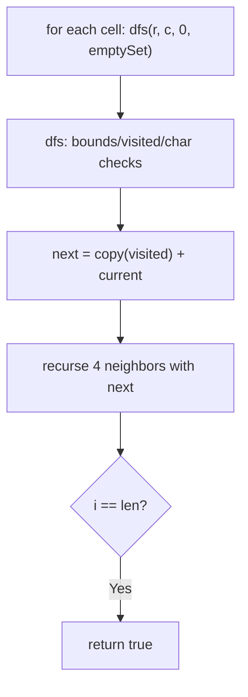
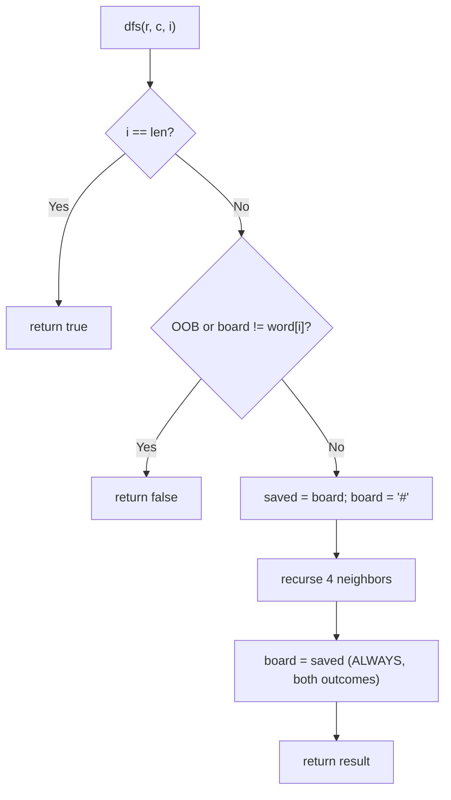

# 79. Word Search

- **LeetCode Link**: `https://leetcode.com/problems/word-search/`
- **Difficulty**: Medium
- **Pattern Category**: Backtracking / Grid DFS with State Restore
- **Prerequisite Primer**: `00-foundations/03-core-algorithmic-patterns.md`

---

## 1. Problem Overview & Edge Case Matrix

### Problem Statement
Given an `m x n` grid of characters `board` and a string `word`, return `true` if `word` exists in the grid. The word can be constructed from letters of sequentially adjacent cells, where adjacent cells are horizontally or vertically neighboring. The same letter cell may not be used more than once in a word.

```
Example 1:
Input: board = [["A","B","C","E"],["S","F","C","S"],["A","D","E","E"]], word = "ABCCED"
Output: true

Example 2:
Input: board = [["A","B","C","E"],["S","F","C","S"],["A","D","E","E"]], word = "SEE"
Output: true

Example 3:
Input: board = [["A","B","C","E"],["S","F","C","S"],["A","D","E","E"]], word = "ABCB"
Output: false
```

### Visual Problem Representation
```
A B C E      "ABCCED": (0,0)->(0,1)->(0,2)->(1,2)->(2,2)->(2,1) ✓
S F C S      "ABCB": B used at (0,1), then C...B needs a FRESH B cell ✗
A D E E
```

### Upfront Edge Case Matrix
| Edge Case Category | Specific Input Scenario | Expected Behavior | Pitfall / Risk |
| :--- | :--- | :--- | :--- |
| Single cell | `[["A"]]`, `"A"` / `"B"` | `true` / `false` | Depth-0 base case |
| Word longer than cells | 2 cells, 3-letter word | Return `false` | Search that "succeeds" by reuse |
| Cell reuse required | `"ABCB"` (needs B twice) | Return `false` | Visited tracking omitted |
| Board mutated | Caller reuses board after | Unchanged contents | Tombstone left behind on early return |
| First-char flood | All cells match `word[0]` | Correct (slow) | Start-cell pruning absent |

---

## 2. Level 1: Brute Force Approach

### Intuition & Visual Idea
DFS from every cell carrying a FRESHLY COPIED visited set per step — no shared state, no restore logic, obviously correct. Each step clones the path set: $O(L)$ copy overhead per node on top of the $O(3^L)$ search.



### Pseudocode
```text
FUNCTION existBruteForce(board, word):
    FOR EACH cell (r, c):
        IF dfs(r, c, 0, EMPTY SET): RETURN true
    RETURN false

FUNCTION dfs(r, c, i, visited):
    IF i == word.LENGTH: RETURN true
    IF OUT OF BOUNDS: RETURN false
    IF VISITED(r,c) OR board[r][c] != word[i]: RETURN false
    next = COPY(visited) + (r,c)
    RETURN dfs(4 NEIGHBORS, i+1, next) ANY
```

### Step-by-Step Dry Run (Visual Trace)
| Step | Iteration / Pointer ($i, j$) | Current Value | State / Sub-array | Action Taken |
| :--- | :--- | :--- | :--- | :--- |
| 0 | start `(0,0)`, `i=0` | `A == A` | `visited = {(0,0)}` (fresh copy) | Recurse 4 ways |
| 1 | `(0,1)`, `i=1` | `B == B` | Copied set + `(0,1)` | Recurse |
| 2 | `(0,2) → (1,2) → (2,2) → (2,1)` | `C,C,E,D` match | Sets copied each step | `i = 6 = len` |
| 3 | base case | — | — | Return `true` |

### Modern JavaScript Implementation
```javascript
/**
 * Level 1: Brute Force (copied visited-set DFS)
 * Time Complexity:  O(m·n·3^L · L) — search plus per-step set copies
 * Space Complexity: O(L²) — copied sets along the path
 */
function existBruteForce(board, word) {
  const rows = board.length;
  const cols = board[0].length;
  function dfs(r, c, i, visited) {
    if (i === word.length) return true; // all characters matched
    if (r < 0 || r >= rows || c < 0 || c >= cols) return false;
    const key = r + ',' + c;
    // Fresh-cell + char-match gate (string key: no collision).
    if (visited.has(key) || board[r][c] !== word[i]) return false;
    // Copy-on-descend: no shared state, no restore logic — at O(L) per step.
    const next = new Set(visited);
    next.add(key);
    return (
      dfs(r + 1, c, i + 1, next) ||
      dfs(r - 1, c, i + 1, next) ||
      dfs(r, c + 1, i + 1, next) ||
      dfs(r, c - 1, i + 1, next)
    );
  }
  for (let r = 0; r < rows; r++) {
    for (let c = 0; c < cols; c++) {
      if (dfs(r, c, 0, new Set())) return true;
    }
  }
  return false;
}
```

### Complexity Breakdown
- **Time Complexity**: $O(m·n·3^L·L)$ — the $3^L$ search (4 first step, ≤3 after) times set-copy overhead.
- **Space Complexity**: $O(L^2)$ — copied sets along the path; sharing removes the square.

---

## 3. Level 2: Optimized Approach

### Intuition & Visual Bottleneck Elimination
In-place tombstone marking: write `'#'` into the current cell (outside `'A'–'Z'`, never matches), recurse, then RESTORE the saved char. Shared board, $O(1)$ mark cost, $O(L)$ stack — the canonical technique.



### Pseudocode
```text
FUNCTION existInPlace(board, word):
    DEFINE dfs(r, c, i):
        IF i == word.LENGTH: RETURN true
        IF OOB OR board[r][c] != word[i]: RETURN false
        saved = board[r][c]; board[r][c] = "#"
        found = dfs(4 NEIGHBORS, i+1) ANY
        board[r][c] = saved     // restore on BOTH paths
        RETURN found
    FOR EACH cell: IF dfs(r, c, 0): RETURN true
    RETURN false
```

### Step-by-Step Dry Run (Visual Trace)
| Step | Pointers / Window | Hash Map / Auxiliary State | Decision Logic | Output Accumulator |
| :--- | :--- | :--- | :--- | :--- |
| 0 | `(0,0)` matches `A` | tombstone `#`, recurse | 4 neighbors | — |
| 1 | `(0,1)` matches `B` | tombstone, recurse | `(0,0)` now `#` ≠ `B`: no bounce-back | Forward only |
| 2 | chain to `(2,1)` | all match | `i = 6` → true | Unwind restores all |
| 3 | `"ABCB"` | second `B` needs fresh cell | Only `(0,1)` is `B`, tombstoned | Return `false` |

### Modern JavaScript Implementation
```javascript
/**
 * Level 2: Optimized (tombstone mark-and-restore DFS)
 * Time Complexity:  O(m·n·3^L) — search without copy overhead
 * Space Complexity: O(L) — call stack depth equals word length
 */
function existInPlace(board, word) {
  const rows = board.length;
  const cols = board[0].length;
  function dfs(r, c, i) {
    if (i === word.length) return true;
    if (r < 0 || r >= rows || c < 0 || c >= cols || board[r][c] !== word[i]) return false;
    const saved = board[r][c];
    board[r][c] = '#'; // tombstone: outside A-Z, blocks immediate bounce-back
    const found =
      dfs(r + 1, c, i + 1) ||
      dfs(r - 1, c, i + 1) ||
      dfs(r, c + 1, i + 1) ||
      dfs(r, c - 1, i + 1);
    board[r][c] = saved; // restore ALWAYS: siblings + caller see a clean board
    return found;
  }
  for (let r = 0; r < rows; r++) {
    for (let c = 0; c < cols; c++) {
      if (dfs(r, c, 0)) return true;
    }
  }
  return false;
}
```

### Complexity Breakdown
- **Time Complexity**: $O(m·n·3^L)$ — the search itself, no copy multiplier.
- **Space Complexity**: $O(L)$ — stack only; the board carries visit state transiently.

---

## 4. Level 3: Most Optimal / Canonical Approach

### Intuition & Mathematical / Invariant Proof
Level 2's DFS plus three cheap pre-checks that prune hopeless cases in linear time: (1) word longer than cells → impossible; (2) character-frequency deficit (some letter needed more often than present) → impossible; (3) rare-first orientation — search the word from whichever end starts rarer (fewer start cells, faster dead-ends). None changes worst-case complexity; all slash real-world search trees. Invariant: every check is SOUND (only rejects true negatives), so answers never change — only speed does.

```
"ABCCED": counts ok; first 'A' ×2 vs last 'D' ×1 -> search REVERSED "DECCBA"
  start cells: 1 (D) instead of 2 (A) -> half the top-level branches
```

### Pseudocode
```text
FUNCTION exist(board, word):
    IF word.LENGTH > rows * cols: RETURN false
    IF FREQUENCY-DEFICIT(board, word): RETURN false
    w = word
    IF COUNT(last) < COUNT(first): w = REVERSE(word)   // rare end first
    RETURN existInPlace-CORE(board, w)
```

### Step-by-Step Dry Run (Visual Trace)
| Step | Pointer $L$ | Pointer $R$ | Invariant Checked | In-Place State |
| :--- | :--- | :--- | :--- | :--- |
| 1 | length `6 ≤ 12` | pass | Feasible size | Continue |
| 2 | frequencies | board covers `A,B,C×2,E,D` | No deficit | Continue |
| 3 | `'A'×2` vs `'D'×1` | rarer last | Search `"DECCBA"` | 1 start cell |
| 4 | tombstone DFS | matches reversed | — | Return `true` |

### Modern JavaScript Implementation
```javascript
/**
 * Level 3: Most Optimal / Canonical (pruned + rare-first in-place DFS)
 * Time Complexity:  O(m·n·3^L) worst case — pre-checks prune in practice
 * Space Complexity: O(L) — call stack; frequency maps are O(1) (fixed alphabet)
 */
function exist(board, word) {
  const rows = board.length;
  const cols = board[0].length;
  // Sound prune 1: more letters than cells can never fit.
  if (word.length > rows * cols) return false;
  // Sound prune 2: any letter needed more often than present kills the search.
  const counts = new Map();
  for (const row of board) {
    for (const ch of row) counts.set(ch, (counts.get(ch) ?? 0) + 1);
  }
  const need = new Map();
  for (const ch of word) need.set(ch, (need.get(ch) ?? 0) + 1);
  for (const [ch, k] of need) {
    if ((counts.get(ch) ?? 0) < k) return false;
  }
  // Rare-first: fewer start cells + faster dead-ends (answer unchanged).
  let w = word;
  const firstCount = counts.get(word[0]) ?? 0;
  const lastCount = counts.get(word[word.length - 1]) ?? 0;
  if (lastCount < firstCount) w = [...word].reverse().join('');
  // Level 2 core over the (possibly reversed) word.
  function dfs(r, c, i) {
    if (i === w.length) return true;
    if (r < 0 || r >= rows || c < 0 || c >= cols || board[r][c] !== w[i]) return false;
    const saved = board[r][c];
    board[r][c] = '#';
    const found =
      dfs(r + 1, c, i + 1) ||
      dfs(r - 1, c, i + 1) ||
      dfs(r, c + 1, i + 1) ||
      dfs(r, c - 1, i + 1);
    board[r][c] = saved;
    return found;
  }
  for (let r = 0; r < rows; r++) {
    for (let c = 0; c < cols; c++) {
      if (dfs(r, c, 0)) return true;
    }
  }
  return false;
}
```

### Complexity Breakdown
- **Time Complexity**: $O(m·n·3^L)$ worst case — optimal exact-search bound; pre-checks are linear-time sound prunes.
- **Space Complexity**: $O(L)$ — stack; maps are alphabet-bounded $O(1)$.

---

## 5. JavaScript-Specific Gotchas & V8 Optimizations
- **GC Pressure**: Avoid allocating objects inside tight loops ($O(N)$ closures). Level 1's per-step `new Set` copies are the pressure removed — Level 2–3 allocate nothing per step (one tombstone write + restore).
- **Type Coercion / Sorting**: Visited keys `r + ',' + c` must be STRINGS — numeric `r + c` collides (`(1,2)` vs `(2,1)`); the tombstone `'#'` must differ from every board char (uppercase letters per spec — validate at the boundary for lowercase/digit boards).
- **Index Bounds**: Restore-on-BOTH-paths is load-bearing — early `return true` BEFORE restoring leaks tombstones into the caller's board (all three levels restore before returning; audit any rewrite for this). Bounds check precedes the char check (short-circuit order avoids out-of-range reads).

---

## 6. Real-World MAANG Interview Follow-Ups & Extensions

### Follow-Up 1: Word Search II (many words, one board)
- **Scenario**: Find ALL words from a list on one board (LeetCode 212, Hard).
- **Solution Strategy**: Trie of words + single DFS per cell: walk the trie alongside the board, emitting on terminal nodes (and pruning found words). One search serves all words — shared prefixes searched once.
- **JS Code / Implementation Pattern**:
```javascript
function findWords(board, words) {
  const trie = buildTrie(words);
  const found = new Set();
  forEachCell((r, c) => dfsTrie(board, r, c, trie.root, found));
  return [...found];
}
```

### Follow-Up 2: $10^9$-cell board with paged regions
- **Scenario**: The board streams in tiles; only a neighborhood fits in RAM.
- **Solution Strategy**: Tile the board with word-length overlap margins: search each tile independently (Level 2 core), since any $L$-path crossing a boundary lies fully inside some overlapped tile. Overlap cost $O(L·\text{perimeter})$.
- **JS Code / Implementation Pattern**:
```javascript
async function existPaged(boardTiles, word, overlap) {
  for await (const tile of boardTiles.withOverlap(overlap)) {
    if (existInPlace(tile.grid, word)) return true;
  }
  return false;
}
```

### Follow-Up 3: Wildcard and regex path queries
- **Scenario & In-Depth Solution**: Cells match patterns (`.` wildcards, character classes) instead of literals. Generalize the char gate to a predicate `matches(cell, pattern[i])` — the DFS skeleton is unchanged; only the gate and the frequency prune (computed over predicate-compatible counts) adapt.
```javascript
function existPattern(board, pattern, matches = (cell, p) => cell === p || p === '.') {
  return dfsWithGate(board, pattern, matches);
}
```
