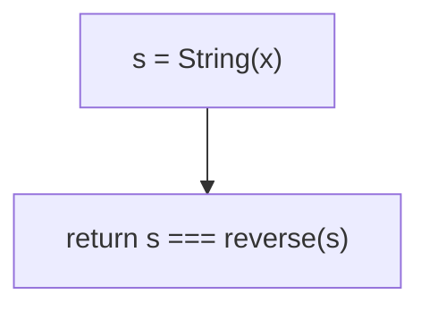
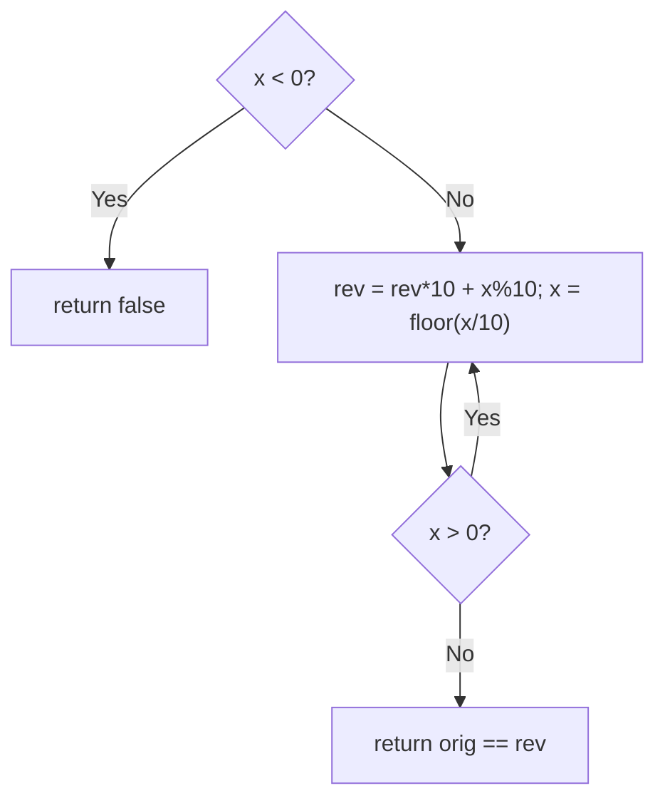
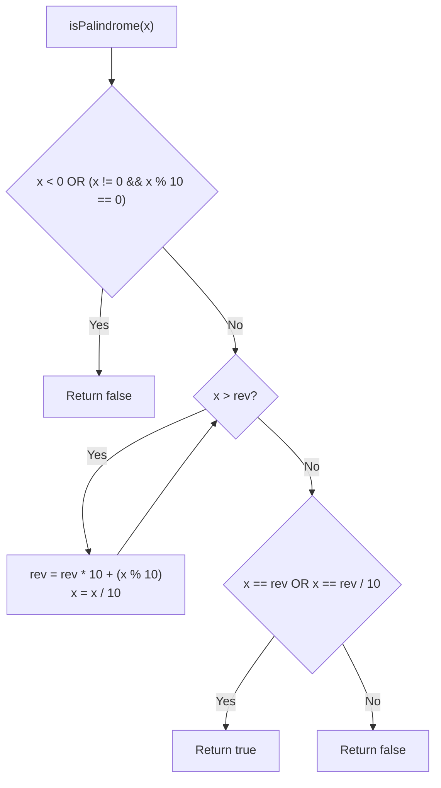

# 9. Palindrome Number

- **LeetCode Link**: `https://leetcode.com/problems/palindrome-number/`
- **Difficulty**: Easy
- **Pattern Category**: Math / Digit Symmetry
- **Prerequisite Primer**: `00-foundations/01-js-interview-runtime-quirks.md`

---

## 1. Problem Overview & Edge Case Matrix

### Problem Statement
Given an integer `x`, return `true` if `x` is a palindrome, and `false` otherwise. A palindrome reads the same forward and backward (e.g. `121` is a palindrome; `123` is not). Follow-up: solve it without converting the integer to a string.

```
Example 1:
Input: x = 121
Output: true

Example 2:
Input: x = -121
Output: false
Explanation: Reads -121 left-to-right but 121- right-to-left.

Example 3:
Input: x = 10
Output: false
Explanation: Reversed 01 reads 1.
```

### Visual Problem Representation
```
x = 1221:  outer pair (1,1) match -> inner pair (2,2) match -> palindrome
x = 10:    outer pair (1,0) mismatch -> not a palindrome (trailing zero!)
```

### Upfront Edge Case Matrix
| Edge Case Category | Specific Input Scenario | Expected Behavior | Pitfall / Risk |
| :--- | :--- | :--- | :--- |
| Negative | `x = -121` | Return `false` | `-` sign breaking symmetry |
| Trailing zero | `x = 10` | Return `false` | Reversed `01` vs `10` |
| Single digit | `0..9` | Return `true` | Loop that never compares |
| Zero itself | `x = 0` | Return `true` | `while (x > 0)` skipping to false |
| Even/odd length | `1221` / `121` | Both `true` | Middle-digit handling in half reversal |

---

## 2. Level 1: Brute Force Approach

### Intuition & Visual Idea
Stringify, split, reverse, join, compare. One line of thought — $O(N)$ string allocation for a numeric property.



### Pseudocode
```text
FUNCTION isPalindromeBruteForce(x):
    s = STRING(x)
    RETURN s === REVERSE(s)
```

### Step-by-Step Dry Run (Visual Trace)
| Step | Iteration / Pointer ($i, j$) | Current Value | State / Sub-array | Action Taken |
| :--- | :--- | :--- | :--- | :--- |
| 0 | `x = 121` | `s = "121"` | Reversed `"121"` | Equal → `true` |
| 1 | `x = -121` | `s = "-121"` | Reversed `"121-"` | Differ → `false` |
| 2 | `x = 10` | `s = "10"` | Reversed `"01"` | Differ → `false` |

### Modern JavaScript Implementation
```javascript
/**
 * Level 1: Brute Force (string reverse compare)
 * Time Complexity:  O(N) — N = digit count
 * Space Complexity: O(N) — two strings
 */
function isPalindromeBruteForce(x) {
  const s = String(x);
  // Spread (not split("")): code-point safe for non-BMP digits (harmless here).
  return s === [...s].reverse().join('');
}
```

### Complexity Breakdown
- **Time Complexity**: $O(N)$ — linear in digits.
- **Space Complexity**: $O(N)$ — string plus reversed copy; the follow-up bans this.

---

## 3. Level 2: Optimized Approach

### Intuition & Visual Bottleneck Elimination
Reverse the WHOLE number arithmetically (`rev = rev*10 + x%10`) and compare. No strings — $O(1)$ space. Caveat for the interview: in 32-bit languages the reversed value can overflow (JS doubles hold it to $2^{53}$, but say so).



### Pseudocode
```text
FUNCTION isPalindromeReversed(x):
    IF x < 0: RETURN false
    orig = x; rev = 0
    WHILE x > 0:
        rev = rev * 10 + (x MOD 10)
        x = FLOOR(x / 10)
    RETURN orig == rev
```

### Step-by-Step Dry Run (Visual Trace)
| Step | Pointers / Window | Hash Map / Auxiliary State | Decision Logic | Output Accumulator |
| :--- | :--- | :--- | :--- | :--- |
| 0 | `x = 121`, `rev = 0` | `121 % 10 = 1` | `rev = 1`, `x = 12` | — |
| 1 | `x = 12` | `12 % 10 = 2` | `rev = 12`, `x = 1` | — |
| 2 | `x = 1` | `1 % 10 = 1` | `rev = 121`, `x = 0` | Loop ends |
| 3 | compare | `121 == 121` | — | Return `true` |

### Modern JavaScript Implementation
```javascript
/**
 * Level 2: Optimized (full arithmetic reversal)
 * Time Complexity:  O(N) — one pass over digits
 * Space Complexity: O(1) — two numbers
 */
function isPalindromeReversed(x) {
  // Negatives carry '-': asymmetric by definition.
  if (x < 0) return false;
  const orig = x;
  let rev = 0;
  while (x > 0) {
    rev = rev * 10 + (x % 10); // peel the last digit onto rev
    x = Math.floor(x / 10);
  }
  return orig === rev;
}
```

### Complexity Breakdown
- **Time Complexity**: $O(N)$ — one digit pass.
- **Space Complexity**: $O(1)$ — but `rev` can overflow 32-bit in fixed-width languages (the follow-up's sting).

---

## 4. Level 3: Most Optimal / Canonical Approach

### Intuition & Mathematical / Invariant Proof
Reverse only HALF the digits: peel while `x > rev`. For even lengths the halves meet (`x === rev`); for odd, the middle digit lands in `rev` — drop it with `rev/10` (`x === floor(rev/10)`). Two early exits up front: negatives, and non-zero numbers ending in `0` (reversal would need a leading zero — impossible). Half the digits reversed means half the overflow exposure: in 32-bit languages `rev` provably cannot overflow when the input fits (the reversed half has ≤ half the digits). Invariant: at loop exit, `rev` holds the reversed second half and `x` the first.

```
1221: x=122,rev=1 -> x=12,rev=12 -> x==rev => true
121:  x=12,rev=1 -> x=1,rev=12 -> x < rev, exit; floor(12/10)=1 == x => true
10:   ends in 0 (nonzero) => false immediately
```

### Pseudocode
```text
FUNCTION isPalindrome(x):
    IF x < 0 OR (x MOD 10 == 0 AND x != 0): RETURN false
    rev = 0
    WHILE x > rev:
        rev = rev * 10 + (x MOD 10)
        x = FLOOR(x / 10)
    RETURN x == rev OR x == FLOOR(rev / 10)
```

### Step-by-Step Dry Run (Visual Trace)
| Step | Pointer $L$ | Pointer $R$ | Invariant Checked | In-Place State |
| :--- | :--- | :--- | :--- | :--- |
| 1 | `x=121` | `rev=0` | `121 > 0`: peel | `x=12, rev=1` |
| 2 | `x=12` | `rev=1` | `12 > 1`: peel | `x=1, rev=12` |
| 3 | `x=1` | `rev=12` | `1 > 12`? No: exit | `x == floor(12/10) = 1` → `true` |

### Modern JavaScript Implementation
```javascript
/**
 * Level 3: Most Optimal / Canonical (half reversal)
 * Time Complexity:  O(N) — half the digits, optimal constant
 * Space Complexity: O(1) auxiliary — two numbers, no overflow exposure
 */
function isPalindrome(x) {
  // Negatives are asymmetric; non-zero trailing-zero numbers can't reverse.
  if (x < 0 || (x % 10 === 0 && x !== 0)) return false;
  let rev = 0;
  // Peel until the halves meet (even) or cross (odd, middle inside rev).
  while (x > rev) {
    rev = rev * 10 + (x % 10);
    x = Math.floor(x / 10);
  }
  // Even: x === rev. Odd: middle digit sits in rev — drop it.
  return x === rev || x === Math.floor(rev / 10);
}
```

### Complexity Breakdown
- **Time Complexity**: $O(N)$ — optimal; half the digit operations of Level 2.
- **Space Complexity**: $O(1)$ auxiliary — and overflow-safe by construction (half the digits reversed).

---

## 5. JavaScript-Specific Gotchas & V8 Optimizations
- **GC Pressure**: Avoid allocating objects inside tight loops ($O(N)$ closures). Level 1's string + array + reversed string triple allocation per call is the pressure removed — Levels 2–3 allocate nothing.
- **Type Coercion / Sorting**: `x % 10` on negatives yields negative remainders in JS (`-121 % 10 === -1`) — the `x < 0` early exit isn't just logic, it dodges sign bugs. `Math.floor` (not `| 0` truncation toward zero... both work on positives; `Math.floor` states intent).
- **Index Bounds**: No indices — but the `x % 10 === 0 && x !== 0` guard order matters: bare `x % 10 === 0` would reject `x = 0` itself, the one trailing-zero palindrome.

---

## 6. Real-World MAANG Interview Follow-Ups & Extensions

### Follow-Up 1: Palindrome in base B / linked-list palindrome
- **Scenario**: Digits in another base, or digits streaming as a linked list (LeetCode 234).
- **Solution Strategy**: Base $B$: same kernel with `% B` and `/ B`; linked list: fast/slow to the middle, reverse the second half in place, compare, restore.
- **JS Code / Implementation Pattern**:
```javascript
function isPalindromeBaseB(x, B) {
  if (x < 0) return false;
  let rev = 0, n = x;
  while (n > rev) {
    rev = rev * B + (n % B);
    n = Math.floor(n / B);
  }
  return n === rev || n === Math.floor(rev / B);
}
```

### Follow-Up 2: Nearest palindrome / k-th palindrome queries
- **Scenario**: Closest palindrome to `x`, or the k-th palindrome (repeated queries).
- **Solution Strategy**: Mirror the left half (even/odd cases) and adjust — nearest needs ±1 candidates; k-th composes digit-by-digit. Half-reversal thinking generalizes to construction.
- **JS Code / Implementation Pattern**:
```javascript
function nearestPalindrome(x) {
  const s = String(x);
  const half = s.slice(0, Math.ceil(s.length / 2));
  return mirrorHalf(half, s.length % 2);
}
```

### Follow-Up 3: $10^9$-digit palindromes as streams
- **Scenario & In-Depth Solution**: Digits stream once; only $O(1)$ Rolls fit in RAM... actually palindromes need both ends: rolling hash from both directions (forward hash + reverse hash over the buffered half) with a two-pass stream, or store the first half ($O(N)$ worst case — honest lower bound for one-pass exactness).
```javascript
async function isPalindromeStream(digitStream) {
  const buf = [];
  for await (const d of digitStream) buf.push(d);
  return isPalindromeDigits(buf); // half-reversal over the buffer
}
```

---

## 7. What LeetCode Discuss Says (Language-Independent)

Source: top-voted post by Gourab —
`https://leetcode.com/problems/palindrome-number/solutions/3213890/fastest-java-solution-by-coding_menance-aph7/`
— 207.6K views.
Language-independent summary. No new JS here.

### A. Optimal way from Discuss (Half-Reversal without String Conversion or Overflow)

Avoid string conversion allocations and eliminate integer overflow by reversing only the trailing half of the integer:

1. **Immediate False Guards:**
   - Negative numbers ($x < 0$) are never palindromic due to the preceding negative sign (`-121` $\ne$ `121-`).
   - Numbers ending in zero with $x \ne 0$ (e.g. `10`, `100`) cannot be palindromes because leading zeros do not exist.
2. **Reversing Lower Half:**
   - Accumulate digits into `rev` from the least significant side while shifting `x` rightward.
   - Stop when $x \le rev$, which indicates we have processed exactly half (or slightly more than half for odd lengths) of the digits.
3. **Equivalence Evaluation:**
   - **Even digit count:** The two halves must be identical ($x == rev$).
   - **Odd digit count:** The middle digit is parked at the least significant position of `rev`. Discard it via integer division ($x == \lfloor rev / 10 \rfloor$).

```text
FUNCTION isPalindrome(x):
    IF x < 0 OR (x != 0 AND x % 10 == 0):
        RETURN false

    rev = 0
    WHILE x > rev:
        rev = rev * 10 + (x % 10)
        x = INT_DIV(x, 10)

    RETURN x == rev OR x == INT_DIV(rev, 10)
```

- Time: O(log10(x)) — processes half the decimal digits of $x$.
- Space: O(1) auxiliary space using two primitive integer registers.



### B. Dry run on LeetCode Example 1 (`x = 121`)

- Initial: $x = 121, rev = 0$.
- Guard check: $x > 0$ and $x \pmod{10} = 1 \ne 0$. Passes.
- Iteration 1:
  - $121 > 0$ holds.
  - $rev = 0 \times 10 + 1 = 1$.
  - $x = \lfloor 121 / 10 \rfloor = 12$.
- Iteration 2:
  - $12 > 1$ holds.
  - $rev = 1 \times 10 + 2 = 12$.
  - $x = \lfloor 12 / 10 \rfloor = 1$.
- Iteration 3:
  - $1 > 12$ is false. Loop terminates.
- Final comparison:
  - $x == rev \implies 1 == 12$ (false).
  - $x == \lfloor rev / 10 \rfloor \implies 1 == \lfloor 12 / 10 \rfloor = 1$ (true).

Final result: `true`.

### C. Why Half-Reversal Eliminates 32-bit Integer Overflow

- Reversing all digits of an arbitrary 32-bit integer can exceed $2^{31} - 1 = 2,147,483,647$, causing runtime integer overflow exceptions in languages like C++, Java, or C#.
- Halting at the midpoint guarantees that `rev` never exceeds the number of digits in $\sqrt{x}$, keeping all arithmetic strictly within bounded integer registers without requiring 64-bit casting.

### D. Pitfalls from comments

- **The Trailing Zero Edge Case:** Numbers like $x = 10$ have $10 > 0$. In step 1, $rev = 0, x = 1$. Then $1 > 0$, so $rev = 1, x = 0$. Next $x == rev / 10 \implies 0 == 0$, returning `true` erroneously if the initial `x % 10 == 0` guard is omitted.
- **Converting to String:** While `s = str(x); return s == s[::-1]` is concise, interviewers frequently forbid string conversions to test bitwise and modulo arithmetic principles.

### E. Companies

- Discuss post itself names none.
  Companies tab on LeetCode is premium-locked.
- External source:
  `https://github.com/liquidslr/leetcode-company-wise-problems`
  (LeetCode company tags, updated June 2025).
- All-time (30): Accenture, Amazon, AMD, Bloomberg, Capgemini, Capital One, Cisco, Cognizant, Deloitte, EPAM Systems, Garmin, Google, HCL, IBM, Infosys, Intel, LTI, Luxoft, Meta, Microsoft, MindTree, Morgan Stanley, Oracle, PornHub, Qualcomm, SAP, tcs, Wipro, Yandex, Zoho.
- Recent: 30 days — Amazon, Google, tcs.
- Recent: 3 months — Accenture, Amazon, Bloomberg, Google, Meta, Microsoft, tcs, Yandex.
