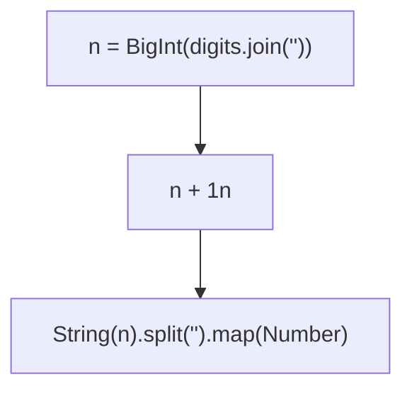
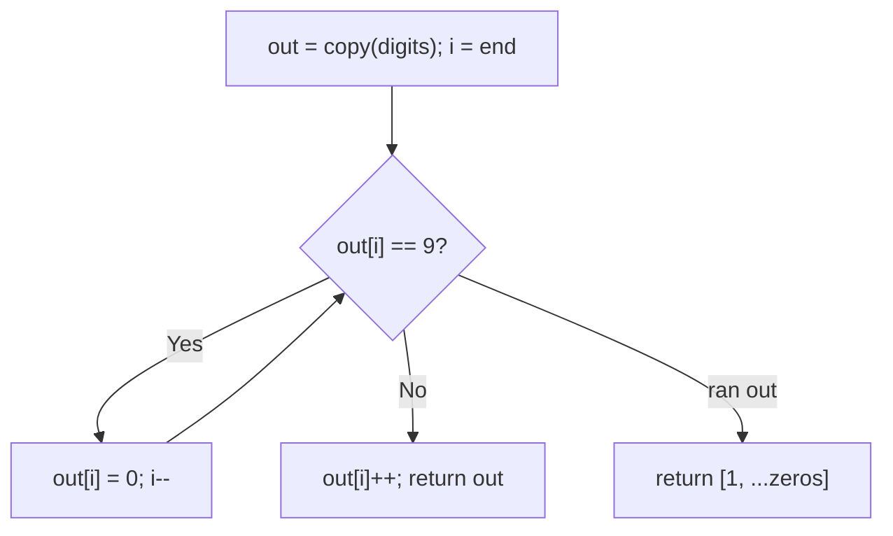

# 66. Plus One

- **LeetCode Link**: `https://leetcode.com/problems/plus-one/`
- **Difficulty**: Easy
- **Pattern Category**: Math / Carry Propagation
- **Prerequisite Primer**: `00-foundations/01-js-interview-runtime-quirks.md`

---

## 1. Problem Overview & Edge Case Matrix

### Problem Statement
You are given a large integer represented as an integer array `digits`, where each `digits[i]` is the `i`-th digit of the integer. The digits are ordered from most significant to least significant in left-to-right order. Increment the large integer by one and return the resulting array of digits.

```
Example 1:
Input: digits = [1,2,3]
Output: [1,2,4]

Example 2:
Input: digits = [4,3,2,1]
Output: [4,3,2,2]

Example 3:
Input: digits = [9]
Output: [1,0]
```

### Visual Problem Representation
```
[1,2,3] + 1:  3 < 9 -> set 4, done.        [1,2,4]
[9,9,9] + 1:  all cascade -> new array.    [1,0,0,0]
```

### Upfront Edge Case Matrix
| Edge Case Category | Specific Input Scenario | Expected Behavior | Pitfall / Risk |
| :--- | :--- | :--- | :--- |
| Single Element | `[9]` / `[5]` | `[1,0]` / `[6]` | Length-changing vs in-place paths |
| All nines | `[9,9,9]` | `[1,0,0,0]` (longer!) | Forgetting the extra digit |
| No carry | `[1,2,3]` | Early exit at last digit | Full right-to-left walk anyway (fine, but say so) |
| Huge input | 100 digits | Exact (no float math) | `Number()` overflow past $2^{53}$ |
| Leading zeros | Not per spec (no leading 0s) | N/A | BigInt/string conversion dropping them |

---

## 2. Level 1: Brute Force Approach

### Intuition & Visual Idea
Convert digits to a `BigInt`, add one, split back into digits. Exact at any length (BigInt, not Number) — one expression of intent, $O(N)$ conversions each way.



### Pseudocode
```text
FUNCTION plusOneBruteForce(digits):
    n = BIGINT(JOIN(digits, ""))
    RETURN DIGITS-OF(n + 1)
```

### Step-by-Step Dry Run (Visual Trace)
| Step | Iteration / Pointer ($i, j$) | Current Value | State / Sub-array | Action Taken |
| :--- | :--- | :--- | :--- | :--- |
| 0 | join `[1,2,3]` | `"123"` → `123n` | Convert | Parse |
| 1 | add | `124n` | Native bignum add | Increment |
| 2 | split | `"124"` → `[1,2,4]` | Convert back | Return |

### Modern JavaScript Implementation
```javascript
/**
 * Level 1: Brute Force (BigInt round-trip)
 * Time Complexity:  O(N) — join, convert, split (big constants)
 * Space Complexity: O(N) — intermediate strings and BigInt digits
 */
function plusOneBruteForce(digits) {
  // BigInt (NOT Number): exact past 2^53 for 100-digit inputs.
  const n = BigInt(digits.join('')) + 1n;
  return String(n).split('').map(Number);
}
```

### Complexity Breakdown
- **Time Complexity**: $O(N)$ — linear, but with bignum conversion constants dwarfing digit work.
- **Space Complexity**: $O(N)$ — strings plus the BigInt; carry needs $O(1)$.

---

## 3. Level 2: Optimized Approach

### Intuition & Visual Bottleneck Elimination
Right-to-left carry into a COPY: bump trailing 9s to 0 moving left; the first non-9 increments and the scan stops. Caller's array untouched; all-9s returns a fresh longer array.



### Pseudocode
```text
FUNCTION plusOneCarry(digits):
    out = COPY(digits)
    FOR i FROM END DOWNTO 0:
        IF out[i] < 9: out[i]++; RETURN out
        out[i] = 0
    RETURN [1] + out   // all nines: out is all zeros now
```

### Step-by-Step Dry Run (Visual Trace)
| Step | Pointers / Window | Hash Map / Auxiliary State | Decision Logic | Output Accumulator |
| :--- | :--- | :--- | :--- | :--- |
| 0 | `i = 2`, `out = [1,2,3]` | `3 < 9` | Increment, return | `[1,2,4]` |
| 1 | `[9]`: `i = 0` | `9 → 0` | Cascade off the front | `[1, 0]` via prepend |
| 2 | `[4,3,2,1]` | last `< 9` | Increment | `[4,3,2,2]` |

### Modern JavaScript Implementation
```javascript
/**
 * Level 2: Optimized (carry into a copy)
 * Time Complexity:  O(N) — single right-to-left pass, early exit
 * Space Complexity: O(N) — the output copy
 */
function plusOneCarry(digits) {
  const out = digits.slice(); // caller's array never touched
  for (let i = out.length - 1; i >= 0; i--) {
    if (out[i] < 9) {
      out[i]++; // first non-9 absorbs the carry: done
      return out;
    }
    out[i] = 0; // 9 + 1 = 0, carry leftward
  }
  // Fell off the front: all nines (out is all zeros) — prepend the 1.
  return [1, ...out];
}
```

### Complexity Breakdown
- **Time Complexity**: $O(N)$ — one pass with early exit on the common path.
- **Space Complexity**: $O(N)$ — the copy; Level 3 reuses the input instead.

---

## 4. Level 3: Most Optimal / Canonical Approach

### Intuition & Mathematical / Invariant Proof
Same carry loop, in place: the input array IS the output (spec-legal — return type is the array). Only the all-9s case allocates (unavoidable: length grows). Invariant: suffix right of `i` is already finalized (zeros from cascaded 9s); the first non-9 from the right absorbs the carry and everything left is untouched.

```
[9,9,8,9]: i=3: 9->0; i=2: 8->9, return [9,9,9,9]... wait:
  [9,9,8,9]: i=3 is 9 -> 0; i=2 is 8 < 9 -> 9, return [9,9,9,0]. ✓
```

### Pseudocode
```text
FUNCTION plusOne(digits):
    FOR i FROM END DOWNTO 0:
        IF digits[i] < 9: digits[i]++; RETURN digits
        digits[i] = 0
    digits.UNSHIFT(1)   // all nines became zeros; length grows by one
    RETURN digits
```

### Step-by-Step Dry Run (Visual Trace)
| Step | Pointer $L$ | Pointer $R$ | Invariant Checked | In-Place State |
| :--- | :--- | :--- | :--- | :--- |
| 1 | `i = 2`, `[1,2,3]` | `3 < 9` | Absorb, return same ref | `[1,2,4]` |
| 2 | `[9]`: `i = 0` | `9 → 0`, loop ends | All-nines path | `unshift(1)` → `[1,0]` |
| 3 | return | — | — | Same array reference |

### Modern JavaScript Implementation
```javascript
/**
 * Level 3: Most Optimal / Canonical (in-place carry)
 * Time Complexity:  O(N) — single pass, optimal lower bound
 * Space Complexity: O(1) auxiliary — output excluded (all-9s growth excepted)
 */
function plusOne(digits) {
  for (let i = digits.length - 1; i >= 0; i--) {
    if (digits[i] < 9) {
      digits[i]++; // carry absorbed here; prefix untouched
      return digits;
    }
    digits[i] = 0; // 9 cascades leftward
  }
  // All nines (now all zeros): length must grow — the only allocation.
  digits.unshift(1);
  return digits;
}
```

### Complexity Breakdown
- **Time Complexity**: $O(N)$ — optimal lower bound; every digit inspected at most once.
- **Space Complexity**: $O(1)$ auxiliary — in-place; the all-9s prepend is required output growth.

---

## 5. JavaScript-Specific Gotchas & V8 Optimizations
- **GC Pressure**: Avoid allocating objects inside tight loops ($O(N)$ closures). Level 1's join/BigInt/split/map chain allocates ~4× the input per call — Level 3 allocates zero on the common path.
- **Type Coercion / Sorting**: `BigInt(digits.join(''))` (Level 1) is exact; `Number(...)` or `parseInt` overflows past $2^{53}-1$ (100-digit spec max!) — never float-convert digit arrays. `.map(Number)` (not `parseInt`) avoids radix pitfalls.
- **Index Bounds**: `unshift(1)` on the all-9s path is $O(N)$ memmove — acceptable once per call, but never `unshift` inside the loop. In-place mutation (Level 3) surprises callers holding the old reference — document it; Level 2's copy is the polite variant.

---

## 6. Real-World MAANG Interview Follow-Ups & Extensions

### Follow-Up 1: Plus K / add arbitrary digit arrays
- **Scenario**: Add `k` (or a second digit array) instead of one.
- **Solution Strategy**: Same right-to-left loop with a running `carry` seeded from `k % 10` digits (`k` decomposed per position); loop while `i >= 0 || carry > 0`, prepending as needed.
- **JS Code / Implementation Pattern**:
```javascript
function plusK(digits, k) {
  const out = digits.slice();
  let i = out.length - 1;
  let carry = k;
  while (i >= 0 || carry > 0) {
    const sum = (i >= 0 ? out[i] : 0) + carry;
    if (i >= 0) out[i] = sum % 10;
    else out.unshift(sum % 10); // k outgrows the array: prepend
    carry = Math.floor(sum / 10);
    i--;
  }
  return out;
}
```

### Follow-Up 2: $10^9$-digit counter with $O(1)$ amortized increments
- **Scenario**: A persistent odometer incremented constantly; $O(N)$ per increment is too slow.
- **Solution Strategy**: Same loop — amortized analysis: each increment flips a run of trailing 9s (rare) plus one digit (always) — $O(1)$ amortized per increment over a counting sequence. State the amortization explicitly.
- **JS Code / Implementation Pattern**:
```javascript
function amortizedIncrement(counter) {
  return plusOne(counter); // O(1) amortized across 0..10^N sequences
}
```

### Follow-Up 3: Concurrent increments (distributed counter)
- **Scenario & In-Depth Solution**: Writers race `plusOne` on shared digits — read-modify-write tears. Shard by digit ranges with carry propagation messages, or serialize increments through a single owner (actor model). Optimistic CAS on the digit array retries on version mismatch.
```javascript
function casIncrement(shared, versionOf) {
  const stamp = versionOf(shared);
  const result = plusOne(shared.slice());
  if (versionOf(shared) !== stamp) return casIncrement(shared, versionOf);
  return publish(shared, result);
}
```
