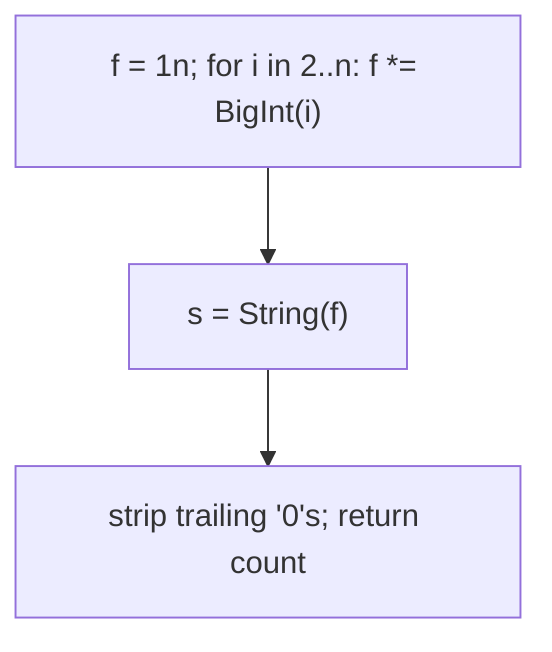
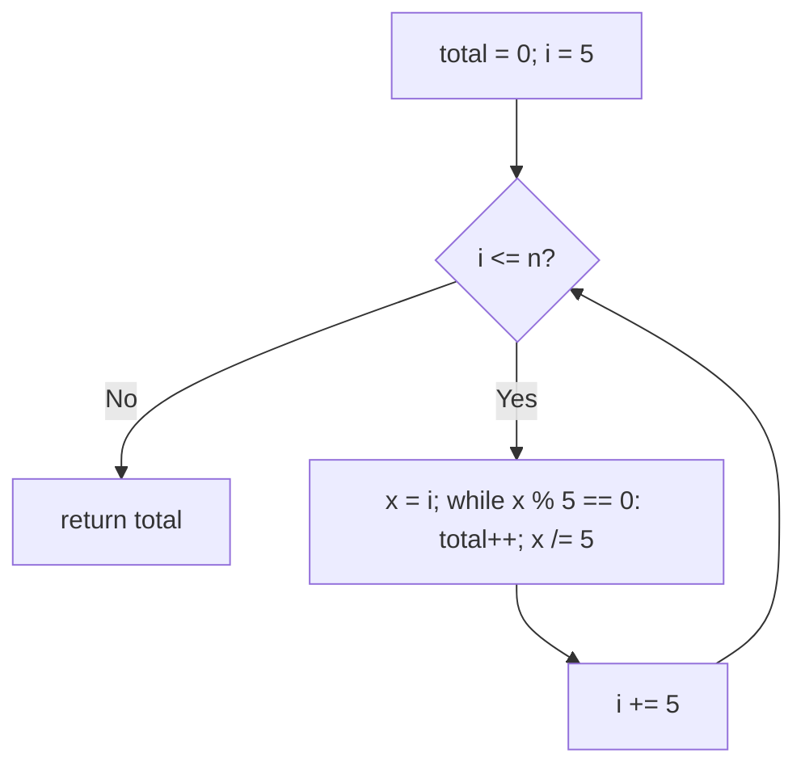
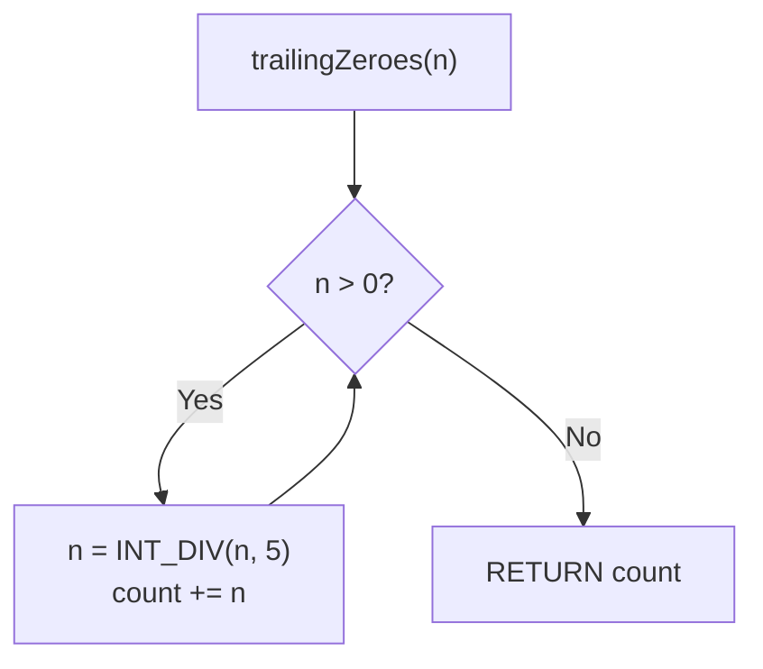

# 172. Factorial Trailing Zeroes

- **LeetCode Link**: `https://leetcode.com/problems/factorial-trailing-zeroes/`
- **Difficulty**: Medium
- **Pattern Category**: Math / Prime Factor Counting (Legendre)
- **Prerequisite Primer**: `00-foundations/01-js-interview-runtime-quirks.md`

---

## 1. Problem Overview & Edge Case Matrix

### Problem Statement
Given an integer `n`, return the number of trailing zeroes in `n!`. The solution must run in logarithmic time complexity.

```
Example 1:
Input: n = 3
Output: 0
Explanation: 3! = 6, no trailing zero.

Example 2:
Input: n = 5
Output: 1
Explanation: 5! = 120, one trailing zero.

Example 3:
Input: n = 0
Output: 0
Explanation: 0! = 1, no trailing zero.
```

### Visual Problem Representation
```
n = 25:  multiples of 5: 5,10,15,20,25 -> 5 fives
         multiples of 25: 25            -> 1 extra five
         total fives = 6 (twos are abundant) -> 6 trailing zeroes
```

### Upfront Edge Case Matrix
| Edge Case Category | Specific Input Scenario | Expected Behavior | Pitfall / Risk |
| :--- | :--- | :--- | :--- |
| Zero input | `n = 0` | Return `0` (`0! = 1`) | Loop from 1 mishandling 0 |
| Below threshold | `n = 1..4` | Return `0` | Off-by-one on first five |
| Exact powers of 5 | `n = 25` | Return `6` (not 5) | Missing higher powers |
| Max scale | `n = 10⁴` | Fast log-time answer | Factorial computation blowup |
| Precision | Large `n!` | Exact count | Float division in the summation |

---

## 2. Level 1: Brute Force Approach

### Intuition & Visual Idea
Compute `n!` exactly with `BigInt`, stringify, and count trailing `'0'` characters. Definitionally correct — and astronomically wasteful ($n!$ has $O(n \log n)$ digits).



### Pseudocode
```text
FUNCTION trailingZeroesBruteForce(n):
    f = 1n
    FOR i IN 2 .. n: f *= BIGINT(i)
    s = STRING(f); count = 0
    FOR ch FROM END WHILE ch == "0": count++
    RETURN count
```

### Step-by-Step Dry Run (Visual Trace)
| Step | Iteration / Pointer ($i, j$) | Current Value | State / Sub-array | Action Taken |
| :--- | :--- | :--- | :--- | :--- |
| 0 | factorial `5!` | `120n` | BigInt product | Compute |
| 1 | stringify | `"120"` | — | Convert |
| 2 | strip from end | `0` → 1 zero, then `2` stops | count `1` | Return `1` |

### Modern JavaScript Implementation
```javascript
/**
 * Level 1: Brute Force (exact BigInt factorial + zero strip)
 * Time Complexity:  O(n² log n) — bignum multiplications grow with n!
 * Space Complexity: O(n log n) — the factorial's digit count
 */
function trailingZeroesBruteForce(n) {
  let f = 1n;
  for (let i = 2; i <= n; i++) f *= BigInt(i); // exact at any n (slowly)
  const s = String(f);
  let count = 0;
  for (let i = s.length - 1; i >= 0 && s[i] === '0'; i--) count++;
  return count;
}
```

### Complexity Breakdown
- **Time Complexity**: $O(n^2 \log n)$-ish — bignum multiply cost grows per factor; violates the log requirement utterly.
- **Space Complexity**: $O(n \log n)$ digits — the factorial itself is the waste.

---

## 3. Level 2: Optimized Approach

### Intuition & Visual Bottleneck Elimination
Count factors of 5 directly: each multiple of 5 contributes its full 5-adic valuation (loop-dividing each multiple). No factorial, no bignum — $O(n \log n)$ divisor work.



### Pseudocode
```text
FUNCTION trailingZeroesFactorCount(n):
    total = 0
    FOR i IN 5, 10, 15, ... <= n (STEP 5):
        x = i
        WHILE x MOD 5 == 0: total++; x /= 5
    RETURN total
```

### Step-by-Step Dry Run (Visual Trace)
| Step | Pointers / Window | Hash Map / Auxiliary State | Decision Logic | Output Accumulator |
| :--- | :--- | :--- | :--- | :--- |
| 0 | `i = 5` | `5 → 1`: one five | Add `1` | `total = 1` |
| 1 | `i = 10` | `10 → 2`: one five | Add `1` | `total = 2` |
| 2 | `i = 15, 20` | one five each | Add `1` ×2 | `total = 4` |
| 3 | `i = 25` | `25 → 5 → 1`: two fives | Add `2` | `total = 6` |

### Modern JavaScript Implementation
```javascript
/**
 * Level 2: Optimized (per-multiple 5-adic valuation)
 * Time Complexity:  O(n log n) — n/5 multiples, each stripped
 * Space Complexity: O(1) — two counters
 */
function trailingZeroesFactorCount(n) {
  let total = 0;
  // Only multiples of 5 can contribute fives: step by 5, not 1.
  for (let i = 5; i <= n; i += 5) {
    let x = i;
    // Strip ALL factors of 5 (25 contributes twice, 125 thrice, ...).
    while (x % 5 === 0) {
      total++;
      x /= 5;
    }
  }
  return total;
}
```

### Complexity Breakdown
- **Time Complexity**: $O(n \log n)$ — linear scan of multiples with log-depth stripping.
- **Space Complexity**: $O(1)$ — two counters; the remaining gap is time.

---

## 4. Level 3: Most Optimal / Canonical Approach

### Intuition & Mathematical / Invariant Proof
Legendre's formula: trailing zeroes = exponent of 5 in $n!$ (2s are strictly more abundant — every even number contributes at least one, so 5s are always the bottleneck). Count = $\lfloor n/5 \rfloor + \lfloor n/25 \rfloor + \lfloor n/125 \rfloor + \cdots$ — multiples of 5, plus an extra for multiples of 25, and so on. Each term counts numbers contributing AT LEAST that power. Loop `n = floor(n/5)` until zero: $O(\log_5 n)$ iterations, $O(1)$ space. Invariant: after processing divisor $5^k$, `total` holds all 5-factors of multiplicity $< k$ resolved… precisely, `total` accumulates $\sum \lfloor n/5^k \rfloor$ term by term.

```
n = 25: 25/5 = 5 -> total 5; 5/5 = 1 -> total 6; 1/5 = 0 -> stop. Answer 6.
```

### Pseudocode
```text
FUNCTION trailingZeroes(n):
    total = 0
    WHILE n >= 5:
        n = FLOOR(n / 5)
        total += n
    RETURN total
```

### Step-by-Step Dry Run (Visual Trace)
| Step | Pointer $L$ | Pointer $R$ | Invariant Checked | In-Place State |
| :--- | :--- | :--- | :--- | :--- |
| 1 | `n = 25` | `25 ≥ 5` | `n = 5`, `total = 5` | Multiples of 5 |
| 2 | `n = 5` | `5 ≥ 5` | `n = 1`, `total = 6` | Multiples of 25 |
| 3 | `n = 1` | `1 < 5` | Loop ends | Return `6` |

### Modern JavaScript Implementation
```javascript
/**
 * Level 3: Most Optimal / Canonical (Legendre's formula)
 * Time Complexity:  O(log₅ n) — meets the logarithmic requirement
 * Space Complexity: O(1) auxiliary — two numbers
 */
function trailingZeroes(n) {
  // 5s bottleneck 2s: count multiplicity of 5 across 5, 25, 125, ...
  let total = 0;
  while (n >= 5) {
    n = Math.floor(n / 5); // integer division: multiples of the next power
    total += n;
  }
  return total;
}
```

### Complexity Breakdown
- **Time Complexity**: $O(\log_5 n)$ — optimal; meets the required logarithmic bound.
- **Space Complexity**: $O(1)$ auxiliary — two numbers; no factorial, no arrays.

---

## 5. JavaScript-Specific Gotchas & V8 Optimizations
- **GC Pressure**: Avoid allocating objects inside tight loops ($O(N)$ closures). Level 1's $O(n \log n)$-digit BigInt is the pressure removed — Levels 2–3 allocate nothing.
- **Type Coercion / Sorting**: `Math.floor(n / 5)` (not `n / 5` float accumulation, not `| 0` 32-bit truncation) — float drift corrupts exact counts past $2^{53}$; bitwise ops corrupt past $2^{31}$.
- **Index Bounds**: No indices — but the `n >= 5` loop guard (not `n > 0`) skips the no-op final division; and `n = 0` returns `0` through the guard without special-casing (`0! = 1` has no zeros — consistent, not coincidental).

---

## 6. Real-World MAANG Interview Follow-Ups & Extensions

### Follow-Up 1: Trailing zeroes in other bases / nCr / nPr
- **Scenario**: Zeroes of $n!$ in base $B$, or of binomial coefficients.
- **Solution Strategy**: Factor $B$ into primes; answer = $\min_p \lfloor v_p(n!) / v_p(B) \rfloor$ with Legendre per prime. For $nCr$: $v_p(n!) - v_p(r!) - v_p((n-r)!)$.
- **JS Code / Implementation Pattern**:
```javascript
function trailingZeroesBase(n, B) {
  return Math.min(...primeFactors(B).map(({ p, e }) => legendre(n, p) / e | 0));
}
```

### Follow-Up 2: Smallest n with at least K trailing zeroes
- **Scenario**: Invert the function (LeetCode 793, Hard).
- **Solution Strategy**: `trailingZeroes(n)` is monotone non-decreasing — binary-search the smallest $n$ with value $\ge K$, then check equality (gaps exist: no $n$ gives exactly 5... wait, 25→6, 24→4: FIVE is unattainable — the famous gap).
- **JS Code / Implementation Pattern**:
```javascript
function preimageSize(K) {
  let lo = 0, hi = 5 * K + 5;
  while (lo < hi) {
    const mid = (lo + hi) >> 1;
    if (trailingZeroes(mid) < K) lo = mid + 1;
    else hi = mid;
  }
  return trailingZeroes(lo) === K ? 5 : 0; // blocks of 5 or nothing (the gap)
}
```

### Follow-Up 3: $10^18$-scale n with exact arithmetic
- **Scenario & In-Depth Solution**: $n$ near $10^{18}$ — doubles still divide exactly here (powers of 5 stay integral under $2^{53}$ for the QUOTIENTS? $10^{18}/5$ is exact in doubles? Not always). Use `BigInt` division loop (identical kernel, exact at any magnitude) — $O(\log n)$ BigInt ops.
```javascript
function trailingZeroesBig(n) {
  let total = 0n;
  let m = BigInt(n);
  while (m >= 5n) {
    m /= 5n;
    total += m;
  }
  return total;
}
```

---

## 7. What LeetCode Discuss Says (Language-Independent)

Source: top-voted post by Hao Chen —
`https://leetcode.com/problems/factorial-trailing-zeroes/solutions/52373/simple-cc-solution-with-detailed-explain-2y2g/`
— 54.7K views.
Language-independent summary. No new JS here.

### A. Optimal way from Discuss (Legendre's Formula on Prime Factor 5)

Never materialize the factorial product; directly tally prime factors of 5 using Legendre's Formula:

1. **Number-Theoretic Invariant:**
   - A trailing zero is produced by a factor of 10, which decomposes into $2 \times 5$.
   - In any factorial $n! = 1 \times 2 \times \dots \times n$, factors of 2 are strictly more frequent than factors of 5.
   - Thus, the total number of trailing zeros is dictated entirely by the exponent of 5 in the prime factorization of $n!$.
2. **Legendre's Formula Accumulation:**
   - Multiples of 5 each contribute one factor of 5 ($\lfloor n / 5 \rfloor$).
   - Multiples of 25 each contribute a second factor of 5 ($\lfloor n / 25 \rfloor$).
   - Multiples of $5^k$ contribute additional factors ($\lfloor n / 5^k \rfloor$).
3. **Repeated Division Kernel:**
   - Rather than maintaining an increasing multiplier $i = 5, 25, 125, \dots$ (which risks integer overflow), repeatedly divide $n$ by 5 and sum the quotients until $n = 0$.

```text
FUNCTION trailingZeroes(n):
    count = 0
    WHILE n > 0:
        n = INT_DIV(n, 5)
        count = count + n
    RETURN count
```

- Time: O(log5(n)) — the loop iterates roughly $\approx 13$ times for 32-bit integers ($5^{13} > 2^{31} - 1$).
- Space: O(1) auxiliary space using one integer accumulator.



### B. Dry run on LeetCode Example 2 and Edge Case $n = 100$

- **Example 2 ($n = 5$):**
  - Iteration 1: $n = \lfloor 5 / 5 \rfloor = 1, count = 1$.
  - Iteration 2: $n = \lfloor 1 / 5 \rfloor = 0$. Loop terminates.
  - Return: `1`.
- **Case $n = 100$ ($100!$ trailing zeroes):**
  - Iteration 1: $n = \lfloor 100 / 5 \rfloor = 20, count = 20$.
  - Iteration 2: $n = \lfloor 20 / 5 \rfloor = 4, count = 20 + 4 = 24$.
  - Iteration 3: $n = \lfloor 4 / 5 \rfloor = 0$. Loop terminates.
  - Return: `24`.

Final result: `24` trailing zeros.

### C. Why Iterative Division Beats Power Multiplication

- Writing `for (int i = 5; n / i > 0; i *= 5)` causes $i$ to overflow 32-bit signed integers when $i$ reaches $5^{14}$, leading to undefined behavior or infinite loops on inputs near $2^{31} - 1$.
- Iteratively dividing $n = \lfloor n / 5 \rfloor$ strictly decreases the register towards zero, guaranteeing zero possibility of overflow without requiring 64-bit variables.

### D. Pitfalls from comments

- **Materializing Factorials:** Computing $n!$ directly fails even for $n = 20$, as $20! \approx 2.43 \times 10^{18}$ exceeds standard 64-bit integer capacities.
- **Ignoring Higher Powers of 5:** Dividing by 5 once ($\lfloor n / 5 \rfloor$) misses extra factors provided by $25, 125, 625$, returning erroneous answers for any $n \ge 25$.

### E. Companies

- Discuss post itself names none.
  Companies tab on LeetCode is premium-locked.
- External source:
  `https://github.com/liquidslr/leetcode-company-wise-problems`
  (LeetCode company tags, updated June 2025).
- All-time (6): Amazon, Bloomberg, Google, Meta, Microsoft, tcs.
- Recent: 30 days — None.
- Recent: 3 months — None.
