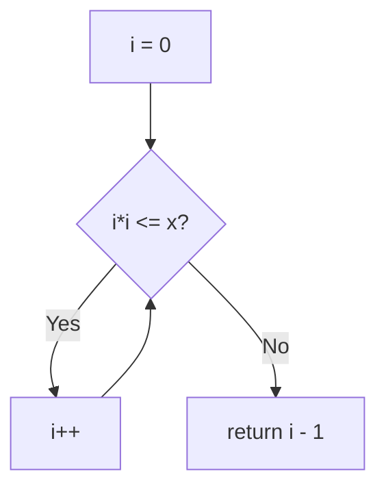
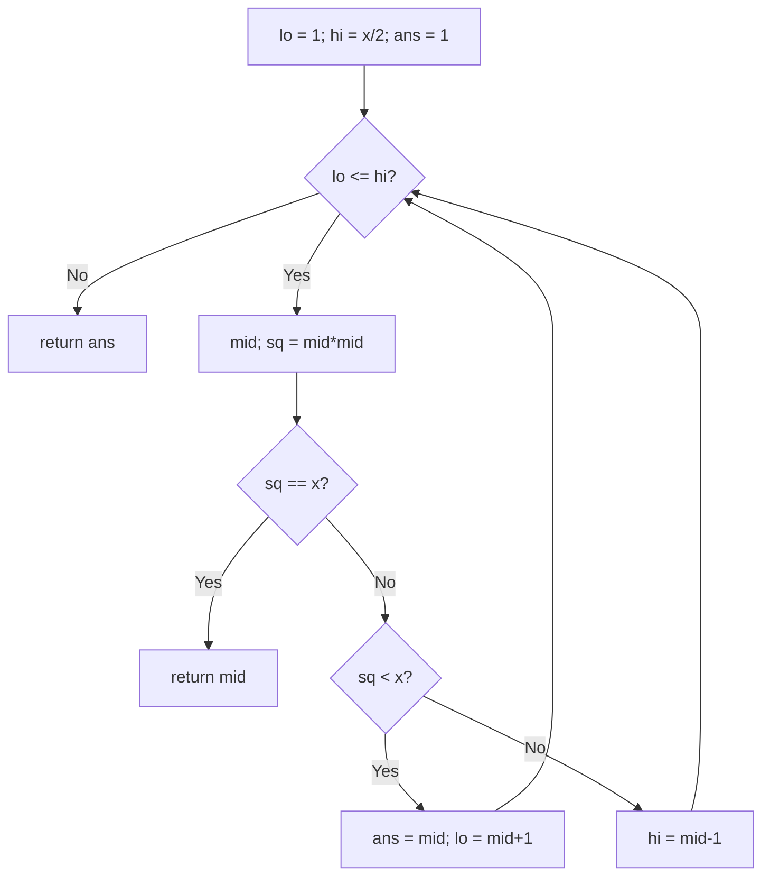
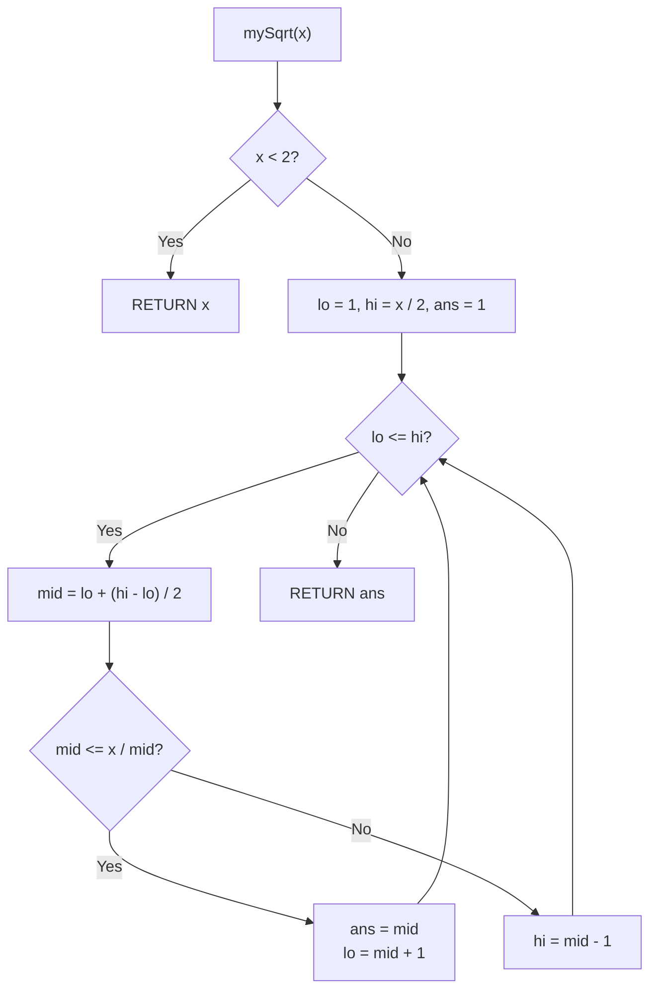

# 69. Sqrt(x)

- **LeetCode Link**: `https://leetcode.com/problems/sqrtx/`
- **Difficulty**: Easy
- **Pattern Category**: Math / Integer Root Search
- **Prerequisite Primer**: `00-foundations/01-js-interview-runtime-quirks.md`

---

## 1. Problem Overview & Edge Case Matrix

### Problem Statement
Given a non-negative integer `x`, return the square root of `x` rounded down to the nearest integer. The returned integer should be non-negative as well. You must not use any built-in exponent function or operator (e.g. `Math.sqrt` or `x ** 0.5`).

```
Example 1:
Input: x = 4
Output: 2

Example 2:
Input: x = 8
Output: 2
Explanation: sqrt(8) = 2.82842..., rounded down to 2.
```

### Visual Problem Representation
```
y = i*i crosses y = 8 between i = 2 and i = 3:

  i:     0  1  2  3  4
  i*i:   0  1  4  9  ...   answer = largest i with i*i <= 8 -> 2
```

### Upfront Edge Case Matrix
| Edge Case Category | Specific Input Scenario | Expected Behavior | Pitfall / Risk |
| :--- | :--- | :--- | :--- |
| Zero / one | `x = 0` / `x = 1` | `0` / `1` | Loop/division setup for trivial input |
| Perfect square | `x = 4, 9, 16` | Exact root | `<` vs `<=` returning one below |
| Non-square | `x = 8` | Floor (`2`) | Rounding instead of flooring |
| Max scale | `x = 2³¹ − 1` | `46340` | `mid*mid` overflow in 32-bit languages |
| Small values | `x = 2, 3` | `1` | `hi = x/2` initialization excluding answer |

---

## 2. Level 1: Brute Force Approach

### Intuition & Visual Idea
Walk `i = 0, 1, 2, …` while `i*i <= x`; the last survivor is the floored root. $O(\sqrt{x})$ — definitionally direct, way off the log pace.



### Pseudocode
```text
FUNCTION mySqrtBruteForce(x):
    i = 0
    WHILE i * i <= x: i++
    RETURN i - 1
```

### Step-by-Step Dry Run (Visual Trace)
| Step | Iteration / Pointer ($i, j$) | Current Value | State / Sub-array | Action Taken |
| :--- | :--- | :--- | :--- | :--- |
| 0 | `i = 0, 1, 2` | `0, 1, 4 ≤ 8` | Survive | Advance |
| 1 | `i = 3` | `9 > 8` | Fail | Return `3 - 1 = 2` |

### Modern JavaScript Implementation
```javascript
/**
 * Level 1: Brute Force (linear square scan)
 * Time Complexity:  O(sqrt(x)) — up to 46340 steps at max input
 * Space Complexity: O(1)
 */
function mySqrtBruteForce(x) {
  let i = 0;
  // First i with i*i > x overshoots by exactly one: step back.
  while (i * i <= x) i++;
  return i - 1;
}
```

### Complexity Breakdown
- **Time Complexity**: $O(\sqrt{x})$ — linear in the answer; 46k steps worst case.
- **Space Complexity**: $O(1)$ — single counter.

---

## 3. Level 2: Optimized Approach

### Intuition & Visual Bottleneck Elimination
Binary search the answer in `[1, x/2]` (for $x \ge 2$): squares are monotone, so standard fenced search with a tracked best (`ans`). $O(\log x)$ time, $O(1)$ space — the canonical interview answer.



### Pseudocode
```text
FUNCTION mySqrtBinarySearch(x):
    IF x < 2: RETURN x
    lo = 1; hi = FLOOR(x / 2); ans = 1
    WHILE lo <= hi:
        mid = lo + FLOOR((hi - lo) / 2)
        sq = mid * mid
        IF sq == x: RETURN mid
        IF sq < x: ans = mid; lo = mid + 1
        ELSE: hi = mid - 1
    RETURN ans
```

### Step-by-Step Dry Run (Visual Trace)
| Step | Pointers / Window | Hash Map / Auxiliary State | Decision Logic | Output Accumulator |
| :--- | :--- | :--- | :--- | :--- |
| 0 | `[1, 4]`, mid `2` | `4 < 8` | Candidate, go right | `ans = 2` |
| 1 | `[3, 4]`, mid `3` | `9 > 8` | Too big, go left | `hi = 2` |
| 2 | `[3, 2]` empty | loop ends | — | Return `ans = 2` |

### Modern JavaScript Implementation
```javascript
/**
 * Level 2: Optimized (binary search on squares)
 * Time Complexity:  O(log x) — halving the answer range
 * Space Complexity: O(1) — indices plus best-so-far
 */
function mySqrtBinarySearch(x) {
  // 0 and 1 are their own roots (also dodges hi = 0 setup).
  if (x < 2) return x;
  // Answer lives in [1, x/2] for x >= 2 (sqrt(x) <= x/2 there).
  let lo = 1;
  let hi = Math.floor(x / 2);
  let ans = 1;
  while (lo <= hi) {
    const mid = lo + ((hi - lo) >> 1);
    const sq = mid * mid;
    if (sq === x) return mid; // exact hit
    if (sq < x) {
      ans = mid; // valid floor candidate; try bigger
      lo = mid + 1;
    } else {
      hi = mid - 1;
    }
  }
  return ans;
}
```

### Complexity Breakdown
- **Time Complexity**: $O(\log x)$ — ~31 steps worst case.
- **Space Complexity**: $O(1)$ — indices; `mid*mid` needs 64-bit (or double) headroom — see gotchas.

---

## 4. Level 3: Most Optimal / Canonical Approach

### Intuition & Mathematical / Invariant Proof
Integer Newton's method: iterate $r_{k+1} = \lfloor (r_k + \lfloor x / r_k \rfloor) / 2 \rfloor$ from $r_0 = \lfloor x/2 \rfloor$ while $r^2 > x$. Each iteration roughly doubles correct digits (quadratic convergence) — ~5 iterations at max input vs ~31 for binary search. Invariant: $r$ strictly decreases toward $\lfloor \sqrt{x} \rfloor$ from above and stops exactly there ($r^2 \le x$ with $(r+1)^2 > x$ — the loop condition IS the proof: it exits precisely when no smaller $r$ still overshoots... more carefully, exits at the first $r$ with $r^2 \le x$ coming from above, which is the floor).

```
x = 8: r=4 (16>8) -> (4+2)/2=3 (9>8) -> (3+2)/2=2 (4>8? no) -> 2
```

### Pseudocode
```text
FUNCTION mySqrt(x):
    IF x < 2: RETURN x
    r = FLOOR(x / 2)
    WHILE r * r > x:
        r = FLOOR((r + FLOOR(x / r)) / 2)
    RETURN r
```

### Step-by-Step Dry Run (Visual Trace)
| Step | Pointer $L$ | Pointer $R$ | Invariant Checked | In-Place State |
| :--- | :--- | :--- | :--- | :--- |
| 1 | `r = 4` | `16 > 8` | Overshoot, refine | `r = (4 + 2)/2 = 3` |
| 2 | `r = 3` | `9 > 8` | Overshoot, refine | `r = (3 + 2)/2 = 2` |
| 3 | `r = 2` | `4 > 8`? No | Floor reached | Return `2` |

### Modern JavaScript Implementation
```javascript
/**
 * Level 3: Most Optimal / Canonical (integer Newton iteration)
 * Time Complexity:  O(log x) — quadratic convergence (~5 iterations max)
 * Space Complexity: O(1) auxiliary — one guess
 */
function mySqrt(x) {
  if (x < 2) return x;
  let r = Math.floor(x / 2); // overestimate seed (sqrt(x) <= x/2 for x >= 2)
  // Descend from above: exit at the first r with r*r <= x = the floor.
  while (r * r > x) {
    r = Math.floor((r + Math.floor(x / r)) / 2);
  }
  return r;
}
```

### Complexity Breakdown
- **Time Complexity**: $O(\log x)$ — optimal class with the best constant (quadratic convergence).
- **Space Complexity**: $O(1)$ auxiliary — one number; no search fence at all.

---

## 5. JavaScript-Specific Gotchas & V8 Optimizations
- **GC Pressure**: Avoid allocating objects inside tight loops ($O(N)$ closures). All levels allocate nothing — keep Newton arithmetic on locals; never box guesses in arrays.
- **Type Coercion / Sorting**: `mid * mid` overflows 32-bit past `mid ≈ 46341` — in fixed-width languages compare `mid > x / mid` instead; JS doubles hold products exactly to $2^{53}$ (spec max $2^{31}-1$ squares safely). `Math.floor` on every division (never `| 0` past $2^{31}$).
- **Index Bounds**: `hi = x/2` initialization is valid ONLY for $x \ge 2$ (for $x = 1$, $x/2 = 0$ excludes the answer) — hence the `x < 2` early return doing double duty as setup guard.

---

## 6. Real-World MAANG Interview Follow-Ups & Extensions

### Follow-Up 1: Nth root / perfect-square check
- **Scenario**: Integer $k$-th root, or exact perfect-square test (LeetCode 367).
- **Solution Strategy**: Same binary-search skeleton with `mid**k` comparisons (overflow-aware); perfect-square = `sq === x` hit exactly, no floor logic.
- **JS Code / Implementation Pattern**:
```javascript
function isPerfectSquare(x) {
  if (x < 2) return true;
  let lo = 1, hi = Math.floor(x / 2);
  while (lo <= hi) {
    const mid = lo + ((hi - lo) >> 1);
    const sq = mid * mid;
    if (sq === x) return true;
    if (sq < x) lo = mid + 1;
    else hi = mid - 1;
  }
  return false;
}
```

### Follow-Up 2: $10^18$-scale roots with exact arithmetic
- **Scenario**: Inputs past double-exact integer range.
- **Solution Strategy**: `BigInt` Newton loop (identical kernel, exact at any magnitude) — $O(\log x)$ BigInt ops with growing digit costs.
- **JS Code / Implementation Pattern**:
```javascript
function isqrtBig(x) {
  if (x < 2n) return x;
  let r = x >> 1n;
  while (r * r > x) r = (r + x / r) >> 1n;
  return r;
}
```

### Follow-Up 3: Inverse square root (Quake-style) and hardware framing
- **Scenario & In-Depth Solution**: `1/sqrt(x)` fast approximation (graphics/physics), or "what does the FPU do?" Newton IS what hardware/software sqrt (!) runs after table lookup seeding — Level 3 with a better seed (`r0 = 2^(bits/2)`) converges in 2–3 iterations. State the connection to show systems depth.
```javascript
function fastIsqrtSeed(x) {
  return 1 << (Math.floor(Math.log2(x)) >> 1); // bit-length halving seed
}
```

---

## 7. What LeetCode Discuss Says (Language-Independent)

Source: top-voted post by Deepank Yadav —
`https://leetcode.com/problems/sqrtx/solutions/3706594/easy-explained-solution-beats-100-by-dee-6cez/`
— 283K views.
Language-independent summary. No new JS here.

### A. Optimal way from Discuss (Integer Binary Search with Overflow-Proof Division)

Compute the floor of the square root via monotonic binary search on the integer range $[1, \lfloor x / 2 \rfloor]$ using quotient comparison:

1. **Base Cases:**
   - If $x < 2$, return $x$ immediately ($\sqrt{0} = 0, \sqrt{1} = 1$).
2. **Search Bounds:**
   - For any integer $x \ge 4$, $\sqrt{x} \le \lfloor x / 2 \rfloor$.
   - Initialize `lo = 1` and `hi = INT_DIV(x, 2)`.
3. **Binary Search Invariant:**
   - Compute midpoint: `mid = lo + INT_DIV(hi - lo, 2)`.
   - To guard against 32-bit integer overflow, evaluate `mid <= INT_DIV(x, mid)` instead of `mid * mid <= x`.
   - If `mid <= INT_DIV(x, mid)`:
     - `mid` is a valid square root candidate. Save `ans = mid`.
     - Advance rightward (`lo = mid + 1`) to search for larger viable integers.
   - Else:
     - `mid` is strictly too large. Narrow search leftward (`hi = mid - 1`).
4. **Execution:** Return `ans` (or `hi` upon loop exit).

```text
FUNCTION mySqrt(x):
    IF x < 2:
        RETURN x

    lo = 1
    hi = INT_DIV(x, 2)
    ans = 1

    WHILE lo <= hi:
        mid = lo + INT_DIV(hi - lo, 2)
        IF mid <= INT_DIV(x, mid):
            ans = mid
            lo = mid + 1
        ELSE:
            hi = mid - 1

    RETURN ans
```

- Time: O(log x) — binary search cuts search range by half on each iteration.
- Space: O(1) auxiliary space using primitive integer registers.



### B. Dry run on LeetCode Example 1 and Example 2

- **Example 1 ($x = 4$):**
  - $x \ge 2$, so `lo = 1, hi = 2`.
  - Iteration 1: `mid = 1`. $1 \le \lfloor 4 / 1 \rfloor = 4$ -> `ans = 1, lo = 2`.
  - Iteration 2: `mid = 2`. $2 \le \lfloor 4 / 2 \rfloor = 2$ -> `ans = 2, lo = 3`.
  - `lo > hi` terminates. Return `ans = 2`.
- **Example 2 ($x = 8$):**
  - $x \ge 2$, so `lo = 1, hi = 4`.
  - Iteration 1: `mid = 2`. $2 \le \lfloor 8 / 2 \rfloor = 4$ -> `ans = 2, lo = 3`.
  - Iteration 2: `mid = 3`. $3 \le \lfloor 8 / 3 \rfloor = 2$ (false) -> `hi = 2`.
  - `lo > hi` terminates. Return `ans = 2`.

Final result: `2`.

### C. Why Division Comparison `mid <= x / mid` Prevents Overflow

- In standard 32-bit architectures, evaluating `mid * mid` when $mid \approx 2^{16}$ overflows signed integer range, producing negative values and breaking the ordering relation.
- Using division `mid <= INT_DIV(x, mid)` guarantees that no value exceeds $x$, keeping calculations entirely within standard word sizes without 64-bit casting.

### D. Pitfalls from comments

- **Squaring Overflow:** In languages with fixed integer sizes, `mid * mid` causes undefined integer overflow on inputs near $2^{31} - 1$.
- **Boundary for $x = 0$ or $x = 1$:** When $x = 0$ or $1$, setting `hi = INT_DIV(x, 2)` gives $hi = 0 < lo = 1$, which skips the loop and would return uninitialized values unless handled in the base guard.

### E. Companies

- Discuss post itself names none.
  Companies tab on LeetCode is premium-locked.
- External source:
  `https://github.com/liquidslr/leetcode-company-wise-problems`
  (LeetCode company tags, updated June 2025).
- All-time (17): Amazon, Apple, Bloomberg, Citadel, Goldman Sachs, Google, Grammarly, Infosys, LinkedIn, Meta, Microsoft, Nvidia, Oracle, tcs, TikTok, Uber, Zoho.
- Recent: 30 days — Amazon, Google.
- Recent: 3 months — Amazon, Bloomberg, Google, Meta.
