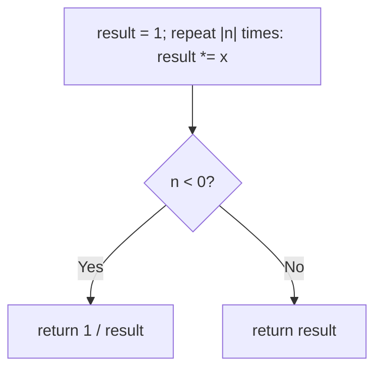
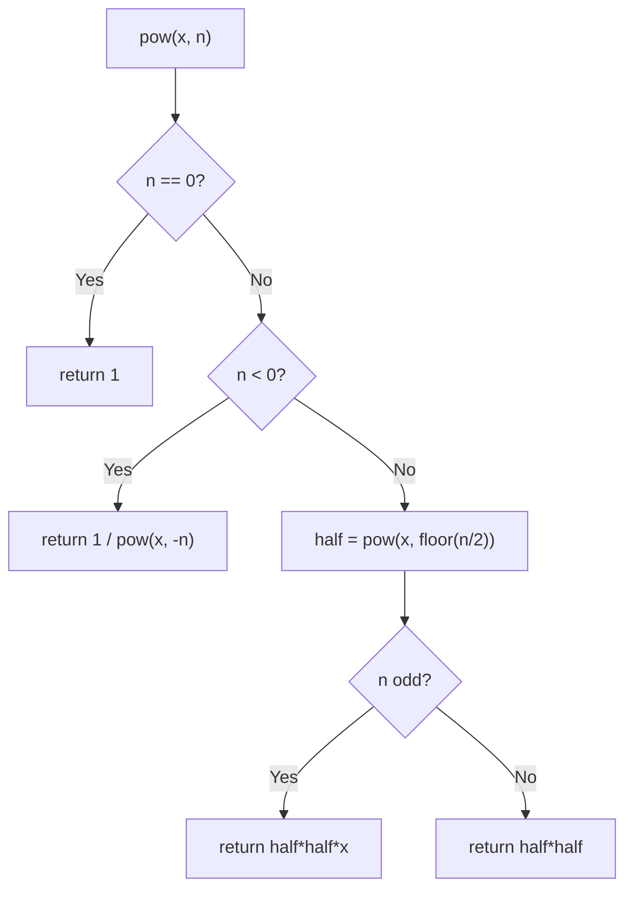

# 50. Pow(x, n)

- **LeetCode Link**: `https://leetcode.com/problems/powx-n/`
- **Difficulty**: Medium
- **Pattern Category**: Math / Binary Exponentiation
- **Prerequisite Primer**: `00-foundations/01-js-interview-runtime-quirks.md`

---

## 1. Problem Overview & Edge Case Matrix

### Problem Statement
Implement `pow(x, n)`, which calculates `x` raised to the power `n` (i.e., $x^n$).

```
Example 1:
Input: x = 2.00000, n = 10
Output: 1024.00000

Example 2:
Input: x = 2.10000, n = 3
Output: 9.26100

Example 3:
Input: x = 2.00000, n = -2
Output: 0.25000
Explanation: 2^-2 = 1/2^2 = 1/4 = 0.25
```

### Visual Problem Representation
```
x^10 = x^8 * x^2           (binary decomposition of 10 = 1010₂)
     = ((x^2)^2)^2 * x^2   (square along the bits, multiply on 1-bits)
```

### Upfront Edge Case Matrix
| Edge Case Category | Specific Input Scenario | Expected Behavior | Pitfall / Risk |
| :--- | :--- | :--- | :--- |
| Zero exponent | `n = 0` (any `x`) | Return `1` | Loop that never seeds result |
| Negative exponent | `n = -2` | `1 / x^2` | Negating `-2³¹` (overflow in 32-bit; safe in JS) |
| Base one/zero | `x = 1` / `x = 0, n > 0` | `1` / `0` | `0^0` ambiguity (spec avoids it) |
| Fractional base | `x = 2.1, n = 3` | `≈ 9.261` | Float equality in tests (use tolerance) |
| Large exponent | `|n| = 2³¹` | Fast log loop | Linear loop hanging forever |

---

## 2. Level 1: Brute Force Approach

### Intuition & Visual Idea
Multiply `x` by itself `|n|` times; reciprocate for negative `n`. $O(|n|)$ — hangs on extreme exponents.



### Pseudocode
```text
FUNCTION myPowBruteForce(x, n):
    IF n == 0: RETURN 1
    m = ABS(n); result = 1
    REPEAT m TIMES: result *= x
    IF n < 0: RETURN 1 / result
    RETURN result
```

### Step-by-Step Dry Run (Visual Trace)
| Step | Iteration / Pointer ($i, j$) | Current Value | State / Sub-array | Action Taken |
| :--- | :--- | :--- | :--- | :--- |
| 0 | 10 multiplies | `1·2·2…` | Accumulate | Loop |
| 1 | result `1024` | `n > 0` | No reciprocal | Return `1024` |
| 2 | `n = -2` | `result = 4` | Reciprocate | Return `0.25` |

### Modern JavaScript Implementation
```javascript
/**
 * Level 1: Brute Force (repeated multiplication)
 * Time Complexity:  O(|n|) — hangs at extreme exponents
 * Space Complexity: O(1)
 */
function myPowBruteForce(x, n) {
  if (n === 0) return 1;
  const m = Math.abs(n);
  let result = 1;
  for (let i = 0; i < m; i++) result *= x;
  return n < 0 ? 1 / result : result;
}
```

### Complexity Breakdown
- **Time Complexity**: $O(|n|)$ — linear in the exponent; $|n| = 2^{31}$ never finishes.
- **Space Complexity**: $O(1)$ — single accumulator.

---

## 3. Level 2: Optimized Approach

### Intuition & Visual Bottleneck Elimination
Recursive halving: $x^n = (x^{n/2})^2$ (times $x$ if $n$ odd); negatives reciprocate once up front. $O(\log n)$ multiplies — but $O(\log n)$ stack frames.



### Pseudocode
```text
FUNCTION myPowRecursive(x, n):
    IF n == 0: RETURN 1
    IF n < 0: RETURN 1 / myPowRecursive(x, -n)
    half = myPowRecursive(x, FLOOR(n / 2))
    IF n MOD 2 == 0: RETURN half * half
    RETURN half * half * x
```

### Step-by-Step Dry Run (Visual Trace)
| Step | Pointers / Window | Hash Map / Auxiliary State | Decision Logic | Output Accumulator |
| :--- | :--- | :--- | :--- | :--- |
| 0 | `pow(2, 10)` | halve | `half = pow(2, 5)` | Recurse |
| 1 | `pow(2, 5)` | halve, odd | `half = pow(2, 2)` | Recurse |
| 2 | `pow(2, 2)` → `pow(2, 1)` → `pow(2, 0) = 1` | unwind: `1 → 2 → 4` | `pow(2,2) = 2·2 = 4` |
| 3 | `pow(2, 5)` → `pow(2, 10)` | odd then even | `4·4·2 = 32`, then `32·32` | Return `1024` |

### Modern JavaScript Implementation
```javascript
/**
 * Level 2: Optimized (recursive halving)
 * Time Complexity:  O(log n) — exponent halves per frame
 * Space Complexity: O(log n) — call stack depth
 */
function myPowRecursive(x, n) {
  if (n === 0) return 1;
  // Negate once up front (safe in JS doubles even at n = -2^31).
  if (n < 0) return 1 / myPowRecursive(x, -n);
  const half = myPowRecursive(x, Math.floor(n / 2));
  // Even: square the half. Odd: square plus one more base factor.
  if (n % 2 === 0) return half * half;
  return half * half * x;
}
```

### Complexity Breakdown
- **Time Complexity**: $O(\log n)$ — halving per frame.
- **Space Complexity**: $O(\log n)$ — recursion depth; iteration removes even this.

---

## 4. Level 3: Most Optimal / Canonical Approach

### Intuition & Mathematical / Invariant Proof
Iterative binary exponentiation over the exponent's bits: square the base each step, multiply into the result on 1-bits. Invariant: `result · base^exp` always equals the answer — bits consumed left-to-right shift value from `exp` into `result`. Negative exponents reciprocate the base once. $O(\log n)$ time, $O(1)$ space — the canonical form.

```
2^10 (1010₂): result=1
  bit0=0: base=4, exp=5
  bit0=1: result=4, base=16, exp=2
  bit0=0: base=256, exp=1
  bit0=1: result=4·256=1024, exp=0 -> return 1024
```

### Pseudocode
```text
FUNCTION myPow(x, n):
    IF n == 0: RETURN 1
    base = x; exp = n
    IF exp < 0: base = 1 / base; exp = -exp
    result = 1
    WHILE exp > 0:
        IF exp MOD 2 == 1: result *= base
        base *= base
        exp = FLOOR(exp / 2)
    RETURN result
```

### Step-by-Step Dry Run (Visual Trace)
| Step | Pointer $L$ | Pointer $R$ | Invariant Checked | In-Place State |
| :--- | :--- | :--- | :--- | :--- |
| 1 | `exp=10`, `base=2` | even: skip multiply | `result=1`, `base=4`, `exp=5` | Square + shift |
| 2 | `exp=5`, `base=4` | odd: `result=4` | `base=16`, `exp=2` | Fold bit |
| 3 | `exp=2`, `base=16` | even | `base=256`, `exp=1` | Square + shift |
| 4 | `exp=1`, `base=256` | odd: `result=4·256` | `exp=0` | Return `1024` |

### Modern JavaScript Implementation
```javascript
/**
 * Level 3: Most Optimal / Canonical (iterative binary exponentiation)
 * Time Complexity:  O(log n) — one step per exponent bit
 * Space Complexity: O(1) auxiliary — three numbers
 */
function myPow(x, n) {
  if (n === 0) return 1;
  let base = x;
  let exp = n;
  // Reciprocate once: the loop then handles only non-negative exponents.
  if (exp < 0) {
    base = 1 / base;
    exp = -exp;
  }
  let result = 1;
  while (exp > 0) {
    // 1-bit: fold the current power into the answer.
    if (exp % 2 === 1) result *= base;
    base *= base; // square along the bits
    exp = Math.floor(exp / 2);
  }
  return result;
}
```

### Complexity Breakdown
- **Time Complexity**: $O(\log n)$ — optimal; one step per bit.
- **Space Complexity**: $O(1)$ auxiliary — three numbers, zero allocation.

---

## 5. JavaScript-Specific Gotchas & V8 Optimizations
- **GC Pressure**: Avoid allocating objects inside tight loops ($O(N)$ closures). All levels allocate nothing per step — never build bit arrays (`n.toString(2)`) to drive the loop; arithmetic bit tests are free.
- **Type Coercion / Sorting**: `exp % 2 === 1` with `Math.floor(exp / 2)` (not `>> 1`) — bitwise ops truncate to 32 bits and corrupt exponents past $2^{31}$; float mod/floor stay exact across the full double range. Float RESULTS need tolerance comparison (`|a-b| < 1e-9`), never `===` (see tests).
- **Index Bounds**: No indices — but `-n` at `n = -2³¹` overflows 32-bit int negation (still `-2³¹` in two's complement!); JS doubles negate exactly, but state the trap for fixed-width languages (standard fix: halve `n` first or promote to 64-bit).

---

## 6. Real-World MAANG Interview Follow-Ups & Extensions

### Follow-Up 1: Modular exponentiation (pow with mod)
- **Scenario**: Compute $x^n \bmod m$ for cryptographic-size values (RSA-style).
- **Solution Strategy**: Level 3's loop with `% m` after every multiply — intermediate values never exceed $m^2$; `BigInt` variant for exactness past $2^{53}$.
- **JS Code / Implementation Pattern**:
```javascript
function modPow(x, n, mod) {
  let result = 1n;
  let base = BigInt(x) % BigInt(mod);
  let exp = BigInt(n);
  while (exp > 0n) {
    if (exp & 1n) result = (result * base) % BigInt(mod);
    base = (base * base) % BigInt(mod);
    exp >>= 1n;
  }
  return result;
}
```

### Follow-Up 2: Matrix / Fibonacci exponentiation
- **Scenario**: $O(\log n)$ Fibonacci via matrix powers (or linear recurrences generally).
- **Solution Strategy**: Level 3 over $2×2$ matrices: replace `*` with matmul — `M^n` applied to `[F1, F0]` yields $F_n$. Same loop, richer algebra.
- **JS Code / Implementation Pattern**:
```javascript
function fib(n) {
  if (n <= 1) return n;
  const M = [[1, 1], [1, 0]];
  const P = matPow(M, n - 1); // Level-3 loop with matmul
  return P[0][0];
}
```

### Follow-Up 3: $10^9$-bit exponents with sliding windows
- **Scenario & In-Depth Solution**: Cryptographic exponents where each multiply costs dearly — sliding-window exponentiation precomputes odd powers ($x^1, x^3, …, x^{2^k-1}$) and skips zero runs, cutting multiplies ~20% vs binary method. Same invariant, smarter bit parsing.
```javascript
function windowedPow(x, n, width = 4) {
  const table = precomputeOddPowers(x, width);
  return squareAndMultiplyWindowed(n, table);
}
```
