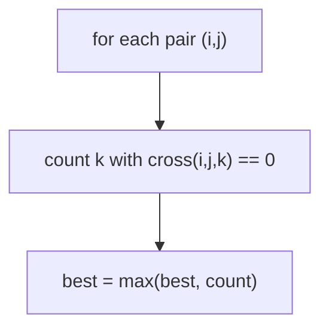
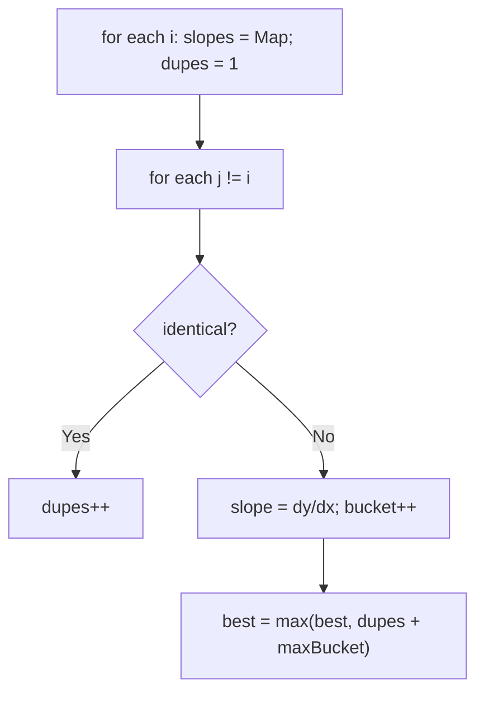

# 149. Max Points on a Line

- **LeetCode Link**: `https://leetcode.com/problems/max-points-on-a-line/`
- **Difficulty**: Hard
- **Pattern Category**: Math / Slope Hashing (GCD-Normalized)
- **Prerequisite Primer**: `00-foundations/01-js-interview-runtime-quirks.md`

---

## 1. Problem Overview & Edge Case Matrix

### Problem Statement
Given an array of `points` where `points[i] = [xi, yi]` represents a point on the X-Y plane, return the maximum number of points that lie on the same straight line.

```
Example 1:
Input: points = [[1,1],[2,2],[3,3]]
Output: 3

Example 2:
Input: points = [[1,1],[3,2],[5,3],[4,1],[2,3],[1,4]]
Output: 4
Explanation: The line through [1,1],[2,3]... precisely, 4 points are collinear.
```

### Visual Problem Representation
```
y
^  x           (1,4)
|    x   x     (2,3),(4,1)... line: 4 of 6 collinear
|  x     x
|    x
+x------------>
  1 2 3 4 5
```

### Upfront Edge Case Matrix
| Edge Case Category | Specific Input Scenario | Expected Behavior | Pitfall / Risk |
| :--- | :--- | :--- | :--- |
| Tiny input | `n ≤ 2` | Return `n` | Loop that needs ≥3 points |
| All identical | `[[1,1],[1,1],[1,1]]` | Return `3` | Slope `0/0` (NaN key chaos) |
| Vertical line | Same `x` throughout | Correct count | Division by zero (`Infinity` key) |
| Horizontal line | Same `y` throughout | Correct count | `-0` vs `0` slope keys |
| Duplicates mixed in | Coincident + collinear | Count both | Duplicate handling dropped |

---

## 2. Level 1: Brute Force Approach

### Intuition & Visual Idea
Every PAIR defines a candidate line; count all points collinear with it via cross-multiplication (no division, no slopes). Track the max over all pairs. $O(N^3)$ — obviously correct, hopelessly slow.



### Pseudocode
```text
FUNCTION maxPointsBruteForce(points):
    n = points.LENGTH
    IF n <= 2: RETURN n
    best = 2
    FOR i IN 0 .. n-1:
        FOR j IN i+1 .. n-1:
            count = 2   // i and j define the line
            FOR k IN 0 .. n-1 EXCEPT i, j:
                IF CROSS(points[i], points[j], points[k]) == 0: count++
            best = MAX(best, count)
    RETURN best

CROSS(a, b, c) = (y2-y1)*(x3-x1) - (y3-y1)*(x2-x1)   // zero ⟺ collinear
```

### Step-by-Step Dry Run (Visual Trace)
| Step | Iteration / Pointer ($i, j$) | Current Value | State / Sub-array | Action Taken |
| :--- | :--- | :--- | :--- | :--- |
| 0 | pair `(0,1)` | line through `[1,1],[2,2]` | `[3,3]` collinear | `count = 3`, `best = 3` |
| 1 | pairs `(0,2)`, `(1,2)` | same line | `count = 3` | No improvement |
| 2 | return | — | — | Return `3` |

### Modern JavaScript Implementation
```javascript
/**
 * Level 1: Brute Force (pair-defined lines + cross-product count)
 * Time Complexity:  O(N³) — pair loop with full collinearity scan
 * Space Complexity: O(1) — counters only
 */
function maxPointsBruteForce(points) {
  const n = points.length;
  if (n <= 2) return n;
  // Cross product (b-a) × (c-a): zero ⟺ collinear. No division anywhere.
  const cross = (ax, ay, bx, by, cx, cy) => (by - ay) * (cx - ax) - (cy - ay) * (bx - ax);
  let best = 2;
  for (let i = 0; i < n; i++) {
    for (let j = i + 1; j < n; j++) {
      let count = 2; // the defining pair itself
      for (let k = 0; k < n; k++) {
        if (k === i || k === j) continue;
        const [x1, y1] = points[i];
        const [x2, y2] = points[j];
        const [x3, y3] = points[k];
        if (cross(x1, y1, x2, y2, x3, y3) === 0) count++;
      }
      if (count > best) best = count;
    }
  }
  return best;
}
```

### Complexity Breakdown
- **Time Complexity**: $O(N^3)$ — pair enumeration with linear verification each.
- **Space Complexity**: $O(1)$ — counters; time is the catastrophe (spec $N = 300$).

---

## 3. Level 2: Optimized Approach

### Intuition & Visual Bottleneck Elimination
Anchor per point: from anchor `i`, bucket other points by FLOAT slope (`dy/dx`), tracking the biggest bucket plus duplicates of the anchor. Best line through `i` = `dupes + maxBucket`; global answer = max over anchors. $O(N^2)$ time/space — with float keys as the known risk.



### Pseudocode
```text
FUNCTION maxPointsSlopes(points):
    n = points.LENGTH
    IF n <= 2: RETURN n
    best = 0
    FOR i IN 0 .. n-1:
        slopes = EMPTY MAP; dupes = 1; local = 0
        FOR j IN 0 .. n-1 EXCEPT i:
            dx = xj-xi; dy = yj-yi
            IF dx == 0 AND dy == 0: dupes++; CONTINUE
            slope = dy / dx
            c = (slopes.GET(slope) ?? 0) + 1; slopes.SET(slope, c)
            local = MAX(local, c)
        best = MAX(best, dupes + local)
    RETURN best
```

### Step-by-Step Dry Run (Visual Trace)
| Step | Pointers / Window | Hash Map / Auxiliary State | Decision Logic | Output Accumulator |
| :--- | :--- | :--- | :--- | :--- |
| 0 | anchor `[1,1]` | slopes `{1: 2}` (`[2,2],[3,3]`) | `dupes=1`, `local=2` | `best = 3` |
| 1 | anchors `[2,2]`, `[3,3]` | same line, smaller buckets | No improvement | `best = 3` |
| 2 | return | — | — | Return `3` |

### Modern JavaScript Implementation
```javascript
/**
 * Level 2: Optimized (float-slope buckets per anchor)
 * Time Complexity:  O(N²) — anchor loop with linear bucketing
 * Space Complexity: O(N) — slope map per anchor
 */
function maxPointsSlopes(points) {
  const n = points.length;
  if (n <= 2) return n;
  let best = 0;
  for (let i = 0; i < n; i++) {
    const slopes = new Map();
    let dupes = 1; // the anchor itself
    let local = 0;
    for (let j = 0; j < n; j++) {
      if (i === j) continue;
      const dx = points[j][0] - points[i][0];
      const dy = points[j][1] - points[i][1];
      // Coincident with anchor: joins EVERY line through it.
      if (dx === 0 && dy === 0) {
        dupes++;
        continue;
      }
      // Float slope: Infinity (vertical) is a fine Map key; SameValueZero
      // unifies -0/+0. Precision risk near-duplicate slopes: see Level 3.
      const slope = dy / dx;
      const c = (slopes.get(slope) ?? 0) + 1;
      slopes.set(slope, c);
      if (c > local) local = c;
    }
    if (dupes + local > best) best = dupes + local;
  }
  return best;
}
```

### Complexity Breakdown
- **Time Complexity**: $O(N^2)$ — anchor loop with linear inner bucketing.
- **Space Complexity**: $O(N)$ — one slope map at a time; float keys risk near-miss splits.

---

## 4. Level 3: Most Optimal / Canonical Approach

### Intuition & Mathematical / Invariant Proof
Same anchor loop, but slopes as GCD-REDUCED integer pairs with canonical signs: divide `(dx, dy)` by `gcd(|dx|,|dy|)`, force `dx > 0` (flip both signs otherwise; verticals become `(0,1)`). Reduced pairs are EXACT line identifiers — no float error, ever. Invariant: equal keys ⟺ identical direction from the anchor ⟺ same line through it (plus duplicates counted separately). Same $O(N^2)$ bounds as Level 2 with exact arithmetic.

```
anchor [1,1]: [2,2]->(1,1); [3,3]->(2,2)->(1,1); bucket {(1,1): 2} -> 1+2 = 3
```

### Pseudocode
```text
FUNCTION maxPoints(points):
    n = points.LENGTH
    IF n <= 2: RETURN n
    best = 0
    FOR i IN 0 .. n-1:
        slopes = EMPTY MAP; dupes = 1; local = 0
        FOR j IN 0 .. n-1 EXCEPT i:
            dx = xj-xi; dy = yj-yi
            IF dx == 0 AND dy == 0: dupes++; CONTINUE
            g = GCD(dx, dy); dx /= g; dy /= g
            IF dx < 0: dx = -dx; dy = -dy
            ELSE IF dx == 0: dy = 1
            key = "dx,dy"; bucket++; local = MAX(local, bucket)
        best = MAX(best, dupes + local)
    RETURN best
```

### Step-by-Step Dry Run (Visual Trace)
| Step | Pointer $L$ | Pointer $R$ | Invariant Checked | In-Place State |
| :--- | :--- | :--- | :--- | :--- |
| 1 | anchor `[1,1]` | `[2,2]` → `(1,1)` | Reduced, `dx > 0` | Bucket `{(1,1): 1}` |
| 2 | anchor `[1,1]` | `[3,3]` → `(2,2)` → `(1,1)` | Same key (exact!) | Bucket `{(1,1): 2}` |
| 3 | combine | `dupes(1) + local(2)` | — | `best = 3` |

### Modern JavaScript Implementation
```javascript
/**
 * Level 3: Most Optimal / Canonical (GCD-normalized exact slopes)
 * Time Complexity:  O(N² log C) — anchor loop; GCD is log in coordinates
 * Space Complexity: O(N) — one slope map at a time
 */
function gcd(a, b) {
  // Euclidean algorithm over non-negative ints (0 handled: gcd(x,0) = x).
  a = Math.abs(a);
  b = Math.abs(b);
  while (b !== 0) {
    [a, b] = [b, a % b];
  }
  return a || 1; // gcd(0,0) unreachable here (dupes filtered); guard anyway
}

function maxPoints(points) {
  const n = points.length;
  if (n <= 2) return n;
  let best = 0;
  for (let i = 0; i < n; i++) {
    const slopes = new Map();
    let dupes = 1; // the anchor itself
    let local = 0;
    for (let j = 0; j < n; j++) {
      if (i === j) continue;
      let dx = points[j][0] - points[i][0];
      let dy = points[j][1] - points[i][1];
      if (dx === 0 && dy === 0) {
        dupes++; // coincident: belongs to every line through the anchor
        continue;
      }
      // Reduce to lowest terms: exact direction identity, no floats.
      const g = gcd(dx, dy);
      dx /= g;
      dy /= g;
      // Canonical sign: (dx,dy) ~ (-dx,-dy) denote one line. Force dx > 0;
      // verticals (dx == 0) collapse to (0,1).
      if (dx < 0) {
        dx = -dx;
        dy = -dy;
      } else if (dx === 0) {
        dy = 1;
      }
      const key = dx + ',' + dy;
      const c = (slopes.get(key) ?? 0) + 1;
      slopes.set(key, c);
      if (c > local) local = c;
    }
    if (dupes + local > best) best = dupes + local;
  }
  return best;
}
```

### Complexity Breakdown
- **Time Complexity**: $O(N^2 \log C)$ — optimal shape; GCD adds a log-coordinate factor per pair.
- **Space Complexity**: $O(N)$ — one map at a time; exactness is what improved, not space.

---

## 5. JavaScript-Specific Gotchas & V8 Optimizations
- **GC Pressure**: Avoid allocating objects inside tight loops ($O(N)$ closures). Level 3's `"dx,dy"` key strings ($O(N)$ per anchor) are the residual pressure — acceptable at $N = 300$; at scale, pack into a single integer key `(dx * BIG + dy)` with offset bias.
- **Type Coercion / Sorting**: Slope keys MUST be strings — numeric `dx + dy` collides (`(1,2)` vs `(2,1)`); `dy / dx` float keys near-split on large coordinates (the Level 2→3 motivation). `gcd(0,0)` guard (`|| 1`) never fires post-dupe-filter but documents the edge.
- **Index Bounds**: No indices — but the sign-normalization order matters: reduce FIRST (`dx /= g`), then canonicalize signs. Normalizing an unreduced pair (`(-2,-4)` → `(2,4)` without dividing) leaves non-identical keys for identical lines.

---

## 6. Real-World MAANG Interview Follow-Ups & Extensions

### Follow-Up 1: Lines with at least K points (report them, not just count)
- **Scenario**: Return the actual lines (point sets), not just the max count.
- **Solution Strategy**: Level 3's buckets already group by line: retain the argmax bucket's member indices per anchor (or globally), then dedupe lines across anchors by normalized line equation `(A,B,C)`.
- **JS Code / Implementation Pattern**:
```javascript
function linesWithKPoints(points, K) {
  return collectBuckets(points).filter((b) => b.members.length >= K);
}
```

### Follow-Up 2: $10^6$ points with streaming (RANSAC territory)
- **Scenario**: Exact $O(N^2)$ infeasible; approximate max-collinear set suffices (vision/LiDAR).
- **Solution Strategy**: RANSAC: sample pairs, count inliers via cross-product threshold $\epsilon$ (float tolerance here is CORRECT — measurement noise, not math), iterate with confidence scheduling. Exact for clean data with high probability, bounded time always.
- **JS Code / Implementation Pattern**:
```javascript
function ransacMaxLine(points, iters = 1000, eps = 1e-9) {
  let best = [];
  for (let t = 0; t < iters; t++) {
    const [a, b] = samplePair(points);
    const inliers = points.filter((p) => Math.abs(cross(a, b, p)) <= eps);
    if (inliers.length > best.length) best = inliers;
  }
  return best;
}
```

### Follow-Up 3: Dynamic point set with max-line maintenance
- **Scenario & In-Depth Solution**: Points insert/delete; recomputing is $O(N^2)$. Maintain per-anchor slope maps incrementally (insert touches $O(N)$ buckets, delete decrements); global max via a frequency-of-frequencies structure. $O(N)$ per update, $O(1)$ query — the standard dynamization of Level 3.
```javascript
function insertPoint(state, p) {
  for (const [anchor, slopes] of state.perAnchor) {
    bumpSlopeBucket(slopes, anchor, p); // O(1) amortized per anchor
  }
  state.globalMax = refreshMax(state);
}
```
