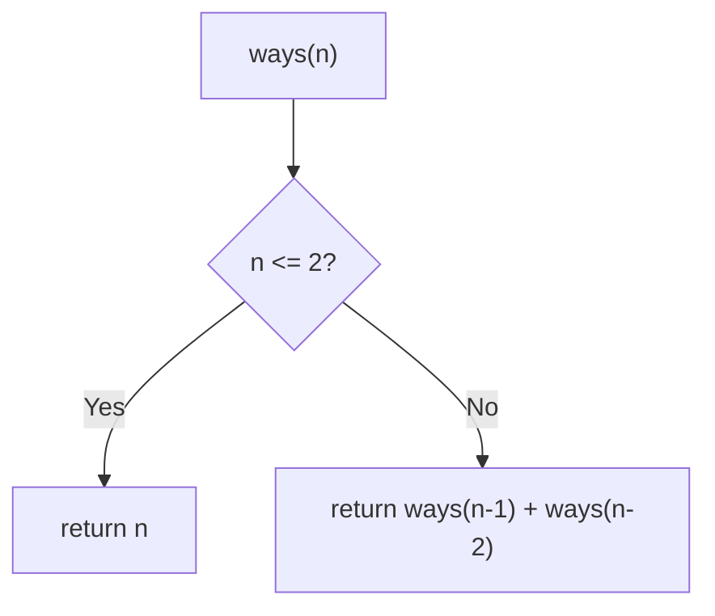
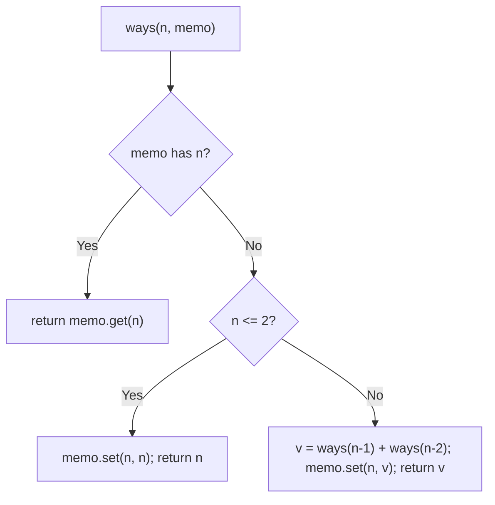
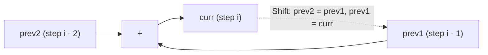

# 70. Climbing Stairs

- **LeetCode Link**: `https://leetcode.com/problems/climbing-stairs/`
- **Difficulty**: Easy
- **Pattern Category**: 1D DP / Linear Recurrence
- **Prerequisite Primer**: `00-foundations/03-core-algorithmic-patterns.md`

---

## 1. Problem Overview & Edge Case Matrix

### Problem Statement
You are climbing a staircase. It takes `n` steps to reach the top. Each time you can either climb 1 or 2 steps. In how many distinct ways can you climb to the top?

```
Example 1:
Input: n = 2
Output: 2
Explanation: 1+1, 2.

Example 2:
Input: n = 3
Output: 3
Explanation: 1+1+1, 1+2, 2+1.
```

### Visual Problem Representation
```
n = 4:   ways(n) = ways(n-1) + ways(n-2)   (first step 1- or 2- sized)
         ways: 1, 2, 3, 5, 8 ... (Fibonacci shifted)
```

### Upfront Edge Case Matrix
| Edge Case Category | Specific Input Scenario | Expected Behavior | Pitfall / Risk |
| :--- | :--- | :--- | :--- |
| Minimum | `n = 1` | Return `1` | Base-case indexing |
| Small | `n = 2` | Return `2` | Both base cases needed |
| Max scale | `n = 45` | `1836311903` (fits int) | Exponential blowup without memo |
| Overflow beyond spec | `n > 46` | Exceeds 32-bit | Number safety (JS doubles exact to $2^{53}$) |
| Off-by-one framing | `ways(0)` | `1` (empty climb, useful base) | Defining base as 0 instead |

---

## 2. Level 1: Brute Force Approach

### Intuition & Visual Idea
Direct recursion on the definition: `ways(n) = ways(n-1) + ways(n-2)`. The call tree re-solves every subproblem exponentially many times — the canonical motivation for memoization.



### Pseudocode
```text
FUNCTION climbStairsBruteForce(n):
    IF n <= 2: RETURN n
    RETURN climbStairsBruteForce(n-1) + climbStairsBruteForce(n-2)
```

### Step-by-Step Dry Run (Visual Trace)
| Step | Iteration / Pointer ($i, j$) | Current Value | State / Sub-array | Action Taken |
| :--- | :--- | :--- | :--- | :--- |
| 0 | `ways(4)` | splits | `ways(3) + ways(2)` | Branch |
| 1 | `ways(3)` | splits | `ways(2) + ways(1)` = `2 + 1` | Branch |
| 2 | `ways(2)` | base | `2` | Return |
| 3 | total | `3 + 2` | — | Return `5` (`ways(3)` recomputed: 3 calls for it) |

### Modern JavaScript Implementation
```javascript
/**
 * Level 1: Brute Force (naive definition recursion)
 * Time Complexity:  O(2^N) — every subproblem re-solved exponentially often
 * Space Complexity: O(N) — call stack depth
 */
function climbStairsBruteForce(n) {
  // ways(1) = 1 ([1]), ways(2) = 2 ([1+1], [2]).
  if (n <= 2) return n;
  return climbStairsBruteForce(n - 1) + climbStairsBruteForce(n - 2);
}
```

### Complexity Breakdown
- **Time Complexity**: $O(2^N)$ — the call tree doubles per level; $n = 45$ never finishes.
- **Space Complexity**: $O(N)$ — stack depth; time is the catastrophe.

---

## 3. Level 2: Optimized Approach

### Intuition & Visual Bottleneck Elimination
Memoize solved subproblems: each `ways(k)` computed once, read from the map after. Same recursion shape, $O(N)$ time — the overlapping-subproblems insight that DEFINES dynamic programming.



### Pseudocode
```text
FUNCTION climbStairsMemo(n, memo = MAP()):
    IF memo HAS n: RETURN memo.GET(n)
    IF n <= 2: result = n
    ELSE: result = climbStairsMemo(n-1) + climbStairsMemo(n-2)
    memo.SET(n, result)
    RETURN result
```

### Step-by-Step Dry Run (Visual Trace)
| Step | Pointers / Window | Hash Map / Auxiliary State | Decision Logic | Output Accumulator |
| :--- | :--- | :--- | :--- | :--- |
| 0 | `ways(5)` | miss | Recurse `4`, `3` | — |
| 1 | `ways(4)` → `ways(3)` → … | each solved once | Memo fills `{1:1, 2:2, 3:3, 4:5}` | — |
| 2 | `ways(3)` (second ref) | HIT | No recompute | Return `3` |
| 3 | unwind | — | `5 + 3` | Return `8` |

### Modern JavaScript Implementation
```javascript
/**
 * Level 2: Optimized (top-down memoization)
 * Time Complexity:  O(N) — each subproblem solved once
 * Space Complexity: O(N) — memo map plus call stack
 */
function climbStairsMemo(n, memo = new Map()) {
  if (memo.has(n)) return memo.get(n); // solved before: free lookup
  // Base cases double as memo seeds.
  const result = n <= 2 ? n : climbStairsMemo(n - 1, memo) + climbStairsMemo(n - 2, memo);
  memo.set(n, result);
  return result;
}
```

### Complexity Breakdown
- **Time Complexity**: $O(N)$ — $N$ distinct states, $O(1)$ work each.
- **Space Complexity**: $O(N)$ — memo map plus $O(N)$ stack.

---

## 4. Level 3: Most Optimal / Canonical Approach

### Intuition & Mathematical / Invariant Proof
Bottom-up Fibonacci iteration with two variables: `a = ways(i-2)`, `b = ways(i-1)` rolling forward. Invariant: after processing step $i$, `(a, b) = (ways(i-1), ways(i))$ — each iteration advances the window by the recurrence. No map, no stack, $O(1)$ space. This is the form to write on a whiteboard.

```
n=5: (a,b) = (1,2) -> i=3: (2,3) -> i=4: (3,5) -> i=5: (5,8) -> return 8
```

### Pseudocode
```text
FUNCTION climbStairs(n):
    IF n <= 2: RETURN n
    a = 1; b = 2   // ways(1), ways(2)
    FOR i IN 3 .. n:
        [a, b] = [b, a + b]
    RETURN b
```

### Step-by-Step Dry Run (Visual Trace)
| Step | Pointer $L$ | Pointer $R$ | Invariant Checked | In-Place State |
| :--- | :--- | :--- | :--- | :--- |
| 1 | `(a,b) = (1,2)` | `i = 3` | `ways(1), ways(2)` | Advance |
| 2 | `(a,b) = (2,3)` | `i = 4` | `ways(2), ways(3)` | Advance |
| 3 | `(a,b) = (5,8)` | `i = 5` | `ways(4), ways(5)` | Return `b = 8` |

### Modern JavaScript Implementation
```javascript
/**
 * Level 3: Most Optimal / Canonical (iterative two-variable DP)
 * Time Complexity:  O(N) — single pass, optimal (must touch N states)
 * Space Complexity: O(1) auxiliary — two numbers
 */
function climbStairs(n) {
  if (n <= 2) return n;
  let a = 1; // ways(i - 2)
  let b = 2; // ways(i - 1)
  for (let i = 3; i <= n; i++) {
    // Roll the window: new b = a + b, old b becomes a.
    [a, b] = [b, a + b];
  }
  return b; // ways(n)
}
```

### Complexity Breakdown
- **Time Complexity**: $O(N)$ — optimal; $N$ states is the lower bound.
- **Space Complexity**: $O(1)$ auxiliary — two numbers; the textbook DP compression.

---

## 5. JavaScript-Specific Gotchas & V8 Optimizations
- **GC Pressure**: Avoid allocating objects inside tight loops ($O(N)$ closures). Level 2's `Map` (boxed keys/entries) is the pressure Level 3 removes — two locals, zero allocation.
- **Type Coercion / Sorting**: Default parameter `memo = new Map()` creates ONE map per top-level call (not per recursion — defaults evaluate at each `climbStairsMemo(n)` entry without an argument, and recursive calls PASS `memo` explicitly). Accidentally omitting the pass-through re-creates the map per frame and silently un-memoizes.
- **Index Bounds**: `ways(0) = 1` (empty climb) is the cleaner recurrence base (`ways(n) = ways(n-1) + ways(n-2)` holds for $n = 2$ iff `ways(0) = 1`), but the spec starts at $n \ge 1$ — the `n <= 2` base here matches the problem framing, not the math framing; know both.

---

## 6. Real-World MAANG Interview Follow-Ups & Extensions

### Follow-Up 1: Variable step sizes and min-cost climbing
- **Scenario**: Steps of any size from a set (or each step has a cost — LeetCode 746).
- **Solution Strategy**: Same rolling window generalized: `dp[i] = min over steps s of dp[i-s] + cost[i]`; window sized by max step. $O(N·S)$ time, $O(S)$ space.
- **JS Code / Implementation Pattern**:
```javascript
function minCostClimbingStairs(cost) {
  let a = 0, b = 0; // dp(i-2), dp(i-1)
  for (let i = 2; i <= cost.length; i++) {
    [a, b] = [b, Math.min(b + cost[i - 1], a + cost[i - 2])];
  }
  return b;
}
```

### Follow-Up 2: Counting paths in a DAG (generalization)
- **Scenario**: Ways through an arbitrary DAG (stairs = path graph).
- **Solution Strategy**: Topological order + `ways[v] += ways[u]` propagation — Level 3's recurrence is the path-graph specialization. $O(V + E)$ time.
- **JS Code / Implementation Pattern**:
```javascript
function countPathsDAG(topoOrder, predecessors) {
  const ways = new Map([[topoOrder[0], 1]]);
  for (const v of topoOrder.slice(1)) {
    ways.set(v, predecessors(v).reduce((a, u) => a + (ways.get(u) ?? 0), 0));
  }
  return ways;
}
```

### Follow-Up 3: $10^9$ stairs via matrix exponentiation
- **Scenario & In-Depth Solution**: $n$ too large to iterate — Fibonacci in $O(\log n)$ via `[[1,1],[1,0]]^n` matrix power (binary exponentiation from the Pow guide). Same recurrence, logarithmic time.
```javascript
function climbStairsLogN(n) {
  return matPow([[1, 1], [1, 0]], n)[0][1]; // Fib(n+1)... adjusted for ways framing
}
```

---

## 7. What LeetCode Discuss Says (Language-Independent)

Source: top-voted post by Rahul Varma —
`https://leetcode.com/problems/climbing-stairs/solutions/3708750/4-methods-beats-100-c-java-python-beginn-bvot/`
— 461.3K views.
Language-independent summary. No new JS here.

### A. Optimal way from Discuss (Space-Optimized Fibonacci DP)

Reduce the recurrence relation to two rolling scalar state variables without allocating array buffers:

1. **Recurrence Invariant:**
   - Reaching stair $n$ is possible only by a single step from $n - 1$ or a double step from $n - 2$.
   - Because these choices are mutually exclusive, total ways satisfy the Fibonacci transition:
     $$\text{ways}(n) = \text{ways}(n - 1) + \text{ways}(n - 2)$$
2. **Base Cases:**
   - If $n \le 2$, return $n$ directly ($\text{ways}(1) = 1, \text{ways}(2) = 2$).
3. **Space Compression:**
   - Retain only the previous two computed values (`prev2` for $n-2$ and `prev1` for $n-1$).
   - Advance sequentially from 3 up to $n$, accumulating into `curr` and rotating the two registers forward.

```text
FUNCTION climbStairs(n):
    IF n <= 2:
        RETURN n

    prev2 = 1
    prev1 = 2

    FOR i FROM 3 TO n:
        curr = prev1 + prev2
        prev2 = prev1
        prev1 = curr

    RETURN prev1
```

- Time: O(n) — single linear pass through $n$ iterations.
- Space: O(1) auxiliary space — only two integer registers are used.



### B. Dry run on LeetCode Example 2 and Step 4

- **Example 2 ($n = 3$):**
  - $n > 2 \implies prev2 = 1, prev1 = 2$.
  - $i = 3$: $curr = 2 + 1 = 3$. Rotate: $prev2 = 2, prev1 = 3$.
  - Loop terminates. Return $prev1 = 3$.
- **Step 4 ($n = 4$):**
  - $i = 4$: $curr = 3 + 2 = 5$. Rotate: $prev2 = 3, prev1 = 5$.
  - Return $prev1 = 5$.

Final result: `5` distinct ways.

### C. Why Space Optimization Eliminates GC and Memory Overhead

- Naive recursion explores overlapping subproblems in $O(2^n)$ exponential time, causing call stack overflow.
- Full tabulation creates an array of size $n + 1$, adding memory allocations and garbage collection overhead. Compressing state into two primitives achieves $O(1)$ memory without sacrificing the $O(n)$ linear runtime.

### D. Pitfalls from comments

- **Integer Overflow on $n \ge 46$:** The 45th Fibonacci number is $1,836,311,903$, fitting within 32-bit signed limits ($2^{31} - 1$). At $n = 46$, the sum overflows 32-bit integers, requiring 64-bit integer types in languages like C++ or Java.
- **Base Offset Off-by-One:** Aligning index 0 vs index 1 can confuse initial states; verifying small inputs ($n=1 \to 1, n=2 \to 2$) avoids offset errors.

### E. Companies

- Discuss post itself names none.
  Companies tab on LeetCode is premium-locked.
- External source:
  `https://github.com/liquidslr/leetcode-company-wise-problems`
  (LeetCode company tags, updated June 2025).
- All-time (36): Accenture, Accolite, Adobe, Agoda, Amazon, AMD, Apple, BlackRock, Bloomberg, ByteDance, Citadel, Cognizant, Deloitte, Goldman Sachs, Google, Grammarly, HPE, HSBC, IBM, Infosys, Intuit, josh technology, Media.net, Meta, Microsoft, Nvidia, Oracle, PayPal, Qualcomm, Rakuten, Societe Generale, Squarepoint Capital, tcs, TikTok, Walmart Labs, Zoho.
- Recent: 30 days — Amazon, Bloomberg, Google, Infosys, Intuit, Meta, Ola Cabs.
- Recent: 3 months — Amazon, Bloomberg, Google, Infosys, Intuit, Meta, Microsoft, tcs.
