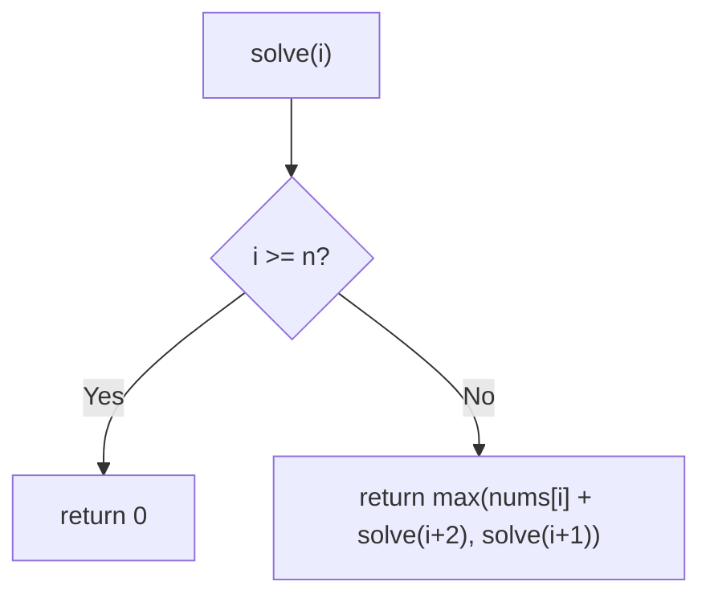
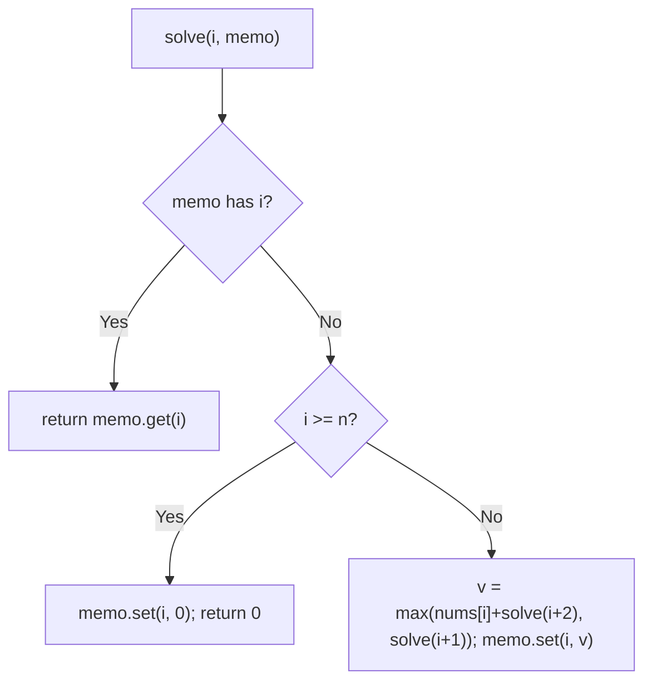
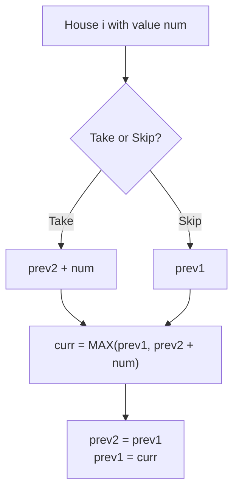

# 198. House Robber

- **LeetCode Link**: `https://leetcode.com/problems/house-robber/`
- **Difficulty**: Medium
- **Pattern Category**: 1D DP / Non-Adjacent Selection
- **Prerequisite Primer**: `00-foundations/03-core-algorithmic-patterns.md`

---

## 1. Problem Overview & Edge Case Matrix

### Problem Statement
You are a professional robber planning to rob houses along a street. Each house has a certain amount of money stashed. All houses at this place are arranged in a circle? No — a LINE for this problem. The constraint: adjacent houses have connected security systems — robbing two adjacent houses triggers the alarm. Given an integer array `nums` representing money in each house, return the maximum amount robable without alerting the police.

```
Example 1:
Input: nums = [1,2,3,1]
Output: 4
Explanation: Rob house 1 (1) and house 3 (3): 1 + 3 = 4.

Example 2:
Input: nums = [2,7,9,3,1]
Output: 12
Explanation: Rob 2 + 9 + 1 = 12.
```

### Visual Problem Representation
```
[2, 7, 9, 3, 1]:  rob?  -  -  -  -     best[i] = max(best[i-1], best[i-2] + nums[i])
                  best: 2, 7, 11, 11, 12
```

### Upfront Edge Case Matrix
| Edge Case Category | Specific Input Scenario | Expected Behavior | Pitfall / Risk |
| :--- | :--- | :--- | :--- |
| Empty (defensive) | `nums = []` | Return `0` | `nums[0]` access |
| Single Element | `[5]` | Return `5` | Loop needing ≥2 houses |
| Two houses | `[2,1]` | Return `2` (max) | Robbing both (adjacent!) |
| All zeros | `[0,0,0]` | Return `0` | Falsy-value short-circuits |
| First-two trap | `[2,1,1,2]` | Return `4` (houses 1+4), not `3` | Greedy first-pick |

---

## 2. Level 1: Brute Force Approach

### Intuition & Visual Idea
Try every subset implicitly via rob/skip recursion: at house `i`, either rob it (gain + solve from `i+2`) or skip it (solve from `i+1`). Exponential re-solving — the DP motivation, restated for selection problems.



### Pseudocode
```text
FUNCTION robBruteForce(nums):
    DEFINE solve(i):
        IF i >= nums.LENGTH: RETURN 0
        RETURN MAX(nums[i] + solve(i+2), solve(i+1))
    RETURN solve(0)
```

### Step-by-Step Dry Run (Visual Trace)
| Step | Iteration / Pointer ($i, j$) | Current Value | State / Sub-array | Action Taken |
| :--- | :--- | :--- | :--- | :--- |
| 0 | `solve(0)` | `max(1+solve(2), solve(1))` | Branch both | Recurse |
| 1 | `solve(2)` subtree | `max(3+solve(4), solve(3))` = `max(3, 1)` = `3` | Solved twice (also under `solve(1)`) | Overlap visible |
| 2 | `solve(1)` | `max(2+3, ...)` | Recomputes `solve(2)` | Waste |
| 3 | total | `max(1+3, ...)` | — | Return `4` |

### Modern JavaScript Implementation
```javascript
/**
 * Level 1: Brute Force (rob/skip recursion)
 * Time Complexity:  O(2^N) — every subset implicitly explored
 * Space Complexity: O(N) — call stack depth
 */
function robBruteForce(nums) {
  function solve(i) {
    if (i >= nums.length) return 0; // past the street: nothing left
    // Rob i (jump two) vs skip i (step one): take the better future.
    return Math.max(nums[i] + solve(i + 2), solve(i + 1));
  }
  return solve(0);
}
```

### Complexity Breakdown
- **Time Complexity**: $O(2^N)$ — binary decision tree over houses.
- **Space Complexity**: $O(N)$ — stack depth; time is the catastrophe.

---

## 3. Level 2: Optimized Approach

### Intuition & Visual Bottleneck Elimination
Memoize `solve(i)`: each suffix solved once. Same recursion, $O(N)$ time — the overlapping-subproblems fix, identical in spirit to Climbing Stairs' Level 2.



### Pseudocode
```text
FUNCTION robMemo(nums, memo = MAP(), i = 0):
    IF i >= nums.LENGTH: RETURN 0
    IF memo HAS i: RETURN memo.GET(i)
    v = MAX(nums[i] + robMemo(i+2), robMemo(i+1))
    memo.SET(i, v)
    RETURN v
```

### Step-by-Step Dry Run (Visual Trace)
| Step | Pointers / Window | Hash Map / Auxiliary State | Decision Logic | Output Accumulator |
| :--- | :--- | :--- | :--- | :--- |
| 0 | `solve(0)` | miss | Needs `solve(2)`, `solve(1)` | Recurse |
| 1 | `solve(2)` | miss → solves to `3` | Memo `{2: 3, …}` | Return `3` |
| 2 | `solve(1)` needs `solve(2)`, `solve(3)` | HIT `3`; `solve(3) = max(1+0, 0) = 1` | `max(2+1, 3) = 3` | `solve(1) = 3` |
| 3 | `solve(0)` | `max(1 + 3, 3)` | Rob house 0 + best rest | Return `4` |

### Modern JavaScript Implementation
```javascript
/**
 * Level 2: Optimized (top-down memoization)
 * Time Complexity:  O(N) — each suffix solved once
 * Space Complexity: O(N) — memo map plus call stack
 */
function robMemo(nums, i = 0, memo = new Map()) {
  if (i >= nums.length) return 0;
  if (memo.has(i)) return memo.get(i); // suffix solved before: free
  const v = Math.max(nums[i] + robMemo(nums, i + 2, memo), robMemo(nums, i + 1, memo));
  memo.set(i, v);
  return v;
}
```

### Complexity Breakdown
- **Time Complexity**: $O(N)$ — $N$ suffix states, $O(1)$ each.
- **Space Complexity**: $O(N)$ — memo plus stack.

---

## 4. Level 3: Most Optimal / Canonical Approach

### Intuition & Mathematical / Invariant Proof
Bottom-up with two variables: `prev2 = best[i-2]`, `prev1 = best[i-1]`; `cur = max(prev1, prev2 + nums[i])`. Invariant: after processing house $i$, `(prev2, prev1) = (best[i-1], best[i])$ — the window rolls forward by the recurrence. $O(N)$ time, $O(1)$ space. Note the parameter order `(nums, i, memo)` differs from the pseudocode above — signature is cosmetic; the recurrence is the substance.

```
[2,7,9,3,1]: (0,0) -> i=0: (0,2) -> i=1: (2,7) -> i=2: (7,11) -> i=3: (11,11) -> i=4: (11,12)
```

### Pseudocode
```text
FUNCTION rob(nums):
    prev2 = 0; prev1 = 0   // best[-1..], best[0..] seeds (empty prefix = 0)
    FOR EACH v IN nums:
        cur = MAX(prev1, prev2 + v)
        prev2 = prev1; prev1 = cur
    RETURN prev1
```

### Step-by-Step Dry Run (Visual Trace)
| Step | Pointer $L$ | Pointer $R$ | Invariant Checked | In-Place State |
| :--- | :--- | :--- | :--- | :--- |
| 1 | `v = 2` | `cur = max(0, 0+2) = 2` | `(prev2,prev1) = (0,2)` | Advance |
| 2 | `v = 7` | `cur = max(2, 0+7) = 7` | `(2,7)` | Advance |
| 3 | `v = 9` | `cur = max(7, 2+9) = 11` | `(7,11)` | Advance |
| 4 | `v = 3, 1` | `max(11, 7+3)=11`; `max(11, 11+1)=12` | `(11,11)` → `(11,12)` | Return `12` |

### Modern JavaScript Implementation
```javascript
/**
 * Level 3: Most Optimal / Canonical (iterative two-variable DP)
 * Time Complexity:  O(N) — single pass, optimal lower bound
 * Space Complexity: O(1) auxiliary — two numbers
 */
function rob(nums) {
  let prev2 = 0; // best robbery excluding the previous house
  let prev1 = 0; // best robbery up to the previous house
  for (const v of nums) {
    // Rob this house (prev2 + v) or skip it (prev1): keep the better past.
    const cur = Math.max(prev1, prev2 + v);
    prev2 = prev1;
    prev1 = cur;
  }
  return prev1;
}
```

### Complexity Breakdown
- **Time Complexity**: $O(N)$ — optimal lower bound; each house decided once.
- **Space Complexity**: $O(1)$ auxiliary — two numbers; the textbook compression.

---

## 5. JavaScript-Specific Gotchas & V8 Optimizations
- **GC Pressure**: Avoid allocating objects inside tight loops ($O(N)$ closures). Level 2's `Map` (boxed entries) is the pressure Level 3 removes — two locals, zero allocation.
- **Type Coercion / Sorting**: `Math.max(prev1, prev2 + v)` with numbers — but `undefined + v` is `NaN` (poisons everything downstream), so the `0`-seeds (not `undefined`/`null`) are load-bearing for the first two houses.
- **Index Bounds**: No indexing at all in Level 3 (for-of) — the #1 variant bug is `prev1 = cur; prev2 = prev1` assignment ORDER (must shift `prev2` first); destructuring `[prev2, prev1] = [prev1, cur]` makes order bugs impossible.

---

## 6. Real-World MAANG Interview Follow-Ups & Extensions

### Follow-Up 1: Circular street (House Robber II)
- **Scenario**: Houses form a circle — first and last are adjacent (LeetCode 213).
- **Solution Strategy**: Run Level 3 twice (exclude first, exclude last), take the max. The circle breaks at exactly one point in every feasible solution.
- **JS Code / Implementation Pattern**:
```javascript
function robCircular(nums) {
  if (nums.length <= 2) return Math.max(...nums, 0);
  return Math.max(rob(nums.slice(1)), rob(nums.slice(0, -1)));
}
```

### Follow-Up 2: Tree streets (House Robber III)
- **Scenario**: Houses form a binary tree; parent/child can't both be robbed (LeetCode 337).
- **Solution Strategy**: Post-order returning `[robIt, skipIt]` pairs per node: `robIt = val + l.skip + r.skip`; `skipIt = max(l) + max(r)`. Level 3's two-state idea, tree-shaped.
- **JS Code / Implementation Pattern**:
```javascript
function robTree(root) {
  function dp(node) {
    if (!node) return [0, 0];
    const [lRob, lSkip] = dp(node.left);
    const [rRob, rSkip] = dp(node.right);
    return [node.val + lSkip + rSkip, Math.max(lRob, lSkip) + Math.max(rRob, rSkip)];
  }
  return Math.max(...dp(root));
}
```

### Follow-Up 3: $10^9$ houses with periodic values (matrix exponentiation)
- **Scenario & In-Depth Solution**: Values repeat with period $P$ over $N \gg P$ houses — iterating is too slow. The transition is a max-plus linear map; exponentiate it by squaring ($O(P^3 \log N)$ tropical matrix power). Same recurrence, logarithmic time.
```javascript
function robPeriodic(periodValues, repetitions) {
  const T = transitionMatrix(periodValues); // max-plus algebra
  return applyMatrixPower(T, repetitions);
}
```

---

## 7. What LeetCode Discuss Says (Language-Independent)

Source: top-voted post by Max Manzhos —
`https://leetcode.com/problems/house-robber/solutions/156523/from-good-to-great-how-to-approach-most-ie2yi/`
— 459.7K views.
Language-independent summary. No new JS here.

### A. Optimal way from Discuss (From Good to Great: 2-Variable Bottom-Up Dynamic Programming)

Formulate the decision boundary as an optimal substructure problem and eliminate array overhead:

1. **Recurrence Relation:**
   - At each house $i$, the robber evaluates two mutually exclusive choices:
     - **Rob house $i$:** Yields $nums[i]$ plus the maximum loot obtainable up to house $i - 2$ (adjacent house $i - 1$ cannot be touched).
     - **Skip house $i$:** Carries forward the maximum loot obtainable up to house $i - 1$.
   $$\text{rob}(i) = \max(\text{rob}(i - 1), \text{rob}(i - 2) + nums[i])$$
2. **State Compression:**
   - Because the state at step $i$ depends only on steps $i - 1$ and $i - 2$, the $O(N)$ DP table collapses into two scalar accumulators: `prev2` and `prev1`.
   - Iterating through each house value updates the running optimum in place.

```text
FUNCTION rob(nums):
    prev2 = 0
    prev1 = 0

    FOR EACH num IN nums:
        curr = MAX(prev1, prev2 + num)
        prev2 = prev1
        prev1 = curr

    RETURN prev1
```

- Time: O(N) — single linear pass through the array.
- Space: O(1) auxiliary space — two scalar registers maintain historical states.



### B. Dry run on LeetCode Example 1 and Example 2

- **Example 1 (`nums = [1, 2, 3, 1]`):**
  - Start: `prev2 = 0, prev1 = 0`.
  - $num = 1$: `curr = max(0, 0 + 1) = 1` $\to$ `prev2 = 0, prev1 = 1`.
  - $num = 2$: `curr = max(1, 0 + 2) = 2` $\to$ `prev2 = 1, prev1 = 2`.
  - $num = 3$: `curr = max(2, 1 + 3) = 4` $\to$ `prev2 = 2, prev1 = 4`.
  - $num = 1$: `curr = max(4, 2 + 1) = 4` $\to$ `prev2 = 4, prev1 = 4`.
  - Return `4`.
- **Example 2 (`nums = [2, 7, 9, 3, 1]`):**
  - $num = 2 \implies prev1 = 2$.
  - $num = 7 \implies curr = \max(2, 0 + 7) = 7, prev2 = 2, prev1 = 7$.
  - $num = 9 \implies curr = \max(7, 2 + 9) = 11, prev2 = 7, prev1 = 11$.
  - $num = 3 \implies curr = \max(11, 7 + 3) = 11, prev2 = 11, prev1 = 11$.
  - $num = 1 \implies curr = \max(11, 11 + 1) = 12, prev2 = 11, prev1 = 12$.
  - Return `12`.

Final result: `12`.

### C. Why Dynamic Programming Outperforms Greedy Heuristics

- A naive greedy strategy (such as summing only even-indexed or odd-indexed houses) fails on inputs like `[2, 1, 1, 2]`. The greedy sum yields 3, whereas skipping both middle houses to rob indices 0 and 3 yields $2 + 2 = 4$.
- The dynamic programming transition evaluates whether skipping consecutive houses is globally superior at every step.

### D. Pitfalls from comments

- **Greedy Parity Assumption:** Summing even vs odd houses misses optimal configurations where skipping two houses in a row yields a higher total.
- **Recursion Stack Exhaustion:** Unmemoized top-down recursion runs in $O(2^N)$ time and blows the call stack. Two-variable bottom-up DP requires zero heap or stack allocation.

### E. Companies

- Discuss post itself names none.
  Companies tab on LeetCode is premium-locked.
- External source:
  `https://github.com/liquidslr/leetcode-company-wise-problems`
  (LeetCode company tags, updated June 2025).
- All-time (46): Adobe, Agoda, Airbnb, Amazon, Anduril, Apple, Arcesium, Bloomberg, ByteDance, CARS24, Cashfree, Cisco, Databricks, Datadog, DE Shaw, Docusign, EPAM Systems, Expedia, Freecharge, Goldman Sachs, Google, Grab, Gusto, Hotstar, Infosys, Intuit, LinkedIn, MakeMyTrip, Meta, Microsoft, Nutanix, Nvidia, Oracle, oyo, PayPal, PhonePe, Salesforce, ServiceNow, Sprinklr, tcs, TikTok, Two Sigma, Uber, Visa, Walmart Labs, Zoho.
- Recent: 30 days — Amazon, Bloomberg, Google, Infosys, Ola Cabs.
- Recent: 3 months — Amazon, Bloomberg, Google, Infosys, Meta, Microsoft, tcs.
