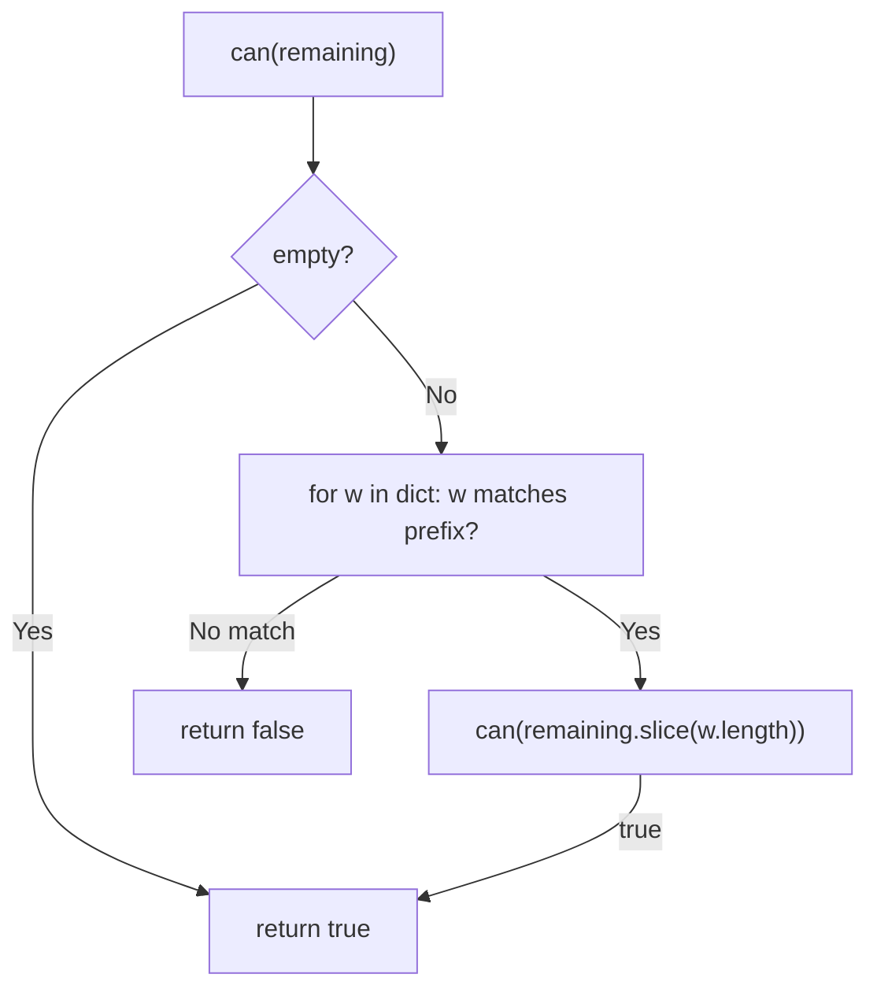
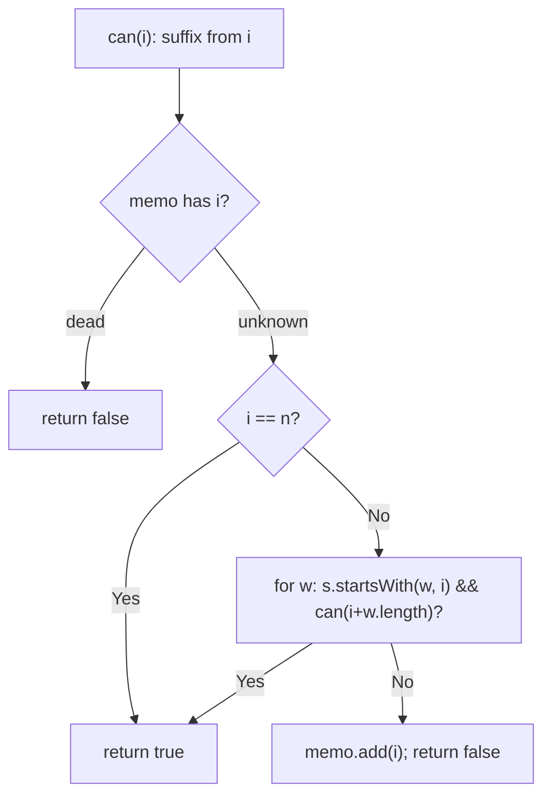

# 139. Word Break

- **LeetCode Link**: `https://leetcode.com/problems/word-break/`
- **Difficulty**: Medium
- **Pattern Category**: 1D DP / Prefix Reachability
- **Prerequisite Primer**: `00-foundations/03-core-algorithmic-patterns.md`

---

## 1. Problem Overview & Edge Case Matrix

### Problem Statement
Given a string `s` and a dictionary of strings `wordDict`, return `true` if `s` can be segmented into a space-separated sequence of one or more dictionary words. The same word may be reused multiple times. Note that dictionary words may overlap confusingly (e.g. `catsandog` is NOT breakable despite tempting prefixes).

```
Example 1:
Input: s = "leetcode", wordDict = ["leet","code"]
Output: true
Explanation: "leet code".

Example 2:
Input: s = "applepenapple", wordDict = ["apple","pen"]
Output: true
Explanation: "apple pen apple" (reuse allowed).

Example 3:
Input: s = "catsandog", wordDict = ["cats","dog","sand","and","cat"]
Output: false
```

### Visual Problem Representation
```
"leetcode":  dp[0]=T -> "leet" ends at 4 -> dp[4]=T -> "code" ends at 8 -> dp[8]=T
positions:   0 1 2 3 4 5 6 7 8
dp:          T F F F T F F F T   (reachable cut points)
```

### Upfront Edge Case Matrix
| Edge Case Category | Specific Input Scenario | Expected Behavior | Pitfall / Risk |
| :--- | :--- | :--- | :--- |
| Empty string | `s = ""` (defensive) | Return `true` (vacuous segmentation) | Base `dp[0]` handling |
| Single char | `s = "a"`, `dict = ["a"]` | Return `true` | Substring bounds on length 1 |
| Tempting prefix trap | `"catsandog"` | Return `false` | Greedy longest-match (`cats` then stuck) |
| Reuse required | `"applepenapple"` | Return `true` | Single-use word accounting |
| Exponential blowup | `"aaaa…ab"`, dict `["a","aa",…]` | Fast `false` | Unmemoized prefix explosion |

---

## 2. Level 1: Brute Force Approach

### Intuition & Visual Idea
Try every first-word prefix: for each dictionary word matching the current prefix, recurse on the remainder. Pure choice-tree, no memory — exponentially re-solving the same suffixes.



### Pseudocode
```text
FUNCTION wordBreakBruteForce(s, wordDict):
    DEFINE can(remaining):
        IF remaining EMPTY: RETURN true
        FOR w IN wordDict:
            IF remaining STARTS-WITH w AND can(remaining.SLICE(w.LENGTH)):
                RETURN true
        RETURN false
    RETURN can(s)
```

### Step-by-Step Dry Run (Visual Trace)
| Step | Iteration / Pointer ($i, j$) | Current Value | State / Sub-array | Action Taken |
| :--- | :--- | :--- | :--- | :--- |
| 0 | `can("leetcode")` | `"leet"` matches | Recurse `"code"` | Try first |
| 1 | `can("code")` | `"code"` matches | Recurse `""` | Base → `true` |
| 2 | `"catsandog"` | `"cats"` matches → `"andog"` | `"and"` matches → `"og"` | Dead: `"og"` matches nothing → backtrack all → `false` |

### Modern JavaScript Implementation
```javascript
/**
 * Level 1: Brute Force (prefix-choice recursion)
 * Time Complexity:  O(2^N) — same suffixes re-solved exponentially often
 * Space Complexity: O(N²) — substring copies plus O(N) stack
 */
function wordBreakBruteForce(s, wordDict) {
  function can(remaining) {
    if (remaining.length === 0) return true; // fully consumed: valid split
    for (const w of wordDict) {
      // Prefix match + recursion on the rest (slice copies each level).
      if (remaining.startsWith(w) && can(remaining.slice(w.length))) return true;
    }
    return false;
  }
  return can(s);
}
```

### Complexity Breakdown
- **Time Complexity**: $O(2^N)$ — suffixes re-solved per path; adversarial `"aaaa…ab"` explodes.
- **Space Complexity**: $O(N^2)$ — slice copies at every level plus stack.

---

## 3. Level 2: Optimized Approach

### Intuition & Visual Bottleneck Elimination
Memoize suffix results (or equivalently, index-based with a memo set of dead positions): each suffix solved once. Same recursion, $O(N·M)$ total — the overlapping-subproblems fix.



### Pseudocode
```text
FUNCTION wordBreakMemo(s, wordDict):
    dead = EMPTY SET   // indices proven unsegmentable
    DEFINE can(i):
        IF i == s.LENGTH: RETURN true
        IF dead HAS i: RETURN false
        FOR w IN wordDict:
            IF s.STARTS-WITH(w, i) AND can(i + w.LENGTH): RETURN true
        dead.ADD(i)
        RETURN false
    RETURN can(0)
```

### Step-by-Step Dry Run (Visual Trace)
| Step | Pointers / Window | Hash Map / Auxiliary State | Decision Logic | Output Accumulator |
| :--- | :--- | :--- | :--- | :--- |
| 0 | `can(0)` on `"catsandog"` | try `"cats"` → `can(4)` | Recurse | — |
| 1 | `can(4)` (`"andog"`) | try `"and"` → `can(7)` | Recurse | — |
| 2 | `can(7)` (`"og"`) | no word matches | `dead = {7}` | Return `false` |
| 3 | unwind | `can(4)`: try `"cat"`? no (`"and"` at 4) | All fail | `dead = {7,4}`, … → `false` |

### Modern JavaScript Implementation
```javascript
/**
 * Level 2: Optimized (index memoization of dead suffixes)
 * Time Complexity:  O(N·M·L) — N indices × M words × L compare
 * Space Complexity: O(N) — dead set plus call stack (no slicing: indices!)
 */
function wordBreakMemo(s, wordDict) {
  const dead = new Set(); // suffix indices proven unsegmentable
  function can(i) {
    if (i === s.length) return true; // consumed everything: valid split
    if (dead.has(i)) return false; // solved dead before: free lookup
    for (const w of wordDict) {
      // startsWith with POSITION arg: no substring allocation.
      if (s.startsWith(w, i) && can(i + w.length)) return true;
    }
    dead.add(i); // all options failed: remember
    return false;
  }
  return can(0);
}
```

### Complexity Breakdown
- **Time Complexity**: $O(N·M·L)$ — each index solved once against each word.
- **Space Complexity**: $O(N)$ — dead set plus stack; no string copies.

---

## 4. Level 3: Most Optimal / Canonical Approach

### Intuition & Mathematical / Invariant Proof
Bottom-up reachability over cut positions: `dp[j]` is true iff prefix `s[0..j)` segments. For each reachable `i`, extend by every dictionary word matching at `i` (`startsWith(w, i)` → `dp[i+len] = true`). Invariant: when position $i$ is processed, `dp[i]$ is final (all ways to reach $i$ come from earlier positions, already processed). Answer `dp[n]$. Iterative, no stack, early exit when `dp[n]$ sets.

```
"leetcode": dp[0]=T. i=0: "leet" matches -> dp[4]=T. i=4: "code" -> dp[8]=T.
  answer dp[8] = T. ("catsandog": dp dies before n -> F.)
```

### Pseudocode
```text
FUNCTION wordBreak(s, wordDict):
    n = s.LENGTH
    dp = BOOLEAN ARRAY(n+1, false); dp[0] = true
    FOR i IN 0 .. n-1:
        IF NOT dp[i]: CONTINUE
        FOR w IN wordDict:
            IF s.STARTS-WITH(w, i): dp[i + w.LENGTH] = true
    RETURN dp[n]
```

### Step-by-Step Dry Run (Visual Trace)
| Step | Pointer $L$ | Pointer $R$ | Invariant Checked | In-Place State |
| :--- | :--- | :--- | :--- | :--- |
| 1 | `i = 0` | `dp[0] = T` | `"leet"` matches at 0 | `dp[4] = T` |
| 2 | `i = 1,2,3` | `dp = F` | Unreachable: skipped | No work |
| 3 | `i = 4` | `dp[4] = T` | `"code"` matches at 4 | `dp[8] = T` |
| 4 | end | `dp[8]` | — | Return `true` |

### Modern JavaScript Implementation
```javascript
/**
 * Level 3: Most Optimal / Canonical (iterative cut-position DP)
 * Time Complexity:  O(N·M·L) — same bound, no recursion overhead
 * Space Complexity: O(N) — dp array; no stack, no sets
 */
function wordBreak(s, wordDict) {
  const n = s.length;
  const dp = new Array(n + 1).fill(false);
  dp[0] = true; // empty prefix segments vacuously: every path starts here
  for (let i = 0; i < n; i++) {
    if (!dp[i]) continue; // unreachable cut: nothing extends from here
    for (const w of wordDict) {
      // Positional startsWith: zero-allocation prefix test.
      if (s.startsWith(w, i)) dp[i + w.length] = true;
    }
    if (dp[n]) return true; // early exit: full segmentation already proven
  }
  return dp[n];
}
```

### Complexity Breakdown
- **Time Complexity**: $O(N·M·L)$ — optimal for this formulation; unreachable positions skipped.
- **Space Complexity**: $O(N)$ — boolean array; the minimal state (one bit per cut).

---

## 5. JavaScript-Specific Gotchas & V8 Optimizations
- **GC Pressure**: Avoid allocating objects inside tight loops ($O(N)$ closures). Level 1's per-level `slice` copies are the pressure removed — Levels 2–3 use index arithmetic and positional `startsWith` (no substring allocation).
- **Type Coercion / Sorting**: `String.prototype.startsWith(search, position)` — the rarely-used second arg is the whole optimization; `s.slice(i).startsWith(w)` reintroduces the copying Level 1 paid. `dp` as `boolean[]` (not truthy/falsy mix) keeps the invariant readable.
- **Index Bounds**: `dp` has length `n + 1` (cut AFTER the last char included) — `dp[n]` is the answer, and `i + w.length ≤ n` is guaranteed when `startsWith` matches (no overrun possible). Greedy longest-match is WRONG here (`cats` trap) — DP explores all splits, greedily committing to none.

---

## 6. Real-World MAANG Interview Follow-Ups & Extensions

### Follow-Up 1: Return all segmentations (Word Break II)
- **Scenario**: Enumerate every valid split (LeetCode 140, Hard).
- **Solution Strategy**: Level 3's `dp` as a feasibility oracle + backtracking that only follows `dp`-reachable cuts (prunes dead branches exactly); memoize suffix sentence lists.
- **JS Code / Implementation Pattern**:
```javascript
function wordBreakII(s, wordDict) {
  const memo = new Map();
  function sentences(i) {
    if (i === s.length) return [''];
    if (memo.has(i)) return memo.get(i);
    const out = [];
    for (const w of wordDict) {
      if (s.startsWith(w, i)) {
        for (const tail of sentences(i + w.length)) {
          out.push(tail ? w + ' ' + tail : w);
        }
      }
    }
    memo.set(i, out);
    return out;
  }
  return sentences(0);
}
```

### Follow-Up 2: $10^9$-character stream with online segmentation
- **Scenario**: Characters stream; report segmentability of every prefix live.
- **Solution Strategy**: Trie of the dictionary + rolling `dp` window: extend reachable cuts as chars arrive, evicting cuts older than max-word-length (bounded memory $O(L_{max})$). Each char costs $O(L_{max})$ trie steps.
- **JS Code / Implementation Pattern**:
```javascript
async function streamWordBreak(charStream, trie, maxLen) {
  let reachable = new Set([0]);
  let pos = 0;
  for await (const ch of charStream) {
    pos++;
    reachable = extendCuts(reachable, trie, ch, pos, maxLen);
    yield { pos, segmentable: reachable.has(pos) };
  }
}
```

### Follow-Up 3: Weighted segmentation (best split, not just feasible)
- **Scenario & In-Depth Solution**: Words have costs; find the min-cost segmentation (or most probable — NLP decoding). Same DAG as Level 3 with min-plus relaxation (`dp[j] = min(dp[j], dp[i] + cost(w))`) — Viterbi over the cut graph, $O(N·M)$ time.
```javascript
function minCostSegmentation(s, wordCost) {
  const dp = new Array(s.length + 1).fill(Infinity);
  dp[0] = 0;
  for (let i = 0; i < s.length; i++) {
    if (dp[i] === Infinity) continue;
    for (const [w, c] of wordCost) {
      if (s.startsWith(w, i)) dp[i + w.length] = Math.min(dp[i + w.length], dp[i] + c);
    }
  }
  return dp[s.length];
}
```
