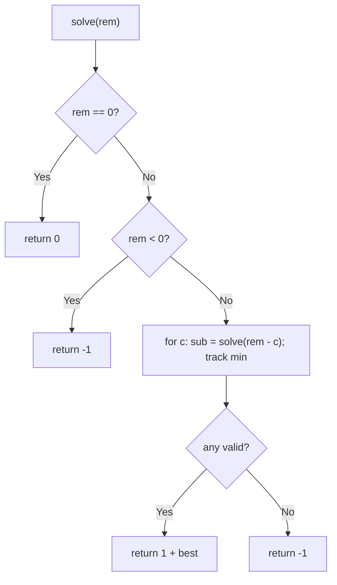
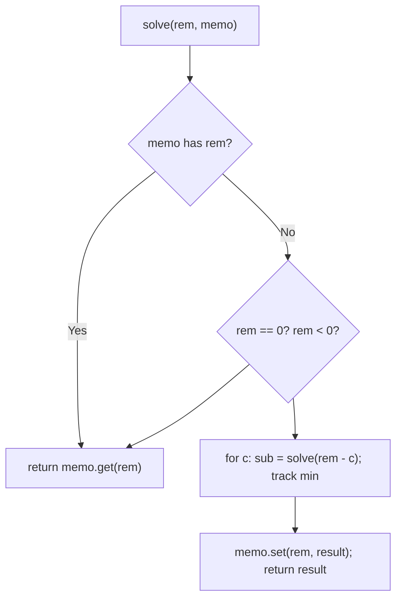

# 322. Coin Change

- **LeetCode Link**: `https://leetcode.com/problems/coin-change/`
- **Difficulty**: Medium
- **Pattern Category**: 1D DP / Unbounded Min-Cost
- **Prerequisite Primer**: `00-foundations/03-core-algorithmic-patterns.md`

---

## 1. Problem Overview & Edge Case Matrix

### Problem Statement
You are given coins of different denominations and a total amount of money `amount`. Write a function to compute the fewest number of coins needed to make up that amount. If that amount cannot be made up by any combination of the coins, return `-1`. You may assume an infinite number of each kind of coin.

```
Example 1:
Input: coins = [1,2,5], amount = 11
Output: 3
Explanation: 11 = 5 + 5 + 1.

Example 2:
Input: coins = [2], amount = 3
Output: -1

Example 3:
Input: coins = [1], amount = 0
Output: 0
```

### Visual Problem Representation
```
amount 11, coins [1,2,5]:   dp[x] = 1 + min(dp[x-1], dp[x-2], dp[x-5])
  dp: 0,1,1,2,2,1,2,2,3,3,2,3  -> answer dp[11] = 3
```

### Upfront Edge Case Matrix
| Edge Case Category | Specific Input Scenario | Expected Behavior | Pitfall / Risk |
| :--- | :--- | :--- | :--- |
| Zero amount | `amount = 0` | Return `0` (no coins) | Loop that needs ≥1 |
| Impossible | `[2]`, `3` | Return `-1` | Returning `Infinity` |
| Single coin exact | `[5]`, `5` | Return `1` | Off-by-one in base |
| Greedy trap | `[1,3,4]`, `6` → `3+3` (2), not `4+1+1` | Optimal `2` | Greedy largest-first (gives 3) |
| Large amount | `amount = 10⁴` | Fast tabulation | Exponential recursion |

---

## 2. Level 1: Brute Force Approach

### Intuition & Visual Idea
Try every first coin recursively: `solve(amount) = 1 + min(solve(amount - c))` over coins, with `-1` for dead ends. No memory — exponential re-solving of the same remainders.



### Pseudocode
```text
FUNCTION coinChangeBruteForce(coins, amount):
    IF amount == 0: RETURN 0
    IF amount < 0: RETURN -1
    best = Infinity
    FOR c IN coins:
        sub = coinChangeBruteForce(coins, amount - c)
        IF sub != -1: best = MIN(best, sub + 1)
    RETURN best == Infinity ? -1 : best
```

### Step-by-Step Dry Run (Visual Trace)
| Step | Iteration / Pointer ($i, j$) | Current Value | State / Sub-array | Action Taken |
| :--- | :--- | :--- | :--- | :--- |
| 0 | `solve(11)` | try `1, 2, 5` | Three subtrees | Branch |
| 1 | `solve(10)` subtree | re-solves `solve(9)…` | Overlap with `solve(9)` via `5` | Recompute |
| 2 | leaves | `0` or negative | `-1` prunes dead | Unwind mins |
| 3 | total | min chain `5+5+1` | — | Return `3` |

### Modern JavaScript Implementation
```javascript
/**
 * Level 1: Brute Force (choice recursion, no memory)
 * Time Complexity:  O(C^amount) — exponential remainder re-solving
 * Space Complexity: O(amount) — call stack depth
 */
function coinChangeBruteForce(coins, amount) {
  if (amount === 0) return 0; // exact change: zero more coins
  if (amount < 0) return -1; // overshoot: dead branch
  let best = Infinity;
  for (const c of coins) {
    const sub = coinChangeBruteForce(coins, amount - c);
    if (sub !== -1 && sub + 1 < best) best = sub + 1;
  }
  return best === Infinity ? -1 : best; // -1 propagates impossibility
}
```

### Complexity Breakdown
- **Time Complexity**: $O(C^{\text{amount}})$ — exponential; `amount = 30` already crawls.
- **Space Complexity**: $O(\text{amount})$ — stack depth; time is the catastrophe.

---

## 3. Level 2: Optimized Approach

### Intuition & Visual Bottleneck Elimination
Memoize remainders: each `solve(rem)` computed once. Same recursion, $O(\text{amount}·C)$ time — the overlapping-subproblems fix, identical in spirit to Climbing Stairs' Level 2.



### Pseudocode
```text
FUNCTION coinChangeMemo(coins, amount, memo = MAP()):
    IF amount == 0: RETURN 0
    IF amount < 0: RETURN -1
    IF memo HAS amount: RETURN memo.GET(amount)
    best = Infinity
    FOR c IN coins:
        sub = coinChangeMemo(coins, amount - c, memo)
        IF sub != -1: best = MIN(best, sub + 1)
    result = (best == Infinity ? -1 : best)
    memo.SET(amount, result)
    RETURN result
```

### Step-by-Step Dry Run (Visual Trace)
| Step | Pointers / Window | Hash Map / Auxiliary State | Decision Logic | Output Accumulator |
| :--- | :--- | :--- | :--- | :--- |
| 0 | `solve(11)` | miss | Needs `solve(10,9,6)` | Recurse |
| 1 | `solve(10)` → … | each remainder solved once | Memo fills downward | — |
| 2 | `solve(9)` via second path | HIT | No recompute | Reuse |
| 3 | unwind | mins propagate | — | Return `3` |

### Modern JavaScript Implementation
```javascript
/**
 * Level 2: Optimized (top-down remainder memoization)
 * Time Complexity:  O(amount·C) — each remainder solved once
 * Space Complexity: O(amount) — memo map plus call stack
 */
function coinChangeMemo(coins, amount, memo = new Map()) {
  if (amount === 0) return 0;
  if (amount < 0) return -1;
  if (memo.has(amount)) return memo.get(amount); // solved before: free
  let best = Infinity;
  for (const c of coins) {
    const sub = coinChangeMemo(coins, amount - c, memo);
    if (sub !== -1 && sub + 1 < best) best = sub + 1;
  }
  // Cache BOTH outcomes: -1 (dead) is as valuable as a count.
  const result = best === Infinity ? -1 : best;
  memo.set(amount, result);
  return result;
}
```

### Complexity Breakdown
- **Time Complexity**: $O(\text{amount}·C)$ — one solve per remainder, $C$ coins each.
- **Space Complexity**: $O(\text{amount})$ — memo plus stack.

---

## 4. Level 3: Most Optimal / Canonical Approach

### Intuition & Mathematical / Invariant Proof
Bottom-up tabulation: `dp[x] = 1 + min(dp[x-c])` for all coins, `dp[0] = 0`, unreachable stays `Infinity`. Invariant: when computing `dp[x]$, all `dp[<x]$ are final (transitions only look backward) — so one forward pass suffices. Iterative, no stack, $O(\text{amount})$ space. This is the canonical interview answer.

```
coins [1,2,5], dp[0]=0:
  x=1: min(dp[0]) → 1; x=2: min(dp[1],dp[0]) → 1; ... x=11: min(dp[10],dp[9],dp[6])+1 = 3
```

### Pseudocode
```text
FUNCTION coinChange(coins, amount):
    dp = ARRAY(amount+1, Infinity); dp[0] = 0
    FOR x IN 1 .. amount:
        FOR c IN coins:
            IF c <= x AND dp[x-c] + 1 < dp[x]: dp[x] = dp[x-c] + 1
    RETURN dp[amount] == Infinity ? -1 : dp[amount]
```

### Step-by-Step Dry Run (Visual Trace)
| Step | Pointer $L$ | Pointer $R$ | Invariant Checked | In-Place State |
| :--- | :--- | :--- | :--- | :--- |
| 1 | `x = 1..5` | fill | `dp = [0,1,1,2,2,1]` | Forward fill |
| 2 | `x = 6..10` | fill | `dp[6..10] = [2,2,3,3,2]` | `dp[10] = 2` (`5+5`) |
| 3 | `x = 11` | `min(dp[10],dp[9],dp[6]) + 1` | `min(2,3,2) + 1 = 3` | Return `3` |

### Modern JavaScript Implementation
```javascript
/**
 * Level 3: Most Optimal / Canonical (bottom-up tabulation)
 * Time Complexity:  O(amount·C) — one pass, optimal for this formulation
 * Space Complexity: O(amount) — dp array; no stack
 */
function coinChange(coins, amount) {
  // Infinity = unreachable; dp[0] = 0 seeds every transition.
  const dp = new Array(amount + 1).fill(Infinity);
  dp[0] = 0;
  for (let x = 1; x <= amount; x++) {
    for (const c of coins) {
      // Backward-only transitions: dp[x-c] is already final.
      if (c <= x && dp[x - c] + 1 < dp[x]) dp[x] = dp[x - c] + 1;
    }
  }
  return dp[amount] === Infinity ? -1 : dp[amount];
}
```

### Complexity Breakdown
- **Time Complexity**: $O(\text{amount}·C)$ — optimal for single-query exact change.
- **Space Complexity**: $O(\text{amount})$ — one array; the minimal state (one number per remainder).

---

## 5. JavaScript-Specific Gotchas & V8 Optimizations
- **GC Pressure**: Avoid allocating objects inside tight loops ($O(N)$ closures). Level 1's exponential frame churn is the pressure removed — Level 3's loop allocates nothing per cell.
- **Type Coercion / Sorting**: `dp[x-c] + 1` with `Infinity` stays `Infinity` (never NaN) — the unreachable sentinel composes arithmetically, which is exactly why `Infinity` (not `-1`) is the right table fill. Final conversion to `-1` happens ONCE at return.
- **Index Bounds**: `c <= x` guard precedes `dp[x-c]` access — without it, negative indices read `undefined`, and `undefined + 1` is `NaN`, which poisons `Math.min`-style comparisons silently (`NaN < best` is always false — the table would freeze at `Infinity`).

---

## 6. Real-World MAANG Interview Follow-Ups & Extensions

### Follow-Up 1: Count ways (Coin Change II — combinations, not minimum)
- **Scenario**: Return the NUMBER of combinations (LeetCode 518).
- **Solution Strategy**: Swap loop order (coins outer, amounts inner) with `dp[x] += dp[x-c]` — outer-coins counts combinations (order-free); inner-coins would count permutations. The loop order IS the semantics.
- **JS Code / Implementation Pattern**:
```javascript
function changeCombinations(amount, coins) {
  const dp = new Array(amount + 1).fill(0);
  dp[0] = 1;
  for (const c of coins) {
    for (let x = c; x <= amount; x++) dp[x] += dp[x - c];
  }
  return dp[amount];
}
```

### Follow-Up 2: Fewest coins with limited supply (bounded knapsack)
- **Scenario**: Each denomination has a finite count.
- **Solution Strategy**: Binary-split counts into $O(\log k)$ 0/1 items (or monotone-queue optimization) — then 0/1-knapsack DP over the expanded set.
- **JS Code / Implementation Pattern**:
```javascript
function boundedCoinChange(coins, counts, amount) {
  const items = [];
  for (let i = 0; i < coins.length; i++) {
    for (let k = 1; counts[i] > 0; k *= 2) {
      const take = Math.min(k, counts[i]);
      items.push([coins[i] * take, take]);
      counts[i] -= take;
    }
  }
  return zeroOneKnapsack(items, amount);
}
```

### Follow-Up 3: $10^9$ amount with canonical coin systems
- **Scenario & In-Depth Solution**: Canonical systems (each coin divides the next, like US coins without nickels... precisely: canonical = greedy-optimal) admit greedy $O(C)$ exact answers — no DP table at all. Detect canonicity once (or trust the currency spec), then divide-and-take per denomination.
```javascript
function greedyCanonical(coinsDesc, amount) {
  let count = 0;
  for (const c of coinsDesc) {
    count += Math.floor(amount / c);
    amount %= c;
  }
  return count;
}
```
