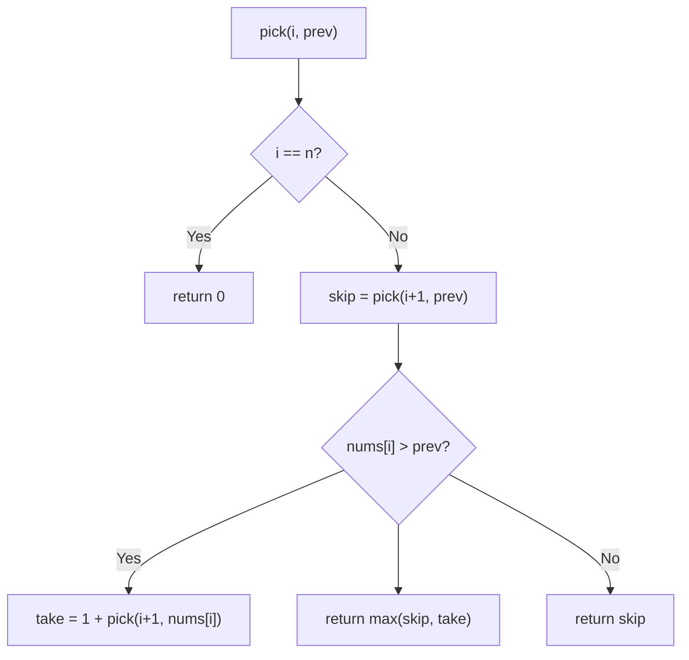
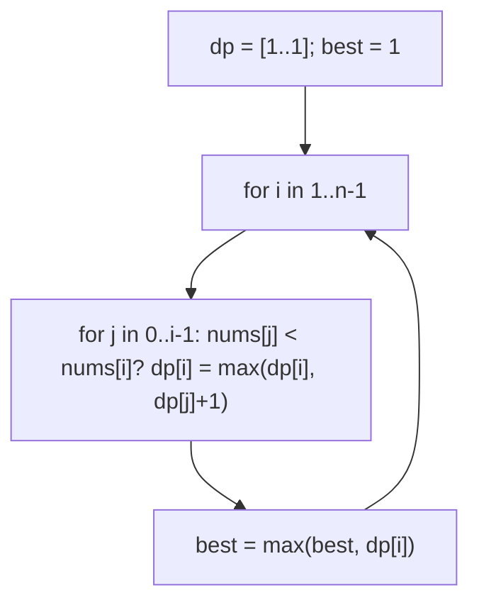
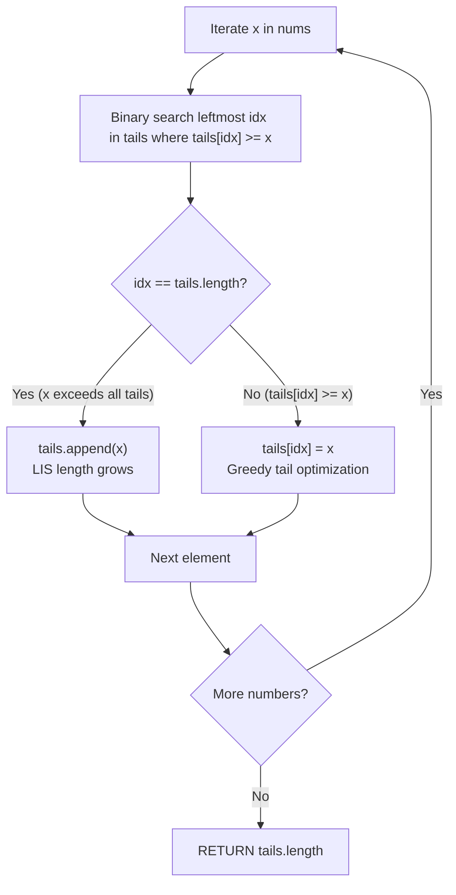

# 300. Longest Increasing Subsequence

- **LeetCode Link**: `https://leetcode.com/problems/longest-increasing-subsequence/`
- **Difficulty**: Medium
- **Pattern Category**: 1D DP / Patience Sorting
- **Prerequisite Primer**: `00-foundations/03-core-algorithmic-patterns.md`

---

## 1. Problem Overview & Edge Case Matrix

### Problem Statement
Given an integer array `nums`, return the length of the longest strictly increasing subsequence. A subsequence is derived by deleting some or no elements without changing the order of the remaining elements.

```
Example 1:
Input: nums = [10,9,2,5,3,7,101,18]
Output: 4
Explanation: [2,3,7,101] (also [2,3,7,18], [2,5,7,101]...).

Example 2:
Input: nums = [0,1,0,3,2,3]
Output: 4
Explanation: [0,1,2,3].

Example 3:
Input: nums = [7,7,7,7,7,7,7]
Output: 1
Explanation: Strictly increasing — equals don't extend.
```

### Visual Problem Representation
```
[10,9,2,5,3,7,101,18]:  tails pile after processing:
  pile tops: [2, 3, 7, 18]  (4 piles = LIS length 4)
```

### Upfront Edge Case Matrix
| Edge Case Category | Specific Input Scenario | Expected Behavior | Pitfall / Risk |
| :--- | :--- | :--- | :--- |
| Empty (defensive) | `nums = []` | Return `0` | `dp[0]` access / `tails[0]` |
| Single Element | `[5]` | Return `1` | Loop needing ≥2 elements |
| All equal | `[7×7]` | Return `1` (strict!) | `<=` lower-bound admitting equals |
| Strictly decreasing | `[5,4,3,2,1]` | Return `1` | Pile-per-element still correct |
| Strictly increasing | `[1,2,3,4]` | Return `4` | Bound update on full extension |

---

## 2. Level 1: Brute Force Approach

### Intuition & Visual Idea
Pick/skip recursion with a `prev` value: at each index, skip it, or take it if it exceeds everything taken. $O(2^N)$ decision tree — the selection-DP baseline.



### Pseudocode
```text
FUNCTION lengthOfLISBruteForce(nums):
    DEFINE pick(i, prev):
        IF i == n: RETURN 0
        skip = pick(i + 1, prev)
        take = 0
        IF prev NULL OR nums[i] > prev: take = 1 + pick(i + 1, nums[i])
        RETURN MAX(skip, take)
    RETURN pick(0, NULL)
```

### Step-by-Step Dry Run (Visual Trace)
| Step | Iteration / Pointer ($i, j$) | Current Value | State / Sub-array | Action Taken |
| :--- | :--- | :--- | :--- | :--- |
| 0 | `pick(0, null)` on `[0,1,0,3,2,3]` | take `0` or skip | Branch both | Recurse |
| 1 | take-branch | `pick(1, 0)` → take `1`… | Builds `[0,1,…]` | Deep subtree |
| 2 | skip-branch | `pick(1, null)` | Re-solves overlapping suffixes | Exponential overlap |
| 3 | total | max over tree | — | Return `4` |

### Modern JavaScript Implementation
```javascript
/**
 * Level 1: Brute Force (pick/skip recursion with prev value)
 * Time Complexity:  O(2^N) — binary decision tree over indices
 * Space Complexity: O(N) — call stack depth
 */
function lengthOfLISBruteForce(nums) {
  function pick(i, prev) {
    if (i === nums.length) return 0; // exhausted: no more length to add
    const skip = pick(i + 1, prev); // case 1: ignore nums[i]
    let take = 0;
    // Strictly greater only: equals can never extend (spec: strictly).
    if (prev === null || nums[i] > prev) take = 1 + pick(i + 1, nums[i]);
    return Math.max(skip, take);
  }
  return pick(0, null);
}
```

### Complexity Breakdown
- **Time Complexity**: $O(2^N)$ — every subset implicitly considered.
- **Space Complexity**: $O(N)$ — stack depth; time is the catastrophe.

---

## 3. Level 2: Optimized Approach

### Intuition & Visual Bottleneck Elimination
$O(N^2)$ tabulation: `dp[i]` = LIS ending exactly at `i` = $1 + \max(dp[j])$ over $j < i$ with `nums[j] < nums[i]$. Answer = max over `dp`. Polynomial, transparent, no binary search — the standard interview answer when $O(N \log N)$ isn't demanded.



### Pseudocode
```text
FUNCTION lengthOfLISDP(nums):
    IF nums EMPTY: RETURN 0
    dp = ARRAY(n, 1); best = 1
    FOR i IN 1 .. n-1:
        FOR j IN 0 .. i-1:
            IF nums[j] < nums[i]: dp[i] = MAX(dp[i], dp[j] + 1)
        best = MAX(best, dp[i])
    RETURN best
```

### Step-by-Step Dry Run (Visual Trace)
| Step | Pointers / Window | Hash Map / Auxiliary State | Decision Logic | Output Accumulator |
| :--- | :--- | :--- | :--- | :--- |
| 0 | `i = 0` | `dp = [1,…]` | Singleton subsequence | `best = 1` |
| 1 | `i = 3` (val `3`) | predecessors `0,1,0` | `dp[3] = max(1,2,1)+1 = 3`? | Detail below |
| 2 | full table | `dp = [1,2,1,3,3,4]` | — | `best = 4` |

Row check for `[0,1,0,3,2,3]`: `dp[0]=1`; `i=1` (1): `0<1` → `dp=2`; `i=2` (0): no smaller before → `1`; `i=3` (3): predecessors `0,1,0` all `< 3` → `max(1,2,1)+1 = 3`; `i=4` (2): `0,1,0 < 2` → `max(1,2,1)+1 = 3`; `i=5` (3): `0,1,0,2 < 3` → `dp = max(1,2,1,3)+1 = 4`. ✓

### Modern JavaScript Implementation
```javascript
/**
 * Level 2: Optimized (O(N²) end-at-i tabulation)
 * Time Complexity:  O(N²) — all pairs compared
 * Space Complexity: O(N) — dp array
 */
function lengthOfLISDP(nums) {
  if (nums.length === 0) return 0;
  // dp[i] = LIS length of a subsequence ENDING exactly at i (≥ 1 always).
  const dp = new Array(nums.length).fill(1);
  let best = 1;
  for (let i = 1; i < nums.length; i++) {
    for (let j = 0; j < i; j++) {
      // Strict <: equals extend nothing (spec: strictly increasing).
      if (nums[j] < nums[i] && dp[j] + 1 > dp[i]) dp[i] = dp[j] + 1;
    }
    if (dp[i] > best) best = dp[i];
  }
  return best;
}
```

### Complexity Breakdown
- **Time Complexity**: $O(N^2)$ — all pairs; the follow-up demands better.
- **Space Complexity**: $O(N)$ — `dp` array; time is the remaining gap.

---

## 4. Level 3: Most Optimal / Canonical Approach

### Intuition & Mathematical / Invariant Proof
Patience sorting: maintain `tails[l]` = smallest possible tail of an increasing subsequence of length $l+1$. For each value, binary-search the first `tails[i] >= v` (lower bound) and overwrite it (or append if all smaller). Invariant: `tails` stays strictly increasing, and its length always equals the LIS length SO FAR — overwriting preserves correctness because a smaller tail at length $l+1$ dominates (every extension of the old tail works for the new one). $O(N \log N)$ time, $O(N)$ space. Note: `tails` is NOT the subsequence — only its length is meaningful.

```
[0,1,0,3,2,3]: [0] -> [0,1] -> [0,1] (0 overwrites... lower_bound(0)=0 -> tails[0]=0, no change)
  -> [0,1,3] -> [0,1,2] (2 overwrites 3) -> [0,1,2,3]: length 4 ✓
```

### Pseudocode
```text
FUNCTION lengthOfLIS(nums):
    tails = []   // tails[l] = min tail of an inc. subseq of length l+1
    FOR v IN nums:
        pos = LOWER-BOUND(tails, v)   // first tails[i] >= v
        IF pos == tails.LENGTH: tails.PUSH(v)
        ELSE: tails[pos] = v          // dominate: smaller tail, same length
    RETURN tails.LENGTH
```

### Step-by-Step Dry Run (Visual Trace)
| Step | Pointer $L$ | Pointer $R$ | Invariant Checked | In-Place State |
| :--- | :--- | :--- | :--- | :--- |
| 1 | values `10, 9, 2` | each overwrites `tails[0]` | Smaller tail dominates | `tails = [2]` |
| 2 | value `5` | lower-bound → append | New max length | `tails = [2,5]` |
| 3 | value `3` | overwrites index 1 | `[2,3]` still length 2 | Length unchanged |
| 4 | `7` append, `101` append, `18` overwrite | — | `tails = [2,3,7,18]` | Return `4` |

### Modern JavaScript Implementation
```javascript
/**
 * Level 3: Most Optimal / Canonical (patience sorting + binary search)
 * Time Complexity:  O(N log N) — binary search per element
 * Space Complexity: O(N) — tails array (worst case: sorted input)
 */
function lengthOfLIS(nums) {
  // tails[l] = smallest tail of an increasing subsequence of length l + 1.
  const tails = [];
  for (const v of nums) {
    // Lower bound: first tails[i] >= v (strict < keeps equals from extending).
    let lo = 0;
    let hi = tails.length;
    while (lo < hi) {
      const mid = lo + ((hi - lo) >> 1);
      if (tails[mid] < v) lo = mid + 1;
      else hi = mid;
    }
    // Append (new longest) or overwrite (dominate at the same length).
    tails[lo] = v;
  }
  return tails.length; // length only: tails is NOT the subsequence itself
}
```

### Complexity Breakdown
- **Time Complexity**: $O(N \log N)$ — optimal for comparison-based LIS length.
- **Space Complexity**: $O(N)$ — `tails` (length = answer scale).

---

## 5. JavaScript-Specific Gotchas & V8 Optimizations
- **GC Pressure**: Avoid allocating objects inside tight loops ($O(N)$ closures). Level 1's exponential frame churn is the pressure removed — Levels 2–3 allocate one array total (`dp`/`tails`).
- **Type Coercion / Sorting**: Lower bound uses `tails[mid] < v` (strict) — `<=` would admit equals and overcount non-strict sequences. `tails[lo] = v` unifies append/overwrite (assignment past the end extends in JS — no separate push branch needed, though push reads clearer).
- **Index Bounds**: `tails` length IS the answer — but its CONTENTS are not an LIS (classic misread: `[2,3,7,18]` happens to be valid here, but overwritten tails routinely break contiguity of the real subsequence; reconstruct with parent pointers if the sequence itself is needed).

---

## 6. Real-World MAANG Interview Follow-Ups & Extensions

### Follow-Up 1: Return the subsequence + count of LIS
- **Scenario**: Reconstruct an actual LIS, or count how many achieve max length (LeetCode 673).
- **Solution Strategy**: Level 2's table + parent pointers (or counts array: `cnt[i] += cnt[j]` on ties, reset on strictly-better). Reconstruction walks parents from any max cell.
- **JS Code / Implementation Pattern**:
```javascript
function findNumberOfLIS(nums) {
  const n = nums.length;
  const len = new Array(n).fill(1);
  const cnt = new Array(n).fill(1);
  let best = 0, total = 0;
  for (let i = 0; i < n; i++) {
    for (let j = 0; j < i; j++) {
      if (nums[j] < nums[i]) {
        if (len[j] + 1 > len[i]) {
          len[i] = len[j] + 1;
          cnt[i] = cnt[j];
        } else if (len[j] + 1 === len[i]) {
          cnt[i] += cnt[j];
        }
      }
    }
    if (len[i] > best) {
      best = len[i];
      total = cnt[i];
    } else if (len[i] === best) {
      total += cnt[i];
    }
  }
  return total;
}
```

### Follow-Up 2: $10^9$-element stream with $O(K)$ memory (K = answer scale)
- **Scenario**: Values stream; only the `tails` array fits in RAM.
- **Solution Strategy**: Level 3 IS the streaming answer — `tails` updates online per value in $O(\log K)$; memory = answer length, never $N$. Emit length on demand.
- **JS Code / Implementation Pattern**:
```javascript
async function lisLengthStream(numberStream) {
  const tails = [];
  for await (const v of numberStream) {
    tails[lowerBound(tails, v)] = v;
  }
  return tails.length;
}
```

### Follow-Up 3: 2D dominance (Russian dolls / max chain of pairs)
- **Scenario & In-Depth Solution**: Longest chain of pairs $(a,b)$ with both coordinates increasing (LeetCode 354). Sort by first-asc/second-desc, then Level 3 on second coordinates — the sort tiebreak prevents same-first pairs from chaining. Reduction, not new code.
```javascript
function maxEnvelopes(pairs) {
  pairs.sort((a, b) => (a[0] - b[0]) || (b[1] - a[1]));
  return lengthOfLIS(pairs.map(([, y]) => y));
}
```

---

## 7. What LeetCode Discuss Says (Language-Independent)

Source: top-voted post by Mai Thanh Hiep —
`https://leetcode.com/problems/longest-increasing-subsequence/solutions/1326308/cpython-dp-binary-search-bit-segment-tre-wc3w/`
— 272.1K views.
Language-independent summary. No new JS here.

### A. Optimal way from Discuss (Patience Sorting / Greedy with Binary Search)

Track the minimum possible tail for every subsequence length using patience sorting and binary search:

1. **State Invariant:**
   - Maintain an array `tails` where `tails[k]` stores the smallest ending element among all valid increasing subsequences of length $k + 1$ found so far.
   - The array `tails` is strictly monotonic increasing at all times.
2. **Binary Search Replacement Protocol:**
   - For each number $x$ in `nums`:
     - Binary search `tails` for the leftmost index `idx` where `tails[idx] >= x` (`lower_bound`).
     - **Extension:** If no such element exists (`idx == tails.length`), append $x$ to `tails`, extending the maximum LIS length by 1.
     - **Greedy Optimization:** If `tails[idx] >= x`, set `tails[idx] = x`. This lowers the tail barrier for subsequences of length `idx + 1`, maximizing opportunity for subsequent elements to extend it.
3. **Execution:** Return `tails.length`.

```text
FUNCTION lengthOfLIS(nums):
    IF length(nums) == 0:
        RETURN 0

    tails = EMPTY_ARRAY

    FOR EACH x IN nums:
        lo = 0
        hi = length(tails)

        WHILE lo < hi:
            mid = lo + INT_DIV(hi - lo, 2)
            IF tails[mid] < x:
                lo = mid + 1
            ELSE:
                hi = mid

        IF lo == length(tails):
            APPEND x TO tails
        ELSE:
            tails[lo] = x

    RETURN length(tails)
```

- Time: O(N * log N) — binary search over `tails` (length at most $N$) for each of the $N$ elements.
- Space: O(N) auxiliary space for the `tails` buffer (can be reduced to O(1) by overwriting the prefix of `nums`).



### B. Dry run on LeetCode Example 1 (`nums = [10, 9, 2, 5, 3, 7, 101, 18]`)

- $x = 10 \implies tails = [10]$.
- $x = 9 \implies tails = [9]$.
- $x = 2 \implies tails = [2]$.
- $x = 5 \implies tails = [2, 5]$.
- $x = 3 \implies 3 < 5$, replace index 1: $tails = [2, 3]$.
- $x = 7 \implies 7 > 3$, append: $tails = [2, 3, 7]$.
- $x = 101 \implies append$: $tails = [2, 3, 7, 101]$.
- $x = 18 \implies 18 < 101$, replace index 3: $tails = [2, 3, 7, 18]$.
- Return `tails.length = 4`.

Final result: `4` (e.g. sequence `[2, 3, 7, 18]`).

### C. Why Patience Sorting Beats $O(N^2)$ Tabulation

- Nested loop dynamic programming tests every preceding element $j < i$, taking $O(N^2)$ time.
- Because `tails` remains strictly sorted, finding the optimal predecessor takes $O(\log N)$ via binary search, reducing runtime by orders of magnitude on large inputs.

### D. Pitfalls from comments

- **`tails` is NOT the LIS Itself:** At the end of the algorithm, `tails` stores optimal boundary values for each length, not necessarily a valid chronological sequence. Its length is exact, but reconstructing the elements requires parent backpointers.
- **Strictly Increasing vs Non-Decreasing:** To find strictly increasing subsequences, binary search for $\ge x$ (`lower_bound`). For non-decreasing subsequences, search for $> x$ (`upper_bound`).

### E. Companies

- Discuss post itself names none.
  Companies tab on LeetCode is premium-locked.
- External source:
  `https://github.com/liquidslr/leetcode-company-wise-problems`
  (LeetCode company tags, updated June 2025).
- All-time (28): Accenture, Agoda, Amazon, Atlassian, Bloomberg, ByteDance, Flexport, Goldman Sachs, Google, Huawei, Infosys, Intuit, Meta, Microsoft, Morgan Stanley, Nvidia, Oracle, PayPal, Revolut, Salesforce, Samsung, Splunk, Squarepoint Capital, tcs, TikTok, Visa, Walmart Labs, Yandex.
- Recent: 30 days — None.
- Recent: 3 months — Amazon, Bloomberg, Google, Microsoft, Revolut.
