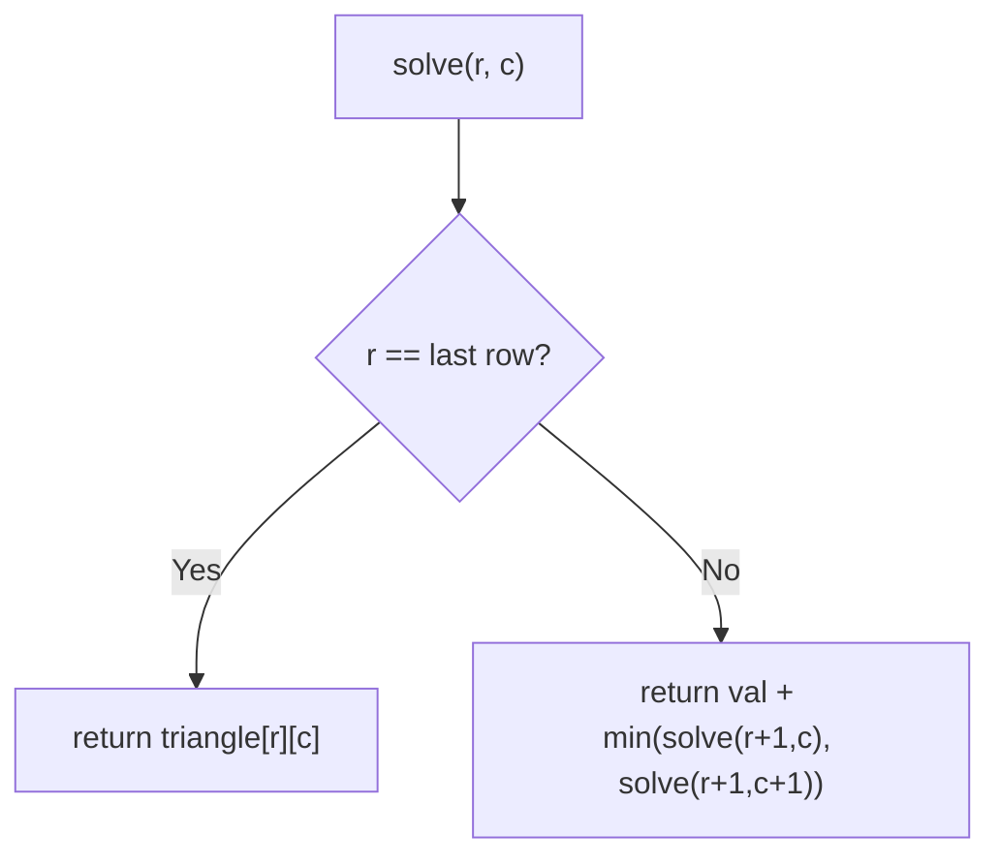
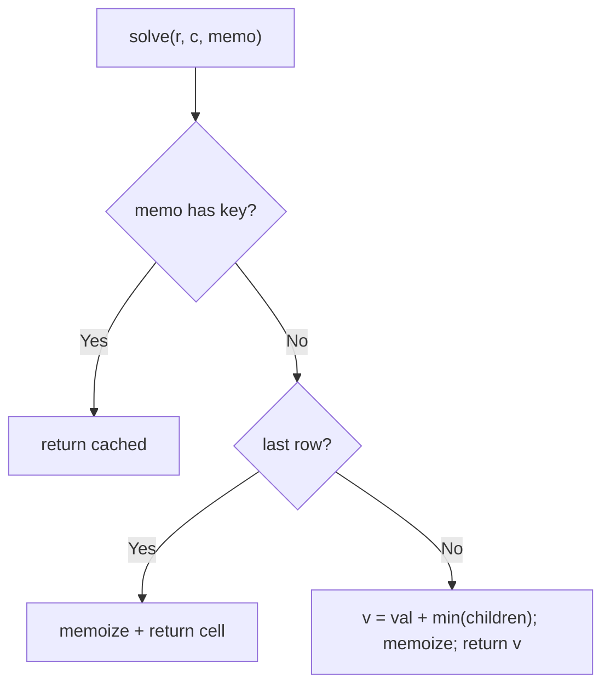

# 120. Triangle

- **LeetCode Link**: `https://leetcode.com/problems/triangle/`
- **Difficulty**: Medium
- **Pattern Category**: Multidimensional DP / Bottom-Up Collapse
- **Prerequisite Primer**: `00-foundations/03-core-algorithmic-patterns.md`

---

## 1. Problem Overview & Edge Case Matrix

### Problem Statement
Given a `triangle` array, return the minimum path sum from top to bottom. For each step, you may move to an adjacent number of the row below — from index `i` you may move to index `i` or `i + 1` on the next row.

```
Example 1:
Input: triangle = [[2],[3,4],[6,5,7],[4,1,8,3]]
Output: 11
Explanation: 2 + 3 + 5 + 1 = 11.

Example 2:
Input: triangle = [[-10]]
Output: -10
```

### Visual Problem Representation
```
      2
     3 4
    6 5 7         best path: 2 -> 3 -> 5 -> 1 = 11
   4 1 8 3
```

### Upfront Edge Case Matrix
| Edge Case Category | Specific Input Scenario | Expected Behavior | Pitfall / Risk |
| :--- | :--- | :--- | :--- |
| Single row | `[[-10]]` | Return `-10` | Loop needing ≥2 rows |
| All negative | Negative throughout | Least-negative path | `0`-seeded DP (use real values) |
| Greedy trap | Local min off-path | Global optimum | Greedy next-row pick |
| Large triangle | 200 rows | Fast bottom-up | Exponential recursion |
| Row aliasing | Mutating input rows | Allowed (or copy) | Caller reuse after in-place collapse |

---

## 2. Level 1: Brute Force Approach

### Intuition & Visual Idea
Recurse both moves from every cell: `solve(r, c) = triangle[r][c] + min(solve(r+1, c), solve(r+1, c+1))`. No memory — $O(2^N)$ re-solving of shared sub-triangles.



### Pseudocode
```text
FUNCTION minimumTotalBruteForce(triangle):
    DEFINE solve(r, c):
        IF r == LAST ROW: RETURN triangle[r][c]
        RETURN triangle[r][c] + MIN(solve(r+1, c), solve(r+1, c+1))
    RETURN solve(0, 0)
```

### Step-by-Step Dry Run (Visual Trace)
| Step | Iteration / Pointer ($i, j$) | Current Value | State / Sub-array | Action Taken |
| :--- | :--- | :--- | :--- | :--- |
| 0 | `solve(0,0)` | `2 + min(...)` | Needs both children | Branch |
| 1 | `solve(1,0)` → `min(6+…, 5+…)` | overlapping with `solve(1,1)` subtree | Re-solved repeatedly | Overlap visible |
| 2 | leaves | row values | Base | Unwind mins |
| 3 | total | `2 + 3 + 5 + 1` | — | Return `11` |

### Modern JavaScript Implementation
```javascript
/**
 * Level 1: Brute Force (adjacent-move recursion)
 * Time Complexity:  O(2^N) — every path re-solves shared sub-triangles
 * Space Complexity: O(N) — call stack depth
 */
function minimumTotalBruteForce(triangle) {
  function solve(r, c) {
    if (r === triangle.length - 1) return triangle[r][c]; // bottom row: self
    // Two adjacent moves; shared children re-solved per parent (the waste).
    return triangle[r][c] + Math.min(solve(r + 1, c), solve(r + 1, c + 1));
  }
  return solve(0, 0);
}
```

### Complexity Breakdown
- **Time Complexity**: $O(2^N)$ — binary path tree over rows.
- **Space Complexity**: $O(N)$ — stack depth; time is the catastrophe.

---

## 3. Level 2: Optimized Approach

### Intuition & Visual Bottleneck Elimination
Memoize `(r, c)`: each cell solved once. Same recursion, $O(N^2)$ time — the overlapping-subproblems fix for 2D grids.



### Pseudocode
```text
FUNCTION minimumTotalMemo(triangle, memo = MAP(), r = 0, c = 0):
    key = "r,c"
    IF memo HAS key: RETURN memo.GET(key)
    IF r == LAST: result = triangle[r][c]
    ELSE: result = triangle[r][c] + MIN(recurse(r+1,c), recurse(r+1,c+1))
    memo.SET(key, result)
    RETURN result
```

### Step-by-Step Dry Run (Visual Trace)
| Step | Pointers / Window | Hash Map / Auxiliary State | Decision Logic | Output Accumulator |
| :--- | :--- | :--- | :--- | :--- |
| 0 | `solve(0,0)` | miss | Needs children | Recurse |
| 1 | shared cell `(2,1)` | solved once (`5 + min(1,8) = 6`) | Second parent hits memo | No recompute |
| 2 | unwind | mins propagate | — | Return `11` |

### Modern JavaScript Implementation
```javascript
/**
 * Level 2: Optimized (top-down cell memoization)
 * Time Complexity:  O(N²) — each cell solved once (N²/2 cells)
 * Space Complexity: O(N²) — memo map plus O(N) stack
 */
function minimumTotalMemo(triangle, r = 0, c = 0, memo = new Map()) {
  const key = r + ',' + c; // string key: coordinate pairs stay distinct
  if (memo.has(key)) return memo.get(key); // shared sub-triangle: free
  let result;
  if (r === triangle.length - 1) {
    result = triangle[r][c];
  } else {
    result =
      triangle[r][c] +
      Math.min(
        minimumTotalMemo(triangle, r + 1, c, memo),
        minimumTotalMemo(triangle, r + 1, c + 1, memo),
      );
  }
  memo.set(key, result);
  return result;
}
```

### Complexity Breakdown
- **Time Complexity**: $O(N^2)$ — one solve per cell.
- **Space Complexity**: $O(N^2)$ — memo map; bottom-up needs only one row.

---

## 4. Level 3: Most Optimal / Canonical Approach

### Intuition & Mathematical / Invariant Proof
Bottom-up in a 1D array: seed `dp` with the bottom row, then fold each row upward via `dp[j] = row[j] + min(dp[j], dp[j+1])$. Invariant: after processing row $r$, `dp[j]$ holds the minimum path sum from $(r, j)$ to the bottom — proved by induction on the recurrence (children already final when the parent folds). $O(N^2)$ time, $O(N)$ space. The follow-up ("$O(N)$ space") answer, built in.

```
bottom [4,1,8,3]: row [6,5,7] -> [6+min(4,1), 5+min(1,8), 7+min(8,3)] = [7,6,10]
  row [3,4] -> [3+min(7,6), 4+min(6,10)] = [9,10]
  row [2] -> [2+min(9,10)] = [11]
```

### Pseudocode
```text
FUNCTION minimumTotal(triangle):
    dp = COPY(LAST ROW)
    FOR r FROM n-2 DOWNTO 0:
        FOR j IN 0 .. r:
            dp[j] = triangle[r][j] + MIN(dp[j], dp[j+1])
    RETURN dp[0]
```

### Step-by-Step Dry Run (Visual Trace)
| Step | Pointer $L$ | Pointer $R$ | Invariant Checked | In-Place State |
| :--- | :--- | :--- | :--- | :--- |
| 1 | seed bottom | `dp = [4,1,8,3]` | Row 3 final | — |
| 2 | row 2 `[6,5,7]` | fold | `dp = [7,6,10]` | Row 2 final |
| 3 | row 1 `[3,4]` | fold | `dp = [9,10]` | Row 1 final |
| 4 | row 0 `[2]` | fold | `dp = [11]` | Return `11` |

### Modern JavaScript Implementation
```javascript
/**
 * Level 3: Most Optimal / Canonical (bottom-up 1D collapse)
 * Time Complexity:  O(N²) — each cell folded once, optimal
 * Space Complexity: O(N) — one row; meets the follow-up bound
 */
function minimumTotal(triangle) {
  // Seed with the bottom row (copied: caller's triangle untouched).
  const dp = triangle[triangle.length - 1].slice();
  // Fold upward: children dp[j], dp[j+1] are final when row r folds.
  // Iterate j LEFT to right: dp[j+1] is still the child's value (not yet
  // overwritten for this row) because writes land at j <= current index.
  for (let r = triangle.length - 2; r >= 0; r--) {
    for (let j = 0; j <= r; j++) {
      dp[j] = triangle[r][j] + Math.min(dp[j], dp[j + 1]);
    }
  }
  return dp[0];
}
```

### Complexity Breakdown
- **Time Complexity**: $O(N^2)$ — optimal; every cell folded once.
- **Space Complexity**: $O(N)$ — one row; the follow-up's required bound.

---

## 5. JavaScript-Specific Gotchas & V8 Optimizations
- **GC Pressure**: Avoid allocating objects inside tight loops ($O(N)$ closures). Level 2's string-keyed `Map` ($N^2/2$ entries) is the pressure Level 3 removes — one array, reused in place.
- **Type Coercion / Sorting**: Memo keys MUST be strings (`r + ',' + c`) — numeric `r + c` collides (`(1,2)` vs `(2,1)`); the fold loop's `dp[j+1]` read-before-write ordering is what makes left-to-right safe (right-to-left would clobber children first).
- **Index Bounds**: Row $r$ has exactly $r+1$ elements — `j <= r` (not `j < dp.length`) bounds the fold; overrunning into stale `dp` tail values corrupts sums silently.

---

## 6. Real-World MAANG Interview Follow-Ups & Extensions

### Follow-Up 1: Return the actual path, not just the sum
- **Scenario**: Reconstruct the minimum-sum route (indices per row).
- **Solution Strategy**: Parent pointers during the fold (record argmin per cell), then walk down from `(0,0)`. $O(N^2)$ time, $O(N^2)$ choice storage (or recompute greedily from the folded table — same result, no storage).
- **JS Code / Implementation Pattern**:
```javascript
function minPathRoute(triangle) {
  const dp = collapseTable(triangle); // Level 3 table retained per row
  const path = [0];
  for (let r = 0; r < triangle.length - 1; r++) {
    path.push(dp[r + 1][path[r]] <= dp[r + 1][path[r] + 1] ? path[r] : path[r] + 1);
  }
  return path;
}
```

### Follow-Up 2: K-directional moves / 3D pyramids
- **Scenario**: Moves to `i-1, i, i+1` below (or 3D tetrahedral stacking).
- **Solution Strategy**: Same fold with wider neighborhoods (`min` over the move set); 1D array still suffices with careful write ordering (or two alternating rows for complex stencils).
- **JS Code / Implementation Pattern**:
```javascript
function minPathWideMoves(triangle, moves) {
  return foldWithStencil(triangle, moves); // min over move offsets per cell
}
```

### Follow-Up 3: $10^9$-row streaming triangle with $O(W)$ RAM
- **Scenario & In-Depth Solution**: Rows stream from disk; only two adjacent rows fit in RAM. Bottom-up needs the base first — two options: buffer the stream (one pass to store, one to fold — $O(N^2)$ disk), or top-down memo with LRU row cache (streaming-friendly when queries are few). State the tradeoff.
```javascript
async function minTotalStreamed(rowStream) {
  const rows = [];
  for await (const row of rowStream) rows.push(row); // must see the base first
  return minimumTotal(rows);
}
```
