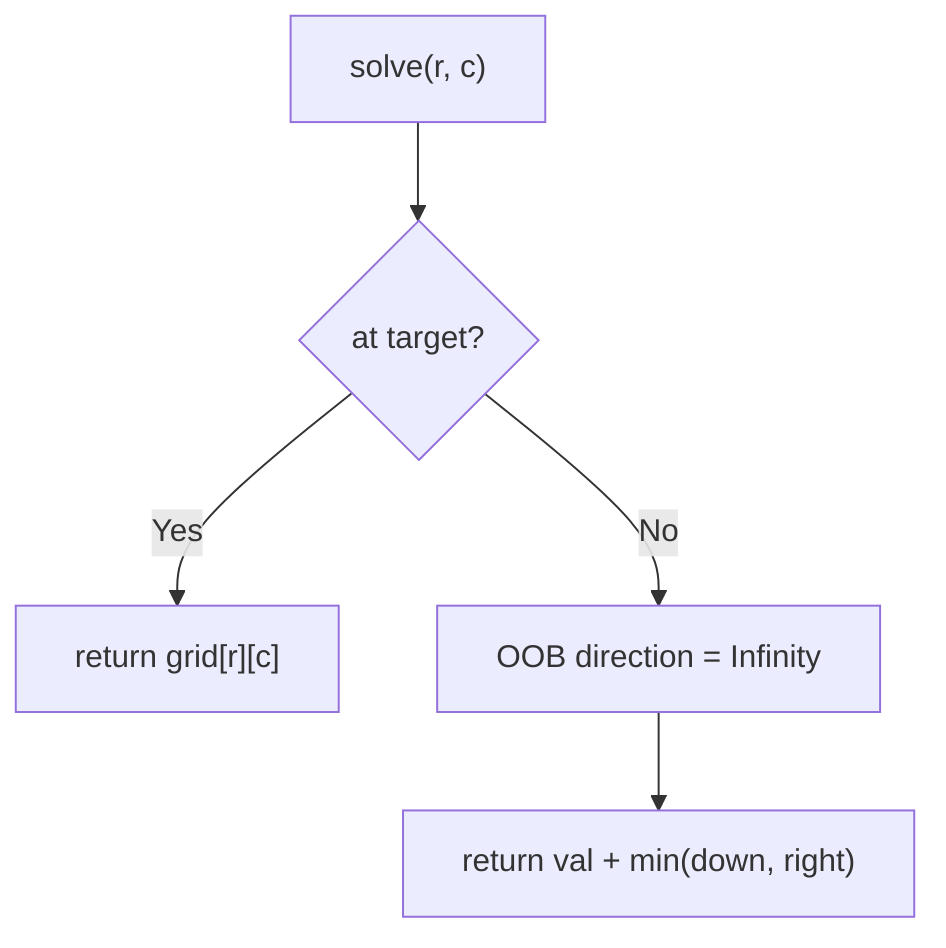
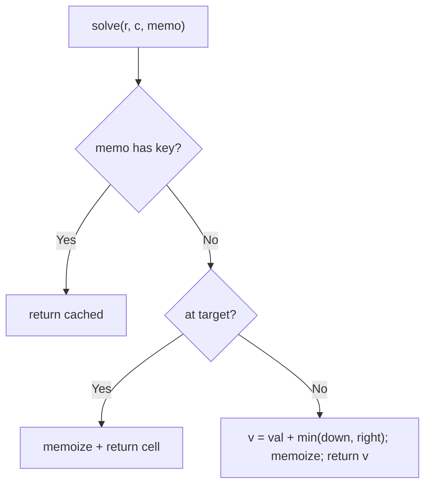

# 64. Minimum Path Sum

- **LeetCode Link**: `https://leetcode.com/problems/minimum-path-sum/`
- **Difficulty**: Medium
- **Pattern Category**: Multidimensional DP / Grid Accumulation
- **Prerequisite Primer**: `00-foundations/03-core-algorithmic-patterns.md`

---

## 1. Problem Overview & Edge Case Matrix

### Problem Statement
Given an `m x n` `grid` filled with non-negative numbers, find a path from top-left to bottom-right which minimizes the sum of all numbers along its path. You can only move either down or right at any point in time.

```
Example 1:
Input: grid = [[1,3,1],[1,5,1],[4,2,1]]
Output: 7
Explanation: Path 1 → 3 → 1 → 1 → 1 sums to 7.

Example 2:
Input: grid = [[1,2,3],[4,5,6]]
Output: 12
Explanation: Path 1 → 2 → 3 → 6 sums to 12.
```

### Visual Problem Representation
```
  1   3   1
  1   5   1        best: right, right, down, down = 1+3+1+1+1 = 7
  4   2   1
```

### Upfront Edge Case Matrix
| Edge Case Category | Specific Input Scenario | Expected Behavior | Pitfall / Risk |
| :--- | :--- | :--- | :--- |
| Single cell | `[[5]]` | Return `5` | Loop needing moves |
| Single row | `[[1,2,3]]` | Straight sum | Down-move branch on 1×n |
| Single column | `[[1],[2],[3]]` | Straight sum | Right-move branch on m×1 |
| All zeros | Zero grid | Return `0` | Falsy-value short-circuits |
| Large grid | $200 × 200$ | Fast tabulation | Exponential path enumeration |

---

## 2. Level 1: Brute Force Approach

### Intuition & Visual Idea
Recurse both moves from every cell: `solve(r, c) = grid[r][c] + min(solve(r+1, c), solve(r, c+1))`, with out-of-bounds as infinity. No memory — exponential path re-solving.



### Pseudocode
```text
FUNCTION minPathSumBruteForce(grid):
    m = ROWS; n = COLS
    DEFINE solve(r, c):
        IF r == m-1 AND c == n-1: RETURN grid[r][c]
        down = (r+1 < m) ? solve(r+1, c) : Infinity
        right = (c+1 < n) ? solve(r, c+1) : Infinity
        RETURN grid[r][c] + MIN(down, right)
    RETURN solve(0, 0)
```

### Step-by-Step Dry Run (Visual Trace)
| Step | Iteration / Pointer ($i, j$) | Current Value | State / Sub-array | Action Taken |
| :--- | :--- | :--- | :--- | :--- |
| 0 | `solve(0,0)` | `1 + min(down, right)` | Branch both | Recurse |
| 1 | shared cell `(1,1)` | reached via two paths | Solved twice | Overlap visible |
| 2 | target `(2,2)` | base `1` | Unwind | Mins propagate |
| 3 | total | best path `1,3,1,1,1` | — | Return `7` |

### Modern JavaScript Implementation
```javascript
/**
 * Level 1: Brute Force (all-paths recursion)
 * Time Complexity:  O(2^(m+n)) — every right/down path enumerated
 * Space Complexity: O(m + n) — call stack depth
 */
function minPathSumBruteForce(grid) {
  const m = grid.length;
  const n = grid[0].length;
  function solve(r, c) {
    if (r === m - 1 && c === n - 1) return grid[r][c]; // target cell
    // Off-grid directions cost Infinity: never chosen by min.
    const down = r + 1 < m ? solve(r + 1, c) : Infinity;
    const right = c + 1 < n ? solve(r, c + 1) : Infinity;
    return grid[r][c] + Math.min(down, right);
  }
  return solve(0, 0);
}
```

### Complexity Breakdown
- **Time Complexity**: $O(2^{m+n})$ — path count is binomial, recursion re-solves shared cells.
- **Space Complexity**: $O(m + n)$ — stack depth; time is the catastrophe.

---

## 3. Level 2: Optimized Approach

### Intuition & Visual Bottleneck Elimination
Memoize `(r, c)`: each cell solved once. Same recursion, $O(m·n)$ time — the grid version of the overlapping-subproblems fix.



### Pseudocode
```text
FUNCTION minPathSumMemo(grid, r = 0, c = 0, memo = MAP()):
    key = "r,c"
    IF memo HAS key: RETURN memo.GET(key)
    IF AT TARGET: result = grid[r][c]
    ELSE:
        down = (r+1 < m) ? recurse(r+1, c) : Infinity
        right = (c+1 < n) ? recurse(r, c+1) : Infinity
        result = grid[r][c] + MIN(down, right)
    memo.SET(key, result)
    RETURN result
```

### Step-by-Step Dry Run (Visual Trace)
| Step | Pointers / Window | Hash Map / Auxiliary State | Decision Logic | Output Accumulator |
| :--- | :--- | :--- | :--- | :--- |
| 0 | `solve(0,0)` | miss | Needs `(1,0)`, `(0,1)` | Recurse |
| 1 | shared `(1,1)` | solved once (`5 + min(2,1) = 6`) | Second parent hits memo | No recompute |
| 2 | unwind | mins propagate | — | Return `7` |

### Modern JavaScript Implementation
```javascript
/**
 * Level 2: Optimized (top-down cell memoization)
 * Time Complexity:  O(m·n) — each cell solved once
 * Space Complexity: O(m·n) — memo map plus O(m+n) stack
 */
function minPathSumMemo(grid, r = 0, c = 0, memo = new Map()) {
  const m = grid.length;
  const n = grid[0].length;
  const key = r + ',' + c; // string key: coordinate pairs stay distinct
  if (memo.has(key)) return memo.get(key); // shared cell: free
  let result;
  if (r === m - 1 && c === n - 1) {
    result = grid[r][c];
  } else {
    const down = r + 1 < m ? minPathSumMemo(grid, r + 1, c, memo) : Infinity;
    const right = c + 1 < n ? minPathSumMemo(grid, r, c + 1, memo) : Infinity;
    result = grid[r][c] + Math.min(down, right);
  }
  memo.set(key, result);
  return result;
}
```

### Complexity Breakdown
- **Time Complexity**: $O(m·n)$ — one solve per cell.
- **Space Complexity**: $O(m·n)$ — memo map; tabulation compresses to one row.

---

## 4. Level 3: Most Optimal / Canonical Approach

### Intuition & Mathematical / Invariant Proof
In-place grid accumulation: seed first row/column with running sums (only one way to reach them), then each interior cell takes `min(top, left) + self$. Invariant: after processing, `grid[r][c]$ holds the minimum path sum from $(0,0)$ to $(r,c)$ — proved by induction on $r + c$ (both predecessors final when the cell updates, since we sweep top-left to bottom-right). Answer lands in the target cell. $O(m·n)$ time, $O(1)$ extra space.

```
[1,3,1]      seed row: [1,4,5]
[1,5,1]  ->  col seed + fold: [2,...] -> [2,7,6]
[4,2,1]      [6,8,7]: answer grid[2][2] = 7
```

### Pseudocode
```text
FUNCTION minPathSum(grid):
    m = ROWS; n = COLS
    FOR j IN 1 .. n-1: grid[0][j] += grid[0][j-1]      // first row: only from left
    FOR i IN 1 .. m-1: grid[i][0] += grid[i-1][0]      // first col: only from above
    FOR i IN 1 .. m-1:
        FOR j IN 1 .. n-1:
            grid[i][j] += MIN(grid[i-1][j], grid[i][j-1])
    RETURN grid[m-1][n-1]
```

### Step-by-Step Dry Run (Visual Trace)
| Step | Pointer $L$ | Pointer $R$ | Invariant Checked | In-Place State |
| :--- | :--- | :--- | :--- | :--- |
| 1 | seed row 0 | running sums | `[1,4,5]` | First row final |
| 2 | seed col 0 | running sums | `[1,2,6]` | First col final |
| 3 | fold `(1,1)` | `5 + min(4,2) = 7` | Predecessors final | Continue |
| 4 | fold rest | `(1,2)=6, (2,1)=8, (2,2)=7` | Target cell | Return `7` |

### Modern JavaScript Implementation
```javascript
/**
 * Level 3: Most Optimal / Canonical (in-place grid accumulation)
 * Time Complexity:  O(m·n) — each cell updated once, optimal
 * Space Complexity: O(1) auxiliary — the grid IS the table
 */
function minPathSum(grid) {
  const m = grid.length;
  const n = grid[0].length;
  // First row: reachable only from the left (running sum).
  for (let j = 1; j < n; j++) grid[0][j] += grid[0][j - 1];
  // First column: reachable only from above (running sum).
  for (let i = 1; i < m; i++) grid[i][0] += grid[i - 1][0];
  // Interior: predecessors (top, left) are final in sweep order.
  for (let i = 1; i < m; i++) {
    for (let j = 1; j < n; j++) {
      grid[i][j] += Math.min(grid[i - 1][j], grid[i][j - 1]);
    }
  }
  return grid[m - 1][n - 1];
}
```

### Complexity Breakdown
- **Time Complexity**: $O(m·n)$ — optimal; every cell processed once.
- **Space Complexity**: $O(1)$ auxiliary — mutates the input (clone at the boundary if callers reuse it).

---

## 5. JavaScript-Specific Gotchas & V8 Optimizations
- **GC Pressure**: Avoid allocating objects inside tight loops ($O(N)$ closures). Level 2's string-keyed `Map` ($m·n$ entries) is the pressure Level 3 removes — pure arithmetic on the grid.
- **Type Coercion / Sorting**: `+=` on grid cells assumes numbers — string cells (`"1"`) would CONCATENATE (`"1" + "3" = "13"`); coerce/validate numeric grids at the boundary. `Infinity` OOB sentinels compose with `Math.min` exactly like Coin Change's table.
- **Index Bounds**: Seed loops start at `1` (index `0` is its own prefix sum trivially); single-row/column grids skip one seed loop AND the fold entirely — the code handles this with zero branches because empty loop ranges just don't execute.

---

## 6. Real-World MAANG Interview Follow-Ups & Extensions

### Follow-Up 1: Return the path + moves in any direction (with obstacles)
- **Scenario**: Reconstruct the route; later, allow 4-directional movement (needs Dijkstra — DP breaks with cycles).
- **Solution Strategy**: Parent pointers during the fold for the route; 4-directional nonnegative weights → Dijkstra over the grid ($O(mn \log mn)$); general weights → Bellman-Ford. Name the algorithm ladder.
- **JS Code / Implementation Pattern**:
```javascript
function minPathRoute(grid) {
  const { dist, parent } = accumulateWithParents(grid); // Level 3 + argmin log
  return backtrackRoute(parent); // from target to origin
}
```

### Follow-Up 2: K obstacles removable / max-sum path
- **Scenario**: Remove up to $K$ obstacles, or maximize instead of minimize.
- **Solution Strategy**: State dimension grows: `dp[r][c][k]` (3D table); max-sum mirrors the kernel with `Math.max`. Same sweep, richer cells.
- **JS Code / Implementation Pattern**:
```javascript
function maxPathSum(grid) {
  return accumulate(grid, Math.max, -Infinity); // mirrored kernel
}
```

### Follow-Up 3: $10^9$-cell grid with blocked-row streaming
- **Scenario & In-Depth Solution**: The grid streams row by row; only two rows fit in RAM. Level 3's fold needs only the previous row + current row — keep a rolling 2-row window ($O(n)$ RAM), single streaming pass. The in-place variant is just the batched special case.
```javascript
async function minPathStreamed(rowStream) {
  let prev = null;
  for await (const row of rowStream) {
    prev = foldRow(prev, row); // Level 3 kernel over the window
  }
  return prev[prev.length - 1];
}
```
