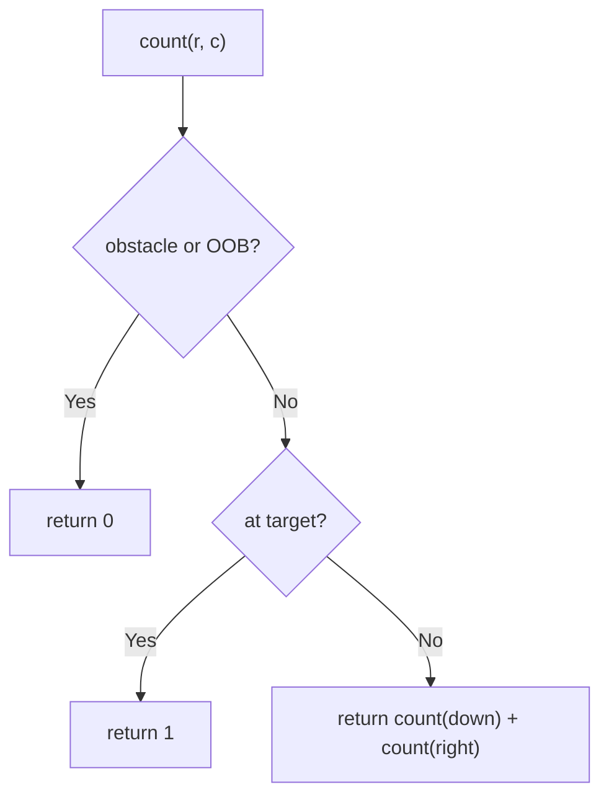
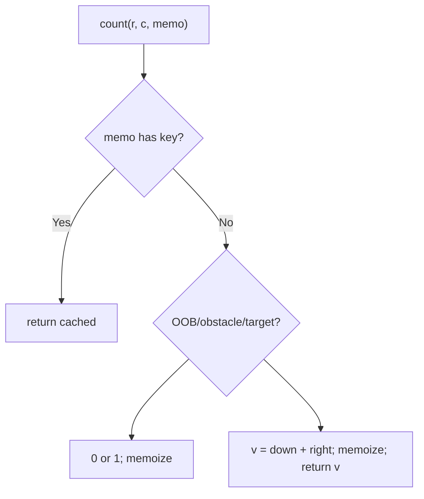

# 63. Unique Paths II

- **LeetCode Link**: `https://leetcode.com/problems/unique-paths-ii/`
- **Difficulty**: Medium
- **Pattern Category**: Multidimensional DP / Obstacle-Aware Counting
- **Prerequisite Primer**: `00-foundations/03-core-algorithmic-patterns.md`

---

## 1. Problem Overview & Edge Case Matrix

### Problem Statement
You are given an `m x n` integer array `grid` where `1` represents an obstacle and `0` represents free space. A robot starts at top-left and wants to reach bottom-right, moving only down or right. Return the number of unique paths that avoid obstacles.

```
Example 1:
Input: obstacleGrid = [[0,0,0],[0,1,0],[0,0,0]]
Output: 2
Explanation: Right-Right-Down-Down and Down-Down-Right-Right (around the center).

Example 2:
Input: obstacleGrid = [[0,1],[0,0]]
Output: 1
```

### Visual Problem Representation
```
  0 0 0      path counts:  1 1 1
  0 X 0  ->                1 X 1
  0 0 0                    1 2 2   (target 2)
```

### Upfront Edge Case Matrix
| Edge Case Category | Specific Input Scenario | Expected Behavior | Pitfall / Risk |
| :--- | :--- | :--- | :--- |
| Blocked start/target | `[1,…]` or `[…,1]` at ends | Return `0` | Seed logic ignoring endpoint obstacles |
| Single cell | `[[0]]` / `[[1]]` | `1` / `0` | Loop needing moves |
| Full obstacle row | Barrier across | Return `0` (sealed) | Counts leaking through obstacles |
| No obstacles | Open grid | Binomial `C(m+n-2, m-1)` | Obstacle checks on clean fast path |
| Large grid | $100 × 100$ | Fast tabulation | Exponential path enumeration |

---

## 2. Level 1: Brute Force Approach

### Intuition & Visual Idea
Recurse both moves, returning 0 for obstacles and out-of-bounds, 1 at the target. No memory — exponential path re-solving.



### Pseudocode
```text
FUNCTION uniquePathsWithObstaclesBruteForce(grid):
    m = ROWS; n = COLS
    DEFINE count(r, c):
        IF OOB OR grid[r][c] == 1: RETURN 0
        IF AT TARGET: RETURN 1
        RETURN count(r+1, c) + count(r, c+1)
    RETURN count(0, 0)
```

### Step-by-Step Dry Run (Visual Trace)
| Step | Iteration / Pointer ($i, j$) | Current Value | State / Sub-array | Action Taken |
| :--- | :--- | :--- | :--- | :--- |
| 0 | `count(0,0)` | free | Branch down + right | Recurse |
| 1 | paths through `(1,1)` | obstacle | Return `0` | Pruned by grid |
| 2 | surviving paths | 2 reach target | Base `1` each | Sum |
| 3 | total | — | — | Return `2` |

### Modern JavaScript Implementation
```javascript
/**
 * Level 1: Brute Force (obstacle-checked path recursion)
 * Time Complexity:  O(2^(m+n)) — every path enumerated
 * Space Complexity: O(m + n) — call stack depth
 */
function uniquePathsWithObstaclesBruteForce(grid) {
  const m = grid.length;
  const n = grid[0].length;
  function count(r, c) {
    // Walls and void: zero paths through here.
    if (r >= m || c >= n || grid[r][c] === 1) return 0;
    if (r === m - 1 && c === n - 1) return 1; // target reached
    return count(r + 1, c) + count(r, c + 1);
  }
  return count(0, 0);
}
```

### Complexity Breakdown
- **Time Complexity**: $O(2^{m+n})$ — path enumeration; shared cells re-solved per path.
- **Space Complexity**: $O(m + n)$ — stack depth; time is the catastrophe.

---

## 3. Level 2: Optimized Approach

### Intuition & Visual Bottleneck Elimination
Memoize `(r, c)` path counts: each cell solved once. Same recursion, $O(m·n)$ time — the grid memo fix, obstacles included.



### Pseudocode
```text
FUNCTION uniquePathsWithObstaclesMemo(grid, r = 0, c = 0, memo = MAP()):
    key = "r,c"
    IF memo HAS key: RETURN memo.GET(key)
    IF OOB OR grid[r][c] == 1: result = 0
    ELSE IF AT TARGET: result = 1
    ELSE: result = recurse(r+1,c) + recurse(r,c+1)
    memo.SET(key, result)
    RETURN result
```

### Step-by-Step Dry Run (Visual Trace)
| Step | Pointers / Window | Hash Map / Auxiliary State | Decision Logic | Output Accumulator |
| :--- | :--- | :--- | :--- | :--- |
| 0 | `count(0,0)` | miss | Branch | Recurse |
| 1 | shared `(0,2)` | solved once (`1`) | Second parent hits memo | No recompute |
| 2 | obstacle `(1,1)` | memoized `0` | Wall cached too | Pruned |
| 3 | unwind | sums propagate | — | Return `2` |

### Modern JavaScript Implementation
```javascript
/**
 * Level 2: Optimized (top-down count memoization)
 * Time Complexity:  O(m·n) — each cell solved once
 * Space Complexity: O(m·n) — memo map plus O(m+n) stack
 */
function uniquePathsWithObstaclesMemo(grid, r = 0, c = 0, memo = new Map()) {
  const m = grid.length;
  const n = grid[0].length;
  const key = r + ',' + c; // string key: coordinate pairs stay distinct
  if (memo.has(key)) return memo.get(key); // shared cell: free
  let result;
  if (r >= m || c >= n || grid[r][c] === 1) {
    result = 0; // void and walls route zero paths (cached like everything)
  } else if (r === m - 1 && c === n - 1) {
    result = 1;
  } else {
    result =
      uniquePathsWithObstaclesMemo(grid, r + 1, c, memo) +
      uniquePathsWithObstaclesMemo(grid, r, c + 1, memo);
  }
  memo.set(key, result);
  return result;
}
```

### Complexity Breakdown
- **Time Complexity**: $O(m·n)$ — one solve per cell.
- **Space Complexity**: $O(m·n)$ — memo map; tabulation compresses to one row.

---

## 4. Level 3: Most Optimal / Canonical Approach

### Intuition & Mathematical / Invariant Proof
1D rolling tabulation: `dp[j]` accumulates paths to column $j$ of the current row; obstacles zero their cell (sealing all paths through). Invariant: after processing row $i$, `dp[j]$ = paths to $(i, j)$ — proved by induction (left term = same-row update already applied this row; top term = carried value from the previous row). $O(m·n)$ time, $O(n)$ space. Start/target obstacles handled naturally (seed/accumulation yields 0).

```
row 0: [1,1,1] (no obstacles: running ones)
row 1: j=0: 1; j=1: obstacle -> 0; j=2: 0+1 = 1  => [1,0,1]
row 2: j=0: 1; j=1: 1+0 = 1; j=2: 1+1 = 2        => [1,1,2], answer 2
```

### Pseudocode
```text
FUNCTION uniquePathsWithObstacles(grid):
    m = ROWS; n = COLS
    dp = ARRAY(n, 0); dp[0] = (grid[0][0] == 0 ? 1 : 0)
    FOR i IN 0 .. m-1:
        FOR j IN 0 .. n-1:
            IF grid[i][j] == 1: dp[j] = 0; CONTINUE   // wall seals the cell
            IF j > 0: dp[j] += dp[j-1]                 // left term (this row)
        // dp[j] carry-over IS the top term (previous row)
    RETURN dp[n-1]
```

### Step-by-Step Dry Run (Visual Trace)
| Step | Pointer $L$ | Pointer $R$ | Invariant Checked | In-Place State |
| :--- | :--- | :--- | :--- | :--- |
| 1 | row 0 | no obstacles | Running ones | `dp = [1,1,1]` |
| 2 | row 1 | `(1,1)` wall → `0` | Sealed | `dp = [1,0,1]` |
| 3 | row 2 | fold `1, 1, 2` | Target cell | Return `dp[2] = 2` |

### Modern JavaScript Implementation
```javascript
/**
 * Level 3: Most Optimal / Canonical (1D rolling path counts)
 * Time Complexity:  O(m·n) — each cell updated once, optimal
 * Space Complexity: O(n) — one row; meets the follow-up bound
 */
function uniquePathsWithObstacles(grid) {
  const m = grid.length;
  const n = grid[0].length;
  const dp = new Array(n).fill(0);
  // Seed: start cell contributes one path iff it isn't a wall.
  dp[0] = grid[0][0] === 0 ? 1 : 0;
  for (let i = 0; i < m; i++) {
    for (let j = 0; j < n; j++) {
      if (grid[i][j] === 1) {
        dp[j] = 0; // wall: seal all paths through this cell
        continue;
      }
      // dp[j] (untouched this row yet) = top term; dp[j-1] = left term.
      if (j > 0) dp[j] += dp[j - 1];
    }
  }
  return dp[n - 1];
}
```

### Complexity Breakdown
- **Time Complexity**: $O(m·n)$ — optimal; every cell folded once.
- **Space Complexity**: $O(n)$ — one row; the follow-up's required bound.

---

## 5. JavaScript-Specific Gotchas & V8 Optimizations
- **GC Pressure**: Avoid allocating objects inside tight loops ($O(N)$ closures). Level 2's string-keyed `Map` ($m·n$ entries) is the pressure Level 3 removes — one reused array.
- **Type Coercion / Sorting**: `grid[r][c] === 1` strict (not truthy) — truthy checks misread any nonzero junk values as walls; `dp[0]` seed uses the same strict test so blocked starts yield `0`, not `1`.
- **Index Bounds**: `j > 0` guard before `dp[j] += dp[j-1]` — column 0 accumulates top-only (no left term exists); the wall-seal (`dp[j] = 0`, not `+= 0`) must OVERWRITE, since stale carry-over from the previous row would otherwise leak through the wall.

---

## 6. Real-World MAANG Interview Follow-Ups & Extensions

### Follow-Up 1: Unique Paths I (no obstacles) and combinatorics
- **Scenario**: Open $m×n$ grid (LeetCode 62) — closed form exists.
- **Solution Strategy**: Binomial $C(m+n-2, m-1)$ in $O(\min(m,n))$ multiplicative steps — no table at all. Level 3 with all-zero grid also works but wastes the math.
- **JS Code / Implementation Pattern**:
```javascript
function uniquePathsOpen(m, n) {
  let result = 1;
  const k = Math.min(m - 1, n - 1);
  for (let i = 1; i <= k; i++) result = (result * (m + n - 1 - i)) / i;
  return Math.round(result); // float division: round once at the end
}
```

### Follow-Up 2: K obstacles removable / minimum-obstacle path
- **Scenario**: Remove up to $K$ obstacles, or minimize obstacles crossed (LeetCode 2290).
- **Solution Strategy**: State dimension grows (`dp[r][c][k]`), or 0-1 BFS over the grid (obstacle = cost-1 edge). Same sweep skeleton, richer cells.
- **JS Code / Implementation Pattern**:
```javascript
function minObstaclesToRemove(grid) {
  return zeroOneBFS(grid); // deque: 0-cost free cells, 1-cost walls
}
```

### Follow-Up 3: $10^9$-cell grid with sparse obstacles
- **Scenario & In-Depth Solution**: Grid too big to tabulate; obstacles are few. Compress coordinates around obstacle rows/columns (+1 margins), run Level 3 on the compressed grid with SEGMENT-WEIGHTED transitions (cell counts multiply path counts across gaps). $O(K^2)$ in obstacle count, not grid size.
```javascript
function sparseUniquePaths(m, n, obstacles) {
  const { rows, cols } = compressAround(obstacles, m, n);
  return weightedTabulation(rows, cols, obstacles);
}
```
