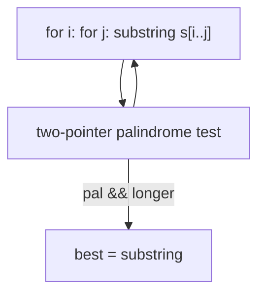
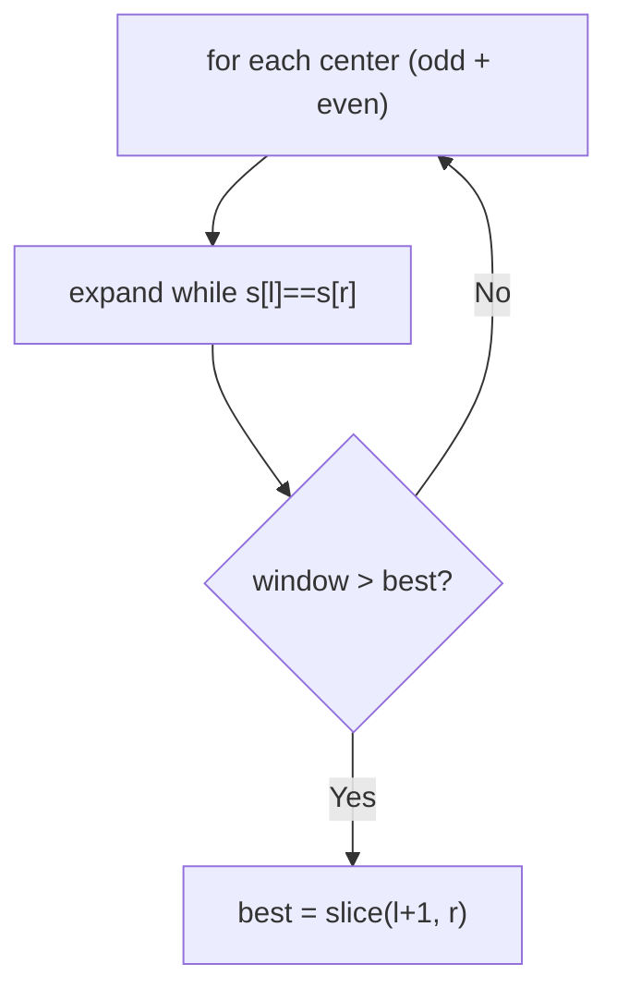

# 5. Longest Palindromic Substring

- **LeetCode Link**: `https://leetcode.com/problems/longest-palindromic-substring/`
- **Difficulty**: Medium
- **Pattern Category**: Multidimensional DP / Palindrome Expansion
- **Prerequisite Primer**: `00-foundations/03-core-algorithmic-patterns.md`

---

## 1. Problem Overview & Edge Case Matrix

### Problem Statement
Given a string `s`, return the longest palindromic substring in `s`.

```
Example 1:
Input: s = "babad"
Output: "bab" (or "aba" — any longest accepted)

Example 2:
Input: s = "cbbd"
Output: "bb"

Example 3:
Input: s = "a"
Output: "a"
```

### Visual Problem Representation
```
"babad":   centers: b|a|b|a|d + 4 gaps
           longest radius at center 'b'(idx1): "bab" (len 3)
           (center 'a'(idx2) gives "aba" — equally valid)
```

### Upfront Edge Case Matrix
| Edge Case Category | Specific Input Scenario | Expected Behavior | Pitfall / Risk |
| :--- | :--- | :--- | :--- |
| Single char | `"a"` | Return `"a"` | Loop needing centers |
| All identical | `"aaaa"` | Return `"aaaa"` | Even-center handling |
| Even palindrome | `"cbbd"` | Return `"bb"` | Odd-centers-only search |
| No long palindromes | `"abc"` | Any single char | Empty return |
| Multiple answers | `"babad"` | `"bab"` OR `"aba"` | Test asserting one specific string |

---

## 2. Level 1: Brute Force Approach

### Intuition & Visual Idea
Check every substring for palindromicity with a two-pointer verifier; keep the longest. $O(N^3)$ — $O(N^2)$ substrings times $O(N)$ checks.



### Pseudocode
```text
FUNCTION longestPalindromeBruteForce(s):
    best = ""
    FOR i IN 0 .. n-1:
        FOR j IN i .. n-1:
            IF (j-i+1) > best.LENGTH AND isPalindrome(s, i, j):
                best = s.SLICE(i, j+1)
    RETURN best
```

### Step-by-Step Dry Run (Visual Trace)
| Step | Iteration / Pointer ($i, j$) | Current Value | State / Sub-array | Action Taken |
| :--- | :--- | :--- | :--- | :--- |
| 0 | `(0,4)` `"babad"` | not palindrome | Skip | — |
| 1 | `(0,2)` `"bab"` | palindrome, len 3 | `best = "bab"` | Keep |
| 2 | remaining windows | none longer + palindromic | — | Return `"bab"` |

### Modern JavaScript Implementation
```javascript
/**
 * Two-pointer palindrome verifier over s[lo..hi] (shared helper).
 */
function isPalRange(s, lo, hi) {
  while (lo < hi) {
    if (s[lo] !== s[hi]) return false;
    lo++;
    hi--;
  }
  return true;
}

/**
 * Level 1: Brute Force (all substrings + verifier)
 * Time Complexity:  O(N³) — O(N²) windows × O(N) checks
 * Space Complexity: O(N) — slices (best only retained)
 */
function longestPalindromeBruteForce(s) {
  let best = '';
  for (let i = 0; i < s.length; i++) {
    for (let j = i; j < s.length; j++) {
      // Length-guard first: only verify windows that can improve.
      if (j - i + 1 > best.length && isPalRange(s, i, j)) {
        best = s.slice(i, j + 1);
      }
    }
  }
  return best;
}
```

### Complexity Breakdown
- **Time Complexity**: $O(N^3)$ — substring enumeration with linear verification.
- **Space Complexity**: $O(N)$ — slices; time is the catastrophe.

---

## 3. Level 2: Optimized Approach

### Intuition & Visual Bottleneck Elimination
Expand around centers: every palindrome has a center (2N−1 centers: N chars + N−1 gaps). Expand each while ends match, tracking the longest. $O(N^2)$ time, $O(1)$ space — no substrings built except the answer.



### Pseudocode
```text
FUNCTION longestPalindromeExpand(s):
    IF s.LENGTH < 2: RETURN s
    best = s[0]
    DEFINE expand(l, r):
        WHILE l >= 0 AND r < n AND s[l] == s[r]: l--; r++
        RETURN s.SLICE(l+1, r)
    FOR i IN 0 .. n-1:
        best = LONGER(best, expand(i, i), expand(i, i+1))
    RETURN best
```

### Step-by-Step Dry Run (Visual Trace)
| Step | Pointers / Window | Hash Map / Auxiliary State | Decision Logic | Output Accumulator |
| :--- | :--- | :--- | :--- | :--- |
| 0 | center `(1,1)` on `"babad"` | expands to `(0,2)` | `"bab"`, len 3 | `best = "bab"` |
| 1 | center `(2,2)` | expands to `(1,3)` | `"aba"`, len 3, not longer | Kept `"bab"` |
| 2 | even centers | max len 2 or less | No improvement | Return `"bab"` |

### Modern JavaScript Implementation
```javascript
/**
 * Level 2: Optimized (expand-around-center)
 * Time Complexity:  O(N²) — 2N-1 centers × O(N) expansion
 * Space Complexity: O(1) auxiliary — slices only for the answer
 */
// isPalRange shared from Level 1 (unused here; expansion replaces verification).
function longestPalindromeExpand(s) {
  if (s.length < 2) return s;
  let best = s.slice(0, 1);
  const expand = (l, r) => {
    // Grow while symmetric; overshoot by one, then slice the valid window.
    while (l >= 0 && r < s.length && s[l] === s[r]) {
      l--;
      r++;
    }
    return s.slice(l + 1, r);
  };
  for (let i = 0; i < s.length; i++) {
    const odd = expand(i, i); // odd-length centers (the char itself)
    const even = expand(i, i + 1); // even-length centers (the gap after)
    if (odd.length > best.length) best = odd;
    if (even.length > best.length) best = even;
  }
  return best;
}
```

### Complexity Breakdown
- **Time Complexity**: $O(N^2)$ — linear centers, linear expansion each.
- **Space Complexity**: $O(1)$ auxiliary — no table; the remaining gap is time.

---

## 4. Level 3: Most Optimal / Canonical Approach

### Intuition & Mathematical / Invariant Proof
Manacher's algorithm in linear time: pad with separators (`#b#a#b#a#d#`) so every palindrome is odd-length, then track `(center, right)` — the rightmost-reached palindrome. Mirror property: position `i`'s radius starts at `min(right - i, p[mirror])` when inside the boundary (the mirror's palindrome is fully contained), else 0. Each iteration pushes `right` forward at most $N$ steps total — amortized $O(1)$ per center, $O(N)$ overall. Map back with `start = (maxCenter - maxLen) / 2`: s-index `k` sits at padded index `2k+1`, so a padded span `[c-r, c+r]` starts at s-index `(c-r)/2` — and `c-r` is always even (center and radius share parity: both even on chars, both odd on separators).

```
"babad" -> t = #b#a#b#a#d# (len 11)
  "bab" = s[0..2] ↔ t[0..6], center 3, radius 3 -> start (3-3)/2 = 0
"cbbd" -> t = #c#b#b#d#
  "bb" = s[1..2] ↔ t[2..6], center 4, radius 2 -> start (4-2)/2 = 1
```

### Pseudocode
```text
FUNCTION longestPalindrome(s):
    IF s.LENGTH < 2: RETURN s
    t = "#" + JOIN(s, "#") + "#"
    p = ARRAY(t.LENGTH, 0)
    center = 0; right = 0; maxLen = 0; maxCenter = 0
    FOR i IN 0 .. t.LENGTH - 1:
        mirror = 2 * center - i
        IF i < right: p[i] = MIN(right - i, p[mirror])
        WHILE IN-BOUNDS AND t[i-p[i]-1] == t[i+p[i]+1]: p[i]++
        IF i + p[i] > right: center = i; right = i + p[i]
        IF p[i] > maxLen: maxLen = p[i]; maxCenter = i
    start = (maxCenter - maxLen) / 2
    RETURN s.SLICE(start, start + maxLen)
```

### Step-by-Step Dry Run (Visual Trace)
| Step | Pointer $L$ | Pointer $R$ | Invariant Checked | In-Place State |
| :--- | :--- | :--- | :--- | :--- |
| 1 | `i` at char-`b` (t-idx 2) | expand to radius `1` | `right = 3` | No record |
| 2 | `i = 3` (t-`a`, s-center of "bab") | outside boundary: expand | Radius `3` (`#b#a#b#`) | `maxLen = 3`, `maxCenter = 3` |
| 3 | later centers | mirror copies within boundary | No re-scan | Radii filled |
| 4 | map back | `start = (3-3)/2 = 0` (center 3, radius 3 — same parity, always even difference) | Return `s.slice(0, 3) = "bab"` |

### Modern JavaScript Implementation
```javascript
/**
 * Level 3: Most Optimal / Canonical (Manacher's algorithm)
 * Time Complexity:  O(N) — amortized O(1) per center via mirror reuse
 * Space Complexity: O(N) — padded string plus radii array
 */
function longestPalindrome(s) {
  if (s.length < 2) return s;
  // Separators make every palindrome odd-length; s[k] sits at t[2k+1].
  const t = '#' + [...s].join('#') + '#';
  const p = new Array(t.length).fill(0);
  let center = 0;
  let right = 0;
  let maxLen = 0;
  let maxCenter = 0;
  for (let i = 0; i < t.length; i++) {
    const mirror = 2 * center - i;
    // Inside the boundary: the mirror's radius transfers (capped at the edge).
    if (i < right) p[i] = Math.min(right - i, p[mirror]);
    while (i - p[i] - 1 >= 0 && i + p[i] + 1 < t.length && t[i - p[i] - 1] === t[i + p[i] + 1]) {
      p[i]++;
    }
    if (i + p[i] > right) {
      center = i;
      right = i + p[i];
    }
    if (p[i] > maxLen) {
      maxLen = p[i];
      maxCenter = i;
    }
  }
  // center and radius share parity, so (maxCenter - maxLen) is always even.
  const start = (maxCenter - maxLen) / 2;
  return s.slice(start, start + maxLen);
}
```

### Complexity Breakdown
- **Time Complexity**: $O(N)$ — optimal; `right` advances monotonically, bounding total expansion work.
- **Space Complexity**: $O(N)$ — padded string plus radii; time-optimal with linear memory.

---

## 5. JavaScript-Specific Gotchas & V8 Optimizations
- **GC Pressure**: Avoid allocating objects inside tight loops ($O(N)$ closures). Level 1's per-window slices ($O(N^2)$ of them, mostly discarded) are the pressure removed — Level 3 allocates two arrays total.
- **Type Coercion / Sorting**: `[...s]` (not `s.split('')`) is code-point safe — astral characters (emoji) split into lone surrogates under `split('')`, breaking index math; spread keeps them whole. `(maxCenter - maxLen) / 2` is exact (same-parity proof above), never fractional.
- **Index Bounds**: The padded expansion MUST bounds-check both sides (`i - p[i] - 1 >= 0` and `< t.length`) — without sentinels, overrun reads `undefined`, and `undefined === undefined` is TRUE, which would falsely extend radii at the string edges.

---

## 6. Real-World MAANG Interview Follow-Ups & Extensions

### Follow-Up 1: Count palindromic substrings (all of them)
- **Scenario**: Return the COUNT, not the longest (LeetCode 647).
- **Solution Strategy**: Level 2's centers with a counter instead of a best-tracker (each expansion step = one palindrome); or sum Manacher radii: `Σ (p[i] + 1) / 2` over original-char... precisely `Σ⌊(p[i]+2)/2⌋`? State carefully: total = Σ over centers of expansion counts.
- **JS Code / Implementation Pattern**:
```javascript
function countSubstrings(s) {
  let count = 0;
  const expand = (l, r) => {
    while (l >= 0 && r < s.length && s[l] === s[r]) {
      count++;
      l--;
      r++;
    }
  };
  for (let i = 0; i < s.length; i++) {
    expand(i, i);
    expand(i, i + 1);
  }
  return count;
}
```

### Follow-Up 2: Longest palindromic SUBSEQUENCE vs SUBSTRING (this module's sibling)
- **Scenario**: Subsequence (non-contiguous) longest (LeetCode 516, next guide).
- **Solution Strategy**: Different recurrence entirely (`l==r` ends-match DP) — know which problem each technique solves; Manacher does NOT transfer.
- **JS Code / Implementation Pattern**:
```javascript
function longestPalindromeSubseq(s) {
  return lpsBottomUp(s); // next guide's Level 3
}
```

### Follow-Up 3: $10^9$-character stream with $O(1)$ RAM (rolling hash)
- **Scenario & In-Depth Solution**: The string streams once; only hashes fit in RAM. Forward + reverse rolling hashes over a sliding window with binary-searched radius per center is still $O(N^2)$... instead: Palindromic Tree (Eertree) processes streaming characters in $O(N)$ time and $O(\text{alphabet})$ per distinct palindrome — linear, online, exact.
```javascript
async function longestPalindromicStream(charStream) {
  const eertree = new Eertree(); // suffix links over palindromic suffixes
  for await (const ch of charStream) eertree.extend(ch);
  return eertree.longest();
}
```
