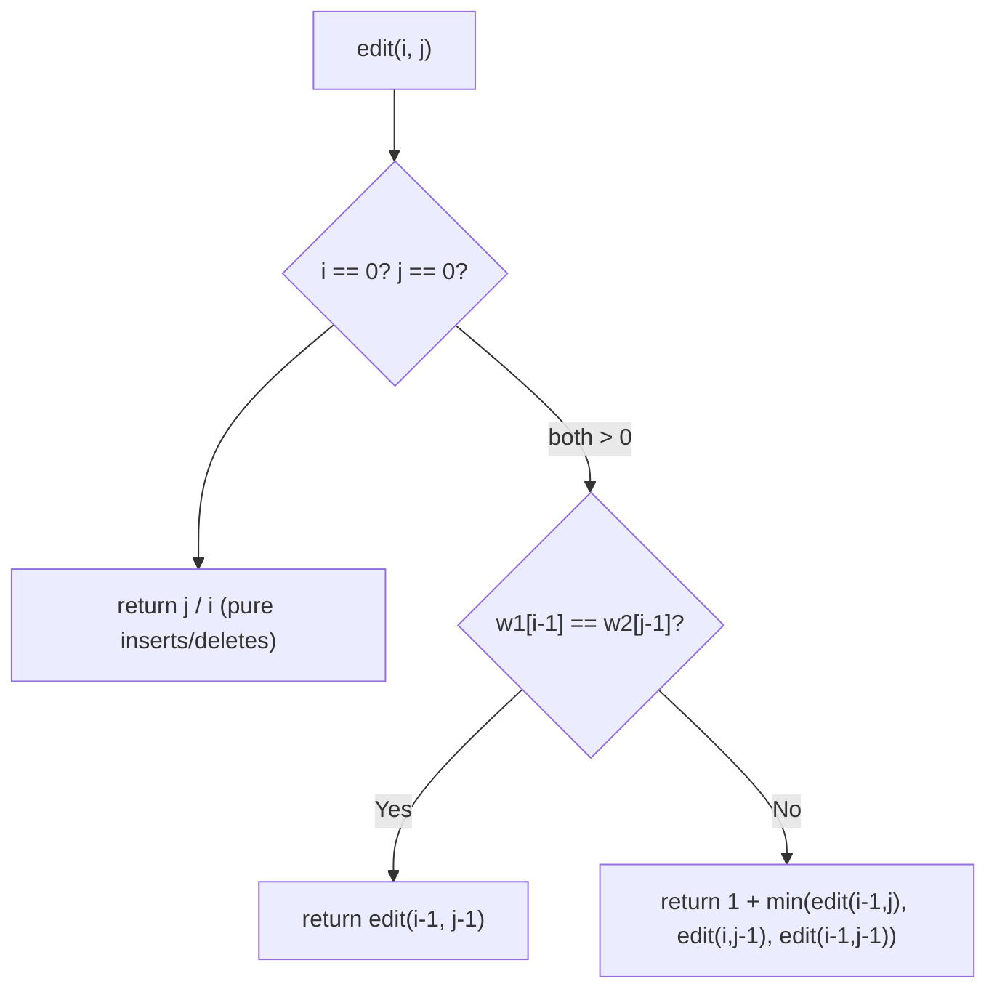
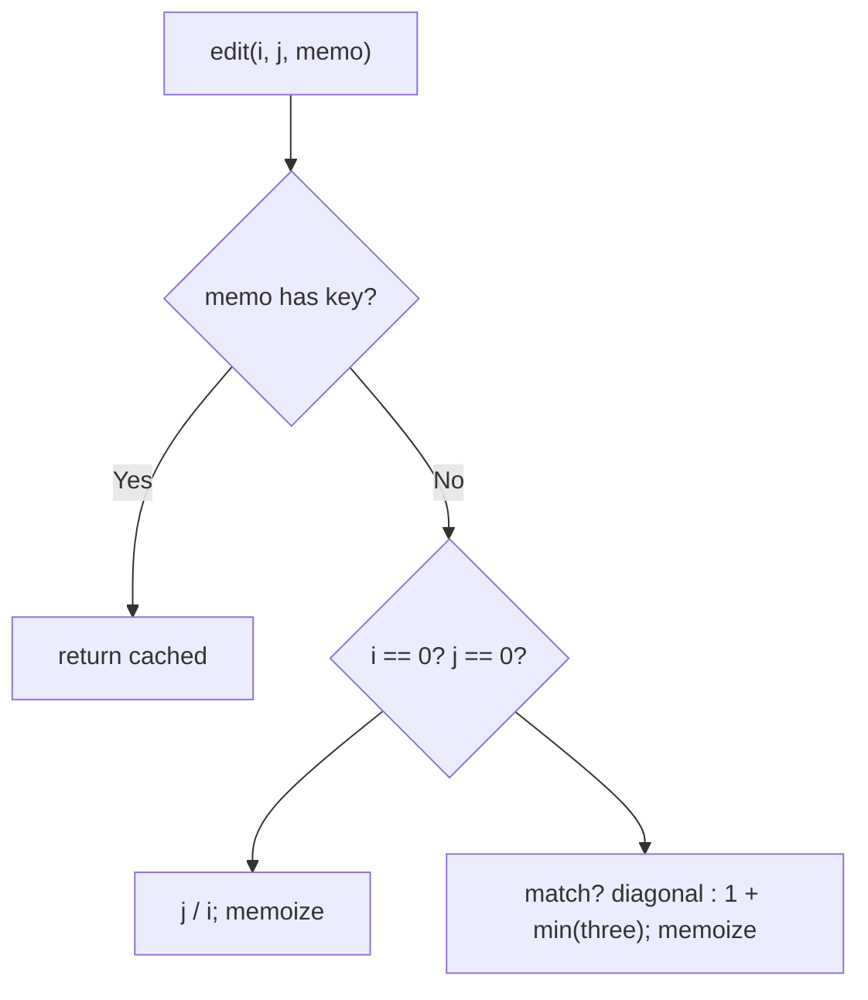
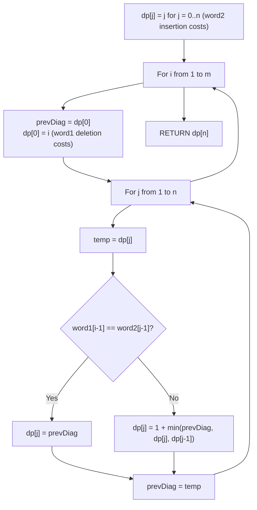

# 72. Edit Distance

- **LeetCode Link**: `https://leetcode.com/problems/edit-distance/`
- **Difficulty**: Medium
- **Pattern Category**: Multidimensional DP / Alignment Table
- **Prerequisite Primer**: `00-foundations/03-core-algorithmic-patterns.md`

---

## 1. Problem Overview & Edge Case Matrix

### Problem Statement
Given two strings `word1` and `word2`, return the minimum number of operations required to convert `word1` to `word2`. Allowed operations: insert a character, delete a character, replace a character.

```
Example 1:
Input: word1 = "horse", word2 = "ros"
Output: 3
Explanation: horse -> rorse (replace h with r) -> rose (delete r) -> ros (delete e).

Example 2:
Input: word1 = "intention", word2 = "execution"
Output: 5
```

### Visual Problem Representation
```
"horse" -> "ros":   h o r s e
                    r o s        replace h->r, delete r, delete e = 3 ops
```

### Upfront Edge Case Matrix
| Edge Case Category | Specific Input Scenario | Expected Behavior | Pitfall / Risk |
| :--- | :--- | :--- | :--- |
| Empty source | `""` → `"abc"` | Return `3` (all inserts) | Base row/col init |
| Empty target | `"abc"` → `""` | Return `3` (all deletes) | Symmetric base |
| Identical | `"abc"` → `"abc"` | Return `0` | Match shortcut skipped |
| One side prefix | `"a"` → `"ab"` | Return `1` | Off-by-one in base rows |
| Max scale | $500 × 500$ | Fast tabulation | Exponential recursion |

---

## 2. Level 1: Brute Force Approach

### Intuition & Visual Idea
Three-way recursion on prefixes: match (free diagonal), or 1 + min(delete, insert, replace). No memory — $O(3^{M+N})$ re-solving of shared prefix pairs.



### Pseudocode
```text
FUNCTION minDistanceBruteForce(word1, word2):
    DEFINE edit(i, j):   // prefixes word1[..i), word2[..j)
        IF i == 0: RETURN j
        IF j == 0: RETURN i
        IF word1[i-1] == word2[j-1]: RETURN edit(i-1, j-1)
        RETURN 1 + MIN(edit(i-1,j), edit(i,j-1), edit(i-1,j-1))
    RETURN edit(word1.LENGTH, word2.LENGTH)
```

### Step-by-Step Dry Run (Visual Trace)
| Step | Iteration / Pointer ($i, j$) | Current Value | State / Sub-array | Action Taken |
| :--- | :--- | :--- | :--- | :--- |
| 0 | `edit(5, 3)` | `e` vs `s` differ | `1 + min(delete, insert, replace)` | Branch 3 ways |
| 1 | shared `(4, 2)` etc. | reached via many paths | Re-solved per path | Overlap visible |
| 2 | bases | empty prefixes | Insert/delete counts | Unwind |
| 3 | total | — | — | Return `3` |

### Modern JavaScript Implementation
```javascript
/**
 * Level 1: Brute Force (three-way prefix recursion)
 * Time Complexity:  O(3^(M+N)) — every alignment re-solved per path
 * Space Complexity: O(M + N) — call stack depth
 */
function minDistanceBruteForce(word1, word2) {
  function edit(i, j) {
    // Empty-vs-prefix: pure inserts (i==0) or pure deletes (j==0).
    if (i === 0) return j;
    if (j === 0) return i;
    // Matching tails align for free: shrink both with no operation.
    if (word1[i - 1] === word2[j - 1]) return edit(i - 1, j - 1);
    // Delete (i-1,j) / insert (i,j-1) / replace (i-1,j-1): cheapest + 1.
    return (
      1 +
      Math.min(edit(i - 1, j), edit(i, j - 1), edit(i - 1, j - 1))
    );
  }
  return edit(word1.length, word2.length);
}
```

### Complexity Breakdown
- **Time Complexity**: $O(3^{M+N})$ — ternary branching over prefix pairs.
- **Space Complexity**: $O(M + N)$ — stack depth; time is the catastrophe.

---

## 3. Level 2: Optimized Approach

### Intuition & Visual Bottleneck Elimination
Memoize `(i, j)`: $O(M·N)$ distinct prefix pairs, each solved once. Same recurrence, table-free — the alignment-DP fix.



### Pseudocode
```text
FUNCTION minDistanceMemo(word1, word2, i = m, j = n, memo = MAP()):
    key = "i,j"
    IF memo HAS key: RETURN memo.GET(key)
    IF i == 0: result = j
    ELSE IF j == 0: result = i
    ELSE IF word1[i-1] == word2[j-1]: result = recurse(i-1, j-1)
    ELSE: result = 1 + MIN(recurse(i-1,j), recurse(i,j-1), recurse(i-1,j-1))
    memo.SET(key, result)
    RETURN result
```

### Step-by-Step Dry Run (Visual Trace)
| Step | Pointers / Window | Hash Map / Auxiliary State | Decision Logic | Output Accumulator |
| :--- | :--- | :--- | :--- | :--- |
| 0 | `edit(5, 3)` | miss | Branch 3 ways | Recurse |
| 1 | shared `(3, 2)` | solved once | Later refs hit memo | No recompute |
| 2 | bases `(0, k)`, `(k, 0)` | memoized counts | Propagate | Unwind |
| 3 | total | — | — | Return `3` |

### Modern JavaScript Implementation
```javascript
/**
 * Level 2: Optimized (top-down prefix-pair memoization)
 * Time Complexity:  O(M·N) — each prefix pair solved once
 * Space Complexity: O(M·N) — memo map plus O(M+N) stack
 */
function minDistanceMemo(word1, word2, i = word1.length, j = word2.length, memo = new Map()) {
  const key = i + ',' + j; // string key: coordinate pairs stay distinct
  if (memo.has(key)) return memo.get(key); // shared prefixes: free
  let result;
  if (i === 0) result = j;
  else if (j === 0) result = i;
  else if (word1[i - 1] === word2[j - 1]) {
    result = minDistanceMemo(word1, word2, i - 1, j - 1, memo);
  } else {
    result =
      1 +
      Math.min(
        minDistanceMemo(word1, word2, i - 1, j, memo), // delete from word1
        minDistanceMemo(word1, word2, i, j - 1, memo), // insert into word1
        minDistanceMemo(word1, word2, i - 1, j - 1, memo), // replace
      );
  }
  memo.set(key, result);
  return result;
}
```

### Complexity Breakdown
- **Time Complexity**: $O(M·N)$ — one solve per prefix pair.
- **Space Complexity**: $O(M·N)$ — memo map; tabulation keeps the table but drops the stack.

---

## 4. Level 3: Most Optimal / Canonical Approach

### Intuition & Mathematical / Invariant Proof
Full `(m+1)×(n+1)$ table: `dp[0][j] = j` (pure inserts), `dp[i][0] = i` (pure deletes); interior matches copy the diagonal, else $1 + \min(\text{top}, \text{left}, \text{diag})$ (delete/insert/replace). Invariant: when cell $(i,j)$ computes (row-major order), all three predecessors are final — top/left/diag are strictly earlier in the sweep. Answer `dp[m][n]$. ($O(\min)$-space variants keep two rows; the full table also reconstructs the alignment — keep it.)

```
"horse" x "ros": dp[5][3] = 3 (table below, last row shown)
  row "e": [..., 3]: replace-path + deletions compose the answer
```

### Pseudocode
```text
FUNCTION minDistance(word1, word2):
    m = word1.LENGTH; n = word2.LENGTH
    dp = (m+1)×(n+1) ZEROS
    FOR j IN 0 .. n: dp[0][j] = j
    FOR i IN 0 .. m: dp[i][0] = i
    FOR i IN 1 .. m:
        FOR j IN 1 .. n:
            IF word1[i-1] == word2[j-1]: dp[i][j] = dp[i-1][j-1]
            ELSE: dp[i][j] = 1 + MIN(dp[i-1][j], dp[i][j-1], dp[i-1][j-1])
    RETURN dp[m][n]
```

### Step-by-Step Dry Run (Visual Trace)
| Step | Pointer $L$ | Pointer $R$ | Invariant Checked | In-Place State |
| :--- | :--- | :--- | :--- | :--- |
| 1 | base row/col | `dp[0][j]=j`, `dp[i][0]=i` | Pure insert/delete counts | Borders final |
| 2 | `(1,1)`: `h` vs `r` | differ → `1 + min(1,1,0) = 1` | Predecessors final | Replace |
| 3 | fill to `(5,3)` | compositions | All predecessors final | `dp[5][3] = 3` |
| 4 | return | — | — | Return `3` |

### Modern JavaScript Implementation
```javascript
/**
 * Level 3: Most Optimal / Canonical (bottom-up alignment table)
 * Time Complexity:  O(M·N) — each cell computed once, optimal
 * Space Complexity: O(M·N) — full table (also reconstructs the alignment)
 */
function minDistance(word1, word2) {
  const m = word1.length;
  const n = word2.length;
  const dp = Array.from({ length: m + 1 }, (_, i) => {
    const row = new Array(n + 1).fill(0);
    row[0] = i; // first column: deleting i chars to reach ""
    return row;
  });
  for (let j = 1; j <= n; j++) dp[0][j] = j; // first row: inserting j chars
  for (let i = 1; i <= m; i++) {
    for (let j = 1; j <= n; j++) {
      if (word1[i - 1] === word2[j - 1]) {
        dp[i][j] = dp[i - 1][j - 1]; // matching tails: free alignment
      } else {
        // Delete / insert / replace: cheapest predecessor plus one op.
        dp[i][j] = 1 + Math.min(dp[i - 1][j], dp[i][j - 1], dp[i - 1][j - 1]);
      }
    }
  }
  return dp[m][n];
}
```

### Complexity Breakdown
- **Time Complexity**: $O(M·N)$ — optimal; every prefix pair resolved once.
- **Space Complexity**: $O(M·N)$ — full table; two-row rolling cuts it to $O(\min)$ when reconstruction isn't needed.

---

## 5. JavaScript-Specific Gotchas & V8 Optimizations
- **GC Pressure**: Avoid allocating objects inside tight loops ($O(N)$ closures). Level 2's string-keyed `Map` ($M·N$ entries) is the pressure Level 3 removes — one preallocated table.
- **Type Coercion / Sorting**: `Array.from({length}, (_, i) => ...)` row factory (not `.fill(new Array(...))` — shared-reference aliasing would make every row THE SAME array, corrupting the whole table through one write).
- **Index Bounds**: 1-based table vs 0-based strings (`word1[i-1]`, `word2[j-1]`) — the most skid-prone indexing in all of DP; base row/col (`dp[0][j] = j`, `dp[i][0] = i`) must be set BEFORE the interior loops, and `m = 0`/`n = 0` inputs return through the bases with zero interior work.

---

## 6. Real-World MAANG Interview Follow-Ups & Extensions

### Follow-Up 1: Damerau (transpositions) and weighted edits
- **Scenario**: Adjacent transposition as one op (Damerau-Levenshtein), or per-operation costs.
- **Solution Strategy**: Damerau adds a fourth transition (`dp[i-2][j-2] + 1` when chars cross-match, with alphabet-indexed last-row tracking for the full variant); weighted edits replace the `1 +` with cost tables. Same sweep, richer transitions.
- **JS Code / Implementation Pattern**:
```javascript
function damerauLevenshtein(a, b) {
  return alignmentTable(a, b, { transpose: true }); // 4-transition kernel
}
```

### Follow-Up 2: $10^6$-character sequences (genomics scale)
- **Scenario**: Full $M×N$ table impossible (DNA reads).
- **Solution Strategy**: Banded DP (Ukkonen: only diagonals within edit budget $K$ — $O(K·\min)$), or Myers' $O((M+N)D)$ bit-parallel/greedy algorithm for small edit counts. Exact answers with output-sensitive work.
- **JS Code / Implementation Pattern**:
```javascript
function ukkonenEditDistance(a, b, budget) {
  return bandedAlignment(a, b, budget); // NULL when distance exceeds budget
}
```

### Follow-Up 3: Spell-check over a $10^6$-word dictionary
- **Scenario & In-Depth Solution**: Nearest dictionary words to a typo (search-as-you-type). Trie + DP-column pruning: walk the trie carrying the current DP column, abandoning branches whose minimum exceeds the best found (Norvig-style with exact Levenshtein). One traversal serves the whole dictionary.
```javascript
function spellSuggest(trie, typo, limit = 5) {
  return trieWalkWithDPCutoff(trie, typo, limit); // column-pruned traversal
}
```

---

## 7. What LeetCode Discuss Says (Language-Independent)

Source: top-voted post by Jianchao Li —
`https://leetcode.com/problems/edit-distance/solutions/25846/c-on-space-dp-by-jianchao-li-7fkd/`
— 129.2K views.
Language-independent summary. No new JS here.

### A. Optimal way from Discuss (1D Rolling Array DP with Diagonal Variable)

Compress the classic Wagner-Fischer 2D alignment matrix into a single 1D array by caching the diagonal state:

1. **Recurrence Invariants:**
   - To transform prefix `word1[0...i-1]` to `word2[0...j-1]`:
     - **Match:** If characters match (`word1[i-1] == word2[j-1]`), cost is unchanged: $dp[i][j] = dp[i-1][j-1]$.
     - **Mismatch:** Take the minimum of three elementary edits plus 1:
       - **Replace:** $dp[i-1][j-1] + 1$ (diagonal).
       - **Delete from word1:** $dp[i-1][j] + 1$ (vertical / top).
       - **Insert into word1:** $dp[i][j-1] + 1$ (horizontal / left).
2. **Space Compression via `prevDiag`:**
   - Evaluating cell $(i, j)$ requires:
     - Diagonal $dp[i-1][j-1]$ (cached in a scalar register `prevDiag`).
     - Top $dp[i-1][j]$ (the pre-update value in `dp[j]`).
     - Left $dp[i][j-1]$ (the updated value in `dp[j-1]`).
   - By preserving `dp[j]` into a temporary variable before each column write, a single 1D array of length $N + 1$ suffices.

```text
FUNCTION minDistance(word1, word2):
    m = LENGTH(word1)
    n = LENGTH(word2)

    dp = ARRAY OF SIZE (n + 1)
    FOR j FROM 0 TO n:
        dp[j] = j

    FOR i FROM 1 TO m:
        prevDiag = dp[0]
        dp[0] = i

        FOR j FROM 1 TO n:
            temp = dp[j]
            IF word1[i - 1] == word2[j - 1]:
                dp[j] = prevDiag
            ELSE:
                dp[j] = 1 + MIN(prevDiag, MIN(dp[j], dp[j - 1]))
            prevDiag = temp

    RETURN dp[n]
```

- Time: O(M * N) — each character pair is evaluated in constant time.
- Space: O(min(M, N)) auxiliary space by orienting the 1D buffer along the shorter string.



### B. Dry run on LeetCode Example 1 (`word1 = "horse"`, `word2 = "ros"`)

- $m = 5, n = 3$.
- Initial row: `dp = [0, 1, 2, 3]`.
- $i = 1$ ('h'):
  - `prevDiag = 0`, `dp[0] = 1`.
  - $j = 1$ ('r'): 'h' $\ne$ 'r' $\implies 1 + \min(0, 1, 1) = 1$. `prevDiag = 1`.
  - $j = 2$ ('o'): 'h' $\ne$ 'o' $\implies 1 + \min(1, 2, 1) = 2$. `prevDiag = 2`.
  - $j = 3$ ('s'): 'h' $\ne$ 's' $\implies 1 + \min(2, 3, 2) = 3$. `prevDiag = 3`.
  - `dp = [1, 1, 2, 3]`.
- Continuing for remaining rows transforms `horse` into `ros` in exactly 3 operations:
  - Replace 'h' with 'r' $\to$ "rorse"
  - Delete 'r' $\to$ "rose"
  - Delete 'e' $\to$ "ros"
- Final result: `3`.

### C. Why Diagonal Caching Slashes Matrix Footprint to $O(N)$

- The classic 2D formulation consumes $O(M \times N)$ space, generating high cache miss penalties on large strings.
- Storing only one row and using the scalar `prevDiag` register preserves the top-left diagonal while slashing space to $O(N)$.

### D. Pitfalls from comments

- **Premature Diagonal Overwrite:** Overwriting `dp[j]` before capturing its original value into `temp` destroys the diagonal prerequisite needed for column $j + 1$.
- **Base Cost Misalignment:** Failing to initialize `dp[0] = i` at the start of each row iteration causes deletion operations from prefix `word1[0...i-1]` to be miscounted.

### E. Companies

- Discuss post itself names none.
  Companies tab on LeetCode is premium-locked.
- External source:
  `https://github.com/liquidslr/leetcode-company-wise-problems`
  (LeetCode company tags, updated June 2025).
- All-time (28): Amazon, Apple, Axon, Bloomberg, Cisco, Deloitte, EPAM Systems, Flipkart, Google, HashedIn, IBM, Infosys, LinkedIn, Meta, Microsoft, Qualcomm, Samsung, Snap, Sprinklr, Stripe, Swiggy, TikTok, Uber, Visa, Walmart Labs, X, Yandex, Zoho.
- Recent: 30 days — None.
- Recent: 3 months — Amazon, Apple, Google, Infosys.
