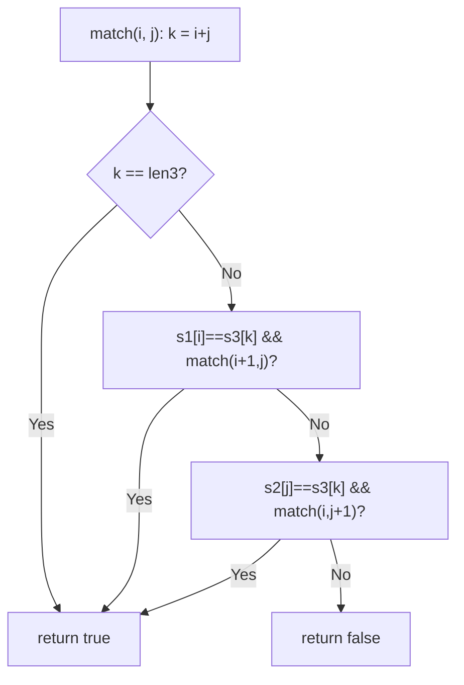
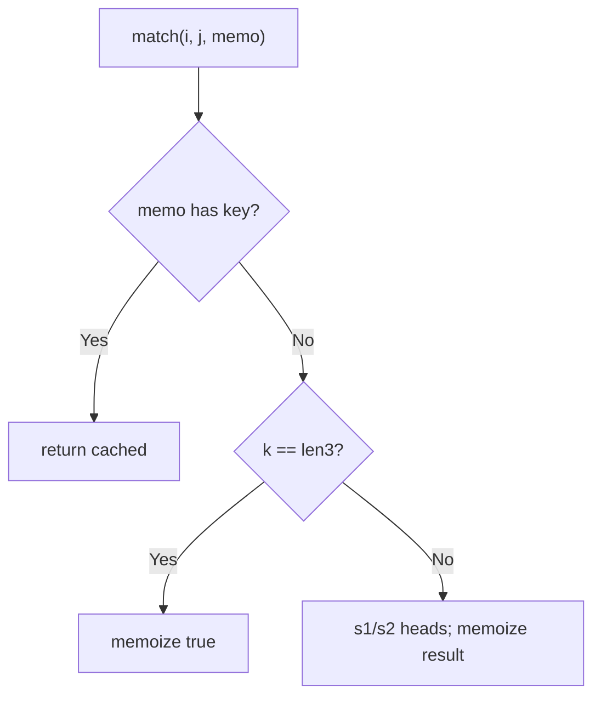

# 97. Interleaving String

- **LeetCode Link**: `https://leetcode.com/problems/interleaving-string/`
- **Difficulty**: Medium
- **Pattern Category**: Multidimensional DP / Two-Pointer Alignment
- **Prerequisite Primer**: `00-foundations/03-core-algorithmic-patterns.md`

---

## 1. Problem Overview & Edge Case Matrix

### Problem Statement
Given strings `s1`, `s2`, and `s3`, find whether `s3` is formed by an interleaving of `s1` and `s2`. An interleaving preserves the relative order of characters from each string: characters of `s1` appear in order within `s3`, and likewise for `s2`.

```
Example 1:
Input: s1 = "aabcc", s2 = "dbbca", s3 = "aadbbcbcac"
Output: true

Example 2:
Input: s1 = "aabcc", s2 = "dbbca", s3 = "aadbbbaccc"
Output: false

Example 3:
Input: s1 = "", s2 = "", s3 = ""
Output: true
```

### Visual Problem Representation
```
s1 = a a b c c      s3 = a a d b b c b c a c
s2 = d b b c a             ^ ^         ^ ^
                           s1 chars in order, s2 chars in order, interleaved
```

### Upfront Edge Case Matrix
| Edge Case Category | Specific Input Scenario | Expected Behavior | Pitfall / Risk |
| :--- | :--- | :--- | :--- |
| All empty | `"", "", ""` | Return `true` | Base table `[0][0]` |
| Length mismatch | `len(s3) ≠ len(s1)+len(s2)` | Return `false` immediately | Table built anyway |
| One side empty | `s1 = ""` | `s3 === s2` check | Loop over empty dimension |
| Tempting overlap | Ex.2 (shared prefixes diverge) | Return `false` | Greedy first-match (`aab` vs `dbb` choices) |
| Repeated chars | `"aaaa"` splits | Correct boolean | State explosion without memo |

---

## 2. Level 1: Brute Force Approach

### Intuition & Visual Idea
Two-pointer recursion: at each step, `s3[k]` (where `k = i+j`) must match `s1[i]` (advance `i`) or `s2[j]` (advance `j`) — try both on ambiguity. No memory: shared `(i,j)` states re-solved per path, $O(2^{m+n})$.



### Pseudocode
```text
FUNCTION isInterleaveBruteForce(s1, s2, s3):
    IF len(s1)+len(s2) != len(s3): RETURN false
    DEFINE match(i, j):
        k = i + j
        IF k == len(s3): RETURN true
        IF i < len(s1) AND s1[i] == s3[k] AND match(i+1, j): RETURN true
        IF j < len(s2) AND s2[j] == s3[k] AND match(i, j+1): RETURN true
        RETURN false
    RETURN match(0, 0)
```

### Step-by-Step Dry Run (Visual Trace)
| Step | Iteration / Pointer ($i, j$) | Current Value | State / Sub-array | Action Taken |
| :--- | :--- | :--- | :--- | :--- |
| 0 | `(0,0)`, `k=0` | `s3[0]='a'` | `s1[0]='a'` matches | Try `s1` first |
| 1 | `(1,0)`, `k=1` | `s3[1]='a'` | `s1[1]='a'` matches | Advance `s1` |
| 2 | `(2,0)`, `k=2` | `s3[2]='d'` | `s1[2]='b'` ✗, `s2[0]='d'` ✓ | Take `s2` |
| 3 | continues | alternating matches | — | Reaches `(5,5)` → `true` |

### Modern JavaScript Implementation
```javascript
/**
 * Level 1: Brute Force (two-pointer choice recursion)
 * Time Complexity:  O(2^(m+n)) — shared (i,j) states re-solved per path
 * Space Complexity: O(m + n) — call stack depth
 */
function isInterleaveBruteForce(s1, s2, s3) {
  if (s1.length + s2.length !== s3.length) return false;
  function match(i, j) {
    const k = i + j; // consumed count fixes the s3 position: no third index
    if (k === s3.length) return true; // all characters placed
    // Try s1's head, then s2's head (ambiguity explores both).
    if (i < s1.length && s1[i] === s3[k] && match(i + 1, j)) return true;
    if (j < s2.length && s2[j] === s3[k] && match(i, j + 1)) return true;
    return false;
  }
  return match(0, 0);
}
```

### Complexity Breakdown
- **Time Complexity**: $O(2^{m+n})$ — binary choice tree over the alignment.
- **Space Complexity**: $O(m + n)$ — stack depth; time is the catastrophe.

---

## 3. Level 2: Optimized Approach

### Intuition & Visual Bottleneck Elimination
Memoize `(i, j)`: only $O(m·n)$ distinct states, each solved once. Same recursion, table-free — the alignment-DP fix.



### Pseudocode
```text
FUNCTION isInterleaveMemo(s1, s2, s3, i = 0, j = 0, memo = MAP()):
    key = "i,j"
    IF memo HAS key: RETURN memo.GET(key)
    k = i + j
    IF k == len(s3): result = true
    ELSE:
        result = false
        IF i < len(s1) AND s1[i] == s3[k]: result ||= recurse(i+1, j)
        IF NOT result AND j < len(s2) AND s2[j] == s3[k]: result ||= recurse(i, j+1)
    memo.SET(key, result)
    RETURN result
```

### Step-by-Step Dry Run (Visual Trace)
| Step | Pointers / Window | Hash Map / Auxiliary State | Decision Logic | Output Accumulator |
| :--- | :--- | :--- | :--- | :--- |
| 0 | `(0,0)` | miss | Try both heads | Recurse |
| 1 | shared `(2,1)` | solved once | Second path hits memo | No recompute |
| 2 | dead `(4,3)`-style states | memoized `false` | Prune repeats | Backtrack fast |
| 3 | unwind | — | — | Return `true` |

### Modern JavaScript Implementation
```javascript
/**
 * Level 2: Optimized (top-down alignment memoization)
 * Time Complexity:  O(m·n) — each (i,j) state solved once
 * Space Complexity: O(m·n) — memo map plus O(m+n) stack
 */
function isInterleaveMemo(s1, s2, s3, i = 0, j = 0, memo = new Map()) {
  const key = i + ',' + j; // string key: coordinate pairs stay distinct
  if (memo.has(key)) return memo.get(key); // shared alignment: free
  const k = i + j;
  let result = false;
  if (k === s3.length) {
    result = true;
  } else {
    // Short-circuit ||: second head tried only if the first fails.
    if (i < s1.length && s1[i] === s3[k] && isInterleaveMemo(s1, s2, s3, i + 1, j, memo)) {
      result = true;
    } else if (j < s2.length && s2[j] === s3[k] && isInterleaveMemo(s1, s2, s3, i, j + 1, memo)) {
      result = true;
    }
  }
  memo.set(key, result);
  return result;
}
```

### Complexity Breakdown
- **Time Complexity**: $O(m·n)$ — one solve per alignment state.
- **Space Complexity**: $O(m·n)$ — memo map; tabulation keeps the table but drops the stack.

---

## 4. Level 3: Most Optimal / Canonical Approach

### Intuition & Mathematical / Invariant Proof
2D table: `dp[i][j]` = can `s1[0..i)` + `s2[0..j)` form `s3[0..i+j)$? Transitions: from top (`s1[i-1] === s3[i+j-1]`) or from left (`s2[j-1] === s3[i+j-1]`). Invariant: row-major fill guarantees both predecessors final when cell $(i,j)$ computes (top = previous row same column; left = same row previous column). Length pre-check rejects mismatches in $O(1)$. Answer `dp[m][n]$. ($O(n)$-space variant keeps one row + the left neighbor — same recurrence, rolling array.)

```
s1="aabcc", s2="dbbca", s3="aadbbcbcac": dp[5][5] = true (table fills to it)
```

### Pseudocode
```text
FUNCTION isInterleave(s1, s2, s3):
    m = len(s1); n = len(s2)
    IF m + n != len(s3): RETURN false
    dp = (m+1)×(n+1) FALSE; dp[0][0] = true
    FOR i IN 0 .. m:
        FOR j IN 0 .. n EXCEPT (0,0):
            k = i + j - 1   // s3 index consumed by prefixes (i, j)
            dp[i][j] = (i > 0 AND dp[i-1][j] AND s1[i-1] == s3[k])
                      OR (j > 0 AND dp[i][j-1] AND s2[j-1] == s3[k])
    RETURN dp[m][n]
```

### Step-by-Step Dry Run (Visual Trace)
| Step | Pointer $L$ | Pointer $R$ | Invariant Checked | In-Place State |
| :--- | :--- | :--- | :--- | :--- |
| 1 | `dp[0][0] = true` | length check `5+5=10` | Proceed | Base |
| 2 | row 0: `s2` vs `s3` prefix | `d≠a` at `j=1` → false row | Top-only transitions | `dp[0] = [T,F,…]` |
| 3 | fill interior | top/left + char gates | Predecessors final | Propagates |
| 4 | `dp[5][5]` | reachable | — | Return `true` |

### Modern JavaScript Implementation
```javascript
/**
 * Level 3: Most Optimal / Canonical (bottom-up alignment table)
 * Time Complexity:  O(m·n) — each cell computed once, optimal
 * Space Complexity: O(m·n) — full table (1D rolling cuts it to O(n))
 */
function isInterleave(s1, s2, s3) {
  const m = s1.length;
  const n = s2.length;
  // Length gate: interleavings preserve total length (O(1) reject).
  if (m + n !== s3.length) return false;
  const dp = Array.from({ length: m + 1 }, () => new Array(n + 1).fill(false));
  dp[0][0] = true; // empty + empty = empty
  for (let i = 0; i <= m; i++) {
    for (let j = 0; j <= n; j++) {
      if (i === 0 && j === 0) continue;
      const k = i + j - 1; // s3 index consumed by prefixes of length i, j
      // Top: extend s1's prefix (s1[i-1] must match the next s3 char).
      const fromTop = i > 0 && dp[i - 1][j] && s1[i - 1] === s3[k];
      // Left: extend s2's prefix symmetrically.
      const fromLeft = j > 0 && dp[i][j - 1] && s2[j - 1] === s3[k];
      dp[i][j] = fromTop || fromLeft;
    }
  }
  return dp[m][n];
}
```

### Complexity Breakdown
- **Time Complexity**: $O(m·n)$ — optimal; every alignment resolved once.
- **Space Complexity**: $O(m·n)$ — full table; 1D rolling (`dp[j]` + left neighbor) cuts it to $O(n)$.

---

## 5. JavaScript-Specific Gotchas & V8 Optimizations
- **GC Pressure**: Avoid allocating objects inside tight loops ($O(N)$ closures). Level 2's string-keyed `Map` ($m·n$ entries) is the pressure Level 3 removes — one preallocated table.
- **Type Coercion / Sorting**: `k = i + j` derives the s3 index arithmetically — never thread a third index parameter (desync risk); `dp` as real booleans (not `0/1`) keeps `fromTop || fromLeft` short-circuit semantics exact.
- **Index Bounds**: The length gate MUST precede table work (not just for speed — without it, `k` overruns `s3` and `s3[k]` reads `undefined`, failing closed but after wasted $O(m·n)$). `s1[i-1]`/`s2[j-1]` 1-based-table vs 0-based-string mapping is the classic off-by-one — guard with `i > 0`/`j > 0` first.

---

## 6. Real-World MAANG Interview Follow-Ups & Extensions

### Follow-Up 1: Return an actual interleaving (witness path)
- **Scenario**: Reconstruct WHICH characters came from which string, not just feasibility.
- **Solution Strategy**: Backtrack Level 3's table from `(m,n)` (prefer top/left by stored choice); emit the source labels. $O(m+n)$ reconstruction.
- **JS Code / Implementation Pattern**:
```javascript
function interleaveWitness(s1, s2, s3) {
  const dp = alignmentTable(s1, s2, s3); // Level 3 table retained
  return backtrackSources(dp, s1, s2, s3); // e.g. [1,1,2,1,2,...]
}
```

### Follow-Up 2: Shuffle of K strings / shuffle product
- **Scenario**: Is `s` a shuffle of $K$ given strings (formal shuffle-product membership)?
- **Solution Strategy**: $K$-dimensional DP over index tuples ($O(N^K)$ — exponential in $K$); for fixed small $K$ with memoization it's the direct generalization of Level 2.
- **JS Code / Implementation Pattern**:
```javascript
function isKInterleave(parts, target, memo = new Map()) {
  return kDimensionalMatch(parts, target, parts.map(() => 0), memo);
}
```

### Follow-Up 3: $10^9$-character streams with online verdicts
- **Scenario & In-Depth Solution**: All three strings stream; only a frontier fits in RAM. Anti-diagonal DP wavefront: cell $(i,j)$ needs only the previous anti-diagonal — stream `s3` while buffering $O(\min)$ frontier states. Verdicts per prefix emit online.
```javascript
async function interleaveStreamed(s1Stream, s2Stream, s3Stream) {
  return wavefrontVerdicts(s1Stream, s2Stream, s3Stream); // anti-diagonal sweep
}
```
