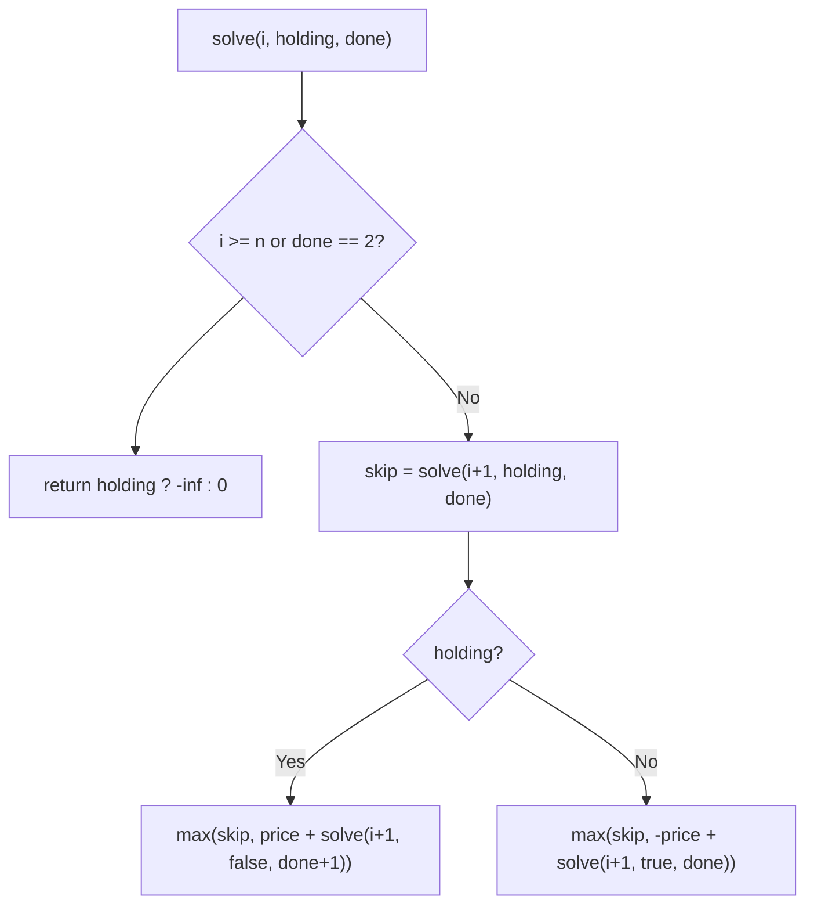
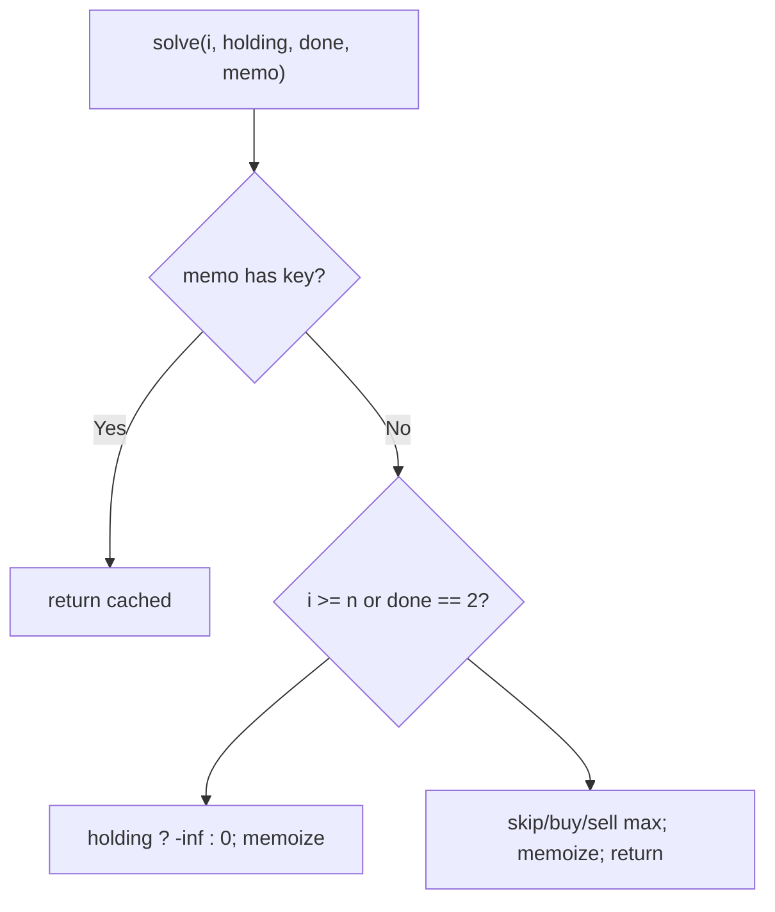
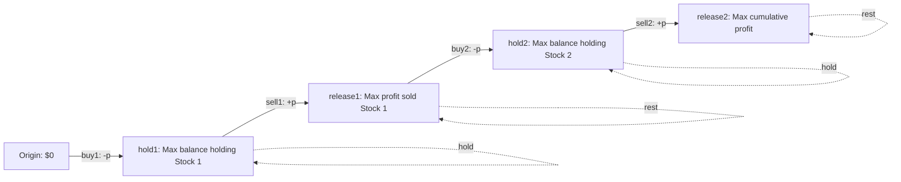

# 123. Best Time to Buy and Sell Stock III

- **LeetCode Link**: `https://leetcode.com/problems/best-time-to-buy-and-sell-stock-iii/`
- **Difficulty**: Hard
- **Pattern Category**: Multidimensional DP / Transaction State Machine
- **Prerequisite Primer**: `00-foundations/03-core-algorithmic-patterns.md`

---

## 1. Problem Overview & Edge Case Matrix

### Problem Statement
You are given an array `prices` where `prices[i]` is the price of a given stock on the `i`-th day. Find the maximum profit you can achieve with at most two transactions. You may not engage in multiple transactions simultaneously (you must sell before buying again).

```
Example 1:
Input: prices = [3,3,5,0,0,3,1,4]
Output: 6
Explanation: Buy day 4 (0), sell day 6 (3): +3. Buy day 7 (1), sell day 8 (4): +3. Total 6.

Example 2:
Input: prices = [1,2,3,4,5]
Output: 4
Explanation: One transaction (1 -> 5) suffices; the second adds nothing.

Example 3:
Input: prices = [7,6,4,3,1]
Output: 0
Explanation: No profitable transaction; do nothing.
```

### Visual Problem Representation
```
price:  3 3 5 0 0 3 1 4
  txn1:         ^   ^         buy 0, sell 3 (+3)
  txn2:               ^   ^   buy 1, sell 4 (+3)
```

### Upfront Edge Case Matrix
| Edge Case Category | Specific Input Scenario | Expected Behavior | Pitfall / Risk |
| :--- | :--- | :--- | :--- |
| No profit | Strictly decreasing | Return `0` (sit out) | Negative-profit "best" trade |
| One trade optimal | Strictly increasing | Single-span profit | Forcing two trades |
| Adjacent trades | Sell day `i`, buy day `i` | Allowed (no overlap) | Same-day exclusion bug |
| Tiny input | Length `0` / `1` | Return `0` | State init on empty |
| Same price runs | `[3,3,5,…]` | Unaffected | Buy/sell same-price churn |

---

## 2. Level 1: Brute Force Approach

### Intuition & Visual Idea
Day-by-day state recursion `(i, holding, done)`: skip, or buy/sell as legal. No memory — $O(3^N)$ re-solving of identical states.



### Pseudocode
```text
FUNCTION maxProfitBruteForce(prices):
    DEFINE solve(i, holding, done):
        IF i >= n OR done == 2: RETURN holding ? -Infinity : 0
        best = solve(i + 1, holding, done)   // SKIP day i
        IF holding: best = MAX(best, prices[i] + solve(i+1, false, done+1))
        ELSE: best = MAX(best, -prices[i] + solve(i+1, true, done))
        RETURN best
    RETURN solve(0, false, 0)
```

### Step-by-Step Dry Run (Visual Trace)
| Step | Iteration / Pointer ($i, j$) | Current Value | State / Sub-array | Action Taken |
| :--- | :--- | :--- | :--- | :--- |
| 0 | `(0, cash, 0)` | skip vs buy at `3` | Branch both | Recurse |
| 1 | buy paths | `-3 + future` | Holding subtrees | Deep exponential tree |
| 2 | `(i, …, 2)` | transactions spent | `0` (or `-inf` if holding) | Cap enforced |
| 3 | unwind maxes | — | — | Return `6` |

### Modern JavaScript Implementation
```javascript
/**
 * Level 1: Brute Force (state recursion, no memory)
 * Time Complexity:  O(3^N) — skip/buy/sell branching per day
 * Space Complexity: O(N) — call stack depth
 */
function maxProfitBruteForce(prices) {
  const n = prices.length;
  function solve(i, holding, done) {
    // Spent quota or past the end: flat cash is worth 0; forced holding is void.
    if (i >= n || done === 2) return holding ? -Infinity : 0;
    const skip = solve(i + 1, holding, done); // do nothing today
    if (holding) {
      // Sell: bank the price, consume one transaction.
      return Math.max(skip, prices[i] + solve(i + 1, false, done + 1));
    }
    // Buy: pay the price, enter holding (quota consumed at the SALE).
    return Math.max(skip, -prices[i] + solve(i + 1, true, done));
  }
  return solve(0, false, 0);
}
```

### Complexity Breakdown
- **Time Complexity**: $O(3^N)$ — three-way daily branching.
- **Space Complexity**: $O(N)$ — stack depth; time is the catastrophe.

---

## 3. Level 2: Optimized Approach

### Intuition & Visual Bottleneck Elimination
Memoize `(i, holding, done)`: $2·3·N$ distinct states, each solved once. Same recursion, $O(N)$ time — the state-machine DP fix.



### Pseudocode
```text
FUNCTION maxProfitMemo(prices, i = 0, holding = false, done = 0, memo = MAP()):
    key = "i,holding,done"
    IF memo HAS key: RETURN memo.GET(key)
    IF i >= n OR done == 2: result = (holding ? -Infinity : 0)
    ELSE:
        skip = recurse(i+1, holding, done)
        IF holding: result = MAX(skip, prices[i] + recurse(i+1, false, done+1))
        ELSE: result = MAX(skip, -prices[i] + recurse(i+1, true, done))
    memo.SET(key, result)
    RETURN result
```

### Step-by-Step Dry Run (Visual Trace)
| Step | Pointers / Window | Hash Map / Auxiliary State | Decision Logic | Output Accumulator |
| :--- | :--- | :--- | :--- | :--- |
| 0 | `(0, cash, 0)` | miss | Branch | Recurse |
| 1 | shared `(5, cash, 1)` | solved once | Later paths hit memo | No recompute |
| 2 | `(i, holding, 2)` | spent quota | `0` / `-inf` | Cap enforced |
| 3 | unwind maxes | — | — | Return `6` |

### Modern JavaScript Implementation
```javascript
/**
 * Level 2: Optimized (top-down state memoization)
 * Time Complexity:  O(N) — 6N states (i × holding × done), O(1) each
 * Space Complexity: O(N) — memo map plus O(N) stack
 */
function maxProfitMemo(prices, i = 0, holding = false, done = 0, memo = new Map()) {
  const key = i + ',' + holding + ',' + done; // full state as the cache key
  if (memo.has(key)) return memo.get(key); // solved state: free
  const n = prices.length;
  let result;
  if (i >= n || done === 2) {
    result = holding ? -Infinity : 0;
  } else {
    const skip = maxProfitMemo(prices, i + 1, holding, done, memo);
    if (holding) {
      result = Math.max(skip, prices[i] + maxProfitMemo(prices, i + 1, false, done + 1, memo));
    } else {
      result = Math.max(skip, -prices[i] + maxProfitMemo(prices, i + 1, true, done, memo));
    }
  }
  memo.set(key, result);
  return result;
}
```

### Complexity Breakdown
- **Time Complexity**: $O(N)$ — $6N$ states (the constant 6 = 2 holding × 3 done-values).
- **Space Complexity**: $O(N)$ — memo map; the state machine compresses to 4 numbers.

---

## 4. Level 3: Most Optimal / Canonical Approach

### Intuition & Mathematical / Invariant Proof
Four running variables — the two transactions unrolled: `buy1` (best balance after first buy), `sell1` (after first sale), `buy2` (after second buy), `sell2` (after second sale). Each price updates all four in dependency order (buy1 → sell1 → buy2 → sell2: later stages read today's earlier stages, allowing same-day sell+buy chains which are provably harmless — they net to holding through a zero-spread hop). Invariant: after day $d$, each variable holds the optimal balance achievable in its stage using days so far. Answer `sell2` (≥ 0 by the do-nothing initialization).

### Pseudocode
```text
FUNCTION maxProfit(prices):
    buy1 = -Infinity; sell1 = 0; buy2 = -Infinity; sell2 = 0
    FOR p IN prices:
        buy1 = MAX(buy1, -p)          // cheapest first entry so far
        sell1 = MAX(sell1, buy1 + p)  // best one-trade exit so far
        buy2 = MAX(buy2, sell1 - p)   // best second entry off first exit
        sell2 = MAX(sell2, buy2 + p)  // best two-trade exit: the answer
    RETURN sell2
```

### Step-by-Step Dry Run (Visual Trace)
| Step | Pointer $L$ | Pointer $R$ | Invariant Checked | In-Place State |
| :--- | :--- | :--- | :--- | :--- |
| 1 | after `3,3,5` | `buy1=-3, sell1=2` | Best one-trade: buy 3 sell 5 | Second stage dormant |
| 2 | price `0` | `buy1 = max(-3, 0) = 0` | Cheapest entry resets | `sell1` holds `2` |
| 3 | price `3` | `sell1 = max(2, 0+3) = 3` | One-trade now 3 | `buy2` activates |
| 4 | prices `1, 4` | `buy2 = 3-1 = 2`, `sell2 = 2+4 = 6` | Two-trade total | Return `6` |

### Modern JavaScript Implementation
```javascript
/**
 * Level 3: Most Optimal / Canonical (four-variable state machine)
 * Time Complexity:  O(N) — single pass, optimal lower bound
 * Space Complexity: O(1) auxiliary — four numbers
 */
function maxProfit(prices) {
  // Balances (not prices): buys are negative (money spent), sells bank profit.
  // -Infinity seeds force the first real price to initialize buys.
  let buy1 = -Infinity;
  let sell1 = 0; // doing nothing is always allowed: floor at 0
  let buy2 = -Infinity;
  let sell2 = 0;
  for (const p of prices) {
    // Dependency order matters: later stages read TODAY's earlier stages
    // (same-day sell→buy chains net to zero-spread hops: always safe).
    buy1 = Math.max(buy1, -p); // cheapest first entry so far
    sell1 = Math.max(sell1, buy1 + p); // best one-trade exit so far
    buy2 = Math.max(buy2, sell1 - p); // best second entry off first exit
    sell2 = Math.max(sell2, buy2 + p); // best two-trade exit: the answer
  }
  return sell2;
}
```

### Complexity Breakdown
- **Time Complexity**: $O(N)$ — optimal lower bound; each price updates four running bests.
- **Space Complexity**: $O(1)$ auxiliary — four numbers; the state machine IS the compression.

---

## 5. JavaScript-Specific Gotchas & V8 Optimizations
- **GC Pressure**: Avoid allocating objects inside tight loops ($O(N)$ closures). Level 2's string-keyed `Map` ($6N$ entries) is the pressure Level 3 removes — four locals, zero allocation.
- **Type Coercion / Sorting**: `-Infinity` seeds with `Math.max` compose exactly (any real number wins) — but NEVER seed buys at `0` (that models free shares and fabricates profit). `holding` as real `boolean` (not truthy/falsy) keeps memo keys (`"i,true,0"`) unambiguous.
- **Index Bounds**: No indices in Level 3 (for-of) — but UPDATE ORDER is its index-equivalent trap: computing `sell1` before `buy1` (or any stage before its dependency) reads yesterday's value and silently undercounts same-day chains. The `buy1 → sell1 → buy2 → sell2` order is load-bearing.

---

## 6. Real-World MAANG Interview Follow-Ups & Extensions

### Follow-Up 1: K transactions (Stock IV) and unlimited (Stock II)
- **Scenario**: Generalize to $k$ trades (LeetCode 188, next guide) or unlimited (fee/no-fee).
- **Solution Strategy**: Level 3's four variables ARE Stock IV with $k = 2$ — the general form keeps `buy[1..k]`, `sell[1..k]` arrays with the same dependency order; unlimited $k \ge n/2$ collapses to summing positive day-diffs.
- **JS Code / Implementation Pattern**:
```javascript
function maxProfitK(k, prices) {
  return maxProfitIV(k, prices); // next guide's Level 3
}
```

### Follow-Up 2: Cooldown and fees (state-machine extensions)
- **Scenario**: One-day cooldown after selling (LeetCode 309) or per-trade fee (LeetCode 714).
- **Solution Strategy**: Same skeleton, richer states: cooldown adds a `rest`/`cooldown` stage (`sell` feeds `cooldown`, `buy` reads yesterday's `cooldown`); fees subtract at sale time. States, not loops, absorb features.
- **JS Code / Implementation Pattern**:
```javascript
function maxProfitCooldown(prices) {
  let hold = -Infinity, sold = 0, rest = 0;
  for (const p of prices) {
    const prevSold = sold;
    sold = hold + p;
    hold = Math.max(hold, rest - p);
    rest = Math.max(rest, prevSold);
  }
  return Math.max(sold, rest);
}
```

### Follow-Up 3: $10^9$-tick stream with $O(1)$ RAM (online trading)
- **Scenario & In-Depth Solution**: Prices stream once; only running state fits in RAM. Level 3 IS the streaming answer — four numbers updated per tick, answer on demand. No other level adapts (recursion/memo need history or the full array).
```javascript
async function streamingMaxProfit2(priceStream) {
  let buy1 = -Infinity, sell1 = 0, buy2 = -Infinity, sell2 = 0;
  for await (const p of priceStream) {
    buy1 = Math.max(buy1, -p);
    sell1 = Math.max(sell1, buy1 + p);
    buy2 = Math.max(buy2, sell1 - p);
    sell2 = Math.max(sell2, buy2 + p);
  }
  return sell2;
}
```

---

## 7. What LeetCode Discuss Says (Language-Independent)

Source: top-voted post by weijiac —
`https://leetcode.com/problems/best-time-to-buy-and-sell-stock-iii/solutions/39611/is-it-best-solution-with-on-o1-by-weijia-a7ru/`
— 200.2K views.
Language-independent summary. No new JS here.

### A. Optimal way from Discuss (4-Variable State Machine DP)

Compress the 2-transaction market lifecycle into four scalar accumulator registers:

1. **State Machine Formulation:**
   At any trading day, an account constrained to at most two transactions resides in one of four balance stages:
   - `hold1`: Balance after buying the 1st stock (starts at $-\infty$, updated as $\max(hold1, -price)$).
   - `release1`: Profit after selling the 1st stock (starts at $0$, updated as $\max(release1, hold1 + price)$).
   - `hold2`: Reinvested balance after buying the 2nd stock (starts at $-\infty$, updated as $\max(hold2, release1 - price)$).
   - `release2`: Cumulative profit after completing the 2nd sale (starts at $0$, updated as $\max(release2, hold2 + price)$).
2. **Reverse State Propagation:**
   - By updating the states in reverse order (`release2` $\to$ `hold2` $\to$ `release1` $\to$ `hold1`), each stage consumes the prior day's values without intermediate shadow buffers.
   - Reinvesting zero profits on duplicate days incurs no penalty, automatically supporting cases where taking only one transaction yields the global maximum.

```text
FUNCTION maxProfit(prices):
    hold1 = -INFINITY
    hold2 = -INFINITY
    release1 = 0
    release2 = 0

    FOR EACH price IN prices:
        release2 = MAX(release2, hold2 + price)
        hold2    = MAX(hold2,    release1 - price)
        release1 = MAX(release1, hold1 + price)
        hold1    = MAX(hold1,    -price)

    RETURN release2
```

- Time: O(N) — single linear scan through the price series.
- Space: O(1) auxiliary space — 4 scalar primitive registers.



### B. Dry run on LeetCode Example 1 (`prices = [3,3,5,0,0,3,1,4]`)

- Init: `hold1 = -inf`, `release1 = 0`, `hold2 = -inf`, `release2 = 0`.
- Day 0 ($p = 3$): `hold1 = -3`, `release1 = 0`, `hold2 = -3`, `release2 = 0`.
- Day 1 ($p = 3$): Unchanged.
- Day 2 ($p = 5$):
  - `release2 = max(0, -3 + 5) = 2`
  - `hold2 = max(-3, 0 - 5) = -3`
  - `release1 = max(0, -3 + 5) = 2`
  - `hold1 = max(-3, -5) = -3`
- Day 3 ($p = 0$):
  - `hold2 = max(-3, 2 - 0) = 2` (reinvest 1st profit of 2 into stock priced at 0!)
  - `hold1 = max(-3, -0) = 0`
- Day 4 ($p = 0$): Unchanged.
- Day 5 ($p = 3$):
  - `release2 = max(2, 2 + 3) = 5`
  - `release1 = max(2, 0 + 3) = 3`
- Day 6 ($p = 1$):
  - `hold2 = max(2, 3 - 1) = 2`
- Day 7 ($p = 4$):
  - `release2 = max(5, 2 + 4) = 6`
- Return `release2 = 6`.

Final result: `6` (Buy at 3, sell at 5 [+2]; buy at 0, sell at 4 [+4]).

### C. Why Four Registers Replace Full 3D DP Arrays

- A traditional top-down formulation allocates $O(N \times 2 \times 2)$ entries for `dp[day][transactions_left][holding_flag]`.
- Because transition dependencies are purely local to day $t - 1$, the state collapses into four CPU register variables, eliminating all heap allocations.

### D. Pitfalls from comments

- **Update Order Inversion:** Updating `hold1` before `release1` can compute buying and selling on the exact same price tick. While mathematical profit from zero-delta trades is 0, reverse updating maintains clean separation.
- **Premature Resetting:** Never re-initialize `hold2` when `release1` updates; the `max` operation automatically retains the historical best reinvestment entry point.

### E. Companies

- Discuss post itself names none.
  Companies tab on LeetCode is premium-locked.
- External source:
  `https://github.com/liquidslr/leetcode-company-wise-problems`
  (LeetCode company tags, updated June 2025).
- All-time (14): Amazon, Apple, Bloomberg, Citadel, Goldman Sachs, Google, Infosys, Meta, Microsoft, PayPal, Snap, Tekion, TikTok, Visa.
- Recent: 30 days — None.
- Recent: 3 months — None.
