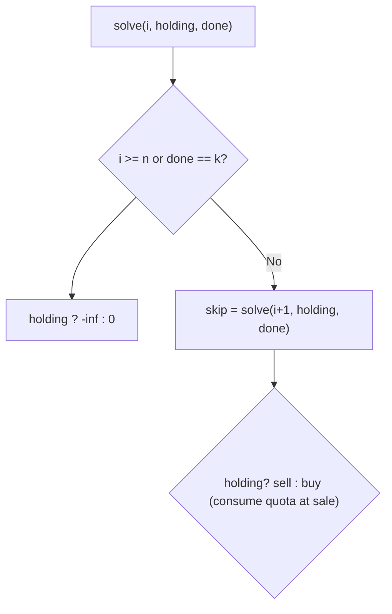
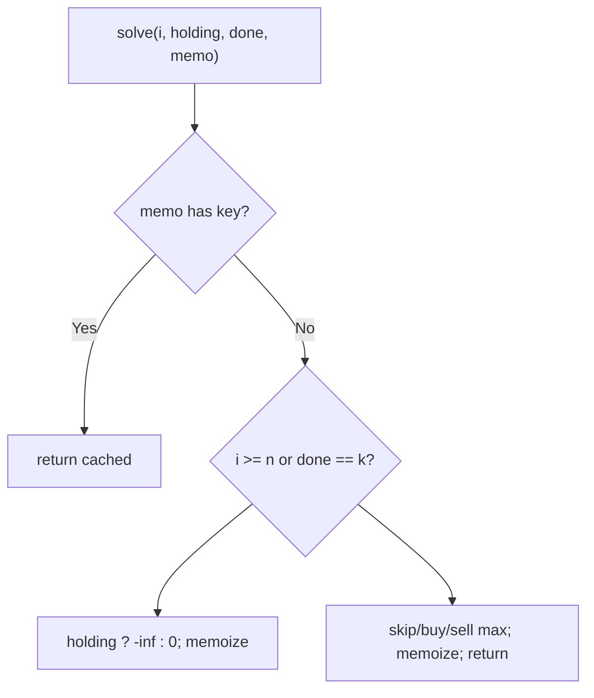

# 188. Best Time to Buy and Sell Stock IV

- **LeetCode Link**: `https://leetcode.com/problems/best-time-to-buy-and-sell-stock-iv/`
- **Difficulty**: Hard
- **Pattern Category**: Multidimensional DP / K-Transaction State Machine
- **Prerequisite Primer**: `00-foundations/03-core-algorithmic-patterns.md`

---

## 1. Problem Overview & Edge Case Matrix

### Problem Statement
You are given an integer array `prices` where `prices[i]` is the price of a given stock on the `i`-th day, and an integer `k`. Find the maximum profit you can achieve with at most `k` transactions. You may not engage in multiple transactions simultaneously (you must sell before buying again).

```
Example 1:
Input: k = 2, prices = [2,4,1]
Output: 2
Explanation: Buy day 1 (2), sell day 2 (4): profit 2.

Example 2:
Input: k = 2, prices = [3,2,6,5,0,3]
Output: 7
Explanation: Buy day 2 (2), sell day 3 (6): +4. Buy day 5 (0), sell day 6 (3): +3. Total 7.
```

### Visual Problem Representation
```
k = 2 generalizes Stock III's 4 variables to 2k running balances:
  buy[1..k], sell[1..k] with the same dependency order per price tick.
```

### Upfront Edge Case Matrix
| Edge Case Category | Specific Input Scenario | Expected Behavior | Pitfall / Risk |
| :--- | :--- | :--- | :--- |
| Zero trades | `k = 0` | Return `0` | Loop over empty transaction set |
| Empty prices | `prices = []` | Return `0` | State init on empty |
| Unlimited effectively | `k ≥ n/2` | Sum of positive day-diffs | Running full DP anyway (still correct, wasteful) |
| No profit | Strictly decreasing | Return `0` | Negative-profit trades |
| Single day | `n = 1` | Return `0` | Buy without a later sale |

---

## 2. Level 1: Brute Force Approach

### Intuition & Visual Idea
The Stock III state recursion generalized to quota `k`: skip, buy, or sell per day with no memory. $O(3^N)$ — identical shape, parametric cap.



### Pseudocode
```text
FUNCTION maxProfitBruteForce(k, prices):
    DEFINE solve(i, holding, done):
        IF i >= n OR done == k: RETURN holding ? -Infinity : 0
        best = solve(i + 1, holding, done)
        IF holding: best = MAX(best, prices[i] + solve(i+1, false, done+1))
        ELSE: best = MAX(best, -prices[i] + solve(i+1, true, done))
        RETURN best
    RETURN solve(0, false, 0)
```

### Step-by-Step Dry Run (Visual Trace)
| Step | Iteration / Pointer ($i, j$) | Current Value | State / Sub-array | Action Taken |
| :--- | :--- | :--- | :--- | :--- |
| 0 | `(0, cash, 0)` on `[2,4,1]` | skip vs buy at `2` | Branch both | Recurse |
| 1 | buy path | `-2 + future` | Holding subtrees | Deep tree |
| 2 | `(i, …, 2)` | quota spent | `0` / `-inf` | Cap enforced |
| 3 | unwind maxes | best `2` (`2→4`) | — | Return `2` |

### Modern JavaScript Implementation
```javascript
/**
 * Level 1: Brute Force (parametric state recursion, no memory)
 * Time Complexity:  O(3^N) — three-way daily branching
 * Space Complexity: O(N) — call stack depth
 */
function maxProfitBruteForce(k, prices) {
  const n = prices.length;
  function solve(i, holding, done) {
    // Spent quota or past the end: flat cash is 0; forced holding is void.
    if (i >= n || done === k) return holding ? -Infinity : 0;
    const skip = solve(i + 1, holding, done); // do nothing today
    if (holding) {
      return Math.max(skip, prices[i] + solve(i + 1, false, done + 1));
    }
    return Math.max(skip, -prices[i] + solve(i + 1, true, done));
  }
  return solve(0, false, 0);
}
```

### Complexity Breakdown
- **Time Complexity**: $O(3^N)$ — three-way branching per day.
- **Space Complexity**: $O(N)$ — stack depth; time is the catastrophe.

---

## 3. Level 2: Optimized Approach

### Intuition & Visual Bottleneck Elimination
Memoize `(i, holding, done)`: $2·(k+1)·N$ states, each solved once. Same recursion, $O(N·k)$ time — the parametric memo fix.



### Pseudocode
```text
FUNCTION maxProfitMemo(k, prices, i = 0, holding = false, done = 0, memo = MAP()):
    key = "i,holding,done"
    IF memo HAS key: RETURN memo.GET(key)
    IF i >= n OR done == k: result = (holding ? -Infinity : 0)
    ELSE:
        skip = recurse(i+1, holding, done)
        IF holding: result = MAX(skip, prices[i] + recurse(i+1, false, done+1))
        ELSE: result = MAX(skip, -prices[i] + recurse(i+1, true, done))
    memo.SET(key, result)
    RETURN result
```

### Step-by-Step Dry Run (Visual Trace)
| Step | Pointers / Window | Hash Map / Auxiliary State | Decision Logic | Output Accumulator |
| :--- | :--- | :--- | :--- | :--- |
| 0 | `(0, cash, 0)` | miss | Branch | Recurse |
| 1 | shared `(3, cash, 1)` | solved once | Later paths hit memo | No recompute |
| 2 | `(i, holding, k)` | quota spent | `0` / `-inf` | Cap enforced |
| 3 | unwind maxes | — | — | Return `7` (ex.2) |

### Modern JavaScript Implementation
```javascript
/**
 * Level 2: Optimized (top-down parametric memoization)
 * Time Complexity:  O(N·k) — 2(k+1)N states, O(1) each
 * Space Complexity: O(N·k) — memo map plus O(N) stack
 */
function maxProfitMemo(k, prices, i = 0, holding = false, done = 0, memo = new Map()) {
  const key = i + ',' + holding + ',' + done; // full state as the cache key
  if (memo.has(key)) return memo.get(key); // solved state: free
  const n = prices.length;
  let result;
  if (i >= n || done === k) {
    result = holding ? -Infinity : 0;
  } else {
    const skip = maxProfitMemo(k, prices, i + 1, holding, done, memo);
    if (holding) {
      result = Math.max(skip, prices[i] + maxProfitMemo(k, prices, i + 1, false, done + 1, memo));
    } else {
      result = Math.max(skip, -prices[i] + maxProfitMemo(k, prices, i + 1, true, done, memo));
    }
  }
  memo.set(key, result);
  return result;
}
```

### Complexity Breakdown
- **Time Complexity**: $O(N·k)$ — $2(k+1)N$ states.
- **Space Complexity**: $O(N·k)$ — memo map; the arrays compress to $O(k)$.

---

## 4. Level 3: Most Optimal / Canonical Approach

### Intuition & Mathematical / Invariant Proof
Parametric four-variable machine: `buy[1..k]`, `sell[1..k]` arrays with the Stock III dependency order generalized — for each price, for `t = 1..k`: `buy[t] = max(buy[t], sell[t-1] - p)`, `sell[t] = max(sell[t], buy[t] + p)`. Invariant: after each price, `buy[t]`/`sell[t]` hold the optimal balances using ≤ $t$ trades over days so far (induction on prices × $t$: every transition reads today's dependency — `sell[t-1]` — before it updates... careful: `sell[t-1]` for the CURRENT price was already updated this tick, which allows same-day chaining — provably harmless as in Stock III). Plus the unlimited shortcut: $k \ge n/2$ means every profitable day-diff is takeable (at most $\lfloor n/2 \rfloor$ non-overlapping profitable pairs exist), so sum positive diffs in $O(N)$. Answer `sell[k]$.

```
k=2, [3,2,6,5,0,3]: buy=[-,-3...] evolves; sell[2] ends at 7 (4 + 3)
```

### Pseudocode
```text
FUNCTION maxProfit(k, prices):
    n = prices.LENGTH
    IF n <= 1 OR k == 0: RETURN 0
    IF k >= n / 2:   // effectively unlimited: take every uptick
        profit = 0
        FOR i IN 1 .. n-1:
            IF prices[i] > prices[i-1]: profit += prices[i] - prices[i-1]
        RETURN profit
    buy = ARRAY(k+1, -Infinity); sell = ARRAY(k+1, 0)
    FOR p IN prices:
        FOR t IN 1 .. k:
            buy[t] = MAX(buy[t], sell[t-1] - p)
            sell[t] = MAX(sell[t], buy[t] + p)
    RETURN sell[k]
```

### Step-by-Step Dry Run (Visual Trace)
| Step | Pointer $L$ | Pointer $R$ | Invariant Checked | In-Place State |
| :--- | :--- | :--- | :--- | :--- |
| 1 | ex.1: `k=2`, `n=3` | `2 ≥ 1.5`: unlimited path | Sum upticks: `4-2 = 2` | Return `2` |
| 2 | ex.2: `n=6`, `k=2 < 3` | DP path | Arrays evolve per price | `sell[2]` climbs |
| 3 | final prices | `+4` then `+3` captured | — | Return `7` |

### Modern JavaScript Implementation
```javascript
/**
 * Level 3: Most Optimal / Canonical (parametric state arrays + shortcut)
 * Time Complexity:  O(N·k) — O(N) in the unlimited regime
 * Space Complexity: O(k) — two arrays; O(1) in the unlimited regime
 */
function maxProfit(k, prices) {
  const n = prices.length;
  if (n <= 1 || k === 0) return 0;
  // Unlimited regime: at most floor(n/2) profitable pairs exist, so k covers
  // everything — sum every uptick in one pass (this is Stock II's kernel).
  if (k >= n / 2) {
    let profit = 0;
    for (let i = 1; i < n; i++) {
      if (prices[i] > prices[i - 1]) profit += prices[i] - prices[i - 1];
    }
    return profit;
  }
  // Balances per trade count: buy[t]/sell[t] use ≤ t trades (index 0 unused).
  const buy = new Array(k + 1).fill(-Infinity);
  const sell = new Array(k + 1).fill(0);
  for (const p of prices) {
    // t ascending: sell[t-1] is today's (same-day chains net harmlessly).
    for (let t = 1; t <= k; t++) {
      buy[t] = Math.max(buy[t], sell[t - 1] - p);
      sell[t] = Math.max(sell[t], buy[t] + p);
    }
  }
  return sell[k];
}
```

### Complexity Breakdown
- **Time Complexity**: $O(N·k)$ — $O(N)$ in the unlimited regime; optimal for bounded trades.
- **Space Complexity**: $O(k)$ — two arrays; $O(1)$ in the unlimited regime.

---

## 5. JavaScript-Specific Gotchas & V8 Optimizations
- **GC Pressure**: Avoid allocating objects inside tight loops ($O(N)$ closures). Level 2's string-keyed `Map` ($2kN$ entries) is the pressure Level 3 removes — two reused arrays.
- **Type Coercion / Sorting**: `-Infinity` seeds with `Math.max` compose exactly; `k >= n / 2` float comparison is safe (halves are exact in doubles for these magnitudes). `new Array(k+1).fill(-Infinity)` (not `.fill([])`-style shared refs — primitives are safe, objects would alias).
- **Index Bounds**: The `t` loop runs `1..k` ASCENDING using `sell[t-1]` — today's value (same-day chaining, intended). Descending `t` would read yesterday's `sell[t-1]` and silently forbid same-day chains (still correct answers in most cases, but a different — and wrongly justified — algorithm). `k = 0` early-returns before array work.

---

## 6. Real-World MAANG Interview Follow-Ups & Extensions

### Follow-Up 1: Stock III as the k=2 special case (module arc)
- **Scenario**: Unify this guide with Stock III (123, previous file).
- **Solution Strategy**: Stock III's four variables ARE `buy[1..2]`/`sell[1..2]` unrolled — present the general form first, then specialize. One mental model, two problems.
- **JS Code / Implementation Pattern**:
```javascript
function maxProfitIII(prices) {
  return maxProfit(2, prices); // Stock III falls out of Stock IV
}
```

### Follow-Up 2: Fees, cooldowns, and short positions (state enrichment)
- **Scenario**: Per-trade fees, cooldowns (309/714 patterns), or long/short books.
- **Solution Strategy**: Same arrays, richer transitions: fees subtract at sale (`sell[t] = max(sell[t], buy[t] + p - fee)`); cooldowns read yesterday's `sell` (keep a snapshot); shorts mirror with sign-flipped legs.
- **JS Code / Implementation Pattern**:
```javascript
function maxProfitWithFee(k, prices, fee) {
  return parametricMachine(k, prices, (buy, sell, p) => sell + p - fee);
}
```

### Follow-Up 3: $10^9$-tick stream with adaptive k (online trading desk)
- **Scenario & In-Depth Solution**: Prices stream; only $O(k)$ state fits. Level 3 IS the streaming answer (arrays updated per tick, answer on demand). Adaptive $k$: track the unlimited-regime uptick count — when remaining quota exceeds remaining profitable pairs, switch to the shortcut mid-stream.
```javascript
async function streamingMaxProfitK(k, priceStream) {
  const buy = new Array(k + 1).fill(-Infinity);
  const sell = new Array(k + 1).fill(0);
  for await (const p of priceStream) {
    for (let t = 1; t <= k; t++) {
      buy[t] = Math.max(buy[t], sell[t - 1] - p);
      sell[t] = Math.max(sell[t], buy[t] + p);
    }
  }
  return sell[k];
}
```
