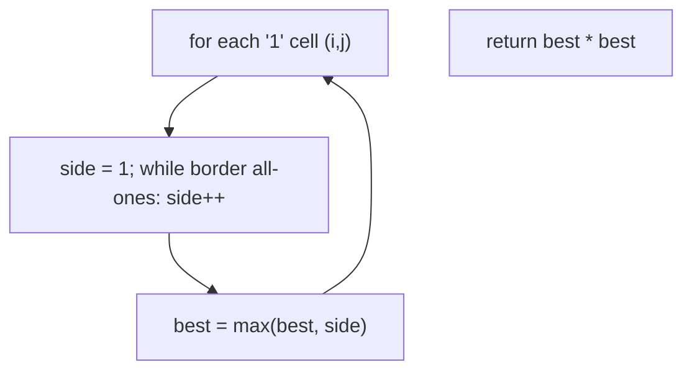
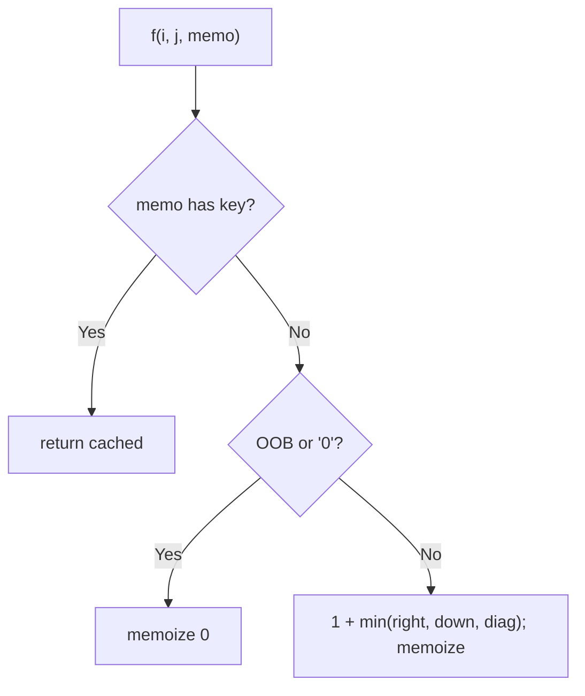
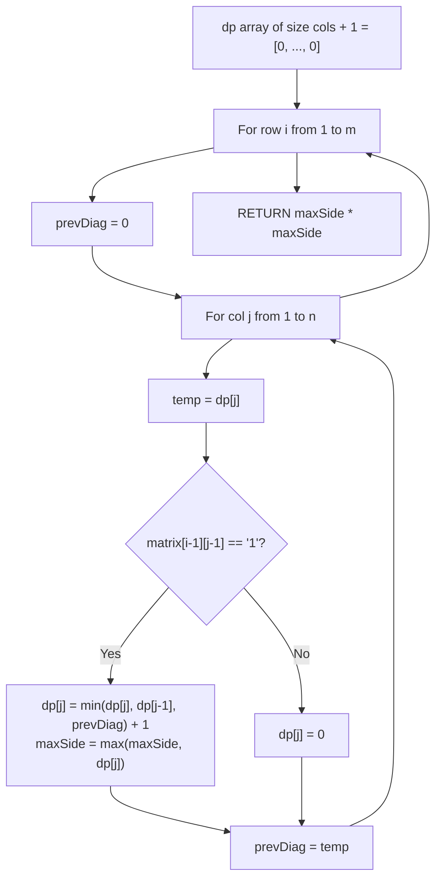

# 221. Maximal Square

- **LeetCode Link**: `https://leetcode.com/problems/maximal-square/`
- **Difficulty**: Medium
- **Pattern Category**: Multidimensional DP / Square Extension Recurrence
- **Prerequisite Primer**: `00-foundations/03-core-algorithmic-patterns.md`

---

## 1. Problem Overview & Edge Case Matrix

### Problem Statement
Given an `m x n` binary matrix filled with `0`'s and `1`'s, find the largest square containing only `1`'s and return its area.

```
Example 1:
Input: matrix = [["1","0","1","0","0"],["1","0","1","1","1"],["1","1","1","1","1"],["1","0","0","1","0"]]
Output: 4
Explanation: The 2×2 square of 1's has area 4.

Example 2:
Input: matrix = [["0","1"],["1","0"]]
Output: 1

Example 3:
Input: matrix = [["0"]]
Output: 0
```

### Visual Problem Representation
```
  1 0 1 0 0
  1 0 1 1 1        biggest all-1 square: rows 1-2, cols 2-3 (2x2)
  1 1 1 1 1  ->    area 4
  1 0 0 1 0
```

### Upfront Edge Case Matrix
| Edge Case Category | Specific Input Scenario | Expected Behavior | Pitfall / Risk |
| :--- | :--- | :--- | :--- |
| Empty (defensive) | `matrix = []` | Return `0` | `matrix[0]` access |
| Single cell | `[["1"]]` / `[["0"]]` | `1` / `0` | Neighbor reads on 1×1 |
| Single row/col | `1×n` / `m×1` | `1` if any `1` | 2D recurrence needing neighbors |
| All zeros | Zero matrix | Return `0` | `best` seeded at 1 |
| All ones | $m×n$ ones | `min(m,n)²` | Border-only logic |

---

## 2. Level 1: Brute Force Approach

### Intuition & Visual Idea
From every `1` cell, expand the square border by border — each expansion checks the new bottom row and right column for all-ones. $O(m·n·\min(m,n)^2)$ worst case — correct, glacial.



### Pseudocode
```text
FUNCTION maximalSquareBruteForce(matrix):
    IF EMPTY: RETURN 0
    best = 0
    FOR EACH cell (i, j) WITH "1":
        side = 1; best = MAX(best, 1)
        WHILE square (i,j,side+1) INSIDE AND new border ALL ONES:
            side++; best = MAX(best, side)
    RETURN best * best
```

### Step-by-Step Dry Run (Visual Trace)
| Step | Iteration / Pointer ($i, j$) | Current Value | State / Sub-array | Action Taken |
| :--- | :--- | :--- | :--- | :--- |
| 0 | cell `(0,0)` | single `1` | `best = 1` | Border check fails (neighbor `0`) |
| 1 | cell `(1,2)` | single `1` | Expand to side 2 | Border row+col all ones |
| 2 | side 3 attempt | hits `0`/edge | Stop | `best = 2` |
| 3 | remaining cells | no bigger square | — | Return `2² = 4` |

### Modern JavaScript Implementation
```javascript
/**
 * Level 1: Brute Force (border-expansion per cell)
 * Time Complexity:  O(m·n·min(m,n)²) — border re-verification per expansion
 * Space Complexity: O(1) — counters only
 */
function maximalSquareBruteForce(matrix) {
  const m = matrix.length;
  if (m === 0) return 0;
  const n = matrix[0].length;
  let best = 0; // side length (squared at return)
  for (let i = 0; i < m; i++) {
    for (let j = 0; j < n; j++) {
      if (matrix[i][j] !== '1') continue;
      if (best < 1) best = 1;
      // Grow: the new bottom row (i+side, j..j+side) AND right column
      // (i..i+side-1, j+side) must be all ones.
      let side = 1;
      while (i + side < m && j + side < n) {
        let ok = true;
        for (let k = 0; k <= side; k++) {
          if (matrix[i + side][j + k] !== '1' || matrix[i + k][j + side] !== '1') {
            ok = false;
            break;
          }
        }
        if (!ok) break;
        side++;
        if (side > best) best = side;
      }
    }
  }
  return best * best;
}
```

### Complexity Breakdown
- **Time Complexity**: $O(m·n·\min(m,n)^2)$ — borders re-verified per cell per size.
- **Space Complexity**: $O(1)$ — counters; time is the catastrophe.

---

## 3. Level 2: Optimized Approach

### Intuition & Visual Bottleneck Elimination
Memoize `f(i,j)` = side of the largest all-1 square with top-left at $(i,j)$: `0` on `0`-cells, else $1 + \min(\text{right}, \text{down}, \text{diag})$. Each cell solved once — $O(m·n)$ time. The recurrence works because a square of side $s+1$ needs all three neighbors to host side-$s$ squares.



### Pseudocode
```text
FUNCTION maximalSquareMemo(matrix):
    IF EMPTY: RETURN 0
    best = 0
    DEFINE f(i, j):
        IF OOB OR matrix[i][j] == "0": RETURN 0
        IF memo HAS (i,j): RETURN memo.GET
        v = 1 + MIN(f(i+1,j), f(i,j+1), f(i+1,j+1))
        memo.SET((i,j), v); best = MAX(best, v)
        RETURN v
    FOR EACH cell: f(i, j)   // ensure every component is solved
    RETURN best * best
```

### Step-by-Step Dry Run (Visual Trace)
| Step | Pointers / Window | Hash Map / Auxiliary State | Decision Logic | Output Accumulator |
| :--- | :--- | :--- | :--- | :--- |
| 0 | `f(3,3)` on ex.1 | leaf-ish `1` | `1 + min(0s) = 1` | Memoized |
| 1 | `f(2,3)`, `f(2,2)`, `f(1,3)` | mixes of `1` and `0` neighbors | Each resolves to `1` | Memoized |
| 2 | `f(1,2)` | right `1`, down `1`, diag `1` | `1 + 1 = 2` | `best = 2` → area `4` |

### Modern JavaScript Implementation
```javascript
/**
 * Level 2: Optimized (top-down square-side memoization)
 * Time Complexity:  O(m·n) — each cell solved once
 * Space Complexity: O(m·n) — memo map plus O(m+n) stack
 */
function maximalSquareMemo(matrix) {
  const m = matrix.length;
  if (m === 0) return 0;
  const n = matrix[0].length;
  const memo = new Map();
  let best = 0;
  function f(i, j) {
    // Void and zeros host no square.
    if (i >= m || j >= n || matrix[i][j] !== '1') return 0;
    const key = i + ',' + j; // string key: coordinate pairs stay distinct
    if (memo.has(key)) return memo.get(key); // shared cell: free
    // A side-(s+1) square needs side-s squares right, down, AND diagonal.
    const v = 1 + Math.min(f(i + 1, j), f(i, j + 1), f(i + 1, j + 1));
    memo.set(key, v);
    if (v > best) best = v;
    return v;
  }
  for (let i = 0; i < m; i++) {
    for (let j = 0; j < n; j++) {
      if (matrix[i][j] === '1') f(i, j); // seed every live component
    }
  }
  return best * best;
}
```

### Complexity Breakdown
- **Time Complexity**: $O(m·n)$ — one solve per cell.
- **Space Complexity**: $O(m·n)$ — memo map; tabulation compresses to one row.

---

## 4. Level 3: Most Optimal / Canonical Approach

### Intuition & Mathematical / Invariant Proof
Bottom-up 1D tabulation of the same recurrence, processing top-left to bottom-right: `dp[j]` carries the previous row (top term); a `prev` variable carries the diagonal (previous row's `dp[j-1]`, saved before overwrite); `dp[j-1]` is this row's left term (already updated). Invariant: at cell $(i,j)$ (1-based), all three neighbors are final — top (`dp[j]`, untouched this row), left (`dp[j-1]$, updated), diag (`prev`, saved). Zeros reset to 0 (breaking squares cleanly). Answer = max side squared.

```
ex.1 row 2 (0-based): dp folds to [1,1,1,2,1]-ish; best side 2 -> area 4
```

### Pseudocode
```text
FUNCTION maximalSquare(matrix):
    IF EMPTY: RETURN 0
    m = ROWS; n = COLS
    dp = ARRAY(n+1, 0); best = 0
    FOR i IN 1 .. m:
        prev = 0                     // diagonal resets per row (dp[j-1] of prev row)
        FOR j IN 1 .. n:
            tmp = dp[j]              // save top BEFORE overwrite
            IF matrix[i-1][j-1] == "1":
                dp[j] = 1 + MIN(dp[j], dp[j-1], prev)
                best = MAX(best, dp[j])
            ELSE:
                dp[j] = 0            // zero breaks every square through here
            prev = tmp               // becomes next cell's diagonal
    RETURN best * best
```

### Step-by-Step Dry Run (Visual Trace)
| Step | Pointer $L$ | Pointer $R$ | Invariant Checked | In-Place State |
| :--- | :--- | :--- | :--- | :--- |
| 1 | row 1 `[1,0,1,0,0]` | fold | `dp = [1,0,1,0,0]`, best `1` | First row = self |
| 2 | row 2, `j=3` | `1 + min(0,1,0)`… | Cell `(1,2)`: top `1`, left `0`, diag `1` → `1` | No false square |
| 3 | row 3 | `(2,2)`: top `1`, left `1`, diag `1` → `2` | Genuine 2×2 | `best = 2` |
| 4 | return | — | — | `2² = 4` |

### Modern JavaScript Implementation
```javascript
/**
 * Level 3: Most Optimal / Canonical (1D rolling square-side table)
 * Time Complexity:  O(m·n) — each cell folded once, optimal
 * Space Complexity: O(n) — one row plus two scalars
 */
function maximalSquare(matrix) {
  const m = matrix.length;
  if (m === 0) return 0;
  const n = matrix[0].length;
  const dp = new Array(n + 1).fill(0);
  let best = 0; // side length (squared at return)
  for (let i = 1; i <= m; i++) {
    let prev = 0; // diagonal: previous row's dp[j-1]; resets per row
    for (let j = 1; j <= n; j++) {
      const tmp = dp[j]; // save top BEFORE this cell overwrites it
      if (matrix[i - 1][j - 1] === '1') {
        // dp[j] = top (prev row), dp[j-1] = left (this row), prev = diag.
        dp[j] = 1 + Math.min(dp[j], dp[j - 1], prev);
        if (dp[j] > best) best = dp[j];
      } else {
        dp[j] = 0; // zero cell: no square ends here (seals cleanly)
      }
      prev = tmp; // this cell's old top = next cell's diagonal
    }
  }
  return best * best;
}
```

### Complexity Breakdown
- **Time Complexity**: $O(m·n)$ — optimal; every cell folded once.
- **Space Complexity**: $O(n)$ — one row plus two scalars; the follow-up's bound.

---

## 5. JavaScript-Specific Gotchas & V8 Optimizations
- **GC Pressure**: Avoid allocating objects inside tight loops ($O(N)$ closures). Level 2's string-keyed `Map` ($m·n$ entries) is the pressure Level 3 removes — one reused array.
- **Type Coercion / Sorting**: Cells are `"1"`/`"0"` STRINGS — `=== '1'` strict (truthy checks pass `"0"` too, since non-empty strings are truthy!). `best * best` converts side to area exactly once, at the end.
- **Index Bounds**: The `n+1`-wide `dp` with 1-based loops absorbs all boundary reads (`dp[0]` stays 0 = virtual zero border) — no `i-1`/`j-1` guards needed inside the kernel. `prev` MUST reset per row (`= 0` at each `i`): stale diagonals from the previous row's tail corrupt the new row's head.

---

## 6. Real-World MAANG Interview Follow-Ups & Extensions

### Follow-Up 1: Maximal rectangle (not just square)
- **Scenario**: Largest all-1 RECTANGLE (LeetCode 85, Hard).
- **Solution Strategy**: Histogram per row (heights of consecutive ones) + largest-rectangle-in-histogram via monotonic stack — Level 3's row sweep generalizes from squares to skylines.
- **JS Code / Implementation Pattern**:
```javascript
function maximalRectangle(matrix) {
  return maxOverRows(rowHistograms(matrix), largestRectangleArea);
}
```

### Follow-Up 2: Count all square submatrices (not just max)
- **Scenario**: Return the COUNT of all-1 squares (LeetCode 1277).
- **Solution Strategy**: Same table — every cell's `dp` value EQUALS the number of squares ending there; sum the table instead of maxing it. One-word change, different question.
- **JS Code / Implementation Pattern**:
```javascript
function countSquares(matrix) {
  return sumTableEntries(squareSideTable(matrix)); // sum, not max
}
```

### Follow-Up 3: $10^9$-cell binary image with sparse ones
- **Scenario & In-Depth Solution**: The matrix never fits in RAM; ones are sparse. Store one-coordinates in a spatial index (sorted row runs); candidate squares anchor at ones and verify borders via range queries ($O(\log K)$ per border with sorted runs). Work scales with ones, not cells.
```javascript
function sparseMaximalSquare(oneRuns) {
  return maxOverAnchors(oneRuns, verifyBorders); // border checks via runs
}
```

---

## 7. What LeetCode Discuss Says (Language-Independent)

Source: top-voted post by arkaung —
`https://leetcode.com/problems/maximal-square/solutions/600149/python-thinking-process-diagrams-dp-appr-5i49/`
— 81.9K views.
Language-independent summary. No new JS here.

### A. Optimal way from Discuss (1D Rolling DP with Diagonal Snapshot)

Compress the 2D square-extension DP matrix into a single 1D buffer:

1. **Geometric Extension Condition:**
   - For cell $(i, j)$ containing `'1'` to form the bottom-right corner of an all-1 square of size $K + 1$, all three surrounding sub-squares of size $K$ must coexist:
     - Top neighbor $(i - 1, j)$
     - Left neighbor $(i, j - 1)$
     - Top-left diagonal neighbor $(i - 1, j - 1)$
   - Recurrence relation:
     $$dp[i][j] = \min(dp[i - 1][j], dp[i][j - 1], dp[i - 1][j - 1]) + 1$$
     If $matrix[i][j] == \text{'0'}$, then $dp[i][j] = 0$.
2. **Space Compression to 1D:**
   - Allocate a single 1D array `dp` of size $N + 1$ initialized to 0 (where $N = cols$).
   - As we scan row-by-row, track the top-left diagonal with a scalar register `prevDiag`.
   - At each column $j$, save `temp = dp[j]` (the vertical neighbor before write), update `dp[j]`, and assign `prevDiag = temp` for the next column.
   - Return $maxSide^2$.

```text
FUNCTION maximalSquare(matrix):
    IF matrix IS EMPTY:
        RETURN 0

    m = NUM_ROWS(matrix)
    n = NUM_COLS(matrix)
    dp = ARRAY OF SIZE (n + 1) FILLED WITH 0
    maxSide = 0

    FOR i FROM 1 TO m:
        prevDiag = 0
        FOR j FROM 1 TO n:
            temp = dp[j]
            IF matrix[i - 1][j - 1] == '1':
                dp[j] = MIN(dp[j], MIN(dp[j - 1], prevDiag)) + 1
                maxSide = MAX(maxSide, dp[j])
            ELSE:
                dp[j] = 0
            prevDiag = temp

    RETURN maxSide * maxSide
```

- Time: O(M * N) — single scan visiting each matrix element once.
- Space: O(N) auxiliary space using a 1D array of width $cols + 1$.



### B. Dry run on LeetCode Example 1 (`matrix = [["1","0","1","0","0"],["1","0","1","1","1"],["1","1","1","1","1"],["1","0","0","1","0"]]`)

- $M = 4, N = 5$. `dp` of size 6 initialized to 0.
- Row 1: `dp = [0, 1, 0, 1, 0, 0]`. `maxSide = 1`.
- Row 2: `dp = [0, 1, 0, 1, 1, 1]`. `maxSide = 1`.
- Row 3:
  - $j = 1$: $matrix[2][0] = \text{'1'} \implies dp[1] = 1$.
  - $j = 2$: $matrix[2][1] = \text{'1'} \implies \min(0, 1, 0) + 1 = 1$.
  - $j = 3$: $matrix[2][2] = \text{'1'} \implies \min(1, 1, 0) + 1 = 1$.
  - $j = 4$: $matrix[2][3] = \text{'1'} \implies \min(1, 1, 1) + 1 = 2$.
  - $j = 5$: $matrix[2][4] = \text{'1'} \implies \min(1, 2, 1) + 1 = 2$.
  - `maxSide = 2`.
- Row 4: no cell exceeds side length 2.
- Area = $2 \times 2 = 4$.

Final result: `4`.

### C. Why the 3-Neighbor Minimum Guarantees Solid Squares

- An all-1 square of size $K$ requires that the horizontal bar, vertical bar, and corner sub-square all contain '1's.
- The 3-way minimum $\min(top, left, diagonal)$ acts as a bottleneck: any missing '1' in any sub-region truncates the minimum, guaranteeing zero hollow cavities.

### D. Pitfalls from comments

- **String Character vs Number Gotcha:** Cells contain `"1"` and `"0"`, not numbers. Truthy comparisons like `if (matrix[i][j])` treat string `"0"` as true, corrupting results.
- **Forgetting Row Diag Reset:** Failing to reset `prevDiag = 0` at the start of each row allows the previous row's ending state to bleed into column 1.

### E. Companies

- Discuss post itself names none.
  Companies tab on LeetCode is premium-locked.
- External source:
  `https://github.com/liquidslr/leetcode-company-wise-problems`
  (LeetCode company tags, updated June 2025).
- All-time (28): Airbnb, Amazon, Apple, Bloomberg, Cisco, Citadel, eBay, Facebook/Meta, Goldman Sachs, Google, IBM, Infosys, LinkedIn, Microsoft, Palantir Technologies, PayPal, Pinterest, Salesforce, Samsung, ServiceNow, Snap, Splunk, Square, TikTok, Uber, Visa, Walmart Labs, Yahoo.
- Recent: 30 days — None.
- Recent: 3 months — None.
