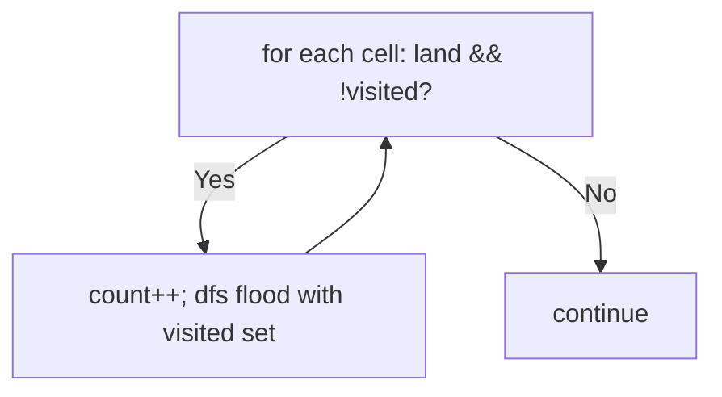
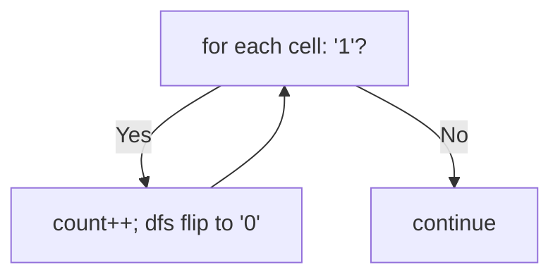

# 200. Number of Islands

- **LeetCode Link**: `https://leetcode.com/problems/number-of-islands/`
- **Difficulty**: Medium
- **Pattern Category**: Graph / Connected Components (Flood Fill)
- **Prerequisite Primer**: `00-foundations/03-core-algorithmic-patterns.md`

---

## 1. Problem Overview & Edge Case Matrix

### Problem Statement
Given an `m x n` 2D binary grid representing land (`'1'`) and water (`'0'`), return the number of islands. An island is surrounded by water and formed by connecting adjacent lands horizontally or vertically. All four edges are surrounded by water. Assume all four edges of the grid are surrounded by water.

```
Example 1:
Input: grid = [["1","1","1","1","0"],["1","1","0","1","0"],["1","1","0","0","0"],["0","0","0","0","0"]]
Output: 1

Example 2:
Input: grid = [["1","1","0","0","0"],["1","1","0","0","0"],["0","0","1","0","0"],["0","0","0","1","1"]]
Output: 3
```

### Visual Problem Representation
```
1 1 0 0 0      island A: top-left block (4 cells)
1 1 0 0 0      island B: single (2,2)
0 0 1 0 0      island C: bottom-right pair
0 0 0 1 1      diagonal touch ≠ connected (4-directional only!)
```

### Upfront Edge Case Matrix
| Edge Case Category | Specific Input Scenario | Expected Behavior | Pitfall / Risk |
| :--- | :--- | :--- | :--- |
| All water | Zero `'1'` cells | Return `0` | Counter seeded at 1 |
| All land | Full `'1'` grid | Return `1` | Stack depth on huge component |
| Diagonal adjacency | `[[1,0],[0,1]]` | Return `2` (not connected!) | 8-directional flood |
| Single cell | `[["1"]]` / `[["0"]]` | `1` / `0` | Neighbor loop on 1×1 |
| Checkerboard | Alternating cells | Each land its own island | Visited marking omitted (infinite loop) |

---

## 2. Level 1: Brute Force Approach

### Intuition & Visual Idea
DFS flood fill with an explicit visited SET of `"r,c"` string keys — the board is never mutated. Each unvisited land cell starts a flood (count++); floods never cross water or visited cells. Correct — with per-cell string allocation as the tax.



### Pseudocode
```text
FUNCTION numIslandsBruteForce(grid):
    m = ROWS; n = COLS; visited = EMPTY SET; count = 0
    DEFINE flood(r, c):
        IF OOB OR grid[r][c] == "0" OR visited HAS "r,c": RETURN
        visited.ADD("r,c")
        flood(4 NEIGHBORS)
    FOR EACH cell:
        IF grid[r][c] == "1" AND NOT visited HAS "r,c":
            count++; flood(r, c)
    RETURN count
```

### Step-by-Step Dry Run (Visual Trace)
| Step | Iteration / Pointer ($i, j$) | Current Value | State / Sub-array | Action Taken |
| :--- | :--- | :--- | :--- | :--- |
| 0 | cell `(0,0)` | unvisited land | `count = 1`, flood A | 4-cell flood |
| 1 | cells `(0,1)…` | visited / water | Skip | Continue scan |
| 2 | cell `(2,2)` | unvisited land | `count = 2`, flood B | Single-cell flood |
| 3 | cell `(3,3)` | unvisited land | `count = 3`, flood C | Return `3` |

### Modern JavaScript Implementation
```javascript
/**
 * Level 1: Brute Force (visited-set flood fill)
 * Time Complexity:  O(m·n) — each cell visited once
 * Space Complexity: O(m·n) — string-keyed visited set plus O(mn) stack
 */
function numIslandsBruteForce(grid) {
  const m = grid.length;
  if (m === 0) return 0;
  const n = grid[0].length;
  const visited = new Set();
  function flood(r, c) {
    // Water, walls, and seen cells all terminate the flood.
    if (r < 0 || r >= m || c < 0 || c >= n) return;
    if (grid[r][c] !== '1' || visited.has(r + ',' + c)) return;
    visited.add(r + ',' + c); // mark BEFORE recursing (else infinite loops)
    flood(r + 1, c);
    flood(r - 1, c);
    flood(r, c + 1);
    flood(r, c - 1);
  }
  let count = 0;
  for (let r = 0; r < m; r++) {
    for (let c = 0; c < n; c++) {
      // Unvisited land = a new island: count it, then flood it whole.
      if (grid[r][c] === '1' && !visited.has(r + ',' + c)) {
        count++;
        flood(r, c);
      }
    }
  }
  return count;
}
```

### Complexity Breakdown
- **Time Complexity**: $O(m·n)$ — each cell processed once.
- **Space Complexity**: $O(m·n)$ — string keys per land cell plus recursion depth.

---

## 3. Level 2: Optimized Approach

### Intuition & Visual Bottleneck Elimination
Sink islands in place: flood by flipping `'1'` → `'0'` directly on the board — the grid IS the visited set. No strings, no set, same $O(m·n)$ visits. (Mutates input: clone at the boundary if callers reuse the grid.)



### Pseudocode
```text
FUNCTION numIslandsSink(grid):
    IF EMPTY: RETURN 0
    count = 0
    DEFINE sink(r, c):
        IF OOB OR grid[r][c] != "1": RETURN
        grid[r][c] = "0"     // sink: visited by destruction
        sink(4 NEIGHBORS)
    FOR EACH cell:
        IF grid[r][c] == "1": count++; sink(r, c)
    RETURN count
```

### Step-by-Step Dry Run (Visual Trace)
| Step | Pointers / Window | Hash Map / Auxiliary State | Decision Logic | Output Accumulator |
| :--- | :--- | :--- | :--- | :--- |
| 0 | `(0,0)` land | `count = 1` | Sink 4 cells to `'0'` | Island A gone |
| 1 | scan to `(2,2)` | land | `count = 2`, sink single | Island B gone |
| 2 | scan to `(3,3)` | land | `count = 3`, sink pair | Island C gone |
| 3 | end of grid | — | — | Return `3` |

### Modern JavaScript Implementation
```javascript
/**
 * Level 2: Optimized (in-place sinking flood fill)
 * Time Complexity:  O(m·n) — each cell flipped at most once
 * Space Complexity: O(m·n) — call stack worst case (all-land grid)
 */
function numIslandsSink(grid) {
  const m = grid.length;
  if (m === 0) return 0;
  const n = grid[0].length;
  function sink(r, c) {
    if (r < 0 || r >= m || c < 0 || c >= n || grid[r][c] !== '1') return;
    grid[r][c] = '0'; // sink on entry: the board remembers for us
    sink(r + 1, c);
    sink(r - 1, c);
    sink(r, c + 1);
    sink(r, c - 1);
  }
  let count = 0;
  for (let r = 0; r < m; r++) {
    for (let c = 0; c < n; c++) {
      if (grid[r][c] === '1') {
        count++;
        sink(r, c);
      }
    }
  }
  return count;
}
```

### Complexity Breakdown
- **Time Complexity**: $O(m·n)$ — each cell flipped once.
- **Space Complexity**: $O(m·n)$ worst-case stack (all-land grid recurses deep); no heap allocation.

---

## 4. Level 3: Most Optimal / Canonical Approach

### Intuition & Mathematical / Invariant Proof
Iterative sinking with an explicit stack: identical flood semantics, zero recursion — immune to V8's $\sim 10^4$-frame limit on huge components ($300×300$ all-land = 90k depth vs recursion). Invariant: every pushed cell is land-or-unknown; every popped land cell is sunk exactly once. Same $O(m·n)$ visits, $O(m·n)$ worst-case stack memory (explicit, not call frames), $O(\min)$ typical.

```
(0,0) land -> count=1, stack=[(0,0)]: pop, sink, push live land neighbors...
  component A drains through the stack; scan continues at the next unvisited cell
```

### Pseudocode
```text
FUNCTION numIslands(grid):
    IF EMPTY: RETURN 0
    m = ROWS; n = COLS; count = 0
    FOR EACH cell:
        IF grid[r][c] != "1": CONTINUE
        count++
        stack = [[r, c]]
        WHILE stack NOT EMPTY:
            [cr, cc] = stack.POP()
            IF OOB OR grid[cr][cc] != "1": CONTINUE
            grid[cr][cc] = "0"
            PUSH 4 NEIGHBORS
    RETURN count
```

### Step-by-Step Dry Run (Visual Trace)
| Step | Pointer $L$ | Pointer $R$ | Invariant Checked | In-Place State |
| :--- | :--- | :--- | :--- | :--- |
| 1 | `(0,0)` land | `count = 1` | Stack `[(0,0)]` | Flood A iteratively |
| 2 | pop `(1,0)`… | land → sink, push neighbors | Each land sunk once | A drains |
| 3 | `(2,2)` land | `count = 2` | Single-cell flood | B drains |
| 4 | `(3,3)` land | `count = 3` | Pair flood | Return `3` |

### Modern JavaScript Implementation
```javascript
/**
 * Level 3: Most Optimal / Canonical (iterative in-place flood fill)
 * Time Complexity:  O(m·n) — each cell sunk once, optimal lower bound
 * Space Complexity: O(m·n) worst case — explicit stack (never call frames)
 */
function numIslands(grid) {
  const m = grid.length;
  if (m === 0) return 0;
  const n = grid[0].length;
  let count = 0;
  for (let r = 0; r < m; r++) {
    for (let c = 0; c < n; c++) {
      if (grid[r][c] !== '1') continue;
      count++; // unvisited land: a new island begins here
      const stack = [[r, c]];
      while (stack.length > 0) {
        const [cr, cc] = stack.pop();
        // Re-check on pop (not push): duplicates in the stack die here.
        if (cr < 0 || cr >= m || cc < 0 || cc >= n || grid[cr][cc] !== '1') continue;
        grid[cr][cc] = '0'; // sink exactly once
        stack.push([cr + 1, cc], [cr - 1, cc], [cr, cc + 1], [cr, cc - 1]);
      }
    }
  }
  return count;
}
```

### Complexity Breakdown
- **Time Complexity**: $O(m·n)$ — optimal lower bound; every cell inspected, land sunk once.
- **Space Complexity**: $O(m·n)$ worst case — explicit stack; production-safe at any depth.

---

## 5. JavaScript-Specific Gotchas & V8 Optimizations
- **GC Pressure**: Avoid allocating objects inside tight loops ($O(N)$ closures). Level 1's `"r,c"` string keys ($m·n$ of them) are the pressure removed — Levels 2–3 write chars; Level 3's `[r, c]` pair arrays are bounded by the frontier (still cheaper than key strings).
- **Type Coercion / Sorting**: Cells are `"1"`/`"0"` STRINGS — `=== '1'` strict (truthy checks pass `"0"` too!). The sink writes `"0"` (string), never `0` (number) — mixed types corrupt later strict reads.
- **Index Bounds**: Mark-on-POP (check after pop) tolerates duplicate pushes — mark-on-push needs the check before pushing (both correct if consistent; mixing them double-processes or skips). Recursion depth $> 10^4$ overflows V8 — Level 2 on all-land $300×300$ crashes where Level 3 survives.

---

## 6. Real-World MAANG Interview Follow-Ups & Extensions

### Follow-Up 1: Island area / perimeter / count with sizes
- **Scenario**: Return max area (LeetCode 695), perimeters, or labeled components.
- **Solution Strategy**: Level 3's flood already visits every cell — accumulate area (counter), perimeter (+1 per water/edge side), or write labels into a parallel grid. Same walk, richer fold.
- **JS Code / Implementation Pattern**:
```javascript
function maxAreaOfIsland(grid) {
  return maxFloodMetric(grid, (cell) => 1); // count cells per flood
}
```

### Follow-Up 2: Dynamic islands (Number of Islands II)
- **Scenario**: Land added incrementally; report island count after each addition (LeetCode 305, Hard).
- **Solution Strategy**: Disjoint-set union: each addition starts its own set, merging with live land neighbors (count drops per successful union). $O(\alpha)$ amortized per op — floods are the wrong tool online.
- **JS Code / Implementation Pattern**:
```javascript
function numIslandsII(m, n, positions) {
  return incrementalDSU(m, n, positions); // union with live neighbors
}
```

### Follow-Up 3: $10^9$-cell grid with sparse land (paged flood)
- **Scenario & In-Depth Solution**: The grid never fits in RAM; land is sparse. Store land cells in a hash set (or spatial index); flood over SET membership instead of array reads — work scales with land count, not grid size. Page set shards from disk as the flood crosses them.
```javascript
function sparseNumIslands(landSet) {
  return floodOverSet(landSet); // same kernel, Set-has instead of grid-read
}
```
