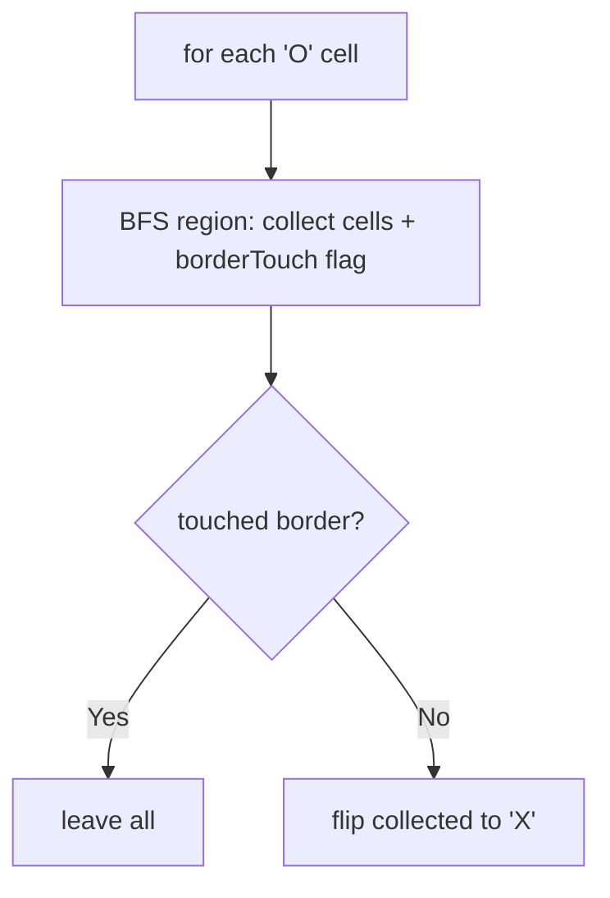
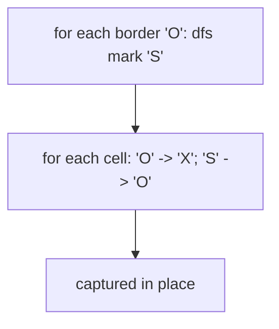

# 130. Surrounded Regions

- **LeetCode Link**: `https://leetcode.com/problems/surrounded-regions/`
- **Difficulty**: Medium
- **Pattern Category**: Graph / Border-Anchored Flood Fill
- **Prerequisite Primer**: `00-foundations/03-core-algorithmic-patterns.md`

---

## 1. Problem Overview & Edge Case Matrix

### Problem Statement
Given an `m x n` matrix `board` containing `'X'` and `'O'`, capture all regions that are 4-directionally surrounded by `'X'`. A region is captured by flipping all `'O'`s into `'X'`s in that surrounded region. Surrounded regions should NOT be on the border — any `'O'` on the border, or connected to a border `'O'`, survives.

```
Example 1:
Input: board = [["X","X","X","X"],["X","O","O","X"],["X","X","O","X"],["X","O","X","X"]]
Output: [["X","X","X","X"],["X","X","X","X"],["X","X","X","X"],["X","O","X","X"]]
Explanation: The bottom-middle 'O' connects to the border; the rest are captured.

Example 2:
Input: board = [["X"]]
Output: [["X"]]
```

### Visual Problem Representation
```
X X X X      X X X X
X O O X  ->  X X X X     (interior O's captured)
X X O X      X X X X
X O X X      X O X X     (border-connected O survives)
```

### Upfront Edge Case Matrix
| Edge Case Category | Specific Input Scenario | Expected Behavior | Pitfall / Risk |
| :--- | :--- | :--- | :--- |
| All border | 1-row / 1-col boards | Nothing captured | Interior loop on degenerate dims |
| All `'O'` | Full-O board | All survive (all border-connected) | Capturing everything |
| All `'X'` | No `'O'` at all | Unchanged | Wasted border scan (harmless) |
| Single interior O | Center of 3×3 X-box | Captured | Border flood leaking inward |
| Checkerboard O/X | Alternating | Border-connected survive | Per-cell BFS without shared marking |

---

## 2. Level 1: Brute Force Approach

### Intuition & Visual Idea
For EVERY `'O'`, BFS its region asking "does it touch the border?" — capture (flip) iff not. No shared marking between regions: border-touching regions are re-walked per cell, $O((mn)^2)$ worst case.



### Pseudocode
```text
FUNCTION solveBruteForce(board):
    IF EMPTY: RETURN
    m = ROWS; n = COLS
    FOR EACH cell (r, c) WITH "O":
        region = []; touchesBorder = false; queue = [[r,c]]; seen = SET
        BFS: pop cell; skip seen/OOB/X; mark seen; push to region
             IF ON BORDER: touchesBorder = true
             PUSH 4 NEIGHBORS
        IF NOT touchesBorder:
            FOR cell IN region: board[cell] = "X"
```

### Step-by-Step Dry Run (Visual Trace)
| Step | Iteration / Pointer ($i, j$) | Current Value | State / Sub-array | Action Taken |
| :--- | :--- | :--- | :--- | :--- |
| 0 | region at `(1,1)` | cells `(1,1),(1,2),(2,2)` | No border contact | Flip all to `X` |
| 1 | region at `(3,1)` | single, ON border row | `touchesBorder` | Keep |
| 2 | remaining `'O'`s | already flipped / kept | — | Done |

### Modern JavaScript Implementation
```javascript
/**
 * Level 1: Brute Force (per-region border check)
 * Time Complexity:  O((m·n)²) — regions re-walked per cell, worst case
 * Space Complexity: O(m·n) — region + seen sets per check
 */
function solveBruteForce(board) {
  const m = board.length;
  if (m === 0) return;
  const n = board[0].length;
  const inside = (r, c) => r >= 0 && r < m && c >= 0 && c < n;
  for (let r = 0; r < m; r++) {
    for (let c = 0; c < n; c++) {
      if (board[r][c] !== 'O') continue;
      // Flood THIS region from scratch (no memory of other regions).
      const region = [];
      const seen = new Set([r + ',' + c]);
      const queue = [[r, c]];
      let touchesBorder = false;
      while (queue.length > 0) {
        const [cr, cc] = queue.shift();
        region.push([cr, cc]);
        if (cr === 0 || cr === m - 1 || cc === 0 || cc === n - 1) touchesBorder = true;
        for (const [dr, dc] of [[1, 0], [-1, 0], [0, 1], [0, -1]]) {
          const nr = cr + dr;
          const nc = cc + dc;
          const key = nr + ',' + nc;
          if (inside(nr, nc) && board[nr][nc] === 'O' && !seen.has(key)) {
            seen.add(key);
            queue.push([nr, nc]);
          }
        }
      }
      // Capture iff fully surrounded: flip the whole collected region.
      if (!touchesBorder) {
        for (const [cr, cc] of region) board[cr][cc] = 'X';
      }
    }
  }
}
```

### Complexity Breakdown
- **Time Complexity**: $O((m·n)^2)$ worst case — each region BFS costs $O(m·n)$, launched per cell.
- **Space Complexity**: $O(m·n)$ — region plus seen sets per check.

---

## 3. Level 2: Optimized Approach

### Intuition & Visual Bottleneck Elimination
Invert the question: flood from the BORDERS marking escape-connected `'O'` as safe (`'S'`), then flip every remaining `'O'` (guaranteed surrounded) and restore `'S'` → `'O'`. Each cell visited constantly many times — $O(m·n)$ total, one shared marking.



### Pseudocode
```text
FUNCTION solveBorderDFS(board):
    IF EMPTY: RETURN
    DEFINE markSafe(r, c):   // flood border-connected O's
        IF OOB OR board[r][c] != "O": RETURN
        board[r][c] = "S"
        markSafe(4 NEIGHBORS)
    FOR EACH BORDER cell WITH "O": markSafe(r, c)
    FOR EACH cell:
        IF "O": board = "X"     // unsurrounded: capture
        ELSE IF "S": board = "O" // escape-connected: restore
```

### Step-by-Step Dry Run (Visual Trace)
| Step | Pointers / Window | Hash Map / Auxiliary State | Decision Logic | Output Accumulator |
| :--- | :--- | :--- | :--- | :--- |
| 0 | border scan | `(3,1)` is border `'O'` | Flood safe-mark | `(3,1) → 'S'` (isolated) |
| 1 | interior `(1,1)` region | never reached from border | Stays `'O'` | — |
| 2 | sweep all cells | `'O' → 'X'`, `'S' → 'O'` | Interior captured, border kept | Final board |

### Modern JavaScript Implementation
```javascript
/**
 * Level 2: Optimized (border-anchored safe marking)
 * Time Complexity:  O(m·n) — each cell marked and swept once
 * Space Complexity: O(m·n) — call stack worst case (all-O board)
 */
function solveBorderDFS(board) {
  const m = board.length;
  if (m === 0) return;
  const n = board[0].length;
  function markSafe(r, c) {
    // Only unmarked O's convert: water/X/safe all terminate.
    if (r < 0 || r >= m || c < 0 || c >= n || board[r][c] !== 'O') return;
    board[r][c] = 'S'; // safe: escape-connected to the border
    markSafe(r + 1, c);
    markSafe(r - 1, c);
    markSafe(r, c + 1);
    markSafe(r, c - 1);
  }
  // Seed from ALL border cells (4 edges, corners covered twice harmlessly).
  for (let c = 0; c < n; c++) {
    markSafe(0, c);
    markSafe(m - 1, c);
  }
  for (let r = 0; r < m; r++) {
    markSafe(r, 0);
    markSafe(r, n - 1);
  }
  // Resolve: unsurrounded O's captured, safe marks restored.
  for (let r = 0; r < m; r++) {
    for (let c = 0; c < n; c++) {
      if (board[r][c] === 'O') board[r][c] = 'X';
      else if (board[r][c] === 'S') board[r][c] = 'O';
    }
  }
}
```

### Complexity Breakdown
- **Time Complexity**: $O(m·n)$ — border floods plus one sweep.
- **Space Complexity**: $O(m·n)$ worst-case stack (all-`O` board recurses deep).

---

## 4. Level 3: Most Optimal / Canonical Approach

### Intuition & Mathematical / Invariant Proof
Level 2's algorithm with an explicit stack — identical semantics, zero recursion: immune to V8's frame limit on huge safe regions. Invariant: every pushed cell is border-reachable-or-unknown; every popped `'O'` becomes `'S'` exactly once. Same $O(m·n)$ visits, production-safe at any scale. This is the form to ship.

```
border (3,1) 'O' -> stack: pop, mark 'S', push neighbors (all X/walls die on pop-check)
sweep: interior 'O's -> 'X'; 'S' -> 'O'
```

### Pseudocode
```text
FUNCTION solve(board):
    IF EMPTY: RETURN
    m = ROWS; n = COLS
    stack = []
    DEFINE pushIfO(r, c):
        IF INSIDE AND board[r][c] == "O": stack.PUSH([r, c])
    FOR EACH BORDER cell: pushIfO(r, c)
    WHILE stack NOT EMPTY:
        [r, c] = stack.POP()
        IF OOB OR board[r][c] != "O": CONTINUE
        board[r][c] = "S"
        PUSH 4 NEIGHBORS (unchecked; validated on pop)
    FOR EACH cell:
        IF "O": board = "X"
        ELSE IF "S": board = "O"
```

### Step-by-Step Dry Run (Visual Trace)
| Step | Pointer $L$ | Pointer $R$ | Invariant Checked | In-Place State |
| :--- | :--- | :--- | :--- | :--- |
| 1 | seed borders | `(3,1)` pushed (only border O) | Stack `[(3,1)]` | — |
| 2 | pop `(3,1)` | `'O'` → `'S'` | Marked once | Push neighbors (die on pop) |
| 3 | stack drains | no more `'O'` pops | Safe region complete | — |
| 4 | sweep | capture + restore | — | Final board |

### Modern JavaScript Implementation
```javascript
/**
 * Level 3: Most Optimal / Canonical (iterative border flood)
 * Time Complexity:  O(m·n) — each cell marked and swept once, optimal
 * Space Complexity: O(m·n) worst case — explicit stack (never call frames)
 */
function solve(board) {
  const m = board.length;
  if (m === 0) return;
  const n = board[0].length;
  const stack = [];
  const pushIfO = (r, c) => {
    // Seed gate: only unmarked O's enter (checked again on pop).
    if (r >= 0 && r < m && c >= 0 && c < n && board[r][c] === 'O') stack.push([r, c]);
  };
  // Seed from all four borders (corners twice: harmless, dies on pop-check).
  for (let c = 0; c < n; c++) {
    pushIfO(0, c);
    pushIfO(m - 1, c);
  }
  for (let r = 0; r < m; r++) {
    pushIfO(r, 0);
    pushIfO(r, n - 1);
  }
  while (stack.length > 0) {
    const [r, c] = stack.pop();
    // Validate on pop (not push): duplicates and stale entries die here.
    if (r < 0 || r >= m || c < 0 || c >= n || board[r][c] !== 'O') continue;
    board[r][c] = 'S'; // safe: reachable from the border
    stack.push([r + 1, c], [r - 1, c], [r, c + 1], [r, c - 1]);
  }
  // Resolve: unsurrounded O's captured, safe marks restored to O.
  for (let r = 0; r < m; r++) {
    for (let c = 0; c < n; c++) {
      if (board[r][c] === 'O') board[r][c] = 'X';
      else if (board[r][c] === 'S') board[r][c] = 'O';
    }
  }
}
```

### Complexity Breakdown
- **Time Complexity**: $O(m·n)$ — optimal lower bound; every cell read, safe cells marked once.
- **Space Complexity**: $O(m·n)$ worst case — explicit stack; production-safe at any depth.

---

## 5. JavaScript-Specific Gotchas & V8 Optimizations
- **GC Pressure**: Avoid allocating objects inside tight loops ($O(N)$ closures). Level 1's per-region `Set` + key strings + region arrays are the pressure removed — Levels 2–3 write marker chars; Level 3's `[r, c]` pairs are frontier-bounded.
- **Type Coercion / Sorting**: Cells are `"O"`/`"X"`/`"S"` STRINGS — `===` strict throughout; the `'S'` sentinel must differ from both (and from any future board alphabet — validate at the boundary for lowercase boards).
- **Index Bounds**: Border seeding loops must handle 1-row/1-column boards (loops overlap/degenerate gracefully — corners seeded twice is HARMLESS, but `m - 1 === 0` indexing must still be valid, which it is). Mark-on-pop validation (Level 3) tolerates duplicate pushes; mark-on-push would need pre-checks at every push site.

---

## 6. Real-World MAANG Interview Follow-Ups & Extensions

### Follow-Up 1: Count captured regions / largest captured region
- **Scenario**: Report how many regions were captured (and their sizes), not just the board.
- **Solution Strategy**: Level 1's region collection shape, but over the FINAL board's flipped cells with a shared visited set — one extra flood pass, $O(m·n)$.
- **JS Code / Implementation Pattern**:
```javascript
function capturedRegionStats(board) {
  solve(board); // Level 3 first
  return floodStats(board); // components of the flipped cells
}
```

### Follow-Up 2: Enclosed water / surrounded volumes in 3D
- **Scenario**: 3D voxel grid; capture enclosed `'O'` volumes.
- **Solution Strategy**: Same inversion in 3D: flood safe-marks from all SIX faces, then capture the unmarked. Six neighbors, same kernel.
- **JS Code / Implementation Pattern**:
```javascript
function captureEnclosed3D(voxels) {
  return borderFloodND(voxels, 6); // face-seeded flood, capture rest
}
```

### Follow-Up 3: $10^9$-cell board with tiled streaming
- **Scenario & In-Depth Solution**: The board never fits in RAM; tiles stream with overlap margins. Border-connectedness is GLOBAL (a path can wander arbitrarily), so tiling needs union-find over tile-boundary O's: flood within tiles, union boundary-touching components across tiles, capture non-border-rooted sets. Two passes (flood + resolve) with a DSU sidecar.
```javascript
async function captureTiled(tileStream) {
  const dsu = new DisjointSet();
  await floodTiles(tileStream, dsu); // union cross-tile O's
  return resolveTiles(tileStream, dsu); // capture non-border sets
}
```
