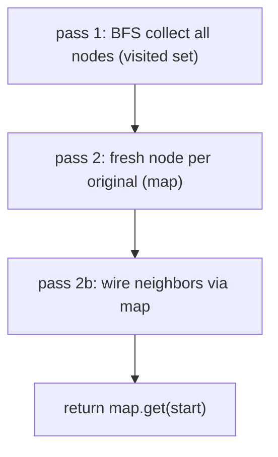
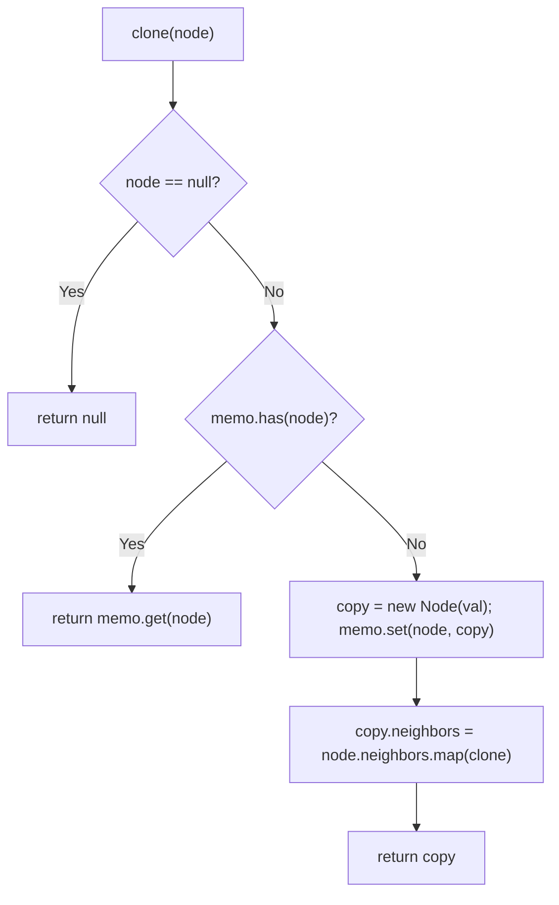
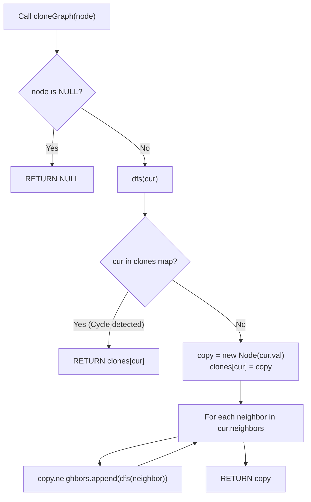

# 133. Clone Graph

- **LeetCode Link**: `https://leetcode.com/problems/clone-graph/`
- **Difficulty**: Medium
- **Pattern Category**: Graph / Node Mapping (DFS/BFS + Memo)
- **Prerequisite Primer**: `00-foundations/03-core-algorithmic-patterns.md`

---

## 1. Problem Overview & Edge Case Matrix

### Problem Statement
Given a reference of a node in a connected undirected graph, return a deep copy (clone) of the graph. Each node contains a `val` and a list of its `neighbors`.

```
Example 1:
Input: adjList = [[2,4],[1,3],[2,4],[1,3]]
Output: [[2,4],[1,3],[2,4],[1,3]]
Explanation: 4-node cycle cloned node-for-node, edge-for-edge.

Example 2:
Input: adjList = [[]]
Output: [[]]
Explanation: Single isolated node.

Example 3:
Input: adjList = []
Output: []
Explanation: Null graph (no nodes).
```

### Visual Problem Representation
```
orig:   1 -- 2          copy:   1'-- 2'
        |    |                  |    |
        4 -- 3                  4'-- 3'   (all fresh objects, same topology)
```

### Upfront Edge Case Matrix
| Edge Case Category | Specific Input Scenario | Expected Behavior | Pitfall / Risk |
| :--- | :--- | :--- | :--- |
| Empty / Nil | `node = null` (`[]`) | Return `null` | Traversal on null |
| Single isolated | `[[]]` | Fresh node, empty neighbors | Returning the original |
| Self-loop | `[[1]]`-style (neighbor is self) | Copy points at ITSELF (the copy) | Infinite recursion without memo-before-recurse |
| Cycles | 4-cycle | Terminates with shared copies | Re-cloning visited nodes (exponential + wrong identity) |
| Deep chain | $10^4$-node path | Correct clone | Recursion depth on degenerate graphs |

---

## 2. Level 1: Brute Force Approach

### Intuition & Visual Idea
Two explicit passes: collect every node (BFS with a visited set), then create fresh nodes and wire neighbors through an object→copy map. Transparent separation of discovery and construction — at the cost of storing the full order plus the map.



### Pseudocode
```text
FUNCTION cloneGraphBruteForce(node):
    IF node NULL: RETURN NULL
    order = []; seen = SET([node]); stack = [node]
    WHILE stack NOT EMPTY:
        cur = stack.POP(); order.PUSH(cur)
        FOR nb IN cur.neighbors:
            IF NOT seen HAS nb: seen.ADD(nb); stack.PUSH(nb)
    clones = MAP(orig -> FRESH NODE per order)
    FOR orig IN order:
        clones.GET(orig).neighbors = orig.neighbors.MAP(nb => clones.GET(nb))
    RETURN clones.GET(node)
```

### Step-by-Step Dry Run (Visual Trace)
| Step | Iteration / Pointer ($i, j$) | Current Value | State / Sub-array | Action Taken |
| :--- | :--- | :--- | :--- | :--- |
| 0 | collect from `1` | order `[1,4,3,2]` (DFS-ish) | All 4 found | Discovery |
| 1 | fresh nodes | `1',2',3',4'` | Map built | Construction |
| 2 | wire `1'` | neighbors `[2,4]` → `[2',4']` | Via map | Topology mirrored |
| 3 | wire rest | — | — | Return `1'` |

### Modern JavaScript Implementation
```javascript
/**
 * Shared backbone: LeetCode provides Node(val, neighbors); defined once here
 * so every level below is locally runnable when concatenated.
 * Time Complexity:  n/a (scaffolding)
 * Space Complexity: n/a (scaffolding)
 */
class GraphNode {
  constructor(val, neighbors = []) {
    this.val = val;
    this.neighbors = neighbors;
  }
}

function buildGraph(adj) {
  // Test helper: adjacency list (1-based vals) -> connected GraphNodes.
  if (adj.length === 0) return null;
  const nodes = adj.map((_, i) => new GraphNode(i + 1));
  adj.forEach((nbs, i) => {
    nodes[i].neighbors = nbs.map((v) => nodes[v - 1]);
  });
  return nodes[0];
}

function graphToAdj(node) {
  // Test helper: BFS-serialize a graph back to sorted adjacency lists.
  if (!node) return [];
  const adj = [];
  const seen = new Set([node]);
  const queue = [node];
  while (queue.length > 0) {
    const cur = queue.shift();
    adj[cur.val - 1] = cur.neighbors.map((nb) => nb.val).sort((a, b) => a - b);
    for (const nb of cur.neighbors) {
      if (!seen.has(nb)) {
        seen.add(nb);
        queue.push(nb);
      }
    }
  }
  return adj;
}

/**
 * Level 1: Brute Force (collect-then-wire two-pass)
 * Time Complexity:  O(V + E) — discovery plus wiring
 * Space Complexity: O(V) — order array plus clone map
 */
function cloneGraphBruteForce(node) {
  if (!node) return null;
  // Pass 1: discover every reachable node (visited set, iterative).
  const order = [];
  const seen = new Set([node]);
  const stack = [node];
  while (stack.length > 0) {
    const cur = stack.pop();
    order.push(cur);
    for (const nb of cur.neighbors) {
      if (!seen.has(nb)) {
        seen.add(nb);
        stack.push(nb);
      }
    }
  }
  // Pass 2: fresh nodes first...
  const clones = new Map();
  for (const orig of order) clones.set(orig, new GraphNode(orig.val));
  // ...then wire strictly through the map (never to originals).
  for (const orig of order) {
    clones.get(orig).neighbors = orig.neighbors.map((nb) => clones.get(nb));
  }
  return clones.get(node);
}
```

### Complexity Breakdown
- **Time Complexity**: $O(V + E)$ — linear, but in two full passes with an order array.
- **Space Complexity**: $O(V)$ — order plus map; one pass suffices.

---

## 3. Level 2: Optimized Approach

### Intuition & Visual Bottleneck Elimination
Recursive clone-with-memo in ONE pass: `clone(node)` returns the existing copy or builds it, wiring neighbors via recursive calls. Memo-before-recurse terminates cycles and self-loops — elegant, $O(V + E)$, but $O(V)$ stack depth.



### Pseudocode
```text
FUNCTION cloneGraphDFS(node, memo = MAP()):
    IF node NULL: RETURN NULL
    IF memo HAS node: RETURN memo.GET(node)
    copy = FRESH NODE(node.val)
    memo.SET(node, copy)      // BEFORE recursing: cycles terminate
    copy.neighbors = node.neighbors.MAP(nb => cloneGraphDFS(nb, memo))
    RETURN copy
```

### Step-by-Step Dry Run (Visual Trace)
| Step | Pointers / Window | Hash Map / Auxiliary State | Decision Logic | Output Accumulator |
| :--- | :--- | :--- | :--- | :--- |
| 0 | `clone(1)` | miss → build `1'`, memoize | Recurse neighbors `[2,4]` | — |
| 1 | `clone(2)` | miss → build `2'` | Recurse `[1,3]` | `clone(1)` hits memo → `1'` |
| 2 | `clone(3)` → `clone(4)` | builds `3'`, `4'` | Cycle refs hit memo | Wires close correctly |
| 3 | unwind | all neighbors resolved | — | Return `1'` |

### Modern JavaScript Implementation
```javascript
/**
 * Level 2: Optimized (recursive memoization, single pass)
 * Time Complexity:  O(V + E) — each node built once, each edge followed once
 * Space Complexity: O(V) — memo map plus call stack depth
 */
// GraphNode shared from Level 1.
function cloneGraphDFS(node, memo = new Map()) {
  if (!node) return null;
  if (memo.has(node)) return memo.get(node); // cycle/self-loop: reuse the copy
  // Memoize BEFORE recursing so back-edges terminate instead of looping.
  const copy = new GraphNode(node.val);
  memo.set(node, copy);
  for (const nb of node.neighbors) {
    copy.neighbors.push(cloneGraphDFS(nb, memo));
  }
  return copy;
}
```

### Complexity Breakdown
- **Time Complexity**: $O(V + E)$ — each node built once, each edge walked once.
- **Space Complexity**: $O(V)$ — memo plus $O(V)$ stack; deep chains risk V8 overflow.

---

## 4. Level 3: Most Optimal / Canonical Approach

### Intuition & Mathematical / Invariant Proof
Iterative BFS with the same memo map: queue originals, create-then-wire per dequeue. Invariant: every dequeued original gets exactly one copy (created on first sight), and every edge is wired exactly once when its tail dequeues. Same $O(V + E)$ bounds, zero recursion — the production form. (Space stays $O(V)$: the map is inherent to deep-copying — optimality here means no stack risk and one pass.)

```
queue [1]: dequeue 1, build 1', enqueue 2,4
  dequeue 2, build 2', wire 1'->[..,2'], enqueue 1(seen),3 ...
  every edge wired once; cycles die on memo hits
```

### Pseudocode
```text
FUNCTION cloneGraph(node):
    IF node NULL: RETURN NULL
    clones = MAP(node -> FRESH NODE(node.val))
    queue = [node]
    WHILE queue NOT EMPTY:
        cur = queue.SHIFT()
        FOR nb IN cur.neighbors:
            IF NOT clones HAS nb:
                clones.SET(nb, FRESH NODE(nb.val))
                queue.PUSH(nb)
            clones.GET(cur).neighbors.PUSH(clones.GET(nb))
    RETURN clones.GET(node)
```

### Step-by-Step Dry Run (Visual Trace)
| Step | Pointer $L$ | Pointer $R$ | Invariant Checked | In-Place State |
| :--- | :--- | :--- | :--- | :--- |
| 1 | dequeue `1` | build `1'` | Enqueue `2, 4` | Wire later per tail |
| 2 | dequeue `2` | build `2'` | `1'.neighbors += 2'`; enqueue `3` (`1` seen) | Edges once |
| 3 | dequeue `4`, `3` | builds + wires | Cycle edges hit memo | Topology closed |
| 4 | queue drains | — | — | Return `1'` |

### Modern JavaScript Implementation
```javascript
/**
 * Level 3: Most Optimal / Canonical (iterative BFS + memo, single pass)
 * Time Complexity:  O(V + E) — each node/edge processed once, optimal
 * Space Complexity: O(V) — clone map (inherent to deep copy); no stack
 */
// GraphNode shared from Level 1.
function cloneGraph(node) {
  if (!node) return null;
  const clones = new Map([[node, new GraphNode(node.val)]]);
  const queue = [node];
  while (queue.length > 0) {
    const cur = queue.shift();
    for (const nb of cur.neighbors) {
      // First sight: build the copy and schedule its own wiring.
      if (!clones.has(nb)) {
        clones.set(nb, new GraphNode(nb.val));
        queue.push(nb);
      }
      // Wire through the map: every edge exactly once, cycles included.
      clones.get(cur).neighbors.push(clones.get(nb));
    }
  }
  return clones.get(node);
}
```

### Complexity Breakdown
- **Time Complexity**: $O(V + E)$ — optimal lower bound; every node and edge touched once.
- **Space Complexity**: $O(V)$ — clone map (inherent); zero recursion risk.

---

## 5. JavaScript-Specific Gotchas & V8 Optimizations
- **GC Pressure**: Avoid allocating objects inside tight loops ($O(N)$ closures). One fresh node per original is mandatory (the output); never allocate per-EDGE wrappers or intermediate pair arrays.
- **Type Coercion / Sorting**: `Map` keys are object IDENTITIES — value-equal nodes (`val: 1` twice) are distinct keys. A value-keyed map (`map.get(cur.val)`) silently merges distinct nodes; identity keys are the entire correctness argument (same lesson as Copy Random Pointer).
- **Index Bounds**: No indices — but memo-before-recurse (Level 2) / create-before-enqueue (Level 3) ORDER is load-bearing: wiring before memoizing loops forever on any cycle (including self-loops). `queue.shift()` is $O(V)$ memmove — head-index it at true scale.

---

## 6. Real-World MAANG Interview Follow-Ups & Extensions

### Follow-Up 1: Clone with random pointers / weighted edges
- **Scenario**: Nodes carry extra edge data (weights, labels, random links).
- **Solution Strategy**: Level 3's skeleton copies edge PAYLOADS alongside topology (`{ to: clone, weight }`); random pointers resolve through the same map in the wiring pass.
- **JS Code / Implementation Pattern**:
```javascript
function cloneWeightedGraph(node) {
  return cloneWithEdgeData(node, (origEdge) => ({ ...origEdge }));
}
```

### Follow-Up 2: $10^9$-node graph with sharded storage
- **Scenario**: Nodes page from disk/shards; only a frontier fits in RAM.
- **Solution Strategy**: Level 3's queue IS the streaming shape — fault node payloads on dequeue, persist clones on build, evict wired nodes. Frontier-bounded RAM, sequential-ish I/O.
- **JS Code / Implementation Pattern**:
```javascript
async function cloneShardedGraph(startId, loadNode, storeClone) {
  return bfsClone(startId, loadNode, storeClone); // Level 3 over page faults
}
```

### Follow-Up 3: Concurrent mutation during cloning
- **Scenario & In-Depth Solution**: Writers add edges mid-clone. Snapshot edge lists per dequeue (`[...cur.neighbors]` — atomic-ish read of one array); version-stamp nodes and re-verify the map at the end, retrying on mismatch. Snapshot isolation without locks.
```javascript
function cloneVersioned(node, versionOf) {
  const stamp = versionOf(node);
  const copy = cloneGraph(node);
  if (versionOf(node) !== stamp) throw new Error('mutated during clone: retry');
  return copy;
}
```

---

## 7. What LeetCode Discuss Says (Language-Independent)

Source: top-voted post by Abhay Rautela —
`https://leetcode.com/problems/clone-graph/solutions/1792834/c-easy-explanation-dfs-by-abhay_rautela-4txw/`
— 146K views.
Language-independent summary. No new JS here.

### A. Optimal way from Discuss (DFS / BFS Deep Copy with Identity Hash Map)

Perform a complete deep clone of a connected undirected graph using an identity registry to handle cycles:

1. **Cloning Contract:**
   - Every node in the returned graph must be a newly allocated object with the same scalar payload (`val`) and identical neighbor topology.
   - No pointers or references to original nodes may survive within the cloned graph.
2. **Cycle Prevention via Early Registration:**
   - Maintain a dictionary / hash map `clones` that maps each original node identity to its cloned instance.
   - Base case: If `node == null`, return `null`.
   - Cycle detection: If `node` already exists in `clones`, immediately return `clones[node]`.
   - Allocation: Create `clone = new Node(node.val)`.
   - **Crucial Invariant:** Insert `clones[node] = clone` immediately into the registry *before* recursing or iterating through neighbors.
   - Edge Replication: For each neighbor `nbr` in `node.neighbors`, recursively resolve or enqueue `nbr` and append the result to `clone.neighbors`.

```text
FUNCTION cloneGraph(node):
    IF node IS NULL:
        RETURN NULL

    clones = MAP()  // original Node -> cloned Node

    FUNCTION dfs(cur):
        IF cur IN clones:
            RETURN clones[cur]

        copy = NEW Node(cur.val)
        clones[cur] = copy  // register BEFORE exploring neighbors to break cycles

        FOR EACH neighbor IN cur.neighbors:
            copy.neighbors.APPEND(dfs(neighbor))

        RETURN copy

    RETURN dfs(node)
```

- Time: O(V + E) — every node is cloned once, and each edge is traversed once per endpoint.
- Space: O(V) auxiliary space — to store the mapping of all $V$ nodes and support the recursion stack or BFS queue.



### B. Dry run on LeetCode Example 1 (`adjList = [[2,4],[1,3],[2,4],[1,3]]`)

- Node 1 traversed: `copy1` created. `clones[1] = copy1`.
  - Inspect neighbor 2: Not in map. `copy2` created. `clones[2] = copy2`.
    - Neighbor 1 of Node 2: Already in map $\implies$ returns `copy1`.
    - Neighbor 3 of Node 2: Not in map. `copy3` created. `clones[3] = copy3`.
      - Neighbor 2 of Node 3: Already in map $\implies$ returns `copy2`.
      - Neighbor 4 of Node 3: Not in map. `copy4` created. `clones[4] = copy4`.
        - Neighbor 1 of Node 4: Already in map $\implies$ returns `copy1`.
        - Neighbor 3 of Node 4: Already in map $\implies$ returns `copy3`.
        - `copy4.neighbors = [copy1, copy3]`.
      - `copy3.neighbors = [copy2, copy4]`.
    - `copy2.neighbors = [copy1, copy3]`.
  - Inspect neighbor 4: Already in map $\implies$ returns `copy4`.
  - `copy1.neighbors = [copy2, copy4]`.
- Return `copy1`. Complete mirror graph created.

### C. Why Registering Before Neighbor Iteration is Mandatory

- If the clone is inserted into the lookup table *after* neighbor traversal, the recursive traversal encountering a cycle back to the starting node fails the cache check, allocates a second replica of the starting node, and loops infinitely until stack overflow.

### D. Pitfalls from comments

- **Value-Keyed Collisions:** If vertices in general graphs share duplicate numerical labels, keying the map by `node.val` collapses distinct vertices into a single instance. Keys must track unique object memory identities.
- **Null Input Handling:** Passing an empty graph (`null`) must return `null` immediately rather than attempting to access `.val` or `.neighbors`.

### E. Companies

- Discuss post itself names none.
  Companies tab on LeetCode is premium-locked.
- External source:
  `https://github.com/liquidslr/leetcode-company-wise-problems`
  (LeetCode company tags, updated June 2025).
- All-time (18): Amazon, Apple, Bloomberg, ByteDance, CrowdStrike, eBay, Flexport, Google, Meta, Microsoft, MongoDB, Nutanix, Nvidia, Oracle, Pocket Gems, Siemens, Uber, Wix.
- Recent: 30 days — None.
- Recent: 3 months — Amazon, Google.
