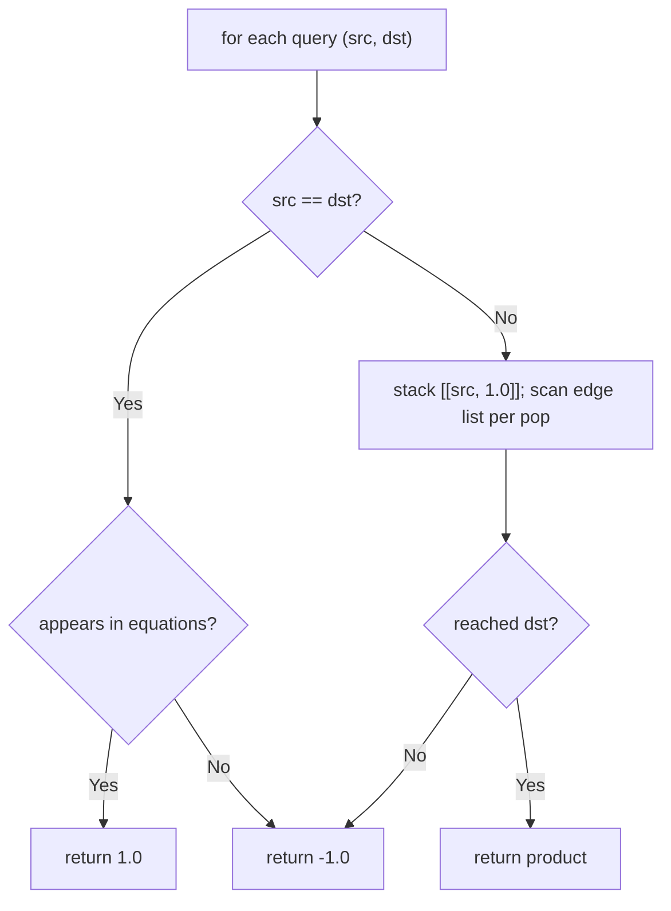
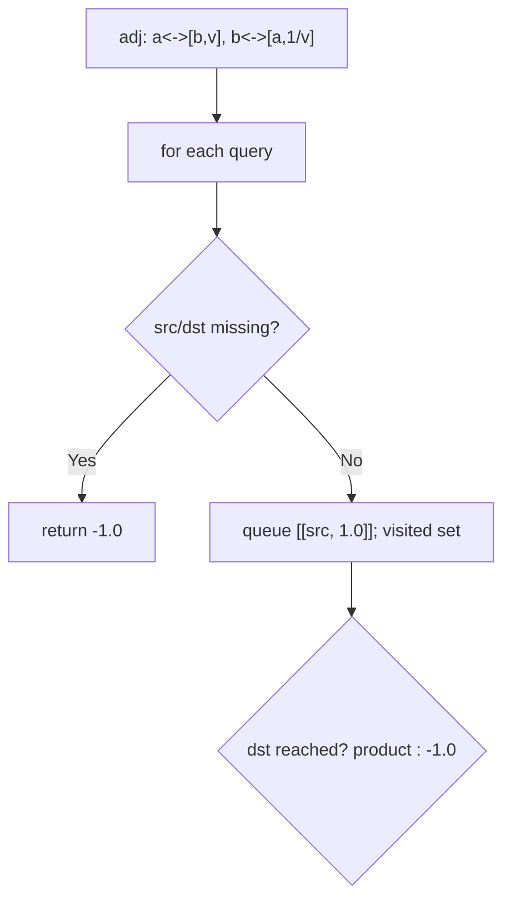
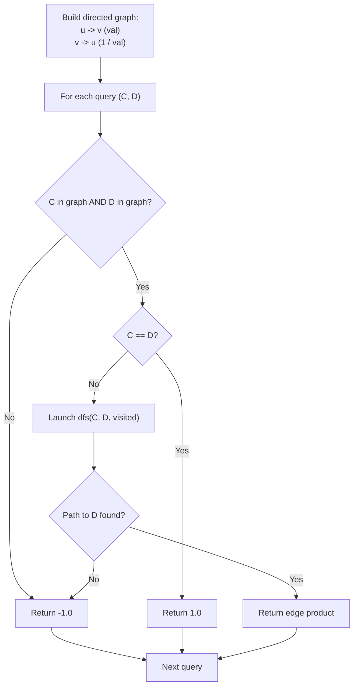

# 399. Evaluate Division

- **LeetCode Link**: `https://leetcode.com/problems/evaluate-division/`
- **Difficulty**: Medium
- **Pattern Category**: Graph / Weighted Path Queries
- **Prerequisite Primer**: `00-foundations/03-core-algorithmic-patterns.md`

---

## 1. Problem Overview & Edge Case Matrix

### Problem Statement
You are given equations `a / b = value` (as `equations[i] = [a, b]`, `values[i] = value`), and queries asking `c / d`. Return the answers, or `-1.0` if a query involves unknown variables or disconnected components. Answers within $10^{-5}$ are accepted.

```
Example 1:
Input: equations = [["a","b"],["b","c"]], values = [2.0,3.0],
       queries = [["a","c"],["b","a"],["a","e"],["a","a"],["x","x"]]
Output: [6.00000,0.50000,-1.00000,1.00000,-1.00000]
Explanation: a/c = (a/b)·(b/c) = 2·3 = 6; b/a = 1/2.

Example 2:
Input: equations = [["a","b"],["b","c"],["bc","cd"]], values = [1.5,2.5,5.0],
       queries = [["a","c"],["c","b"],["bc","cd"],["cd","bc"]]
Output: [3.75000,0.40000,5.00000,0.20000]
```

### Visual Problem Representation
```
a --2.0--> b --3.0--> c       a/c = 2·3 = 6 (multiply along path)
^          ^                  c/a = 1/6 (divide back)
e, x: isolated/unknown -> -1
```

### Upfront Edge Case Matrix
| Edge Case Category | Specific Input Scenario | Expected Behavior | Pitfall / Risk |
| :--- | :--- | :--- | :--- |
| Self query, known | `["a","a"]`, `a` present | Return `1.0` | Path search for trivial query |
| Self query, unknown | `["x","x"]`, `x` absent | Return `-1.0` | Returning `1.0` for ghosts |
| Unknown endpoint | `["a","e"]` | Return `-1.0` | Partial-path product returned |
| Disconnected | Two components | Return `-1.0` across | Union without connectivity check |
| Float precision | `1/6`-style chains | Within $10^{-5}$ | Exact `===` in tests |

---

## 2. Level 1: Brute Force Approach

### Intuition & Visual Idea
Per query, DFS over the RAW edge list (no adjacency structure): at each node, scan all equations for an incident edge, multiply/divide along the walk. $O(Q·E·\text{path})$ — re-scanning edges at every step.



### Pseudocode
```text
FUNCTION calcEquationBruteForce(equations, values, queries):
    out = []
    FOR [src, dst] IN queries:
        IF src == dst: out.PUSH(appears(src) ? 1.0 : -1.0); CONTINUE
        visited = SET([src]); stack = [[src, 1.0]]; ans = -1.0
        WHILE stack NOT EMPTY:
            [cur, prod] = stack.POP()
            IF cur == dst: ans = prod; BREAK
            FOR i IN equations:
                [a, b] = equations[i]; v = values[i]
                IF a == cur AND NOT visited b: visited.ADD(b); PUSH([b, prod*v])
                ELSE IF b == cur AND NOT visited a: visited.ADD(a); PUSH([a, prod/v])
        out.PUSH(ans)
    RETURN out
```

### Step-by-Step Dry Run (Visual Trace)
| Step | Iteration / Pointer ($i, j$) | Current Value | State / Sub-array | Action Taken |
| :--- | :--- | :--- | :--- | :--- |
| 0 | query `a/c` | stack `[[a,1]]` | Edge scan finds `a-b` | Push `[b,2]` |
| 1 | pop `[b,2]` | edge scan finds `b-c` | Push `[c,6]` | — |
| 2 | pop `[c,6]` | `c == dst` | — | Return `6` |
| 3 | query `a/e` | `e` never incident | Exhausted | Return `-1` |

### Modern JavaScript Implementation
```javascript
/**
 * Shared helper: does variable x occur in any equation?
 * (Used by Level 1's self-query rule; map-membership replaces it later.)
 */
function appearsIn(equations, x) {
  // Shared helper: does variable x occur anywhere?
  return equations.some(([a, b]) => a === x || b === x);
}

/**
 * Level 1: Brute Force (per-query edge-list DFS)
 * Time Complexity:  O(Q·E·(V+E)) — full edge scans per step, per query
 * Space Complexity: O(V) — visited set plus stack
 */
function calcEquationBruteForce(equations, values, queries) {
  const out = [];
  for (const [src, dst] of queries) {
    // Self-query: 1.0 iff the variable exists anywhere.
    if (src === dst) {
      out.push(appearsIn(equations, src) ? 1.0 : -1.0);
      continue;
    }
    const visited = new Set([src]);
    const stack = [[src, 1.0]];
    let ans = -1.0;
    while (stack.length > 0) {
      const [cur, prod] = stack.pop();
      if (cur === dst) {
        ans = prod;
        break;
      }
      // No adjacency map: rescan every equation for incident edges.
      for (let i = 0; i < equations.length; i++) {
        const [a, b] = equations[i];
        const v = values[i];
        if (a === cur && !visited.has(b)) {
          visited.add(b);
          stack.push([b, prod * v]); // forward: multiply
        } else if (b === cur && !visited.has(a)) {
          visited.add(a);
          stack.push([a, prod / v]); // backward: divide
        }
      }
    }
    out.push(ans);
  }
  return out;
}
```

### Complexity Breakdown
- **Time Complexity**: $O(Q·E·(V+E))$ — edge rescans dominate.
- **Space Complexity**: $O(V)$ — visited plus stack per query.

---

## 3. Level 2: Optimized Approach

### Intuition & Visual Bottleneck Elimination
Build the adjacency map ONCE (`a → [(b, v)], b → [(a, 1/v)]`), then BFS per query over neighbors. Edge scans collapse to neighbor visits: $O(Q·(V+E))$.



### Pseudocode
```text
FUNCTION calcEquationBFS(equations, values, queries):
    adj = MAP with [] DEFAULT
    FOR i IN equations:
        [a, b] = equations[i]; v = values[i]
        adj[a].PUSH([b, v]); adj[b].PUSH([a, 1/v])
    out = []
    FOR [src, dst] IN queries:
        IF NOT adj HAS src OR NOT adj HAS dst: out.PUSH(-1.0); CONTINUE
        BFS over adj accumulating products; FIRST arrival wins (any path equal)
        out.PUSH(found ? product : -1.0)
    RETURN out
```

### Step-by-Step Dry Run (Visual Trace)
| Step | Pointers / Window | Hash Map / Auxiliary State | Decision Logic | Output Accumulator |
| :--- | :--- | :--- | :--- | :--- |
| 0 | build map | `a→[(b,2)], b→[(a,.5),(c,3)], c→[(b,⅓)]` | Bidirectional ratios | — |
| 1 | query `b/a` | BFS from `b` | Neighbor `(a, 1/2)` | Return `0.5` |
| 2 | query `x/x` | `x` absent from map | Missing | Return `-1` |

### Modern JavaScript Implementation
```javascript
/**
 * Level 2: Optimized (adjacency map + per-query BFS)
 * Time Complexity:  O(E + Q·(V+E)) — one build, linear search per query
 * Space Complexity: O(V + E) — adjacency map
 */
// appearsIn shared from Level 1 (unused here; map-membership replaces it).
function calcEquationBFS(equations, values, queries) {
  // Bidirectional ratio edges: b/a is the reciprocal, computed once.
  const adj = new Map();
  const link = (from, to, ratio) => {
    if (!adj.has(from)) adj.set(from, []);
    adj.get(from).push([to, ratio]);
  };
  equations.forEach(([a, b], i) => {
    link(a, b, values[i]);
    link(b, a, 1 / values[i]);
  });
  const out = [];
  for (const [src, dst] of queries) {
    // Either endpoint unknown (or self-unknown): unanswerable.
    if (!adj.has(src) || !adj.has(dst)) {
      out.push(-1.0);
      continue;
    }
    const visited = new Set([src]);
    const queue = [[src, 1.0]];
    let ans = -1.0;
    while (queue.length > 0) {
      const [cur, prod] = queue.shift();
      if (cur === dst) {
        ans = prod;
        break;
      }
      for (const [nb, ratio] of adj.get(cur) ?? []) {
        if (!visited.has(nb)) {
          visited.add(nb);
          queue.push([nb, prod * ratio]);
        }
      }
    }
    out.push(ans);
  }
  return out;
}
```

### Complexity Breakdown
- **Time Complexity**: $O(E + Q·(V+E))$ — linear build, linear search per query.
- **Space Complexity**: $O(V + E)$ — adjacency map; queries repeat shared work.

---

## 4. Level 3: Most Optimal / Canonical Approach

### Intuition & Mathematical / Invariant Proof
Weighted Union-Find: `parent[x]` plus `weight[x] = x / parent[x]$. Union `(a, b, v)` with `a/b = v` attaches roots with `weight[ra] = (weight[b]·v)/weight[a]$ (derived: $a = w_a·r_a$, $b = w_b·r_b$, so $r_a/r_b = v·w_b/w_a$). Find compresses paths multiplying weights upward, so post-find `weight[x] = x/root`. Query `a/b` = `weight[a]/weight[b]$ iff same root (after finds), else −1; unknown variables tracked by map absence. Invariant: weights always express node-over-parent ratios, preserved by union and compression. Near-$O(1)$ amortized per op — queries never traverse.

```
union(a,b,2): ra=a, rb=b fresh -> parent[a]=b, weight[a] = 1·2/1 = 2 (a/b=2 ✓)
union(b,c,3): parent[b]=c, weight[b] = 1·3/1 = 3
query(a,c): find(a): parent a->b->c: weight[a] = 2·3 = 6 (a/root); weight[c]=1.
  6/1 = 6 ✓
```

### Pseudocode
```text
FUNCTION WeightedUF:
    parent = MAP; weight = MAP   // weight[x] = x / parent[x]

FUNCTION find(x):
    IF x NOT IN parent: parent[x] = x; weight[x] = 1; RETURN x
    IF parent[x] != x:
        p = parent[x]; root = find(p)
        weight[x] *= weight[p]    // x/root = (x/p)·(p/root)
        parent[x] = root
    RETURN parent[x]

FUNCTION union(a, b, v):   // constraint a/b = v
    ra = find(a); rb = find(b)
    IF ra == rb: RETURN
    parent[ra] = rb
    weight[ra] = (weight[b] * v) / weight[a]

FUNCTION query(a, b):
    IF a/b UNKNOWN: RETURN -1
    IF find(a) != find(b): RETURN -1
    RETURN weight[a] / weight[b]
```

### Step-by-Step Dry Run (Visual Trace)
| Step | Pointer $L$ | Pointer $R$ | Invariant Checked | In-Place State |
| :--- | :--- | :--- | :--- | :--- |
| 1 | `union(a,b,2)` | fresh roots | `parent[a]=b`, `w[a]=2` | `a/b = 2` ✓ |
| 2 | `union(b,c,3)` | fresh `c` | `parent[b]=c`, `w[b]=3` | `b/c = 3` ✓ |
| 3 | `query(a,c)` | same root `c` | `w[a]=2·3=6` post-find | `6/1 = 6` |
| 4 | `query(b,a)` | same root | `w[b]=3`, `w[a]=6` | `3/6 = 0.5` |

### Modern JavaScript Implementation
```javascript
/**
 * Level 3: Most Optimal / Canonical (weighted Union-Find)
 * Time Complexity:  near-O(1) amortized per union/query (inverse Ackermann)
 * Space Complexity: O(V) — parent + weight maps
 */
class WeightedUF {
  constructor() {
    this.parent = new Map(); // x -> parent representative
    this.weight = new Map(); // weight[x] = value(x) / value(parent[x])
  }

  find(x) {
    if (!this.parent.has(x)) {
      this.parent.set(x, x);
      this.weight.set(x, 1);
      return x;
    }
    if (this.parent.get(x) !== x) {
      const p = this.parent.get(x);
      const root = this.find(p);
      // Compress: x/root = (x/p) · (p/root).
      this.weight.set(x, this.weight.get(x) * this.weight.get(p));
      this.parent.set(x, root);
    }
    return this.parent.get(x);
  }

  union(a, b, v) {
    // Constraint: a / b = v.
    const ra = this.find(a);
    const rb = this.find(b);
    if (ra === rb) return;
    // Attach ra under rb with weight[ra] = ra/rb = v · weight[b]/weight[a].
    this.parent.set(ra, rb);
    this.weight.set(ra, (this.weight.get(b) * v) / this.weight.get(a));
  }

  connectedQuotient(a, b) {
    if (!this.parent.has(a) || !this.parent.has(b)) return -1;
    if (this.find(a) !== this.find(b)) return -1; // disconnected components
    return this.weight.get(a) / this.weight.get(b);
  }
}

function calcEquation(equations, values, queries) {
  const uf = new WeightedUF();
  equations.forEach(([a, b], i) => uf.union(a, b, values[i]));
  return queries.map(([a, b]) => uf.connectedQuotient(a, b));
}
```

### Complexity Breakdown
- **Time Complexity**: Near-$O(1)$ amortized per union/query — optimal; queries never traverse.
- **Space Complexity**: $O(V)$ — two maps; the graph is never materialized.

---

## 5. JavaScript-Specific Gotchas & V8 Optimizations
- **GC Pressure**: Avoid allocating objects inside tight loops ($O(N)$ closures). Level 1's per-step edge rescans are the pressure removed — Level 3's finds allocate nothing (path halving... full compression here, two map writes per find).
- **Type Coercion / Sorting**: `Map` with STRING keys (variable names) — never use plain objects (prototype collisions: a variable named `"constructor"` or `"toString"` would hit `Object.prototype`). Float `1 / values[i]` reciprocals are exact enough for $10^{-5}$ acceptance; tests must use tolerance, never `===`.
- **Index Bounds**: No indices — but union's weight formula order (`weight[b]·v/weight[a]`) must be computed AFTER both finds (pre-find weights are parent-relative, not root-relative). Querying `find(a) !== find(b)` performs compression as a side effect — subsequent `weight.get` reads are only valid post-find.

---

## 6. Real-World MAANG Interview Follow-Ups & Extensions

### Follow-Up 1: Online equations (queries interleaved with unions)
- **Scenario**: Equations and queries arrive mixed; answers must reflect unions so far.
- **Solution Strategy**: Level 3 handles this natively — union and query are both online ops on one structure. Levels 1–2 must rebuild per batch.
- **JS Code / Implementation Pattern**:
```javascript
function onlineEvaluate(operations) {
  const uf = new WeightedUF();
  return operations.map((op) =>
    op.type === 'union' ? uf.union(op.a, op.b, op.v) ?? null : uf.connectedQuotient(op.a, op.b),
  );
}
```

### Follow-Up 2: Multiplicative currencies with arbitrage detection
- **Scenario**: Exchange rates with possible arbitrage (product > 1 cycles).
- **Solution Strategy**: Weighted UF detects inconsistency on union (same-root union with a conflicting ratio); full arbitrage needs Bellman-Ford on $-\log$ weights. Same structure, richer check.
- **JS Code / Implementation Pattern**:
```javascript
function detectArbitrage(pairs) {
  return bellmanFordNegativeCycle(pairs.map(([a, b, r]) => [a, b, -Math.log(r)]));
}
```

### Follow-Up 3: $10^9$ variables with sharded Union-Find
- **Scenario & In-Depth Solution**: Variables shard across machines; unions span shards. Distributed DSU with async path compression (pointer-jumping RPCs) or hierarchical roots per shard with cross-shard links resolved lazily. Reads stay local when components are shard-pure — the common case.
```javascript
async function distributedFind(shardOf, x) {
  return jumpToRoot(shardOf, x); // pointer-jumping across shard RPCs
}
```

---

## 7. What LeetCode Discuss Says (Language-Independent)

Source: top-voted post by GraceMeng —
`https://leetcode.com/problems/evaluate-division/solutions/171649/1ms-dfs-with-explanations-by-gracemeng-podz/`
— 88.3K views.
Language-independent summary. No new JS here.

### A. Optimal way from Discuss (Directed Weighted Graph DFS with Multiplicative Paths)

Formulate the equation system as a directed, weighted graph where divisions represent edge weights:

1. **Graph Construction:**
   - For every equation $A / B = v$:
     - Insert directed edge $A \xrightarrow{v} B$ (since $A = v \times B$).
     - Insert reciprocal directed edge $B \xrightarrow{1/v} A$ (since $B = \frac{1}{v} \times A$).
   - The graph stores adjacency lists mapping source variables to `(target, weight)` pairs.
2. **Query Processing:**
   For each query $C / D$:
   - **Precheck & Rejection:** If either variable $C$ or $D$ is absent from the graph, return $-1.0$.
   - **Identity Condition:** If $C == D$, return $1.0$.
   - **Direct Edge Shortcut:** If $D$ is an immediate neighbor of $C$, return the edge weight directly.
   - **Path Traversal (DFS):**
     - Maintain a `visited` set per query to prevent cycles.
     - Explore reachable neighbors: if neighbor $N$ leads to target $D$ with cumulative path product $P$, the total ratio is $weight(C \to N) \times P$.
     - If all paths from $C$ terminate without encountering $D$, return $-1.0$.

```text
FUNCTION calcEquation(equations, values, queries):
    graph = MAP()  // string -> map(string -> double)

    FOR i FROM 0 TO LENGTH(equations) - 1:
        u = equations[i][0]
        v = equations[i][1]
        val = values[i]

        graph[u][v] = val
        graph[v][u] = 1.0 / val

    FUNCTION dfs(start, target, visited):
        IF start == target:
            RETURN 1.0
        visited.ADD(start)

        FOR EACH (neighbor, weight) IN graph[start]:
            IF neighbor NOT IN visited:
                subProduct = dfs(neighbor, target, visited)
                IF subProduct != -1.0:
                    RETURN weight * subProduct

        RETURN -1.0

    results = []
    FOR EACH (c, d) IN queries:
        IF c NOT IN graph OR d NOT IN graph:
            results.APPEND(-1.0)
        ELSE IF c == d:
            results.APPEND(1.0)
        ELSE:
            visited = SET()
            results.APPEND(dfs(c, d, visited))

    RETURN results
```

- Time: O(E + Q * (V + E)) — building graph takes $O(E)$; each of the $Q$ queries executes a DFS taking at most $O(V + E)$ time.
- Space: O(V + E) — graph adjacency structures and per-query visited sets.



### B. Dry run on LeetCode Example 1 (`equations = [["a","b"],["b","c"]], values = [2.0,3.0]`, `queries = [["a","c"],["b","a"],["a","e"],["a","a"],["x","x"]]`)

- Graph:
  - $a \to b: 2.0$, $b \to a: 0.5$
  - $b \to c: 3.0$, $c \to b: 0.3333$
- Query $a / c$:
  - $a \to b$ ($2.0$) $\to c$ ($3.0$) $\implies 2.0 \times 3.0 = 6.0$.
- Query $b / a$:
  - Direct edge $b \to a = 0.5$.
- Query $a / e$:
  - $e$ absent from graph $\implies -1.0$.
- Query $a / a$:
  - $a$ exists in graph $\implies 1.0$.
- Query $x / x$:
  - $x$ absent from graph $\implies -1.0$.
- Final results: `[6.0, 0.5, -1.0, 1.0, -1.0]`.

### C. Why Edge Traversal Computes Division Products

- Transitive division satisfies $\frac{A}{C} = \frac{A}{B} \times \frac{B}{C}$.
- In a directed graph where edge $(u, v)$ carries ratio $\frac{u}{v}$, multiplying edge weights along any simple directed path algebraically cancels intermediate variables, computing the exact mathematical quotient.

### D. Pitfalls from comments

- **Querying Unknown Identical Variables:** If a query asks for $x / x$ where $x$ never appeared in any equation, the answer must be $-1.0$, not $1.0$. The variable existence check must strictly precede the self-identity comparison.
- **Floating-Point Division by Zero:** Test inputs guarantee positive real values, but if non-positive values were possible, zero divisions would need explicit guards.

### E. Companies

- Discuss post itself names none.
  Companies tab on LeetCode is premium-locked.
- External source:
  `https://github.com/liquidslr/leetcode-company-wise-problems`
  (LeetCode company tags, updated June 2025).
- All-time (22): Amazon, Apple, Bloomberg, Citadel, DP world, Flipkart, GE Healthcare, Goldman Sachs, Google, Meta, Microsoft, Nuro, PhonePe, Rippling, Snap, Stripe, Tesla, TikTok, Tower Research Capital, Uber, Urban Company, Yahoo.
- Recent: 30 days — Amazon, Bloomberg.
- Recent: 3 months — Amazon, Bloomberg.
