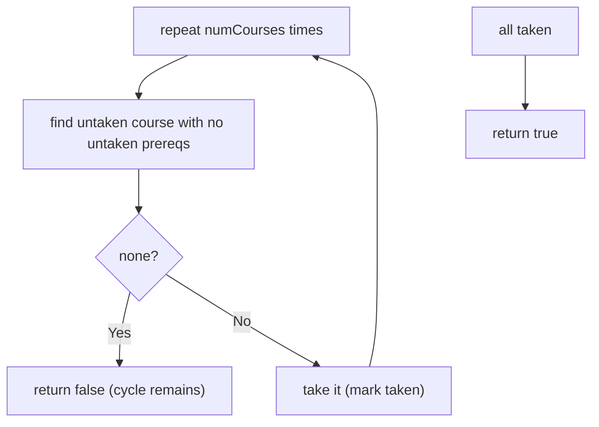
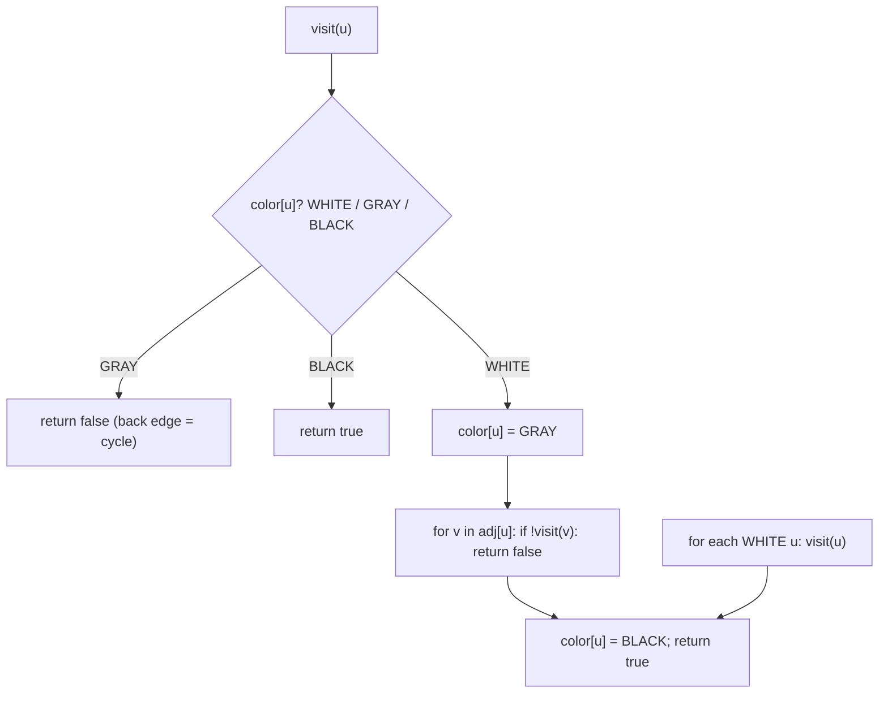
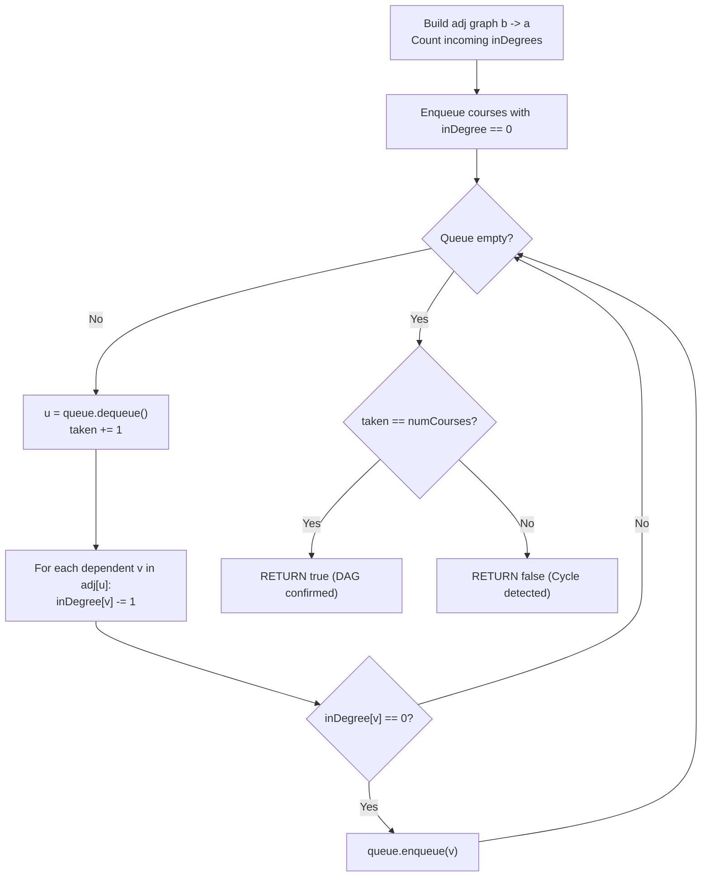

# 207. Course Schedule

- **LeetCode Link**: `https://leetcode.com/problems/course-schedule/`
- **Difficulty**: Medium
- **Pattern Category**: Graph / Cycle Detection (Topological Feasibility)
- **Prerequisite Primer**: `00-foundations/03-core-algorithmic-patterns.md`

---

## 1. Problem Overview & Edge Case Matrix

### Problem Statement
There are a total of `numCourses` courses labeled from `0` to `numCourses - 1`. You are given an array `prerequisites` where `prerequisites[i] = [ai, bi]` indicates that you must take course `bi` first if you want to take course `ai`. Return `true` if you can finish all courses (i.e. the prerequisite graph is acyclic). Otherwise, return `false`.

```
Example 1:
Input: numCourses = 2, prerequisites = [[1,0]]
Output: true
Explanation: Take course 0, then course 1.

Example 2:
Input: numCourses = 2, prerequisites = [[1,0],[0,1]]
Output: false
Explanation: Circular dependency — impossible.
```

### Visual Problem Representation
```
feasible:   0 -> 1 -> 3        cyclic:   0 <-> 1   (mutual prereqs)
            |                   (no topological order exists)
            v
            2
```

### Upfront Edge Case Matrix
| Edge Case Category | Specific Input Scenario | Expected Behavior | Pitfall / Risk |
| :--- | :--- | :--- | :--- |
| No prerequisites | `prerequisites = []` | Return `true` | Empty-graph handling |
| Self-loop | `[[0,0]]` | Return `false` | Self-edge ignored as trivial |
| Disconnected | Isolated courses | Return `true` | Components never visited |
| Long chain | `0→1→…→1999$` | Return `true` | Recursion depth on chains |
| Duplicate edges | `[[1,0],[1,0]]` | Return `true` | Indegree double-count (Kahn) / harmless (DFS) |

---

## 2. Level 1: Brute Force Approach

### Intuition & Visual Idea
Repeatedly scan for a course with no remaining prerequisites, take it, and delete its outgoing edges. No queue, no adjacency structure beyond edge lists — each round rescans everything: $O(V·E)$.



### Pseudocode
```text
FUNCTION canFinishBruteForce(numCourses, prerequisites):
    taken = BOOLEAN ARRAY (false)
    REPEAT numCourses TIMES:
        progress = false
        FOR c IN 0 .. numCourses-1:
            IF taken[c]: CONTINUE
            IF NO [c, p] IN prerequisites WITH NOT taken[p]:
                taken[c] = true; progress = true; BREAK
        IF NOT progress: RETURN false
    RETURN true
```

### Step-by-Step Dry Run (Visual Trace)
| Step | Iteration / Pointer ($i, j$) | Current Value | State / Sub-array | Action Taken |
| :--- | :--- | :--- | :--- | :--- |
| 0 | round 1 | course `0`: no prereqs | Take `0` | Progress |
| 1 | round 2 | course `1`: prereq `0` taken | Take `1` | Progress |
| 2 | all taken | — | — | Return `true` |
| 3 | cyclic input | no course qualifies | No progress | Return `false` |

### Modern JavaScript Implementation
```javascript
/**
 * Level 1: Brute Force (repeated prerequisite scan)
 * Time Complexity:  O(V·E) — full edge rescan per taken course
 * Space Complexity: O(V) — taken flags
 */
function canFinishBruteForce(numCourses, prerequisites) {
  const taken = new Array(numCourses).fill(false);
  for (let round = 0; round < numCourses; round++) {
    let progress = false;
    for (let c = 0; c < numCourses; c++) {
      if (taken[c]) continue;
      // A course is takeable iff every prerequisite is already taken.
      // NOTE: [a, b] means b-before-a (b is the prerequisite).
      const blocked = prerequisites.some(([a, b]) => a === c && !taken[b]);
      if (!blocked) {
        taken[c] = true;
        progress = true;
        break; // one course per round (deliberately naive)
      }
    }
    // A full round with no takeable course proves a remaining cycle.
    if (!progress) return false;
  }
  return true;
}
```

### Complexity Breakdown
- **Time Complexity**: $O(V·E)$ — each round scans all courses × all edges.
- **Space Complexity**: $O(V)$ — taken flags; the rescan is the waste.

---

## 3. Level 2: Optimized Approach

### Intuition & Visual Bottleneck Elimination
DFS 3-color cycle detection: WHITE (unvisited) → GRAY (on current path) → BLACK (fully explored). Reaching a GRAY node proves a cycle. Recursive, $O(V + E)$, no indegrees — the graph-theoretic answer.



### Pseudocode
```text
FUNCTION canFinishDFS(numCourses, prerequisites):
    adj = ADJACENCY (b -> a for [a, b])
    color = ARRAY(numCourses, WHITE)
    DEFINE visit(u):
        IF color[u] == GRAY: RETURN false
        IF color[u] == BLACK: RETURN true
        color[u] = GRAY
        FOR v IN adj[u]:
            IF NOT visit(v): RETURN false
        color[u] = BLACK
        RETURN true
    FOR u IN 0 .. numCourses-1:
        IF color[u] == WHITE AND NOT visit(u): RETURN false
    RETURN true
```

### Step-by-Step Dry Run (Visual Trace)
| Step | Pointers / Window | Hash Map / Auxiliary State | Decision Logic | Output Accumulator |
| :--- | :--- | :--- | :--- | :--- |
| 0 | `visit(1)` | GRAY `{1}` | Neighbors of `1`: `[0]` | Recurse |
| 1 | `visit(0)` | GRAY `{1,0}` | Neighbors of `0`: `[]` | `BLACK(0)`, true |
| 2 | unwind to `1` | all neighbors clean | `BLACK(1)` | Return `true` |
| 3 | cyclic input | `visit(0)` → `visit(1)` → `visit(0)` GRAY | Back edge! | Return `false` |

### Modern JavaScript Implementation
```javascript
/**
 * Level 2: Optimized (recursive 3-color DFS)
 * Time Complexity:  O(V + E) — each node/edge processed once
 * Space Complexity: O(V + E) — adjacency plus O(V) colors/stack
 */
function canFinishDFS(numCourses, prerequisites) {
  // Edge [a, b] (b-before-a) becomes adjacency b -> a.
  const adj = Array.from({ length: numCourses }, () => []);
  for (const [a, b] of prerequisites) adj[b].push(a);
  const WHITE = 0;
  const GRAY = 1; // on the current DFS path: revisits mean cycles
  const BLACK = 2; // fully explored: safe to skip
  const color = new Array(numCourses).fill(WHITE);
  function visit(u) {
    if (color[u] === GRAY) return false; // back edge: cycle proven
    if (color[u] === BLACK) return true; // solved before: free
    color[u] = GRAY;
    for (const v of adj[u]) {
      if (!visit(v)) return false;
    }
    color[u] = BLACK;
    return true;
  }
  for (let u = 0; u < numCourses; u++) {
    if (color[u] === WHITE && !visit(u)) return false;
  }
  return true;
}
```

### Complexity Breakdown
- **Time Complexity**: $O(V + E)$ — each node colored once, each edge walked once.
- **Space Complexity**: $O(V + E)$ — adjacency plus colors/stack.

---

## 4. Level 3: Most Optimal / Canonical Approach

### Intuition & Mathematical / Invariant Proof
Kahn's algorithm: indegree-zero courses are takeable now; taking one decrements its dependents, possibly unlocking them. A queue processes takeable courses in $O(1)$ amortized each; if all $V$ are taken, a topological order exists (acyclic ⟺ Kahn drains fully — the theorem). Invariant: the queue holds exactly the untaken courses with zero remaining prerequisites. Duplicate edges inflate indegrees — dedupe or tolerate (tolerating still terminates correctly since decrements match increments; dedupe for cleanliness).

```
[[1,0]]: indegree [0,1]; queue [0]: take 0 -> indegree[1] = 0 -> take 1.
  taken 2 == numCourses -> true.
[[1,0],[0,1]]: indegree [1,1]; queue empty, taken 0 != 2 -> false.
```

### Pseudocode
```text
FUNCTION canFinish(numCourses, prerequisites):
    adj = ADJACENCY (b -> a); indegree = ZEROS
    FOR [a, b] IN prerequisites: adj[b].PUSH(a); indegree[a]++
    queue = ALL indegree-0 COURSES; taken = 0
    WHILE queue NOT EMPTY:
        u = queue.SHIFT(); taken++
        FOR v IN adj[u]:
            indegree[v]--
            IF indegree[v] == 0: queue.PUSH(v)
    RETURN taken == numCourses
```

### Step-by-Step Dry Run (Visual Trace)
| Step | Pointer $L$ | Pointer $R$ | Invariant Checked | In-Place State |
| :--- | :--- | :--- | :--- | :--- |
| 1 | queue `[0]` | `indegree = [0,1]` | `0` takeable | Take `0` |
| 2 | unlock `1` | `indegree[1] = 0` | Enqueue | Take `1` |
| 3 | queue drains | `taken = 2 == numCourses` | Fully ordered | Return `true` |
| 4 | cyclic input | queue `[]`, taken `0` | Nothing takeable | Return `false` |

### Modern JavaScript Implementation
```javascript
/**
 * Level 3: Most Optimal / Canonical (Kahn's topological drain)
 * Time Complexity:  O(V + E) — each node/edge processed once, optimal
 * Space Complexity: O(V + E) — adjacency plus indegree array
 */
function canFinish(numCourses, prerequisites) {
  // Edge [a, b] (b-before-a) becomes adjacency b -> a with indegree[a]++.
  const adj = Array.from({ length: numCourses }, () => []);
  const indegree = new Array(numCourses).fill(0);
  for (const [a, b] of prerequisites) {
    adj[b].push(a);
    indegree[a]++;
  }
  // Seed: courses with no prerequisites are takeable immediately.
  const queue = [];
  for (let c = 0; c < numCourses; c++) {
    if (indegree[c] === 0) queue.push(c);
  }
  let taken = 0;
  let head = 0; // read cursor: O(1) dequeue (see BFS guides)
  while (head < queue.length) {
    const u = queue[head++];
    taken++;
    for (const v of adj[u]) {
      indegree[v]--;
      // Zero remaining prerequisites: takeable now.
      if (indegree[v] === 0) queue.push(v);
    }
  }
  // Fully drained ⟺ acyclic (Kahn's theorem). Leftovers prove a cycle.
  return taken === numCourses;
}
```

### Complexity Breakdown
- **Time Complexity**: $O(V + E)$ — optimal; every node and edge handled once.
- **Space Complexity**: $O(V + E)$ — adjacency plus indegree; the standard form.

---

## 5. JavaScript-Specific Gotchas & V8 Optimizations
- **GC Pressure**: Avoid allocating objects inside tight loops ($O(N)$ closures). Level 1's per-round `.some()` closures over the edge list are the pressure removed — Levels 2–3 walk adjacency arrays directly.
- **Type Coercion / Sorting**: Edge direction `[a, b]` = "b-before-a" is THE trap — building adjacency `a -> b` (backwards) inverts the graph and answers the wrong question while looking plausible. Destructure with the comment attached, every time.
- **Index Bounds**: `queue.shift()` is $O(V)$ memmove — the head-index cursor (Level 3) keeps Kahn honestly linear. Self-loops (`[0,0]`) increment indegree with no takeable path — correctly yield `false` (not a special case).

---

## 6. Real-World MAANG Interview Follow-Ups & Extensions

### Follow-Up 1: Return an order (Course Schedule II)
- **Scenario**: Emit the topological order, not just feasibility (LeetCode 210, next guide).
- **Solution Strategy**: Level 3 already visits in topological order — record the dequeue sequence instead of counting. DFS Level 2 needs post-order reversal instead.
- **JS Code / Implementation Pattern**:
```javascript
function findOrder(numCourses, prerequisites) {
  return kahnOrder(numCourses, prerequisites); // next guide's Level 3
}
```

### Follow-Up 2: Dynamic prerequisites (online cycle watch)
- **Scenario**: Edges insert over time; report the moment a cycle forms.
- **Solution Strategy**: Incremental topological maintenance (Pearce-Kelly or Bender-style relabeling): only the affected region reorders per insert — amortized sublinear vs full Kahn per insert.
- **JS Code / Implementation Pattern**:
```javascript
function watchCycles(numCourses) {
  return incrementalTopo(numCourses); // per-insert affected-region reorder
}
```

### Follow-Up 3: $10^9$-node dependency graph with sharded edges
- **Scenario & In-Depth Solution**: Courses shard across machines; edges cross shards. Distributed Kahn: each shard owns indegree counters for its nodes, exchanging decrement messages (Pregel-style supersteps); termination detection via quiet rounds. One message per cross edge, bulk-synchronous.
```javascript
async function distributedKahn(shards) {
  return pregelDrain(shards); // superstep decrements + quiet-round detection
}
```

---

## 7. What LeetCode Discuss Says (Language-Independent)

Source: top-voted post by Ishita Joshi —
`https://leetcode.com/problems/course-schedule/solutions/7298103/bfs-dfs-approach-explained-kahns-algorit-so9p/`
— 34.2K views.
Language-independent summary. No new JS here.

### A. Optimal way from Discuss (Kahn's Algorithm for Topological Sort / Cycle Detection)

Map course prerequisites into a directed graph and eliminate zero-in-degree nodes iteratively:

1. **Graph Direction Invariant:**
   - Prerequisite pair `[a, b]` dictates that course $b$ must be mastered before course $a$ can be attempted. This corresponds strictly to directed edge $b \to a$.
   - A schedule is achievable if and only if the directed graph contains zero directed cycles (i.e. is a Directed Acyclic Graph / DAG).
2. **Kahn's BFS In-Degree Processing:**
   - Construct adjacency list where each course points to its dependents: `adj[b]` contains `a`.
   - Maintain an array `inDegree` of size $numCourses$ counting incoming prerequisite dependencies.
   - Seed a BFS queue with all courses having `inDegree[u] == 0` (courses that can be taken immediately).
   - Maintain a running counter `taken = 0`.
   - While the queue contains ready courses:
     - Dequeue course $u$, increment `taken`.
     - For each course $v$ dependent on $u$:
       - Decrement `inDegree[v]`.
       - If `inDegree[v]` reaches 0 (all prerequisites satisfied), enqueue $v$.
   - If `taken == numCourses`, all courses can be successfully scheduled. Otherwise, a cycle deadlocked remaining courses.

```text
FUNCTION canFinish(numCourses, prerequisites):
    adj = ARRAY OF SIZE numCourses WITH EMPTY LISTS
    inDegree = ARRAY OF SIZE numCourses FILLED WITH 0

    FOR EACH pair IN prerequisites:
        course = pair[0]
        prereq = pair[1]
        adj[prereq].APPEND(course)
        inDegree[course] = inDegree[course] + 1

    queue = QUEUE()
    FOR i FROM 0 TO numCourses - 1:
        IF inDegree[i] == 0:
            queue.ENQUEUE(i)

    taken = 0
    WHILE queue IS NOT EMPTY:
        u = queue.DEQUEUE()
        taken = taken + 1

        FOR EACH v IN adj[u]:
            inDegree[v] = inDegree[v] - 1
            IF inDegree[v] == 0:
                queue.ENQUEUE(v)

    RETURN taken == numCourses
```

- Time: O(V + E) — graph construction takes $O(E)$; each vertex is enqueued/dequeued once, and each edge is traversed once.
- Space: O(V + E) — adjacency lists, in-degree array, and queue storage.



### B. Dry run on LeetCode Example 1 (`numCourses = 2, prerequisites = [[1, 0]]`)

- $numCourses = 2$.
- Prerequisite `[1, 0]` creates edge $0 \to 1$.
- In-degrees: `inDegree[0] = 0`, `inDegree[1] = 1`.
- Initial queue: `[0]`. `taken = 0`.
- Dequeue 0:
  - `taken` increments to 1.
  - Neighbor 1: decrement `inDegree[1]` from 1 to 0.
  - `inDegree[1] == 0` $\implies$ enqueue 1.
- Dequeue 1:
  - `taken` increments to 2.
  - No neighbors.
- Queue is now empty.
- Evaluation: `taken == numCourses` ($2 == 2$) $\implies$ returns `true`.

### C. Why Cycle Detection Via In-Degrees is Bulletproof

- In any directed cycle (e.g. $A \to B \to A$), every participating node has an in-degree of at least 1 that can only be decremented by another node in the cycle.
- Because no cyclic node ever reaches an in-degree of 0, none can enter the queue, guaranteeing that `taken` strictly falls short of `numCourses`.

### D. Pitfalls from comments

- **Reversed Edge Orientation:** Storing edge $a \to b$ models courses pointing to their prerequisites, which inverts the topological dependency flow and causes incorrect determinations.
- **Handling Independent Disconnected Components:** Multiple disjoint DAGs are completely valid; Kahn's algorithm handles them naturally by seeding all independent source nodes into the initial queue.

### E. Companies

- Discuss post itself names none.
  Companies tab on LeetCode is premium-locked.
- External source:
  `https://github.com/liquidslr/leetcode-company-wise-problems`
  (LeetCode company tags, updated June 2025).
- All-time (58): Adobe, Akamai, Amazon, Anduril, Apple, Arista Networks, Audible, Aurora, BitGo, Bloomberg, Booking.com, ByteDance, Cisco, Citadel, Cloudflare, Coinbase, Coupang, CrowdStrike, Cruise, DoorDash, eBay, Flipkart, Goldman Sachs, Google, IBM, Infosys, instabase, Intuit, IXL, LinkedIn, LiveRamp, Meta, Microsoft, Moloco, MongoDB, Netflix, Nordstrom, Nutanix, Nvidia, Oracle, PayPal, Qualcomm, Remitly, Roblox, Salesforce, Snap, Snowflake, Swiggy, Tesla, TikTok, Uber, Visa, Walmart Labs, Works Applications, Yelp, Zenefits, Zoho, Zomato.
- Recent: 30 days — Amazon, Google, Salesforce, Walmart Labs.
- Recent: 3 months — Amazon, Apple, Bloomberg, Google, Meta, Salesforce, TikTok, Walmart Labs.
