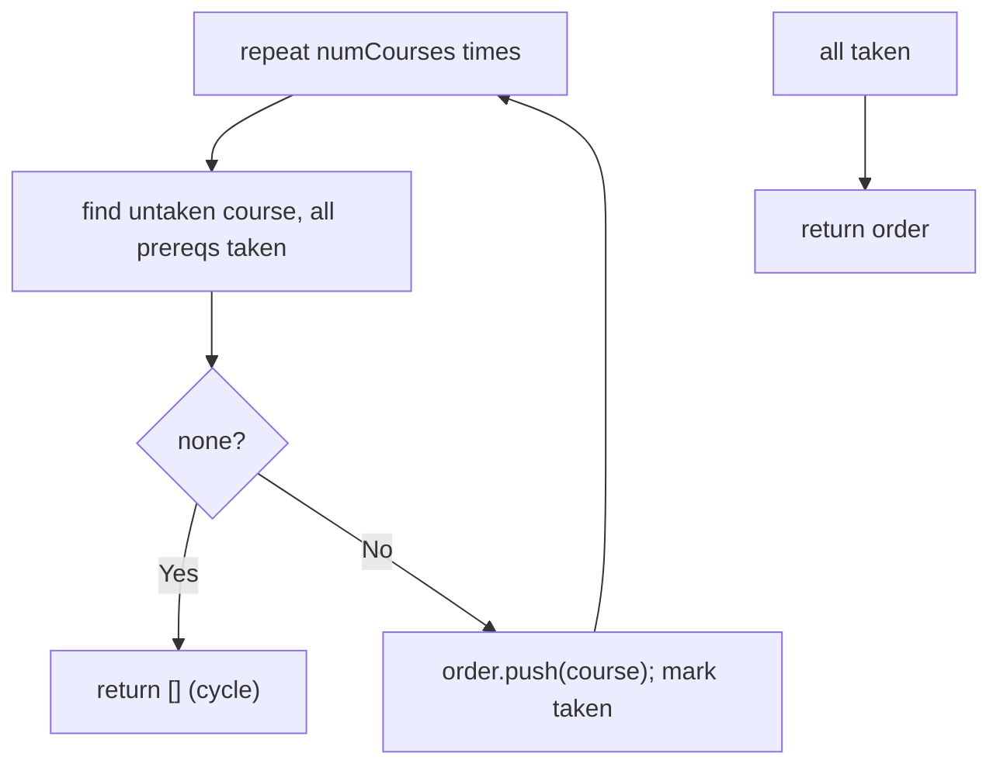
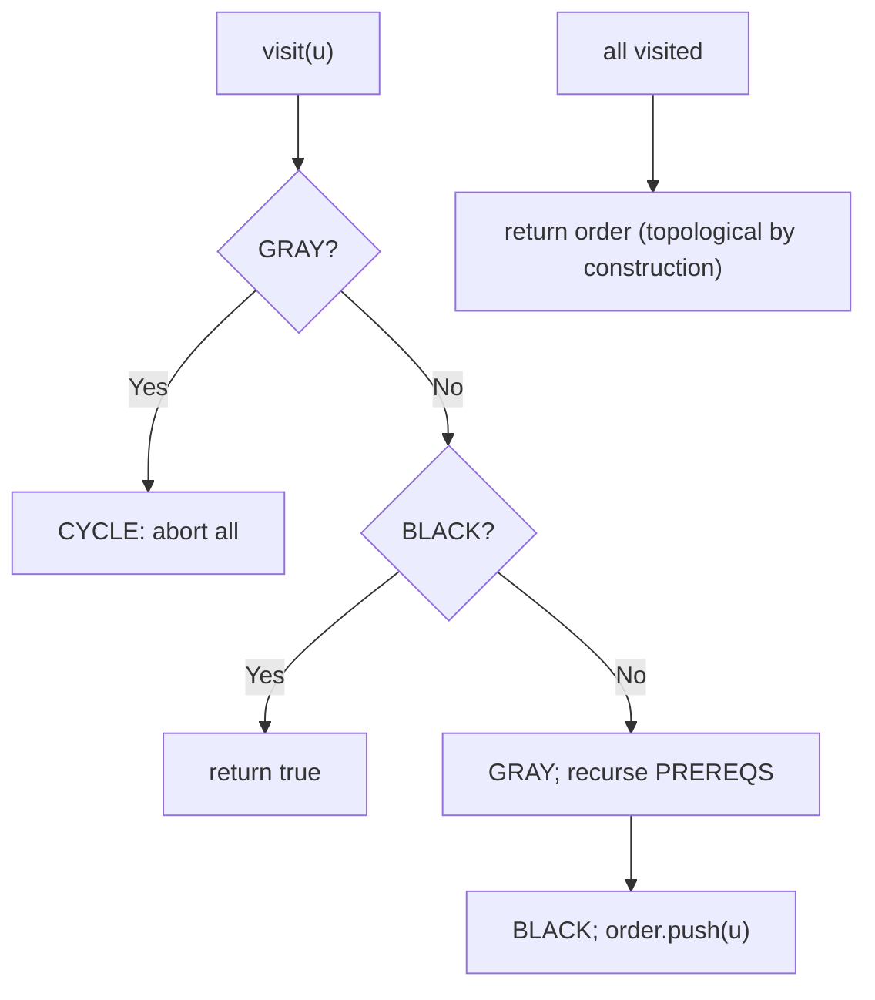

# 210. Course Schedule II

- **LeetCode Link**: `https://leetcode.com/problems/course-schedule-ii/`
- **Difficulty**: Medium
- **Pattern Category**: Graph / Topological Ordering
- **Prerequisite Primer**: `00-foundations/03-core-algorithmic-patterns.md`

---

## 1. Problem Overview & Edge Case Matrix

### Problem Statement
There are a total of `numCourses` courses labeled from `0` to `numCourses - 1`. You are given an array `prerequisites` where `prerequisites[i] = [ai, bi]` indicates that you must take course `bi` first if you want to take course `ai`. Return the ordering of courses you should take to finish all courses. If there are many valid answers, return any of them. If it is impossible to finish all courses, return an empty array.

```
Example 1:
Input: numCourses = 2, prerequisites = [[1,0]]
Output: [0,1]

Example 2:
Input: numCourses = 4, prerequisites = [[1,0],[2,0],[3,1],[3,2]]
Output: [0,1,2,3] (or [0,2,1,3] — any valid order)

Example 3:
Input: numCourses = 1, prerequisites = []
Output: [0]
```

### Visual Problem Representation
```
    0 ----> 1 ----\
     \            v
      +----> 2 -> 3        valid orders: [0,1,2,3] or [0,2,1,3]
```

### Upfront Edge Case Matrix
| Edge Case Category | Specific Input Scenario | Expected Behavior | Pitfall / Risk |
| :--- | :--- | :--- | :--- |
| No prerequisites | `prerequisites = []` | Any permutation (e.g. `[0..n)`) | Returning `[]` (confused with impossible) |
| Single course | `numCourses = 1`, `[]` | Return `[0]` | Empty-order edge |
| Cycle | `[[1,0],[0,1]]` | Return `[]` | Partial order returned |
| Multiple answers | Diamond deps | ANY valid order | Test asserting one specific order |
| Disconnected | Isolated courses | Included anywhere valid | Dropped from output |

---

## 2. Level 1: Brute Force Approach

### Intuition & Visual Idea
Same repeated-scan as Course Schedule I, but recording the take order instead of counting. Each round scans all courses for one with satisfied prerequisites — $O(V·E)$, order-emitting.



### Pseudocode
```text
FUNCTION findOrderBruteForce(numCourses, prerequisites):
    taken = BOOLEAN ARRAY (false); order = []
    REPEAT numCourses TIMES:
        found = -1
        FOR c IN 0 .. numCourses-1:
            IF taken[c]: CONTINUE
            IF NO [c, p] WITH NOT taken[p]: found = c; BREAK
        IF found == -1: RETURN []
        taken[found] = true; order.PUSH(found)
    RETURN order
```

### Step-by-Step Dry Run (Visual Trace)
| Step | Iteration / Pointer ($i, j$) | Current Value | State / Sub-array | Action Taken |
| :--- | :--- | :--- | :--- | :--- |
| 0 | round 1 | course `0` free | Take | `order = [0]` |
| 1 | round 2 | course `1` (prereq taken) | Take (lowest index) | `order = [0,1]` |
| 2 | round 3 | course `2` | Take | `order = [0,1,2]` |
| 3 | round 4 | course `3` | Take | Return `[0,1,2,3]` |

### Modern JavaScript Implementation
```javascript
/**
 * Level 1: Brute Force (repeated scan, order-emitting)
 * Time Complexity:  O(V·E) — full edge rescan per taken course
 * Space Complexity: O(V) — taken flags plus output
 */
function findOrderBruteForce(numCourses, prerequisites) {
  const taken = new Array(numCourses).fill(false);
  const order = [];
  for (let round = 0; round < numCourses; round++) {
    let found = -1;
    for (let c = 0; c < numCourses; c++) {
      if (taken[c]) continue;
      // Takeable iff every prerequisite is already taken ([c,p] = p-before-c).
      const blocked = prerequisites.some(([a, b]) => a === c && !taken[b]);
      if (!blocked) {
        found = c;
        break; // one course per round (deliberately naive)
      }
    }
    // A round with no takeable course proves a remaining cycle.
    if (found === -1) return [];
    taken[found] = true;
    order.push(found);
  }
  return order;
}
```

### Complexity Breakdown
- **Time Complexity**: $O(V·E)$ — rescan per course.
- **Space Complexity**: $O(V)$ — flags plus output (required).

---

## 3. Level 2: Optimized Approach

### Intuition & Visual Bottleneck Elimination
DFS post-order over prerequisite adjacency: recurse into a course's PREREQUISITES first, append the course AFTER its subtree completes — prereqs always precede it, so the append order IS topological directly (no reversal). Cycle detection via the same 3-color scheme (GRAY revisit = impossible → return []).



Direction choice (load-bearing): this level uses adjacency `a -> b` (course → its PREREQUISITES) — the mirror of Level 3's `b -> a`. DFS from `u` therefore visits prereqs first. (With `b -> a` adjacency the same code would emit reverse-topological order and need a final reverse — pick one direction and keep the append consistent with it.)

### Pseudocode
```text
FUNCTION findOrderDFS(numCourses, prerequisites):
    adj = ADJACENCY (a -> b: course -> its prerequisites)
    color = WHITE ARRAY; order = []; ok = true
    DEFINE visit(u):
        IF color[u] == GRAY: ok = false; RETURN
        IF color[u] == BLACK: RETURN
        color[u] = GRAY
        FOR v IN adj[u]: visit(v); IF NOT ok: RETURN
        color[u] = BLACK
        order.PUSH(u)     // post-visit: every prereq of u already appended
    FOR u IN 0 .. n-1:
        IF WHITE: visit(u); IF NOT ok: RETURN []
    RETURN order
```

### Step-by-Step Dry Run (Visual Trace)
| Step | Pointers / Window | Hash Map / Auxiliary State | Decision Logic | Output Accumulator |
| :--- | :--- | :--- | :--- | :--- |
| 0 | `visit(0)` | prereqs: none | Append | `order = [0]` |
| 1 | `visit(1)` | prereq `0` BLACK, skip | Append | `order = [0,1]` |
| 2 | `visit(2)` | prereq `0` BLACK, skip | Append | `order = [0,1,2]` |
| 3 | `visit(3)` | prereqs `1, 2` BLACK | Append | `order = [0,1,2,3]` |

### Modern JavaScript Implementation
```javascript
/**
 * Level 2: Optimized (DFS post-order with prerequisite adjacency)
 * Time Complexity:  O(V + E) — each node/edge processed once
 * Space Complexity: O(V + E) — adjacency plus O(V) colors/stack
 */
function findOrderDFS(numCourses, prerequisites) {
  // Adjacency course -> its PREREQUISITES (walked first, appended after).
  const adj = Array.from({ length: numCourses }, () => []);
  for (const [a, b] of prerequisites) adj[a].push(b);
  const WHITE = 0;
  const GRAY = 1; // on the current path: revisits mean cycles
  const BLACK = 2; // fully explored
  const color = new Array(numCourses).fill(WHITE);
  const order = [];
  let ok = true;
  function visit(u) {
    if (!ok) return; // cycle already proven: unwind fast
    if (color[u] === GRAY) {
      ok = false; // back edge: prerequisite cycle
      return;
    }
    if (color[u] === BLACK) return; // solved before: free
    color[u] = GRAY;
    for (const v of adj[u]) visit(v); // prerequisites complete first
    color[u] = BLACK;
    order.push(u); // post-visit: every prereq of u precedes it
  }
  for (let u = 0; u < numCourses; u++) {
    if (color[u] === WHITE) visit(u);
    if (!ok) return []; // cycle: no valid ordering exists
  }
  return order;
}
```

### Complexity Breakdown
- **Time Complexity**: $O(V + E)$ — one visit per node/edge.
- **Space Complexity**: $O(V + E)$ — adjacency plus colors/stack.

---

## 4. Level 3: Most Optimal / Canonical Approach

### Intuition & Mathematical / Invariant Proof
Kahn's algorithm emitting the dequeue sequence: indegree-zero courses are takeable now; taking one may unlock dependents. The dequeue ORDER is a valid topological order by construction (every emitted course had all prerequisites emitted earlier). If fewer than $V$ emit, a cycle remains → `[]`. Invariant: the queue holds exactly the untaken zero-remaining-prerequisite courses. Same code as Course Schedule I's Level 3, recording instead of counting.

```
[[1,0],[2,0],[3,1],[3,2]]: indegree [0,1,1,2]; queue [0]:
  take 0 -> indegree [0,0,0,2]... wait: dependents of 0 are 1,2 -> [0,0,0,2], queue [1,2]
  take 1 -> dependent 3: indegree[3] = 1, queue [2]
  take 2 -> dependent 3: indegree[3] = 0, queue [3]
  take 3 -> order [0,1,2,3], length 4 == numCourses -> return
```

### Pseudocode
```text
FUNCTION findOrder(numCourses, prerequisites):
    adj = ADJACENCY (b -> a); indegree = ZEROS
    FOR [a, b] IN prerequisites: adj[b].PUSH(a); indegree[a]++
    queue = ALL indegree-0 COURSES; order = []
    head = 0
    WHILE head < queue.LENGTH:
        u = queue[head++]; order.PUSH(u)
        FOR v IN adj[u]:
            indegree[v]--
            IF indegree[v] == 0: queue.PUSH(v)
    RETURN order.LENGTH == numCourses ? order : []
```

### Step-by-Step Dry Run (Visual Trace)
| Step | Pointer $L$ | Pointer $R$ | Invariant Checked | In-Place State |
| :--- | :--- | :--- | :--- | :--- |
| 1 | queue `[0]` | `indegree = [0,1,1,2]` | `0` takeable | Take `0`, unlock `1, 2` |
| 2 | queue `[1,2]` | take `1` | Dependent `3` drops to `1` | `order = [0,1]` |
| 3 | queue `[2]` | take `2` | Dependent `3` drops to `0` | Enqueue `3` |
| 4 | queue `[3]` | take `3` | Length `4 == 4` | Return `[0,1,2,3]` |

### Modern JavaScript Implementation
```javascript
/**
 * Level 3: Most Optimal / Canonical (Kahn's emitting dequeue order)
 * Time Complexity:  O(V + E) — each node/edge processed once, optimal
 * Space Complexity: O(V + E) — adjacency plus indegree array
 */
function findOrder(numCourses, prerequisites) {
  // Edge [a, b] (b-before-a) becomes adjacency b -> a with indegree[a]++.
  const adj = Array.from({ length: numCourses }, () => []);
  const indegree = new Array(numCourses).fill(0);
  for (const [a, b] of prerequisites) {
    adj[b].push(a);
    indegree[a]++;
  }
  // Seed: prerequisite-free courses takeable immediately.
  const queue = [];
  for (let c = 0; c < numCourses; c++) {
    if (indegree[c] === 0) queue.push(c);
  }
  const order = [];
  let head = 0; // read cursor: O(1) dequeue
  while (head < queue.length) {
    const u = queue[head++];
    order.push(u); // takeable now: its position in the order is final
    for (const v of adj[u]) {
      indegree[v]--;
      // All prerequisites taken: takeable now.
      if (indegree[v] === 0) queue.push(v);
    }
  }
  // Fully drained ⟺ acyclic; leftovers prove a cycle (return [] per spec).
  return order.length === numCourses ? order : [];
}
```

### Complexity Breakdown
- **Time Complexity**: $O(V + E)$ — optimal; every node and edge handled once.
- **Space Complexity**: $O(V + E)$ — adjacency plus indegree; output excluded.

---

## 5. JavaScript-Specific Gotchas & V8 Optimizations
- **GC Pressure**: Avoid allocating objects inside tight loops ($O(N)$ closures). Level 1's per-round `.some()` closures over edges are the pressure removed — Levels 2–3 walk adjacency arrays directly.
- **Type Coercion / Sorting**: Level 2's adjacency runs course→PREREQ (opposite of Level 3's prereq→course) — same `[a, b]` pair, mirrored edge meaning. The direction is an implementation choice, but post-order correctness DEPENDS on it: appending works iff adjacency points at prerequisites (visited-first). Mix the directions and the order inverts silently.
- **Index Bounds**: `order.length === numCourses ? order : []` — the cycle check MUST compare lengths, not truthiness (`[]` is truthy in JS — `return order || []` never fires). Duplicate edges inflate indegrees symmetrically (Kahn still terminates correctly).

---

## 6. Real-World MAANG Interview Follow-Ups & Extensions

### Follow-Up 1: Lexicographically smallest topological order
- **Scenario**: Among valid orders, return the smallest lexicographically.
- **Solution Strategy**: Level 3 with a MIN-heap instead of a FIFO queue (always take the smallest available course). $O((V+E) \log V)$ — the only change is the ready-set structure.
- **JS Code / Implementation Pattern**:
```javascript
function lexicographicOrder(numCourses, prerequisites) {
  return kahnWithHeap(numCourses, prerequisites, new MinHeap()); // ready-set swap
}
```

### Follow-Up 2: One-shot cycle edge (minimum feedback arc hint)
- **Scenario**: If cyclic, report ONE prerequisite edge whose removal MIGHT break the cycle.
- **Solution Strategy**: Level 2's GRAY encounter `(u → v)` names a cycle edge directly — return it. (True minimum-feedback-arc is NP-hard; the interview asks for any cycle witness, not the optimum.)
- **JS Code / Implementation Pattern**:
```javascript
function findCycleEdge(numCourses, prerequisites) {
  return firstGrayEncounter(numCourses, prerequisites); // Level 2 witness
}
```

### Follow-Up 3: $10^9$-node build graph with incremental edges (Bazel-scale)
- **Scenario & In-Depth Solution**: Build targets stream dependencies; only the affected subgraph fits in RAM. Persist indegrees in a key-value store; Kahn's queue becomes a durable worklist (level-by-level supersteps, Pregel-style). New edges trigger incremental affected-region reorder, not full recomputation.
```javascript
async function incrementalTopoBuild(targetStore, newEdges) {
  return affectedRegionReorder(targetStore, newEdges); // durable worklist Kahn
}
```
