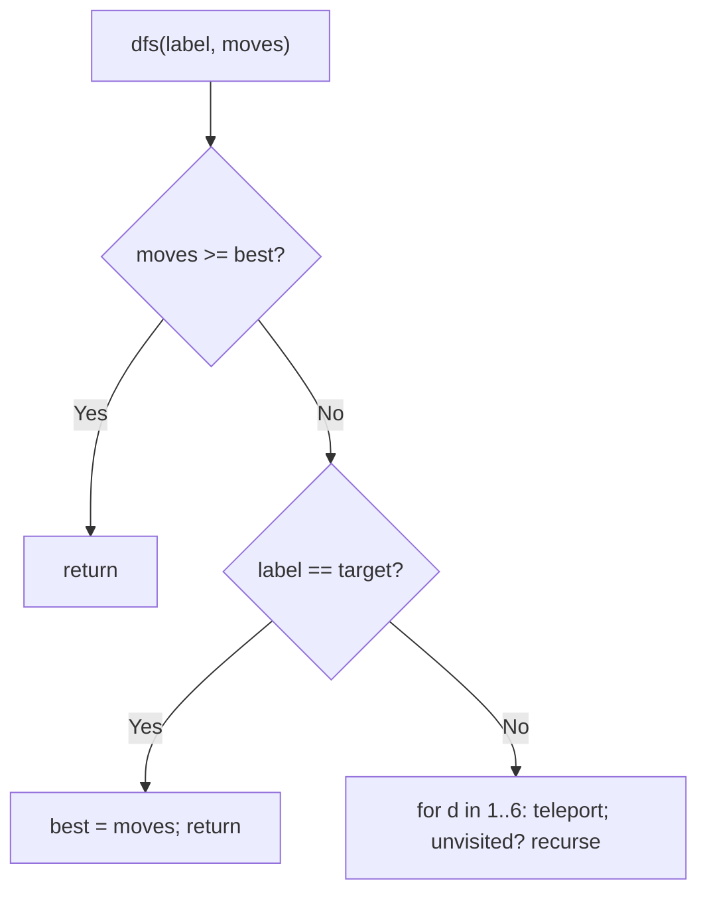
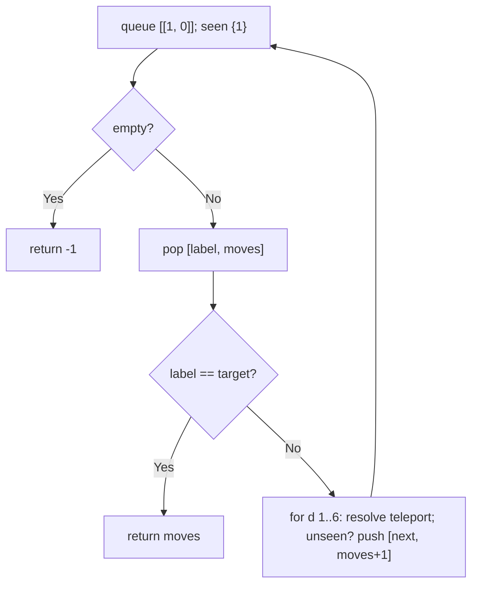
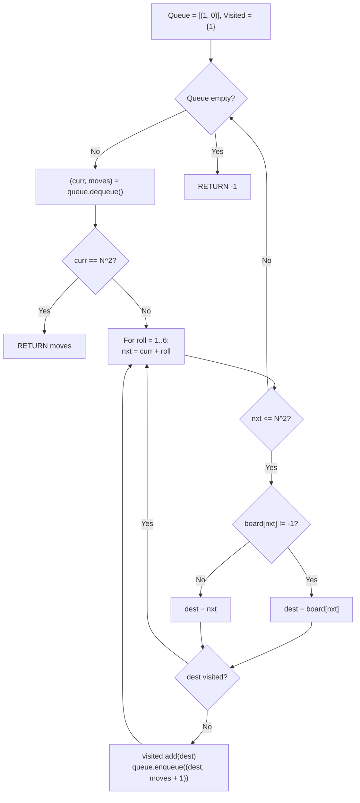

# 909. Snakes and Ladders

- **LeetCode Link**: `https://leetcode.com/problems/snakes-and-ladders/`
- **Difficulty**: Medium
- **Pattern Category**: Graph BFS / Implicit Board Graph
- **Prerequisite Primer**: `00-foundations/03-core-algorithmic-patterns.md`

---

## 1. Problem Overview & Edge Case Matrix

### Problem Statement
You are given an `n x n` integer matrix `board` where cells are labeled 1 to $n^2$ in Boustrophedon style (alternating direction per row, starting bottom-left). Landing on a cell with a snake or ladder (`board[r][c] != -1`) teleports you to the destination square. Starting from square 1, return the minimum dice rolls (1–6) to reach square $n^2$.

```
Example 1:
Input: board = [[-1,-1,-1,-1,-1,-1],[-1,-1,-1,-1,-1,-1],[-1,-1,-1,-1,-1,-1],[-1,35,-1,-1,13,-1],[-1,-1,-1,-1,-1,-1],[-1,15,-1,-1,-1,-1]]
Output: 4

Example 2:
Input: board = [[-1,-1],[-1,3]]
Output: 1
Explanation: Labels run 1,2 along the bottom row, then 3,4 right-to-left on
top (square 3 at (0,1), square 4 at (0,0)); square 2 holds a ladder to
square 3. From square 1, a single roll of 3 lands directly on square 4.
```

### Visual Problem Representation
```
6x6 ex.1: label 1 at bottom-left (5,0); rows alternate direction.
  dice from 1: squares 2..7 (teleport if snake/ladder).
  BFS layers = roll counts: answer 4.
```

### Upfront Edge Case Matrix
| Edge Case Category | Specific Input Scenario | Expected Behavior | Pitfall / Risk |
| :--- | :--- | :--- | :--- |
| Tiny board | `n = 1` (`[[-1]]`) | Return `0` (already there) | Loop needing moves |
| Direct reach | Target within 6 of start | Return `1` | BFS that overcounts layers |
| Ladder to target | Landing exactly on $n^2$ via ladder | Counts the roll that landed | Post-teleport target check |
| Unreachable | Snakes guard the target | Return `-1` | Visited set omitting teleports |
| Overshoot | `label + d > n²` | Move skipped | Index mapping past the end |

---

## 2. Level 1: Brute Force Approach

### Intuition & Visual Idea
Exhaustive DFS over roll sequences with a visited set and best-tracking: try all dice outcomes to depth, pruning paths already worse than the best. Correct — exponential in the worst case.



### Pseudocode
```text
FUNCTION snakesAndLaddersBruteForce(board):
    target = n * n; best = Infinity
    DEFINE dfs(label, moves):
        IF moves >= best: RETURN
        IF label == target: best = moves; RETURN
        FOR d IN 1 .. 6 WHILE label + d <= target:
            next = label + d
            [r, c] = LABEL-POS(next)
            IF board[r][c] != -1: next = board[r][c]
            IF NOT visited HAS next:
                visited.ADD(next); dfs(next, moves + 1); visited.DELETE(next)
    visited = SET([1]); dfs(1, 0)
    RETURN best == Infinity ? -1 : best
```

### Step-by-Step Dry Run (Visual Trace)
| Step | Iteration / Pointer ($i, j$) | Current Value | State / Sub-array | Action Taken |
| :--- | :--- | :--- | :--- | :--- |
| 0 | `dfs(1, 0)` | 6 dice branches | Teleports applied | Recurse each |
| 1 | deep paths | first arrival sets `best` | Later worse paths pruned | Best tightens |
| 2 | exhaust | all sequences tried/pruned | — | Return `best` (`4` ex.1) |

### Modern JavaScript Implementation
```javascript
/**
 * Shared backbone: Boustrophedon label mapping, defined once here so every
 * level below is locally runnable when concatenated (Level 1 + 2 + 3).
 * Label 1 = bottom-left; rows alternate direction upward.
 */
function labelToPos(label, m, n) {
  const idx = label - 1; // 0-based offset from square 1
  const rowFromBottom = Math.floor(idx / n);
  const r = m - 1 - rowFromBottom;
  let c = idx % n;
  // Odd rows-from-bottom run right-to-left: mirror the column.
  if (rowFromBottom % 2 === 1) c = n - 1 - c;
  return [r, c];
}

/**
 * Level 1: Brute Force (exhaustive DFS with best-tracking)
 * Time Complexity:  O(6^D) worst case — D = answer depth (pruned by best)
 * Space Complexity: O(D) — path stack plus visited set
 */
function snakesAndLaddersBruteForce(board) {
  const m = board.length;
  const n = board[0].length;
  const target = m * n;
  let best = Infinity;
  const visited = new Set([1]);
  function dfs(label, moves) {
    if (moves >= best) return; // cannot improve: prune
    if (label === target) {
      best = moves;
      return;
    }
    for (let d = 1; d <= 6 && label + d <= target; d++) {
      let next = label + d;
      const [r, c] = labelToPos(next, m, n);
      if (board[r][c] !== -1) next = board[r][c]; // snake/ladder ride
      if (visited.has(next)) continue;
      visited.add(next);
      dfs(next, moves + 1);
      visited.delete(next); // restore for sibling paths
    }
  }
  dfs(1, 0);
  return best === Infinity ? -1 : best;
}
```

### Complexity Breakdown
- **Time Complexity**: $O(6^D)$ worst case — exponential in answer depth.
- **Space Complexity**: $O(D)$ — path stack; time is the catastrophe.

---

## 3. Level 2: Optimized Approach

### Intuition & Visual Bottleneck Elimination
BFS over square labels: layers = roll counts, first arrival at the target is optimal (unweighted edges). Visited set prevents reprocessing — $O(N^2)$ time. Teleports resolve at edge time (landing square, not destination, is what's "visited"... precisely: mark the POST-teleport square visited).



### Pseudocode
```text
FUNCTION snakesAndLaddersBFS(board):
    target = m * n
    seen = SET([1]); queue = [[1, 0]]
    WHILE queue NOT EMPTY:
        [label, moves] = queue.SHIFT()
        IF label == target: RETURN moves
        FOR d IN 1 .. 6 WHILE label + d <= target:
            next = label + d
            [r, c] = LABEL-POS(next)
            IF board[r][c] != -1: next = board[r][c]
            IF NOT seen HAS next: seen.ADD(next); queue.PUSH([next, moves+1])
    RETURN -1
```

### Step-by-Step Dry Run (Visual Trace)
| Step | Pointers / Window | Hash Map / Auxiliary State | Decision Logic | Output Accumulator |
| :--- | :--- | :--- | :--- | :--- |
| 0 | layer 0: `[1]` | — | Expand dice 1–6 | Layer 1 squares |
| 1 | layer 1 | teleports resolved | Unseen posts enqueued | Layer 2 |
| 2 | layers 2–3 | BFS order | First target hit | … |
| 3 | layer 4 | target dequeued | Optimal (BFS layers) | Return `4` |

### Modern JavaScript Implementation
```javascript
/**
 * Level 2: Optimized (BFS over labels, first arrival wins)
 * Time Complexity:  O(N²) — each square enqueued once, 6 dice each
 * Space Complexity: O(N²) — visited set plus queue
 */
// labelToPos shared from Level 1.
function snakesAndLaddersBFS(board) {
  const m = board.length;
  const n = board[0].length;
  const target = m * n;
  const seen = new Set([1]);
  const queue = [[1, 0]]; // [label, rolls so far]
  while (queue.length > 0) {
    const [label, moves] = queue.shift();
    // BFS layers = roll counts: first dequeue of target is optimal.
    if (label === target) return moves;
    for (let d = 1; d <= 6 && label + d <= target; d++) {
      let next = label + d;
      const [r, c] = labelToPos(next, m, n);
      if (board[r][c] !== -1) next = board[r][c]; // ride snakes/ladders
      // Mark POST-teleport squares: destinations, not landings, are states.
      if (!seen.has(next)) {
        seen.add(next);
        queue.push([next, moves + 1]);
      }
    }
  }
  return -1; // target never reached: snakes guard it
}
```

### Complexity Breakdown
- **Time Complexity**: $O(N^2)$ — $N^2$ squares, 6 dice each, mapping $O(1)$.
- **Space Complexity**: $O(N^2)$ — visited plus queue; `shift()` is the residual tax.

---

## 4. Level 3: Most Optimal / Canonical Approach

### Intuition & Mathematical / Invariant Proof
Level 2's BFS with a head-index queue (no `shift()` memmove) and inline mapping — same layers, honest $O(N^2)$. Invariant: queue order = nondecreasing roll count (FIFO + uniform edge weight 1), so the first target dequeue is optimal. The mapping arithmetic is inlined for locality but identical to `labelToPos`. This is the production form of the textbook answer.

```
ex.2 [[-1,-1],[-1,3]]: target 4. layer 0 [1]: dice 2,3,4 (d=1 -> square 2 -> ladder 3).
  layer 1 [3 (via ladder), 3 (direct), 4]: 4 dequeued at moves 1 -> return 1.
  (Roll 3 from square 1 lands directly on square 4.)
```

### Pseudocode
```text
FUNCTION snakesAndLadders(board):
    target = m * n
    seen = BOOLEAN ARRAY(target+1); seen[1] = true
    queue = [[1, 0]]; head = 0
    WHILE head < queue.LENGTH:
        [label, moves] = queue[head++]
        IF label == target: RETURN moves
        FOR d IN 1 .. 6 WHILE label + d <= target:
            next = label + d
            [r, c] = INLINE-MAP(next)
            IF board[r][c] != -1: next = board[r][c]
            IF NOT seen[next]: seen[next] = true; queue.PUSH([next, moves+1])
    RETURN -1
```

### Step-by-Step Dry Run (Visual Trace)
| Step | Pointer $L$ | Pointer $R$ | Invariant Checked | In-Place State |
| :--- | :--- | :--- | :--- | :--- |
| 1 | layer 0: `label=1` | dice to `2..7` | Resolve + mark posts | Layer 1 queued |
| 2 | layer 1 dequeues | each expands 6 | FIFO = roll order | Layers grow |
| 3 | target first dequeued | moves = layer index | Optimal by BFS | Return moves |
| 4 | ex.2 | direct roll `1→4` | — | Return `1` |

### Modern JavaScript Implementation
```javascript
/**
 * Level 3: Most Optimal / Canonical (head-index BFS, inline mapping)
 * Time Complexity:  O(N²) — optimal; every square processed once
 * Space Complexity: O(N²) — boolean visited + queue; output excluded
 */
// labelToPos shared from Level 1 (kept as the readable reference).
function snakesAndLadders(board) {
  const m = board.length;
  const n = board[0].length;
  const target = m * n;
  const seen = new Array(target + 1).fill(false);
  seen[1] = true;
  const queue = [[1, 0]]; // [label, rolls]
  let head = 0; // read cursor: O(1) dequeue
  while (head < queue.length) {
    const [label, moves] = queue[head++];
    if (label === target) return moves;
    for (let d = 1; d <= 6 && label + d <= target; d++) {
      let next = label + d;
      // Inline Boustrophedon map (identical to labelToPos).
      const idx = next - 1;
      const rowFromBottom = Math.floor(idx / n);
      const r = m - 1 - rowFromBottom;
      const c = rowFromBottom % 2 === 1 ? n - 1 - (idx % n) : idx % n;
      if (board[r][c] !== -1) next = board[r][c];
      if (!seen[next]) {
        seen[next] = true;
        queue.push([next, moves + 1]);
      }
    }
  }
  return -1;
}
```

### Complexity Breakdown
- **Time Complexity**: $O(N^2)$ — optimal; uniform-weight BFS, first arrival wins.
- **Space Complexity**: $O(N^2)$ — boolean array + queue; minimal for visited BFS.

---

## 5. JavaScript-Specific Gotchas & V8 Optimizations
- **GC Pressure**: Avoid allocating objects inside tight loops ($O(N)$ closures). Level 1's path-set churn is the pressure removed — Levels 2–3 allocate `[label, moves]` pairs per enqueue (bounded by squares); a parallel int-array queue removes even that.
- **Type Coercion / Sorting**: `board[r][c] !== -1` strict — ladder destinations are NUMBERS (could be `0`? No: labels start at 1, always truthy... but strictness is still the habit). `label + d <= target` arithmetic bound (not board-bounds) governs the dice loop.
- **Index Bounds**: The Boustrophedon mirror (`rowFromBottom % 2 === 1`) is THE bug farm — off-by-one in `idx % n` vs `(idx % n)` after mirroring, or forgetting the mirror entirely, silently maps every other row backwards. Mark POST-teleport squares visited (not pre-teleport landings) — marking landings re-enqueues destinations and can loop snake↔ladder pairs forever.

---

## 6. Real-World MAANG Interview Follow-Ups & Extensions

### Follow-Up 1: Minimum dice SUM (weighted dice / variable moves)
- **Scenario**: Dice faces have costs, or moves cost by distance (Dijkstra territory).
- **Solution Strategy**: Same graph, weighted edges → Dijkstra with a min-heap (uniform BFS no longer optimal). Level 3's skeleton with a priority queue swapped in.
- **JS Code / Implementation Pattern**:
```javascript
function minCostSnakes(board, faceCost) {
  return dijkstraBoard(board, faceCost); // heap replaces FIFO queue
}
```

### Follow-Up 2: $10^9$-square board with sparse snakes
- **Scenario**: Board too big to materialize; snakes/ladders few.
- **Solution Strategy**: Coordinate compression around special squares + greedy dice gaps: between specials, dice runs are pure arithmetic (`ceil(gap / 6)`); BFS only over special squares ($O(S)$ states).
- **JS Code / Implementation Pattern**:
```javascript
function sparseSnakes(n, specials) {
  return bfsOverSpecials(n, specials); // arithmetic dice gaps between nodes
}
```

### Follow-Up 3: Adversarial snakes (shortest path under optimal opponent)
- **Scenario & In-Depth Solution**: An opponent places $K$ snakes after seeing your strategy (robust path planning). Minimax over placements is intractable — instead optimize expected rolls under random snake models (Monte Carlo policy evaluation), or compute the minmax path against $K$ worst-case single-edge deletions (K-robust shortest path, solvable via modified Dijkstra).
```javascript
function robustSnakesPath(board, K) {
  return kRobustShortestPath(board, K); // worst-case K deletions tolerated
}
```

---

## 7. What LeetCode Discuss Says (Language-Independent)

Source: top-voted post by lee215 —
`https://leetcode.com/problems/snakes-and-ladders/solutions/173378/diagram-and-bfs-by-lee215-xhwv/`
— 59.9K views.
Language-independent summary. No new JS here.

### A. Optimal way from Discuss (Queue-Driven BFS on Boustrophedon Flattened Board)

Model the game as an unweighted directed graph where every dice roll represents a directed edge of weight 1:

1. **Boustrophedon Coordinate Translation:**
   - Cells are numbered $1$ to $N^2$ starting from the bottom-left and alternating direction each row:
     - $rowFromBottom = \lfloor(s - 1) / N\rfloor$
     - Grid row index: $r = N - 1 - rowFromBottom$
     - Grid column index: if $rowFromBottom$ is even, $c = (s - 1) \pmod N$; if odd, $c = N - 1 - ((s - 1) \pmod N)$.
2. **Single-Hop Jump Semantics:**
   - Rolling a die from square $x$ permits landing on $next \in [x + 1, \min(x + 6, N^2)]$.
   - If square $next$ contains a ladder or snake ($board[r][c] \ne -1$), immediately teleport to destination $dest = board[r][c]$.
   - Teleportation occurs at most once per move (no chaining).
3. **Shortest Path BFS:**
   - Seed a BFS queue with `(square: 1, moves: 0)`.
   - Maintain a boolean `visited` array of size $N^2 + 1$. Mark square 1 as visited.
   - Dequeue $(curr, moves)$. If $curr == N^2$, return $moves$.
   - For each roll $1 \dots 6$: compute candidate destination $dest$.
   - If $dest$ has not been visited, mark it visited and enqueue `(dest, moves + 1)`.
   - If queue empties without reaching $N^2$, return $-1$.

```text
FUNCTION snakesAndLadders(board):
    n = LENGTH(board)
    target = n * n

    FUNCTION getCoordinates(s):
        rowFromBottom = (s - 1) / n
        r = n - 1 - rowFromBottom
        c = (s - 1) % n
        IF rowFromBottom % 2 == 1:
            c = n - 1 - c
        RETURN (r, c)

    queue = QUEUE()
    queue.ENQUEUE((1, 0))  // (square, moves)

    visited = SET()
    visited.ADD(1)

    WHILE queue IS NOT EMPTY:
        (curr, moves) = queue.DEQUEUE()

        IF curr == target:
            RETURN moves

        FOR roll FROM 1 TO 6:
            nxt = curr + roll
            IF nxt > target:
                BREAK

            (r, c) = getCoordinates(nxt)
            dest = nxt
            IF board[r][c] != -1:
                dest = board[r][c]

            IF dest NOT IN visited:
                visited.ADD(dest)
                queue.ENQUEUE((dest, moves + 1))

    RETURN -1
```

- Time: O(N^2) — each square $1 \dots N^2$ is enqueued at most once, and each state evaluates at most 6 dice outcomes.
- Space: O(N^2) — queue and visited set / array.



### B. Dry run on LeetCode Example 1 (`board = [[-1,-1,-1,-1,-1,-1],[-1,-1,-1,-1,-1,-1],[-1,-1,-1,-1,-1,-1],[-1,35,-1,-1,13,-1],[-1,-1,-1,-1,-1,-1],[-1,15,-1,-1,-1,-1]]`)

- Board size $6 \times 6$, target $36$.
- Start at square 1 (moves = 0).
- Dice rolls $1 \dots 6$:
  - Roll 1 $\to$ square 2: $board[r][c] = 15$ (ladder). Enqueue $(15, 1)$.
  - Rolls 2..6 $\to$ squares 3..7 (all $-1$). Enqueue $(3, 1), (4, 1), (5, 1), (6, 1), (7, 1)$.
- From square 15:
  - Roll 2 $\to$ square 17: $board[r][c] = 13$ (snake). Enqueue $(13, 2)$.
  - Progression continues via level BFS until square 35 takes ladder to 36 in 4 moves.
- Output: 4.

### C. Why Destination Marking Eliminates Redundant Teleports

- Marking the post-teleport square ($dest$) as visited guarantees that once a position is reached via the shortest path, no future dice rolls re-evaluate paths already traversed from that square.
- Marking pre-teleport landing cells would allow cyclical bouncing between snakes and ladders.

### D. Pitfalls from comments

- **No Chaining of Ladders/Snakes:** Landing on square 2 climbs ladder to 15; even if 15 had a snake or ladder, you do NOT take it on the same turn.
- **Boustrophedon Index Flips:** Forgetting that row 1 (second from bottom) travels right-to-left causes every odd row to map to inverted cells.

### E. Companies

- Discuss post itself names none.
  Companies tab on LeetCode is premium-locked.
- External source:
  `https://github.com/liquidslr/leetcode-company-wise-problems`
  (LeetCode company tags, updated June 2025).
- All-time (12): Amazon, Anduril, Apple, Bloomberg, Cisco, Goldman Sachs, Google, Meta, Microsoft, Tesla, TikTok, Zomato.
- Recent: 30 days — None.
- Recent: 3 months — Tesla.
