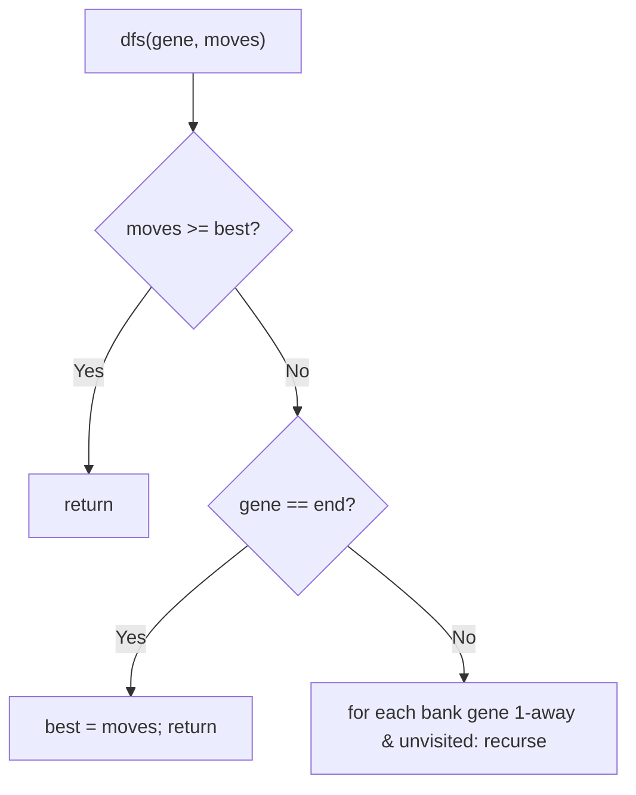
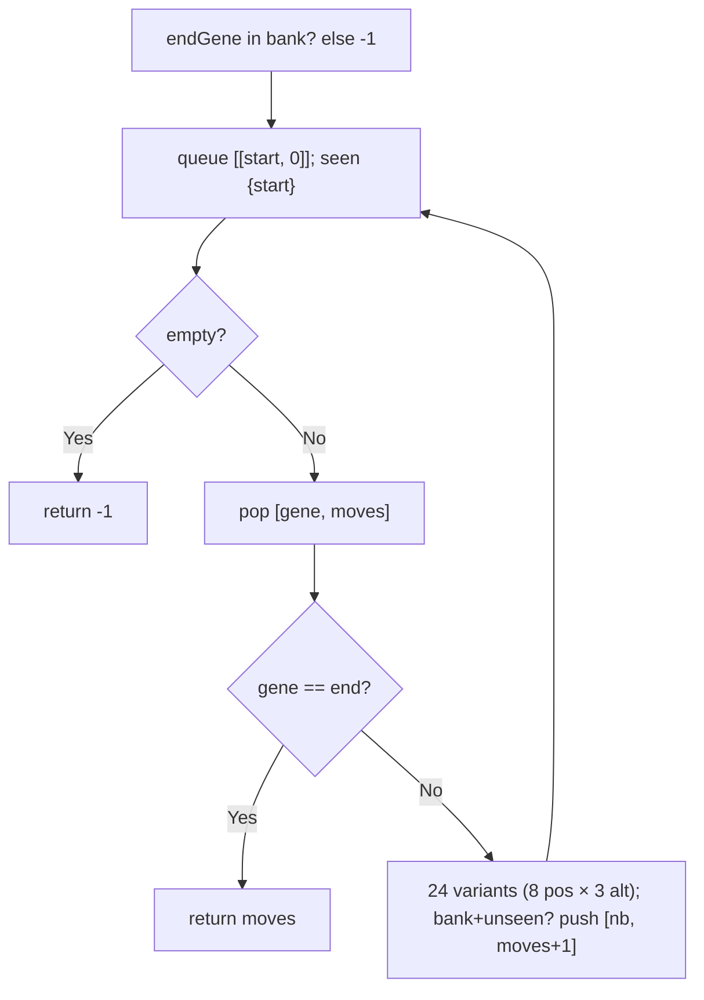

# 433. Minimum Genetic Mutation

- **LeetCode Link**: `https://leetcode.com/problems/minimum-genetic-mutation/`
- **Difficulty**: Medium
- **Pattern Category**: Graph BFS / Mutation Neighborhood
- **Prerequisite Primer**: `00-foundations/03-core-algorithmic-patterns.md`

---

## 1. Problem Overview & Edge Case Matrix

### Problem Statement
A gene string is 8 characters of `A`, `C`, `G`, `T`. Starting from `startGene`, a mutation changes exactly one character; each intermediate gene must be in `bank`. Return the minimum number of mutations to reach `endGene`, or `-1` if impossible.

```
Example 1:
Input: startGene = "AACCGGTT", endGene = "AACCGGTA", bank = ["AACCGGTA"]
Output: 1

Example 2:
Input: startGene = "AACCGGTT", endGene = "AAACGGTA", bank = ["AACCGGTA","AACCGCTA","AAACGGTA"]
Output: 2

Example 3:
Input: startGene = "AAAAACCC", endGene = "AACCCCCC", bank = ["AAAACCCC","AAACCCCC","AACCCCCC"]
Output: 3
```

### Visual Problem Representation
```
AACCGGTT -> AACCGGTA -> AACCGCTA -> AAACGGTA   (ex.2 path, 2 mutations)
  (start)     (bank)      (bank)       (end)
```

### Upfront Edge Case Matrix
| Edge Case Category | Specific Input Scenario | Expected Behavior | Pitfall / Risk |
| :--- | :--- | :--- | :--- |
| End absent | `endGene` not in `bank` | Return `-1` immediately | Searching anyway (wasted + wrong) |
| Direct hit | One mutation away, in bank | Return `1` | BFS layer miscount |
| Start equals end | Same gene (defensive) | Return `0` | Loop needing moves |
| Empty bank | `bank = []` | Return `-1` (unless equal) | Neighbor gen over empty set |
| Long detours | End reachable only via full bank | Correct count | Visited omission (cycles in mutation graph) |

---

## 2. Level 1: Brute Force Approach

### Intuition & Visual Idea
Exhaustive DFS over mutation paths with best-tracking: from each gene, try all 24 single-char variants present in the bank (and unvisited). Exponential worst case — correct, unbounded.



### Pseudocode
```text
FUNCTION minMutationBruteForce(startGene, endGene, bank):
    IF NOT bank CONTAINS endGene: RETURN -1
    bankSet = SET(bank); best = Infinity
    DEFINE differsByOne(a, b): COUNT positions a[i] != b[i]; RETURN count == 1
    DEFINE dfs(gene, moves, visited):
        IF moves >= best: RETURN
        IF gene == endGene: best = moves; RETURN
        FOR nb IN bankSet:
            IF NOT visited HAS nb AND differsByOne(gene, nb):
                visited.ADD(nb); dfs(nb, moves+1); visited.DELETE(nb)
    visited = SET([startGene]); dfs(startGene, 0)
    RETURN best == Infinity ? -1 : best
```

### Step-by-Step Dry Run (Visual Trace)
| Step | Iteration / Pointer ($i, j$) | Current Value | State / Sub-array | Action Taken |
| :--- | :--- | :--- | :--- | :--- |
| 0 | `dfs(AACCGGTT, 0)` | neighbors in bank 1-away | Only `AACCGGTA` | Recurse |
| 1 | `dfs(AACCGGTA, 1)` | 1-away bank neighbors: `AAACGGTA` (index 2) | Recurse | — |
| 2 | `dfs(AAACGGTA, 2)` | equals end | `best = 2` | Other branches pruned/worse |

### Modern JavaScript Implementation
```javascript
/**
 * Level 1: Brute Force (exhaustive mutation DFS)
 * Time Complexity:  O(B^D) worst case — B = bank size, D = answer depth
 * Space Complexity: O(D) — path stack plus visited set
 */
function minMutationBruteForce(startGene, endGene, bank) {
  const bankSet = new Set(bank);
  // endGene absent: unreachable by definition (every step must land in bank).
  if (!bankSet.has(endGene)) return -1;
  const differsByOne = (a, b) => {
    let diffs = 0;
    for (let i = 0; i < a.length; i++) {
      if (a[i] !== b[i] && ++diffs > 1) return false; // early exit past 1
    }
    return diffs === 1;
  };
  let best = Infinity;
  const visited = new Set([startGene]);
  function dfs(gene, moves) {
    if (moves >= best) return; // cannot improve: prune
    if (gene === endGene) {
      best = moves;
      return;
    }
    for (const nb of bankSet) {
      if (!visited.has(nb) && differsByOne(gene, nb)) {
        visited.add(nb);
        dfs(nb, moves + 1);
        visited.delete(nb); // restore for sibling paths
      }
    }
  }
  dfs(startGene, 0);
  return best === Infinity ? -1 : best;
}
```

### Complexity Breakdown
- **Time Complexity**: $O(B^D)$ worst case — exponential in answer depth.
- **Space Complexity**: $O(D)$ — path stack; time is the catastrophe.

---

## 3. Level 2: Optimized Approach

### Intuition & Visual Bottleneck Elimination
BFS over mutation layers: neighbors generated by single-char substitution (24 candidates filtered by bank membership), first arrival at `endGene` is optimal. $O(B·L)$-ish per layer set — polynomial, no best-tracking.



### Pseudocode
```text
FUNCTION minMutationBFS(startGene, endGene, bank):
    bankSet = SET(bank)
    IF NOT bankSet HAS endGene: RETURN -1
    seen = SET([startGene]); queue = [[startGene, 0]]
    WHILE queue NOT EMPTY:
        [gene, moves] = queue.SHIFT()
        IF gene == endGene: RETURN moves
        FOR i IN 0 .. 7:
            FOR ch IN "ACGT" EXCEPT gene[i]:
                nb = gene[.. i] + ch + gene[i+1 ..]
                IF bankSet HAS nb AND NOT seen HAS nb:
                    seen.ADD(nb); queue.PUSH([nb, moves+1])
    RETURN -1
```

### Step-by-Step Dry Run (Visual Trace)
| Step | Pointers / Window | Hash Map / Auxiliary State | Decision Logic | Output Accumulator |
| :--- | :--- | :--- | :--- | :--- |
| 0 | layer 0: `[AACCGGTT]` | generate 24 variants | Only `AACCGGTA` in bank | Enqueue (moves 1) |
| 1 | layer 1: `[AACCGGTA]` | variants incl. `AAACGGTA` | In bank, unseen | Enqueue (moves 2) |
| 2 | layer 2: `[AAACGGTA]` | equals end | First arrival = optimal | Return `2` |

### Modern JavaScript Implementation
```javascript
/**
 * Level 2: Optimized (BFS over single-mutation neighborhood)
 * Time Complexity:  O(B·L·A) — B bank genes × L positions × alphabet checks
 * Space Complexity: O(B) — visited set plus queue
 */
function minMutationBFS(startGene, endGene, bank) {
  const bankSet = new Set(bank);
  if (!bankSet.has(endGene)) return -1;
  const CHARS = ['A', 'C', 'G', 'T'];
  const seen = new Set([startGene]);
  const queue = [[startGene, 0]]; // [gene, mutations so far]
  while (queue.length > 0) {
    const [gene, moves] = queue.shift();
    // BFS layers = mutation counts: first dequeue of end is optimal.
    if (gene === endGene) return moves;
    for (let i = 0; i < gene.length; i++) {
      for (const ch of CHARS) {
        if (ch === gene[i]) continue; // same char: not a mutation
        const nb = gene.slice(0, i) + ch + gene.slice(i + 1);
        // Must land in the bank (spec rule) and be unvisited.
        if (bankSet.has(nb) && !seen.has(nb)) {
          seen.add(nb);
          queue.push([nb, moves + 1]);
        }
      }
    }
  }
  return -1;
}
```

### Complexity Breakdown
- **Time Complexity**: $O(B·L·A)$ — bounded layer work; $L = 8$, $A = 4$ are constants.
- **Space Complexity**: $O(B)$ — visited plus queue; `shift()` is the residual tax.

---

## 4. Level 3: Most Optimal / Canonical Approach

### Intuition & Mathematical / Invariant Proof
Bidirectional BFS from both ends: expand the SMALLER frontier each round (halving the effective branching), meeting in the middle. Visited is shared; step count increments per expansion round. Invariant: after $t$ rounds, each frontier holds exactly the genes at distance $t$ from its origin along unexplored paths — so the first cross-frontier contact spans the shortest path ($t_1 + t_2 + 1$... precisely: contact during round $t+1$'s expansion means distance $t + 1$ from the expanding side plus the other side's radius — the returned `steps` counter tracks exactly this). Worst case still $O(B·L·A)$, but typically visits far fewer genes (square-root-type savings on balanced graphs).

```
ex.2: begin {AACCGGTT}, end {AAACGGTA}, steps=0
  expand begin (size 1): neighbors {AACCGGTA} — in endSet? No (end is AAACGGTA).
    visited += AACCGGTA, next = {AACCGGTA}, steps = 1
  expand {AACCGGTA} (size 1 vs 1, no swap... tie keeps begin): neighbors in bank:
    AAACGGTA? 1-away (idx 2) yes -> in endSet? YES -> return steps+1 = 2 ✓
```

### Pseudocode
```text
FUNCTION minMutation(startGene, endGene, bank):
    bankSet = SET(bank)
    IF NOT bankSet HAS endGene: RETURN -1
    beginSet = {startGene}; endSet = {endGene}
    visited = {startGene, endGene}; steps = 0
    WHILE beginSet AND endSet NOT EMPTY:
        IF beginSet BIGGER: SWAP (expand smaller)
        next = EMPTY SET; steps++
        FOR gene IN beginSet:
            FOR nb IN bank-neighbors(gene):
                IF endSet HAS nb: RETURN steps
                IF NOT visited HAS nb: visited.ADD(nb); next.ADD(nb)
        beginSet = next
    RETURN -1
```

### Step-by-Step Dry Run (Visual Trace)
| Step | Pointer $L$ | Pointer $R$ | Invariant Checked | In-Place State |
| :--- | :--- | :--- | :--- | :--- |
| 1 | expand `{AACCGGTT}` | finds `{AACCGGTA}` | Not in endSet | `steps = 1`, frontier advances |
| 2 | expand `{AACCGGTA}` | neighbor `AAACGGTA` in endSet | Contact! | Return `steps = 2` |
| 3 | (ex.3: 3-mutation chain) | frontiers meet mid-chain | — | Return `3` |

### Modern JavaScript Implementation
```javascript
/**
 * Level 3: Most Optimal / Canonical (bidirectional BFS)
 * Time Complexity:  O(B·L·A) worst case — far fewer visits in practice
 * Space Complexity: O(B) — frontiers plus visited set
 */
function minMutation(startGene, endGene, bank) {
  const bankSet = new Set(bank);
  if (!bankSet.has(endGene)) return -1;
  const CHARS = ['A', 'C', 'G', 'T'];
  let beginSet = new Set([startGene]);
  let endSet = new Set([endGene]);
  const visited = new Set([startGene, endGene]);
  // Single-char neighbors restricted to bank entries.
  const neighbors = (gene) => {
    const out = [];
    for (let i = 0; i < gene.length; i++) {
      for (const ch of CHARS) {
        if (ch === gene[i]) continue;
        const nb = gene.slice(0, i) + ch + gene.slice(i + 1);
        if (bankSet.has(nb)) out.push(nb);
      }
    }
    return out;
  };
  let steps = 0;
  while (beginSet.size > 0 && endSet.size > 0) {
    // Expand the smaller frontier: halves the effective branching.
    if (beginSet.size > endSet.size) [beginSet, endSet] = [endSet, beginSet];
    const next = new Set();
    steps++;
    for (const gene of beginSet) {
      for (const nb of neighbors(gene)) {
        // Contact with the opposite frontier: shortest path found.
        if (endSet.has(nb)) return steps;
        if (!visited.has(nb)) {
          visited.add(nb);
          next.add(nb);
        }
      }
    }
    beginSet = next;
  }
  return -1;
}
```

### Complexity Breakdown
- **Time Complexity**: $O(B·L·A)$ worst case — optimal class with sublinear-typical visits.
- **Space Complexity**: $O(B)$ — two frontiers plus visited; the standard form.

---

## 5. JavaScript-Specific Gotchas & V8 Optimizations
- **GC Pressure**: Avoid allocating objects inside tight loops ($O(N)$ closures). Level 1's path-set churn is the pressure removed — Levels 2–3 allocate one string per generated neighbor (bounded by $L·A$ per gene); never build full adjacency upfront for small banks.
- **Type Coercion / Sorting**: `gene.slice(0, i) + ch + gene.slice(i + 1)` — string surgery by EXACT indices; `gene[i]` comparisons are strict char equality (no case folding — genes are uppercase per spec; validate at the boundary otherwise).
- **Index Bounds**: The `endGene`-in-bank gate MUST precede the search (not just for speed — without it, BFS from both ends can "meet" at endGene only if... actually endGene seeded in endSet/visited means contact returns a path THROUGH a non-bank gene — WRONG answer. The gate is correctness, not optimization).

---

## 6. Real-World MAANG Interview Follow-Ups & Extensions

### Follow-Up 1: All shortest mutation paths (Word Ladder II shape)
- **Scenario**: Return every minimal sequence, not just the count (LeetCode 126 pattern).
- **Solution Strategy**: BFS records parent-links per layer (all of them, not first-only); backtrack from end to start enumerating. Level 3's layers give the DAG; DFS enumerates it.
- **JS Code / Implementation Pattern**:
```javascript
function allShortestMutations(startGene, endGene, bank) {
  const parents = bfsParentLayers(startGene, endGene, bank); // Level 3 + links
  return backtrackPaths(parents, endGene); // enumerate the DAG
}
```

### Follow-Up 2: $10^9$-gene bank with indexed neighborhoods
- **Scenario**: The bank never fits in RAM; neighborhoods must query an index.
- **Solution Strategy**: Pattern-bucket index (`pos:char → gene list`, 32 buckets for 8×4) serves 1-away lookups without scanning the bank — Level 2/3 unchanged above the index interface. 24 bucket probes per gene, $O(1)$ RAM per probe batch.
- **JS Code / Implementation Pattern**:
```javascript
function indexedNeighbors(gene, bucketIndex) {
  return unionOverPositions(gene, bucketIndex); // 24 probes, no bank scan
}
```

### Follow-Up 3: Weighted mutations (costly substitutions)
- **Scenario & In-Depth Solution**: Substitutions have position/letter-dependent costs (edit-weight biology) — BFS layers no longer equal cost. Dijkstra over the mutation graph (same neighbors, priority queue by cost); bidirectional Dijkstra with consistent heuristics (A*) for scale.
```javascript
function minCostMutation(startGene, endGene, bank, costOf) {
  return dijkstraMutations(startGene, endGene, bank, costOf); // heap replaces FIFO
}
```
