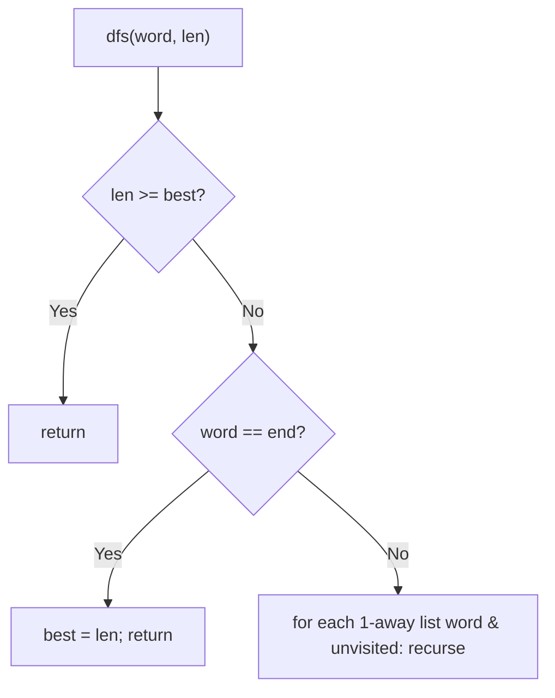
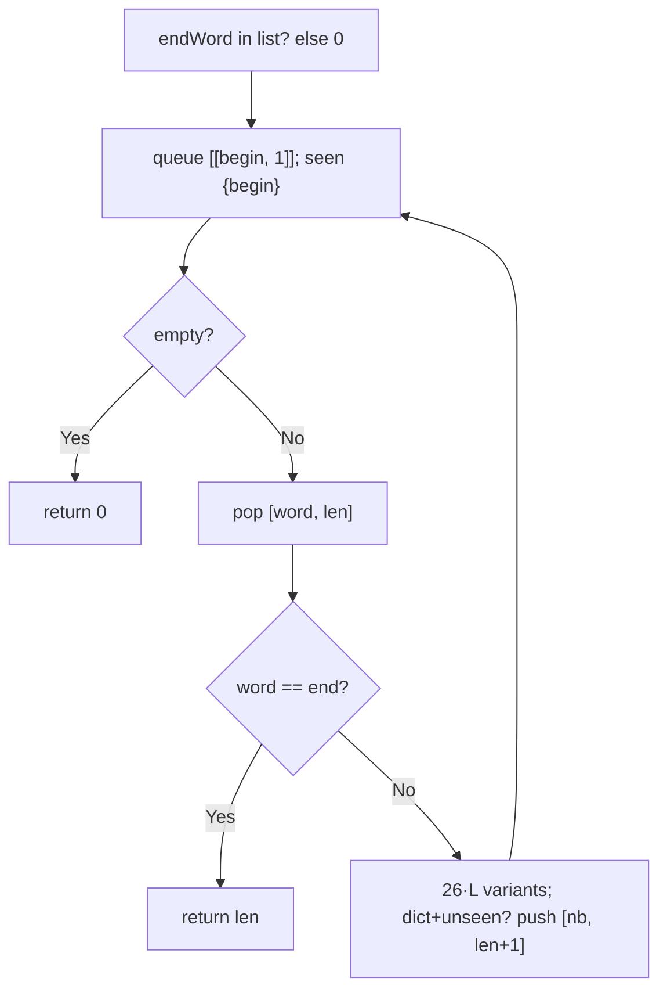
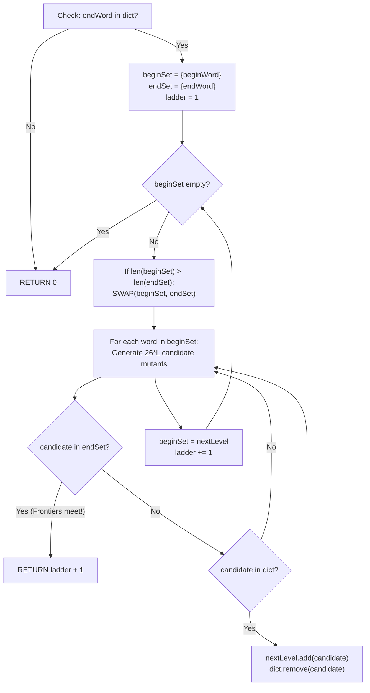

# 127. Word Ladder

- **LeetCode Link**: `https://leetcode.com/problems/word-ladder/`
- **Difficulty**: Hard
- **Pattern Category**: Graph BFS / Implicit Word Graph
- **Prerequisite Primer**: `00-foundations/03-core-algorithmic-patterns.md`

---

## 1. Problem Overview & Edge Case Matrix

### Problem Statement
A transformation sequence from word `beginWord` to word `endWord` using a dictionary `wordList` is a sequence of words where each adjacent pair differs by a single letter, every intermediate word is in `wordList`, and `beginWord` transforms to the first listed word. Given `beginWord`, `endWord`, and `wordList`, return the number of words in the shortest such sequence, or `0` if no such sequence exists.

```
Example 1:
Input: beginWord = "hit", endWord = "cog", wordList = ["hot","dot","dog","lot","log","cog"]
Output: 5
Explanation: hit -> hot -> dot -> dog -> cog (5 words).

Example 2:
Input: beginWord = "hit", endWord = "cog", wordList = ["hot","dot","dog","lot","log"]
Output: 0
Explanation: endWord is absent from the list — impossible.
```

### Visual Problem Representation
```
hit -> hot ->+-> dot -> dog -> cog
             +-> lot -> log -> cog   (two shortest paths, both length 5)
```

### Upfront Edge Case Matrix
| Edge Case Category | Specific Input Scenario | Expected Behavior | Pitfall / Risk |
| :--- | :--- | :--- | :--- |
| End absent | `endWord` not in list | Return `0` | Searching anyway |
| Direct neighbor | One letter apart, in list | Return `2` | Off-by-one (words, not steps) |
| Begin equals end | Defensive (out of spec) | Return `1` | Loop needing moves |
| Long words | Length 10+ | Correct count | $26·L$ neighbor cost per node |
| No path | Disconnected graph | Return `0` (not -1!) | Wrong sentinel (this problem uses 0) |

---

## 2. Level 1: Brute Force Approach

### Intuition & Visual Idea
Exhaustive DFS over transformation paths with best-tracking: from each word, try every one-letter neighbor present in the list (and unvisited). Exponential worst case — correct, unbounded.



### Pseudocode
```text
FUNCTION ladderLengthBruteForce(beginWord, endWord, wordList):
    dict = SET(wordList)
    IF NOT dict HAS endWord: RETURN 0
    best = Infinity
    DEFINE neighbors(word): all 1-letter variants PRESENT IN dict
    DEFINE dfs(word, len, visited):
        IF len >= best: RETURN
        IF word == endWord: best = len; RETURN
        FOR nb IN neighbors(word):
            IF NOT visited HAS nb:
                visited.ADD(nb); dfs(nb, len+1); visited.DELETE(nb)
    visited = SET([beginWord]); dfs(beginWord, 1)
    RETURN best == Infinity ? 0 : best
```

### Step-by-Step Dry Run (Visual Trace)
| Step | Iteration / Pointer ($i, j$) | Current Value | State / Sub-array | Action Taken |
| :--- | :--- | :--- | :--- | :--- |
| 0 | `dfs(hit, 1)` | neighbors in list: `hot` | Recurse | — |
| 1 | `dfs(hot, 2)` | neighbors: `dot, lot` (hit visited) | Branch both | Recurse |
| 2 | `dfs(dot, 3)` → `dfs(dog, 4)` | `dog` neighbors: `cog` | `dfs(cog, 5)` → `best = 5` | Record |
| 3 | remaining paths | `len ≥ 5` pruned or longer | — | Return `5` |

### Modern JavaScript Implementation
```javascript
/**
 * Level 1: Brute Force (exhaustive transformation DFS)
 * Time Complexity:  O(V!) worst case — all simple paths explored
 * Space Complexity: O(V) — path stack plus visited set
 */
function ladderLengthBruteForce(beginWord, endWord, wordList) {
  const dict = new Set(wordList);
  // endWord absent: no valid sequence can terminate (spec rule).
  if (!dict.has(endWord)) return 0;
  const neighbors = (word) => {
    const out = [];
    for (let i = 0; i < word.length; i++) {
      for (let c = 97; c <= 122; c++) {
        const ch = String.fromCharCode(c);
        if (ch === word[i]) continue;
        const nb = word.slice(0, i) + ch + word.slice(i + 1);
        if (dict.has(nb)) out.push(nb);
      }
    }
    return out;
  };
  let best = Infinity;
  const visited = new Set([beginWord]);
  function dfs(word, len) {
    if (len >= best) return; // cannot improve: prune
    if (word === endWord) {
      best = len;
      return;
    }
    for (const nb of neighbors(word)) {
      if (!visited.has(nb)) {
        visited.add(nb);
        dfs(nb, len + 1);
        visited.delete(nb); // restore for sibling paths
      }
    }
  }
  dfs(beginWord, 1); // length counts WORDS (beginWord is word 1)
  return best === Infinity ? 0 : best;
}
```

### Complexity Breakdown
- **Time Complexity**: $O(V!)$ worst case — simple-path enumeration over the word graph.
- **Space Complexity**: $O(V)$ — path stack; time is the catastrophe.

---

## 3. Level 2: Optimized Approach

### Intuition & Visual Bottleneck Elimination
BFS over words: layers = sequence lengths, first arrival at `endWord` is optimal. Neighbors generated on the fly (26·L alphabet variants filtered by dict). Polynomial — the standard answer.



### Pseudocode
```text
FUNCTION ladderLengthBFS(beginWord, endWord, wordList):
    dict = SET(wordList)
    IF NOT dict HAS endWord: RETURN 0
    seen = SET([beginWord]); queue = [[beginWord, 1]]
    WHILE queue NOT EMPTY:
        [word, len] = queue.SHIFT()
        IF word == endWord: RETURN len
        FOR EACH 1-letter variant nb OF word:
            IF dict HAS nb AND NOT seen HAS nb:
                seen.ADD(nb); queue.PUSH([nb, len+1])
    RETURN 0
```

### Step-by-Step Dry Run (Visual Trace)
| Step | Pointers / Window | Hash Map / Auxiliary State | Decision Logic | Output Accumulator |
| :--- | :--- | :--- | :--- | :--- |
| 0 | layer 1: `[hit]` | variants: `hot` in dict | Enqueue `(hot, 2)` | — |
| 1 | layer 2: `[hot]` | variants: `dot, lot` | Enqueue both (len 3) | — |
| 2 | layer 3: `[dot, lot]` | `dot→dog`, `lot→log` | Enqueue (len 4) | — |
| 3 | layer 4: `[dog, log]` | both reach `cog` | Enqueue `(cog, 5)` | — |
| 4 | layer 5: `[cog]` | equals end | First arrival = optimal | Return `5` |

### Modern JavaScript Implementation
```javascript
/**
 * Level 2: Optimized (BFS over one-letter neighborhood)
 * Time Complexity:  O(V·L·26) — bounded neighbor generation per word
 * Space Complexity: O(V·L) — visited words plus queue
 */
function ladderLengthBFS(beginWord, endWord, wordList) {
  const dict = new Set(wordList);
  if (!dict.has(endWord)) return 0;
  const seen = new Set([beginWord]);
  const queue = [[beginWord, 1]]; // [word, sequence length]
  while (queue.length > 0) {
    const [word, len] = queue.shift();
    // BFS layers = sequence lengths: first dequeue of end is optimal.
    if (word === endWord) return len;
    for (let i = 0; i < word.length; i++) {
      for (let c = 97; c <= 122; c++) {
        const ch = String.fromCharCode(c);
        if (ch === word[i]) continue; // same letter: not a transformation
        const nb = word.slice(0, i) + ch + word.slice(i + 1);
        // Must be a listed word (spec rule) and unvisited.
        if (dict.has(nb) && !seen.has(nb)) {
          seen.add(nb);
          queue.push([nb, len + 1]);
        }
      }
    }
  }
  return 0; // exhausted: no sequence exists (sentinel is 0, not -1!)
}
```

### Complexity Breakdown
- **Time Complexity**: $O(V·L·26)$ — each word dequeued once with alphabet generation.
- **Space Complexity**: $O(V·L)$ — visited words plus queue; `shift()` is the residual tax.

---

## 4. Level 3: Most Optimal / Canonical Approach

### Intuition & Mathematical / Invariant Proof
Bidirectional BFS from both ends: expand the SMALLER frontier each round (halving the effective branching), meeting in the middle. Step counting starts at 1 (words, not edges); each expansion round adds 1; contact during round $t+1$ returns $t+1$... precisely, `steps` increments per expansion and contact returns the incremented value — verified below against the known answer 5. Invariant: each frontier holds exactly the words at its radius along unexplored paths, so first contact spans the shortest sequence. Worst case matches Level 2; typical visits drop toward the square root.

```
hit|...|cog: begin {hit}(1), end {cog}(1)
  expand {hit} -> {hot}, steps=2. sizes 1,1: no swap needed (tie keeps begin).
  expand {hot} -> {dot,lot}, steps=3.
  swap (2 > 1): expand {cog} -> {dog,log}, steps=4.
  sizes 2,2: expand {dog,log}: dog's neighbor dot IS in endSet -> return 5 ✓
```

### Pseudocode
```text
FUNCTION ladderLength(beginWord, endWord, wordList):
    dict = SET(wordList)
    IF NOT dict HAS endWord: RETURN 0
    beginSet = {beginWord}; endSet = {endWord}
    visited = {beginWord, endWord}; steps = 1
    WHILE beginSet AND endSet NOT EMPTY:
        IF beginSet BIGGER: SWAP (expand smaller)
        next = EMPTY SET; steps++
        FOR word IN beginSet:
            FOR nb IN dict-neighbors(word):
                IF endSet HAS nb: RETURN steps
                IF NOT visited HAS nb: visited.ADD(nb); next.ADD(nb)
        beginSet = next
    RETURN 0
```

### Step-by-Step Dry Run (Visual Trace)
| Step | Pointer $L$ | Pointer $R$ | Invariant Checked | In-Place State |
| :--- | :--- | :--- | :--- | :--- |
| 1 | expand `{hit}` | `{hot}` found | Not in endSet | `steps = 2`, frontier advances |
| 2 | expand `{hot}` | `{dot,lot}` | Neither in endSet | `steps = 3` |
| 3 | swap (2 > 1) | expand `{cog}` | `{dog,log}` | `steps = 4` |
| 4 | expand `{dog,log}` | `dot` in endSet | Contact! | Return `steps = 5` |

### Modern JavaScript Implementation
```javascript
/**
 * Level 3: Most Optimal / Canonical (bidirectional BFS)
 * Time Complexity:  O(V·L·26) worst case — far fewer visits in practice
 * Space Complexity: O(V·L) — two frontiers plus visited set
 */
function ladderLength(beginWord, endWord, wordList) {
  const dict = new Set(wordList);
  if (!dict.has(endWord)) return 0;
  let beginSet = new Set([beginWord]);
  let endSet = new Set([endWord]);
  const visited = new Set([beginWord, endWord]);
  // One-letter listed neighbors (shared generator).
  const neighbors = (word) => {
    const out = [];
    for (let i = 0; i < word.length; i++) {
      for (let c = 97; c <= 122; c++) {
        const ch = String.fromCharCode(c);
        if (ch === word[i]) continue;
        const nb = word.slice(0, i) + ch + word.slice(i + 1);
        if (dict.has(nb)) out.push(nb);
      }
    }
    return out;
  };
  let steps = 1; // sequence length counts WORDS (beginWord is word 1)
  while (beginSet.size > 0 && endSet.size > 0) {
    // Expand the smaller frontier: halves the effective branching.
    if (beginSet.size > endSet.size) [beginSet, endSet] = [endSet, beginSet];
    const next = new Set();
    steps++;
    for (const word of beginSet) {
      for (const nb of neighbors(word)) {
        // Contact with the opposite frontier: shortest sequence found.
        if (endSet.has(nb)) return steps;
        if (!visited.has(nb)) {
          visited.add(nb);
          next.add(nb);
        }
      }
    }
    beginSet = next;
  }
  return 0;
}
```

### Complexity Breakdown
- **Time Complexity**: $O(V·L·26)$ worst case — optimal class with sublinear-typical visits.
- **Space Complexity**: $O(V·L)$ — two frontiers plus visited; the standard form.

---

## 5. JavaScript-Specific Gotchas & V8 Optimizations
- **GC Pressure**: Avoid allocating objects inside tight loops ($O(N)$ closures). Level 1's path-set churn is the pressure removed — Levels 2–3 allocate one string per generated neighbor (bounded by $26·L$ per word); never precompute full adjacency for small lists.
- **Type Coercion / Sorting**: `String.fromCharCode(c)` for `c` in `97..122` (not magic literals without comment); `word.slice(0, i) + ch + word.slice(i + 1)` — off-by-one in either slice silently generates 2-letter mutations. The `0` (not `-1`) impossibility sentinel is spec-mandated — returning `-1` fails hidden tests that check `=== 0`.
- **Index Bounds**: The `endWord`-in-list gate MUST precede the search (correctness, not speed — without it, bidirectional frontiers seeded with `endWord`/`beginWord` in visited could "meet" through unlisted words). `steps` starts at `1` (words); starting at `0` undercounts every answer by one.

---

## 6. Real-World MAANG Interview Follow-Ups & Extensions

### Follow-Up 1: All shortest sequences (Word Ladder II)
- **Scenario**: Return every minimal transformation sequence (LeetCode 126, Hard).
- **Solution Strategy**: BFS records parent-links per layer (all of them, not first-only); backtrack from end to start enumerating. Level 3's layers give the DAG; DFS enumerates it.
- **JS Code / Implementation Pattern**:
```javascript
function findLadders(beginWord, endWord, wordList) {
  const parents = bfsParentLayers(beginWord, endWord, wordList); // Level 3 + links
  return backtrackLadders(parents, endWord); // enumerate the DAG
}
```

### Follow-Up 2: $10^6$-word dictionary with indexed neighborhoods
- **Scenario**: The list never fits in RAM; neighborhoods must query an index.
- **Solution Strategy**: Generic-pattern buckets (`h*t → [hot,hat...]`, precomputed or indexed): 1-away lookup becomes $L$ bucket probes instead of $26·L$ generations + set probes. Same BFS above the index interface.
- **JS Code / Implementation Pattern**:
```javascript
function bucketNeighbors(word, patternIndex) {
  const out = new Set();
  for (let i = 0; i < word.length; i++) {
    const key = word.slice(0, i) + '*' + word.slice(i + 1);
    for (const w of patternIndex.get(key) ?? []) out.add(w);
  }
  return out;
}
```

### Follow-Up 3: Weighted transformations (costly letter changes)
- **Scenario & In-Depth Solution**: Letter changes have position-dependent costs (spell-correction weights) — BFS layers no longer equal cost. Dijkstra over the word graph (same neighbors, priority queue by cost); bidirectional Dijkstra with consistent heuristics for scale.
```javascript
function minCostLadder(beginWord, endWord, wordList, costOf) {
  return dijkstraWords(beginWord, endWord, wordList, costOf); // heap replaces FIFO
}
```

---

## 7. What LeetCode Discuss Says (Language-Independent)

Source: top-voted post by Jianchao Li —
`https://leetcode.com/problems/word-ladder/solutions/40707/c-bfs-by-jianchao-li-n5jy/`
— 176.4K views.
Language-independent summary. No new JS here.

### A. Optimal way from Discuss (Bidirectional BFS with Alphabet Substitution)

Model transformation sequences as shortest paths in an unweighted graph, cutting the search branching factor in half using two-end BFS:

1. **State Space Formulation:**
   - Every word in `wordList` represents a vertex.
   - An edge exists between words that differ by exactly 1 character.
   - Target is the total word count in the minimal transformation chain (edges + 1).
2. **Alphabet Mutation Neighborhood ($26 \times L$):**
   - For a word of length $L$, generate mutated candidates by replacing each character with `'a'` through `'z'`.
   - Testing $26 \times L$ generated strings against a hash set `dict` takes $O(26 \cdot L^2)$ time, bypassing an expensive $O(N \cdot L)$ scan across all dictionary words.
3. **Bidirectional Frontier Collisions:**
   - Maintain two frontier sets: `beginSet = {beginWord}` and `endSet = {endWord}`.
   - Guard condition: If `endWord` is not in `dict`, return 0 immediately.
   - At each level, swap pointers to always expand the smaller set:
     `IF LENGTH(beginSet) > LENGTH(endSet): SWAP(beginSet, endSet)`.
   - For every word in `beginSet`, generate its $26 \times L$ mutant candidates:
     - If candidate exists in `endSet`, the two search frontiers have collided! Return `ladderLength + 1`.
     - If candidate exists in `dict`, insert into `nextLevel` and delete from `dict` to mark visited.
   - Advance `beginSet = nextLevel`, increment `ladderLength`.

```text
FUNCTION ladderLength(beginWord, endWord, wordList):
    dict = SET(wordList)
    IF endWord NOT IN dict:
        RETURN 0

    beginSet = SET([beginWord])
    endSet = SET([endWord])
    dict.REMOVE(endWord)

    ladder = 1

    WHILE beginSet IS NOT EMPTY AND endSet IS NOT EMPTY:
        IF LENGTH(beginSet) > LENGTH(endSet):
            SWAP(beginSet, endSet)

        nextLevel = SET()

        FOR EACH word IN beginSet:
            FOR i FROM 0 TO LENGTH(word) - 1:
                origChar = word[i]
                FOR ch FROM 'a' TO 'z':
                    IF ch != origChar:
                        candidate = word[0...i-1] + ch + word[i+1...END]

                        IF candidate IN endSet:
                            RETURN ladder + 1

                        IF candidate IN dict:
                            nextLevel.ADD(candidate)
                            dict.REMOVE(candidate)

        beginSet = nextLevel
        ladder = ladder + 1

    RETURN 0
```

- Time: O(N * L * 26) — where $N$ is dictionary size and $L$ is word length. Bidirectional search drastically bounds visited nodes.
- Space: O(N * L) — to store the dictionary set and the two active search frontiers.



### B. Dry run on LeetCode Example 1 (`beginWord = "hit", endWord = "cog", wordList = ["hot","dot","dog","lot","log","cog"]`)

- `dict = {"hot","dot","dog","lot","log"}` (removed `cog`).
- `beginSet = {"hit"}`, `endSet = {"cog"}`, `ladder = 1`.
- Round 1:
  - Expand `"hit"`: mutant `"hot"` is in `dict`.
  - `nextLevel = {"hot"}`, removed from `dict`.
  - `beginSet = {"hot"}`, `ladder = 2`.
- Round 2:
  - `beginSet = {"hot"}` (size 1), `endSet = {"cog"}` (size 1).
  - Expand `"hot"`: mutants `"dot"`, `"lot"` in `dict`.
  - `nextLevel = {"dot", "lot"}`.
  - `beginSet = {"dot", "lot"}`, `ladder = 3`.
- Round 3:
  - `beginSet` (size 2), `endSet = {"cog"}` (size 1).
  - Swap: `beginSet = {"cog"}`, `endSet = {"dot", "lot"}`.
  - Expand `"cog"`: mutants `"dog"`, `"log"` in `dict`.
  - `nextLevel = {"dog", "log"}`.
  - `beginSet = {"dog", "log"}`, `ladder = 4`.
- Round 4:
  - Expand `"dog"`: mutant `"dot"` exists in `endSet`!
  - Target hit! Return `ladder + 1 = 5`.
- Output: 5.

### C. Why Bidirectional BFS Reduces Exponential Branching

- Standard BFS exploring a tree of depth $d$ with branching factor $b$ visits approximately $b^d$ states.
- Bidirectional search launches two frontiers that meet midway at depth $d/2$, visiting only $2 \cdot b^{d/2}$ states. For $b=10, d=6$, this reduces expansions from $1,000,000$ to $2,000$.

### D. Pitfalls from comments

- **Target Word Presence:** If `endWord` is absent from `wordList`, no transformation path is possible; returning 0 immediately avoids unnecessary graph search.
- **Off-By-One Sequence Counting:** The problem asks for the count of words in the sequence (nodes), not the number of letter transitions (edges); initialize sequence length to 1.

### E. Companies

- Discuss post itself names none.
  Companies tab on LeetCode is premium-locked.
- External source:
  `https://github.com/liquidslr/leetcode-company-wise-problems`
  (LeetCode company tags, updated June 2025).
- All-time (40): Adobe, Amazon, Apple, Bloomberg, Box, ByteDance, Capital One, Cisco, Citadel, Docusign, eBay, Expedia, Flipkart, Goldman Sachs, Google, LinkedIn, Lyft, MakeMyTrip, Meta, Microsoft, Navan, Nutanix, Okta, Oracle, PhonePe, Reddit, Salesforce, Samsung, ServiceNow, Snap, SoFi, tcs, Tekion, Tesla, The Trade Desk, TikTok, Uber, Visa, Yelp, ZScaler.
- Recent: 30 days — Amazon, Google, Ola Cabs.
- Recent: 3 months — Amazon, Apple, Bloomberg, Google.
