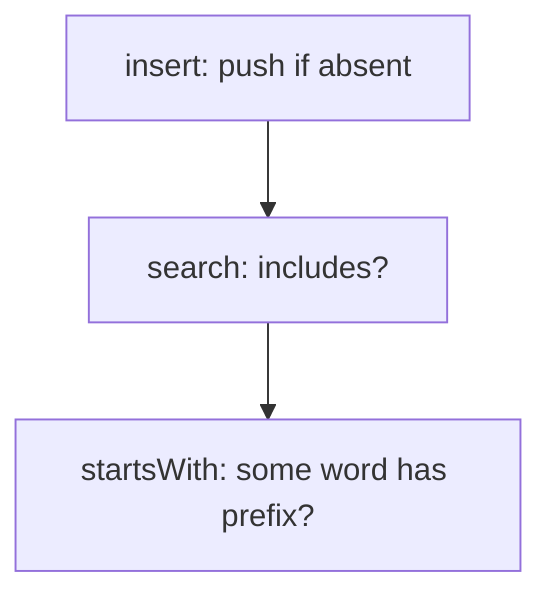

# 208. Implement Trie (Prefix Tree)

- **LeetCode Link**: `https://leetcode.com/problems/implement-trie-prefix-tree/`
- **Difficulty**: Medium
- **Pattern Category**: Trie / Prefix Tree
- **Prerequisite Primer**: `00-foundations/02-data-structure-polyfills.md`

---

## 1. Problem Overview & Edge Case Matrix

### Problem Statement
A trie (prefix tree) stores strings with efficient prefix queries. Implement the `Trie` class:

- `Trie()` initializes the object.
- `void insert(String word)` inserts `word`.
- `boolean search(String word)` returns `true` if `word` is present (whole word, not just prefix).
- `boolean startsWith(String prefix)` returns `true` if any inserted word has the given prefix.

```
Example 1:
Input: ["Trie","insert","search","search","startsWith","insert","search"]
       [[],["apple"],["apple"],["app"],["app"],["app"],["app"]]
Output: [null,null,true,false,true,null,true]
```

### Visual Problem Representation
```
insert apple, app:    root
                      └─ a ─ p ─ p ─•(app ends here)
                                     └─ l ─ e ─•(apple ends here)
  search("app") -> true (isEnd!); search("appl") -> false (no flag)
```

### Upfront Edge Case Matrix
| Edge Case Category | Specific Input Scenario | Expected Behavior | Pitfall / Risk |
| :--- | :--- | :--- | :--- |
| Empty string | `insert("")`, `search("")` | Root `isEnd` toggles | Root-as-word handling |
| Prefix vs word | Insert `apple`, search `app` | `false` (prefix ≠ word) | Missing `isEnd` check |
| Word vs prefix | Insert `app`, `startsWith("app")` | `true` | Conflating the two queries |
| Duplicate inserts | `insert` same word twice | Idempotent `true` | Count-based corruption |
| Shared prefixes | `app`, `apple`, `apply` | Independent `isEnd` flags | Overwriting sibling branches |

---

## 2. Level 1: Brute Force Approach

### Intuition & Visual Idea
Store words in an array; `search` is `includes`, `startsWith` is `some(w => w.startsWith(prefix))`. Zero structure — $O(N·L)$ per query.



### Pseudocode
```text
FUNCTION TrieBruteForce:
    words = []

FUNCTION insert(word): IF NOT words.INCLUDES(word): words.PUSH(word)
FUNCTION search(word): RETURN words.INCLUDES(word)
FUNCTION startsWith(prefix): RETURN words.SOME(w => w.STARTS-WITH(prefix))
```

### Step-by-Step Dry Run (Visual Trace)
| Step | Iteration / Pointer ($i, j$) | Current Value | State / Sub-array | Action Taken |
| :--- | :--- | :--- | :--- | :--- |
| 0 | `insert("apple")` | absent | `words = ["apple"]` | Push |
| 1 | `search("apple")` | present | — | Return `true` |
| 2 | `search("app")` | absent as WHOLE word | — | Return `false` |
| 3 | `startsWith("app")` | `"apple"` qualifies | — | Return `true` |

### Modern JavaScript Implementation
```javascript
/**
 * Level 1: Brute Force (word list + linear scans)
 * Time Complexity:  O(N·L) per search/startsWith — N words scanned
 * Space Complexity: O(N·L) — raw word storage
 */
class TrieBruteForce {
  constructor() {
    this.words = [];
  }

  insert(word) {
    if (!this.words.includes(word)) this.words.push(word);
  }

  search(word) {
    // Whole-word equality only: prefixes do NOT match here.
    return this.words.includes(word);
  }

  startsWith(prefix) {
    // Linear scan: every word tested per query (the bottleneck).
    return this.words.some((w) => w.startsWith(prefix));
  }
}
```

### Complexity Breakdown
- **Time Complexity**: $O(N·L)$ per query — full word list scanned.
- **Space Complexity**: $O(N·L)$ — raw strings; structure is what's missing.

---

## 3. Level 2: Optimized Approach

### Intuition & Visual Bottleneck Elimination
Plain-object trie: nested `{}` per character with an `isEnd` flag. Shared prefixes stored once; queries walk $L$ steps — $O(L)$ time. Works, with one JS-specific hazard (see gotchas: prototype keys).

```mermaid
flowchart TD
    Ins["insert: walk/create node[ch] per char; set isEnd"] --> S["search: walk; return node?.isEnd === true"]
    S --> P["startsWith: walk succeeds?"]
```



### Pseudocode
```text
FUNCTION TrieObject:
    root = {}

FUNCTION insert(word):
    node = root
    FOR ch IN word:
        IF NOT node[ch]: node[ch] = {}
        node = node[ch]
    node.isEnd = true

FUNCTION walk(prefix):
    node = root
    FOR ch IN prefix:
        IF NOT node[ch]: RETURN NULL
        node = node[ch]
    RETURN node

FUNCTION search(word): node = walk(word); RETURN node NOT NULL AND node.isEnd === true
FUNCTION startsWith(prefix): RETURN walk(prefix) NOT NULL
```

### Step-by-Step Dry Run (Visual Trace)
| Step | Pointers / Window | Hash Map / Auxiliary State | Decision Logic | Output Accumulator |
| :--- | :--- | :--- | :--- | :--- |
| 0 | `insert("apple")` | chain `a→p→p→l→e` created | `isEnd` on `e`-node | — |
| 1 | `search("apple")` | walk succeeds, `isEnd` true | — | Return `true` |
| 2 | `search("app")` | walk succeeds, `isEnd` unset | Prefix ≠ word | Return `false` |
| 3 | `insert("app")` | flags existing `p`-node | Shared prefix reused | `search("app")` now `true` |

### Modern JavaScript Implementation
```javascript
/**
 * Level 2: Optimized (plain-object trie)
 * Time Complexity:  O(L) per op — one step per character
 * Space Complexity: O(ALPHABET·N·L) worst case — shared prefixes in practice
 */
class TrieObject {
  constructor() {
    this.root = {};
  }

  insert(word) {
    let node = this.root;
    for (const ch of word) {
      if (!node[ch]) node[ch] = {}; // create on demand; shared on revisit
      node = node[ch];
    }
    node.isEnd = true; // marks WHOLE words (prefix nodes lack it)
  }

  _walk(prefix) {
    let node = this.root;
    for (const ch of prefix) {
      if (!node[ch]) return null; // dead branch: no such prefix
      node = node[ch];
    }
    return node;
  }

  search(word) {
    const node = this._walk(word);
    // isEnd distinguishes "app" (word) from "appl" (mere prefix).
    return node !== null && node.isEnd === true;
  }

  startsWith(prefix) {
    return this._walk(prefix) !== null;
  }
}
```

### Complexity Breakdown
- **Time Complexity**: $O(L)$ per op — optimal query shape.
- **Space Complexity**: Shared prefixes in practice; prototype-key hazard remains (see gotchas).

---

## 4. Level 3: Most Optimal / Canonical Approach

### Intuition & Mathematical / Invariant Proof
`Map`-based `TrieNode` (`children` + `isEnd`): identical asymptotics to Level 2 with exact key semantics — no prototype chain, no key collisions, preserved insertion behavior. Invariant: the path from root spelling `w` exists iff some inserted word has prefix `w`; `isEnd` marks exact-word endpoints. This is the production form: same $O(L)$ ops, zero JS footguns.

```
insert("app") after "apple": walks existing a→p→p, flags the second p-node.
  nodes shared: a, p, p (3 shared + flag, vs 3 fresh in Level 1's array).
```

### Pseudocode
```text
FUNCTION Trie:
    root = TrieNode()   // { children: MAP, isEnd: false }

FUNCTION insert(word):
    node = root
    FOR ch IN word:
        IF NOT children HAS ch: children.SET(ch, FRESH NODE)
        node = children.GET(ch)
    node.isEnd = true

FUNCTION walk(prefix): (same shape over Map; NULL on miss)
FUNCTION search(word): node = walk(word); RETURN node AND node.isEnd
FUNCTION startsWith(prefix): RETURN walk(prefix) NOT NULL
```

### Step-by-Step Dry Run (Visual Trace)
| Step | Pointer $L$ | Pointer $R$ | Invariant Checked | In-Place State |
| :--- | :--- | :--- | :--- | :--- |
| 1 | `insert("apple")` | 5 fresh nodes | `isEnd` on `e` | Chain built |
| 2 | `search("apple")` | walk + flag | — | `true` |
| 3 | `search("app")` | walk ok, flag missing | Prefix ≠ word | `false` |
| 4 | `startsWith("app")` | walk ok | Prefix query ignores flag | `true` |

### Modern JavaScript Implementation
```javascript
/**
 * Level 3: Most Optimal / Canonical (Map-based trie)
 * Time Complexity:  O(L) per op — optimal (must read the word)
 * Space Complexity: O(ALPHABET·N·L) worst case — shared prefixes in practice
 */
class TrieNode {
  constructor() {
    this.children = new Map(); // exact keys: no prototype hazards
    this.isEnd = false; // true iff a word ends exactly here
  }
}

class Trie {
  constructor() {
    this.root = new TrieNode();
  }

  insert(word) {
    let node = this.root;
    for (const ch of word) {
      if (!node.children.has(ch)) node.children.set(ch, new TrieNode());
      node = node.children.get(ch);
    }
    node.isEnd = true;
  }

  _walk(prefix) {
    let node = this.root;
    for (const ch of prefix) {
      if (!node.children.has(ch)) return null;
      node = node.children.get(ch);
    }
    return node;
  }

  search(word) {
    const node = this._walk(word);
    return node !== null && node.isEnd;
  }

  startsWith(prefix) {
    return this._walk(prefix) !== null;
  }
}
```

### Complexity Breakdown
- **Time Complexity**: $O(L)$ per op — optimal lower bound; every character read once.
- **Space Complexity**: Shared-prefix storage; `Map` overhead per node is the honest cost.

---

## 5. JavaScript-Specific Gotchas & V8 Optimizations
- **GC Pressure**: Avoid allocating objects inside tight loops ($O(N)$ closures). One `Map`+node per trie BRANCH (not per query) — Level 1's per-query full scans are the pressure removed; never rebuild node objects on read paths.
- **Type Coercion / Sorting**: Plain `{}` children inherit `Object.prototype` — `node["constructor"]` is TRUTHY on any fresh node, so Level 2 false-positives single-char... precisely, `if (!node[ch])` with `ch = "constructor"` skips creation AND walks into the prototype function (then `node[ch][next]` throws). `Map` (Level 3) or `Object.create(null)` eliminates the class of bug.
- **Index Bounds**: No indices — but the `isEnd` flag vs walk-success distinction IS the boundary logic: `search` requires BOTH, `startsWith` requires only the walk. Collapsing them (flag-only or walk-only) breaks exactly one of the two example queries.

---

## 6. Real-World MAANG Interview Follow-Ups & Extensions

### Follow-Up 1: Delete words + prefix counting
- **Scenario**: Support `erase(word)` and `countWordsWithPrefix(prefix)`.
- **Solution Strategy**: Reference counts per node (`pass` = words through here): insert increments, erase decrements (pruning zero-count subtrees); prefix count reads `pass` at the walk endpoint. $O(L)$ all ops.
- **JS Code / Implementation Pattern**:
```javascript
function eraseWord(trie, word) {
  return decrementPassCounts(trie, word); // prune zero-count branches
}
```

### Follow-Up 2: $10^9$ words with compressed storage (radix/DAWG)
- **Scenario**: Dictionary too big for per-char nodes.
- **Solution Strategy**: Radix compression (single-child chains merged into edge labels) or DAWG minimization (suffix sharing) — same queries, 10–100× fewer nodes. Level 3's interface unchanged above the node layer.
- **JS Code / Implementation Pattern**:
```javascript
function compressTrie(trie) {
  return mergeSingleChildChains(trie); // radix form, same search API
}
```

### Follow-Up 3: Concurrent reads with copy-on-write inserts
- **Scenario & In-Depth Solution**: Readers query while writers insert — mutation tears traversals. Path-copying inserts (fresh nodes along the word path, shared elsewhere — persistent trie): readers pin the old root, writer publishes the new root atomically. $O(L)$ fresh nodes per insert, lock-free reads.
```javascript
function cowInsert(root, word) {
  return pathCopyInsert(root, word); // new root; old readers unaffected
}
```
