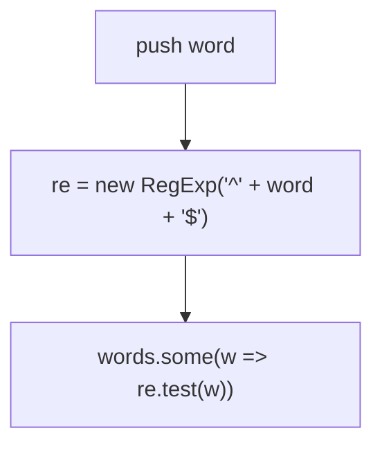
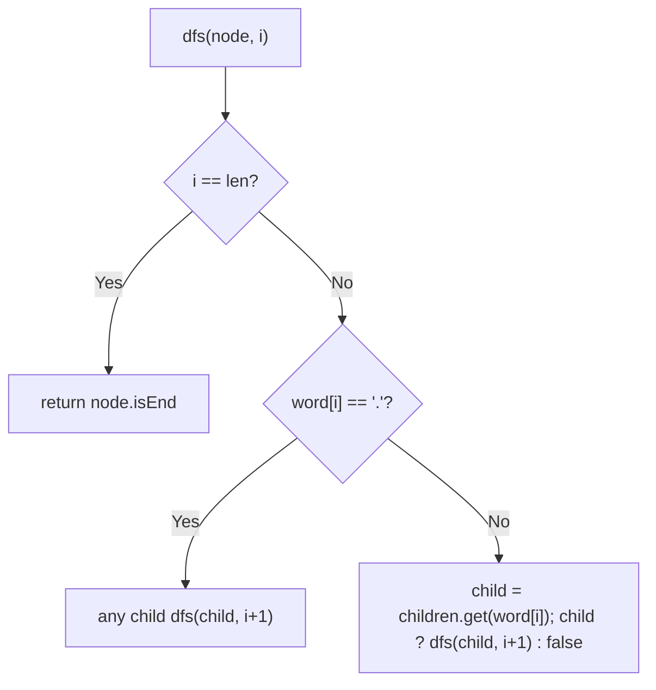

# 211. Design Add and Search Words Data Structure

- **LeetCode Link**: `https://leetcode.com/problems/design-add-and-search-words-data-structure/`
- **Difficulty**: Medium
- **Pattern Category**: Trie / Wildcard Search
- **Prerequisite Primer**: `00-foundations/02-data-structure-polyfills.md`

---

## 1. Problem Overview & Edge Case Matrix

### Problem Statement
Design a data structure supporting adding words and searching with `.` wildcards (any single letter). Implement `WordDictionary` with `addWord(word)` and `search(word)` where `word` may contain dots.

```
Example 1:
Input: ["WordDictionary","addWord","addWord","addWord","search","search","search","search"]
       [[],["bad"],["dad"],["mad"],["pad"],["bad"],[".ad"],["b.."]]
Output: [null,null,null,null,false,true,true,true]
```

### Visual Problem Representation
```
trie:  b--a--d•   searching ".ad": root fans out to b, d, m at level 0,
       d--a--d•   then walks a->d deterministically. ".ad" matches all three.
       m--a--d•
```

### Upfront Edge Case Matrix
| Edge Case Category | Specific Input Scenario | Expected Behavior | Pitfall / Risk |
| :--- | :--- | :--- | :--- |
| All dots | `"..."` (length 3) | `true` iff any 3-letter word exists | Length tracking through wildcards |
| No match | `"pad"` | Return `false` | Partial-path true |
| Dot at end | `"ba."` | Matches `bad` | Terminal check after wildcard |
| Empty word | `""` add/search | Root `isEnd` toggles | Depth-0 base case |
| Mixed dots | `"b.d"` | Correct filtering | Fan-out + deterministic mix |

---

## 2. Level 1: Brute Force Approach

### Intuition & Visual Idea
Store words in an array; per search, compile the pattern to a `RegExp` (`^...$` with dots native) and test every word. Zero structure — $O(N·L)$ per search plus regex compile.



### Pseudocode
```text
FUNCTION WordDictionaryBruteForce:
    words = []

FUNCTION addWord(word): words.PUSH(word)
FUNCTION search(word):
    re = REGEXP("^" + word + "$")   // dots are native wildcards
    RETURN words.SOME(w => re.TEST(w))
```

### Step-by-Step Dry Run (Visual Trace)
| Step | Iteration / Pointer ($i, j$) | Current Value | State / Sub-array | Action Taken |
| :--- | :--- | :--- | :--- | :--- |
| 0 | adds | `["bad","dad","mad"]` | Stored | — |
| 1 | `search("pad")` | `/^pad$/` vs all | No match | Return `false` |
| 2 | `search(".ad")` | `/^.ad$/` vs `"bad"` | Match | Return `true` |
| 3 | `search("b..")` | `/^b..$/` vs `"bad"` | Match | Return `true` |

### Modern JavaScript Implementation
```javascript
/**
 * Shared backbone: Map-based trie node used by Levels 2-3 (Level 1 needs no
 * structure, but concatenation requires one definition site — here).
 */
class WDNode {
  constructor() {
    this.children = new Map();
    this.isEnd = false;
  }
}

/**
 * Level 1: Brute Force (regex over word list)
 * Time Complexity:  O(N·L) per search — every word tested
 * Space Complexity: O(N·L) — raw word storage
 */
class WordDictionaryBruteForce {
  constructor() {
    this.words = [];
  }

  addWord(word) {
    this.words.push(word);
  }

  search(word) {
    // Dots are regex-native wildcards; anchors force full-word match.
    const re = new RegExp('^' + word + '$');
    return this.words.some((w) => re.test(w));
  }
}
```

### Complexity Breakdown
- **Time Complexity**: $O(N·L)$ per search — full list scan plus regex compile.
- **Space Complexity**: $O(N·L)$ — raw strings; structure is what's missing.

---

## 3. Level 2: Optimized Approach

### Intuition & Visual Bottleneck Elimination
Trie + recursive wildcard DFS: concrete letters walk deterministically; dots fan out over all children. Shared prefixes collapse the search space — worst case still exponential in dot count, but typical queries prune hard.



### Pseudocode
```text
FUNCTION WordDictionaryRecursive:
    root = WDNode()

FUNCTION addWord(word): STANDARD TRIE INSERT

FUNCTION search(word):
    DEFINE dfs(node, i):
        IF i == word.LENGTH: RETURN node.isEnd
        IF word[i] == ".":
            RETURN ANY dfs(child, i+1) FOR child IN node.children.VALUES()
        child = node.children.GET(word[i])
        RETURN child ? dfs(child, i+1) : false
    RETURN dfs(root, 0)
```

### Step-by-Step Dry Run (Visual Trace)
| Step | Pointers / Window | Hash Map / Auxiliary State | Decision Logic | Output Accumulator |
| :--- | :--- | :--- | :--- | :--- |
| 0 | `search(".ad")` at root | dot: fan to `b, d, m` | Recurse each at `i=1` | — |
| 1 | `(b-node, 1)` | `a` deterministic | Walk `a → d` | `isEnd` → `true` |
| 2 | short-circuit `\|\|` | first success wins | Siblings unexplored | Return `true` |
| 3 | `search("pad")` | `p` missing at root | Immediate `false` | No fan-out |

### Modern JavaScript Implementation
```javascript
/**
 * Level 2: Optimized (recursive wildcard DFS over trie)
 * Time Complexity:  O(ALPHABET^D · L) worst case — D = dot count
 * Space Complexity: O(N·L) trie plus O(L) stack
 */
// WDNode shared from Level 1.
class WordDictionaryRecursive {
  constructor() {
    this.root = new WDNode();
  }

  addWord(word) {
    let node = this.root;
    for (const ch of word) {
      if (!node.children.has(ch)) node.children.set(ch, new WDNode());
      node = node.children.get(ch);
    }
    node.isEnd = true;
  }

  search(word) {
    const dfs = (node, i) => {
      if (i === word.length) return node.isEnd; // consumed all: word iff flagged
      if (word[i] === '.') {
        // Wildcard: any child path that completes wins (short-circuit ||).
        for (const child of node.children.values()) {
          if (dfs(child, i + 1)) return true;
        }
        return false;
      }
      const child = node.children.get(word[i]);
      if (!child) return false; // dead branch: no such continuation
      return dfs(child, i + 1);
    };
    return dfs(this.root, 0);
  }
}
```

### Complexity Breakdown
- **Time Complexity**: $O(A^D·L)$ worst case ($A$ = alphabet, $D$ = dots) — dots fan out exponentially.
- **Space Complexity**: $O(N·L)$ trie plus $O(L)$ stack.

---

## 4. Level 3: Most Optimal / Canonical Approach

### Intuition & Mathematical / Invariant Proof
Same wildcard semantics, iterative with an explicit stack of `(node, index)` pairs — identical visit order to Level 2, zero recursion. Invariant: the stack holds exactly the frontier of partial matches; a `(node, len)` pop with `isEnd` proves a full match. No asymptotic change (dots are inherently exponential worst-case), but stack-safe at any depth and allocation-light. This is the production form.

```
".ad": stack [(root,0)] -> pop: dot fans [(b,1),(d,1),(m,1)] ->
  pop (b,1): 'a' -> (ba,2) -> 'd' -> (bad,3): len reached, isEnd -> true
```

### Pseudocode
```text
FUNCTION WordDictionary:
    root = WDNode()

FUNCTION addWord(word): STANDARD TRIE INSERT

FUNCTION search(word):
    stack = [[root, 0]]
    WHILE stack NOT EMPTY:
        [node, i] = stack.POP()
        IF i == word.LENGTH:
            IF node.isEnd: RETURN true
            CONTINUE
        IF word[i] == ".":
            PUSH [child, i+1] FOR ALL children
        ELSE IF children HAS word[i]:
            PUSH [child, i+1]
    RETURN false
```

### Step-by-Step Dry Run (Visual Trace)
| Step | Pointer $L$ | Pointer $R$ | Invariant Checked | In-Place State |
| :--- | :--- | :--- | :--- | :--- |
| 1 | pop `(root, 0)` | dot | Fan to 3 children | Stack has 3 pairs |
| 2 | pop `(b, 1)` | `a` deterministic | Push `(ba, 2)` | Continue |
| 3 | pop `(ba, 2)` | `d` deterministic | Push `(bad, 3)` | Continue |
| 4 | pop `(bad, 3)` | `i == len`, `isEnd` | Match proven | Return `true` |

### Modern JavaScript Implementation
```javascript
/**
 * Level 3: Most Optimal / Canonical (iterative wildcard frontier)
 * Time Complexity:  O(A^D·L) worst case — dots are inherently exponential
 * Space Complexity: O(A^D) — explicit frontier; no call stack
 */
// WDNode shared from Level 1.
class WordDictionary {
  constructor() {
    this.root = new WDNode();
  }

  addWord(word) {
    let node = this.root;
    for (const ch of word) {
      if (!node.children.has(ch)) node.children.set(ch, new WDNode());
      node = node.children.get(ch);
    }
    node.isEnd = true;
  }

  search(word) {
    const stack = [[this.root, 0]]; // [node, pattern index] frontier
    while (stack.length > 0) {
      const [node, i] = stack.pop();
      // Pattern consumed: match iff a word ends exactly here.
      if (i === word.length) {
        if (node.isEnd) return true;
        continue;
      }
      if (word[i] === '.') {
        // Wildcard: every child continues the frontier.
        for (const child of node.children.values()) stack.push([child, i + 1]);
      } else if (node.children.has(word[i])) {
        stack.push([node.children.get(word[i]), i + 1]);
      }
      // Missing concrete child: dead path, silently dropped.
    }
    return false;
  }
}
```

### Complexity Breakdown
- **Time Complexity**: $O(A^D·L)$ worst case — optimal shape; dots fundamentally fan out.
- **Space Complexity**: $O(A^D)$ — explicit frontier; stack-safe at any depth.

---

## 5. JavaScript-Specific Gotchas & V8 Optimizations
- **GC Pressure**: Avoid allocating objects inside tight loops ($O(N)$ closures). Level 1's per-search regex compile (`new RegExp` per call — compile the pattern ONCE outside hot loops in real code) is the pressure removed; Level 3's `[node, i]` pairs are frontier-bounded.
- **Type Coercion / Sorting**: `new RegExp('^' + word + '$')` treats pattern chars as REGEX — a literal `.` in DATA would need escaping, but here dots ARE the wildcard by spec (the one case where regex injection is the feature). Destructuring `const [node, i] = stack.pop()` reads cleanly and never aliases.
- **Index Bounds**: `i === word.length` checked BEFORE `word[i]` access — reading past the end yields `undefined`, and `children.get(undefined)` misses (fail-closed, but the explicit base case documents intent). Empty-word add/search toggles root `isEnd` — handle, don't special-case away.

---

## 6. Real-World MAANG Interview Follow-Ups & Extensions

### Follow-Up 1: Multi-wildcard (`*` = any sequence) and full regex
- **Scenario**: `*` matches any run (glob), or full regex queries over the dictionary.
- **Solution Strategy**: `*` needs backtracking over split points (NFA simulation over the trie — Thompson-style epsilon handling); full regex compiles to a DFA walked alongside. Same trie, automaton-powered search.
- **JS Code / Implementation Pattern**:
```javascript
function searchGlob(root, pattern) {
  return nfaWalk(root, compileGlob(pattern)); // Thompson NFA over trie
}
```

### Follow-Up 2: Autocomplete (all words with prefix, ranked)
- **Scenario**: Return top-$K$ completions for a prefix (search-box UX).
- **Solution Strategy**: Walk to the prefix node (Level 1's `_walk` shape), then DFS-collect with a min-heap of size $K$ by frequency weight. Prefix walk + bounded collection.
- **JS Code / Implementation Pattern**:
```javascript
function autocomplete(trie, prefix, k) {
  return topKFromSubtree(trie.walk(prefix), k); // heap-bounded DFS collect
}
```

### Follow-Up 3: $10^9$-word dictionary with disk-backed trie
- **Scenario & In-Depth Solution**: The trie never fits in RAM; nodes page from disk. Level 3's explicit stack becomes a page-ID stack — fault nodes on pop, evict fully-explored subtrees. Hot prefixes pinned in an LRU page cache; wildcard fan-out is the worst case (many cold pages).
```javascript
async function searchPaged(rootId, pattern, loadNode) {
  return frontierSearch(rootId, pattern, loadNode); // Level 3 over page faults
}
```
