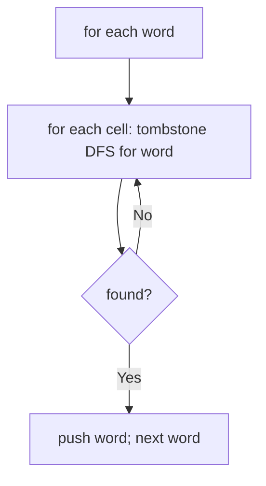
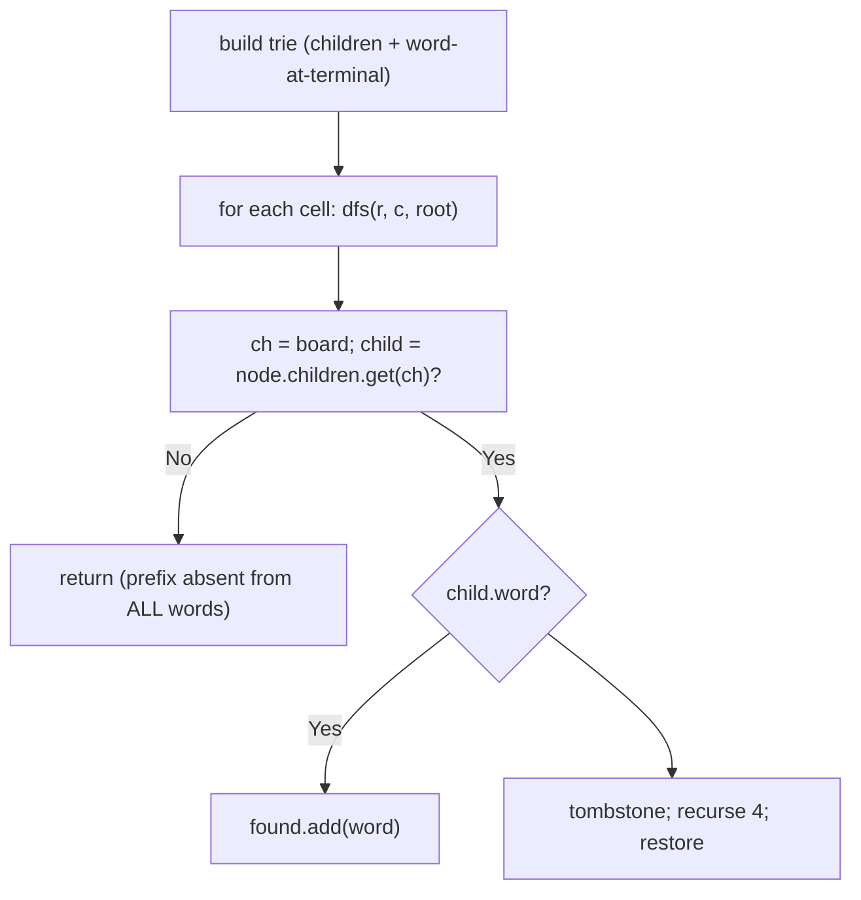

# 212. Word Search II

- **LeetCode Link**: `https://leetcode.com/problems/word-search-ii/`
- **Difficulty**: Hard
- **Pattern Category**: Trie / Board-Pruned Multi-Search
- **Prerequisite Primer**: `00-foundations/02-data-structure-polyfills.md`

---

## 1. Problem Overview & Edge Case Matrix

### Problem Statement
Given an `m x n` `board` of characters and a list of strings `words`, return all words on the board. Each word must be constructed from letters of sequentially adjacent cells (horizontal/vertical), with no cell reused within one word.

```
Example 1:
Input: board = [["o","a","a","n"],["e","t","a","e"],["i","h","k","r"],["i","f","l","v"]],
       words = ["oath","pea","eat","rain"]
Output: ["eat","oath"] (any order)

Example 2:
Input: board = [["a","b"],["c","d"]], words = ["abcb"]
Output: []
```

### Visual Problem Representation
```
o a a n      "oath": (0,0)->(0,1)->(1,1)->(2,1) ✓
e t a e      "eat": (1,3)->(1,2)->(1,1) = e-a-t ✓
i h k r      "pea": 'p' absent everywhere ✗
i f l v      "rain": 'r'(2,3) neighbors e,k — no 'a' adjacent ✗
```

### Upfront Edge Case Matrix
| Edge Case Category | Specific Input Scenario | Expected Behavior | Pitfall / Risk |
| :--- | :--- | :--- | :--- |
| No matches | `["abcb"]` on 2×2 | Return `[]` | Partial-path emission |
| Single cell | `[["a"]]`, `["a","b"]` | Return `["a"]` | Depth-0 terminal check |
| Duplicate words | `["eat","eat"]` in list | Return `"eat"` ONCE | Duplicate emission |
| Board mutation | Caller reuses board | Unchanged (tombstones restored) | Leaked `'#'` markers |
| Order freedom | Any order accepted | Any complete set | Test asserting exact sequence |

---

## 2. Level 1: Brute Force Approach

### Intuition & Visual Idea
Run Word Search I (tombstone DFS) independently per word from every cell. No shared work between words — $O(W·m·n·3^L)$ with common prefixes re-searched per word.



### Pseudocode
```text
FUNCTION findWordsBruteForce(board, words):
    out = []
    DEFINE existsFrom(r, c, word, i):
        IF i == word.LENGTH: RETURN true
        IF OOB OR board[r][c] != word[i]: RETURN false
        saved = board[r][c]; board[r][c] = "#"
        found = existsFrom(4 NEIGHBORS, i+1) ANY
        board[r][c] = saved
        RETURN found
    DEFINE exists(word):
        FOR EACH cell: IF existsFrom(r, c, word, 0): RETURN true
        RETURN false
    FOR w IN words:
        IF exists(w) AND NOT out.INCLUDES(w): out.PUSH(w)
    RETURN out
```

### Step-by-Step Dry Run (Visual Trace)
| Step | Iteration / Pointer ($i, j$) | Current Value | State / Sub-array | Action Taken |
| :--- | :--- | :--- | :--- | :--- |
| 0 | word `"oath"` | full-board DFS | Found via `(0,0)→(0,1)→(1,1)→(2,1)` | Keep |
| 1 | word `"pea"` | `p` absent everywhere | Immediate fail | Skip |
| 2 | word `"eat"` | DFS finds `(1,3)→(1,2)→(1,1)` | Found | Keep |
| 3 | word `"rain"` | `r` at `(2,3)`, then `a`? neighbors of `(2,3)`: `(1,3)=e,(2,2)=k` | No `a` adjacent | Skip |

### Modern JavaScript Implementation
```javascript
/**
 * Level 1: Brute Force (Word Search I per word)
 * Time Complexity:  O(W·m·n·3^L) — full board search per word
 * Space Complexity: O(L) — DFS stack (board restored after each word)
 */
function existsFrom(board, r, c, word, i) {
  // Shared helper: Word Search I core (tombstone + restore).
  const m = board.length;
  const n = board[0].length;
  if (i === word.length) return true;
  if (r < 0 || r >= m || c < 0 || c >= n || board[r][c] !== word[i]) return false;
  const saved = board[r][c];
  board[r][c] = '#'; // tombstone: blocks cell reuse within this path
  const found =
    existsFrom(board, r + 1, c, word, i + 1) ||
    existsFrom(board, r - 1, c, word, i + 1) ||
    existsFrom(board, r, c + 1, word, i + 1) ||
    existsFrom(board, r, c - 1, word, i + 1);
  board[r][c] = saved; // restore ALWAYS: board clean for the next word
  return found;
}

function findWordsBruteForce(board, words) {
  const out = [];
  const seen = new Set(); // dedupe: identical list words emit once
  for (const w of words) {
    if (seen.has(w)) continue;
    seen.add(w);
    let found = false;
    for (let r = 0; r < board.length && !found; r++) {
      for (let c = 0; c < board[0].length && !found; c++) {
        if (existsFrom(board, r, c, w, 0)) found = true;
      }
    }
    if (found) out.push(w);
  }
  return out;
}
```

### Complexity Breakdown
- **Time Complexity**: $O(W·m·n·3^L)$ — independent board search per word; shared prefixes (`oath`/`oat`) re-walked.
- **Space Complexity**: $O(L)$ — DFS stack; board restored between words.

---

## 3. Level 2: Optimized Approach

### Intuition & Visual Bottleneck Elimination
 ONE board walk guided by a trie of ALL words: DFS from each cell follows trie edges (dead prefixes die immediately — no per-word restarts), emitting on terminal nodes. Shared prefixes searched once — $O(m·n·3^L)$ total regardless of word count.



### Pseudocode
```text
FUNCTION findWordsTrie(board, words):
    root = BUILD-TRIE(words)   // Map children; terminal nodes store the word
    found = EMPTY SET
    DEFINE dfs(r, c, node):
        IF OOB OR board[r][c] == "#": RETURN
        child = node.children.GET(board[r][c])
        IF NOT child: RETURN
        IF child.word NOT NULL: found.ADD(child.word)
        tombstone board[r][c]; dfs(4 NEIGHBORS, child); restore
    FOR EACH cell: dfs(r, c, root)
    RETURN [...found]
```

### Step-by-Step Dry Run (Visual Trace)
| Step | Pointers / Window | Hash Map / Auxiliary State | Decision Logic | Output Accumulator |
| :--- | :--- | :--- | :--- | :--- |
| 0 | trie built | `oath, pea, eat, rain` paths | Shared `e-a` prefix once | — |
| 1 | `dfs` from `(0,0)` | `o → a → t → h` chain | Terminal `oath` | `found = {oath}` |
| 2 | `dfs` from `(1,3)` | `e → a → t` chain | Terminal `eat` | `found = {oath, eat}` |
| 3 | dead prefixes | `p…` absent from trie root | Immediate return | `pea`, `rain` never match |

### Modern JavaScript Implementation
```javascript
/**
 * Level 2: Optimized (trie-guided single board walk)
 * Time Complexity:  O(m·n·3^L) — one walk; word count factored out
 * Space Complexity: O(W·L) — trie plus O(L) stack
 */
function buildWordTrie(words) {
  // Shared helper: Map-trie with terminal word pointers.
  const root = { children: new Map(), word: null };
  for (const w of words) {
    let node = root;
    for (const ch of w) {
      if (!node.children.has(ch)) {
        node.children.set(ch, { children: new Map(), word: null });
      }
      node = node.children.get(ch);
    }
    node.word = w; // terminal stores the full word (dedupes naturally)
  }
  return root;
}

function findWordsTrie(board, words) {
  const root = buildWordTrie(words);
  const m = board.length;
  const n = board[0].length;
  const found = new Set(); // Set dedupes repeat visits to the same terminal
  function dfs(r, c, node) {
    if (r < 0 || r >= m || c < 0 || c >= n || board[r][c] === '#') return;
    const child = node.children.get(board[r][c]);
    // Absent edge: NO word in the list continues this way — prune the subtree.
    if (!child) return;
    if (child.word !== null) found.add(child.word);
    const saved = board[r][c];
    board[r][c] = '#';
    dfs(r + 1, c, child);
    dfs(r - 1, c, child);
    dfs(r, c + 1, child);
    dfs(r, c - 1, child);
    board[r][c] = saved;
  }
  for (let r = 0; r < m; r++) {
    for (let c = 0; c < n; c++) {
      dfs(r, c, root);
    }
  }
  return [...found];
}
```

### Complexity Breakdown
- **Time Complexity**: $O(m·n·3^L)$ — one walk; $W$ factored out (shared prefixes searched once).
- **Space Complexity**: $O(W·L)$ — trie; Set dedupes repeat terminal hits.

---

## 4. Level 3: Most Optimal / Canonical Approach

### Intuition & Mathematical / Invariant Proof
Level 2 plus terminal nulling and dead-leaf pruning: once a word is found, clear its terminal (`word = null` — repeat visits match nothing, Set lookups vanish); after DFS returns, drop childless wordless nodes from the parent (`children.delete`), shrinking the trie live. Invariant: pruned nodes can never participate in an unfound word (their subtree held exactly the found word) — answers never change, but the search tree shrinks as words complete. Same worst case, dramatically faster typical runs (the accepted production form).

```
"eat" found at (1,1)-terminal: null the pointer; leaf 't' (childless, wordless)
  pruned from 'a'; chain shortens for later cells' walks.
```

### Pseudocode
```text
FUNCTION findWords(board, words):
    root = BUILD-TRIE(words); out = []
    DEFINE dfs(r, c, node):
        IF OOB OR tombstoned: RETURN
        child = node.children.GET(board[r][c])
        IF NOT child: RETURN
        IF child.word NOT NULL:
            out.PUSH(child.word); child.word = NULL   // emit once, disarm
        tombstone; dfs(4 NEIGHBORS, child); restore
        IF child.children EMPTY AND child.word NULL:
            node.children.DELETE(board[r][c])          // prune dead leaf
    FOR EACH cell: dfs(r, c, root)
    RETURN out
```

### Step-by-Step Dry Run (Visual Trace)
| Step | Pointer $L$ | Pointer $R$ | Invariant Checked | In-Place State |
| :--- | :--- | :--- | :--- | :--- |
| 1 | terminal `oath` hit | emit + null | Never re-emitted | `out = ["oath"]` |
| 2 | unwind `h` leaf | childless + wordless | Pruned from `t` | Trie shrinks |
| 3 | terminal `eat` hit | emit + null | `out = ["oath","eat"]` | Prune chain |
| 4 | later cells | pruned edges die fast | No repeat work | Return both |

### Modern JavaScript Implementation
```javascript
/**
 * Level 3: Most Optimal / Canonical (trie + terminal/leaf pruning)
 * Time Complexity:  O(m·n·3^L) worst case — far less in practice
 * Space Complexity: O(W·L) — trie that SHRINKS as words complete
 */
function findWords(board, words) {
  const root = buildWordTrie(words); // shared builder from Level 2
  const m = board.length;
  const n = board[0].length;
  const out = [];
  function dfs(r, c, node) {
    if (r < 0 || r >= m || c < 0 || c >= n || board[r][c] === '#') return;
    const ch = board[r][c];
    const child = node.children.get(ch);
    if (!child) return;
    // Emit once then disarm: repeat visits match nothing (no Set needed).
    if (child.word !== null) {
      out.push(child.word);
      child.word = null;
    }
    board[r][c] = '#';
    dfs(r + 1, c, child);
    dfs(r - 1, c, child);
    dfs(r, c + 1, child);
    dfs(r, c - 1, child);
    board[r][c] = ch; // restore ALWAYS (ch saved before tombstoning)
    // Prune dead leaves: wordless + childless can never complete a word.
    if (child.word === null && child.children.size === 0) {
      node.children.delete(ch);
    }
  }
  for (let r = 0; r < m; r++) {
    for (let c = 0; c < n; c++) {
      dfs(r, c, root);
    }
  }
  return out;
}
```

### Complexity Breakdown
- **Time Complexity**: $O(m·n·3^L)$ worst case — optimal exact-search shape; pruning wins typical cases.
- **Space Complexity**: $O(W·L)$ shrinking live — the trie pays for itself, then deletes itself.

---

## 5. JavaScript-Specific Gotchas & V8 Optimizations
- **GC Pressure**: Avoid allocating objects inside tight loops ($O(N)$ closures). Level 1's per-word full-board search is the pressure removed — Levels 2–3 allocate one trie total; Level 3's pruning even frees during the run.
- **Type Coercion / Sorting**: `child.word !== null` (not truthiness) — empty-string words (`""`) are falsy but legitimate terminals; `board[r][c] = ch` restores the SAVED char (not a re-read — the cell holds `'#'` by then).
- **Index Bounds**: Prune check placement AFTER restore+recursion (post-order): pruning before exploring orphans live paths. Deleting from `node.children` DURING parent iteration is safe here (the DFS holds no live iterator over that exact map — recursion went through `child`, and the delete targets the parent's entry, visited once).

---

## 6. Real-World MAANG Interview Follow-Ups & Extensions

### Follow-Up 1: Boggle scoring with Qu cubes and prefixes
- **Scenario**: Score all valid words (length-weighted), `Qu` single cubes, prefix-bonus rules.
- **Solution Strategy**: Level 3's skeleton with scoring on emit (`word.length` tiers) and `Qu`-aware edge matching (consume two letters per cube). Same walk, richer emit.
- **JS Code / Implementation Pattern**:
```javascript
function boggleScore(board, words) {
  return scoredWalk(board, words); // Level 3 + length-tier scoring
}
```

### Follow-Up 2: $10^9$-cell board with tiled streaming
- **Scenario**: The board never fits in RAM; tiles stream with word-length overlap.
- **Solution Strategy**: Tile with $L_{max}$-overlap margins (any word fits inside some tile — same argument as Word Search I's follow-up); run Level 3 per tile; union emits. Overlap cost scales with max word length.
- **JS Code / Implementation Pattern**:
```javascript
async function findWordsTiled(boardTiles, words, maxLen) {
  const out = new Set();
  for await (const tile of boardTiles.withOverlap(maxLen - 1)) {
    for (const w of findWords(tile.grid, words)) out.add(w);
  }
  return [...out];
}
```

### Follow-Up 3: Dynamic dictionary (words added live)
- **Scenario & In-Depth Solution**: Words insert during the search session (live autocomplete-game). Insert into the LIVE trie (Level 3's pruned structure accepts inserts at any time — pruned branches rebuild on demand); re-walk only cells that can reach the new word's prefixes (dirty-region tracking), not the whole board.
```javascript
function liveAddWord(trie, board, word) {
  insertIntoTrie(trie, word); // pruned nodes rebuilt as needed
  return rewalkDirtyRegions(board, trie, word); // new matches only
}
```
