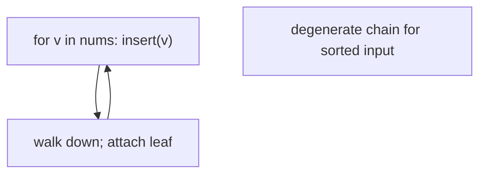
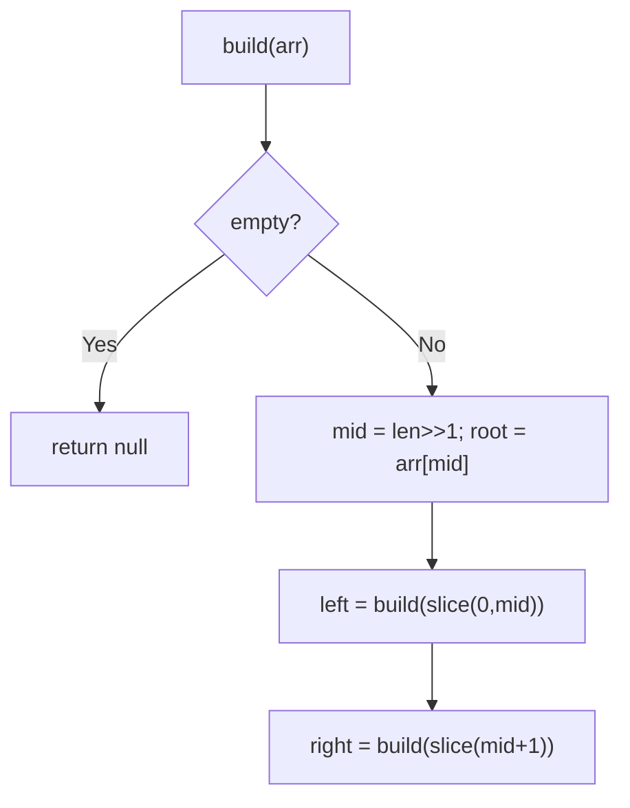

# 108. Convert Sorted Array to Binary Search Tree

- **LeetCode Link**: `https://leetcode.com/problems/convert-sorted-array-to-binary-search-tree/`
- **Difficulty**: Easy
- **Pattern Category**: Divide & Conquer / Midpoint Partition
- **Prerequisite Primer**: `00-foundations/03-core-algorithmic-patterns.md`

---

## 1. Problem Overview & Edge Case Matrix

### Problem Statement
Given an integer array `nums` where the elements are sorted in ascending order, convert it to a height-balanced binary search tree. A height-balanced binary tree has depth differences of at most one between left and right subtrees of every node. Return the root (any valid balanced BST accepted).

```
Example 1:
Input: nums = [-10,-3,0,5,9]
Output: [0,-3,9,-10,null,5]
Explanation: [0,-10,5,null,-3,null,9] is also accepted.

Example 2:
Input: nums = [1,3]
Output: [3,1] (or [1,null,3] — any balanced form)
```

### Visual Problem Representation
```
[-10,-3,0,5,9]:   pick mid 0 as root; recurse [-10,-3] and [5,9]
          0
        /   \
      -3     9
      /     /
   -10    5            balanced: depths differ ≤ 1 everywhere
```

### Upfront Edge Case Matrix
| Edge Case Category | Specific Input Scenario | Expected Behavior | Pitfall / Risk |
| :--- | :--- | :--- | :--- |
| Empty | `nums = []` | Return `null` | Range base case |
| Single Element | `[1]` | Single node | Midpoint on length 1 |
| Two elements | `[1,3]` | Either root (balanced both ways) | Test asserting one shape |
| Even length | `[1,2,3,4]` | Balanced (either middle) | Consistent mid bias |
| Large input | $10^4$ elements | Balanced, fast | Degenerate chain (no balancing) |

---

## 2. Level 1: Brute Force Approach

### Intuition & Visual Idea
Insert elements one by one into a plain BST (no balancing). Valid BST, correct elements — but sorted input degenerates into a right-leaning chain ($O(N^2)$ time, $O(N)$ height). The baseline that proves balancing is the whole problem.



### Pseudocode
```text
FUNCTION sortedArrayToBSTBruteForce(nums):
    root = NULL
    DEFINE insert(node, val):
        IF node NULL: RETURN TreeNode(val)
        IF val < node.val: node.left = insert(node.left, val)
        ELSE: node.right = insert(node.right, val)
        RETURN node
    FOR v IN nums: root = insert(root, v)
    RETURN root
```

### Step-by-Step Dry Run (Visual Trace)
| Step | Iteration / Pointer ($i, j$) | Current Value | State / Sub-array | Action Taken |
| :--- | :--- | :--- | :--- | :--- |
| 0 | insert `-10` | empty | Root `-10` | — |
| 1 | insert `-3` | greater, right | Chain grows | No balancing |
| 2 | insert `0, 5, 9` | all right | 5-deep chain | Return degenerate (valid BST!) |

### Modern JavaScript Implementation
```javascript
/**
 * Shared backbone: LeetCode provides TreeNode; defined once here so every
 * level below is locally runnable when concatenated (Level 1 + 2 + 3).
 */
class TreeNode {
  constructor(val, left = null, right = null) {
    this.val = val;
    this.left = left;
    this.right = right;
  }
}

function inorderVals(root) {
  // Test helper: BST validity + element check via inorder sequence.
  const out = [];
  (function walk(node) {
    if (!node) return;
    walk(node.left);
    out.push(node.val);
    walk(node.right);
  })(root);
  return out;
}

function treeHeight(root) {
  if (!root) return 0;
  return 1 + Math.max(treeHeight(root.left), treeHeight(root.right));
}

/**
 * Level 1: Brute Force (sequential unbalanced insert)
 * Time Complexity:  O(N²) worst case — sorted input degenerates to a chain
 * Space Complexity: O(N) — call stack depth on the chain
 */
function sortedArrayToBSTBruteForce(nums) {
  function insert(node, val) {
    if (node === null) return new TreeNode(val);
    // Duplicates go right (spec input is distinct; still deterministic).
    if (val < node.val) node.left = insert(node.left, val);
    else node.right = insert(node.right, val);
    return node;
  }
  let root = null;
  for (const v of nums) root = insert(root, v);
  return root;
}
```

### Complexity Breakdown
- **Time Complexity**: $O(N^2)$ worst case — each insert walks the growing chain.
- **Space Complexity**: $O(N)$ — degenerate depth; balance is what's missing.

---

## 3. Level 2: Optimized Approach

### Intuition & Visual Bottleneck Elimination
Midpoint recursion with array SLICES: root = middle, left/right built from halves. Balanced by construction — but every level copies $O(N)$ elements ($O(N \log N)$ space/time overhead).



### Pseudocode
```text
FUNCTION sortedArrayToBSTSliced(nums):
    IF nums EMPTY: RETURN NULL
    mid = nums.LENGTH >> 1
    root = TreeNode(nums[mid])
    root.left = sortedArrayToBSTSliced(nums.SLICE(0, mid))
    root.right = sortedArrayToBSTSliced(nums.SLICE(mid+1))
    RETURN root
```

### Step-by-Step Dry Run (Visual Trace)
| Step | Pointers / Window | Hash Map / Auxiliary State | Decision Logic | Output Accumulator |
| :--- | :--- | :--- | :--- | :--- |
| 0 | full `[-10,-3,0,5,9]` | mid `2` → root `0` | Split halves | Recurse |
| 1 | `[-10,-3]` | mid `1` → root `-3` | Left leaf `-10` | Subtree |
| 2 | `[5,9]` | mid `1` → root `9` | Left leaf `5` | Subtree |
| 3 | assemble | — | Balanced | Return root `0` |

### Modern JavaScript Implementation
```javascript
/**
 * Level 2: Optimized (midpoint recursion with slices)
 * Time Complexity:  O(N log N) — N work per level... precisely O(N) nodes +
 *   O(N log N) slice copying
 * Space Complexity: O(N log N) — slice garbage at every level
 */
// TreeNode shared from Level 1.
function sortedArrayToBSTSliced(nums) {
  if (nums.length === 0) return null;
  const mid = nums.length >> 1; // upper middle: either bias stays balanced
  const root = new TreeNode(nums[mid]);
  // Slices copy: correct but wasteful (Level 3 passes ranges instead).
  root.left = sortedArrayToBSTSliced(nums.slice(0, mid));
  root.right = sortedArrayToBSTSliced(nums.slice(mid + 1));
  return root;
}
```

### Complexity Breakdown
- **Time Complexity**: $O(N \log N)$ — node work plus slice copying per level.
- **Space Complexity**: $O(N \log N)$ — slice garbage; ranges eliminate it.

---

## 4. Level 3: Most Optimal / Canonical Approach

### Intuition & Mathematical / Invariant Proof
Index-range recursion over the ORIGINAL array: `build(lo, hi)` roots at `mid`, recursing `[lo, mid)` and `[mid+1, hi)$. Invariant: the subarray is sorted, so the midpoint root with balanced halves is a valid balanced BST (heights differ ≤ 1 by induction — halves differ in size by ≤ 1, and both are balanced). $O(N)$ time, $O(\log N)$ stack, zero copying. The canonical answer.

```
[-10,-3,0,5,9], build(0,5): mid=2 -> 0; build(0,2): mid=1 -> -3, leaf -10;
  build(3,5): mid=4 -> 9, leaf 5. Heights: 3,2,2,1,1 — balanced.
```

### Pseudocode
```text
FUNCTION sortedArrayToBST(nums):
    DEFINE build(lo, hi):   // half-open range [lo, hi)
        IF lo >= hi: RETURN NULL
        mid = lo + ((hi - lo) >> 1)
        root = TreeNode(nums[mid])
        root.left = build(lo, mid)
        root.right = build(mid + 1, hi)
        RETURN root
    RETURN build(0, nums.LENGTH)
```

### Step-by-Step Dry Run (Visual Trace)
| Step | Pointer $L$ | Pointer $R$ | Invariant Checked | In-Place State |
| :--- | :--- | :--- | :--- | :--- |
| 1 | `build(0,5)` | mid `2` → root `0` | Halves sizes 2, 2 | Recurse |
| 2 | `build(0,2)` | mid `1` → root `-3` | Leaf `-10` left | Subtree done |
| 3 | `build(3,5)` | mid `4` → root `9` | Leaf `5` left | Subtree done |
| 4 | assemble | heights ≤ 3, differ ≤ 1 | Balanced | Return `0` |

### Modern JavaScript Implementation
```javascript
/**
 * Level 3: Most Optimal / Canonical (index-range midpoint recursion)
 * Time Complexity:  O(N) — one node built per element, optimal
 * Space Complexity: O(log N) — call stack depth equals tree height
 */
// TreeNode shared from Level 1.
function sortedArrayToBST(nums) {
  function build(lo, hi) {
    // Empty half-open range: no node here.
    if (lo >= hi) return null;
    // Upper-middle bias (either bias keeps |left-right| <= 1).
    const mid = lo + ((hi - lo) >> 1);
    const root = new TreeNode(nums[mid]);
    root.left = build(lo, mid);
    root.right = build(mid + 1, hi);
    return root;
  }
  return build(0, nums.length);
}
```

### Complexity Breakdown
- **Time Complexity**: $O(N)$ — optimal lower bound; every element becomes one node.
- **Space Complexity**: $O(\log N)$ — stack depth equals (balanced) height.

---

## 5. JavaScript-Specific Gotchas & V8 Optimizations
- **GC Pressure**: Avoid allocating objects inside tight loops ($O(N)$ closures). Level 2's per-level `slice` pairs are the pressure removed — Level 3 allocates exactly $N$ result nodes.
- **Type Coercion / Sorting**: `mid = lo + ((hi - lo) >> 1)` overflow-safe form (habit from binary search); `>> 1` biases UP on even lengths (`5 >> 1 = 2`) — either bias balances, but state yours when asked.
- **Index Bounds**: Half-open `[lo, hi)` with `lo >= hi` base (not `lo > hi` — empty range is `lo == hi`); `slice(0, mid)` / `slice(mid+1)` in Level 2 must exclude `mid` on BOTH sides (including it duplicates the root downward).

---

## 6. Real-World MAANG Interview Follow-Ups & Extensions

### Follow-Up 1: Sorted linked list to BST (no random access)
- **Scenario**: Input is a sorted LINKED list (LeetCode 109) — no indexing.
- **Solution Strategy**: Same mid-pick via slow/fast pointers per range ($O(N \log N)$), or inorder-simulation: build the shape recursively while advancing a shared list pointer ($O(N)$ — the elegant answer).
- **JS Code / Implementation Pattern**:
```javascript
function sortedListToBST(head) {
  const vals = listToArray(head); // or inorder-simulation for O(1) extra
  return sortedArrayToBST(vals);
}
```

### Follow-Up 2: Balanced BST maintenance under inserts (AVL/red-black)
- **Scenario**: The array grows online; rebuilds are too slow.
- **Solution Strategy**: Self-balancing trees (rotations on insert, $O(\log N)$ amortized) — Level 1's chain is what rotations prevent; know single vs double rotations cold.
- **JS Code / Implementation Pattern**:
```javascript
function avlInsert(root, val) {
  return rebalance(bstInsert(root, val)); // rotations restore |h| <= 1
}
```

### Follow-Up 3: $10^9$-element sorted stream with $O(H)$ RAM
- **Scenario & In-Depth Solution**: Values stream in order; only the current path fits in RAM. Build bottom-up level by level (consume $2^h$ values per level left-to-right) — $O(N)$ time, $O(H)$ memory, single pass. The recursion becomes an explicit stack over stream cursors.
```javascript
async function bstFromStream(sortedStream) {
  return levelOrderBuild(sortedStream); // consume 1, 2, 4, 8... per level
}
```
