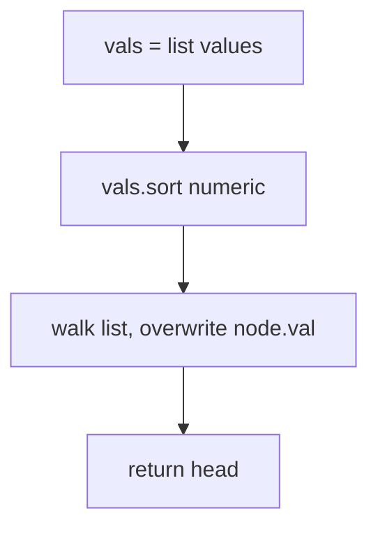
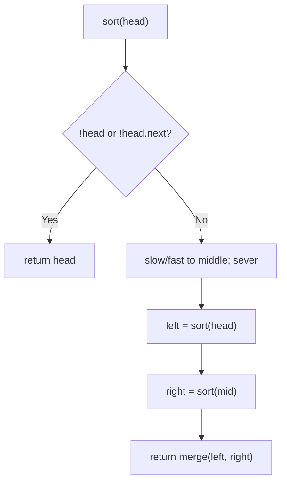
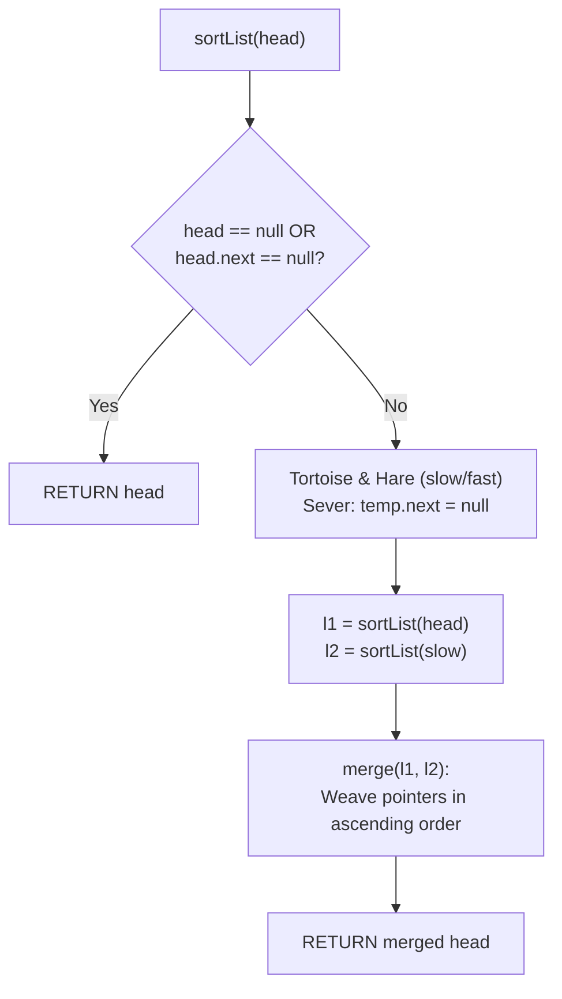

# 148. Sort List

- **LeetCode Link**: `https://leetcode.com/problems/sort-list/`
- **Difficulty**: Medium
- **Pattern Category**: Divide & Conquer / Linked Merge Sort
- **Prerequisite Primer**: `00-foundations/03-core-algorithmic-patterns.md`

---

## 1. Problem Overview & Edge Case Matrix

### Problem Statement
Given the `head` of a linked list, return the list sorted in ascending order. Follow-up: sort in $O(N \log N)$ time using $O(1)$ extra space (i.e. constant space complexity excluding recursion stack — which pushes toward bottom-up).

```
Example 1:
Input: head = [4,2,1,3]
Output: [1,2,3,4]

Example 2:
Input: head = [-1,5,3,4,0]
Output: [-1,0,3,4,5]

Example 3:
Input: head = []
Output: []
```

### Visual Problem Representation
```
[4,2,1,3] -> split [4,2] [1,3] -> split [4][2] [1][3]
  -> merge [2,4] [1,3] -> merge [1,2,3,4]
```

### Upfront Edge Case Matrix
| Edge Case Category | Specific Input Scenario | Expected Behavior | Pitfall / Risk |
| :--- | :--- | :--- | :--- |
| Empty | `head = null` | Return `null` | Split on null |
| Single node | `[1]` | Unchanged | Midpoint severing solo node |
| Two nodes, inverted | `[2,1]` | `[1,2]` | Split/merge base wiring |
| Duplicates | `[3,1,2,3]` | Stable-ish sorted | `<` vs `<=` (stability detail) |
| Negatives | `[-1,5,3,4,0]` | Sorted with sign | Comparator sign bugs |

---

## 2. Level 1: Brute Force Approach

### Intuition & Visual Idea
Drain values to an array, sort numerically, write back into the nodes. Structure untouched — $O(N)$ space and a full sort for a linked problem.



### Pseudocode
```text
FUNCTION sortListBruteForce(head):
    vals = []
    FOR cur = head; cur NOT NULL; cur = cur.next: vals.PUSH(cur.val)
    vals.SORT_NUMERICALLY()
    i = 0
    FOR cur = head; cur NOT NULL; cur = cur.next: cur.val = vals[i++]
    RETURN head
```

### Step-by-Step Dry Run (Visual Trace)
| Step | Iteration / Pointer ($i, j$) | Current Value | State / Sub-array | Action Taken |
| :--- | :--- | :--- | :--- | :--- |
| 0 | drain `[4,2,1,3]` | `vals = [4,2,1,3]` | Copy | Walk |
| 1 | numeric sort | `vals = [1,2,3,4]` | Comparator sort | Order |
| 2 | write back | nodes take `1,2,3,4` | Structure reused | Return head |

### Modern JavaScript Implementation
```javascript
/**
 * Shared backbone: LeetCode provides ListNode; defined once here so every
 * level below is locally runnable when concatenated (Level 1 + 2 + 3).
 */
class ListNode {
  constructor(val, next = null) {
    this.val = val;
    this.next = next;
  }
}

function arrayToList(arr) {
  const dummy = new ListNode(0);
  let cur = dummy;
  for (const v of arr) {
    cur.next = new ListNode(v);
    cur = cur.next;
  }
  return dummy.next;
}

function listToArray(head) {
  const out = [];
  while (head !== null) {
    out.push(head.val);
    head = head.next;
  }
  return out;
}

/**
 * Level 1: Brute Force (drain, sort, write back)
 * Time Complexity:  O(N log N) — engine sort dominates
 * Space Complexity: O(N) — value array
 */
function sortListBruteForce(head) {
  const vals = [];
  for (let cur = head; cur !== null; cur = cur.next) vals.push(cur.val);
  // Numeric comparator mandatory: default sort is lexicographic.
  vals.sort((a, b) => a - b);
  let i = 0;
  for (let cur = head; cur !== null; cur = cur.next) cur.val = vals[i++];
  return head;
}
```

### Complexity Breakdown
- **Time Complexity**: $O(N \log N)$ — engine sort; meets time, wastes space and ignores links.
- **Space Complexity**: $O(N)$ — value array; the follow-up demands $O(1)$.

---

## 3. Level 2: Optimized Approach

### Intuition & Visual Bottleneck Elimination
Top-down merge sort on links: slow/fast finds the middle, sever, recurse both halves, merge sorted halves. $O(N \log N)$ time with $O(\log N)$ stack — no values copied, nodes relinked.



### Pseudocode
```text
FUNCTION sortListMergeSort(head):
    IF head NULL OR head.next NULL: RETURN head
    slow = head; fast = head.next
    WHILE fast AND fast.next: slow = slow.next; fast = fast.next.next
    mid = slow.next; slow.next = NULL     // sever into halves
    RETURN mergeTwoLists(sortListMergeSort(head), sortListMergeSort(mid))

FUNCTION mergeTwoLists(a, b):   // dummy-head splice (see Merge Two Lists)
    dummy = ListNode(0); tail = dummy
    WHILE a AND b:
        IF a.val <= b.val: tail.next = a; a = a.next
        ELSE: tail.next = b; b = b.next
        tail = tail.next
    tail.next = a ?? b
    RETURN dummy.next
```

### Step-by-Step Dry Run (Visual Trace)
| Step | Pointers / Window | Hash Map / Auxiliary State | Decision Logic | Output Accumulator |
| :--- | :--- | :--- | :--- | :--- |
| 0 | `[4,2,1,3]` | slow→`2`, split | Halves `[4,2]`, `[1,3]` | Recurse |
| 1 | `[4,2]` → `[4]`, `[2]` | merge | `[2,4]` | Return up |
| 2 | `[1,3]` → `[1]`, `[3]` | merge | `[1,3]` | Return up |
| 3 | merge `[2,4]`, `[1,3]` | splice alternation | `[1,2,3,4]` | Return head |

### Modern JavaScript Implementation
```javascript
/**
 * Level 2: Optimized (top-down merge sort on links)
 * Time Complexity:  O(N log N) — log levels, linear merge each
 * Space Complexity: O(log N) — recursion depth
 */
// ListNode shared from Level 1.
function mergeTwoListsDC(a, b) {
  // Dummy-head splice: stable on ties (a wins with <=).
  const dummy = new ListNode(0);
  let tail = dummy;
  while (a !== null && b !== null) {
    if (a.val <= b.val) {
      tail.next = a;
      a = a.next;
    } else {
      tail.next = b;
      b = b.next;
    }
    tail = tail.next;
  }
  tail.next = a ?? b; // splice the surviving remainder wholesale
  return dummy.next;
}

function sortListMergeSort(head) {
  if (head === null || head.next === null) return head;
  // slow/fast with fast ONE ahead: slow lands left-of-middle (even lengths).
  let slow = head;
  let fast = head.next;
  while (fast !== null && fast.next !== null) {
    slow = slow.next;
    fast = fast.next.next;
  }
  const mid = slow.next;
  slow.next = null; // sever: two independent halves
  return mergeTwoListsDC(sortListMergeSort(head), sortListMergeSort(mid));
}
```

### Complexity Breakdown
- **Time Complexity**: $O(N \log N)$ — $\log N$ levels of linear merges.
- **Space Complexity**: $O(\log N)$ — recursion depth; the follow-up wants $O(1)$.

---

## 4. Level 3: Most Optimal / Canonical Approach

### Intuition & Mathematical / Invariant Proof
Bottom-up merge sort with $O(1)$ space: pass `step = 1, 2, 4, …` merging adjacent runs of length `step` via split/merge/tail-append. Invariant: after the `step` pass, every `2·step`-aligned block is sorted — doubling coverage per pass, $\log N$ passes total, no recursion. `split(head, size)` detaches a run (returns the rest); `merge(l1, l2, tail)` splices onto the result tail and returns the new tail. This is THE constant-space answer.

```
[4,2,1,3], step=1: [2,4]... precisely: runs [4],[2]->[2,4]; [1],[3]->[1,3]
  step=2: runs [2,4],[1,3] -> [1,2,3,4]. step=4 >= 4: done.
```

### Pseudocode
```text
FUNCTION sortList(head):
    IF head NULL OR head.next NULL: RETURN head
    n = LENGTH(head)
    dummy = ListNode(0, head)
    step = 1
    WHILE step < n:
        cur = dummy.next; tail = dummy
        WHILE cur NOT NULL:
            left = cur
            right = SPLIT(left, step)     // detach run; return remainder
            cur = SPLIT(right, step)
            tail = MERGE(left, right, tail)  // splice; return new tail
        step *= 2
    RETURN dummy.next
```

### Step-by-Step Dry Run (Visual Trace)
| Step | Pointer $L$ | Pointer $R$ | Invariant Checked | In-Place State |
| :--- | :--- | :--- | :--- | :--- |
| 1 | `step=1` | pairs `[4],[2]` → `[2,4]`; `[1],[3]` → `[1,3]` | Runs of 2 sorted | `[2,4,1,3]` |
| 2 | `step=2` | runs `[2,4],[1,3]` → `[1,2,3,4]` | Runs of 4 sorted | Done |
| 3 | `step=4 >= n=4` | loop ends | — | Return head |

### Modern JavaScript Implementation
```javascript
/**
 * Level 3: Most Optimal / Canonical (bottom-up merge sort, O(1) space)
 * Time Complexity:  O(N log N) — log passes, linear merges
 * Space Complexity: O(1) auxiliary — pointer surgery only
 */
// ListNode shared from Level 1.
function splitRun(head, size) {
  // Detach the first `size` nodes; return the remainder (may be null).
  for (let i = 1; head !== null && i < size; i++) head = head.next;
  if (head === null) return null;
  const next = head.next;
  head.next = null; // sever: left run ends here
  return next;
}

function mergeRuns(l1, l2, tail) {
  // Splice both runs onto tail; return the new tail (end of merged run).
  let cur = tail;
  while (l1 !== null && l2 !== null) {
    if (l1.val <= l2.val) {
      cur.next = l1;
      l1 = l1.next;
    } else {
      cur.next = l2;
      l2 = l2.next;
    }
    cur = cur.next;
  }
  cur.next = l1 ?? l2;
  while (cur.next !== null) cur = cur.next; // advance to the true end
  return cur;
}

function sortList(head) {
  if (head === null || head.next === null) return head;
  let n = 0;
  for (let c = head; c !== null; c = c.next) n++;
  const dummy = new ListNode(0, head);
  for (let step = 1; step < n; step *= 2) {
    let cur = dummy.next;
    let tail = dummy;
    while (cur !== null) {
      const left = cur;
      const right = splitRun(left, step);
      cur = splitRun(right, step);
      tail = mergeRuns(left, right, tail);
    }
  }
  return dummy.next;
}
```

### Complexity Breakdown
- **Time Complexity**: $O(N \log N)$ — optimal comparison-sort bound; $\log N$ linear passes.
- **Space Complexity**: $O(1)$ auxiliary — meets the follow-up; recursion-free by construction.

---

## 5. JavaScript-Specific Gotchas & V8 Optimizations
- **GC Pressure**: Avoid allocating objects inside tight loops ($O(N)$ closures). Level 1's value array is the pressure removed — Levels 2–3 allocate one dummy total; every other node is relinked, never copied.
- **Type Coercion / Sorting**: `vals.sort()` without `(a, b) => a - b` (Level 1) sorts lexicographically — the classic trap, fatal on multi-digit values. `a ?? b` remainder splice (Levels 2–3) reads cleaner than ternaries and short-circuits on `null` correctly.
- **Index Bounds**: `splitRun` with `size` exceeding the remainder returns `null` gracefully (loop exhausts) — `mergeRuns` then splices the single run via `??`. Forgetting `slow.next = null` (Level 2) or the sever inside `splitRun` (Level 3) creates cyclic lists that hang every downstream walk.

---

## 6. Real-World MAANG Interview Follow-Ups & Extensions

### Follow-Up 1: Sort with duplicates stability + K-way merge
- **Scenario**: Stable sort required, or merging $K$ sorted lists (LeetCode 23, next guide).
- **Solution Strategy**: `<=` keeps Level 2/3 stable (left wins ties); K-way generalizes the merge step to a heap or pairwise tournament.
- **JS Code / Implementation Pattern**:
```javascript
function mergeKListsFromRuns(runs) {
  return tournamentMerge(runs); // pairwise Level-2 merge as the combiner
}
```

### Follow-Up 2: $10^9$-node list with external runs
- **Scenario**: The list never fits in RAM; runs spill to disk.
- **Solution Strategy**: Level 3's pass structure IS external merge sort: runs are disk segments, `splitRun`/`mergeRuns` become page-oriented; $\log N$ multi-way merge passes with a $K$-way heap fan-in.
- **JS Code / Implementation Pattern**:
```javascript
async function externalSortList(headStream, pageSize) {
  return kWayMergeRuns(pagedRuns(headStream, pageSize)); // Level 3, paged
}
```

### Follow-Up 3: Concurrent sorting with segment handoff
- **Scenario & In-Depth Solution**: Sort segments on workers, merge centrally. Level 3's pass boundaries are the handoff points: disjoint `[cur, +2·step)` segments sort independently (no shared state), then one coordinator pass merges. Near-linear speedup to $\log N$ workers.
```javascript
async function parallelSortList(head, workers) {
  const segments = splitSegments(head, workers.length);
  const sorted = await Promise.all(segments.map((s, i) => workers[i].run(s)));
  return tournamentMerge(sorted);
}
```

---

## 7. What LeetCode Discuss Says (Language-Independent)

Source: top-voted post by Knockcat —
`https://leetcode.com/problems/sort-list/solutions/1795126/c-merge-sort-2-pointer-easy-to-understan-ytpy/`
— 114.8K views.
Language-independent summary. No new JS here.

### A. Optimal way from Discuss (Top-Down Merge Sort with Fast & Slow Pointer Bisection)

Sort singly linked lists in $O(N \log N)$ time by recursive bisection and in-place pointer merging:

1. **Base Case:**
   - If `head == NULL` or `head.next == NULL`, the list contains at most one element and is already sorted; return `head`.
2. **Tortoise & Hare Midpoint Bisection:**
   - Initialize two runners `slow = head`, `fast = head`, and trailing tracker `temp = NULL`.
   - While `fast != NULL` and `fast.next != NULL`:
     - `temp = slow`
     - `slow = slow.next`
     - `fast = fast.next.next`
   - **Sever the List:** Execute `temp.next = NULL`. The list is now split cleanly into two independent sublists:
     - Left half: `head ... temp`
     - Right half: `slow ... end`
3. **Divide & Conquer Recursion:**
   - Recursively sort each partition: `l1 = sortList(head)` and `l2 = sortList(slow)`.
4. **In-Place Pointer Merging:**
   - Merge `l1` and `l2` by comparing values and weaving `next` references using a sentinel `dummy` node without allocating fresh elements.

```text
FUNCTION sortList(head):
    IF head == NULL OR head.next == NULL:
        RETURN head

    temp = NULL
    slow = head
    fast = head

    WHILE fast != NULL AND fast.next != NULL:
        temp = slow
        slow = slow.next
        fast = fast.next.next

    temp.next = NULL  // sever left half

    l1 = sortList(head)
    l2 = sortList(slow)

    RETURN merge(l1, l2)

FUNCTION merge(l1, l2):
    dummy = NEW ListNode(0)
    tail = dummy

    WHILE l1 != NULL AND l2 != NULL:
        IF l1.val <= l2.val:
            tail.next = l1
            l1 = l1.next
        ELSE:
            tail.next = l2
            l2 = l2.next
        tail = tail.next

    IF l1 != NULL:
        tail.next = l1
    ELSE:
        tail.next = l2

    RETURN dummy.next
```

- Time: O(N log N) — follows the classic recurrence $T(N) = 2T(N/2) + O(N)$ across $\log_2 N$ levels of recursion.
- Space: O(log N) — recursion stack memory depth for top-down divide-and-conquer.



### B. Dry run on LeetCode Example 1 (`head = [4, 2, 1, 3]`)

- Round 1:
  - Initial list: `4 -> 2 -> 1 -> 3`.
  - Runners advance: `slow` stops at `1`, `temp` at `2`.
  - Sever link: `4 -> 2 -> null` and `1 -> 3 -> null`.
- Recursion on Left (`4 -> 2`):
  - Split: `4 -> null` and `2 -> null`.
  - Merge yields: `2 -> 4 -> null`.
- Recursion on Right (`1 -> 3`):
  - Split: `1 -> null` and `3 -> null`.
  - Merge yields: `1 -> 3 -> null`.
- Final Merge (`2 -> 4` and `1 -> 3`):
  - Compare 2 and 1 $\implies$ append 1.
  - Compare 2 and 3 $\implies$ append 2.
  - Compare 4 and 3 $\implies$ append 3.
  - Append remaining 4.
  - Result: `1 -> 2 -> 3 -> 4 -> null`.

### C. Why Merge Sort Dominates Linked List Sorting

- Singly linked lists lack random indexing, rendering quicksort partitioning slow and cache-unfriendly.
- Merge sort requires only sequential forward iteration, which maps directly to singly linked pointers. Furthermore, the merge step requires zero buffer allocation—it merely restructures pointers in place.

### D. Pitfalls from comments

- **Missing Link Disconnection (`temp.next = null`):** Forgetting to sever the connection causes the left half to still retain the right half in its tail, resulting in infinite recursion and StackOverflow.
- **Two-Element Termination:** In a list of two nodes (`[2, 1]`), `temp` points to `2` and `slow` points to `1`. Disconnecting `temp.next` produces two single-node sublists, terminating cleanly.

### E. Companies

- Discuss post itself names none.
  Companies tab on LeetCode is premium-locked.
- External source:
  `https://github.com/liquidslr/leetcode-company-wise-problems`
  (LeetCode company tags, updated June 2025).
- All-time (9): Amazon, Bloomberg, ByteDance, Google, Lyft, Meta, Microsoft, Oracle, TikTok.
- Recent: 30 days — Google.
- Recent: 3 months — Amazon, Bloomberg, Google, Meta.
