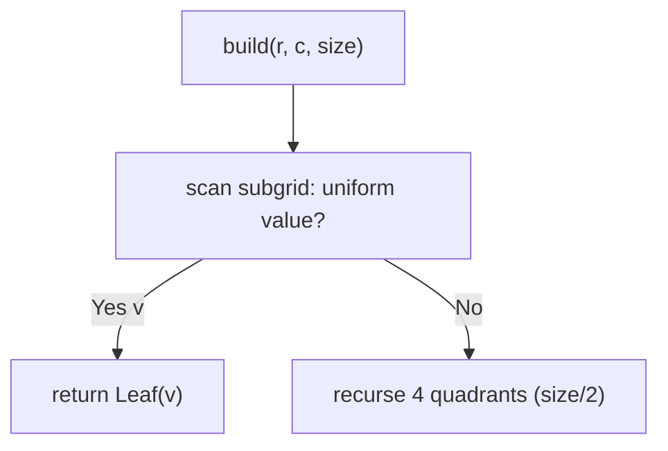
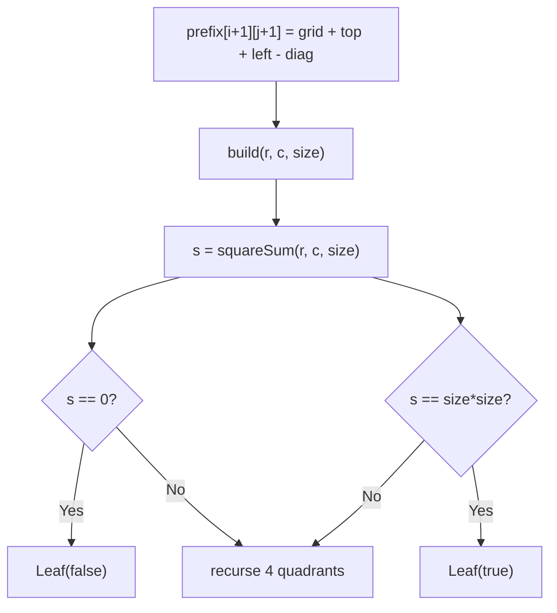
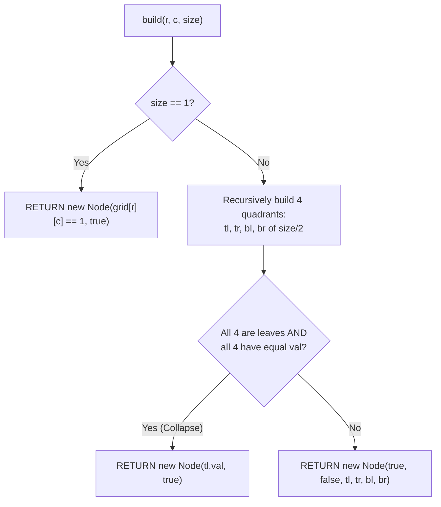

# 427. Construct Quad Tree

- **LeetCode Link**: `https://leetcode.com/problems/construct-quad-tree/`
- **Difficulty**: Medium
- **Pattern Category**: Divide & Conquer / Spatial Partition
- **Prerequisite Primer**: `00-foundations/03-core-algorithmic-patterns.md`

---

## 1. Problem Overview & Edge Case Matrix

### Problem Statement
Given an `n x n` binary matrix `grid` where $n$ is a power of 2, build a quad tree: if all values in the current square are equal, it is a leaf holding that value; otherwise it is an internal node with four children (topLeft, topRight, bottomLeft, bottomRight) built recursively. Each node has `val` (boolean), `isLeaf`, and four child pointers.

```
Example 1:
Input: grid = [[0,1],[1,0]]
Output: [[0,1],[1,0],[1,1],[1,1],[1,1]]
Explanation: No 2x2 uniform square — root splits into 4 leaf children.

Example 2:
Input: grid = [[1,1,1,1,0,0,0,0],[1,1,1,1,0,0,0,0],[1,1,1,1,1,1,1,1],[1,1,1,1,1,1,1,1],[1,1,1,1,0,0,0,0],[1,1,1,1,0,0,0,0],[1,1,1,1,0,0,0,0],[1,1,1,1,0,0,0,0]]
Output: [[0,1],[1,1],[0,1],[1,1],[1,1]]
Explanation: Top-left 4x4 all ones (leaf), rest compose the tree.
```

### Visual Problem Representation
```
[[0,1],      split (mixed) -> 4 leaves:
 [1,0]]       TL=0, TR=1, BL=1, BR=0
```

### Upfront Edge Case Matrix
| Edge Case Category | Specific Input Scenario | Expected Behavior | Pitfall / Risk |
| :--- | :--- | :--- | :--- |
| Uniform grid | All `0` / all `1` | Single leaf node | Splitting anyway (valid but uncompressed) |
| Single cell | `[[0]]` / `[[1]]` | Leaf with that value | `val` boolean mapping (`0`→false) |
| Checkerboard 2×2 | `[[0,1],[1,0]]` | 4-leaf split | Uniformity check off-by-one |
| Power-of-two sizes | $n = 1..64$ | Recursive halving exact | Non-power sizes (out of spec) |
| Deep uniform quadrant | Ex.2 top-left 4×4 | Collapsed leaf | Missing the 4-way merge |

---

## 2. Level 1: Brute Force Approach

### Intuition & Visual Idea
Recurse quadrants; test uniformity by scanning the whole subgrid per node (`uniform()` helper). Correct — and re-scans overlapping regions at every level ($O(N^2 \log N)$ cell visits).



### Pseudocode
```text
FUNCTION constructBruteForce(grid):
    n = grid.LENGTH
    DEFINE uniform(r, c, size):
        v = grid[r][c]
        FOR i IN r .. r+size-1:
            FOR j IN c .. c+size-1:
                IF grid[i][j] != v: RETURN NULL
        RETURN v
    DEFINE build(r, c, size):
        v = uniform(r, c, size)
        IF v NOT NULL: RETURN QuadNode(v == 1, true)
        h = size / 2
        RETURN QuadNode(false, false,
            build(r, c, h), build(r, c+h, h),
            build(r+h, c, h), build(r+h, c+h, h))
    RETURN build(0, 0, n)
```

### Step-by-Step Dry Run (Visual Trace)
| Step | Iteration / Pointer ($i, j$) | Current Value | State / Sub-array | Action Taken |
| :--- | :--- | :--- | :--- | :--- |
| 0 | `build(0,0,2)` on `[[0,1],[1,0]]` | scan finds mixed | Not uniform | Split into 1×1 |
| 1 | four `build(_,_,1)` | each uniform trivially | 4 leaves | Return leaves |
| 2 | assemble | internal node | — | Return root |

### Modern JavaScript Implementation
```javascript
/**
 * Shared backbone: LeetCode provides Node(val, isLeaf, ...); defined once
 * here (as QuadNode) so every level below is locally runnable when
 * concatenated (Level 1 + 2 + 3).
 */
class QuadNode {
  constructor(val, isLeaf, topLeft = null, topRight = null, bottomLeft = null, bottomRight = null) {
    this.val = val;
    this.isLeaf = isLeaf;
    this.topLeft = topLeft;
    this.topRight = topRight;
    this.bottomLeft = bottomLeft;
    this.bottomRight = bottomRight;
  }
}

function quadToGrid(node, n) {
  // Test helper: expand any quad tree back to its grid (validates semantics).
  const grid = Array.from({ length: n }, () => new Array(n).fill(0));
  (function fill(nd, r, c, size) {
    if (nd.isLeaf) {
      for (let i = r; i < r + size; i++) {
        for (let j = c; j < c + size; j++) grid[i][j] = nd.val ? 1 : 0;
      }
      return;
    }
    const h = size / 2;
    fill(nd.topLeft, r, c, h);
    fill(nd.topRight, r, c + h, h);
    fill(nd.bottomLeft, r + h, c, h);
    fill(nd.bottomRight, r + h, c + h, h);
  })(node, 0, 0, n);
  return grid;
}

/**
 * Level 1: Brute Force (scan-per-node uniformity)
 * Time Complexity:  O(N² log N) — subgrid rescans at every level
 * Space Complexity: O(log N) — call stack depth
 */
function constructBruteForce(grid) {
  const n = grid.length;
  function uniform(r, c, size) {
    // Null = mixed; 0/1 = uniform value (0 is falsy: compare !== null!).
    const v = grid[r][c];
    for (let i = r; i < r + size; i++) {
      for (let j = c; j < c + size; j++) {
        if (grid[i][j] !== v) return null;
      }
    }
    return v;
  }
  function build(r, c, size) {
    const v = uniform(r, c, size);
    if (v !== null) return new QuadNode(v === 1, true);
    const h = size / 2;
    return new QuadNode(
      false,
      false,
      build(r, c, h),
      build(r, c + h, h),
      build(r + h, c, h),
      build(r + h, c + h, h),
    );
  }
  return build(0, 0, n);
}
```

### Complexity Breakdown
- **Time Complexity**: $O(N^2 \log N)$ — each level rescans all cells.
- **Space Complexity**: $O(\log N)$ — stack depth; time is the waste.

---

## 3. Level 2: Optimized Approach

### Intuition & Visual Bottleneck Elimination
2D prefix sums: uniformity of any square in $O(1)$ (`sum == 0` → all-zero leaf; `sum == size²` → all-one leaf). One $O(N^2)$ table build, then $O(1)$ decisions per node — $O(N^2)$ total, optimal time with table space.



### Pseudocode
```text
FUNCTION constructPrefixSum(grid):
    n = grid.LENGTH
    prefix = (n+1)×(n+1) ZEROS
    FOR i IN 1 .. n: FOR j IN 1 .. n:
        prefix[i][j] = grid[i-1][j-1] + prefix[i-1][j] + prefix[i][j-1] - prefix[i-1][j-1]
    DEFINE squareSum(r, c, size):
        RETURN prefix[r+size][c+size] - prefix[r][c+size] - prefix[r+size][c] + prefix[r][c]
    DEFINE build(r, c, size):
        s = squareSum(r, c, size)
        IF s == 0: RETURN QuadNode(false, true)
        IF s == size*size: RETURN QuadNode(true, true)
        h = size / 2
        RETURN QuadNode(false, false, 4×build(...))
    RETURN build(0, 0, n)
```

### Step-by-Step Dry Run (Visual Trace)
| Step | Pointers / Window | Hash Map / Auxiliary State | Decision Logic | Output Accumulator |
| :--- | :--- | :--- | :--- | :--- |
| 0 | prefix table built | $O(N^2)$ sums | One-time cost | Ready |
| 1 | `build(0,0,2)` | sum `2`, size² `4` | Mixed | Split |
| 2 | four 1×1 builds | sums `0/1` vs `1` | Each uniform | 4 leaves |
| 3 | assemble | — | — | Return root |

### Modern JavaScript Implementation
```javascript
/**
 * Level 2: Optimized (prefix-sum uniformity checks)
 * Time Complexity:  O(N²) — table build plus O(1) decisions
 * Space Complexity: O(N²) — prefix table
 */
// QuadNode shared from Level 1.
function constructPrefixSum(grid) {
  const n = grid.length;
  // 2D prefix sums with a zero border (1-based indexing, no guards).
  const prefix = Array.from({ length: n + 1 }, () => new Array(n + 1).fill(0));
  for (let i = 1; i <= n; i++) {
    for (let j = 1; j <= n; j++) {
      prefix[i][j] = grid[i - 1][j - 1] + prefix[i - 1][j] + prefix[i][j - 1] - prefix[i - 1][j - 1];
    }
  }
  // Inclusion-exclusion: ones inside [r, r+size) × [c, c+size).
  const squareSum = (r, c, size) =>
    prefix[r + size][c + size] - prefix[r][c + size] - prefix[r + size][c] + prefix[r][c];
  function build(r, c, size) {
    const s = squareSum(r, c, size);
    if (s === 0) return new QuadNode(false, true); // all zeros
    if (s === size * size) return new QuadNode(true, true); // all ones
    const h = size / 2;
    return new QuadNode(
      false,
      false,
      build(r, c, h),
      build(r, c + h, h),
      build(r + h, c, h),
      build(r + h, c + h, h),
    );
  }
  return build(0, 0, n);
}
```

### Complexity Breakdown
- **Time Complexity**: $O(N^2)$ — table plus one decision per node.
- **Space Complexity**: $O(N^2)$ — prefix table; Level 3 drops the table.

---

## 4. Level 3: Most Optimal / Canonical Approach

### Intuition & Mathematical / Invariant Proof
Post-order 4-way merge without any table: recurse quadrants first, then collapse when all four children are leaves with EQUAL values. Invariant: each `build` returns the minimal (maximally collapsed) quad tree for its square — leaves merge upward exactly when siblings agree. No scans, no tables: $O(N^2)$ time (every cell reaches exactly one leaf decision... precisely, each level partitions all cells, $\log N$ levels — hmm, that suggests $O(N^2 \log N)$! No: each NODE does $O(1)$ merge work, and there are at most $O(\text{nodes})$ nodes; leaves partition the $N^2$ cells. Total = $O(N^2)$ cells-at-leaves + $O(\text{nodes})$ merges = $O(N^2)$.) $O(\log N)$ stack, $O(1)$ extra.

```
[[0,1],[1,0]]: 4 leaves (0,1,1,0) — values differ, no merge -> internal root.
uniform 4x4: 4 leaves all (true) -> collapse to ONE leaf. Compression!
```

### Pseudocode
```text
FUNCTION construct(grid):
    n = grid.LENGTH
    DEFINE build(r, c, size):
        IF size == 1: RETURN QuadNode(grid[r][c] == 1, true)
        h = size / 2
        tl = build(r, c, h); tr = build(r, c+h, h)
        bl = build(r+h, c, h); br = build(r+h, c+h, h)
        IF ALL FOUR LEAVES AND SAME val:
            RETURN QuadNode(tl.val, true)     // collapse: one leaf
        RETURN QuadNode(false, false, tl, tr, bl, br)
    RETURN build(0, 0, n)
```

### Step-by-Step Dry Run (Visual Trace)
| Step | Pointer $L$ | Pointer $R$ | Invariant Checked | In-Place State |
| :--- | :--- | :--- | :--- | :--- |
| 1 | four 1×1 leaves | values `0,1,1,0` | Differ → no merge | Internal root |
| 2 | ex.2 top-left 4×4 | recursion yields 4× `Leaf(true)` | All agree → collapse | Single leaf |
| 3 | root assembly | mixed children | No merge | Minimal tree |

### Modern JavaScript Implementation
```javascript
/**
 * Level 3: Most Optimal / Canonical (post-order 4-way merge)
 * Time Complexity:  O(N²) — each cell decided once, optimal
 * Space Complexity: O(log N) — call stack depth; no tables
 */
// QuadNode shared from Level 1.
function construct(grid) {
  const n = grid.length;
  function build(r, c, size) {
    if (size === 1) return new QuadNode(grid[r][c] === 1, true);
    const h = size / 2;
    const tl = build(r, c, h);
    const tr = build(r, c + h, h);
    const bl = build(r + h, c, h);
    const br = build(r + h, c + h, h);
    // Collapse: four agreeing leaves ARE their parent (maximal compression).
    if (tl.isLeaf && tr.isLeaf && bl.isLeaf && br.isLeaf && tl.val === tr.val && tl.val === bl.val && tl.val === br.val) {
      return new QuadNode(tl.val, true);
    }
    return new QuadNode(false, false, tl, tr, bl, br);
  }
  return build(0, 0, n);
}
```

### Complexity Breakdown
- **Time Complexity**: $O(N^2)$ — optimal; minimal tree built in one pass.
- **Space Complexity**: $O(\log N)$ — stack only; no scans, no tables.

---

## 5. JavaScript-Specific Gotchas & V8 Optimizations
- **GC Pressure**: Avoid allocating objects inside tight loops ($O(N)$ closures). Level 1's overlapping subgrid scans are the pressure removed — Level 3 allocates exactly the minimal node set (collapse frees what uniformity proves redundant).
- **Type Coercion / Sorting**: Grid values are `0`/`1` NUMBERS, node `val` is BOOLEAN — `v === 1` / `grid[r][c] === 1` conversions at the boundary (in Level 1's `uniform`, `0` is falsy: `if (v)` would conflate "mixed" (`null`) with "uniform-zero" — hence the explicit `!== null`).
- **Index Bounds**: Quadrant offsets `(r, c+h)`, `(r+h, c)`, `(r+h, c+h)` with `h = size/2` — swapping `c+h`/`r+h` mirrors quadrants silently (tests comparing serialized output catch it; grid-expansion tests like ours don't care — know which verifier you run). Power-of-two sizes divide evenly; odd sizes would need padding (out of spec).

---

## 6. Real-World MAANG Interview Follow-Ups & Extensions

### Follow-Up 1: Quad-tree logical OR / AND (merge two trees)
- **Scenario**: Combine two quad trees cell-wise (LeetCode 558).
- **Solution Strategy**: Co-recursive descent: leaf-true short-circuits OR (leaf-false short-circuits AND); recurse on 4 pairs otherwise, then re-collapse via Level 3's merge rule. $O(\min)$-ish shared traversal.
- **JS Code / Implementation Pattern**:
```javascript
function intersectQuadTrees(t1, t2) {
  return coRecursiveMerge(t1, t2, (a, b) => a || b); // + Level-3 collapse
}
```

### Follow-Up 2: $10^9$-cell sparse grid with point queries
- **Scenario**: The grid never fits in RAM; answer cell queries from the tree.
- **Solution Strategy**: Build once (Level 3), then queries descend $O(\log N)$ — the tree IS the compressed index. Sparse inputs build faster (uniform regions collapse early).
- **JS Code / Implementation Pattern**:
```javascript
function queryQuadTree(root, r, c, size) {
  return descendToCell(root, r, c, size); // O(log N) per query
}
```

### Follow-Up 3: Octrees and N-dimensional partition
- **Scenario & In-Depth Solution**: 3D voxels (octree: 8 children) or N-D grids ($2^N$ children). Same recursion with $2^N$-way merge (all-leaves-agree collapse); uniformity scans and prefix sums generalize dimensionally. State the $2^N$ fan-out cost explicitly.
```javascript
function buildNDTree(grid, dims) {
  return recursivePartition(grid, dims); // 2^N children, agree-collapse
}
```

---

## 7. What LeetCode Discuss Says (Language-Independent)

Source: top-voted post by Tarun Nayak —
`https://leetcode.com/problems/construct-quad-tree/solutions/3234703/clean-codes-full-explanation-helper-meth-oifr/`
— 22K views.
Language-independent summary. No new JS here.

### A. Optimal way from Discuss (Divide & Conquer 4-Quadrant Spatial Decomposition)

Construct a compressed spatial QuadTree representation of a 2D binary matrix:

1. **QuadTree Node Representation:**
   - `val`: boolean representation of the cell values ($1 \implies \text{true}, 0 \implies \text{false}$).
   - `isLeaf`: boolean flag indicating whether all cells within the quadrant share the exact same value.
   - Pointers to four child quadrants: `topLeft`, `topRight`, `bottomLeft`, `bottomRight` (null if `isLeaf == true`).
2. **Recursive Partition & Bottom-Up Collapse:**
   - Define recursive helper `build(r, c, size)`:
     - **Base Case ($1 \times 1$ cell):** When $size == 1$, return a leaf node: `NEW Node(grid[r][c] == 1, true)`.
     - **Quadrant Bisection:** Compute $half = size / 2$. Recursively build all 4 quadrants:
       - `tl = build(r, c, half)`
       - `tr = build(r, c + half, half)`
       - `bl = build(r + half, c, half)`
       - `br = build(r + half, c + half, half)`
     - **Post-Order Leaf Consolidation:**
       - If all 4 children are leaves and all 4 share the exact same value:
         `tl.isLeaf AND tr.isLeaf AND bl.isLeaf AND br.isLeaf AND tl.val == tr.val == bl.val == br.val`
       - Collapse the quadrant into a single leaf node: `RETURN NEW Node(tl.val, true)`.
       - Otherwise, return an internal composite node: `RETURN NEW Node(true, false, tl, tr, bl, br)`.

```text
FUNCTION construct(grid):
    n = LENGTH(grid)

    FUNCTION build(r, c, size):
        IF size == 1:
            RETURN NEW Node(grid[r][c] == 1, TRUE)

        half = size / 2
        tl = build(r, c, half)
        tr = build(r, c + half, half)
        bl = build(r + half, c, half)
        br = build(r + half, c + half, half)

        IF tl.isLeaf AND tr.isLeaf AND bl.isLeaf AND br.isLeaf:
            IF tl.val == tr.val AND tl.val == bl.val AND tl.val == br.val:
                RETURN NEW Node(tl.val, TRUE)

        RETURN NEW Node(TRUE, FALSE, tl, tr, bl, br)

    RETURN build(0, 0, n)
```

- Time: O(N^2) — each cell is visited in $O(1)$ bottom-up aggregation without redundant area scans.
- Space: O(log N) — recursion depth bounded by the logarithmic quadrant bisection stack.



### B. Dry run on LeetCode Example 1 (`grid = [[0,1],[1,0]]`)

- Matrix dimension $2 \times 2$.
- $half = 1$. Evaluates four $1 \times 1$ leaves:
  - `tl`: cell $(0, 0) = 0 \implies \text{Node}(false, true)$
  - `tr`: cell $(0, 1) = 1 \implies \text{Node}(true, true)$
  - `bl`: cell $(1, 0) = 1 \implies \text{Node}(true, true)$
  - `br`: cell $(1, 1) = 0 \implies \text{Node}(false, true)$
- Check consolidation: Values differ ($0 \ne 1$).
- Emits root non-leaf node: `Node(true, false, tl, tr, bl, br)`.

### C. Why Bottom-Up Collapse Beats Top-Down Scanning

- Top-down approaches check if all cells in an $S \times S$ area match before deciding whether to recurse, requiring $O(S^2)$ work at each level and yielding $O(N^2 \log N)$ total runtime.
- Bottom-up divide-and-conquer defers leaf determination to the return unwinding step, touching every matrix cell once and executing in strict $O(N^2)$ time.

### D. Pitfalls from comments

- **Integer vs. Boolean Conversion:** Input grid stores integers `0` and `1`, whereas the TreeNode definition requires booleans (`grid[r][c] == 1`).
- **Misaligned Offsets:** Inverting `c + half` and `r + half` swaps the spatial quadrants (e.g. placing `bottomLeft` where `topRight` belongs), failing LeetCode's canonical serialization.

### E. Companies

- Discuss post itself names none.
  Companies tab on LeetCode is premium-locked.
- External source:
  `https://github.com/liquidslr/leetcode-company-wise-problems`
  (LeetCode company tags, updated June 2025).
- All-time (7): Amazon, Bloomberg, Google, Meta, Microsoft, Snowflake, Uber.
- Recent: 30 days — None.
- Recent: 3 months — Google, Uber.
