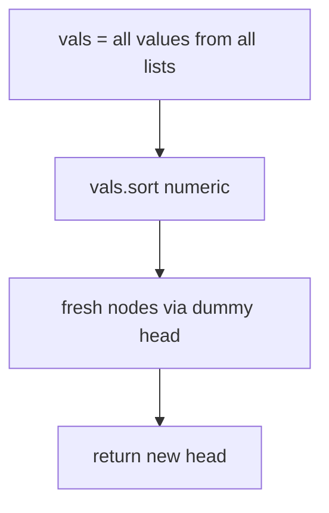
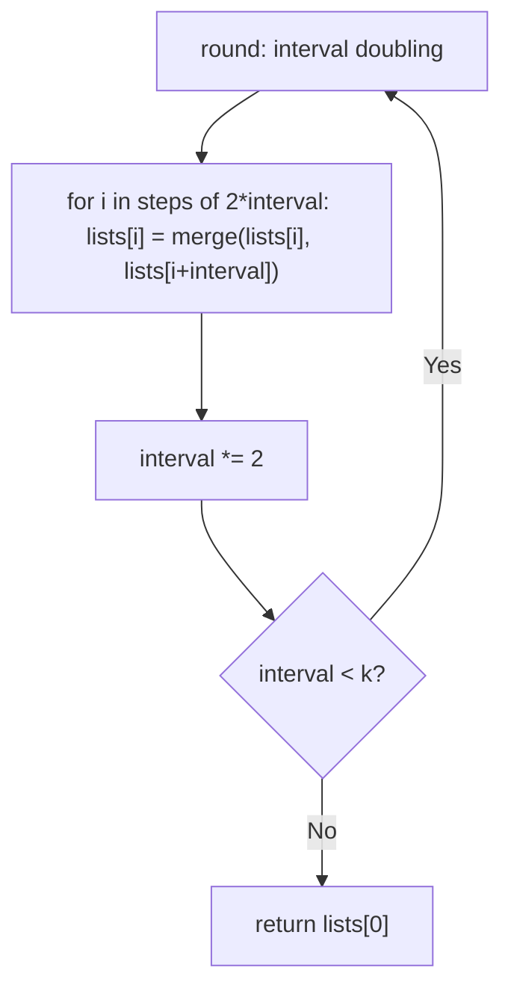
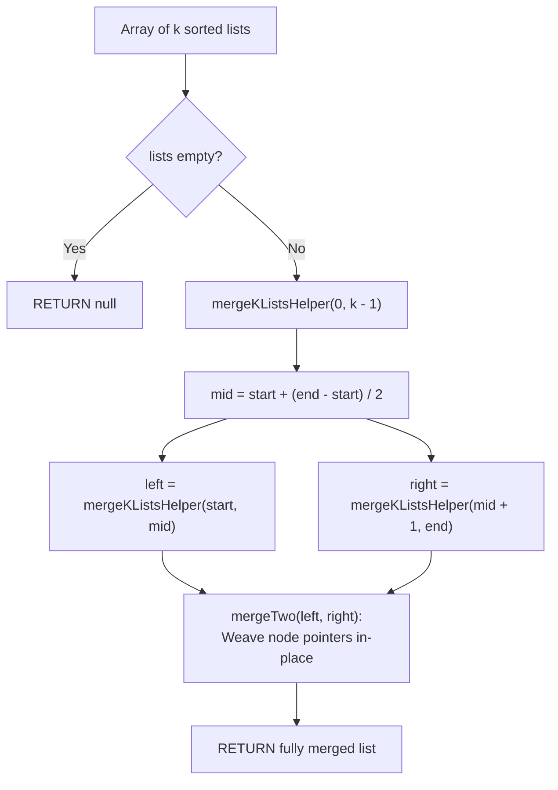

# 23. Merge k Sorted Lists

- **LeetCode Link**: `https://leetcode.com/problems/merge-k-sorted-lists/`
- **Difficulty**: Hard
- **Pattern Category**: Divide & Conquer / K-Way Merge
- **Prerequisite Primer**: `00-foundations/02-data-structure-polyfills.md`

---

## 1. Problem Overview & Edge Case Matrix

### Problem Statement
You are given an array of `k` linked-lists `lists`, each linked-list is sorted in ascending order. Merge all the linked-lists into one sorted linked-list and return it.

```
Example 1:
Input: lists = [[1,4,5],[1,3,4],[2,6]]
Output: [1,1,2,3,4,4,5,6]

Example 2:
Input: lists = []
Output: []

Example 3:
Input: lists = [[]]
Output: []
```

### Visual Problem Representation
```
[1,4,5] [1,3,4] [2,6]:  pairwise tournament:
  round 1: merge(l0,l1) -> [1,1,3,4,4,5]; l2 bye
  round 2: merge(result,l2) -> [1,1,2,3,4,4,5,6]
```

### Upfront Edge Case Matrix
| Edge Case Category | Specific Input Scenario | Expected Behavior | Pitfall / Risk |
| :--- | :--- | :--- | :--- |
| Empty array | `lists = []` | Return `null` | Loop over zero lists |
| Empty lists inside | `lists = [[]]` / contains `null` | Skip empties | Null-head merge crash |
| Single list | `k = 1` | Return it as-is | Unnecessary rebuild |
| Varying lengths | One long, many tiny | Correct merge | Heap-vs-tournament tradeoff (see below) |
| Duplicates across lists | `1` in two lists | Both kept, stable-ish | Dedup logic that must NOT exist |

---

## 2. Level 1: Brute Force Approach

### Intuition & Visual Idea
Drain all values into one array, sort numerically, rebuild fresh nodes. $O(N \log N)$ — ignores sortedness entirely (and Heap's $O(N \log k)$ beats it whenever $k \ll N$).



### Pseudocode
```text
FUNCTION mergeKListsBruteForce(lists):
    vals = []
    FOR EACH head IN lists:
        FOR cur = head; cur NOT NULL; cur = cur.next: vals.PUSH(cur.val)
    vals.SORT_NUMERICALLY()
    dummy = ListNode(0); tail = dummy
    FOR v IN vals: tail.next = ListNode(v); tail = tail.next
    RETURN dummy.next
```

### Step-by-Step Dry Run (Visual Trace)
| Step | Iteration / Pointer ($i, j$) | Current Value | State / Sub-array | Action Taken |
| :--- | :--- | :--- | :--- | :--- |
| 0 | drain 3 lists | 8 values | `vals` unsorted | Collect |
| 1 | numeric sort | `[1,1,2,3,4,4,5,6]` | Ordered | Sort |
| 2 | rebuild | 8 fresh nodes | New list | Return head |

### Modern JavaScript Implementation
```javascript
/**
 * Shared backbone: LeetCode provides ListNode; defined once here so every
 * level below is locally runnable when concatenated (Level 1 + 2 + 3).
 */
class ListNode {
  constructor(val, next = null) {
    this.val = val;
    this.next = next;
  }
}

function arrayToList(arr) {
  const dummy = new ListNode(0);
  let cur = dummy;
  for (const v of arr) {
    cur.next = new ListNode(v);
    cur = cur.next;
  }
  return dummy.next;
}

function listToArray(head) {
  const out = [];
  while (head !== null) {
    out.push(head.val);
    head = head.next;
  }
  return out;
}

/**
 * Level 1: Brute Force (drain, sort, rebuild)
 * Time Complexity:  O(N log N) — total sort of all values
 * Space Complexity: O(N) — value array plus rebuilt list
 */
function mergeKListsBruteForce(lists) {
  const vals = [];
  for (const head of lists) {
    for (let cur = head; cur !== null; cur = cur.next) vals.push(cur.val);
  }
  // Numeric comparator mandatory: default sort is lexicographic.
  vals.sort((a, b) => a - b);
  const dummy = new ListNode(0);
  let tail = dummy;
  for (const v of vals) {
    tail.next = new ListNode(v);
    tail = tail.next;
  }
  return dummy.next; // null when input held nothing: correct for [] and [[]]
}
```

### Complexity Breakdown
- **Time Complexity**: $O(N \log N)$ — full sort; sorted inputs deserve better.
- **Space Complexity**: $O(N)$ — array plus $N$ fresh nodes.

---

## 3. Level 2: Optimized Approach

### Intuition & Visual Bottleneck Elimination
Pairwise tournament (divide and conquer): merge list pairs repeatedly, halving the field each round ($\log k$ rounds, $O(N)$ work each). Reuses the two-list merge as the combiner — $O(N \log k)$ time, $O(1)$ extra space.



### Pseudocode
```text
FUNCTION mergeKListsDivideConquer(lists):
    IF lists EMPTY: RETURN NULL
    arr = COPY(lists); interval = 1
    WHILE interval < arr.LENGTH:
        FOR i IN 0, 2*interval, 4*interval, ... WHILE i + interval < arr.LENGTH:
            arr[i] = mergeTwoLists(arr[i], arr[i + interval])
        interval *= 2
    RETURN arr[0]
```

### Step-by-Step Dry Run (Visual Trace)
| Step | Pointers / Window | Hash Map / Auxiliary State | Decision Logic | Output Accumulator |
| :--- | :--- | :--- | :--- | :--- |
| 0 | `interval = 1` | merge `(l0,l1)` | `[1,1,3,4,4,5]`, l2 bye | `arr = [merged, l1, l2]` |
| 1 | `interval = 2` | merge `(arr0, arr2)` | Full merge | `[1,1,2,3,4,4,5,6]` |
| 2 | `interval = 4 >= 3` | loop ends | — | Return `arr[0]` |

### Modern JavaScript Implementation
```javascript
/**
 * Level 2: Optimized (pairwise tournament merge)
 * Time Complexity:  O(N log k) — log k rounds, linear work each
 * Space Complexity: O(1) auxiliary — nodes relinked in place
 */
// ListNode shared from Level 1.
function mergeTwoListsDC(a, b) {
  // Dummy-head splice (see Merge Two Sorted Lists): stable on ties.
  const dummy = new ListNode(0);
  let tail = dummy;
  while (a !== null && b !== null) {
    if (a.val <= b.val) {
      tail.next = a;
      a = a.next;
    } else {
      tail.next = b;
      b = b.next;
    }
    tail = tail.next;
  }
  tail.next = a ?? b;
  return dummy.next;
}

function mergeKListsDivideConquer(lists) {
  if (lists.length === 0) return null;
  const arr = lists.slice(); // avoid mutating the caller's array
  let interval = 1;
  while (interval < arr.length) {
    // Pair neighbors interval apart; odd one out gets a bye.
    for (let i = 0; i + interval < arr.length; i += interval * 2) {
      arr[i] = mergeTwoListsDC(arr[i], arr[i + interval]);
    }
    interval *= 2;
  }
  return arr[0];
}
```

### Complexity Breakdown
- **Time Complexity**: $O(N \log k)$ — $\log k$ rounds of linear merging.
- **Space Complexity**: $O(1)$ auxiliary — in-place relinking; the input array copy is $O(k)$ references.

---

## 4. Level 3: Most Optimal / Canonical Approach

### Intuition & Mathematical / Invariant Proof
Min-heap k-way merge: seed with all non-null heads; repeatedly pop the minimum, append it, push its successor. Invariant: the heap always holds exactly the smallest untaken node of each live list — so each pop is globally next-smallest. $O(N \log k)$ time like Level 2, but single-pass with better constants when lists vary wildly in length (no round synchronization), at $O(k)$ heap space. The canonical answer for streaming/online variants.

```
heads [1,1,2]: pop 1(l0) -> push 4; pop 1(l1) -> push 3; pop 2 -> push 6 ...
  each pop is the global minimum of all remaining heads
```

### Pseudocode
```text
FUNCTION mergeKLists(lists):
    heap = EMPTY MIN-HEAP (by node.val)
    FOR head IN lists: IF head NOT NULL: heap.PUSH(head)
    dummy = ListNode(0); tail = dummy
    WHILE heap NOT EMPTY:
        node = heap.POP()
        tail.next = node; tail = tail.next
        IF node.next NOT NULL: heap.PUSH(node.next)
    RETURN dummy.next
```

### Step-by-Step Dry Run (Visual Trace)
| Step | Pointer $L$ | Pointer $R$ | Invariant Checked | In-Place State |
| :--- | :--- | :--- | :--- | :--- |
| 1 | heap `[1(l0),1(l1),2]` | pop `1(l0)`, push `4` | Global min emitted | `tail = 1` |
| 2 | heap `[1(l1),2,4]` | pop `1(l1)`, push `3` | Global min emitted | `tail → 1` |
| 3 | heap `[2,3,4]` | pop `2`, push `6` | Continues | Full order emerges |
| 4 | drain | — | Heap empties | `[1,1,2,3,4,4,5,6]` |

### Modern JavaScript Implementation
```javascript
/**
 * Minimal node-valued min-heap (this file's namespace; see Kth Largest).
 */
class MinHeapKL {
  constructor() {
    this.h = [];
  }

  get size() {
    return this.h.length;
  }

  push(node) {
    const h = this.h;
    h.push(node);
    let i = h.length - 1;
    while (i > 0) {
      const p = (i - 1) >> 1;
      if (h[p].val <= h[i].val) break;
      [h[p], h[i]] = [h[i], h[p]];
      i = p;
    }
  }

  pop() {
    const h = this.h;
    const top = h[0];
    const last = h.pop();
    if (h.length > 0) {
      h[0] = last;
      let i = 0;
      for (;;) {
        const l = 2 * i + 1;
        const r = 2 * i + 2;
        let s = i;
        if (l < h.length && h[l].val < h[s].val) s = l;
        if (r < h.length && h[r].val < h[s].val) s = r;
        if (s === i) break;
        [h[s], h[i]] = [h[i], h[s]];
        i = s;
      }
    }
    return top;
  }
}

/**
 * Level 3: Most Optimal / Canonical (heap k-way merge)
 * Time Complexity:  O(N log k) — one heap op per node
 * Space Complexity: O(k) — heap holds one head per live list
 */
// ListNode shared from Level 1.
function mergeKLists(lists) {
  const heap = new MinHeapKL();
  // Seed with non-null heads only (nulls contribute nothing).
  for (const head of lists) {
    if (head !== null && head !== undefined) heap.push(head);
  }
  const dummy = new ListNode(0);
  let tail = dummy;
  while (heap.size > 0) {
    // Heap top is the global minimum of all remaining heads: link it.
    const node = heap.pop();
    tail.next = node;
    tail = tail.next;
    if (node.next !== null) heap.push(node.next); // successor becomes a head
  }
  return dummy.next; // null for [] and [[]]: correct by construction
}
```

### Complexity Breakdown
- **Time Complexity**: $O(N \log k)$ — optimal for comparison merging; single pass.
- **Space Complexity**: $O(k)$ — heap; the price of online (non-round) merging.

---

## 5. JavaScript-Specific Gotchas & V8 Optimizations
- **GC Pressure**: Avoid allocating objects inside tight loops ($O(N)$ closures). Level 1's value array plus $N$ fresh nodes is the pressure removed — Levels 2–3 relink original nodes (zero node allocation; one dummy + heap shells).
- **Type Coercion / Sorting**: Heap compares `.val` fields (numbers) — never heap raw values when nodes are needed downstream (successor links live on nodes). `tail.next = a ?? b` remainder splice (Level 2) handles exhausted/empty lists uniformly.
- **Index Bounds**: `i + interval < arr.length` (strict) skips the bye list correctly; `interval < arr.length` (strict) ends the tournament — `<=` variants run one empty round (harmless) or merge `arr[i]` with `undefined` (fatal — guard the brigadier condition exactly).

---

## 6. Real-World MAANG Interview Follow-Ups & Extensions

### Follow-Up 1: Merge with duplicates removed / K-way union
- **Scenario**: Emit each distinct value once across all lists.
- **Solution Strategy**: Level 3's loop with last-emitted tracking (`if (node.val !== lastEmitted) link`) — one comparison, deduped union in the same pass.
- **JS Code / Implementation Pattern**:
```javascript
function mergeKListsUnique(lists) {
  return dedupOnEmit(mergeKLists(lists)); // last-value gate in the link step
}
```

### Follow-Up 2: $10^9$-node lists with external runs
- **Scenario**: Lists stream from disk; only heads fit in RAM.
- **Solution Strategy**: Level 3 IS the external merge: heads page in on pop, successors fault on push — $O(k)$ RAM, sequential I/O per list. The tournament (Level 2) needs whole lists resident and loses here.
- **JS Code / Implementation Pattern**:
```javascript
async function mergeKStreams(streams) {
  return heapMergePaged(streams); // Level 3 over page faults
}
```

### Follow-Up 3: Dynamic list set (lists added live)
- **Scenario & In-Depth Solution**: New sorted lists arrive mid-merge. Level 3 absorbs them trivially (push the new head — heap order maintained); Level 2's tournament must restart rounds. Online algorithms win dynamic settings — state the principle.
```javascript
function liveMergeKLists(heap, newList) {
  if (newList) heap.push(newList); // tournament would re-bracket everything
}
```

---

## 7. What LeetCode Discuss Says (Language-Independent)

Source: top-voted post by sourabh jadhav —
`https://leetcode.com/problems/merge-k-sorted-lists/solutions/3285930/100-faster-c-java-python-by-sourabh-jadh-514b/`
— 135.9K views.
Language-independent summary. No new JS here.

### A. Optimal way from Discuss (Divide & Conquer Binary Tournament Pairwise Merge)

Merge $k$ sorted linked lists by recursively bisecting the collection and combining pairs in a tournament reduction tree:

1. **Quadratic Flaw of Sequential Accumulation:**
   - Merging list 1 with list 2, then list 3, ..., up to list $k$ reprocesses previously merged nodes repeatedly, degrading performance to $O(k^2 N)$.
2. **Recursive Divide & Conquer Reduction:**
   - Define recursive helper `mergeKListsHelper(lists, start, end)`:
     - **Base Case 1:** If $start == end$, return the solitary list `lists[start]`.
     - **Base Case 2:** If $start + 1 == end$, directly merge the pair: `RETURN mergeTwo(lists[start], lists[end])`.
     - **Bisect Collection:** Compute midpoint $mid = start + (end - start) / 2$.
     - **Recurse:**
       - Left partition: `left = mergeKListsHelper(lists, start, mid)`
       - Right partition: `right = mergeKListsHelper(lists, mid + 1, end)`
     - **Combine:** Return `mergeTwo(left, right)`.
3. **In-Place Two-List Merge:**
   - Link nodes sequentially using a `dummy` sentinel node, appending the smaller value pointer in $O(1)$ extra space.

```text
FUNCTION mergeKLists(lists):
    IF lists IS EMPTY:
        RETURN NULL

    FUNCTION mergeKListsHelper(start, end):
        IF start == end:
            RETURN lists[start]
        IF start + 1 == end:
            RETURN mergeTwo(lists[start], lists[end])

        mid = start + (end - start) / 2
        left = mergeKListsHelper(start, mid)
        right = mergeKListsHelper(mid + 1, end)

        RETURN mergeTwo(left, right)

    FUNCTION mergeTwo(l1, l2):
        dummy = NEW ListNode(0)
        curr = dummy
        WHILE l1 != NULL AND l2 != NULL:
            IF l1.val < l2.val:
                curr.next = l1
                l1 = l1.next
            ELSE:
                curr.next = l2
                l2 = l2.next
            curr = curr.next

        IF l1 != NULL:
            curr.next = l1
        ELSE:
            curr.next = l2

        RETURN dummy.next

    RETURN mergeKListsHelper(0, LENGTH(lists) - 1)
```

- Time: O(N log k) — where $N$ is total nodes across all $k$ lists. The tree has $\lceil\log_2 k\rceil$ levels, and each level processes every node exactly once ($O(N)$ work per level).
- Space: O(log k) — call stack frames for recursive divide-and-conquer ($O(1)$ if performed bottom-up iteratively).



### B. Dry run on LeetCode Example 1 (`lists = [[1,4,5],[1,3,4],[2,6]]`)

- Segment `[0, 2]`: $k = 3$, $mid = 1$.
- Left half `[0, 1]`:
  - Triggers pair base case $start + 1 == end$.
  - Merges `[1, 4, 5]` and `[1, 3, 4]`.
  - Produces: `1 -> 1 -> 3 -> 4 -> 4 -> 5`.
- Right half `[2, 2]`:
  - Triggers single-item base case $start == end$.
  - Returns `[2, 6]`.
- Top-level merge:
  - Merges `[1, 1, 3, 4, 4, 5]` with `[2, 6]`.
  - Result: `1 -> 1 -> 2 -> 3 -> 4 -> 4 -> 5 -> 6`.

### C. Why Divide & Conquer Outperforms Min-Heap in Practice

- Both Divide & Conquer and Min-Priority Queue approaches share the same theoretical $O(N \log k)$ complexity.
- In execution, Divide & Conquer avoids heap data structure allocations, pointer wrapping, and continuous push/pop heapify overhead. Sequential list traversals maximize CPU cache locality compared to non-contiguous heap node pointer dereferencing.

### D. Pitfalls from comments

- **Empty Collection / All-Null Lists:** Edge cases such as `lists = []` or `lists = [null, null]` must be intercepted early to prevent null dereference during midpoint computation or node linking.
- **Midpoint Overflow:** Use `start + (end - start) / 2` rather than `(start + end) / 2`.

### E. Companies

- Discuss post itself names none.
  Companies tab on LeetCode is premium-locked.
- External source:
  `https://github.com/liquidslr/leetcode-company-wise-problems`
  (LeetCode company tags, updated June 2025).
- All-time (49): Airbnb, Amazon, American Express, Anduril, Apple, Bloomberg, ByteDance, Citadel, Cloudflare, CME Group, Cohesity, Coupang, Deloitte, Disney, DoorDash, eBay, Flipkart, FreshWorks, Goldman Sachs, Google, Hubspot, IXL, LinkedIn, Meta, Microsoft, Moloco, MongoDB, Netskope, Nvidia, Oracle, oyo, Pinterest, Qualcomm, Rippling, Rivian, Salesforce, Samsung, Snap, Snowflake, SoFi, tcs, TikTok, Two Sigma, Uber, Verkada, Walmart Labs, Warnermedia, X, Yandex.
- Recent: 30 days — Amazon.
- Recent: 3 months — Amazon, Bloomberg, Deloitte, FreshWorks, Google, Meta, Microsoft, Salesforce, Snap.
