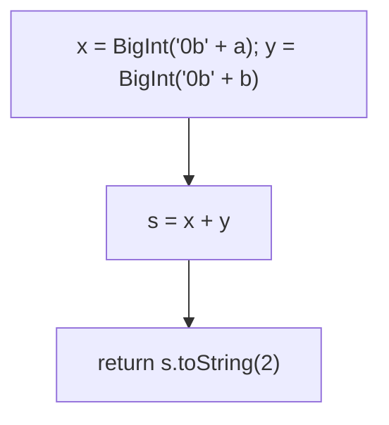
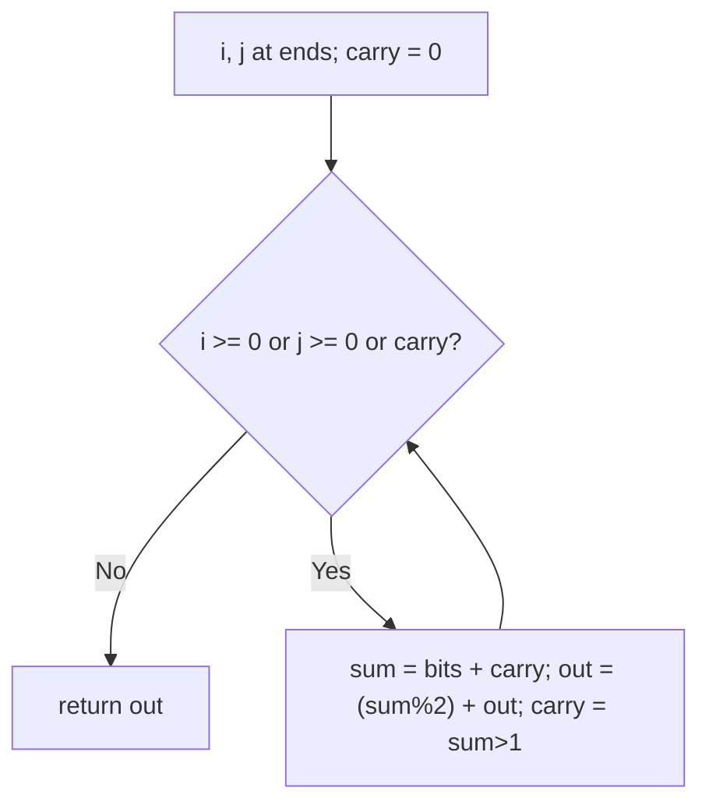

# 67. Add Binary

- **LeetCode Link**: `https://leetcode.com/problems/add-binary/`
- **Difficulty**: Easy
- **Pattern Category**: Bit Manipulation / Binary Addition
- **Prerequisite Primer**: `00-foundations/01-js-interview-runtime-quirks.md`

---

## 1. Problem Overview & Edge Case Matrix

### Problem Statement
Given two binary strings `a` and `b`, return their sum as a binary string.

```
Example 1:
Input: a = "11", b = "1"
Output: "100"

Example 2:
Input: a = "1010", b = "1011"
Output: "10101"
```

### Visual Problem Representation
```
    1 0 1 0
  + 1 0 1 1
  ---------
  1 0 1 0 1      (right-to-left with carry, like decimal addition)
```

### Upfront Edge Case Matrix
| Edge Case Category | Specific Input Scenario | Expected Behavior | Pitfall / Risk |
| :--- | :--- | :--- | :--- |
| Zeros | `"0" + "0"` | Return `"0"` | Empty result |
| Uneven lengths | `"11" + "1"` | Aligned right, carry out | Left-padding logic |
| Final carry | `"1" + "1"` | `"10"` (longer!) | Dropping the overflow bit |
| Long inputs | $10^4$ bits | Exact string | `Number()`/`parseInt` overflow |
| All ones | `"111" + "111"` | `"1110"` | Carry chain across all bits |

---

## 2. Level 1: Brute Force Approach

### Intuition & Visual Idea
`BigInt` round-trip: parse base-2, add natively, emit base-2. Exact at any length — one expression with bignum constants.



### Pseudocode
```text
FUNCTION addBinaryBruteForce(a, b):
    RETURN STRING(BIGINT("0b" + a) + BIGINT("0b" + b), BASE 2)
```

### Step-by-Step Dry Run (Visual Trace)
| Step | Iteration / Pointer ($i, j$) | Current Value | State / Sub-array | Action Taken |
| :--- | :--- | :--- | :--- | :--- |
| 0 | parse `"11"`, `"1"` | `3n`, `1n` | Bignum values | Convert |
| 1 | add | `4n` | Native add | Increment |
| 2 | emit base 2 | `"100"` | — | Return |

### Modern JavaScript Implementation
```javascript
/**
 * Level 1: Brute Force (BigInt round-trip)
 * Time Complexity:  O(N) — conversions dominate
 * Space Complexity: O(N) — intermediate bignums and strings
 */
function addBinaryBruteForce(a, b) {
  // "0b" prefix: BigInt parses binary exactly at any length
  // (Number/parseInt would overflow past 2^53).
  return (BigInt('0b' + a) + BigInt('0b' + b)).toString(2);
}
```

### Complexity Breakdown
- **Time Complexity**: $O(N)$ — linear, but with bignum conversion constants.
- **Space Complexity**: $O(N)$ — strings plus BigInt digits; digit addition needs $O(N)$ output only.

---

## 3. Level 2: Optimized Approach

### Intuition & Visual Bottleneck Elimination
Manual right-to-left addition with carry, prepending each result bit. No bignum — but string prepend copies $O(N)$ per digit ($O(N^2)$ total), the classic hidden quadratic.



### Pseudocode
```text
FUNCTION addBinaryPrepend(a, b):
    i = LAST(a); j = LAST(b); carry = 0; out = ""
    WHILE i >= 0 OR j >= 0 OR carry > 0:
        sum = (i >= 0 ? DIGIT(a[i--]) : 0) + (j >= 0 ? DIGIT(b[j--]) : 0) + carry
        out = STRING(sum MOD 2) + out   // prepend: O(N) copy per bit
        carry = (sum > 1) ? 1 : 0
    RETURN out
```

### Step-by-Step Dry Run (Visual Trace)
| Step | Pointers / Window | Hash Map / Auxiliary State | Decision Logic | Output Accumulator |
| :--- | :--- | :--- | :--- | :--- |
| 0 | `i=1, j=0`, `"11"+"1"` | `1+1+0 = 2` | Bit `0`, carry `1` | `out = "0"` |
| 1 | `i=0, j=-1` | `1+0+1 = 2` | Bit `0`, carry `1` | `out = "00"` |
| 2 | `i=-1, j=-1` | carry `1` | Bit `1`, carry `0` | `out = "100"` |

### Modern JavaScript Implementation
```javascript
/**
 * Level 2: Optimized (manual carry with string prepend)
 * Time Complexity:  O(N²) — prepend copies the result per digit
 * Space Complexity: O(N) — output string
 */
function addBinaryPrepend(a, b) {
  let i = a.length - 1;
  let j = b.length - 1;
  let carry = 0;
  let out = '';
  while (i >= 0 || j >= 0 || carry > 0) {
    // Unary plus coerces '0'/'1' chars (guarded indices give 0 when spent).
    const sum = (i >= 0 ? +a[i--] : 0) + (j >= 0 ? +b[j--] : 0) + carry;
    out = (sum % 2) + out; // PREPEND: O(N) string copy per bit (the tax)
    carry = sum > 1 ? 1 : 0;
  }
  return out;
}
```

### Complexity Breakdown
- **Time Complexity**: $O(N^2)$ — prepend-copy per digit dominates.
- **Space Complexity**: $O(N)$ — output string; the copy pattern is the remaining tax.

---

## 4. Level 3: Most Optimal / Canonical Approach

### Intuition & Mathematical / Invariant Proof
Same carry loop, appending to an array and reversing once: $N$ pushes + one reverse = $O(N)$ total. Bit ops (`sum & 1`, `sum >> 1`) replace mod/compare — identical values, branch-free flavor. Invariant: after processing position $k$ from the right, `out` holds the $k$ lowest result bits in reverse, and `carry` is the exact overflow into position $k+1$. Loop condition `|| carry` emits the final overflow bit (the all-ones case).

```
"11"+"1": (1,1,c0): sum 2 -> push 0, carry 1; (1,-,c1): sum 2 -> push 0, carry 1;
  (-,-,c1): sum 1 -> push 1, carry 0 -> reverse "001"... wait [0,0,1] reversed = "100" ✓
```

### Pseudocode
```text
FUNCTION addBinary(a, b):
    i = LAST(a); j = LAST(b); carry = 0; out = []
    WHILE i >= 0 OR j >= 0 OR carry > 0:
        sum = (i >= 0 ? BIT(a[i--]) : 0) + (j >= 0 ? BIT(b[j--]) : 0) + carry
        out.PUSH(sum & 1)
        carry = sum >> 1
    RETURN REVERSE(out).JOIN("")
```

### Step-by-Step Dry Run (Visual Trace)
| Step | Pointer $L$ | Pointer $R$ | Invariant Checked | In-Place State |
| :--- | :--- | :--- | :--- | :--- |
| 1 | `i=1, j=0` | sum `2` | Push `0`, carry `1` | `out = [0]` |
| 2 | `i=0, j=-1` | sum `2` | Push `0`, carry `1` | `out = [0,0]` |
| 3 | `i=-1, j=-1` | carry `1` → sum `1` | Push `1`, carry `0` | Reverse → `"100"` |

### Modern JavaScript Implementation
```javascript
/**
 * Level 3: Most Optimal / Canonical (carry loop + single reverse)
 * Time Complexity:  O(N) — one pass plus one reverse, optimal
 * Space Complexity: O(N) — output array (required output)
 */
function addBinary(a, b) {
  let i = a.length - 1;
  let j = b.length - 1;
  let carry = 0;
  const out = [];
  // The || carry clause emits the final overflow bit (all-ones inputs).
  while (i >= 0 || j >= 0 || carry > 0) {
    // charCodeAt - 48 avoids unary-plus string paths (same values, faster).
    const sum = (i >= 0 ? a.charCodeAt(i--) - 48 : 0) + (j >= 0 ? b.charCodeAt(j--) - 48 : 0) + carry;
    out.push(sum & 1); // low bit of 0/1/2 -> 0/1/0
    carry = sum >> 1; // 0/1/2 -> 0/0/1 (overflow iff sum == 2)
  }
  return out.reverse().join('');
}
```

### Complexity Breakdown
- **Time Complexity**: $O(N)$ — optimal; each bit position processed once.
- **Space Complexity**: $O(N)$ — output array (required output).

---

## 5. JavaScript-Specific Gotchas & V8 Optimizations
- **GC Pressure**: Avoid allocating objects inside tight loops ($O(N)$ closures). Level 2's per-digit prepend allocates $N$ progressively-longer strings ($O(N^2)$ chars total) — Level 3's single array + one reverse is the minimal allocation shape.
- **Type Coercion / Sorting**: `+a[i]` coerces `'0'/'1'` (safe here — single binary chars); `Number()`/`parseInt` on the WHOLE string overflows past $2^{53}$ (spec max $10^4$ bits!). `charCodeAt - 48` skips coercion machinery for hot loops.
- **Index Bounds**: Guarded reads (`i >= 0 ? … : 0`) handle uneven lengths without padding strings; the `|| carry` loop clause (not just indices) is what emits the length-growing overflow bit — dropping it truncates `"1"+"1"` to `"0"`.

---

## 6. Real-World MAANG Interview Follow-Ups & Extensions

### Follow-Up 1: Add in other bases / decimal strings
- **Scenario**: Add base-$B$ or decimal strings (LeetCode 415).
- **Solution Strategy**: Level 3's kernel with `sum % B` / `floor(sum / B)` (digit thresholds generalize); decimal uses `% 10`. Same loop, parameterized radix.
- **JS Code / Implementation Pattern**:
```javascript
function addStringsBase(a, b, base) {
  return carryLoop(a, b, base); // Level 3 with % base and / base
}
```

### Follow-Up 2: $10^9$-bit routed addition (streaming)
- **Scenario**: Operands stream MSB-first (wrong end!) or in chunks.
- **Solution Strategy**: Buffer chunks and process LSD-first (reverse chunk order), propagating one carry bit between chunks — $O(1)$ RAM beyond output. MSB-first streams need full buffering (honest lower bound: addition flows LSD-first).
- **JS Code / Implementation Pattern**:
```javascript
async function addBinaryStreamed(aChunks, bChunks) {
  return lsdFirstAdd(aChunks, bChunks); // one carry bit of state
}
```

### Follow-Up 3: Bitwise-only addition (no + operator)
- **Scenario & In-Depth Solution**: Implement `a + b` using only `&`, `|`, `^`, `<<` (the classic): sum bits = `a ^ b`, carries = `(a & b) << 1`, iterate until no carry. $O(\text{bits})$ rounds. Shows what the `+` circuit actually does.
```javascript
function addBitwise(a, b) {
  while (b !== 0) {
    const carry = (a & b) << 1;
    a ^= b;
    b = carry;
  }
  return a;
}
```
