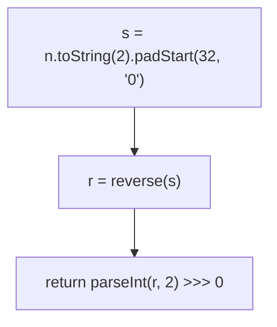
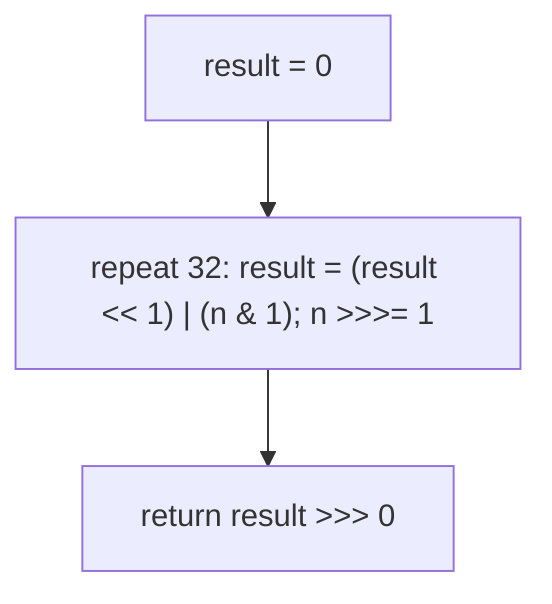

# 190. Reverse Bits

- **LeetCode Link**: `https://leetcode.com/problems/reverse-bits/`
- **Difficulty**: Easy
- **Pattern Category**: Bit Manipulation / Bit Permutation
- **Prerequisite Primer**: `00-foundations/01-js-interview-runtime-quirks.md`

---

## 1. Problem Overview & Edge Case Matrix

### Problem Statement
Reverse bits of a given 32-bit unsigned integer. Note that in some languages, there are no unsigned integer types — return the result as an unsigned value (in JS, coerce with `>>> 0`).

```
Example 1:
Input: n = 43261596 (00000010100101000001111010011100)
Output: 964176192 (00111001011110000010100101000000)

Example 2:
Input: n = 4294967293 (11111111111111111111111111111101)
Output: 3221225471 (10111111111111111111111111111111)
```

### Visual Problem Representation
```
in:   00000010100101000001111010011100
out:  00111001011110000010100101000000   (mirror image, bit 0 <-> bit 31)
```

### Upfront Edge Case Matrix
| Edge Case Category | Specific Input Scenario | Expected Behavior | Pitfall / Risk |
| :--- | :--- | :--- | :--- |
| Zero | `n = 0` | Return `0` | Loop that needs set bits |
| All ones | `n = 2³² − 1` | Return `2³² − 1` (palindromic) | Signed `-1` return |
| Single bit | `n = 1` / `n = 2³¹` | `2³¹` / `1` (edge swap) | Shift direction confusion |
| Signed trap | Bit 31 set in result | UNSIGNED return (`>>> 0`) | Negative number returned |
| Alternating | `0xAAAAAAAA` | `0x55555555` | Mask typos |

---

## 2. Level 1: Brute Force Approach

### Intuition & Visual Idea
String round-trip: 32-bit binary string (left-padded), reversed, parsed back with unsigned coercion. Obviously correct — three conversions for 32 bit moves.



### Pseudocode
```text
FUNCTION reverseBitsBruteForce(n):
    s = BINARY-STRING(n) PADDED TO 32
    r = REVERSE(s)
    RETURN PARSE-BINARY(r) AS UNSIGNED
```

### Step-by-Step Dry Run (Visual Trace)
| Step | Iteration / Pointer ($i, j$) | Current Value | State / Sub-array | Action Taken |
| :--- | :--- | :--- | :--- | :--- |
| 0 | `n = 43261596` | `"00000010100101000001111010011100"` | 32-char pad | Convert |
| 1 | reverse | `"00111001011110000010100101000000"` | Mirror | Reverse |
| 2 | parse + `>>> 0` | `964176192` | Unsigned coerce | Return |

### Modern JavaScript Implementation
```javascript
/**
 * Level 1: Brute Force (string reverse round-trip)
 * Time Complexity:  O(1) — fixed 32-bit width (with big string constants)
 * Space Complexity: O(1) — two 32-char strings
 */
function reverseBitsBruteForce(n) {
  // padStart(32): toString drops leading zeros that reversal needs.
  const s = n.toString(2).padStart(32, '0');
  const r = [...s].reverse().join('');
  // >>> 0 coerces to UNSIGNED 32-bit (parseInt alone may give > 2^31 fine,
  // but results with bit 31 set need the unsigned guarantee downstream).
  return parseInt(r, 2) >>> 0;
}
```

### Complexity Breakdown
- **Time Complexity**: $O(1)$ — fixed width; string machinery for bit work.
- **Space Complexity**: $O(1)$ — short strings; the technique doesn't scale past fixed widths.

---

## 3. Level 2: Optimized Approach

### Intuition & Visual Bottleneck Elimination
Bit-by-bit transfer: 32 rounds of "shift result left, OR in the lowest bit of n, shift n right (unsigned)". Pure arithmetic, no strings — the standard answer.



### Pseudocode
```text
FUNCTION reverseBitsLoop(n):
    result = 0
    REPEAT 32 TIMES:
        result = (result << 1) | (n & 1)
        n >>>= 1    // UNSIGNED shift: fills 0, never sign-extends
    RETURN result >>> 0
```

### Step-by-Step Dry Run (Visual Trace)
| Step | Pointers / Window | Hash Map / Auxiliary State | Decision Logic | Output Accumulator |
| :--- | :--- | :--- | :--- | :--- |
| 0 | `n = ...01` (ends `1`) | `result = 0 → 1` | Shift in LSB | `result = 1` |
| 1 | `n >>>= 1` | next bit | Shift in | Accumulate leftward |
| 2 | 32 rounds | all bits transferred | First-consumed = leftmost out | Return `964176192` |

### Modern JavaScript Implementation
```javascript
/**
 * Level 2: Optimized (bit-by-bit transfer loop)
 * Time Complexity:  O(1) — exactly 32 iterations
 * Space Complexity: O(1) — two numbers
 */
function reverseBitsLoop(n) {
  let result = 0;
  for (let i = 0; i < 32; i++) {
    // Make room at the bottom, then OR in n's current lowest bit.
    result = (result << 1) | (n & 1);
    n >>>= 1; // UNSIGNED right shift: zero-fills (>> would sign-extend!)
  }
  return result >>> 0; // normalize: bit-31-set results stay positive
}
```

### Complexity Breakdown
- **Time Complexity**: $O(1)$ — 32 fixed iterations.
- **Space Complexity**: $O(1)$ — two numbers; loop overhead is the remaining gap.

---

## 4. Level 3: Most Optimal / Canonical Approach

### Intuition & Mathematical / Invariant Proof
Divide-and-conquer bit swaps with masks: swap 1-bit pairs, then 2-bit groups, then nibbles, bytes, and halves — $\log_2 32 = 5$ parallel steps. Each step is a perfect shuffle of progressively larger blocks; composition equals full reversal (the permutation factors). Invariant: after step $k$ (block size $2^k$), every $2^{k+1}$-block is internally half-reversed. Constant time with the smallest constant — the bit-twiddler's answer.

```
0xAAAAAAAA (1010...): swap 1s -> 0x55555555 (0101...): single step proves it
43261596 through 5 masks -> 964176192
```

### Pseudocode
```text
FUNCTION reverseBits(n):
    n = SWAP-ADJACENT-BITS(n, mask 0x55555555)
    n = SWAP-2BIT-GROUPS(n, mask 0x33333333)
    n = SWAP-NIBBLES(n, mask 0x0F0F0F0F)
    n = SWAP-BYTES(n, mask 0x00FF00FF)
    n = (n >>> 16) | (n << 16)
    RETURN n >>> 0
```

### Step-by-Step Dry Run (Visual Trace)
| Step | Pointer $L$ | Pointer $R$ | Invariant Checked | In-Place State |
| :--- | :--- | :--- | :--- | :--- |
| 1 | mask `0x55…` | 1-bit pairs swapped | Halves of pairs exchanged | — |
| 2 | mask `0x33…` | 2-bit groups swapped | Quarters exchanged | — |
| 3 | mask `0x0F…` | nibbles swapped | Octets half-done | — |
| 4 | mask `0x00FF…` | bytes swapped | 16-bit halves ready | — |
| 5 | halves swap | `(n>>>16)\|(n<<16)` | Full mirror | Return `>>> 0` |

### Modern JavaScript Implementation
```javascript
/**
 * Level 3: Most Optimal / Canonical (parallel bit-swap cascade)
 * Time Complexity:  O(1) — 5 mask steps regardless of input
 * Space Complexity: O(1) — one number, no loop
 */
function reverseBits(n) {
  // Swap odd/even bits: mask selects, shifts reposition, OR recombines.
  // >>> 0 after EVERY step: intermediate << can set bit 31 (signed trap).
  n = (((n >>> 1) & 0x55555555) | ((n & 0x55555555) << 1)) >>> 0;
  n = (((n >>> 2) & 0x33333333) | ((n & 0x33333333) << 2)) >>> 0;
  n = (((n >>> 4) & 0x0f0f0f0f) | ((n & 0x0f0f0f0f) << 4)) >>> 0;
  n = (((n >>> 8) & 0x00ff00ff) | ((n & 0x00ff00ff) << 8)) >>> 0;
  n = ((n >>> 16) | (n << 16)) >>> 0;
  return n;
}
```

### Complexity Breakdown
- **Time Complexity**: $O(1)$ — 5 steps; optimal constant for fixed-width reversal.
- **Space Complexity**: $O(1)$ — one number; no loop, no table.

---

## 5. JavaScript-Specific Gotchas & V8 Optimizations
- **GC Pressure**: Avoid allocating objects inside tight loops ($O(N)$ closures). Level 1's string+array+parse chain per call is the pressure removed — Levels 2–3 are pure register arithmetic.
- **Type Coercion / Sorting**: ALL JS bitwise ops are 32-bit SIGNED — `>>` sign-extends (use `>>>` for zero-fill), `<<` can set the sign bit (normalize with `>>> 0`), and inputs arrive as doubles (bitwise ops coerce via ToInt32 — values ≥ $2^{32}$ wrap silently; validate range at the boundary).
- **Index Bounds**: No indices — but the 32-iteration count in Level 2 is load-bearing (fewer rounds drops high bits; more rounds shifts the answer out). Mask literals (`0x55555555` etc.) must be exact — one wrong nibble permutes instead of reversing (verify against `0xAAAAAAAA → 0x55555555`).

---

## 6. Real-World MAANG Interview Follow-Ups & Extensions

### Follow-Up 1: Reverse bits of 64-bit / arbitrary-width integers
- **Scenario**: 64-bit reversal (BigInt domain — JS bitwise is 32-bit only).
- **Solution Strategy**: Split into 32-bit halves (reverse each with Level 3, swap halves) or BigInt loop (Level 2 generalized with `>>` on BigInt). Same kernels, wider words.
- **JS Code / Implementation Pattern**:
```javascript
function reverseBits64(n) {
  const HALF = 0xffffffffn;
  const lo = reverseBits(Number(n & HALF));
  const hi = reverseBits(Number((n >> 32n) & HALF));
  return (BigInt(lo) << 32n) | BigInt(hi);
}
```

### Follow-Up 2: $10^9$ reversals (lookup-table batching)
- **Scenario**: Reverse billions of words (network bit-order transcoding).
- **Solution Strategy**: 8-bit lookup table (256 entries, built once with Level 2): each word = 4 table lookups + shifts — ~4× faster than 32 loop iterations, at 256 bytes.
- **JS Code / Implementation Pattern**:
```javascript
const REV8 = buildReverseTable(); // 256-entry Uint8Array, built once
function reverseBitsTable(n) {
  return (
    (REV8[n & 0xff] << 24) | (REV8[(n >> 8) & 0xff] << 16) | (REV8[(n >> 16) & 0xff] << 8) | REV8[(n >> 24) & 0xff]
  );
}
```

### Follow-Up 3: Bit-reversal permutation (FFT ordering)
- **Scenario & In-Depth Solution**: FFTs reorder arrays by bit-reversed indices — Level 3's cascade IS the index computation, applied per element. Same masks, structural use.
```javascript
function fftBitReversePermute(arr) {
  return arr.map((_, i) => arr[reverseBits(i) >>> (32 - LOG_N)]);
}
```
