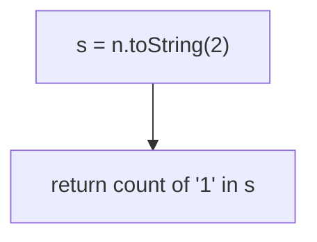
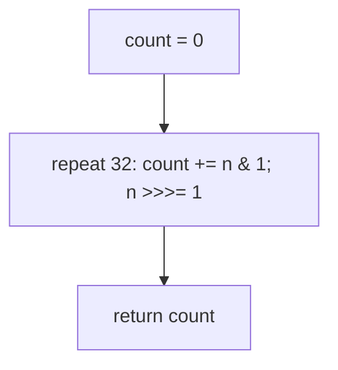

# 191. Number of 1 Bits

- **LeetCode Link**: `https://leetcode.com/problems/number-of-1-bits/`
- **Difficulty**: Easy
- **Pattern Category**: Bit Manipulation / Population Count
- **Prerequisite Primer**: `00-foundations/01-js-interview-runtime-quirks.md`

---

## 1. Problem Overview & Edge Case Matrix

### Problem Statement
Given an integer `n`, return the number of `1` bits in its binary representation (the Hamming weight / population count).

```
Example 1:
Input: n = 11 (1011)
Output: 3

Example 2:
Input: n = 128 (10000000)
Output: 1

Example 3:
Input: n = 4294967293 (11111111111111111111111111111101)
Output: 31
```

### Visual Problem Representation
```
n = 11 = 1 0 1 1
         ^   ^ ^      three set bits -> 3
```

### Upfront Edge Case Matrix
| Edge Case Category | Specific Input Scenario | Expected Behavior | Pitfall / Risk |
| :--- | :--- | :--- | :--- |
| Zero | `n = 0` | Return `0` | Loop needing set bits |
| All ones | `n = 2³² − 1` | Return `32` | Signed `-1` infinite loop (`>>` never clears) |
| Single bit | Powers of two | Return `1` | Off-by-one in shift count |
| High bit set | `n ≥ 2³¹` | Correct count | `>>` sign-extension (use `>>>`) |
| Alternating | `0xAAAAAAAA` | Return `16` | Mask typos |

---

## 2. Level 1: Brute Force Approach

### Intuition & Visual Idea
Binary string + character count: `toString(2)` then count `'1'`s. Obviously correct — string machinery for a bitwise question.



### Pseudocode
```text
FUNCTION hammingWeightBruteForce(n):
    count = 0
    FOR ch IN BINARY-STRING(n):
        IF ch == "1": count++
    RETURN count
```

### Step-by-Step Dry Run (Visual Trace)
| Step | Iteration / Pointer ($i, j$) | Current Value | State / Sub-array | Action Taken |
| :--- | :--- | :--- | :--- | :--- |
| 0 | `n = 11` | `"1011"` | Convert | — |
| 1 | scan chars | `1, 0, 1, 1` | Count ones | `count = 3` |
| 2 | return | — | — | Return `3` |

### Modern JavaScript Implementation
```javascript
/**
 * Level 1: Brute Force (string popcount)
 * Time Complexity:  O(log n) — digit count of the binary form
 * Space Complexity: O(log n) — the string
 */
function hammingWeightBruteForce(n) {
  let count = 0;
  for (const ch of n.toString(2)) {
    if (ch === '1') count++; // strict char compare (not truthiness)
  }
  return count;
}
```

### Complexity Breakdown
- **Time Complexity**: $O(\log n)$ — binary digit count.
- **Space Complexity**: $O(\log n)$ — the string; bits deserve arithmetic.

---

## 3. Level 2: Optimized Approach

### Intuition & Visual Bottleneck Elimination
Shift-and-test 32 times: check the lowest bit, unsigned-shift right, repeat. Pure arithmetic, fixed width — the standard answer.



### Pseudocode
```text
FUNCTION hammingWeightLoop(n):
    count = 0
    REPEAT 32 TIMES:
        count += n & 1
        n >>>= 1    // UNSIGNED: high-bit inputs must clear in 32 steps
    RETURN count
```

### Step-by-Step Dry Run (Visual Trace)
| Step | Pointers / Window | Hash Map / Auxiliary State | Decision Logic | Output Accumulator |
| :--- | :--- | :--- | :--- | :--- |
| 0 | `n = 11` (`1011`) | `n & 1 = 1` | Count, shift | `count = 1`, `n = 5` |
| 1 | `n = 5` (`101`) | `n & 1 = 1` | Count, shift | `count = 2`, `n = 2` |
| 2 | `n = 2` (`10`) | `n & 1 = 0` | Shift only | `count = 2`, `n = 1` |
| 3 | `n = 1` | `n & 1 = 1` | Count, shift | `count = 3`, rest zeros |

### Modern JavaScript Implementation
```javascript
/**
 * Level 2: Optimized (32-round shift-and-test)
 * Time Complexity:  O(1) — exactly 32 iterations
 * Space Complexity: O(1) — two numbers
 */
function hammingWeightLoop(n) {
  let count = 0;
  for (let i = 0; i < 32; i++) {
    count += n & 1; // lowest bit contributes 0/1 directly (no branch)
    n >>>= 1; // UNSIGNED shift: >> would sign-extend bit-31 inputs forever
  }
  return count;
}
```

### Complexity Breakdown
- **Time Complexity**: $O(1)$ — 32 fixed rounds.
- **Space Complexity**: $O(1)$ — two numbers; rounds scale with width, not weight.

---

## 4. Level 3: Most Optimal / Canonical Approach

### Intuition & Mathematical / Invariant Proof
`n & (n-1)` clears the LOWEST set bit — each iteration removes exactly one `1`, so iterations equal the answer (not the width). Invariant: the loop runs precisely `popcount` times. Why it works: subtracting 1 flips the lowest set bit to 0 and all lower bits to 1; ANDing with `n` (whose lower bits are 0 there) clears exactly that bit, preserving higher bits. Sparse inputs finish in a handful of rounds — optimal for the general case.

```
11 (1011): 1011 & 1010 = 1010 (count 1); 1010 & 1001 = 1000 (count 2);
  1000 & 0111 = 0000 (count 3) -> 0, stop. 3 rounds, not 32.
```

### Pseudocode
```text
FUNCTION hammingWeight(n):
    count = 0
    WHILE n != 0:
        n = n & (n - 1)   // amputate the lowest set bit
        count++
    RETURN count
```

### Step-by-Step Dry Run (Visual Trace)
| Step | Pointer $L$ | Pointer $R$ | Invariant Checked | In-Place State |
| :--- | :--- | :--- | :--- | :--- |
| 1 | `n = 11` (`1011`) | `n & (n-1) = 1010` | One bit cleared | `count = 1` |
| 2 | `n = 10` (`1010`) | `& 1001 = 1000` | One bit cleared | `count = 2` |
| 3 | `n = 8` (`1000`) | `& 0111 = 0` | Last bit cleared | `count = 3`, exit |

### Modern JavaScript Implementation
```javascript
/**
 * Level 3: Most Optimal / Canonical (low-bit amputation)
 * Time Complexity:  O(k) — k = popcount (≤ 32); optimal for sparse inputs
 * Space Complexity: O(1) — one number
 */
function hammingWeight(n) {
  let count = 0;
  // Each round deletes exactly one 1-bit: rounds == answer, not width.
  // (n-1) flips the lowest 1 to 0 (and lowers to 1); AND clears just it.
  // Note: n treated as 32-bit via bitwise coercion — matches spec range.
  while (n !== 0) {
    n &= n - 1;
    count++;
  }
  return count;
}
```

### Complexity Breakdown
- **Time Complexity**: $O(k)$, $k$ = set-bit count — optimal; dense inputs match Level 2, sparse inputs crush it.
- **Space Complexity**: $O(1)$ — one number; no loop bound needed.

---

## 5. JavaScript-Specific Gotchas & V8 Optimizations
- **GC Pressure**: Avoid allocating objects inside tight loops ($O(N)$ closures). Level 1's string (plus spread/iteration) per call is the pressure removed — Levels 2–3 are pure register arithmetic.
- **Type Coercion / Sorting**: Bitwise ops coerce via ToInt32 — inputs ≥ $2^{32}$ wrap SILENTLY (spec caps at $2^{32}-1$; validate at the boundary otherwise). `>>` vs `>>>` is THE input-range trap: `>>` on negative/`2³¹+` inputs sign-extends and Level 2 loops either miscounts or never terminates... precisely, `>>=` arithmetic-shifts `1`s in forever for negative int32 (infinite loop); `>>>=` always terminates in ≤ 32 steps.
- **Index Bounds**: No indices — but the 32-iteration bound in Level 2 must be EXACT (fewer drops high bits; the count is silently short). Level 3 needs no bound at all (zero-termination is structural).

---

## 6. Real-World MAANG Interview Follow-Ups & Extensions

### Follow-Up 1: 64-bit / BigInt popcount
- **Scenario**: Values past 32 bits (BigInt domain).
- **Solution Strategy**: Level 3's kernel ports verbatim to BigInt (`n &= n - 1n`); Level 2 generalizes to a bit-length loop. Same invariants, wider words.
- **JS Code / Implementation Pattern**:
```javascript
function hammingWeightBig(n) {
  let count = 0n;
  while (n !== 0n) {
    n &= n - 1n;
    count++;
  }
  return count;
}
```

### Follow-Up 2: $10^9$ popcounts (table batching)
- **Scenario**: Count bits across billions of words (bitmap analytics).
- **Solution Strategy**: 8-bit lookup table (256 entries) + 4 lookups per word — ~8× faster than 32 shifts; SWAR (parallel nibble sums in one 64-bit word) for the extreme end.
- **JS Code / Implementation Pattern**:
```javascript
const POP8 = buildPopTable(); // 256-entry Uint8Array, built once
function popcount32Table(n) {
  return POP8[n & 0xff] + POP8[(n >> 8) & 0xff] + POP8[(n >> 16) & 0xff] + POP8[(n >> 24) & 0xff];
}
```

### Follow-Up 3: Parity / error-correcting codes on streams
- **Scenario & In-Depth Solution**: Streaming parity checks (ECC, checksums): popcount mod 2 per block, folding via XOR trees. Level 3's trick generalizes — `x ^= x >> 16; x ^= x >> 8; ...` folds parity in $\log$ steps without counting (the classic parity fold).
```javascript
function parity32(n) {
  n ^= n >> 16;
  n ^= n >> 8;
  n ^= n >> 4;
  n &= 0xf;
  return (0x6996 >> n) & 1; // nibble-parity lookup in a constant
}
```
