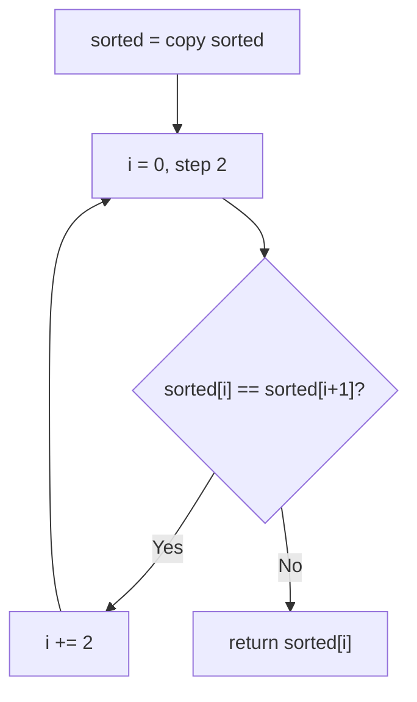
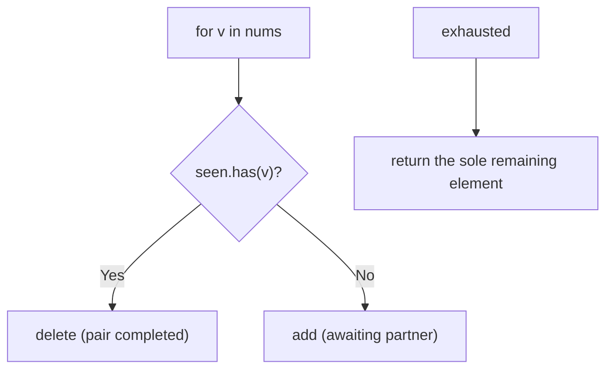
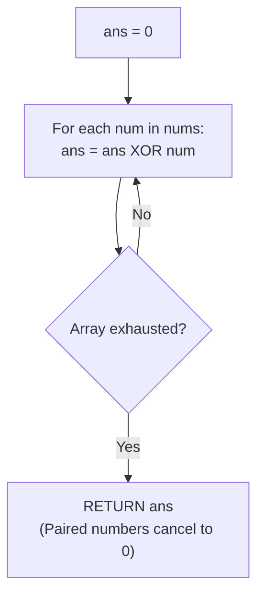

# 136. Single Number

- **LeetCode Link**: `https://leetcode.com/problems/single-number/`
- **Difficulty**: Easy
- **Pattern Category**: Bit Manipulation / XOR Cancellation
- **Prerequisite Primer**: `00-foundations/01-js-interview-runtime-quirks.md`

---

## 1. Problem Overview & Edge Case Matrix

### Problem Statement
Given a non-empty array of integers `nums`, every element appears twice except for one. Find that single one. Follow-up: implement with linear runtime and constant extra space.

```
Example 1:
Input: nums = [2,2,1]
Output: 1

Example 2:
Input: nums = [4,1,2,1,2]
Output: 4

Example 3:
Input: nums = [1]
Output: 1
```

### Visual Problem Representation
```
[4,1,2,1,2]:  4 ^ 1 ^ 2 ^ 1 ^ 2 = 4 ^ (1^1) ^ (2^2) = 4 ^ 0 ^ 0 = 4
               pairs annihilate under XOR; the singleton survives
```

### Upfront Edge Case Matrix
| Edge Case Category | Specific Input Scenario | Expected Behavior | Pitfall / Risk |
| :--- | :--- | :--- | :--- |
| Single Element | `[1]` | Return `1` | Loop needing pairs |
| Singleton first/last | `[4,…]` / `[…,4]` | Found regardless of position | Early-exit logic |
| Negatives | `[-1,-1,-2]` | Return `-2` | XOR sign-bit handling (works: two's complement) |
| Zero singleton | `[0,1,1]` / `[2,2,0]` | Return `0` | Falsy-value short-circuits |
| Large values | Near $\pm 2^{31}$ | Exact | 32-bit XOR truncation beyond int32 |

---

## 2. Level 1: Brute Force Approach

### Intuition & Visual Idea
Sort a copy, then walk pairs: the first element differing from its partner is the singleton. $O(N \log N)$ — pairing made visible through order.



### Pseudocode
```text
FUNCTION singleNumberBruteForce(nums):
    sorted = SORTED-COPY(nums)
    FOR i IN 0, 2, 4, ... < sorted.LENGTH:
        IF sorted[i] != sorted[i+1]: RETURN sorted[i]
```

### Step-by-Step Dry Run (Visual Trace)
| Step | Iteration / Pointer ($i, j$) | Current Value | State / Sub-array | Action Taken |
| :--- | :--- | :--- | :--- | :--- |
| 0 | sort `[4,1,2,1,2]` | `[1,1,2,2,4]` | Ordered pairs | — |
| 1 | `i = 0` | `1 == 1` | Pair, skip | `i = 2` |
| 2 | `i = 2` | `2 == 2` | Pair, skip | `i = 4` |
| 3 | `i = 4` | `4 != undefined` | Unpaired | Return `4` |

### Modern JavaScript Implementation
```javascript
/**
 * Level 1: Brute Force (sort + pair scan)
 * Time Complexity:  O(N log N) — sort dominates
 * Space Complexity: O(N) — sorted copy
 */
function singleNumberBruteForce(nums) {
  // Copy first: the caller's order is none of our business.
  const sorted = [...nums].sort((a, b) => a - b);
  for (let i = 0; i < sorted.length; i += 2) {
    // Pairs agree; the singleton disagrees with its (missing) partner.
    // At the tail, sorted[i+1] is undefined !== any number: still correct.
    if (sorted[i] !== sorted[i + 1]) return sorted[i];
  }
}
```

### Complexity Breakdown
- **Time Complexity**: $O(N \log N)$ — sort dominates.
- **Space Complexity**: $O(N)$ — the copy; counting needs no order at all.

---

## 3. Level 2: Optimized Approach

### Intuition & Visual Bottleneck Elimination
Toggle-set: add unseen values, delete seen ones — pairs annihilate, leaving exactly the singleton. $O(N)$ time, $O(N)$ space — the follow-up's time bound without its space bound.



### Pseudocode
```text
FUNCTION singleNumberSet(nums):
    seen = EMPTY SET
    FOR v IN nums:
        IF seen HAS v: seen.DELETE(v)
        ELSE: seen.ADD(v)
    RETURN THE ONLY ELEMENT OF seen
```

### Step-by-Step Dry Run (Visual Trace)
| Step | Pointers / Window | Hash Map / Auxiliary State | Decision Logic | Output Accumulator |
| :--- | :--- | :--- | :--- | :--- |
| 0 | `4` | unseen → add | `{4}` | — |
| 1 | `1` | unseen → add | `{4,1}` | — |
| 2 | `2` | unseen → add | `{4,1,2}` | — |
| 3 | `1` | seen → delete | `{4,2}` | — |
| 4 | `2` | seen → delete | `{4}` | Return `4` |

### Modern JavaScript Implementation
```javascript
/**
 * Level 2: Optimized (toggle-set annihilation)
 * Time Complexity:  O(N) — one pass, O(1) set ops
 * Space Complexity: O(N) — up to N/2 unpaired values retained
 */
function singleNumberSet(nums) {
  const seen = new Set();
  for (const v of nums) {
    // Pairs annihilate: second sighting deletes instead of counting.
    if (seen.has(v)) seen.delete(v);
    else seen.add(v);
  }
  // Exactly one value survives (spec guarantee).
  return [...seen][0];
}
```

### Complexity Breakdown
- **Time Complexity**: $O(N)$ — single pass; meets the time follow-up.
- **Space Complexity**: $O(N)$ — the set; the space follow-up needs bit tricks.

---

## 4. Level 3: Most Optimal / Canonical Approach

### Intuition & Mathematical / Invariant Proof
XOR fold: `a ^ a = 0` (self-annihilation), `a ^ 0 = a` (identity), associativity + commutativity (order-free). Every pair XORs to 0 regardless of position; the singleton XORs with 0 to itself. One accumulator, one pass, $O(1)$ space. Invariant: after processing any prefix, `acc` equals the XOR of elements appearing an odd number of times so far — at the end, exactly the singleton. This works for negatives too (two's complement is XOR-transparent).

```
4^1^2^1^2 = 4^(1^1)^(2^2) = 4^0^0 = 4   ( regroup freely: commutes )
```

### Pseudocode
```text
FUNCTION singleNumber(nums):
    acc = 0
    FOR v IN nums: acc ^= v
    RETURN acc
```

### Step-by-Step Dry Run (Visual Trace)
| Step | Pointer $L$ | Pointer $R$ | Invariant Checked | In-Place State |
| :--- | :--- | :--- | :--- | :--- |
| 1 | `v = 4` | `acc = 0^4 = 4` | Odd-count set `{4}` | — |
| 2 | `v = 1, 2` | `acc = 4^1^2` | Odd-count `{4,1,2}` | — |
| 3 | `v = 1` | `acc ^= 1` cancels | Odd-count `{4,2}` | — |
| 4 | `v = 2` | `acc ^= 2` cancels | Odd-count `{4}` | Return `4` |

### Modern JavaScript Implementation
```javascript
/**
 * Level 3: Most Optimal / Canonical (XOR annihilation)
 * Time Complexity:  O(N) — single pass, optimal lower bound
 * Space Complexity: O(1) auxiliary — one accumulator
 */
function singleNumber(nums) {
  // 0 is the XOR identity: pairs vanish (a^a=0), the singleton survives.
  // Order-free by commutativity/associativity: no sorting, no sets.
  let acc = 0;
  for (const v of nums) acc ^= v;
  return acc;
}
```

### Complexity Breakdown
- **Time Complexity**: $O(N)$ — optimal lower bound; every element folded once.
- **Space Complexity**: $O(1)$ auxiliary — one number; meets the full follow-up.

---

## 5. JavaScript-Specific Gotchas & V8 Optimizations
- **GC Pressure**: Avoid allocating objects inside tight loops ($O(N)$ closures). Level 1's sorted copy plus Level 2's `Set` (boxed entries) are the pressure Level 3 removes — one number, zero allocation.
- **Type Coercion / Sorting**: JS `^` coerces via ToInt32 — values past $\pm 2^{31}$ WRAP SILENTLY (spec range is int32, so exact here; validate at the boundary otherwise). `[...seen][0]` spread-allocates to read one survivor — `seen.values().next().value` avoids it.
- **Index Bounds**: The pair-step `i += 2` with `sorted[i+1]` possibly `undefined` is INTENTIONAL (tail singleton) — but only because `undefined` never `===` a number; with `NaN` inputs the logic inverts (everything mismatches). Validate numeric input.

---

## 6. Real-World MAANG Interview Follow-Ups & Extensions

### Follow-Up 1: Two single numbers (all others paired)
- **Scenario**: Exactly TWO singletons among pairs (LeetCode 260, Medium).
- **Solution Strategy**: XOR all → `xor = a^b` (nonzero); split by any set bit of `xor` (the singletons differ there) into two groups; XOR each group. Same kernel, one partition.
- **JS Code / Implementation Pattern**:
```javascript
function singleNumberIII(nums) {
  const xor = nums.reduce((a, v) => a ^ v, 0);
  const bit = xor & -xor; // lowest differing bit: separates the singletons
  let a = 0;
  for (const v of nums) if (v & bit) a ^= v;
  return [a, a ^ xor];
}
```

### Follow-Up 2: K-duplicates generalization (Single Number II/III family)
- **Scenario**: Elements appear $K$ times except one (LeetCode 137, next guide).
- **Solution Strategy**: Per-bit counting mod $K$ (or ones/twos state machines for $K = 3$) — XOR is the $K = 2$ special case of modular bit arithmetic.
- **JS Code / Implementation Pattern**:
```javascript
function singleNumberK(nums, K) {
  return perBitModK(nums, K); // next guide's generalization
}
```

### Follow-Up 3: $10^9$-element stream with $O(1)$ RAM (checksums)
- **Scenario & In-Depth Solution**: Values stream once; only the accumulator fits. Level 3 IS the streaming answer (XOR is order-free AND incremental) — this is also how RAID/parity and Fletcher checksums work at scale. No other level adapts.
```javascript
async function streamSingleNumber(numberStream) {
  let acc = 0;
  for await (const v of numberStream) acc ^= v;
  return acc;
}
```

---

## 7. What LeetCode Discuss Says (Language-Independent)

Source: top-voted post by Dead Inside —
`https://leetcode.com/problems/single-number/solutions/1771720/c-easy-solutions-sorting-xor-maps-or-fre-z7gp/`
— 235.1K views.
Language-independent summary. No new JS here.

### A. Optimal way from Discuss (Bitwise XOR Self-Cancellation Property)

Extract the unique solitary number in a single pass using the algebraic properties of bitwise XOR:

1. **Algebraic Invariants of XOR ($\oplus$):**
   - **Identity:** $X \oplus 0 = X$
   - **Self-Annihilation:** $X \oplus X = 0$
   - **Commutativity & Associativity:** Order and grouping do not alter the outcome:
     $$(A \oplus B \oplus A) = (A \oplus A) \oplus B = 0 \oplus B = B$$
2. **Single Pass Reduction:**
   - Initialize an accumulator `ans = 0`.
   - Traverse through every integer $x$ in `nums` and compute `ans = ans ^ x`.
   - Every paired element occurs an even number of times ($2$), annihilating itself into $0$.
   - The solitary element occurs an odd number of times ($1$), surviving as the final value of `ans`.

```text
FUNCTION singleNumber(nums):
    ans = 0
    FOR EACH x IN nums:
        ans = ans XOR x
    RETURN ans
```

- Time: O(N) — traverses the array once, executing an $O(1)$ bitwise XOR instruction per element.
- Space: O(1) — requires only a single scalar integer accumulator.



### B. Dry run on LeetCode Example 1 (`nums = [4, 1, 2, 1, 2]`)

- Initial state: `ans = 0`.
- Process 4: `ans = 0 ^ 4 = 4`.
- Process 1: `ans = 4 ^ 1`.
- Process 2: `ans = 4 ^ 1 ^ 2`.
- Process 1: `ans = (4 ^ 2) ^ (1 ^ 1) = 4 ^ 2 ^ 0 = 4 ^ 2`.
- Process 2: `ans = 4 ^ (2 ^ 2) = 4 ^ 0 = 4`.
- Final value: `4`.

### C. Why XOR Outclasses Maps and Sorting

- Hash sets and frequency tables satisfy the $O(N)$ time requirement but demand $O(N)$ additional memory, violating the problem's $O(1)$ space constraint.
- Sorting arrays satisfies $O(1)$ auxiliary space but incurs an $O(N \log N)$ sorting time penalty.
- XOR fulfills both constraints simultaneously in $O(N)$ time and $O(1)$ space without mutating the input.

### D. Pitfalls from comments

- **Non-Zero Initialization:** Starting `ans` with any value other than `0` alters the cancellation product ($C \oplus X \ne X$ when $C \ne 0$).
- **Applicability Boundary:** The XOR self-cancellation property relies strictly on duplicates appearing an even number of times. When elements appear three times, standard XOR is insufficient (requiring modular bit-counting instead).

### E. Companies

- Discuss post itself names none.
  Companies tab on LeetCode is premium-locked.
- External source:
  `https://github.com/liquidslr/leetcode-company-wise-problems`
  (LeetCode company tags, updated June 2025).
- All-time (18): Accenture, Adobe, Airbnb, Amazon, Amdocs, Bloomberg, Cisco, Cognizant, Goldman Sachs, Google, Huawei, Meta, Microsoft, Oracle, Qualcomm, Siemens, tcs, Zomato.
- Recent: 30 days — Amazon, Bloomberg, Google, Meta.
- Recent: 3 months — Amazon, Bloomberg, Google, Meta, Microsoft.
